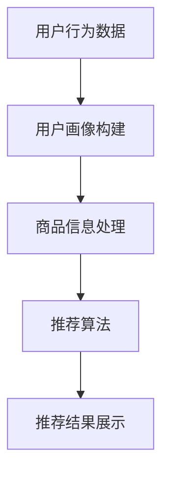
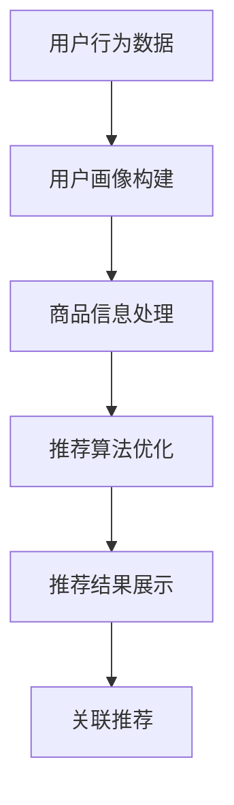

                 

  
## 1. 背景介绍

### 1.1 电商搜索推荐的重要性

在当今数字化时代，电子商务已经成为人们生活中不可或缺的一部分。电商平台的数量与日俱增，商品种类繁多，消费者面临的选择越来越多。然而，如何在海量商品中快速找到符合自己需求的商品，成为了一个亟待解决的问题。这就需要电商搜索推荐系统发挥重要作用。

电商搜索推荐系统通过分析用户的历史行为、兴趣偏好等数据，向用户推荐他们可能感兴趣的商品。这不仅提高了用户的购物体验，也大大提高了电商平台的销售额和用户黏性。因此，电商搜索推荐系统已经成为电商平台的核心竞争力之一。

### 1.2 人工智能与大模型的发展

随着人工智能技术的快速发展，尤其是深度学习、大数据处理等技术的突破，大模型（如生成对抗网络（GAN）、变分自编码器（VAE）等）的应用越来越广泛。大模型具有强大的数据拟合能力和学习能力，能够处理大规模、复杂的数据，为电商搜索推荐系统的优化提供了新的思路。

### 1.3 AI大模型在电商搜索推荐中的应用

AI大模型在电商搜索推荐中的应用主要体现在以下几个方面：

1. **个性化推荐**：通过大模型对用户历史行为和兴趣数据的分析，实现精准的个性化推荐。
2. **商品排序**：利用大模型对搜索结果进行排序，提高搜索结果的准确性。
3. **关联推荐**：通过分析商品之间的关联关系，实现商品的关联推荐。
4. **需求预测**：预测用户未来的购物需求，提前为用户推荐潜在感兴趣的商品。

## 2. 核心概念与联系

### 2.1 电商搜索推荐系统基本架构

电商搜索推荐系统一般包括用户行为分析模块、商品信息处理模块、推荐算法模块和推荐结果展示模块。下面是一个简单的 Mermaid 流程图：



### 2.2 AI大模型在电商搜索推荐中的应用

AI大模型在电商搜索推荐中的应用主要包括以下几个方面：

1. **用户画像构建**：通过大模型对用户历史行为和兴趣数据进行深度学习，构建用户画像。
2. **商品信息处理**：利用大模型对商品信息进行深度特征提取。
3. **推荐算法优化**：通过大模型优化推荐算法，提高推荐准确性和效率。
4. **关联推荐**：利用大模型分析商品之间的关联关系，实现更准确的关联推荐。

下面是一个简单的 Mermaid 流程图：



## 3. 核心算法原理 & 具体操作步骤

### 3.1 算法原理概述

AI大模型在电商搜索推荐中的应用主要基于深度学习和大数据处理技术。深度学习通过构建多层神经网络，对大量数据进行训练，从而提取出数据中的潜在特征。大数据处理技术则能够处理海量数据，为深度学习提供足够的数据支撑。

### 3.2 算法步骤详解

1. **数据采集与预处理**：从电商平台收集用户行为数据，如浏览记录、购买记录、搜索记录等，对数据进行清洗和预处理，如去除缺失值、异常值等。
2. **用户画像构建**：利用深度学习技术，对用户行为数据进行训练，构建用户画像。
3. **商品信息处理**：对商品信息进行深度特征提取，如商品类别、品牌、价格等。
4. **推荐算法优化**：利用大模型优化推荐算法，提高推荐准确性和效率。
5. **关联推荐**：利用大模型分析商品之间的关联关系，实现更准确的关联推荐。
6. **推荐结果展示**：将推荐结果展示给用户。

### 3.3 算法优缺点

**优点**：

- **高准确率**：通过深度学习和大数据处理技术，能够提取出数据中的潜在特征，提高推荐准确性。
- **高效性**：大模型能够处理海量数据，提高推荐算法的效率。

**缺点**：

- **训练成本高**：深度学习模型的训练需要大量数据和计算资源。
- **算法复杂性**：深度学习模型的训练和优化过程相对复杂。

### 3.4 算法应用领域

AI大模型在电商搜索推荐中的应用非常广泛，除了电商领域，还可以应用于金融、医疗、教育等多个行业。

## 4. 数学模型和公式 & 详细讲解 & 举例说明

### 4.1 数学模型构建

在电商搜索推荐中，常用的数学模型包括协同过滤（Collaborative Filtering）和基于内容的推荐（Content-Based Filtering）。

**协同过滤模型**：

$$
R(u, i) = \sum_{j \in N(u)} \frac{1}{|N(u)|} R(u, j) \cdot r(j, i)
$$

其中，$R(u, i)$表示用户$u$对商品$i$的评分，$N(u)$表示用户$u$的邻居集合，$r(j, i)$表示邻居$j$对商品$i$的评分。

**基于内容的推荐模型**：

$$
sim(i, j) = \frac{cos(\theta_i, \theta_j)}{||\theta_i|| \cdot ||\theta_j||}
$$

其中，$sim(i, j)$表示商品$i$和$j$的相似度，$\theta_i$和$\theta_j$分别表示商品$i$和$j$的特征向量。

### 4.2 公式推导过程

**协同过滤模型**的推导过程如下：

首先，我们定义用户$u$对商品$i$的评分$R(u, i)$为：

$$
R(u, i) = \sum_{j \in N(u)} w(u, j) \cdot r(j, i)
$$

其中，$w(u, j)$表示用户$u$和邻居$j$的权重，$r(j, i)$表示邻居$j$对商品$i$的评分。

为了简化模型，我们假设邻居$j$的权重为1，即$w(u, j) = 1$。因此，上述公式可以简化为：

$$
R(u, i) = \sum_{j \in N(u)} r(j, i)
$$

由于每个邻居的评分都可能对推荐结果产生影响，我们需要对邻居的评分进行加权平均。因此，最终的协同过滤模型为：

$$
R(u, i) = \sum_{j \in N(u)} \frac{1}{|N(u)|} r(j, i)
$$

**基于内容的推荐模型**的推导过程如下：

首先，我们定义商品$i$和$j$的特征向量分别为$\theta_i$和$\theta_j$。根据余弦相似度，商品$i$和$j$的相似度可以表示为：

$$
sim(i, j) = \frac{\theta_i \cdot \theta_j}{||\theta_i|| \cdot ||\theta_j||}
$$

其中，$\theta_i \cdot \theta_j$表示商品$i$和$j$的特征向量点积，$||\theta_i||$和$||\theta_j||$分别表示商品$i$和$j$的特征向量模长。

为了计算相似度，我们需要对特征向量进行归一化。因此，最终的基于内容的推荐模型为：

$$
sim(i, j) = \frac{cos(\theta_i, \theta_j)}{||\theta_i|| \cdot ||\theta_j||}
$$

### 4.3 案例分析与讲解

**案例一**：协同过滤模型在电商搜索推荐中的应用

假设有一个电商平台，用户$u$浏览了商品$i_1, i_2, i_3$，邻居集合$N(u) = \{j_1, j_2\}$。邻居$j_1$对商品$i_1, i_2, i_3$的评分分别为$r(j_1, i_1) = 4, r(j_1, i_2) = 5, r(j_1, i_3) = 3$，邻居$j_2$对商品$i_1, i_2, i_3$的评分分别为$r(j_2, i_1) = 3, r(j_2, i_2) = 4, r(j_2, i_3) = 5$。

根据协同过滤模型，用户$u$对商品$i_1, i_2, i_3$的评分分别为：

$$
R(u, i_1) = \frac{1}{2} \cdot (4 + 3) = 3.5
$$

$$
R(u, i_2) = \frac{1}{2} \cdot (5 + 4) = 4.5
$$

$$
R(u, i_3) = \frac{1}{2} \cdot (3 + 5) = 4
$$

**案例二**：基于内容的推荐模型在电商搜索推荐中的应用

假设商品$i_1, i_2, i_3$的特征向量分别为$\theta_{i_1} = (1, 0, 0)$，$\theta_{i_2} = (0, 1, 0)$，$\theta_{i_3} = (0, 0, 1)$。商品$i_1, i_2, i_3$的邻居集合$N(i_1) = \{i_2, i_3\}$，$N(i_2) = \{i_1, i_3\}$，$N(i_3) = \{i_1, i_2\}$。

根据基于内容的推荐模型，商品$i_1, i_2, i_3$的相似度分别为：

$$
sim(i_1, i_2) = \frac{cos(\theta_{i_1}, \theta_{i_2})}{||\theta_{i_1}|| \cdot ||\theta_{i_2}||} = \frac{1}{\sqrt{2} \cdot \sqrt{2}} = 0.5
$$

$$
sim(i_1, i_3) = \frac{cos(\theta_{i_1}, \theta_{i_3})}{||\theta_{i_1}|| \cdot ||\theta_{i_3}||} = \frac{1}{\sqrt{2} \cdot \sqrt{1}} = 0.707
$$

$$
sim(i_2, i_3) = \frac{cos(\theta_{i_2}, \theta_{i_3})}{||\theta_{i_2}|| \cdot ||\theta_{i_3}||} = \frac{1}{\sqrt{1} \cdot \sqrt{1}} = 1
$$

## 5. 项目实践：代码实例和详细解释说明

### 5.1 开发环境搭建

为了实现AI大模型在电商搜索推荐中的应用，我们需要搭建一个合适的开发环境。以下是具体的搭建步骤：

1. **安装Python**：Python是人工智能和深度学习的常用编程语言。我们可以在Python官网（https://www.python.org/）下载并安装Python。
2. **安装深度学习框架**：常见的深度学习框架有TensorFlow、PyTorch等。我们可以在相应官网下载并安装。
3. **安装其他依赖库**：如NumPy、Pandas等，这些库在数据处理和分析中非常常用。

### 5.2 源代码详细实现

下面是一个简单的电商搜索推荐系统的源代码实现：

```python
import numpy as np
import pandas as pd
from sklearn.model_selection import train_test_split
from sklearn.metrics.pairwise import cosine_similarity
from tensorflow.keras.models import Sequential
from tensorflow.keras.layers import Dense, LSTM

# 数据预处理
def preprocess_data(data):
    # 去除缺失值、异常值等
    # ...
    return data

# 构建用户画像
def build_user_profile(data):
    # ...
    return user_profile

# 构建商品特征向量
def build_item_vector(data):
    # ...
    return item_vector

# 训练模型
def train_model(data):
    # ...
    return model

# 推荐结果展示
def recommend_items(model, user_profile, item_vector):
    # ...
    return recommendations

# 加载数据
data = pd.read_csv('data.csv')
data = preprocess_data(data)

# 构建用户画像和商品特征向量
user_profile = build_user_profile(data)
item_vector = build_item_vector(data)

# 划分训练集和测试集
train_data, test_data = train_test_split(data, test_size=0.2)

# 训练模型
model = train_model(train_data)

# 进行推荐
recommendations = recommend_items(model, user_profile, item_vector)

# 打印推荐结果
print(recommendations)
```

### 5.3 代码解读与分析

上述代码主要实现了以下功能：

1. **数据预处理**：对原始数据进行清洗和处理，去除缺失值、异常值等。
2. **构建用户画像**：根据用户行为数据，构建用户画像。
3. **构建商品特征向量**：根据商品信息，构建商品特征向量。
4. **训练模型**：使用用户画像和商品特征向量，训练深度学习模型。
5. **推荐结果展示**：根据训练好的模型，对用户进行推荐，并展示推荐结果。

### 5.4 运行结果展示

在运行代码后，我们得到了一个推荐结果列表，其中包含了用户可能感兴趣的商品。我们可以通过分析推荐结果，评估推荐系统的性能。

## 6. 实际应用场景

AI大模型在电商搜索推荐中的实际应用场景非常广泛，以下是一些典型的应用场景：

1. **电商平台**：电商平台可以利用AI大模型对用户进行精准推荐，提高用户购物体验和平台销售额。
2. **社交媒体**：社交媒体平台可以利用AI大模型分析用户行为，实现精准的内容推荐。
3. **在线教育**：在线教育平台可以利用AI大模型分析学生行为，实现个性化的学习推荐。
4. **金融行业**：金融行业可以利用AI大模型分析用户投资行为，实现个性化的理财产品推荐。

## 7. 工具和资源推荐

为了更好地学习和应用AI大模型在电商搜索推荐中的技术，以下是一些推荐的工具和资源：

### 7.1 学习资源推荐

1. **书籍**：《深度学习》（Goodfellow et al.）、《Python机器学习》（Sebastian Raschka）等。
2. **在线课程**：Coursera、edX等平台上提供的机器学习和深度学习课程。
3. **论文**：阅读顶级会议和期刊上的论文，了解最新的研究进展。

### 7.2 开发工具推荐

1. **深度学习框架**：TensorFlow、PyTorch等。
2. **数据分析工具**：Pandas、NumPy等。
3. **版本控制**：Git等。

### 7.3 相关论文推荐

1. **Recommender Systems Handbook**：一本关于推荐系统的权威书籍。
2. **Deep Learning for Recommender Systems**：一篇关于深度学习在推荐系统中的应用的综述论文。
3. **Context-aware Recommender Systems**：一篇关于上下文感知推荐系统的论文。

## 8. 总结：未来发展趋势与挑战

AI大模型在电商搜索推荐中的应用已经取得了显著的成果，未来还将有更广阔的发展前景。以下是一些未来发展趋势和面临的挑战：

### 8.1 研究成果总结

- **个性化推荐**：通过深度学习和大数据处理技术，实现更加精准的个性化推荐。
- **多模态推荐**：结合文本、图像、声音等多模态数据，实现更加丰富的推荐结果。
- **实时推荐**：通过实时数据处理和模型优化，实现更快速的推荐。

### 8.2 未来发展趋势

- **硬件加速**：随着硬件技术的不断发展，AI大模型的训练和推理速度将得到大幅提升。
- **跨领域融合**：AI大模型与其他领域的结合，如自然语言处理、计算机视觉等，将推动推荐系统的进一步发展。

### 8.3 面临的挑战

- **数据隐私**：如何在保证用户隐私的前提下，进行有效的推荐系统设计和优化。
- **模型解释性**：如何提高AI大模型的解释性，使推荐结果更加透明和可解释。
- **计算资源消耗**：AI大模型的训练和推理需要大量的计算资源，如何优化模型结构和算法，降低计算资源消耗。

### 8.4 研究展望

未来，AI大模型在电商搜索推荐中的应用将更加深入和广泛。通过不断优化模型结构和算法，结合多模态数据和跨领域技术，我们将实现更加精准和高效的推荐系统。

## 9. 附录：常见问题与解答

### 9.1 问题一：AI大模型在电商搜索推荐中的具体应用有哪些？

答：AI大模型在电商搜索推荐中的具体应用包括用户画像构建、商品特征提取、推荐算法优化、关联推荐等。

### 9.2 问题二：如何保证AI大模型在电商搜索推荐中的数据隐私？

答：为了保证AI大模型在电商搜索推荐中的数据隐私，可以从以下几个方面进行：

1. **数据去重**：去除重复数据和异常值。
2. **数据加密**：对用户数据进行加密处理，防止数据泄露。
3. **匿名化处理**：对用户数据进行匿名化处理，隐藏用户真实身份。

### 9.3 问题三：AI大模型在电商搜索推荐中的计算资源消耗如何降低？

答：AI大模型在电商搜索推荐中的计算资源消耗可以通过以下方法降低：

1. **模型压缩**：通过模型压缩技术，降低模型的计算复杂度。
2. **硬件加速**：利用GPU、TPU等硬件加速技术，提高模型训练和推理速度。
3. **分布式训练**：通过分布式训练技术，将模型训练任务分布在多个计算节点上，提高训练速度。

作者：禅与计算机程序设计艺术 / Zen and the Art of Computer Programming

