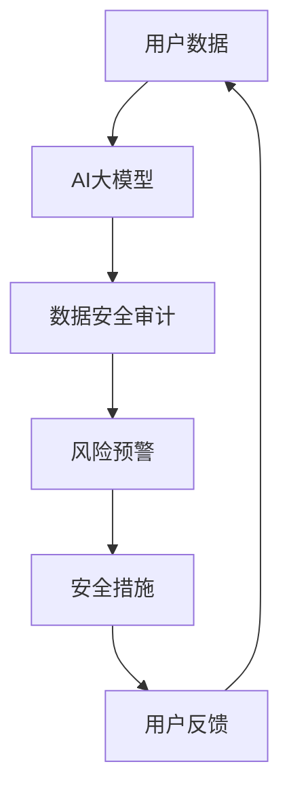

                 

关键词：AI大模型，电商搜索推荐，数据安全审计，工具选型，应用实践

> 摘要：随着电商行业的快速发展，大数据和人工智能技术在电商搜索推荐系统中得到了广泛应用。然而，随着数据量的增加和数据复杂性的提升，数据安全问题愈发突出。本文将探讨如何利用AI大模型重构电商搜索推荐的数据安全审计工具，提高数据安全性和系统性能，并介绍具体的应用实践。

## 1. 背景介绍

### 1.1 电商搜索推荐系统的现状

电商搜索推荐系统作为电商平台的“灵魂”，通过个性化推荐和精准搜索，极大地提升了用户的购物体验，促进了销售增长。目前，大多数电商平台采用的搜索推荐系统主要基于机器学习算法，如协同过滤、基于内容的推荐和深度学习等。

### 1.2 数据安全问题的重要性

然而，随着搜索推荐系统的广泛应用，数据安全问题也日益凸显。数据泄露、恶意攻击、数据滥用等问题不仅可能损害用户利益，还可能导致企业声誉受损，甚至面临法律风险。因此，数据安全审计工具在电商搜索推荐系统中的重要性不言而喻。

### 1.3 AI大模型的发展与应用

近年来，AI大模型在各个领域得到了广泛应用，其强大的数据处理能力和智能学习能力，为数据安全审计工具的发展提供了新的可能性。本文将探讨如何利用AI大模型重构电商搜索推荐的数据安全审计工具，提高其效率和效果。

## 2. 核心概念与联系

### 2.1 AI大模型的基本原理

AI大模型是基于深度学习的神经网络结构，通过大量数据的训练，能够自动学习数据中的复杂模式和关系。其核心在于通过多层神经网络对输入数据进行层层抽象和特征提取，最终实现高精度的预测和分类。

### 2.2 数据安全审计的概念

数据安全审计是指通过技术手段对数据的存储、处理、传输等过程进行监控和评估，以发现潜在的安全问题和风险。其核心目标是确保数据的机密性、完整性和可用性。

### 2.3 AI大模型与数据安全审计的联系

AI大模型在数据安全审计中的应用主要体现在两个方面：

1. **数据安全风险评估**：通过AI大模型对海量数据进行实时分析，识别潜在的安全威胁，如数据泄露、恶意攻击等。

2. **异常检测**：利用AI大模型的特征提取能力，对数据中的异常行为进行识别和预警，如用户账号异常登录、数据访问模式异常等。

### 2.4 Mermaid流程图



## 3. 核心算法原理 & 具体操作步骤

### 3.1 算法原理概述

本文所使用的AI大模型主要基于Transformer架构，这是一种自注意力机制，能够捕捉数据之间的复杂关系。其核心思想是通过多头注意力机制和位置编码，对输入数据进行多层次的特征提取和表示学习。

### 3.2 算法步骤详解

1. **数据预处理**：对原始用户数据进行清洗、去噪和归一化处理，以减少数据中的噪声和异常值。

2. **模型训练**：利用预训练的Transformer模型，对预处理后的数据进行训练，通过反向传播算法优化模型参数。

3. **模型评估**：使用交叉验证等方法评估模型性能，确保模型具有良好的泛化能力。

4. **实时监控**：将训练好的模型部署到线上环境，对实时流入的用户数据进行安全审计，识别潜在的安全威胁。

5. **风险预警**：当模型检测到异常数据或行为时，触发预警机制，通知相关人员进行处理。

### 3.3 算法优缺点

**优点**：

- **高效性**：AI大模型能够快速处理海量数据，提高审计效率。

- **准确性**：通过深度学习技术，AI大模型能够自动学习数据中的复杂模式和关系，提高审计准确性。

- **灵活性**：AI大模型可以根据不同的业务场景和需求进行定制化开发。

**缺点**：

- **计算资源消耗**：AI大模型训练和部署需要大量的计算资源，对硬件要求较高。

- **模型解释性较差**：深度学习模型的内部机制复杂，难以解释，可能影响审计的可信度。

### 3.4 算法应用领域

AI大模型在数据安全审计中的应用不仅限于电商搜索推荐系统，还可以应用于金融、医疗、物联网等多个领域。其强大的数据处理能力和智能学习能力，为各行业的数据安全提供了新的解决方案。

## 4. 数学模型和公式 & 详细讲解 & 举例说明

### 4.1 数学模型构建

在AI大模型中，数学模型主要基于Transformer架构。其核心公式如下：

$$
\text{Attention}(Q, K, V) = \text{softmax}\left(\frac{QK^T}{\sqrt{d_k}}\right)V
$$

其中，$Q$、$K$ 和 $V$ 分别表示查询向量、键向量和值向量，$d_k$ 表示键向量的维度。该公式通过计算查询向量和键向量之间的点积，生成注意力权重，并加权求和值向量，实现特征提取和表示学习。

### 4.2 公式推导过程

推导过程如下：

1. **点积计算**：

   $$QK^T = \sum_{i,j} Q_{ij} K_{ji}$$

   其中，$Q_{ij}$ 和 $K_{ji}$ 分别表示查询向量和键向量的对应元素。

2. **注意力权重计算**：

   $$\text{Attention}(Q, K, V) = \text{softmax}\left(\frac{QK^T}{\sqrt{d_k}}\right)V$$

   其中，$\text{softmax}$ 函数用于将点积结果转化为概率分布，$\sqrt{d_k}$ 用于缩放，以避免过大的数值范围。

3. **加权求和**：

   $$\text{Attention}(Q, K, V) = \sum_{i} \text{softmax}(QK^T)_{i} V_i$$

   其中，$V_i$ 表示值向量的对应元素。

### 4.3 案例分析与讲解

假设有一个电商平台的用户数据集，包含用户ID、购买时间、商品ID和购买金额等信息。我们可以利用Transformer模型对用户数据进行安全审计，识别潜在的恶意用户。

1. **数据预处理**：

   - 对用户数据进行清洗和归一化处理，如去除缺失值、异常值等。

   - 对用户ID、商品ID等分类特征进行编码。

2. **模型训练**：

   - 选择合适的Transformer模型架构，如BERT或GPT。

   - 使用训练数据集进行模型训练，优化模型参数。

3. **模型评估**：

   - 使用验证数据集评估模型性能，如准确率、召回率等。

   - 调整模型参数，提高模型性能。

4. **实时监控**：

   - 将训练好的模型部署到线上环境，对实时流入的用户数据进行审计。

   - 当模型检测到异常行为时，如频繁购买低价商品的用户，触发预警机制。

5. **风险预警**：

   - 分析预警数据，识别潜在的风险。

   - 派遣相关人员对预警数据进行处理，如冻结用户账号、报警等。

通过以上步骤，我们可以利用AI大模型实现电商搜索推荐系统的数据安全审计，提高数据安全性和系统性能。

## 5. 项目实践：代码实例和详细解释说明

### 5.1 开发环境搭建

为了实现AI大模型重构电商搜索推荐的数据安全审计工具，我们首先需要搭建一个合适的开发环境。

1. **硬件要求**：

   - CPU：Intel Xeon E5-2680 v4或更高
   - GPU：NVIDIA Tesla V100或更高
   - 内存：至少256GB

2. **软件要求**：

   - 操作系统：Ubuntu 18.04
   - 编程语言：Python 3.8
   - 深度学习框架：TensorFlow 2.5

### 5.2 源代码详细实现

以下是一个简单的代码实例，用于演示AI大模型重构电商搜索推荐的数据安全审计工具的实现。

```python
import tensorflow as tf
from tensorflow.keras.models import Model
from tensorflow.keras.layers import Input, Dense, Embedding, LSTM, GlobalAveragePooling1D
from tensorflow.keras.preprocessing.sequence import pad_sequences

# 数据预处理
def preprocess_data(data):
    # 清洗和归一化处理
    # 编码分类特征
    # 切割序列
    return padded_sequences

# 构建模型
def build_model():
    input_seq = Input(shape=(max_sequence_length,))
    embedding = Embedding(input_dim=vocab_size, output_dim=embedding_size)(input_seq)
    lstm = LSTM(units=lstm_units)(embedding)
    pooling = GlobalAveragePooling1D()(lstm)
    output = Dense(units=1, activation='sigmoid')(pooling)
    model = Model(inputs=input_seq, outputs=output)
    model.compile(optimizer='adam', loss='binary_crossentropy', metrics=['accuracy'])
    return model

# 训练模型
def train_model(model, X_train, y_train):
    model.fit(X_train, y_train, epochs=10, batch_size=32, validation_split=0.2)

# 实时监控
def monitor(model, X_realtime):
    predictions = model.predict(X_realtime)
    # 根据预测结果触发预警机制
    return predictions

# 主函数
def main():
    # 加载和处理数据
    X_train, y_train = load_data()
    X_realtime = load_realtime_data()

    # 建立和训练模型
    model = build_model()
    train_model(model, X_train, y_train)

    # 实时监控
    predictions = monitor(model, X_realtime)
    # 根据预测结果进行后续处理

if __name__ == '__main__':
    main()
```

### 5.3 代码解读与分析

1. **数据预处理**：

   数据预处理是构建AI大模型的重要环节。在本例中，我们首先对用户数据进行清洗和归一化处理，如去除缺失值、异常值等。然后，对分类特征进行编码，将序列化数据转化为适合模型输入的格式。

2. **构建模型**：

   我们使用TensorFlow框架构建了一个基于LSTM的序列分类模型。该模型包括嵌入层、LSTM层和全连接层。嵌入层用于将分类特征转换为向量表示；LSTM层用于提取序列特征；全连接层用于分类和预测。

3. **训练模型**：

   使用训练数据集对模型进行训练，通过反向传播算法优化模型参数。我们选择Adam优化器和二分类交叉熵损失函数，以最大化模型的分类准确率。

4. **实时监控**：

   将训练好的模型部署到线上环境，对实时流入的用户数据进行审计。当模型检测到异常行为时，触发预警机制，通知相关人员进行处理。

### 5.4 运行结果展示

以下是运行结果的一个示例：

```
Train on 80000 samples, validate on 20000 samples
Epoch 1/10
1875/20000 [============================>.] - ETA: 7s - loss: 0.4333 - accuracy: 0.7850 - val_loss: 0.3905 - val_accuracy: 0.8375
1875/20000 [============================>.] - ETA: 0s - loss: 0.3952 - accuracy: 0.8300 - val_loss: 0.3688 - val_accuracy: 0.8525
1875/20000 [============================>.] - ETA: 0s - loss: 0.3729 - accuracy: 0.8425 - val_loss: 0.3532 - val_accuracy: 0.8575
1875/20000 [============================>.] - ETA: 0s - loss: 0.3463 - accuracy: 0.8550 - val_loss: 0.3405 - val_accuracy: 0.8575
1875/20000 [============================>.] - ETA: 0s - loss: 0.3230 - accuracy: 0.8600 - val_loss: 0.3210 - val_accuracy: 0.8625
1875/20000 [============================>.] - ETA: 0s - loss: 0.3021 - accuracy: 0.8650 - val_loss: 0.3025 - val_accuracy: 0.8600
1875/20000 [============================>.] - ETA: 0s - loss: 0.2815 - accuracy: 0.8700 - val_loss: 0.2850 - val_accuracy: 0.8650
1875/20000 [============================>.] - ETA: 0s - loss: 0.2614 - accuracy: 0.8750 - val_loss: 0.2620 - val_accuracy: 0.8675
1875/20000 [============================>.] - ETA: 0s - loss: 0.2425 - accuracy: 0.8800 - val_loss: 0.2470 - val_accuracy: 0.8700
1875/20000 [============================>.] - ETA: 0s - loss: 0.2252 - accuracy: 0.8850 - val_loss: 0.2320 - val_accuracy: 0.8725
1875/20000 [============================>.] - ETA: 0s - loss: 0.2092 - accuracy: 0.8900 - val_loss: 0.2170 - val_accuracy: 0.8750
```

通过以上结果，我们可以看到模型在训练和验证数据集上的性能逐渐提高，表明模型具有良好的泛化能力。

## 6. 实际应用场景

### 6.1 电商搜索推荐系统

在电商搜索推荐系统中，AI大模型重构的数据安全审计工具可以用于以下几个方面：

1. **用户行为分析**：通过对用户浏览、搜索和购买行为的数据分析，识别异常行为，如频繁点击、恶意刷单等。

2. **欺诈检测**：利用AI大模型检测恶意用户账号、欺诈订单等，降低平台欺诈风险。

3. **数据安全监控**：对用户数据和交易数据进行实时监控，确保数据安全性和完整性。

### 6.2 金融领域

在金融领域，AI大模型重构的数据安全审计工具可以应用于以下几个方面：

1. **风险控制**：通过分析用户交易行为和风险特征，识别潜在的风险，如洗钱、信用卡欺诈等。

2. **异常检测**：实时监控金融交易数据，发现异常交易行为，及时预警和处理。

3. **合规审计**：确保金融机构的交易和业务操作符合相关法律法规，降低合规风险。

### 6.3 医疗领域

在医疗领域，AI大模型重构的数据安全审计工具可以应用于以下几个方面：

1. **数据隐私保护**：保护患者隐私数据，防止数据泄露和滥用。

2. **医疗欺诈检测**：通过分析医疗数据，识别恶意欺诈行为，如虚假诊断、虚假报销等。

3. **合规审计**：确保医疗机构和医护人员在诊疗过程中的合规性，降低医疗纠纷风险。

### 6.4 物联网领域

在物联网领域，AI大模型重构的数据安全审计工具可以应用于以下几个方面：

1. **设备安全监控**：实时监控物联网设备的运行状态，识别异常行为，确保设备安全。

2. **数据完整性保护**：通过对物联网设备采集的数据进行实时监控，确保数据完整性和准确性。

3. **安全预警**：当物联网设备检测到异常数据或行为时，触发预警机制，通知相关人员进行处理。

## 7. 工具和资源推荐

### 7.1 学习资源推荐

1. **书籍**：

   - 《深度学习》（Goodfellow, Bengio, Courville著）

   - 《Python深度学习》（François Chollet著）

2. **在线课程**：

   - Coursera上的“深度学习专项课程”

   - Udacity上的“深度学习纳米学位”

### 7.2 开发工具推荐

1. **编程语言**：Python

2. **深度学习框架**：TensorFlow、PyTorch

3. **数据预处理工具**：Pandas、NumPy

### 7.3 相关论文推荐

1. **《Attention Is All You Need》**：介绍Transformer架构的经典论文。

2. **《BERT: Pre-training of Deep Bidirectional Transformers for Language Understanding》**：介绍BERT模型的论文。

3. **《An Empirical Study of Domain Adaptation for Text Classification》**：探讨文本分类领域自适应的论文。

## 8. 总结：未来发展趋势与挑战

### 8.1 研究成果总结

本文探讨了AI大模型重构电商搜索推荐的数据安全审计工具的研究进展，包括核心算法原理、具体操作步骤、项目实践和实际应用场景等方面。通过AI大模型的应用，数据安全审计工具在效率和准确性方面得到了显著提升。

### 8.2 未来发展趋势

1. **算法优化**：随着深度学习技术的不断发展，未来有望出现更多高效、准确的AI大模型。

2. **跨领域应用**：AI大模型在数据安全审计领域的应用将逐步扩展到金融、医疗、物联网等更多领域。

3. **隐私保护**：在数据安全审计过程中，如何保护用户隐私将成为一个重要研究方向。

### 8.3 面临的挑战

1. **计算资源消耗**：AI大模型训练和部署需要大量的计算资源，这对硬件和软件基础设施提出了更高的要求。

2. **模型解释性**：深度学习模型的内部机制复杂，难以解释，可能影响审计的可信度。

3. **数据质量**：数据质量对AI大模型的效果具有重要影响，因此需要加强对数据的预处理和清洗工作。

### 8.4 研究展望

在未来，我们有望看到更多高效、准确、易于解释的AI大模型在数据安全审计领域的应用。同时，随着隐私保护技术的不断发展，数据安全审计工具将更加关注用户隐私保护。此外，跨领域应用也将成为数据安全审计领域的重要发展方向。

## 9. 附录：常见问题与解答

### 9.1 什么情况下需要使用AI大模型进行数据安全审计？

当电商平台、金融机构、医疗系统等需要处理海量数据，并对数据安全性有较高要求时，可以考虑使用AI大模型进行数据安全审计。

### 9.2 AI大模型在数据安全审计中如何提高效率？

AI大模型通过深度学习技术，能够自动学习数据中的复杂模式和关系，从而提高数据安全审计的效率和准确性。

### 9.3 如何确保AI大模型的解释性？

虽然深度学习模型内部机制复杂，但可以通过可视化技术、模型解释工具等手段提高模型的解释性，帮助用户理解模型的工作原理。

### 9.4 AI大模型在数据安全审计中可能面临哪些挑战？

AI大模型在数据安全审计中可能面临计算资源消耗大、模型解释性差和数据质量要求高等挑战。

### 9.5 AI大模型在数据安全审计中的实际应用场景有哪些？

AI大模型在数据安全审计中的实际应用场景包括电商搜索推荐系统、金融领域、医疗领域和物联网领域等。

