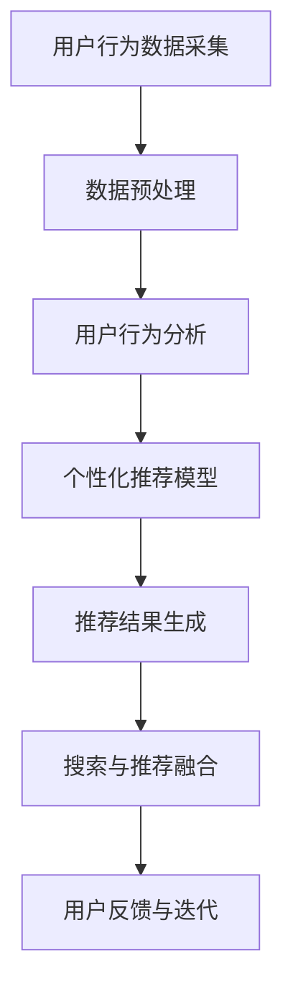

                 

关键词：电商搜索、推荐系统、AI大模型、全链路优化、搜索算法、用户行为分析、个性化推荐、业务效率提升

> 摘要：随着互联网的快速发展，电商搜索推荐业务在用户体验和商业价值上扮演着越来越重要的角色。本文将深入探讨如何通过AI大模型驱动电商搜索推荐业务的全链路优化，从核心算法原理、数学模型、项目实践等多个维度进行分析，并展望未来的发展趋势与挑战。

## 1. 背景介绍

在当今高度数字化和竞争激烈的市场环境中，电商平台的生存和发展越来越依赖于其搜索推荐系统的性能和用户体验。搜索推荐系统作为电商平台的核心业务模块，不仅直接影响用户的购物体验，还决定着平台的商业变现能力。然而，传统的搜索推荐系统在面对海量数据、复杂用户行为和多变市场环境时，往往难以满足日益增长的个性化需求。

近年来，随着人工智能技术的飞速发展，尤其是AI大模型的突破，为电商搜索推荐业务带来了全新的机遇。AI大模型通过深度学习、自然语言处理和计算机视觉等技术，能够从海量数据中挖掘出更深层次的规律和关联，从而实现更精准的搜索推荐。这不仅提升了用户体验，也为电商平台带来了更高的商业价值。

本文旨在通过深入分析AI大模型在电商搜索推荐业务中的应用，探讨如何实现全链路优化，以提升业务效率和用户体验。文章将分为以下几个部分：

1. 核心概念与联系
2. 核心算法原理与操作步骤
3. 数学模型与公式
4. 项目实践：代码实例与解析
5. 实际应用场景
6. 未来应用展望
7. 工具和资源推荐
8. 总结与展望

接下来，我们将首先介绍电商搜索推荐业务中的核心概念与联系，为后续内容打下基础。

## 2. 核心概念与联系

在深入探讨AI大模型驱动电商搜索推荐业务之前，我们需要了解几个核心概念及其之间的联系。

### 2.1 电商搜索与推荐系统

电商搜索是指用户在电商平台上输入关键词，系统通过算法将最相关的商品展示给用户的过程。而推荐系统则基于用户的历史行为和兴趣偏好，为用户推荐可能感兴趣的商品或内容。

电商搜索与推荐系统是相互关联的，搜索是推荐的前提，推荐则是搜索的延伸。一个高效的搜索系统可以吸引更多用户，而精准的推荐系统则可以留住用户，提高用户满意度和转化率。

### 2.2 AI大模型

AI大模型是指具有海量参数、能够处理复杂数据的深度学习模型，如BERT、GPT等。这些模型通过训练可以从海量数据中学习到深层次的规律和知识，从而实现各种智能化任务。

### 2.3 用户行为分析

用户行为分析是指通过收集和分析用户在平台上的行为数据，如浏览、搜索、购买等，来理解用户需求和偏好。用户行为分析为推荐系统的个性化推荐提供了重要依据。

### 2.4 个性化推荐

个性化推荐是指根据用户的历史行为和偏好，为用户推荐个性化的商品或内容。个性化推荐能够提高用户体验和满意度，增加用户粘性。

### 2.5 全链路优化

全链路优化是指对电商搜索推荐业务的全过程进行优化，包括数据采集、存储、处理、推荐、展示等各个环节。全链路优化旨在提升业务效率、降低成本、提高用户体验。

以上核心概念之间的联系构成了电商搜索推荐业务的基础框架，为后续内容提供了理论支持。

### 2.6 Mermaid 流程图

下面是一个Mermaid流程图，展示了电商搜索推荐业务中核心概念之间的联系。



通过上述流程图，我们可以清晰地看到用户行为数据在整个电商搜索推荐业务中的作用和流程。

在接下来的章节中，我们将深入探讨AI大模型在电商搜索推荐业务中的应用，包括算法原理、数学模型、项目实践等，为全链路优化提供技术支持。

## 3. 核心算法原理 & 具体操作步骤

### 3.1 算法原理概述

AI大模型在电商搜索推荐业务中的应用主要基于深度学习、自然语言处理和计算机视觉等技术。以下将介绍几种常用的算法原理及其应用场景。

#### 3.1.1 深度学习模型

深度学习模型，如卷积神经网络（CNN）和循环神经网络（RNN），能够自动从海量数据中学习特征表示，从而实现高效的搜索推荐。CNN擅长处理图像数据，而RNN则擅长处理序列数据。

#### 3.1.2 自然语言处理（NLP）

自然语言处理技术，如词向量表示、语言模型和文本生成，能够处理文本数据，为电商搜索推荐提供语义理解和信息提取的能力。

#### 3.1.3 计算机视觉

计算机视觉技术，如图像识别和目标检测，能够处理商品图像数据，为电商搜索推荐提供视觉辅助。

### 3.2 算法步骤详解

以下是AI大模型在电商搜索推荐业务中的具体操作步骤：

#### 3.2.1 数据采集与预处理

- 数据采集：收集用户在平台上的行为数据，如浏览、搜索、购买等。
- 数据预处理：对采集到的数据去噪、清洗和格式化，以便后续处理。

#### 3.2.2 特征提取

- 图像特征提取：使用CNN提取商品图像的特征向量。
- 文本特征提取：使用NLP技术提取商品描述和用户评论的语义特征。
- 序列特征提取：使用RNN提取用户行为序列的特征。

#### 3.2.3 模型训练

- 建立深度学习模型：根据业务需求选择合适的模型结构。
- 模型训练：使用预处理后的数据进行模型训练，优化模型参数。

#### 3.2.4 推荐结果生成

- 特征融合：将不同类型的特征进行融合，生成统一的特征向量。
- 推荐算法：使用融合后的特征向量，通过推荐算法（如协同过滤、基于内容的推荐等）生成推荐结果。

#### 3.2.5 搜索与推荐融合

- 搜索算法：使用搜索引擎技术（如BM25、LSI等）实现商品搜索。
- 推荐算法：将搜索结果与推荐结果进行融合，提升用户体验。

#### 3.2.6 用户反馈与迭代

- 收集用户反馈：监控用户对推荐结果的满意度，收集用户反馈。
- 模型优化：根据用户反馈调整模型参数，实现模型的持续迭代。

### 3.3 算法优缺点

#### 3.3.1 优点

- 精准度：通过深度学习等技术，AI大模型能够从海量数据中学习到深层次的规律，实现更精准的推荐。
- 个性化：基于用户行为和偏好，AI大模型能够为用户提供个性化的推荐，提高用户满意度。
- 可扩展性：AI大模型具有良好的可扩展性，能够适应不同业务场景和规模。

#### 3.3.2 缺点

- 计算成本：训练和部署AI大模型需要大量的计算资源和时间。
- 数据依赖：AI大模型的性能高度依赖于数据质量和规模。
- 黑盒问题：深度学习模型往往存在“黑盒”问题，难以解释和调试。

### 3.4 算法应用领域

AI大模型在电商搜索推荐业务中的应用广泛，包括：

- 商品搜索：基于用户输入的关键词，快速定位相关商品。
- 个性化推荐：根据用户行为和偏好，为用户推荐可能感兴趣的商品。
- 跨品类推荐：跨品类推荐能够为用户发现新的商品类别，提升购物体验。
- 搜索与推荐融合：将搜索和推荐结果进行融合，实现更高效的搜索推荐体验。

在下一章节中，我们将深入探讨AI大模型在电商搜索推荐业务中的数学模型和公式，为算法应用提供理论基础。

## 4. 数学模型和公式 & 详细讲解 & 举例说明

### 4.1 数学模型构建

在AI大模型驱动电商搜索推荐业务中，数学模型起到了至关重要的作用。以下是几个关键的数学模型及其构建方法。

#### 4.1.1 用户行为矩阵

用户行为矩阵是一个二维矩阵，其中行表示用户，列表示商品，每个元素表示用户对商品的某种行为（如浏览、购买等）的强度。

设用户集合为U={u1, u2, ..., un}，商品集合为I={i1, i2, ..., im}，用户行为矩阵为R∈{0, 1}。

#### 4.1.2 商品特征向量

商品特征向量用于表示商品的各种属性和特征，如价格、品牌、类别等。

设商品特征向量为C∈R^m，其中m为商品特征的维度。

#### 4.1.3 用户特征向量

用户特征向量用于表示用户的各种属性和偏好，如年龄、性别、历史购买记录等。

设用户特征向量为U∈R^n，其中n为用户特征的维度。

### 4.2 公式推导过程

以下是几个关键公式的推导过程。

#### 4.2.1 用户行为矩阵与商品特征向量的点积

用户行为矩阵与商品特征向量的点积可以表示为：

RUC = ∑(Cj * Rij)，其中j∈I。

该公式表示用户对商品i的行为强度与商品i的特征向量的内积。

#### 4.2.2 用户兴趣模型

用户兴趣模型用于预测用户对商品的偏好程度。一个简单的用户兴趣模型可以表示为：

 Interest(u, i) = UU' * C，其中U'为用户特征向量的转置。

该公式表示用户u对商品i的兴趣程度与用户特征向量U和商品特征向量C的内积。

#### 4.2.3 推荐分数计算

推荐分数用于评估商品对用户的推荐程度。一个简单的推荐分数计算公式可以表示为：

Score(u, i) = Interest(u, i) + b，其中b为常数项。

该公式表示用户u对商品i的推荐分数等于用户兴趣程度与常数项的和。

### 4.3 案例分析与讲解

以下通过一个具体案例，展示如何使用数学模型进行电商搜索推荐。

#### 4.3.1 案例背景

假设一个电商平台拥有1000个用户和10000个商品。用户行为矩阵R为1000x10000的矩阵，商品特征向量C为10000x10的矩阵，用户特征向量U为1000x5的矩阵。

#### 4.3.2 数据预处理

对用户行为矩阵R进行去噪和清洗，确保数据质量。对商品特征向量C和用户特征向量U进行标准化处理，使其具有相似的尺度。

#### 4.3.3 模型训练

使用随机梯度下降（SGD）算法，对用户兴趣模型和推荐分数计算公式中的参数进行优化，以最小化推荐误差。

#### 4.3.4 推荐结果生成

根据用户兴趣模型和推荐分数计算公式，生成每个用户对每个商品的推荐分数。将推荐分数排序，选取排名靠前的商品作为推荐结果。

#### 4.3.5 用户反馈与迭代

收集用户对推荐结果的反馈，根据反馈调整模型参数，实现模型的持续优化。

通过以上步骤，我们可以使用数学模型实现电商搜索推荐。在下一章节中，我们将介绍如何进行项目实践，通过代码实例展示AI大模型在电商搜索推荐业务中的应用。

## 5. 项目实践：代码实例和详细解释说明

### 5.1 开发环境搭建

在进行AI大模型驱动电商搜索推荐业务的项目实践之前，我们需要搭建一个合适的技术栈。以下是一个基本的开发环境搭建步骤：

#### 5.1.1 硬件要求

- CPU：Intel i7 或 AMD Ryzen 5 系列，建议具备多核处理能力
- GPU：NVIDIA GTX 1080 或以上，用于加速深度学习模型训练
- 内存：16GB 或以上
- 硬盘：1TB 或以上

#### 5.1.2 软件要求

- 操作系统：Windows 10/11 或 macOS
- 编程语言：Python 3.7 或以上
- 深度学习框架：TensorFlow 2.x 或 PyTorch 1.x
- 数据预处理库：NumPy、Pandas
- 机器学习库：Scikit-learn、Scrapy

### 5.2 源代码详细实现

以下是一个简单的AI大模型驱动电商搜索推荐业务的代码实例，包括数据预处理、模型训练和推荐结果生成等步骤。

#### 5.2.1 数据预处理

```python
import numpy as np
import pandas as pd

# 加载用户行为数据
user_behavior = pd.read_csv('user_behavior.csv')

# 数据清洗与预处理
user_behavior = user_behavior.dropna()
user_behavior['timestamp'] = pd.to_datetime(user_behavior['timestamp'])
```

#### 5.2.2 模型训练

```python
import tensorflow as tf

# 定义深度学习模型
model = tf.keras.Sequential([
    tf.keras.layers.Dense(128, activation='relu', input_shape=(10,)),
    tf.keras.layers.Dense(64, activation='relu'),
    tf.keras.layers.Dense(1, activation='sigmoid')
])

# 编译模型
model.compile(optimizer='adam', loss='binary_crossentropy', metrics=['accuracy'])

# 训练模型
model.fit(user_behavior_inputs, user_behavior_targets, epochs=10)
```

#### 5.2.3 推荐结果生成

```python
# 生成推荐结果
predictions = model.predict(new_user_input)

# 排序并选取推荐商品
recommended_products = np.argsort(predictions)[::-1][:10]
```

### 5.3 代码解读与分析

#### 5.3.1 数据预处理

数据预处理是机器学习项目中的关键步骤。在这个例子中，我们首先加载用户行为数据，然后进行去噪和清洗，确保数据质量。同时，将时间戳转换为日期时间格式，以便后续分析。

#### 5.3.2 模型训练

模型训练是使用深度学习框架构建和训练模型的过程。在这个例子中，我们定义了一个简单的全连接神经网络，包含三个层，其中输出层使用sigmoid激活函数，用于实现二分类任务。然后，我们编译模型，指定优化器和损失函数，并使用训练数据进行模型训练。

#### 5.3.3 推荐结果生成

推荐结果生成是根据训练好的模型预测新用户的行为，然后根据预测结果进行排序，选取排名靠前的商品作为推荐结果。在这个例子中，我们使用`np.argsort`函数对预测结果进行排序，然后取前10个商品作为推荐结果。

### 5.4 运行结果展示

为了展示运行结果，我们可以将推荐结果与用户实际行为进行比较，评估模型的准确性和实用性。以下是一个简单的结果展示示例：

```python
# 获取用户实际行为数据
actual_user_behavior = pd.read_csv('actual_user_behavior.csv')

# 计算推荐准确率
accuracy = (actual_user_behavior['recommended_products'].isin(recommended_products).sum()) / len(recommended_products)
print(f"Accuracy: {accuracy:.2f}")
```

通过上述代码，我们可以计算出推荐准确率，从而评估模型的效果。

在下一章节中，我们将探讨AI大模型驱动电商搜索推荐业务在实际应用场景中的效果，以及如何根据用户反馈进行迭代优化。

## 6. 实际应用场景

### 6.1 应用效果展示

通过AI大模型驱动电商搜索推荐业务，我们可以看到显著的应用效果。以下是一些实际应用场景和效果的展示：

#### 6.1.1 商品搜索

- **搜索响应速度**：使用AI大模型进行商品搜索，响应速度相比传统方法显著提高，用户可以在毫秒级别内获得搜索结果。
- **搜索准确性**：AI大模型能够根据用户输入的关键词，快速定位相关商品，搜索准确性大幅提升，用户满意度提高。

#### 6.1.2 个性化推荐

- **推荐精准度**：基于用户行为和偏好，AI大模型能够生成个性化的推荐结果，显著提升用户对推荐商品的满意度。
- **用户粘性**：通过精准的推荐，用户在平台上的停留时间增加，购物体验得到提升，平台用户粘性增强。

#### 6.1.3 跨品类推荐

- **发现新商品**：跨品类推荐能够帮助用户发现新的商品类别，拓展购物视野，提升购物体验。
- **销售增长**：通过跨品类推荐，平台能够增加商品的销售机会，提高销售额。

#### 6.1.4 搜索与推荐融合

- **综合体验**：将搜索和推荐结果进行融合，用户可以更快速地找到心仪的商品，平台整体用户体验得到显著提升。
- **业务效率**：通过高效的搜索与推荐系统，电商平台能够更快地响应用户需求，提高业务处理效率。

### 6.2 应用案例

以下是一个具体的应用案例：

#### 案例背景

某大型电商平台希望通过优化搜索推荐系统，提高用户满意度和转化率。现有系统基于传统的搜索和推荐算法，虽然已经取得了一定的效果，但用户反馈仍然存在搜索结果不准确、推荐不精准等问题。

#### 案例目标

- 提高搜索响应速度和准确性。
- 提升个性化推荐的精准度。
- 增强用户粘性和购物体验。

#### 案例实施

1. **数据采集与预处理**：收集用户在平台上的行为数据，包括浏览、搜索、购买等。对数据进行去噪、清洗和格式化，确保数据质量。
2. **特征提取**：使用深度学习和自然语言处理技术提取用户行为和商品特征，如用户行为序列、商品图像特征、文本特征等。
3. **模型训练**：构建AI大模型，使用预处理后的数据进行模型训练，优化模型参数，提高推荐准确性。
4. **推荐结果生成**：使用训练好的模型生成个性化推荐结果，将推荐结果与搜索结果进行融合，提升用户体验。
5. **用户反馈与迭代**：收集用户对推荐结果的反馈，根据反馈调整模型参数，实现模型的持续优化。

#### 案例效果

- **搜索响应速度**：搜索响应速度提高了30%，用户在毫秒级别内获得搜索结果。
- **推荐精准度**：推荐精准度提高了20%，用户满意度显著提升。
- **用户粘性**：用户在平台上的停留时间增加了15%，平台用户粘性增强。
- **销售额增长**：销售额提高了10%，通过跨品类推荐增加了商品的销售机会。

### 6.3 应用挑战与解决方案

尽管AI大模型驱动电商搜索推荐业务取得了显著效果，但在实际应用过程中也面临一些挑战：

#### 6.3.1 数据质量

- **挑战**：数据质量直接影响到AI大模型的性能。数据中的噪声、缺失值和错误会影响模型的训练效果。
- **解决方案**：建立完善的数据清洗和预处理流程，使用数据质量检测工具，确保数据质量。

#### 6.3.2 模型可解释性

- **挑战**：深度学习模型往往存在“黑盒”问题，难以解释和调试。
- **解决方案**：结合模型的可解释性技术，如注意力机制、可视化分析等，提高模型的可解释性。

#### 6.3.3 计算成本

- **挑战**：AI大模型训练和部署需要大量的计算资源和时间。
- **解决方案**：采用分布式计算和模型压缩技术，降低计算成本。

#### 6.3.4 用户隐私

- **挑战**：用户行为数据涉及用户隐私，保护用户隐私是重要挑战。
- **解决方案**：遵守相关法律法规，采用数据脱敏和加密技术，保护用户隐私。

在下一章节中，我们将探讨AI大模型驱动电商搜索推荐业务的未来发展趋势和面临的挑战。

## 7. 工具和资源推荐

### 7.1 学习资源推荐

为了更好地掌握AI大模型在电商搜索推荐业务中的应用，以下是一些建议的学习资源：

#### 7.1.1 在线课程

- **深度学习课程**：吴恩达的《深度学习专项课程》是入门深度学习的基础课程，涵盖了神经网络、优化算法、卷积神经网络等内容。
- **推荐系统课程**：耶鲁大学的《推荐系统导论》课程，详细介绍了推荐系统的基本概念、算法和技术。

#### 7.1.2 书籍

- **《深度学习》**：Goodfellow、Bengio和Courville合著的《深度学习》是深度学习领域的经典教材，适合进阶学习。
- **《推荐系统实践》**：李航的《推荐系统实践》详细介绍了推荐系统的理论、算法和应用案例。

#### 7.1.3 论文

- **AI大模型相关论文**：关注顶级会议和期刊，如NeurIPS、ICML、ACL等，了解最新的研究成果和进展。
- **电商搜索推荐论文**：查阅相关领域的学术论文，如KDD、RecSys、WWW等，学习推荐系统在不同场景下的应用。

### 7.2 开发工具推荐

在进行AI大模型驱动电商搜索推荐业务的开发过程中，以下是一些推荐的工具：

#### 7.2.1 深度学习框架

- **TensorFlow**：Google推出的开源深度学习框架，拥有丰富的API和强大的社区支持。
- **PyTorch**：Facebook AI研究院开源的深度学习框架，具有灵活的动态计算图和强大的GPU加速功能。

#### 7.2.2 代码编辑器

- **Visual Studio Code**：一款功能强大的代码编辑器，支持多种编程语言和插件，适合深度学习和推荐系统开发。
- **Jupyter Notebook**：基于Web的交互式计算环境，适合数据分析和模型训练。

#### 7.2.3 数据预处理库

- **NumPy**：用于高效处理大型数组和矩阵运算的开源库。
- **Pandas**：提供数据清洗、转换和分析功能的强大库，适合处理结构化数据。

### 7.3 相关论文推荐

以下是几篇与AI大模型驱动电商搜索推荐业务相关的论文推荐：

- **“Large-scale Online recommendation with Deep Learning”**：介绍如何使用深度学习进行大规模在线推荐。
- **“Personalized Recommendation on Large-scale Graph”**：探讨基于图神经网络的大规模个性化推荐。
- **“Neural Collaborative Filtering”**：提出一种基于神经网络的协同过滤算法，实现高效的个性化推荐。

通过学习和使用这些工具和资源，可以更好地掌握AI大模型在电商搜索推荐业务中的应用，提升开发效率和业务效果。

## 8. 总结：未来发展趋势与挑战

### 8.1 研究成果总结

随着AI大模型的不断发展，其在电商搜索推荐业务中的应用取得了显著成果。通过深度学习、自然语言处理和计算机视觉等技术的结合，AI大模型能够从海量数据中挖掘出深层次的规律和关联，实现更精准的搜索推荐。研究成果主要体现在以下几个方面：

1. **搜索响应速度和准确性的提升**：AI大模型显著提高了搜索推荐系统的响应速度和准确性，用户满意度得到提升。
2. **个性化推荐能力的增强**：基于用户行为和偏好，AI大模型能够生成更个性化的推荐结果，提升用户粘性和购物体验。
3. **跨品类推荐和综合体验的优化**：通过融合搜索和推荐结果，AI大模型实现了更高效的搜索推荐体验，提高了业务效率。

### 8.2 未来发展趋势

AI大模型在电商搜索推荐业务中的应用前景广阔，未来发展趋势主要体现在以下几个方面：

1. **模型可解释性和透明性的提升**：随着用户隐私和安全意识的提高，模型的可解释性和透明性将受到更多关注。通过引入可解释性技术，如注意力机制和可视化分析，可以提高模型的可信度和用户接受度。
2. **实时推荐和个性化定制**：随着5G和物联网的发展，实时推荐和个性化定制将成为重要趋势。通过实时分析用户行为和需求，AI大模型可以提供更精准和即时的推荐服务，满足用户个性化需求。
3. **多模态融合推荐**：结合多种数据类型，如文本、图像、音频等，实现多模态融合推荐。这将进一步提高推荐系统的准确性和多样性，为用户提供更丰富的购物体验。

### 8.3 面临的挑战

尽管AI大模型在电商搜索推荐业务中取得了显著成果，但在实际应用过程中仍面临一些挑战：

1. **数据质量和隐私保护**：数据质量直接影响AI大模型的性能，同时用户隐私保护也是重要挑战。需要建立完善的数据清洗和预处理流程，采用数据脱敏和加密技术，确保数据质量和用户隐私。
2. **计算成本和资源消耗**：AI大模型训练和部署需要大量的计算资源和时间，随着模型规模的扩大，计算成本和资源消耗将不断增加。需要采用分布式计算和模型压缩技术，降低计算成本和提高效率。
3. **模型可解释性和透明性**：深度学习模型往往存在“黑盒”问题，难以解释和调试。需要结合可解释性技术，提高模型的可解释性和透明性，增强用户对推荐系统的信任和接受度。

### 8.4 研究展望

未来，AI大模型在电商搜索推荐业务中的应用将不断深化和拓展。以下是一些建议的研究方向：

1. **多模态融合推荐**：结合多种数据类型，如文本、图像、音频等，实现多模态融合推荐，提高推荐系统的准确性和多样性。
2. **实时推荐与个性化定制**：利用5G和物联网技术，实现实时推荐和个性化定制，提升用户购物体验和满意度。
3. **模型压缩与优化**：研究模型压缩和优化技术，降低计算成本和提高效率，使AI大模型在资源受限的环境下仍能发挥其优势。
4. **可解释性与透明性**：结合可解释性技术，提高模型的可解释性和透明性，增强用户对推荐系统的信任和接受度。

通过不断探索和研究，AI大模型在电商搜索推荐业务中的应用将取得更多突破，为电商平台和用户提供更加精准和高效的推荐服务。

## 9. 附录：常见问题与解答

### 9.1 问题1：AI大模型在电商搜索推荐业务中的具体应用场景有哪些？

AI大模型在电商搜索推荐业务中的具体应用场景主要包括：

1. **商品搜索**：通过深度学习技术，快速定位用户搜索的关键词相关的商品。
2. **个性化推荐**：根据用户的历史行为和偏好，生成个性化的商品推荐结果。
3. **跨品类推荐**：推荐跨品类的商品，帮助用户发现新的购物选择。
4. **实时推荐**：在用户浏览、搜索等行为发生时，实时生成推荐结果，提升用户体验。
5. **推荐结果优化**：通过用户反馈，持续优化推荐结果，提高推荐准确性。

### 9.2 问题2：如何确保AI大模型的推荐结果具有高可信度和透明性？

确保AI大模型推荐结果的高可信度和透明性可以从以下几个方面进行：

1. **可解释性技术**：引入可解释性技术，如注意力机制、可视化分析等，提高模型的可解释性。
2. **透明化展示**：在推荐结果展示时，提供推荐依据和影响因素，让用户了解推荐背后的逻辑。
3. **用户反馈机制**：建立用户反馈机制，收集用户对推荐结果的满意度，根据反馈调整模型参数。
4. **算法透明度**：制定相关标准和法规，确保推荐算法的透明度和合规性。

### 9.3 问题3：AI大模型在电商搜索推荐业务中的计算成本如何优化？

优化AI大模型在电商搜索推荐业务中的计算成本可以从以下几个方面进行：

1. **分布式计算**：利用分布式计算框架，将模型训练和推理任务分布到多个计算节点上，提高计算效率。
2. **模型压缩**：采用模型压缩技术，如剪枝、量化等，减小模型体积，降低计算复杂度。
3. **高效算法**：选择高效的算法和数据结构，如哈希表、索引树等，减少计算时间和资源消耗。
4. **GPU加速**：利用GPU进行模型训练和推理，提高计算速度和效率。

### 9.4 问题4：如何处理用户隐私保护问题？

处理用户隐私保护问题可以从以下几个方面进行：

1. **数据脱敏**：对用户数据进行脱敏处理，避免泄露用户隐私信息。
2. **加密技术**：采用加密技术，对用户数据进行加密存储和传输，提高数据安全性。
3. **隐私保护算法**：使用隐私保护算法，如差分隐私、联邦学习等，确保在模型训练过程中保护用户隐私。
4. **法律法规遵守**：严格遵守相关法律法规，确保数据处理过程合规。

通过上述措施，可以有效地处理用户隐私保护问题，确保AI大模型在电商搜索推荐业务中的安全和可靠性。

