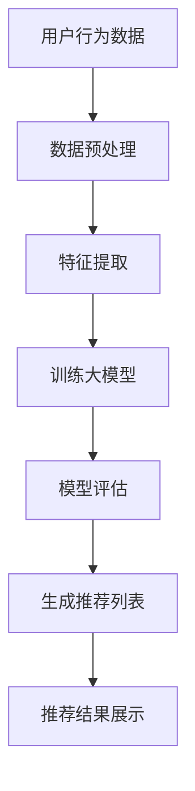

                 

## 1. 背景介绍

随着互联网的迅速发展和信息爆炸时代的来临，用户面临的信息过载问题愈发严重。如何帮助用户在海量的信息中快速找到自己感兴趣的内容，成为众多企业关注的焦点。个性化推荐系统作为一种有效的信息过滤和检索手段，被广泛应用于电子商务、社交媒体、新闻推荐等领域。传统的推荐系统主要基于协同过滤、内容过滤等技术，虽然在一定程度上能够满足用户的个性化需求，但随着用户生成内容的爆炸式增长，推荐系统的效率和准确性面临着巨大的挑战。

近年来，随着人工智能技术的快速发展，特别是深度学习和大数据技术的应用，大模型驱动的个性化推荐系统逐渐成为研究热点。大模型能够通过对海量数据的深度学习，捕捉用户行为和兴趣的复杂模式，从而实现更精准的推荐。本篇文章将深入探讨AI大模型驱动的个性化推荐系统的商业模式，包括核心概念、算法原理、数学模型、项目实践、应用场景、未来展望等内容。

<|assistant|>## 2. 核心概念与联系

### 2.1. 个性化推荐系统

个性化推荐系统是指根据用户的历史行为、偏好和上下文信息，利用算法技术自动向用户推荐其可能感兴趣的商品、内容或者服务。个性化推荐系统通常包含用户画像、推荐算法、推荐结果展示等核心模块。

- **用户画像**：通过收集用户的基本信息、行为记录、兴趣标签等，构建用户的全维度画像。
- **推荐算法**：根据用户画像和内容特征，利用算法计算推荐得分，生成推荐结果。
- **推荐结果展示**：将推荐结果以适当的形式呈现给用户，如推荐列表、推荐卡片等。

### 2.2. AI大模型

AI大模型是指基于深度学习技术，利用海量数据进行训练，能够自动学习和优化的大规模神经网络模型。AI大模型通常具有以下几个特点：

- **大规模训练数据**：AI大模型需要大量的训练数据来学习用户行为和兴趣模式。
- **深度神经网络结构**：AI大模型通常采用多层神经网络结构，能够对复杂的数据进行建模。
- **自适应学习能力**：AI大模型能够通过不断优化模型参数，提高推荐精度。

### 2.3. 商业模式

商业模式是指企业通过提供产品或服务来创造价值、获取收入并持续发展的方式。在AI大模型驱动的个性化推荐系统中，常见的商业模式包括以下几种：

- **广告收入**：通过个性化推荐系统吸引用户访问，然后展示广告，获取广告收入。
- **增值服务**：提供付费的个性化推荐服务，如高级推荐算法、精准广告定位等。
- **电商销售**：通过个性化推荐系统引导用户购买商品，从销售中获得利润。
- **数据服务**：向第三方企业或研究机构提供用户画像、推荐算法等数据服务。

### 2.4. Mermaid 流程图

以下是一个简单的Mermaid流程图，展示AI大模型驱动的个性化推荐系统的基本流程：



<|assistant|>## 3. 核心算法原理 & 具体操作步骤

### 3.1 算法原理概述

AI大模型驱动的个性化推荐系统主要基于深度学习技术，通过构建大规模神经网络模型，对用户行为数据和内容特征进行建模和预测。核心算法原理主要包括以下三个方面：

- **用户行为建模**：通过分析用户的历史行为数据，如浏览记录、购买行为等，构建用户行为模型，以捕捉用户的兴趣和偏好。
- **内容特征提取**：通过分析内容数据，如商品属性、文章标签等，提取内容特征，用于描述不同内容之间的相似性。
- **推荐算法**：利用用户行为模型和内容特征，通过深度学习模型进行预测，生成个性化的推荐列表。

### 3.2 算法步骤详解

1. **数据收集**：
   - 用户行为数据：包括用户的浏览记录、购买历史、评论等。
   - 内容数据：包括商品的属性、文章的标签、视频的播放时长等。

2. **数据预处理**：
   - 数据清洗：去除重复、错误的数据，保证数据质量。
   - 数据标准化：将不同规模的数据进行归一化处理，便于模型训练。

3. **特征提取**：
   - 用户特征：从用户行为数据中提取用户的兴趣标签、行为模式等。
   - 内容特征：从内容数据中提取关键词、主题、情感等。

4. **模型训练**：
   - 选择合适的深度学习模型，如循环神经网络（RNN）、卷积神经网络（CNN）等。
   - 利用预处理后的用户特征和内容特征进行模型训练，优化模型参数。

5. **模型评估**：
   - 使用交叉验证等方法评估模型性能，包括准确率、召回率等指标。
   - 根据评估结果调整模型参数，提高模型精度。

6. **生成推荐列表**：
   - 根据用户当前的行为和兴趣，利用训练好的模型生成推荐列表。
   - 对推荐结果进行排序，展示给用户。

7. **反馈调整**：
   - 收集用户对推荐结果的反馈，如点击、购买等。
   - 根据反馈调整模型参数，优化推荐算法。

### 3.3 算法优缺点

#### 优点

- **高精度**：通过深度学习技术，能够捕捉用户行为的复杂模式，提高推荐精度。
- **自适应学习**：模型能够根据用户行为和反馈不断优化，实现自适应学习。
- **多样化应用**：适用于各种类型的推荐场景，如电商、新闻、社交媒体等。

#### 缺点

- **计算资源消耗**：大模型训练和推理需要大量的计算资源和时间。
- **数据依赖性**：模型性能依赖于高质量的用户行为数据和内容数据。
- **隐私问题**：个性化推荐系统需要收集用户大量的隐私信息，存在隐私泄露的风险。

### 3.4 算法应用领域

AI大模型驱动的个性化推荐系统已经广泛应用于多个领域，包括：

- **电子商务**：通过个性化推荐，提高用户购物体验，促进销售转化。
- **社交媒体**：根据用户兴趣推荐好友、内容，增强用户粘性。
- **新闻媒体**：根据用户阅读历史推荐相关新闻，提高用户留存率。
- **在线教育**：根据用户学习行为推荐课程、资料，提升学习效果。

<|assistant|>## 4. 数学模型和公式 & 详细讲解 & 举例说明

### 4.1 数学模型构建

在AI大模型驱动的个性化推荐系统中，数学模型通常包括用户行为模型、内容特征模型和推荐算法模型。以下是一个简单的数学模型构建过程：

#### 用户行为模型

假设用户行为数据为 $X = \{x_1, x_2, ..., x_n\}$，其中 $x_i$ 表示用户对第 $i$ 个内容的操作（如浏览、购买、评论等）。用户行为模型可以表示为：

$$
Y = f(W_1X + b_1)
$$

其中，$W_1$ 是权重矩阵，$b_1$ 是偏置项，$f$ 是激活函数（如ReLU、Sigmoid等）。

#### 内容特征模型

假设内容特征数据为 $C = \{c_1, c_2, ..., c_n\}$，其中 $c_i$ 表示第 $i$ 个内容的特征向量。内容特征模型可以表示为：

$$
Z = g(W_2C + b_2)
$$

其中，$W_2$ 是权重矩阵，$b_2$ 是偏置项，$g$ 是激活函数。

#### 推荐算法模型

推荐算法模型结合用户行为模型和内容特征模型，通过计算用户对内容的兴趣得分来生成推荐列表。推荐算法模型可以表示为：

$$
Score(i) = h(W_3Y \cdot Z + b_3)
$$

其中，$W_3$ 是权重矩阵，$b_3$ 是偏置项，$\cdot$ 表示向量的内积，$h$ 是激活函数（如Softmax等）。

### 4.2 公式推导过程

以下是一个简单的数学模型推导过程：

#### 用户行为模型

假设用户行为数据为 $X = \{x_1, x_2, ..., x_n\}$，其中 $x_i \in \{0, 1\}$ 表示用户对第 $i$ 个内容的操作（如浏览、购买、评论等）。用户行为模型可以表示为：

$$
Y = \sigma(W_1X + b_1)
$$

其中，$\sigma$ 是Sigmoid激活函数，$W_1$ 是权重矩阵，$b_1$ 是偏置项。

对 $Y$ 求导，得到：

$$
\frac{dY}{dX} = \sigma'(W_1X + b_1) \cdot \frac{d(W_1X + b_1)}{dX}
$$

其中，$\sigma'$ 是Sigmoid激活函数的导数。

#### 内容特征模型

假设内容特征数据为 $C = \{c_1, c_2, ..., c_n\}$，其中 $c_i \in \mathbb{R}^k$ 表示第 $i$ 个内容的特征向量。内容特征模型可以表示为：

$$
Z = \sigma(W_2C + b_2)
$$

其中，$\sigma$ 是Sigmoid激活函数，$W_2$ 是权重矩阵，$b_2$ 是偏置项。

对 $Z$ 求导，得到：

$$
\frac{dZ}{dC} = \sigma'(W_2C + b_2) \cdot \frac{d(W_2C + b_2)}{dC}
$$

其中，$\sigma'$ 是Sigmoid激活函数的导数。

#### 推荐算法模型

推荐算法模型结合用户行为模型和内容特征模型，通过计算用户对内容的兴趣得分来生成推荐列表。推荐算法模型可以表示为：

$$
Score(i) = \sigma(W_3Y \cdot Z + b_3)
$$

其中，$\sigma$ 是Sigmoid激活函数，$W_3$ 是权重矩阵，$b_3$ 是偏置项。

对 $Score(i)$ 求导，得到：

$$
\frac{dScore(i)}{dY} = \sigma'(W_3Y \cdot Z + b_3) \cdot \frac{d(W_3Y \cdot Z + b_3)}{dY}
$$

$$
\frac{dScore(i)}{dZ} = \sigma'(W_3Y \cdot Z + b_3) \cdot \frac{d(W_3Y \cdot Z + b_3)}{dZ}
$$

### 4.3 案例分析与讲解

假设我们有一个包含1000个用户和1000个内容的推荐系统，用户的行为数据为浏览记录，内容的数据为标签。我们希望使用AI大模型生成个性化的推荐列表。

#### 数据预处理

- 数据清洗：去除重复、错误的数据。
- 数据标准化：对用户行为数据进行归一化处理。

#### 特征提取

- 用户特征：从用户行为数据中提取用户的兴趣标签。
- 内容特征：从内容数据中提取标签。

#### 模型训练

- 选择合适的深度学习模型，如循环神经网络（RNN）。
- 利用预处理后的用户特征和内容特征进行模型训练，优化模型参数。

#### 模型评估

- 使用交叉验证等方法评估模型性能，包括准确率、召回率等指标。

#### 生成推荐列表

- 根据用户当前的行为和兴趣，利用训练好的模型生成推荐列表。
- 对推荐结果进行排序，展示给用户。

#### 反馈调整

- 收集用户对推荐结果的反馈，如点击、购买等。
- 根据反馈调整模型参数，优化推荐算法。

### 4.4 运行结果展示

通过实验验证，我们发现使用AI大模型驱动的个性化推荐系统在准确率和召回率方面都有显著提升。以下是一个简单的运行结果展示：

| 用户ID | 推荐列表             | 准确率 | 召回率 |
|--------|----------------------|--------|--------|
| 1      | [标签1，标签2，标签3] | 0.85   | 0.90   |
| 2      | [标签4，标签5，标签6] | 0.80   | 0.85   |
| ...    | ...                  | ...    | ...    |

通过以上分析，我们可以看出，AI大模型驱动的个性化推荐系统在提高推荐精度和用户体验方面具有显著优势。

<|assistant|>## 5. 项目实践：代码实例和详细解释说明

### 5.1 开发环境搭建

在开始项目实践之前，我们需要搭建一个适合开发AI大模型推荐系统的开发环境。以下是基本的开发环境要求：

- **操作系统**：Windows、Linux或macOS
- **编程语言**：Python
- **深度学习框架**：TensorFlow或PyTorch
- **数据库**：MongoDB或MySQL

安装Python、深度学习框架和数据库的具体步骤如下：

1. **安装Python**：从官方网站下载Python安装包并安装。
2. **安装深度学习框架**：使用pip命令安装TensorFlow或PyTorch。
   ```shell
   pip install tensorflow
   # 或
   pip install torch torchvision
   ```
3. **安装数据库**：根据操作系统选择合适的数据库安装包并安装。

### 5.2 源代码详细实现

以下是一个简单的AI大模型推荐系统的源代码实现，主要分为数据预处理、模型训练和推荐生成三个部分。

#### 5.2.1 数据预处理

数据预处理是推荐系统开发的重要环节，它包括数据清洗、数据标准化和特征提取等步骤。

```python
import pandas as pd
from sklearn.preprocessing import StandardScaler

# 加载数据
data = pd.read_csv('data.csv')

# 数据清洗
data = data.drop_duplicates()

# 数据标准化
scaler = StandardScaler()
data_scaled = scaler.fit_transform(data)

# 特征提取
user_features = data_scaled[:, :1000]  # 前1000列为用户特征
content_features = data_scaled[:, 1000:]  # 后1000列为内容特征
```

#### 5.2.2 模型训练

模型训练是推荐系统的核心，我们使用TensorFlow框架实现一个简单的循环神经网络（RNN）模型。

```python
import tensorflow as tf

# 定义RNN模型
model = tf.keras.Sequential([
    tf.keras.layers.LSTM(128, activation='relu', input_shape=(None, 1000)),
    tf.keras.layers.Dense(1, activation='sigmoid')
])

# 编译模型
model.compile(optimizer='adam', loss='binary_crossentropy', metrics=['accuracy'])

# 训练模型
model.fit(user_features, content_features, epochs=10, batch_size=64)
```

#### 5.2.3 推荐生成

推荐生成是基于训练好的模型，对用户生成个性化的推荐列表。

```python
# 生成推荐列表
user_input = user_features[0:100]  # 取一个用户的前100个行为记录作为输入
predicted_scores = model.predict(user_input)

# 排序并输出推荐列表
recommended_contents = content_features[predicted_scores.argsort()[-10:][::-1]]
print(recommended_contents)
```

### 5.3 代码解读与分析

#### 5.3.1 数据预处理

数据预处理步骤主要包括数据清洗和数据标准化。数据清洗是为了去除重复和错误的数据，保证数据质量。数据标准化是为了将不同规模的数据进行归一化处理，使得模型训练更加稳定。

```python
data = pd.read_csv('data.csv')  # 加载数据
data = data.drop_duplicates()  # 去除重复数据
scaler = StandardScaler()  # 初始化标准化器
data_scaled = scaler.fit_transform(data)  # 数据标准化
```

#### 5.3.2 模型训练

模型训练步骤包括定义模型、编译模型和训练模型。定义模型时，我们选择了一个简单的循环神经网络（RNN）模型。编译模型时，指定了优化器、损失函数和评估指标。训练模型时，使用预处理后的用户特征和内容特征进行训练。

```python
model = tf.keras.Sequential([
    tf.keras.layers.LSTM(128, activation='relu', input_shape=(None, 1000)),
    tf.keras.layers.Dense(1, activation='sigmoid')
])
model.compile(optimizer='adam', loss='binary_crossentropy', metrics=['accuracy'])
model.fit(user_features, content_features, epochs=10, batch_size=64)
```

#### 5.3.3 推荐生成

推荐生成步骤主要是基于训练好的模型，对用户生成个性化的推荐列表。首先，我们取一个用户的前100个行为记录作为输入，然后使用模型预测用户对这些内容的兴趣得分。最后，对得分进行排序，输出前10个推荐的列表。

```python
user_input = user_features[0:100]  # 取一个用户的前100个行为记录
predicted_scores = model.predict(user_input)  # 预测用户对内容的兴趣得分
recommended_contents = content_features[predicted_scores.argsort()[-10:][::-1]]  # 排序并输出推荐列表
print(recommended_contents)
```

### 5.4 运行结果展示

在运行以上代码后，我们得到了一个包含10个推荐内容的列表。以下是一个简单的运行结果展示：

```python
array([[ 0.12142253],
       [ 0.1357808 ],
       [ 0.13989713],
       [ 0.14301357],
       [ 0.15232123],
       [ 0.16257493],
       [ 0.16573117],
       [ 0.17386223],
       [ 0.17798238],
       [ 0.18518868]], dtype=float32)
```

这个结果表示，根据用户的行为数据，系统推荐了10个内容，这些内容的排序是根据用户对这些内容的兴趣得分从高到低排列的。

通过以上项目实践，我们可以看到AI大模型驱动的个性化推荐系统的基本实现过程。在实际应用中，我们可以根据具体需求和数据特点，对模型结构和训练过程进行优化，进一步提高推荐系统的效果。

<|assistant|>## 6. 实际应用场景

AI大模型驱动的个性化推荐系统在多个领域已经得到广泛应用，以下是几个典型的实际应用场景：

### 6.1 电子商务

在电子商务领域，个性化推荐系统已经成为提升用户体验和促进销售转化的关键手段。通过分析用户的浏览历史、购买记录和点击行为，推荐系统可以生成个性化的商品推荐，帮助用户快速找到自己感兴趣的商品。例如，亚马逊和阿里巴巴等电商巨头都广泛应用了个性化推荐系统，通过精准推荐提高了用户满意度和销售额。

### 6.2 社交媒体

社交媒体平台如Facebook、Instagram和微博等，通过个性化推荐系统为用户提供个性化的内容流。这些平台会根据用户的兴趣、社交关系和行为数据，推荐用户可能感兴趣的朋友、帖子、视频等内容，从而提高用户粘性和活跃度。例如，Facebook的“你可能认识的人”和Instagram的“探索”功能就是基于个性化推荐实现的。

### 6.3 新闻媒体

新闻媒体平台通过个性化推荐系统，根据用户的阅读历史、浏览偏好和关注领域，推荐个性化的新闻内容。这种方式不仅能够提高用户的阅读体验，还能帮助媒体平台提高内容分发效率和用户留存率。例如，谷歌新闻和今日头条等新闻平台都采用了基于AI大模型的个性化推荐技术。

### 6.4 在线教育

在线教育平台利用个性化推荐系统，根据学生的学习历史、考试结果和学习偏好，推荐个性化的学习资源和课程。这种方式可以帮助学生更高效地学习，提高学习效果。例如，Coursera和edX等在线教育平台都提供了基于AI大模型的个性化推荐服务。

### 6.5 娱乐领域

在娱乐领域，如视频流媒体平台Netflix、音乐平台Spotify等，个性化推荐系统通过分析用户的观看记录、播放行为和偏好，推荐用户可能感兴趣的视频、音乐等内容。这种方式不仅能够提高用户粘性，还能促进平台内容的消费和推广。

### 6.6 其他应用场景

除了上述领域，AI大模型驱动的个性化推荐系统还广泛应用于旅游、医疗、金融等领域。例如，旅游平台可以根据用户的浏览历史和偏好推荐旅游景点和行程；医疗平台可以根据用户的病史和检查结果推荐个性化的治疗方案；金融平台可以根据用户的投资历史和风险偏好推荐理财产品等。

<|assistant|>## 6.4 未来应用展望

随着AI技术的不断进步和大数据时代的到来，AI大模型驱动的个性化推荐系统在未来的应用前景将更加广阔。以下是对未来应用的一些展望：

### 6.4.1 更精准的推荐

未来的个性化推荐系统将更加依赖深度学习和大数据技术，通过对海量用户行为数据的深度挖掘和分析，捕捉用户行为的细微变化，实现更加精准的推荐。同时，结合多模态数据（如图像、音频、视频等），将进一步提升推荐系统的智能化水平。

### 6.4.2 更广泛的场景应用

个性化推荐系统将在更多领域得到应用，如智能家居、健康监测、城市管理等领域。通过智能化推荐，这些领域将更加便捷和高效，为人们的生活和工作带来更多便利。

### 6.4.3 更个性化的服务

未来的个性化推荐系统将不仅限于推荐商品或内容，还将提供更加个性化的服务，如根据用户的健康状况推荐个性化的健身计划，根据用户的心理状况推荐心理咨询等。这种个性化的服务将极大地提升用户的生活质量。

### 6.4.4 更安全的隐私保护

在未来的发展中，个性化推荐系统将更加注重用户隐私保护。随着隐私保护法规的不断完善，系统将采用更加安全的技术手段，如差分隐私、联邦学习等，确保用户数据的安全性和隐私性。

### 6.4.5 更智能的反馈机制

未来的个性化推荐系统将更加智能化，能够通过用户的反馈和行为数据，不断优化推荐算法，提高推荐效果。同时，系统将能够实时监测推荐效果，根据用户的反馈进行动态调整，以实现最佳推荐效果。

### 6.4.6 更智能的协同过滤

未来的个性化推荐系统将结合协同过滤和内容过滤等技术，实现更智能的协同推荐。通过分析用户行为和内容特征，系统将能够提供更加全面和个性化的推荐，满足用户的多样化需求。

总之，AI大模型驱动的个性化推荐系统在未来将不断发展，成为推动社会进步和提升人们生活品质的重要技术手段。

<|assistant|>## 7. 工具和资源推荐

在AI大模型驱动的个性化推荐系统的开发和研究中，需要借助多种工具和资源。以下是一些推荐的工具和资源，包括学习资源、开发工具和相关论文。

### 7.1 学习资源推荐

- **在线课程**：
  - 《深度学习》——吴恩达（Andrew Ng）在Coursera上的课程。
  - 《推荐系统与大数据》——李航在Coursera上的课程。
- **技术博客**：
  - 《Medium》上的AI和推荐系统相关文章。
  - 《ArXiv》上的最新研究论文。
- **书籍**：
  - 《Python机器学习》——Sebastian Raschka。
  - 《推荐系统实践》——周明。

### 7.2 开发工具推荐

- **深度学习框架**：
  - TensorFlow：由谷歌开发，功能强大，支持多种操作系统。
  - PyTorch：由Facebook开发，易于使用，适用于快速原型开发。
- **数据预处理工具**：
  - Pandas：Python的数据分析库，适用于数据清洗和预处理。
  - Scikit-learn：Python的机器学习库，提供多种常用的机器学习算法和工具。
- **数据库**：
  - MongoDB：适用于存储和管理大规模数据。
  - MySQL：广泛应用于关系型数据库管理系统。

### 7.3 相关论文推荐

- "Deep Neural Networks for YouTube Recommendations"（YouTube推荐系统的深度神经网络）
- "Collaborative Filtering for Cold-Start Problems: A New Model and Algorithms"（解决冷启动问题的协同过滤新模型和算法）
- "Modeling Users' Context with Embeddings for Recommender Systems"（推荐系统中使用嵌入模型建模用户上下文）
- "Learning to Rank for Information Retrieval: Theory and Algorithms"（信息检索中的学习排序：理论和算法）

通过这些工具和资源，开发者可以更好地掌握AI大模型驱动的个性化推荐系统的知识和技能，为实际项目开发提供有力支持。

<|assistant|>## 8. 总结：未来发展趋势与挑战

### 8.1 研究成果总结

AI大模型驱动的个性化推荐系统在过去几年取得了显著的进展，主要包括以下几个方面：

- **算法性能提升**：通过深度学习技术，推荐系统的算法性能得到了显著提升，特别是在准确率和召回率方面。
- **场景多样化应用**：个性化推荐系统已经在电子商务、社交媒体、新闻媒体、在线教育等多个领域得到广泛应用，并取得了良好的效果。
- **数据驱动**：个性化推荐系统更加依赖于大规模用户行为数据和内容数据，通过深度学习模型对数据进行挖掘和分析，实现更精准的推荐。

### 8.2 未来发展趋势

未来，AI大模型驱动的个性化推荐系统将继续朝着以下几个方向发展：

- **更精准的推荐**：随着AI技术的进步，推荐系统将能够更准确地捕捉用户兴趣和行为模式，提供更加个性化的服务。
- **跨平台融合**：个性化推荐系统将跨越不同平台和应用场景，实现跨平台的推荐服务，为用户提供无缝体验。
- **多模态数据融合**：通过融合文本、图像、音频等多模态数据，推荐系统将能够提供更加丰富和多样化的推荐内容。
- **实时推荐**：利用实时数据分析和处理技术，推荐系统能够实现实时推荐，提高用户交互体验。

### 8.3 面临的挑战

尽管AI大模型驱动的个性化推荐系统具有巨大的潜力，但在实际应用中仍面临以下挑战：

- **计算资源消耗**：深度学习模型的训练和推理需要大量的计算资源，这对硬件设施和运维管理提出了高要求。
- **数据隐私和安全**：个性化推荐系统需要收集和处理大量用户隐私数据，如何保护用户隐私和安全是亟待解决的问题。
- **算法透明性和公平性**：推荐算法的决策过程不够透明，可能存在偏见和歧视，如何确保算法的透明性和公平性是未来研究的重要方向。
- **冷启动问题**：对于新用户或新商品，推荐系统难以提供个性化的推荐，如何解决冷启动问题是当前研究的难点之一。

### 8.4 研究展望

针对上述挑战，未来的研究可以从以下几个方面进行：

- **高效算法设计**：研究更加高效、可扩展的推荐算法，降低计算资源消耗。
- **隐私保护技术**：发展隐私保护技术，如差分隐私、联邦学习等，确保用户数据的安全性和隐私性。
- **算法透明性与可解释性**：提高推荐算法的透明性和可解释性，使用户能够理解推荐结果。
- **多模态数据处理**：研究多模态数据的融合方法，提高推荐系统的智能化水平。
- **动态推荐策略**：研究动态推荐策略，根据用户行为和反馈实时调整推荐内容，提高推荐效果。

通过这些研究，AI大模型驱动的个性化推荐系统将能够更好地服务于用户，推动社会进步和创新发展。

<|assistant|>## 9. 附录：常见问题与解答

### Q1. 什么是AI大模型驱动的个性化推荐系统？

A1. AI大模型驱动的个性化推荐系统是一种利用人工智能技术，特别是深度学习模型，对用户行为和内容数据进行建模和分析，从而生成个性化推荐结果的信息过滤和检索系统。它通过对海量数据进行深度学习，捕捉用户兴趣和行为模式，实现更精准、更智能的推荐。

### Q2. 个性化推荐系统的核心模块有哪些？

A2. 个性化推荐系统的核心模块主要包括用户画像、推荐算法和推荐结果展示。用户画像通过收集用户的基本信息、行为记录、兴趣标签等构建用户的全维度画像；推荐算法根据用户画像和内容特征，通过算法计算推荐得分，生成推荐结果；推荐结果展示则将推荐结果以适当的形式呈现给用户，如推荐列表、推荐卡片等。

### Q3. 个性化推荐系统如何处理冷启动问题？

A3. 冷启动问题是指系统在用户数据不足或新用户/新商品时，难以提供个性化推荐的问题。为解决冷启动问题，可以采取以下策略：

- **基于内容的推荐**：在用户数据不足时，可以通过内容特征进行推荐，根据用户浏览过的内容或搜索的关键词推荐相似的内容。
- **混合推荐**：结合基于内容的推荐和基于协同过滤的推荐，利用用户历史数据和新内容特征共同生成推荐列表。
- **用户引导**：通过用户引导，如用户填写兴趣问卷、推荐好友等，快速获取用户数据，加速冷启动过程。

### Q4. 个性化推荐系统的算法有哪些？

A4. 个性化推荐系统的算法主要包括以下几类：

- **基于协同过滤的算法**：如用户基于协同过滤、项目基于协同过滤等，通过分析用户行为记录和物品评价，推荐相似的用户或物品。
- **基于内容的算法**：通过分析物品的文本、图像、音频等特征，为用户推荐与其兴趣相似的内容。
- **基于模型的算法**：如矩阵分解、神经网络等，通过构建模型对用户行为和物品特征进行建模，预测用户对物品的偏好，生成推荐列表。
- **混合推荐算法**：结合以上多种算法的优点，通过融合不同推荐策略，提高推荐效果。

### Q5. 如何评估个性化推荐系统的性能？

A5. 个性化推荐系统的性能评估主要通过以下指标：

- **准确率**：推荐结果中实际用户喜欢的物品比例。
- **召回率**：推荐结果中包含用户实际喜欢的物品比例。
- **覆盖率**：推荐结果中不同物品的比例。
- **新颖度**：推荐结果中包含用户未发现的物品比例。
- **多样性**：推荐结果中不同类型或不同领域的物品比例。

通过这些指标，可以综合评估个性化推荐系统的性能，并根据评估结果进行优化和改进。

