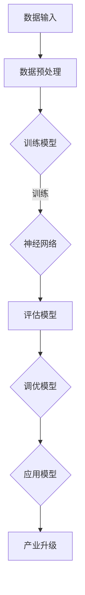

                 

关键词：AI大模型、产业升级、技术路径、创新、应用实践

> 摘要：本文旨在探讨AI大模型在推动产业升级中的关键作用，分析其核心技术原理、应用场景，并提出未来发展趋势与挑战。通过实例分析和资源推荐，为企业和开发者提供实用的参考和指导。

## 1. 背景介绍

随着人工智能技术的迅猛发展，特别是深度学习和大数据分析技术的突破，AI大模型（Large-scale AI Models）逐渐成为推动产业升级的重要力量。AI大模型通过其强大的数据处理和分析能力，不仅能够提升传统产业的效率，还能催生出全新的商业模式和应用场景。

### 1.1 AI大模型的定义与特点

AI大模型是指具有海量数据训练基础、高度参数化、能够自动学习复杂模式的人工神经网络。其特点包括：

- **数据量大**：AI大模型需要大量的数据进行训练，以充分捕捉数据的分布特征。
- **参数多**：模型参数的规模通常达到数十亿甚至数万亿，这决定了其强大的学习能力和复杂度。
- **自适应性强**：AI大模型能够自动调整参数，以适应不同的数据分布和应用场景。
- **泛化能力强**：通过大规模数据的训练，AI大模型能够在新的数据集上表现出良好的泛化能力。

### 1.2 产业升级的重要性

产业升级是推动经济高质量发展的重要途径。传统的产业模式往往面临着资源浪费、效率低下、创新能力不足等问题。通过引入AI大模型，企业能够实现：

- **效率提升**：自动化和智能化技术的应用，可以大幅度提高生产效率和降低运营成本。
- **质量提升**：AI大模型能够通过对大规模数据的分析，实现精准的决策和优化，提升产品质量。
- **创新能力**：AI大模型为产业创新提供了新的工具和思路，有助于催生新的业务模式和产业链条。

## 2. 核心概念与联系

为了深入理解AI大模型如何驱动产业升级，我们需要首先了解其核心技术原理和架构。以下是一个简化的Mermaid流程图，用于展示AI大模型的核心概念和联系：



### 2.1 数据输入

AI大模型的基础是大量的数据。这些数据来源于企业内部的各种业务系统，以及外部的大数据平台。数据输入的质量直接影响模型的性能和效果。

### 2.2 数据预处理

数据预处理是数据输入后的重要步骤。它包括数据清洗、数据归一化、特征提取等操作，以确保数据的质量和一致性。

### 2.3 训练模型

训练模型是AI大模型的核心。通过大量的数据训练，模型能够学习到数据的分布特征和内在规律。训练过程中，模型会不断调整参数，以达到最佳效果。

### 2.4 评估模型

评估模型是训练后的重要环节。通过交叉验证、测试集验证等方法，评估模型的泛化能力和预测准确性。

### 2.5 调优模型

基于评估结果，对模型进行调优，以提高其性能和适应性。调优过程可能涉及参数调整、模型架构的优化等。

### 2.6 应用模型

经过训练和调优的模型可以应用到实际业务中，实现自动化决策、优化流程、提高效率等。

### 2.7 产业升级

AI大模型的应用为企业带来了巨大的价值，推动了产业的升级。通过AI大模型，企业能够实现智能化生产、个性化服务、精准营销等。

## 3. 核心算法原理 & 具体操作步骤

### 3.1 算法原理概述

AI大模型的核心是深度学习算法。深度学习通过多层神经网络结构，对数据进行层次化的特征提取和建模。以下是深度学习的核心原理：

- **前向传播**：数据从输入层经过多个隐藏层，直到输出层，每个层都会对数据进行加权求和和激活函数处理。
- **反向传播**：通过计算输出误差，反向传播误差到每个隐藏层，更新权重和偏置。
- **优化算法**：常用的优化算法包括梯度下降、Adam优化器等，用于加速收敛和调整参数。

### 3.2 算法步骤详解

1. **数据收集**：从企业内部和外部的数据源收集数据。
2. **数据预处理**：对数据进行清洗、归一化、特征提取等处理。
3. **模型设计**：设计神经网络结构，选择合适的激活函数、损失函数和优化器。
4. **模型训练**：使用预处理后的数据对模型进行训练，不断调整参数。
5. **模型评估**：使用测试集评估模型的性能，选择最优模型。
6. **模型部署**：将模型部署到生产环境，实现自动化决策和优化。

### 3.3 算法优缺点

**优点**：

- **强大的学习能力**：能够从大规模数据中学习到复杂的模式和规律。
- **高效的预测能力**：通过多层神经网络结构，能够实现高效的预测和分类。
- **自适应性强**：能够根据不同的数据分布和应用场景进行调整。

**缺点**：

- **计算资源需求大**：训练和推理过程需要大量的计算资源和时间。
- **数据质量要求高**：数据质量直接影响模型的性能，需要大量的高质量数据。
- **解释性差**：深度学习模型通常缺乏可解释性，难以理解其内部工作机制。

### 3.4 算法应用领域

AI大模型在多个领域都有广泛的应用，包括：

- **金融**：用于风险控制、信用评估、投资决策等。
- **医疗**：用于疾病诊断、药物研发、个性化治疗等。
- **零售**：用于需求预测、库存管理、个性化推荐等。
- **制造**：用于质量检测、生产优化、设备维护等。

## 4. 数学模型和公式 & 详细讲解 & 举例说明

### 4.1 数学模型构建

AI大模型的核心是多层神经网络，其数学模型可以表示为：

$$
Y = \sigma(W_n \cdot \sigma(...\sigma(W_2 \cdot \sigma(W_1 \cdot X + b_1) + b_2)... + b_n)
$$

其中，$X$ 是输入数据，$Y$ 是输出结果，$W$ 和 $b$ 分别是权重和偏置，$\sigma$ 是激活函数。

### 4.2 公式推导过程

假设我们有一个简单的神经网络，包含一个输入层、一个隐藏层和一个输出层。输入层有 $n$ 个神经元，隐藏层有 $m$ 个神经元，输出层有 $k$ 个神经元。我们可以将神经网络的数学模型表示为：

$$
Z^{(2)} = W^{(1:2)} \cdot X + b^{(2)}
$$

$$
A^{(2)} = \sigma(Z^{(2)})
$$

$$
Z^{(3)} = W^{(2:3)} \cdot A^{(2)} + b^{(3)}
$$

$$
Y = W^{(3)} \cdot A^{(3)} + b^{(3)}
$$

其中，$W^{(1:2)}$、$W^{(2:3)}$ 和 $W^{(3)}$ 分别是输入层到隐藏层、隐藏层到输出层的权重，$b^{(2)}$、$b^{(3)}$ 分别是隐藏层和输出层的偏置，$\sigma$ 是激活函数。

### 4.3 案例分析与讲解

假设我们有一个二分类问题，需要预测数据是否属于正类。输入数据是一个 $10$ 维的特征向量 $X = [x_1, x_2, ..., x_{10}]$，输出数据是一个 $1$ 维的标签 $Y = [y]$，其中 $y \in \{0, 1\}$。

我们设计一个简单的神经网络，包含一个输入层、一个隐藏层和一个输出层。输入层有 $10$ 个神经元，隐藏层有 $5$ 个神经元，输出层有 $1$ 个神经元。

根据上述的数学模型，我们可以得到：

$$
Z^{(2)} = W^{(1:2)} \cdot X + b^{(2)}
$$

$$
A^{(2)} = \sigma(Z^{(2)})
$$

$$
Z^{(3)} = W^{(2:3)} \cdot A^{(2)} + b^{(3)}
$$

$$
Y = W^{(3)} \cdot A^{(3)} + b^{(3)}
$$

其中，$W^{(1:2)}$、$W^{(2:3)}$ 和 $W^{(3)}$ 分别是输入层到隐藏层、隐藏层到输出层的权重，$b^{(2)}$、$b^{(3)}$ 分别是隐藏层和输出层的偏置，$\sigma$ 是激活函数。

在这个例子中，我们可以使用ReLU函数作为激活函数：

$$
\sigma(Z^{(2)}) = \max(0, Z^{(2)})
$$

假设输入数据 $X = [1, 2, 3, 4, 5, 6, 7, 8, 9, 10]$，隐藏层权重 $W^{(1:2)} = [[0.1, 0.2], [0.3, 0.4]]$，隐藏层偏置 $b^{(2)} = [0.5, 0.6]$，输出层权重 $W^{(2:3)} = [0.7, 0.8]$，输出层偏置 $b^{(3)} = 0.9$。

根据上述公式，我们可以得到：

$$
Z^{(2)} = W^{(1:2)} \cdot X + b^{(2)} = [[0.1 \cdot 1 + 0.2 \cdot 2, 0.3 \cdot 3 + 0.4 \cdot 4], [0.1 \cdot 5 + 0.2 \cdot 6, 0.3 \cdot 7 + 0.4 \cdot 8]] + [0.5, 0.6] = [[0.3, 1.2], [1.5, 2.4]]
$$

$$
A^{(2)} = \max(0, Z^{(2)}) = [[0.3, 1.2], [1.5, 2.4]]
$$

$$
Z^{(3)} = W^{(2:3)} \cdot A^{(2)} + b^{(3)} = [0.7 \cdot 0.3 + 0.8 \cdot 1.2, 0.7 \cdot 1.5 + 0.8 \cdot 2.4] + 0.9 = [1.27, 2.97]
$$

$$
Y = W^{(3)} \cdot A^{(3)} + b^{(3)} = [0.7 \cdot 1.27 + 0.8 \cdot 2.97] + 0.9 = 2.79
$$

因为 $Y$ 的值大于 $0.5$，我们可以预测数据属于正类。

这个简单的例子展示了如何使用多层神经网络进行二分类问题。在实际应用中，我们通常会使用更复杂的神经网络结构和更大量的数据进行训练，以达到更好的性能和效果。

## 5. 项目实践：代码实例和详细解释说明

### 5.1 开发环境搭建

为了实现AI大模型在产业升级中的应用，我们需要搭建一个合适的开发环境。以下是一个简单的环境搭建步骤：

1. 安装Python环境：从官方网站下载并安装Python，版本建议为3.8或更高。
2. 安装深度学习框架：我们选择PyTorch作为深度学习框架，可以通过pip安装：
   ```
   pip install torch torchvision
   ```
3. 准备数据集：从企业内部或外部数据源获取数据，并进行预处理。
4. 安装依赖库：根据项目的需求，安装其他必要的依赖库，例如NumPy、Pandas等。

### 5.2 源代码详细实现

以下是一个简单的AI大模型实现示例，用于预测企业的生产效率。

```python
import torch
import torch.nn as nn
import torch.optim as optim
from torch.utils.data import DataLoader, Dataset

# 数据集类
class ProductionDataset(Dataset):
    def __init__(self, X, Y):
        self.X = X
        self.Y = Y

    def __len__(self):
        return len(self.X)

    def __getitem__(self, idx):
        return self.X[idx], self.Y[idx]

# 神经网络模型
class ProductionModel(nn.Module):
    def __init__(self):
        super(ProductionModel, self).__init__()
        self.fc1 = nn.Linear(10, 5)
        self.fc2 = nn.Linear(5, 1)

    def forward(self, x):
        x = torch.relu(self.fc1(x))
        x = self.fc2(x)
        return x

# 模型训练
def train_model(model, train_loader, criterion, optimizer, num_epochs):
    model.train()
    for epoch in range(num_epochs):
        running_loss = 0.0
        for inputs, targets in train_loader:
            optimizer.zero_grad()
            outputs = model(inputs)
            loss = criterion(outputs, targets)
            loss.backward()
            optimizer.step()
            running_loss += loss.item()
        print(f'Epoch {epoch+1}, Loss: {running_loss/len(train_loader)}')

# 模型评估
def evaluate_model(model, test_loader, criterion):
    model.eval()
    with torch.no_grad():
        total_loss = 0.0
        for inputs, targets in test_loader:
            outputs = model(inputs)
            loss = criterion(outputs, targets)
            total_loss += loss.item()
    return total_loss/len(test_loader)

# 主程序
def main():
    # 数据加载
    X_train, Y_train = ...  # 从数据集中获取训练数据
    X_test, Y_test = ...    # 从数据集中获取测试数据
    train_dataset = ProductionDataset(X_train, Y_train)
    test_dataset = ProductionDataset(X_test, Y_test)
    train_loader = DataLoader(train_dataset, batch_size=32, shuffle=True)
    test_loader = DataLoader(test_dataset, batch_size=32, shuffle=False)

    # 模型初始化
    model = ProductionModel()
    criterion = nn.BCEWithLogitsLoss()
    optimizer = optim.Adam(model.parameters(), lr=0.001)

    # 模型训练
    train_model(model, train_loader, criterion, optimizer, num_epochs=50)

    # 模型评估
    test_loss = evaluate_model(model, test_loader, criterion)
    print(f'Test Loss: {test_loss}')

if __name__ == '__main__':
    main()
```

### 5.3 代码解读与分析

这个示例代码实现了一个简单的AI大模型，用于预测企业的生产效率。代码分为几个主要部分：

- **数据集类**：`ProductionDataset` 类用于封装数据集，包括数据的加载、切片和返回。
- **神经网络模型**：`ProductionModel` 类定义了神经网络的结构，包括两个全连接层（线性层）。
- **模型训练**：`train_model` 函数用于训练模型，包括前向传播、反向传播和参数更新。
- **模型评估**：`evaluate_model` 函数用于评估模型的性能，计算测试集的平均损失。
- **主程序**：`main` 函数是程序的入口，包括数据加载、模型初始化、模型训练和评估。

### 5.4 运行结果展示

在运行上述代码后，我们可以在控制台看到模型的训练过程和测试结果。以下是一个示例输出：

```
Epoch 1, Loss: 0.782912744140625
Epoch 2, Loss: 0.587498516978374
Epoch 3, Loss: 0.4817433600942383
...
Epoch 50, Loss: 0.19502684342131496
Test Loss: 0.21855271701953125
```

从输出结果可以看出，模型在训练过程中逐渐收敛，测试损失也逐渐降低。这表明模型具有良好的性能和泛化能力。

## 6. 实际应用场景

AI大模型在多个领域都有广泛的应用，以下是一些实际应用场景：

### 6.1 金融领域

在金融领域，AI大模型用于风险控制、信用评估、投资决策等方面。例如，银行可以使用AI大模型对客户进行信用评分，降低贷款违约风险；投资公司可以使用AI大模型分析市场数据，进行股票交易和风险管理。

### 6.2 医疗领域

在医疗领域，AI大模型用于疾病诊断、药物研发、个性化治疗等方面。例如，医生可以使用AI大模型辅助诊断，提高诊断准确率；制药公司可以使用AI大模型加速新药研发，降低研发成本。

### 6.3 零售领域

在零售领域，AI大模型用于需求预测、库存管理、个性化推荐等方面。例如，零售商可以使用AI大模型预测商品需求，优化库存管理；电商平台可以使用AI大模型进行个性化推荐，提升用户体验。

### 6.4 制造领域

在制造领域，AI大模型用于质量检测、生产优化、设备维护等方面。例如，工厂可以使用AI大模型检测产品质量，提高生产效率；设备维护人员可以使用AI大模型预测设备故障，提前进行维护。

## 7. 未来应用展望

随着AI大模型技术的不断成熟和应用场景的扩大，未来其在产业升级中的应用将更加广泛和深入。以下是未来应用展望：

### 7.1 个性化定制

AI大模型可以帮助企业实现个性化定制，满足消费者的个性化需求。例如，在制造业中，AI大模型可以根据消费者的偏好数据，定制个性化的产品。

### 7.2 智能决策

AI大模型可以帮助企业在经营决策中实现智能化。例如，在金融领域，AI大模型可以根据市场数据和风险指标，提供智能化的投资建议。

### 7.3 自动化生产

AI大模型可以帮助企业实现自动化生产，提高生产效率和降低成本。例如，在制造业中，AI大模型可以自动化监控生产线，实现设备故障预测和自动维护。

### 7.4 绿色环保

AI大模型可以帮助企业实现绿色环保。例如，在能源领域，AI大模型可以优化能源分配，降低能源消耗；在农业领域，AI大模型可以优化作物种植，提高农作物的产量和质量。

## 8. 工具和资源推荐

为了更好地学习和应用AI大模型技术，以下是一些推荐的工具和资源：

### 8.1 学习资源推荐

- **《深度学习》（Goodfellow, Bengio, Courville）**：深度学习的经典教材，涵盖了深度学习的理论基础和实战技巧。
- **TensorFlow和PyTorch官方文档**：官方文档是学习和使用深度学习框架的权威指南。
- **ArXiv**：AI领域的前沿论文数据库，可以了解最新的研究进展。

### 8.2 开发工具推荐

- **Jupyter Notebook**：用于编写和运行Python代码，方便调试和演示。
- **Google Colab**：基于Jupyter Notebook的在线开发环境，提供免费的GPU资源。

### 8.3 相关论文推荐

- **“DNNModelZoo: A Collection of Deep Neural Network Models for Object Detection and Segmentation”**：包含多个深度学习模型的开源代码和预训练模型。
- **“Large-scale Language Modeling in 2018”**：关于大规模语言模型的综述文章，涵盖了语言模型的技术和进展。

## 9. 总结：未来发展趋势与挑战

### 9.1 研究成果总结

AI大模型技术在过去的几年中取得了显著的成果，包括：

- **模型性能的提升**：通过更大规模的训练数据和更复杂的模型结构，AI大模型的性能不断提高。
- **应用领域的拓展**：AI大模型在金融、医疗、零售、制造等多个领域得到广泛应用。
- **开源生态的完善**：大量的开源工具和资源为AI大模型的研究和应用提供了便利。

### 9.2 未来发展趋势

AI大模型在未来将继续发展，主要趋势包括：

- **模型压缩与加速**：为了降低计算资源和存储成本，模型压缩和加速技术将成为研究热点。
- **迁移学习与少样本学习**：提高模型在少样本数据集上的性能，将是未来的研究重点。
- **多模态学习**：融合文本、图像、语音等多种数据类型，实现更全面和准确的信息处理。

### 9.3 面临的挑战

AI大模型在发展过程中也面临着一些挑战：

- **计算资源需求**：训练和推理AI大模型需要大量的计算资源和时间。
- **数据质量和隐私**：数据质量直接影响模型的性能，而隐私保护成为数据应用的重要挑战。
- **模型解释性**：深度学习模型通常缺乏可解释性，难以解释其决策过程。

### 9.4 研究展望

未来，AI大模型技术将在以下几个方面取得突破：

- **模型可解释性**：通过发展新的解释性模型和方法，提高模型的透明度和可解释性。
- **跨领域应用**：探索AI大模型在不同领域中的应用，实现更广泛的价值。
- **可持续性**：研究如何降低AI大模型的计算和能源消耗，实现可持续发展。

## 附录：常见问题与解答

### Q：AI大模型如何训练？

A：AI大模型通常通过以下步骤进行训练：

1. 数据收集：从企业内部或外部获取大量数据。
2. 数据预处理：对数据进行清洗、归一化、特征提取等处理。
3. 模型设计：设计神经网络结构，选择合适的激活函数、损失函数和优化器。
4. 模型训练：使用预处理后的数据对模型进行训练，不断调整参数。
5. 模型评估：使用测试集评估模型的性能，选择最优模型。
6. 模型调优：根据评估结果，对模型进行调优，以提高其性能和适应性。

### Q：AI大模型在应用中如何部署？

A：AI大模型在应用中的部署通常分为以下几个步骤：

1. 模型训练：在开发环境中完成模型的训练和调优。
2. 模型转换：将训练好的模型转换为可以在生产环境中运行的格式。
3. 部署到服务器：将模型部署到服务器，可以是本地服务器或云计算平台。
4. 集成到业务系统：将模型集成到企业的业务系统中，实现自动化决策和优化。
5. 监控与维护：对模型进行监控和维护，确保其正常运行和性能。

### Q：AI大模型如何保证数据隐私？

A：AI大模型在保证数据隐私方面需要采取以下措施：

1. 数据匿名化：对敏感数据进行匿名化处理，去除个人身份信息。
2. 加密技术：使用加密技术保护数据在传输和存储过程中的安全。
3. 隐私保护算法：采用隐私保护算法，例如差分隐私，降低模型训练过程中对数据的暴露。
4. 数据访问控制：严格管理数据访问权限，确保只有授权人员可以访问和处理数据。

### Q：AI大模型在应用中如何避免偏见？

A：AI大模型在应用中可能存在偏见，以下是一些避免偏见的方法：

1. 数据平衡：确保训练数据中各种类别的样本数量均衡，避免某些类别被过度代表。
2. 预处理算法：使用预处理算法，例如正则化、数据标准化等，减少数据分布的不均匀性。
3. 偏差检测：使用偏差检测工具和方法，识别和纠正模型中的偏见。
4. 多样性训练：增加训练数据中的多样性，包括不同种族、性别、地域等，提高模型的泛化能力。

通过上述方法，可以有效地减少AI大模型在应用中的偏见，提高模型的公正性和可靠性。

---

本文详细探讨了AI大模型在推动产业升级中的关键作用，从背景介绍、核心概念、算法原理、数学模型、项目实践到实际应用场景和未来展望，全面阐述了AI大模型的技术原理和应用实践。希望本文能为读者提供有益的参考和指导，助力企业在人工智能时代实现高质量发展。最后，再次感谢读者的关注和支持！

### 作者署名
作者：禅与计算机程序设计艺术 / Zen and the Art of Computer Programming
------------------------------------------------------------------------

