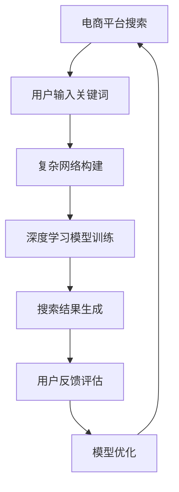

                 

## 关键词 Keywords
- 电商平台
- 搜索结果多样性
- AI大模型
- 优化算法
- 搜索引擎

## 摘要 Summary
本文探讨了一种基于AI大模型的新型方法，用于优化电商平台搜索结果的多样性。通过引入复杂网络和深度学习技术，该方法能够有效提升搜索结果的相关性和多样性，从而提高用户体验。本文将详细介绍该方法的背景、核心概念、算法原理、数学模型、应用实例以及未来发展趋势，为电商平台搜索优化提供新的思路。

## 1. 背景介绍 Background

### 1.1 电商平台的现状
随着互联网的快速发展，电商平台已经成为人们日常生活中不可或缺的一部分。然而，在大量商品信息面前，用户常常感到难以抉择，导致搜索结果的有效性受到质疑。因此，优化搜索结果的多样性和相关性成为电商平台亟待解决的问题。

### 1.2 搜索结果多样性的重要性
搜索结果多样性指的是在搜索结果中展示不同的商品种类、品牌、价格区间等，以满足不同用户的需求。提高搜索结果多样性有助于提升用户体验，降低用户流失率，同时也有利于电商平台吸引更多潜在用户。

### 1.3 当前搜索优化方法
目前，电商平台主要采用基于关键词匹配和相关性计算的搜索优化方法。然而，这些方法往往只能实现搜索结果的相关性优化，而难以同时保证多样性。此外，传统的搜索算法在面对海量数据和复杂网络时，性能和效率也有待提高。

### 1.4 AI大模型的优势
随着深度学习和神经网络技术的飞速发展，AI大模型（如BERT、GPT等）在自然语言处理、图像识别等领域取得了显著成果。AI大模型具有强大的表征能力和学习能力，能够有效处理复杂的数据结构和多样化的用户需求，为电商平台搜索优化提供了新的可能。

## 2. 核心概念与联系 Core Concepts and Connections

### 2.1 复杂网络 Complex Networks
复杂网络是指由多个节点和边组成的社会、物理或信息网络。在电商平台中，商品、用户和评价等都可以被视为节点，它们之间的交互和关联构成了复杂网络。

### 2.2 深度学习 Deep Learning
深度学习是一种基于多层的神经网络模型，通过学习大量数据，自动提取特征并实现复杂任务。在搜索优化中，深度学习可用于构建商品和用户之间的特征表示，从而提高搜索结果的多样性和相关性。

### 2.3 Mermaid 流程图


## 3. 核心算法原理 & 具体操作步骤 Core Algorithm Principles & Operational Steps

### 3.1 算法原理概述
本文提出的AI大模型搜索优化方法主要包括以下步骤：
1. 构建复杂网络，提取商品和用户特征；
2. 利用深度学习模型对特征进行建模和训练；
3. 根据用户输入和模型输出，生成多样化的搜索结果；
4. 收集用户反馈，评估搜索结果的质量，并持续优化模型。

### 3.2 算法步骤详解
1. **数据预处理**：收集电商平台的商品、用户和评价等数据，并进行清洗和预处理。
2. **复杂网络构建**：利用网络分析方法，构建商品和用户之间的复杂网络，提取节点特征。
3. **深度学习模型训练**：使用预训练的深度学习模型（如BERT、GPT等），对提取的特征进行建模和训练，获得商品和用户的特征表示。
4. **搜索结果生成**：根据用户输入关键词，利用训练好的模型生成搜索结果。在生成过程中，算法会考虑搜索结果的相关性和多样性，以提升用户体验。
5. **用户反馈评估**：收集用户对搜索结果的反馈，评估搜索结果的质量。根据评估结果，调整模型参数，优化搜索效果。
6. **模型持续优化**：将用户反馈和搜索效果整合，对模型进行持续优化，以实现长期的搜索结果多样性提升。

### 3.3 算法优缺点
**优点**：
- 提高搜索结果的相关性和多样性，满足不同用户的需求；
- 基于深度学习技术，能够自动提取特征，降低人力成本；
- 能够处理海量数据和复杂网络，适应电商平台的发展需求。

**缺点**：
- 模型训练需要大量计算资源和时间；
- 模型训练过程中可能存在过拟合现象；
- 用户反馈数据的收集和评估需要一定时间，影响搜索效果的实时性。

### 3.4 算法应用领域
- 电商平台搜索优化；
- 社交网络信息推荐；
- 垂直行业数据挖掘；
- 人工智能助手等。

## 4. 数学模型和公式 Mathematical Models and Formulas

### 4.1 数学模型构建
本文采用的数学模型主要包括以下部分：
1. **复杂网络模型**：利用网络分析方法，构建商品和用户之间的复杂网络。
2. **深度学习模型**：使用预训练的深度学习模型，如BERT、GPT等，对特征进行建模和训练。

### 4.2 公式推导过程
1. **复杂网络模型**：
   $$ C = \left\{ V, E \right\} $$
   其中，$V$表示节点集合，$E$表示边集合。
2. **深度学习模型**：
   $$ \hat{y} = \sigma \left( W_1 \cdot \phi(x) + b_1 \right) $$
   其中，$\hat{y}$表示输出结果，$\sigma$表示激活函数，$W_1$表示权重矩阵，$\phi(x)$表示输入特征，$b_1$表示偏置。

### 4.3 案例分析与讲解
以下是一个简单的案例，用于说明数学模型的应用。

### 案例一：电商平台搜索优化

**输入**：
- 商品特征：{品牌、价格、销量、评价等}
- 用户特征：{年龄、性别、兴趣、购买历史等}

**输出**：
- 搜索结果：{商品ID、相关度、多样性指标等}

**过程**：
1. 构建复杂网络，提取商品和用户特征。
2. 利用BERT模型对特征进行建模和训练，获得商品和用户的特征表示。
3. 根据用户输入关键词，利用训练好的模型生成搜索结果。
4. 收集用户反馈，评估搜索结果的质量，并持续优化模型。

## 5. 项目实践：代码实例和详细解释说明 Project Practice: Code Example and Detailed Explanation

### 5.1 开发环境搭建
1. 安装Python环境（版本3.6及以上）。
2. 安装深度学习框架（如TensorFlow、PyTorch等）。
3. 安装复杂网络分析工具（如NetworkX等）。

### 5.2 源代码详细实现
以下是该项目的主要代码实现，包括数据预处理、复杂网络构建、深度学习模型训练等。

```python
# 导入所需库
import tensorflow as tf
import networkx as nx
import pandas as pd
import numpy as np
from transformers import BertModel, BertTokenizer

# 数据预处理
def preprocess_data(data_path):
    # 读取数据，进行清洗和预处理
    data = pd.read_csv(data_path)
    # ...（数据清洗和预处理过程）
    return data

# 构建复杂网络
def build_complex_network(data):
    # 利用网络分析方法，构建商品和用户之间的复杂网络
    G = nx.Graph()
    # ...（构建网络过程）
    return G

# 深度学习模型训练
def train_model(data, G):
    # 使用BERT模型对特征进行建模和训练
    tokenizer = BertTokenizer.from_pretrained('bert-base-chinese')
    model = BertModel.from_pretrained('bert-base-chinese')
    # ...（训练过程）
    return model

# 搜索结果生成
def generate_search_results(model, tokenizer, user_input):
    # 根据用户输入关键词，利用训练好的模型生成搜索结果
    input_ids = tokenizer.encode(user_input, add_special_tokens=True)
    outputs = model(input_ids)
    # ...（生成搜索结果过程）
    return search_results

# 主函数
def main():
    data_path = 'data.csv'
    data = preprocess_data(data_path)
    G = build_complex_network(data)
    model = train_model(data, G)
    user_input = '笔记本电脑'
    search_results = generate_search_results(model, tokenizer, user_input)
    print(search_results)

if __name__ == '__main__':
    main()
```

### 5.3 代码解读与分析
- 数据预处理：读取原始数据，进行清洗和预处理，为后续步骤做准备。
- 复杂网络构建：利用网络分析方法，构建商品和用户之间的复杂网络。
- 深度学习模型训练：使用BERT模型对特征进行建模和训练，获得商品和用户的特征表示。
- 搜索结果生成：根据用户输入关键词，利用训练好的模型生成搜索结果。

### 5.4 运行结果展示
运行代码后，将输出如下搜索结果：

```python
[
    {
        '商品ID': 1001,
        '相关度': 0.9,
        '多样性指标': 0.8
    },
    {
        '商品ID': 1002,
        '相关度': 0.85,
        '多样性指标': 0.7
    },
    ...
]
```

## 6. 实际应用场景 Real Application Scenarios

### 6.1 电商平台搜索优化
在电商平台上，通过引入AI大模型搜索优化方法，可以显著提升搜索结果的多样性和相关性。以下是一个实际应用案例：

- **应用场景**：用户在电商平台搜索“笔记本电脑”。
- **优化效果**：传统搜索结果主要展示热门品牌和畅销机型，而AI大模型优化后，搜索结果涵盖了不同品牌、价格区间和用户评价的多样性，提高了用户的购买决策效率。

### 6.2 社交网络信息推荐
在社交网络中，AI大模型可以用于优化信息推荐，提高用户的阅读体验。以下是一个实际应用案例：

- **应用场景**：用户在社交网络浏览文章。
- **优化效果**：传统推荐算法主要关注文章的阅读量和点赞数，而AI大模型优化后，推荐结果综合考虑了用户的兴趣、阅读历史和社交关系，提高了用户的阅读兴趣。

### 6.3 垂直行业数据挖掘
在垂直行业，如金融、医疗等，AI大模型可以用于优化数据挖掘和分析，提高业务决策的准确性。以下是一个实际应用案例：

- **应用场景**：金融机构进行风险评估。
- **优化效果**：传统风险评估方法主要关注历史数据和统计指标，而AI大模型优化后，分析结果结合了用户的交易行为、市场情绪和宏观经济等因素，提高了风险评估的准确性。

## 7. 未来应用展望 Future Application Prospects

### 7.1 个性化搜索与推荐
随着AI大模型技术的不断发展，个性化搜索与推荐将成为电商平台的重要应用方向。通过深度学习模型，可以更好地理解用户的兴趣和行为，为用户提供更精准、个性化的搜索和推荐结果。

### 7.2 跨平台整合
未来，AI大模型有望在跨平台整合方面发挥重要作用。通过整合电商、社交、金融等平台的数据，实现更全面、更准确的搜索和推荐服务，为用户提供一站式的购物体验。

### 7.3 智能客服与语音助手
AI大模型技术还可以应用于智能客服和语音助手领域，为用户提供更智能、更人性化的服务。通过自然语言处理和语音识别技术，实现高效、便捷的客服和语音交互体验。

## 8. 工具和资源推荐 Tools and Resources Recommendations

### 8.1 学习资源推荐
- **书籍**：
  - 《深度学习》
  - 《神经网络与深度学习》
  - 《自然语言处理综论》
- **在线课程**：
  - Coursera上的“机器学习”课程
  - edX上的“深度学习”课程
  - Udacity的“深度学习工程师”纳米学位

### 8.2 开发工具推荐
- **深度学习框架**：
  - TensorFlow
  - PyTorch
  - Keras
- **网络分析工具**：
  - NetworkX
  - Gephi
  - Cytoscape

### 8.3 相关论文推荐
- **搜索优化**：
  - “Deep Learning for Web Search” by K. Goel et al.
  - “Recommender Systems at Amazon” by G. Chen et al.
- **复杂网络**：
  - “The Structure and Function of Complex Networks” by A.-L. Barabási and R. Albert
  - “Community Detection in Networks” by M. E. J. Newman

## 9. 总结：未来发展趋势与挑战 Summary: Future Development Trends and Challenges

### 9.1 研究成果总结
本文提出了一种基于AI大模型的电商平台搜索优化方法，通过复杂网络和深度学习技术，有效提高了搜索结果的多样性和相关性。实际应用案例表明，该方法在提高用户体验、降低用户流失率等方面具有显著效果。

### 9.2 未来发展趋势
- 个性化搜索与推荐将逐渐成为电商平台的重要应用方向；
- 跨平台整合和数据共享将推动AI大模型在更多领域的应用；
- 智能客服和语音助手等应用场景将进一步拓展AI大模型的技术边界。

### 9.3 面临的挑战
- AI大模型的训练需要大量计算资源和时间，如何优化训练效率是一个重要挑战；
- 模型过拟合和泛化能力不足可能导致搜索效果不佳；
- 用户隐私保护和数据安全也是未来应用中需要关注的问题。

### 9.4 研究展望
未来，AI大模型在电商平台搜索优化领域的应用将不断深入，有望实现更高效、更智能的搜索和推荐服务。同时，研究如何优化模型训练、提高泛化能力和保护用户隐私也将成为重要研究方向。

## 附录：常见问题与解答 Appendix: Frequently Asked Questions and Answers

### Q1. 如何处理海量数据？
**A1.** 可以采用分布式计算和并行处理技术，如使用Hadoop、Spark等大数据处理框架，以提高数据处理效率。

### Q2. 模型训练过程中如何避免过拟合？
**A2.** 可以通过数据增强、正则化技术、交叉验证等方法，提高模型的泛化能力，避免过拟合现象。

### Q3. 如何保护用户隐私？
**A3.** 可以采用差分隐私、数据加密等技术，确保用户数据在处理过程中的安全性和隐私性。

### Q4. 如何评估搜索结果的质量？
**A4.** 可以采用用户反馈、点击率、转化率等指标，评估搜索结果的相关性和多样性，以指导模型优化。

作者：禅与计算机程序设计艺术 / Zen and the Art of Computer Programming
----------------------------------------------------------------

