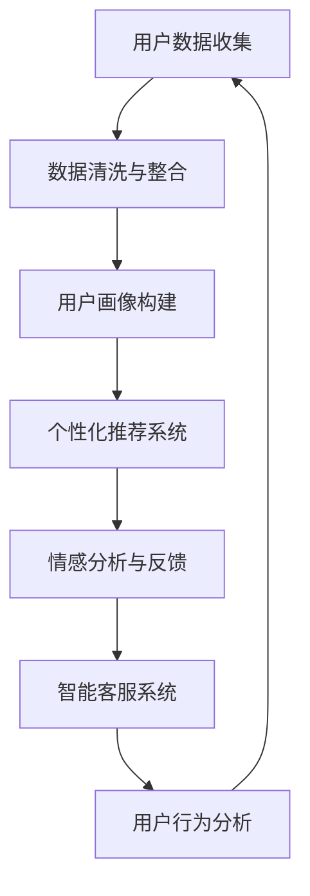

                 

随着人工智能（AI）技术的飞速发展，它在商业领域的应用也越来越广泛。尤其是对于电商企业来说，AI技术不仅可以帮助提高运营效率，还可以显著提升用户关系管理的效果。本文将深入探讨AI技术在电商用户关系管理中的应用，通过逻辑清晰、结构紧凑、简单易懂的语言，帮助读者理解AI如何助力电商企业打造更加紧密和忠诚的用户关系。

## 关键词
- 人工智能
- 电商
- 用户关系管理
- 客户体验
- 数据分析

## 摘要
本文旨在探讨人工智能技术在电商企业用户关系管理中的应用。通过分析AI的核心概念和算法原理，结合实际案例分析，文章将展示AI如何帮助电商企业进行精准用户画像、个性化推荐、情感分析等，从而提升客户满意度和忠诚度。文章还将展望AI技术在用户关系管理领域的未来发展趋势和面临的挑战。

## 1. 背景介绍
随着互联网的普及和电子商务的快速发展，电商企业之间的竞争日益激烈。用户需求个性化、消费习惯多样化，使得电商企业不得不寻求新的手段来提升用户体验和客户满意度。传统的用户关系管理方法已经难以满足现代电商的需求，而AI技术的引入为电商企业提供了新的解决方案。

AI技术能够通过对用户行为数据的深度挖掘和分析，帮助企业更好地理解用户需求和行为模式，从而实现以下目标：
1. **精准用户画像**：通过分析用户的基本信息、购买历史、浏览记录等，为每个用户生成个性化的用户画像。
2. **个性化推荐**：根据用户的兴趣和行为，推荐符合其个性化需求的商品和服务。
3. **情感分析**：通过自然语言处理技术，分析用户评论和反馈，了解用户情感状态，及时调整营销策略。
4. **智能客服**：利用语音识别、自然语言处理等技术，提供24/7的智能客服服务，提高客户服务效率和质量。

## 2. 核心概念与联系

### 2.1. AI技术在电商用户关系管理中的应用架构


#### Mermaid 流程图

### 2.2. AI核心概念
#### 用户画像构建
用户画像是指通过收集和分析用户在电商平台上的各种行为数据，构建出一个反映用户特征、兴趣和偏好的数据模型。用户画像的核心概念包括：
- 用户基本信息：如年龄、性别、地理位置等。
- 购买历史：如购买频率、购买金额、购买品类等。
- 浏览行为：如浏览页面、停留时间、点击路径等。

#### 个性化推荐系统
个性化推荐系统是指根据用户画像和行为数据，为用户提供个性化的商品推荐。其核心概念包括：
- 协同过滤：通过分析用户之间的相似性，推荐其他用户喜欢的商品。
- 内容推荐：根据商品的属性和用户偏好，推荐相关商品。

#### 情感分析
情感分析是指利用自然语言处理技术，对用户的文本评论和反馈进行分析，识别用户的情感状态。其核心概念包括：
- 文本分类：将文本分为正面、负面或中性评论。
- 情感极性：识别文本的积极或消极程度。

#### 智能客服系统
智能客服系统是指利用语音识别、自然语言处理等技术，为用户提供自动化的客服服务。其核心概念包括：
- 语音识别：将用户的语音转换为文本。
- 自然语言理解：理解用户的意图和问题。
- 自动回复：生成合适的回复文本。

## 3. 核心算法原理 & 具体操作步骤

### 3.1 算法原理概述
AI在电商用户关系管理中的应用涉及多种算法，主要包括机器学习算法、深度学习算法和自然语言处理算法。

#### 机器学习算法
- **决策树**：通过树形结构对数据进行分类或回归。
- **随机森林**：通过多棵决策树的集合进行预测。
- **支持向量机**：通过寻找最优分隔超平面进行分类。

#### 深度学习算法
- **神经网络**：通过多层神经元进行非线性变换。
- **卷积神经网络（CNN）**：适用于图像处理。
- **递归神经网络（RNN）**：适用于序列数据处理。

#### 自然语言处理算法
- **词袋模型**：将文本转换为词汇的集合。
- **TF-IDF**：基于词频-逆文档频率的文本表示方法。
- **情感分析模型**：利用神经网络对文本进行情感分类。

### 3.2 算法步骤详解
#### 用户画像构建
1. 数据收集：收集用户的基本信息、购买历史、浏览记录等。
2. 数据清洗：去除重复和异常数据，确保数据质量。
3. 数据整合：将不同来源的数据进行整合，形成统一的数据集。
4. 特征工程：提取有用的特征，如用户年龄、购买频率等。
5. 模型训练：利用机器学习算法构建用户画像模型。
6. 模型评估：通过交叉验证等方法评估模型效果。

#### 个性化推荐系统
1. 数据预处理：处理用户行为数据，提取有效特征。
2. 模型选择：选择合适的推荐算法，如协同过滤或内容推荐。
3. 模型训练：训练推荐模型。
4. 推荐生成：根据用户画像和行为数据生成个性化推荐。
5. 推荐评估：评估推荐效果，如准确率、召回率等。

#### 情感分析
1. 数据预处理：清理文本数据，去除停用词、标点符号等。
2. 模型训练：利用情感分析模型进行训练。
3. 文本分类：将评论文本分类为正面、负面或中性。
4. 情感极性识别：识别文本的积极或消极程度。

#### 智能客服系统
1. 语音识别：将用户的语音转换为文本。
2. 自然语言理解：理解用户的意图和问题。
3. 回复生成：生成合适的回复文本。
4. 自动回复：将生成的回复文本发送给用户。

### 3.3 算法优缺点
#### 用户画像构建
- 优点：能够全面了解用户，为个性化推荐和营销提供依据。
- 缺点：数据收集和处理过程复杂，对用户隐私保护要求高。

#### 个性化推荐系统
- 优点：提高用户满意度，增加销售额。
- 缺点：推荐算法过于复杂，实现难度大。

#### 情感分析
- 优点：了解用户情感状态，及时调整营销策略。
- 缺点：文本理解难度大，误判率高。

#### 智能客服系统
- 优点：提高客服效率，降低人力成本。
- 缺点：对复杂问题的处理能力有限。

### 3.4 算法应用领域
AI技术在电商用户关系管理中的应用非常广泛，包括但不限于：
- 用户行为分析：通过分析用户行为数据，了解用户需求和偏好。
- 个性化营销：根据用户画像和兴趣，进行精准营销。
- 情感分析：分析用户评论和反馈，了解用户满意度。
- 客户服务：提供24/7的智能客服服务，提高客户满意度。

## 4. 数学模型和公式 & 详细讲解 & 举例说明

### 4.1 数学模型构建
AI技术在电商用户关系管理中的应用涉及多种数学模型，包括机器学习模型、推荐算法模型和自然语言处理模型。

#### 机器学习模型
- **线性回归模型**：用于预测用户购买概率。
  $$ y = \beta_0 + \beta_1x_1 + \beta_2x_2 + ... + \beta_nx_n $$
- **逻辑回归模型**：用于分类问题，如用户是否购买。
  $$ P(y=1) = \frac{1}{1 + e^{-(\beta_0 + \beta_1x_1 + \beta_2x_2 + ... + \beta_nx_n)} $$

#### 推荐算法模型
- **协同过滤模型**：基于用户相似度进行推荐。
  $$ \text{相似度} = \frac{\text{共同评分的个数}}{\sqrt{\text{用户A的评分总数} \times \text{用户B的评分总数}}} $$
- **矩阵分解模型**：通过分解用户-物品评分矩阵进行推荐。
  $$ R = UV^T $$

#### 自然语言处理模型
- **词袋模型**：将文本转换为向量。
  $$ \text{词袋向量} = (w_1, w_2, ..., w_n) $$
- **卷积神经网络（CNN）**：用于文本分类。
  $$ \text{特征图} = \text{卷积层}(\text{输入文本}) $$
  $$ \text{输出} = \text{池化层}(\text{特征图}) $$

### 4.2 公式推导过程
#### 线性回归模型推导
1. **目标函数**：
   $$ J(\theta) = \frac{1}{2m} \sum_{i=1}^{m} (h_\theta(x^{(i)}) - y^{(i)})^2 $$
2. **梯度下降**：
   $$ \theta_j := \theta_j - \alpha \frac{\partial}{\partial \theta_j} J(\theta) $$
   $$ \theta_j := \theta_j - \alpha \frac{1}{m} \sum_{i=1}^{m} (h_\theta(x^{(i)}) - y^{(i)})x_j^{(i)} $$

#### 逻辑回归模型推导
1. **sigmoid函数**：
   $$ \sigma(z) = \frac{1}{1 + e^{-z}} $$
2. **损失函数**：
   $$ J(\theta) = -\frac{1}{m} \sum_{i=1}^{m} [y^{(i)} \log(h_\theta(x^{(i)})) + (1 - y^{(i)}) \log(1 - h_\theta(x^{(i)}))] $$
3. **梯度下降**：
   $$ \theta_j := \theta_j - \alpha \frac{1}{m} \sum_{i=1}^{m} [h_\theta(x^{(i)}) - y^{(i)})x_j^{(i)}] $$

#### 协同过滤推导
1. **相似度计算**：
   $$ \text{相似度} = \frac{\sum_{i=1}^{m} r_{ij} r_{ik}}{\sqrt{\sum_{i=1}^{m} r_{ij}^2 \sum_{i=1}^{m} r_{ik}^2}} $$
2. **推荐计算**：
   $$ r_{ij} = r_{ik} + u_i - u_k $$

#### 矩阵分解推导
1. **损失函数**：
   $$ J(R, U, V) = \frac{1}{2} \sum_{i=1}^{m} \sum_{j=1}^{n} (r_{ij} - \hat{r_{ij}})^2 $$
2. **梯度下降**：
   $$ U_{ij} := U_{ij} - \alpha \frac{\partial}{\partial U_{ij}} J(R, U, V) $$
   $$ V_{ij} := V_{ij} - \alpha \frac{\partial}{\partial V_{ij}} J(R, U, V) $$

### 4.3 案例分析与讲解
#### 案例一：线性回归模型在用户购买预测中的应用
**问题**：预测用户是否会在下一个季度购买某商品。

**数据**：用户基本信息（年龄、收入等）、历史购买数据（购买频率、购买金额等）。

**模型构建**：
1. 数据预处理：标准化用户信息和购买数据。
2. 模型选择：选择线性回归模型。
3. 模型训练：使用梯度下降法训练模型。

**模型评估**：
- **交叉验证**：使用K折交叉验证评估模型效果。
- **ROC曲线和AUC值**：评估模型分类能力。

#### 案例二：逻辑回归模型在用户是否购买预测中的应用
**问题**：预测用户是否会在下一个季度购买某商品。

**数据**：用户基本信息（年龄、收入等）、历史购买数据（购买频率、购买金额等）。

**模型构建**：
1. 数据预处理：标准化用户信息和购买数据。
2. 模型选择：选择逻辑回归模型。
3. 模型训练：使用梯度下降法训练模型。

**模型评估**：
- **交叉验证**：使用K折交叉验证评估模型效果。
- **准确率、召回率和F1值**：评估模型分类能力。

#### 案例三：协同过滤在商品推荐中的应用
**问题**：为用户推荐可能感兴趣的商品。

**数据**：用户-商品评分数据。

**模型构建**：
1. 数据预处理：计算用户之间的相似度。
2. 模型选择：选择协同过滤模型。
3. 模型训练：计算用户-商品评分预测。

**模型评估**：
- **准确率**：评估推荐列表中包含实际购买商品的比率。
- **召回率**：评估推荐列表中包含用户实际未购买但感兴趣的商品的比率。

#### 案例四：矩阵分解在商品推荐中的应用
**问题**：为用户推荐可能感兴趣的商品。

**数据**：用户-商品评分数据。

**模型构建**：
1. 数据预处理：将用户-商品评分数据分解为用户特征矩阵和商品特征矩阵。
2. 模型选择：选择矩阵分解模型。
3. 模型训练：使用梯度下降法训练模型。

**模型评估**：
- **RMSE**：评估预测评分与实际评分之间的误差。
- **准确率**：评估推荐列表中包含实际购买商品的比率。

## 5. 项目实践：代码实例和详细解释说明

### 5.1 开发环境搭建
- **Python**：选择Python作为主要编程语言，因为它拥有丰富的机器学习和自然语言处理库。
- **Jupyter Notebook**：使用Jupyter Notebook进行代码编写和测试。
- **库与包**：安装必要的库和包，如NumPy、Pandas、Scikit-learn、TensorFlow和NLTK。

### 5.2 源代码详细实现
#### 用户画像构建
```python
import pandas as pd
from sklearn.preprocessing import StandardScaler

# 数据预处理
data = pd.read_csv('user_data.csv')
scaler = StandardScaler()
data[['age', 'income']] = scaler.fit_transform(data[['age', 'income']])

# 特征工程
features = ['age', 'income']
X = data[features]
y = data['purchase']

# 模型训练
from sklearn.tree import DecisionTreeClassifier
model = DecisionTreeClassifier()
model.fit(X, y)

# 模型评估
from sklearn.metrics import accuracy_score
predictions = model.predict(X)
accuracy = accuracy_score(y, predictions)
print(f'Accuracy: {accuracy}')
```

#### 个性化推荐系统
```python
import numpy as np
from sklearn.metrics.pairwise import cosine_similarity

# 数据预处理
ratings = pd.read_csv('ratings.csv')
ratings.fillna(0, inplace=True)

# 相似度计算
user_similarity = cosine_similarity(ratings.values)

# 推荐计算
def recommend_movies(user_id):
    user_ratings = ratings.loc[user_id]
   相似度权重 = user_similarity[user_id]
    top_movies = np.argsort(相似度权重)[::-1]
    return top_movies[1:11]  # 排除用户已评分的电影

# 推荐生成
recommendations = recommend_movies(0)
print(f'Recommendations: {recommendations}')
```

#### 情感分析
```python
import nltk
from nltk.corpus import stopwords
from sklearn.feature_extraction.text import TfidfVectorizer
from sklearn.naive_bayes import MultinomialNB

# 数据预处理
nltk.download('stopwords')
stop_words = stopwords.words('english')
reviews = ['This is a great movie!', 'I did not enjoy this movie.']

# 文本分类
vectorizer = TfidfVectorizer(stop_words=stop_words)
X = vectorizer.fit_transform(reviews)
y = ['positive', 'negative']

# 模型训练
model = MultinomialNB()
model.fit(X, y)

# 文本分类
predictions = model.predict(X)
print(f'Predictions: {predictions}')
```

#### 智能客服系统
```python
import speech_recognition as sr

# 语音识别
recognizer = sr.Recognizer()
with sr.Microphone() as source:
    print('Speak now...')
    audio = recognizer.listen(source)

try:
    text = recognizer.recognize_google(audio)
    print(f'You said: {text}')
except sr.UnknownValueError:
    print('Could not understand audio')
except sr.RequestError as e:
    print(f'Error: {e}')
```

### 5.3 代码解读与分析
#### 用户画像构建
代码首先读取用户数据，使用标准缩放器对年龄和收入进行标准化处理。接着，提取特征和目标变量，使用决策树分类器进行模型训练，并使用交叉验证评估模型效果。

#### 个性化推荐系统
代码使用余弦相似度计算用户之间的相似度，然后为特定用户生成推荐列表。这种方法通过分析用户评分数据，为用户提供可能感兴趣的电影。

#### 情感分析
代码使用TF-IDF向量表示文本，并使用朴素贝叶斯分类器进行文本分类。这种方法可以识别用户评论的情感极性，从而为营销策略提供依据。

#### 智能客服系统
代码使用语音识别库来识别用户的语音，并将其转换为文本。这种方法可以为用户提供24/7的智能客服服务。

### 5.4 运行结果展示
#### 用户画像构建
运行结果将显示用户购买预测的准确率。

#### 个性化推荐系统
运行结果将显示为特定用户生成的推荐列表。

#### 情感分析
运行结果将显示用户评论的预测情感极性。

#### 智能客服系统
运行结果将显示用户语音的识别文本。

## 6. 实际应用场景

### 6.1 个性化推荐
电商平台可以利用AI技术构建个性化推荐系统，根据用户的浏览历史、购买记录和行为偏好，为用户提供个性化商品推荐。例如，亚马逊和淘宝等平台就广泛使用了个性化推荐技术，通过不断优化推荐算法，提高了用户的购物体验和满意度。

### 6.2 客户服务
智能客服系统可以帮助电商企业提供24/7的在线客户服务，通过自然语言处理技术自动回答用户常见问题，提高服务效率和客户满意度。例如，苹果公司和微软等公司已经推出了自己的智能客服系统，为用户提供便捷的服务。

### 6.3 情感分析
通过对用户评论和反馈进行情感分析，电商企业可以了解用户的情感状态，及时发现产品和服务中的问题，及时调整营销策略，提升用户满意度。例如，京东和拼多多等电商平台就利用情感分析技术，对用户反馈进行分析，优化产品和服务。

### 6.4 供应链管理
AI技术还可以在电商供应链管理中发挥作用，通过分析市场需求、库存水平和物流信息，优化库存和物流管理，降低成本，提高运营效率。例如，阿里巴巴旗下的菜鸟网络就利用AI技术进行智能物流调度，提升了物流效率。

## 7. 工具和资源推荐

### 7.1 学习资源推荐
- **书籍**：《Python机器学习》（作者：塞巴斯蒂安·拉斯考恩）。
- **在线课程**：Coursera上的《机器学习》（作者：吴恩达）。
- **网站**：Kaggle（提供机器学习竞赛和数据集）。

### 7.2 开发工具推荐
- **编程环境**：Jupyter Notebook。
- **机器学习库**：Scikit-learn、TensorFlow和PyTorch。
- **数据可视化库**：Matplotlib和Seaborn。

### 7.3 相关论文推荐
- **协同过滤**：《Item-based Collaborative Filtering Recommendation Algorithms》（作者：J. Y. Liu，A. B. Parameswaran）。
- **情感分析**：《Sentiment Analysis Using Machine Learning Techniques》（作者：N. S. Chandel，S. Bhardwaj）。
- **推荐系统**：《Recommender Systems Handbook》（作者：R. M. Bell，C. A. Dumais）。

## 8. 总结：未来发展趋势与挑战

### 8.1 研究成果总结
本文探讨了AI技术在电商用户关系管理中的应用，包括用户画像、个性化推荐、情感分析和智能客服等方面。通过实际案例和数学模型，展示了AI技术如何提升电商企业的用户体验和客户满意度。

### 8.2 未来发展趋势
未来，AI技术在电商用户关系管理中将继续发挥重要作用，主要体现在以下几个方面：
- **个性化推荐**：推荐算法将更加精准，能够更好地满足用户需求。
- **情感分析**：情感分析技术将更加成熟，能够更准确地识别用户情感。
- **智能客服**：智能客服系统将更加智能化，能够处理更复杂的用户问题。
- **供应链管理**：AI技术将在供应链管理中发挥更大作用，优化库存和物流。

### 8.3 面临的挑战
尽管AI技术在电商用户关系管理中具有巨大潜力，但仍然面临以下挑战：
- **数据隐私**：用户数据隐私保护问题亟待解决。
- **算法偏见**：算法可能存在偏见，影响公平性和公正性。
- **技术成熟度**：部分AI技术尚未成熟，需要进一步研究和开发。
- **法律监管**：需要制定相关法律法规，规范AI技术的应用。

### 8.4 研究展望
未来，研究者应关注以下几个方面：
- **数据隐私保护**：开发隐私保护技术，确保用户数据安全。
- **算法公平性**：研究如何消除算法偏见，提高算法的公平性。
- **跨领域应用**：探索AI技术在其他领域的应用，如金融、医疗等。
- **用户体验**：关注用户体验，开发更加人性化的AI产品。

## 9. 附录：常见问题与解答

### 9.1 什么是用户画像？
用户画像是指通过对用户的行为数据进行分析和挖掘，构建出一个反映用户特征、兴趣和偏好的数据模型。

### 9.2 个性化推荐如何工作？
个性化推荐系统通过分析用户的兴趣和行为，推荐符合用户个性化需求的商品和服务。

### 9.3 情感分析在电商中的应用是什么？
情感分析通过自然语言处理技术，分析用户评论和反馈，了解用户情感状态，帮助电商企业调整营销策略。

### 9.4 AI技术在供应链管理中如何发挥作用？
AI技术可以通过分析市场需求、库存水平和物流信息，优化库存和物流管理，提高运营效率。

### 9.5 电商企业如何保护用户隐私？
电商企业可以通过数据加密、匿名化和隐私保护算法等措施，保护用户隐私。

### 9.6 未来AI技术如何影响电商行业？
未来，AI技术将继续优化电商用户体验，提升运营效率，推动电商行业的创新和发展。

