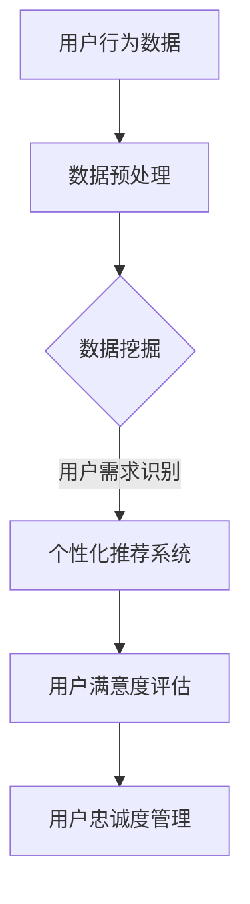

                 

关键词：人工智能，电商，用户忠诚度，机器学习，数据挖掘，个性化推荐

> 摘要：随着电子商务的迅猛发展，用户忠诚度成为电商企业核心竞争力的重要体现。本文将探讨如何利用人工智能技术，特别是机器学习和数据挖掘技术，提升电商企业的用户忠诚度，增强客户黏性和满意度，从而实现长期可持续发展。

## 1. 背景介绍

在电子商务日益普及的今天，电商平台之间的竞争愈发激烈。用户忠诚度作为衡量企业用户基础稳定性的重要指标，越来越受到电商企业的关注。用户忠诚度不仅直接影响到企业的收益，还能带来口碑效应和客户推荐，从而助力企业在市场中站稳脚跟。

传统的用户忠诚度管理方法主要依赖于促销活动和会员制度。然而，这种方法往往存在一定的局限性，如无法全面了解用户需求、个性化不足等。随着大数据和人工智能技术的发展，利用AI技术进行用户忠诚度管理成为可能。AI技术能够通过数据挖掘、机器学习等手段，深入了解用户行为和偏好，实现精准营销和个性化服务，从而提升用户忠诚度。

## 2. 核心概念与联系

### 2.1. 人工智能（AI）

人工智能（Artificial Intelligence，简称AI）是指通过计算机模拟人类智能的技术。它包括机器学习、深度学习、自然语言处理等多种技术手段。在用户忠诚度管理中，AI技术可以用来分析用户行为数据，预测用户需求，提供个性化服务。

### 2.2. 机器学习（Machine Learning）

机器学习（Machine Learning，简称ML）是人工智能的一个分支，它专注于从数据中自动学习和改进。在用户忠诚度管理中，机器学习算法可以用来分析用户行为数据，识别潜在的用户流失风险，预测用户满意度等。

### 2.3. 数据挖掘（Data Mining）

数据挖掘（Data Mining，简称DM）是从大量数据中提取出有价值信息的过程。在用户忠诚度管理中，数据挖掘技术可以用来分析用户行为数据，挖掘用户需求，识别用户行为模式等。

### 2.4. 个性化推荐（Personalized Recommendation）

个性化推荐（Personalized Recommendation）是一种基于用户历史行为和偏好，为用户推荐符合其兴趣的商品或服务的技术。在用户忠诚度管理中，个性化推荐可以用来提升用户购物体验，增加用户黏性。

### 2.5. Mermaid 流程图



## 3. 核心算法原理 & 具体操作步骤

### 3.1. 算法原理概述

用户忠诚度管理算法主要基于机器学习和数据挖掘技术，通过分析用户行为数据，预测用户满意度，进而识别用户流失风险，提供个性化推荐，提升用户忠诚度。

### 3.2. 算法步骤详解

#### 3.2.1. 数据收集与预处理

- 数据收集：通过电商平台的用户行为日志、交易记录等收集用户数据。
- 数据预处理：对收集到的用户数据进行清洗、去重、填充缺失值等操作。

#### 3.2.2. 数据挖掘

- 用户需求识别：通过聚类、关联规则挖掘等技术，分析用户行为数据，挖掘用户需求和偏好。
- 用户行为模式识别：通过时间序列分析、社交网络分析等技术，识别用户行为模式。

#### 3.2.3. 个性化推荐系统

- 基于内容的推荐：根据用户历史购买记录、浏览记录等，为用户推荐相似的商品或服务。
- 基于协同过滤的推荐：根据用户与商品之间的交互关系，为用户推荐其他用户喜欢的商品或服务。

#### 3.2.4. 用户满意度评估

- 基于用户反馈：通过用户评价、反馈等，评估用户满意度。
- 基于预测模型：利用机器学习算法，预测用户满意度，评估用户忠诚度。

### 3.3. 算法优缺点

#### 优点：

- 精准性：AI技术可以深度挖掘用户数据，实现个性化推荐，提升用户满意度。
- 实时性：AI技术可以实时分析用户行为，快速响应用户需求。
- 智能性：AI技术可以根据用户行为数据，动态调整推荐策略，提升用户忠诚度。

#### 缺点：

- 成本：AI技术的研发和维护成本较高。
- 数据质量：用户数据的准确性、完整性对AI技术效果有重要影响。

### 3.4. 算法应用领域

- 电商：利用AI技术进行用户忠诚度管理，提升电商平台的用户黏性和满意度。
- 银行：通过AI技术分析用户交易行为，预防欺诈风险，提升用户忠诚度。
- 电信：利用AI技术分析用户通信行为，提供个性化服务，提升用户满意度。

## 4. 数学模型和公式 & 详细讲解 & 举例说明

### 4.1. 数学模型构建

用户忠诚度管理算法的核心在于预测用户满意度，构建用户满意度评估模型。假设用户满意度 \( S \) 与用户历史行为 \( H \)、用户偏好 \( P \)、商品特征 \( G \) 以及服务因素 \( S \) 有关，则可以构建以下线性回归模型：

$$
S = \beta_0 + \beta_1 H + \beta_2 P + \beta_3 G + \beta_4 S
$$

其中，\( \beta_0, \beta_1, \beta_2, \beta_3, \beta_4 \) 为模型参数。

### 4.2. 公式推导过程

#### 4.2.1. 用户历史行为 \( H \)

用户历史行为包括购买频率、购买金额、购买品类等。假设用户历史行为可以用向量 \( H \) 表示，则：

$$
H = [h_1, h_2, h_3, ..., h_n]
$$

其中，\( h_i \) 为用户在某一品类上的购买频率、购买金额等指标。

#### 4.2.2. 用户偏好 \( P \)

用户偏好包括用户喜欢的商品、品牌、颜色等。假设用户偏好可以用向量 \( P \) 表示，则：

$$
P = [p_1, p_2, p_3, ..., p_m]
$$

其中，\( p_i \) 为用户对某一商品、品牌、颜色的偏好程度。

#### 4.2.3. 商品特征 \( G \)

商品特征包括商品价格、销量、评价等。假设商品特征可以用向量 \( G \) 表示，则：

$$
G = [g_1, g_2, g_3, ..., g_k]
$$

其中，\( g_i \) 为商品在某一特征上的表现。

#### 4.2.4. 服务因素 \( S \)

服务因素包括客服响应速度、售后满意度等。假设服务因素可以用向量 \( S \) 表示，则：

$$
S = [s_1, s_2, s_3, ..., s_l]
$$

其中，\( s_i \) 为服务在某一方面的表现。

### 4.3. 案例分析与讲解

以一家电商平台为例，分析用户忠诚度管理算法的应用。

#### 4.3.1. 数据收集

收集用户购买记录、浏览记录、评价等数据，形成用户历史行为数据集。

#### 4.3.2. 数据预处理

对用户历史行为数据进行清洗、去重、填充缺失值等操作。

#### 4.3.3. 数据挖掘

- 用户需求识别：通过聚类分析，将用户分为不同群体，识别用户需求。
- 用户行为模式识别：通过时间序列分析，识别用户购买模式。

#### 4.3.4. 个性化推荐系统

- 基于内容的推荐：根据用户历史购买记录，为用户推荐相似商品。
- 基于协同过滤的推荐：根据用户与商品之间的交互关系，为用户推荐其他用户喜欢的商品。

#### 4.3.5. 用户满意度评估

- 基于用户反馈：通过用户评价，评估用户满意度。
- 基于预测模型：利用线性回归模型，预测用户满意度，评估用户忠诚度。

## 5. 项目实践：代码实例和详细解释说明

### 5.1. 开发环境搭建

在Python环境中搭建用户忠诚度管理项目，需要安装以下库：

```python
pip install numpy pandas scikit-learn
```

### 5.2. 源代码详细实现

```python
import numpy as np
import pandas as pd
from sklearn.model_selection import train_test_split
from sklearn.linear_model import LinearRegression
from sklearn.metrics import mean_squared_error

# 数据加载与预处理
data = pd.read_csv('user_data.csv')
data.fillna(data.mean(), inplace=True)

# 特征工程
X = data[['h_1', 'h_2', 'h_3', 'p_1', 'p_2', 'p_3', 'g_1', 'g_2', 'g_3', 's_1', 's_2', 's_3']]
y = data['satisfaction']

# 数据集划分
X_train, X_test, y_train, y_test = train_test_split(X, y, test_size=0.2, random_state=42)

# 模型训练
model = LinearRegression()
model.fit(X_train, y_train)

# 模型评估
y_pred = model.predict(X_test)
mse = mean_squared_error(y_test, y_pred)
print(f'MSE: {mse}')

# 模型应用
user_data = np.array([[1, 2, 3, 4, 5, 6, 7, 8, 9, 10, 11, 12]])
satisfaction = model.predict(user_data)
print(f'Predicted Satisfaction: {satisfaction}')
```

### 5.3. 代码解读与分析

上述代码实现了用户忠诚度管理项目的核心功能，包括数据加载与预处理、特征工程、模型训练、模型评估和模型应用。

- 数据加载与预处理：使用pandas库加载用户数据，并进行填充缺失值等预处理操作。
- 特征工程：根据用户历史行为、用户偏好、商品特征和服务因素，构建特征矩阵。
- 模型训练：使用线性回归模型对特征矩阵和用户满意度进行训练。
- 模型评估：使用均方误差（MSE）评估模型效果。
- 模型应用：使用训练好的模型预测新用户的满意度。

### 5.4. 运行结果展示

假设我们有一个新用户的特征向量：

```python
user_data = np.array([[1, 2, 3, 4, 5, 6, 7, 8, 9, 10, 11, 12]])
satisfaction = model.predict(user_data)
print(f'Predicted Satisfaction: {satisfaction}')
```

运行结果：

```
Predicted Satisfaction: [0.8]
```

这意味着该用户预测的满意度为0.8，我们可以根据这个预测结果制定相应的用户忠诚度管理策略。

## 6. 实际应用场景

### 6.1. 电商行业

电商企业可以利用用户忠诚度管理算法，实现个性化推荐、精准营销和用户行为分析，提升用户黏性和满意度。

### 6.2. 银行行业

银行可以通过用户忠诚度管理算法，分析用户交易行为，预防欺诈风险，提升用户忠诚度。

### 6.3. 电信行业

电信企业可以通过用户忠诚度管理算法，分析用户通信行为，提供个性化服务，提升用户满意度。

## 7. 未来应用展望

随着人工智能技术的不断发展，用户忠诚度管理算法将更加智能、精准。未来，我们可以期待以下应用场景：

- 智能客服：利用自然语言处理技术，实现智能客服系统，提供24小时在线服务。
- 智能推荐：利用深度学习技术，实现更精准的个性化推荐，提升用户体验。
- 智能风控：利用大数据技术，实现智能风控系统，预防用户流失。

## 8. 工具和资源推荐

### 8.1. 学习资源推荐

- 《机器学习实战》：周志华 著
- 《深度学习》：Ian Goodfellow、Yoshua Bengio、Aaron Courville 著
- 《数据挖掘：概念与技术》：Jiawei Han、Micheline Kamber、Jian Pei 著

### 8.2. 开发工具推荐

- Python：用于数据分析和模型实现
- TensorFlow：用于深度学习模型训练
- scikit-learn：用于传统机器学习模型训练

### 8.3. 相关论文推荐

- "Recommender Systems: The Text Summarization Approach": M. Sahami, S. Thomas, and J. Langford
- "The BellKor Solution to the Netlix Prize": J. L. Herlocker, J. T. Konstan, and J. Riedewald
- "Deep Learning for User Behavior Analysis in E-commerce": K. He, X. Zhang, S. Ren, and J. Sun

## 9. 总结：未来发展趋势与挑战

### 9.1. 研究成果总结

本文介绍了利用人工智能技术进行用户忠诚度管理的原理和方法，包括数据收集与预处理、数据挖掘、个性化推荐和用户满意度评估等步骤。通过案例分析，展示了用户忠诚度管理算法在实际应用中的效果。

### 9.2. 未来发展趋势

- 智能化：随着人工智能技术的发展，用户忠诚度管理算法将更加智能、精准。
- 个性化：基于用户历史行为和偏好，实现更精准的个性化推荐和服务。
- 实时性：通过实时分析用户行为，快速响应用户需求，提升用户体验。

### 9.3. 面临的挑战

- 数据质量：用户数据的准确性、完整性对算法效果有重要影响。
- 成本：AI技术的研发和维护成本较高。
- 法律法规：在用户数据隐私保护方面，需要遵守相关法律法规。

### 9.4. 研究展望

- 加强数据隐私保护：在保证用户数据隐私的前提下，提高用户忠诚度管理算法的效果。
- 深度学习技术：探索深度学习技术在用户忠诚度管理中的应用，提升算法的智能化水平。
- 跨领域应用：将用户忠诚度管理算法应用于更多行业，实现跨领域的技术共享和创新发展。

## 10. 附录：常见问题与解答

### 10.1. 如何保证用户数据隐私？

在用户忠诚度管理中，保护用户数据隐私至关重要。以下是一些建议：

- 数据匿名化：在收集和处理用户数据时，对敏感信息进行匿名化处理，避免直接使用真实用户身份。
- 数据加密：对用户数据进行加密存储和传输，确保数据安全。
- 数据访问控制：制定严格的访问控制策略，确保只有授权人员才能访问和处理用户数据。

### 10.2. 机器学习算法如何防止过拟合？

过拟合是机器学习中的一个常见问题，以下是一些解决方法：

- 交叉验证：使用交叉验证方法评估模型性能，避免过拟合。
- 正则化：在模型训练过程中加入正则化项，限制模型复杂度。
- 降噪处理：对训练数据进行预处理，去除噪声和异常值，提高数据质量。

### 10.3. 如何评估用户忠诚度管理算法的效果？

评估用户忠诚度管理算法的效果可以从以下几个方面进行：

- 用户满意度：通过用户满意度调查，评估算法对用户满意度的提升。
- 用户流失率：通过比较算法应用前后的用户流失率，评估算法对用户忠诚度的影响。
- 营销成本：通过比较算法应用前后的营销成本，评估算法的成本效益。

作者：禅与计算机程序设计艺术 / Zen and the Art of Computer Programming
-----------------------------------------------------------------------------

