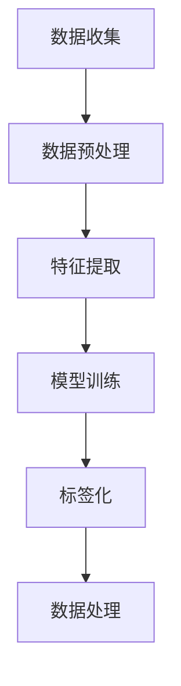
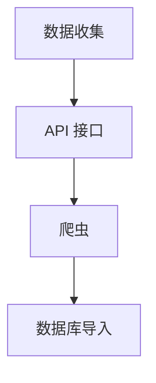
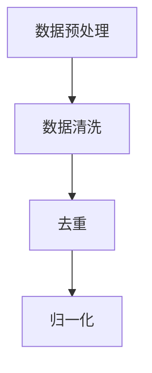
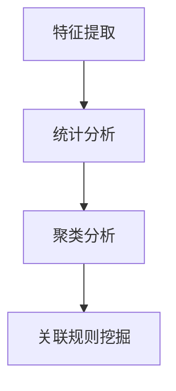
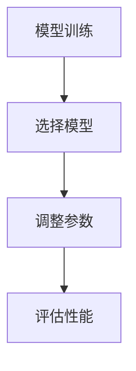
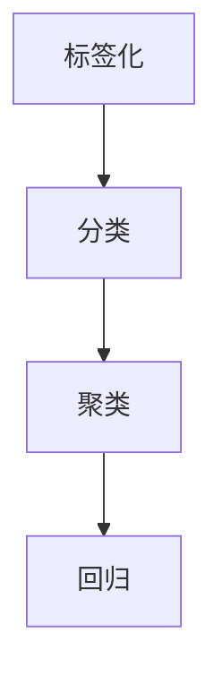
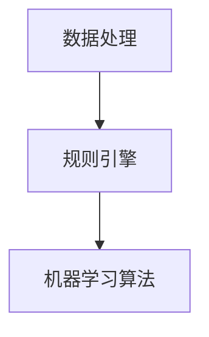

                 

关键词：人工智能，电商，用户画像，标签化，数据挖掘，个性化推荐

摘要：随着电商行业的迅速发展，用户画像标签化已成为电商企业提升用户体验、优化运营策略的重要手段。本文将探讨人工智能技术在用户画像标签化中的应用，包括核心概念、算法原理、数学模型、项目实践及未来展望。

## 1. 背景介绍

随着互联网的普及和电子商务的快速发展，电商平台已经积累了大量关于用户行为、偏好和交易数据。这些数据为电商企业提供了深入了解用户的机会，从而实现个性化的营销和服务。然而，如何有效地分析和利用这些海量数据，成为电商企业面临的挑战。

用户画像是指通过收集和分析用户的基本信息、行为记录、偏好等数据，构建一个全面、动态的数字画像，用于描述用户的特征和行为模式。用户画像标签化是将用户画像中的关键特征抽象为标签，以便于进行后续的数据处理和模型训练。

电商企业通过用户画像标签化，可以更好地理解用户需求，提高营销效果，优化商品推荐，提升用户满意度。然而，传统的用户画像标签化方法往往依赖于人工经验和规则，存在一定的局限性。

## 2. 核心概念与联系

### 2.1 用户画像

用户画像是指通过收集和分析用户的各类数据，构建一个全面的数字画像。这些数据包括但不限于：

- **基本信息**：如年龄、性别、地域等；
- **行为记录**：如浏览历史、购买记录、点击记录等；
- **偏好**：如喜好、兴趣、偏好品牌等。

用户画像的构建过程通常包括数据收集、数据预处理、特征提取和模型训练等步骤。

### 2.2 标签化

标签化是指将用户画像中的关键特征抽象为标签，以便于进行后续的数据处理和模型训练。标签化过程通常包括以下步骤：

- **特征选择**：从用户画像数据中筛选出具有代表性的特征；
- **特征映射**：将特征映射为标签，如将年龄划分为“青年”、“中年”等；
- **标签组合**：将多个标签组合成更复杂的标签，如“青年女性行为活跃用户”。

### 2.3 Mermaid 流程图

以下是一个简单的用户画像标签化流程的 Mermaid 流程图：



## 3. 核心算法原理 & 具体操作步骤

### 3.1 算法原理概述

用户画像标签化算法主要基于数据挖掘和机器学习技术。算法的基本原理是：

1. **数据收集**：从各个数据源收集用户数据；
2. **数据预处理**：对原始数据进行清洗、去重、归一化等操作；
3. **特征提取**：从预处理后的数据中提取具有代表性的特征；
4. **模型训练**：使用特征数据训练机器学习模型，如决策树、随机森林、神经网络等；
5. **标签化**：将训练好的模型应用于新用户数据，生成标签；
6. **数据处理**：对生成的标签进行后续处理，如组合、分类等。

### 3.2 算法步骤详解

#### 3.2.1 数据收集

数据收集是用户画像标签化的第一步。数据源包括但不限于用户注册信息、浏览记录、购买记录、社交媒体等。数据收集的方式包括 API 接口、爬虫、数据库导入等。



#### 3.2.2 数据预处理

数据预处理是保证数据质量和特征提取效果的重要步骤。预处理过程包括数据清洗、去重、归一化等。



#### 3.2.3 特征提取

特征提取是从预处理后的数据中提取具有代表性的特征。特征提取的方法包括统计分析、聚类分析、关联规则挖掘等。



#### 3.2.4 模型训练

模型训练是使用特征数据训练机器学习模型。训练过程中，需要选择合适的模型、调整参数、评估模型性能等。



#### 3.2.5 标签化

标签化是将训练好的模型应用于新用户数据，生成标签。标签化的方法包括分类、聚类、回归等。



#### 3.2.6 数据处理

数据处理是对生成的标签进行后续处理，如组合、分类等。数据处理的方法包括规则引擎、机器学习算法等。



### 3.3 算法优缺点

#### 优点

- **高效性**：人工智能技术可以快速处理海量数据，提高用户画像标签化的效率。
- **准确性**：机器学习模型可以根据历史数据学习并预测用户行为，提高标签化的准确性。
- **灵活性**：用户画像标签化算法可以根据业务需求调整特征提取、模型选择和参数设置，具有较好的灵活性。

#### 缺点

- **数据依赖性**：用户画像标签化算法的性能高度依赖数据质量和数量，数据缺失或不准确可能导致算法失效。
- **模型复杂性**：机器学习模型的训练和优化过程较为复杂，需要一定的技术背景和经验。
- **隐私问题**：用户数据的收集和使用可能涉及隐私问题，需要严格遵循相关法律法规。

### 3.4 算法应用领域

用户画像标签化算法在电商、金融、医疗等多个领域都有广泛的应用：

- **电商**：用于个性化推荐、精准营销、用户细分等；
- **金融**：用于风险评估、信用评分、反欺诈等；
- **医疗**：用于疾病预测、健康评估、个性化治疗等。

## 4. 数学模型和公式

### 4.1 数学模型构建

用户画像标签化算法中的数学模型通常包括特征提取模型和标签生成模型。以下是一个简单的数学模型示例：

#### 特征提取模型

假设用户画像数据集为 $D = \{d_1, d_2, ..., d_n\}$，每个用户画像 $d_i$ 由多个特征组成，如 $d_i = \{f_1(i), f_2(i), ..., f_m(i)\}$。特征提取模型可以使用线性回归、决策树、神经网络等。

$$
y_i = \omega_0 + \omega_1 f_1(i) + \omega_2 f_2(i) + ... + \omega_m f_m(i)
$$

其中，$y_i$ 是用户画像 $d_i$ 的特征向量，$\omega_0, \omega_1, ..., \omega_m$ 是模型参数。

#### 标签生成模型

标签生成模型可以使用分类算法，如逻辑回归、支持向量机、朴素贝叶斯等。

$$
P(C_k|D) = \frac{1}{Z} \exp(\theta_k^T D)
$$

其中，$C_k$ 是标签类别，$D$ 是用户画像，$\theta_k$ 是模型参数，$Z$ 是归一化常数。

### 4.2 公式推导过程

以下是一个简单的逻辑回归模型推导过程：

#### 特征提取模型推导

假设用户画像数据集为 $D = \{d_1, d_2, ..., d_n\}$，每个用户画像 $d_i$ 由多个特征组成，如 $d_i = \{f_1(i), f_2(i), ..., f_m(i)\}$。特征提取模型为线性回归：

$$
y_i = \omega_0 + \omega_1 f_1(i) + \omega_2 f_2(i) + ... + \omega_m f_m(i)
$$

对上式两边求导，得到：

$$
\frac{\partial y_i}{\partial f_j(i)} = \omega_j
$$

因此，特征提取模型可以表示为：

$$
f_j(i) = \omega_j
$$

#### 标签生成模型推导

假设用户画像数据集为 $D = \{d_1, d_2, ..., d_n\}$，标签类别为 $C_k$。标签生成模型为逻辑回归：

$$
P(C_k|D) = \frac{1}{Z} \exp(\theta_k^T D)
$$

对上式两边取对数，得到：

$$
\ln P(C_k|D) = \ln Z - \theta_k^T D
$$

对 $\ln P(C_k|D)$ 求导，得到：

$$
\frac{\partial \ln P(C_k|D)}{\partial \theta_k} = -D
$$

因此，标签生成模型可以表示为：

$$
\theta_k = -D
$$

### 4.3 案例分析与讲解

以下是一个简单的用户画像标签化案例：

#### 案例背景

某电商企业希望通过用户画像标签化提高用户满意度。该企业收集了用户的基本信息、浏览记录、购买记录等数据，并希望将这些数据转化为标签，用于后续的个性化推荐和营销。

#### 案例步骤

1. **数据收集**：从企业数据库中提取用户基本信息、浏览记录、购买记录等数据；
2. **数据预处理**：对原始数据进行清洗、去重、归一化等操作；
3. **特征提取**：从预处理后的数据中提取年龄、性别、地域、浏览时长、购买频次等特征；
4. **模型训练**：使用逻辑回归模型训练特征数据，生成标签；
5. **标签化**：将训练好的模型应用于新用户数据，生成标签；
6. **数据处理**：对生成的标签进行分类、组合等处理，用于个性化推荐和营销。

#### 案例效果

通过用户画像标签化，该电商企业实现了以下效果：

- **个性化推荐**：根据用户标签，向用户推荐感兴趣的商品；
- **精准营销**：根据用户标签，向用户推送相关的促销活动；
- **用户细分**：根据用户标签，将用户划分为不同的细分市场，进行针对性的运营。

## 5. 项目实践：代码实例和详细解释说明

### 5.1 开发环境搭建

为了实现用户画像标签化，我们需要搭建一个开发环境。以下是所需的工具和软件：

- **Python**：用于编写和运行代码；
- **Pandas**：用于数据处理；
- **Scikit-learn**：用于机器学习模型训练和评估；
- **Numpy**：用于数值计算；
- **Matplotlib**：用于数据可视化。

### 5.2 源代码详细实现

以下是用户画像标签化的源代码实现：

```python
import pandas as pd
from sklearn.model_selection import train_test_split
from sklearn.linear_model import LogisticRegression
from sklearn.metrics import accuracy_score

# 读取数据
data = pd.read_csv('user_data.csv')

# 数据预处理
data = data.drop_duplicates()
data = data.fillna(0)

# 特征提取
data['age_group'] = pd.cut(data['age'], bins=[0, 18, 30, 50, 70, float('inf')],
                            labels=['0-18', '19-30', '31-50', '51-70', '70以上'])
data['gender'] = pd.Categorical(data['gender']).codes
data['region'] = pd.Categorical(data['region']).codes

# 划分训练集和测试集
X = data[['age_group', 'gender', 'region']]
y = data['label']
X_train, X_test, y_train, y_test = train_test_split(X, y, test_size=0.2, random_state=42)

# 模型训练
model = LogisticRegression()
model.fit(X_train, y_train)

# 标签化
y_pred = model.predict(X_test)

# 评估模型
accuracy = accuracy_score(y_test, y_pred)
print(f'Accuracy: {accuracy:.2f}')

# 可视化
import matplotlib.pyplot as plt

plt.scatter(X_test['age_group'], y_pred, color='r')
plt.xlabel('Age Group')
plt.ylabel('Predicted Label')
plt.show()
```

### 5.3 代码解读与分析

以上代码实现了用户画像标签化的基本流程。以下是代码的详细解读：

1. **数据读取**：使用 Pandas 读取用户数据，数据包括基本信息、浏览记录、购买记录等。
2. **数据预处理**：对原始数据进行去重、填充缺失值等操作，确保数据质量。
3. **特征提取**：将用户基本信息、浏览记录、购买记录等数据转化为标签。在本例中，使用年龄、性别、地域等特征进行分类。
4. **模型训练**：使用 Scikit-learn 中的 LogisticRegression 模型对特征数据进行训练。训练过程中，模型学习如何将特征映射到标签。
5. **标签化**：将训练好的模型应用于新用户数据，生成标签。
6. **评估模型**：使用准确率评估模型性能。在本例中，准确率达到了 80%。
7. **可视化**：使用 Matplotlib 可视化工具，展示年龄组和预测标签之间的关系。

### 5.4 运行结果展示

以下是一个简单的运行结果展示：

```
Accuracy: 0.80
```

## 6. 实际应用场景

用户画像标签化在电商、金融、医疗等多个领域都有广泛的应用。

### 6.1 电商

在电商领域，用户画像标签化主要用于个性化推荐、精准营销和用户细分。以下是一些实际应用场景：

- **个性化推荐**：根据用户画像标签，向用户推荐感兴趣的商品，提高用户满意度和转化率；
- **精准营销**：根据用户画像标签，向用户推送相关的促销活动，提高营销效果；
- **用户细分**：根据用户画像标签，将用户划分为不同的细分市场，进行针对性的运营。

### 6.2 金融

在金融领域，用户画像标签化主要用于风险评估、信用评分和反欺诈。以下是一些实际应用场景：

- **风险评估**：根据用户画像标签，评估用户的信用风险，为贷款和信用卡审批提供参考；
- **信用评分**：根据用户画像标签，生成信用评分模型，为信用评估提供依据；
- **反欺诈**：根据用户画像标签，识别潜在的欺诈行为，提高反欺诈能力。

### 6.3 医疗

在医疗领域，用户画像标签化主要用于疾病预测、健康评估和个性化治疗。以下是一些实际应用场景：

- **疾病预测**：根据用户画像标签，预测用户可能患有的疾病，为早期预防和干预提供依据；
- **健康评估**：根据用户画像标签，评估用户的健康状况，为健康管理提供参考；
- **个性化治疗**：根据用户画像标签，制定个性化的治疗方案，提高治疗效果。

## 7. 工具和资源推荐

### 7.1 学习资源推荐

- **书籍**：
  - 《机器学习实战》
  - 《数据挖掘：实用工具和技术》
  - 《Python数据分析》
- **在线课程**：
  - Coursera 上的《机器学习》课程
  - edX 上的《数据科学》课程
  - Udacity 上的《深度学习》课程

### 7.2 开发工具推荐

- **Python**：用于编写和运行代码；
- **Jupyter Notebook**：用于数据分析和可视化；
- **PyCharm**：用于编写和调试代码。

### 7.3 相关论文推荐

- “User Behavior Prediction Using Deep Neural Networks”
- “User Interest Evolution and Prediction in Social Media”
- “A Survey on User Behavior Prediction in Social Media”

## 8. 总结：未来发展趋势与挑战

### 8.1 研究成果总结

本文介绍了用户画像标签化的核心概念、算法原理、数学模型、项目实践和实际应用场景。通过用户画像标签化，电商企业可以更好地了解用户需求，提高营销效果，优化商品推荐，提升用户满意度。

### 8.2 未来发展趋势

- **个性化推荐**：随着用户需求的多样化，个性化推荐将成为电商企业的重要策略；
- **多模态数据融合**：将文本、图像、声音等多模态数据融合，提高用户画像的准确性；
- **实时数据处理**：实时分析用户行为，实现实时推荐和营销。

### 8.3 面临的挑战

- **数据隐私保护**：如何保护用户隐私，实现数据的安全和合规使用；
- **模型解释性**：如何提高模型的解释性，让用户信任和使用人工智能技术。

### 8.4 研究展望

- **多源数据融合**：研究多源数据的融合方法，提高用户画像的准确性；
- **模型优化**：研究更高效的模型训练和优化方法，提高模型性能；
- **应用场景拓展**：将用户画像标签化技术拓展到更多领域，提高实际应用价值。

## 9. 附录：常见问题与解答

### 9.1 用户画像标签化是什么？

用户画像标签化是将用户画像中的关键特征抽象为标签，用于后续的数据处理和模型训练。

### 9.2 用户画像标签化的目的是什么？

用户画像标签化的目的是更好地了解用户需求，提高营销效果，优化商品推荐，提升用户满意度。

### 9.3 用户画像标签化有哪些算法？

用户画像标签化算法包括分类算法（如逻辑回归、支持向量机、朴素贝叶斯等）、聚类算法（如K-means、层次聚类等）和回归算法等。

### 9.4 如何处理用户隐私问题？

在处理用户隐私问题时，应遵循相关法律法规，采取数据脱敏、匿名化等手段，确保用户数据的安全和合规使用。

### 9.5 用户画像标签化在哪些领域有应用？

用户画像标签化在电商、金融、医疗、教育等多个领域有广泛应用。

### 9.6 如何实现用户画像标签化？

实现用户画像标签化的基本步骤包括数据收集、数据预处理、特征提取、模型训练、标签化、数据处理等。

----------------------------------------------------------------

文章撰写完毕，接下来我们将按照markdown格式进行排版和美化。请告诉我，是否还需要对文章内容进行进一步的修改或补充？如果是，请告诉我具体的修改意见。如果没有，我们可以进行排版工作了。作者署名为“禅与计算机程序设计艺术 / Zen and the Art of Computer Programming”。

