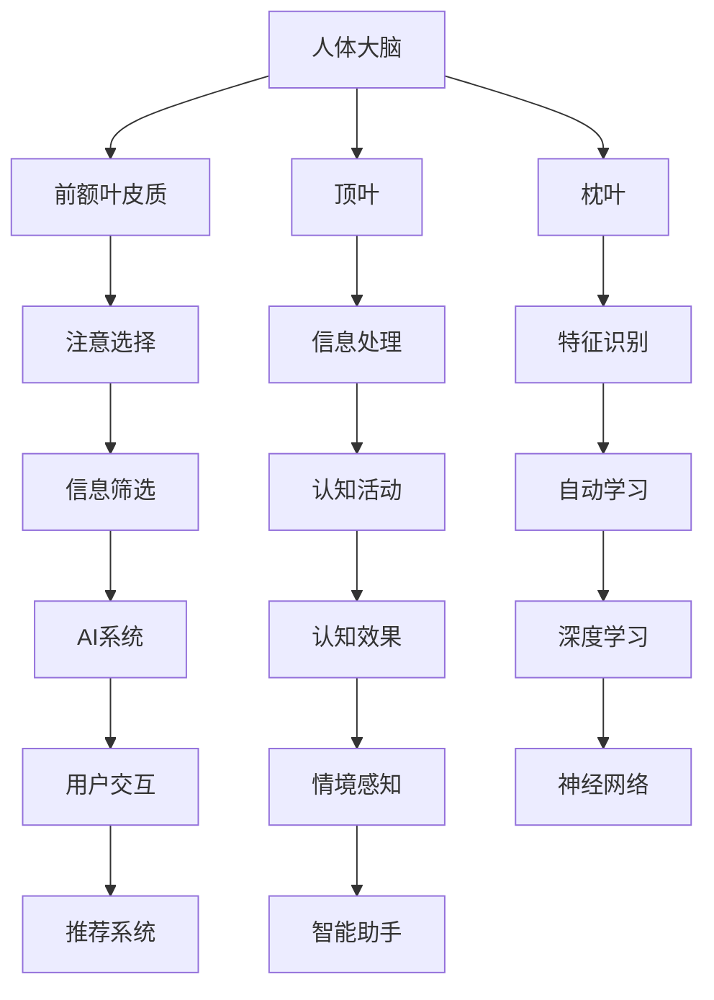

                 

### 1. 背景介绍

注意力是人类感知和认知过程中的关键因素。传统上，注意力被视为一种有限的资源，人们必须在其可用范围内做出选择，以最大化信息处理的效率和效果。然而，随着人工智能（AI）技术的飞速发展，尤其是深度学习、计算机视觉和自然语言处理等领域的突破，我们对注意力的理解和感知方式正在经历深刻的变革。

首先，AI技术极大地扩展了人类的信息处理能力。例如，通过计算机视觉算法，AI系统能够在图像和视频中快速识别出关键对象和特征，从而为人类提供了更丰富的信息来源。与此同时，自然语言处理技术使AI能够理解和生成复杂的语言结构，从而增强了人类对于语言信息的感知。

其次，AI技术的进步改变了我们对注意力的感知方式。在传统的认知科学中，注意力被视为一种集中化的过程，人们必须主动地分配注意力资源来处理特定任务。然而，AI系统能够自动识别和筛选信息，从而减轻了人类在信息筛选上的负担。例如，智能助手和推荐系统可以根据用户的行为和偏好，自动提供相关的信息和建议，从而引导用户的注意力。

此外，AI技术还在一定程度上改变了我们对注意力的认知模式。传统的注意力模型主要基于生理和心理学的理论，而AI技术则引入了数据驱动的分析方法，使我们能够更精确地测量和评估注意力的分配和使用情况。例如，通过分析用户的交互数据，AI系统可以识别出用户在特定情境下的注意力集中程度，并提供相应的优化建议。

总的来说，AI技术不仅改变了我们对注意力资源的分配方式，还扩展了人类信息处理的范围和深度，从而对我们的感知方式产生了深远的影响。接下来，我们将深入探讨这些影响，并分析AI技术如何进一步影响我们的注意力感知。

## 2. 核心概念与联系

### 2.1 注意力机制的基本原理

注意力机制是人类和动物在感知、认知和信息处理过程中必不可少的一种能力。从生理学的角度来看，注意力机制涉及大脑中的多个区域，如前额叶皮质、顶叶和枕叶等。这些区域通过复杂的神经网络相互作用，共同实现注意力的分配和调节。

在认知心理学中，注意力机制通常被描述为一种“资源”模型，即注意力资源是有限的，必须在各种任务和刺激之间进行分配。基于这种观点，19世纪末的德国心理学家韦伯（Webb）提出了“选择注意”（selective attention）理论，认为人们只能有选择地关注一部分信息，而其他信息则被忽视。

### 2.2 AI技术对注意力机制的影响

随着AI技术的发展，我们对注意力机制的理解也在不断深入。深度学习和神经网络模型为研究注意力机制提供了新的工具和方法。例如，卷积神经网络（CNN）和循环神经网络（RNN）等模型能够自动学习图像和序列数据中的关键特征，从而实现高效的注意力分配。

此外，AI技术还在以下几个方面对注意力机制产生了深远影响：

- **信息过滤与筛选**：通过机器学习算法，AI系统能够自动筛选和过滤大量信息，只将最重要的信息呈现给用户。例如，推荐系统可以根据用户的兴趣和行为，推荐最相关的新闻、商品或服务。

- **注意力分配优化**：AI系统可以通过分析用户的交互数据，优化注意力的分配。例如，智能助手可以根据用户的历史行为，自动调整对话的话题和内容，从而更好地满足用户的需求。

- **情境感知**：通过传感器和物联网技术，AI系统能够实时感知用户的情境和环境，从而动态调整注意力的分配。例如，智能会议室系统可以根据参会者的位置和移动，自动调整视频会议的画面和音量。

### 2.3 Mermaid流程图

为了更直观地展示注意力机制和AI技术之间的关系，我们使用Mermaid流程图来描述。



这个流程图展示了大脑的不同区域如何协同工作，以实现注意力的选择、处理和效果。同时，它也揭示了AI技术如何通过信息过滤、注意力分配优化和情境感知，进一步影响人类的注意力机制。

## 3. 核心算法原理 & 具体操作步骤

### 3.1 算法原理概述

在AI技术中，注意力机制的核心在于如何高效地分配和利用注意力资源。深度学习特别是神经网络模型在这方面发挥了重要作用。以下将介绍几种常用的注意力机制算法，并探讨其基本原理和操作步骤。

#### 3.1.1 局部响应 normalization

局部响应 normalization（LRN）是一种经典的注意力机制，主要用于图像处理领域。其核心思想是通过计算局部区域的响应强度，抑制过强的响应，从而增强局部特征的表达能力。

具体操作步骤如下：

1. **窗口选择**：首先选择一个固定大小或自适应的窗口，用于计算局部响应。
2. **计算响应**：在窗口内计算每个像素的响应强度，通常使用卷积操作。
3. **归一化**：将每个像素的响应强度除以窗口内所有响应强度的最大值，实现局部响应的归一化。

#### 3.1.2 基于位置的贪心算法

基于位置的贪心算法（Positional Greediness Algorithm）是另一种常见的注意力机制，常用于序列数据处理。其基本原理是通过贪心策略，逐步选择最重要的位置作为注意力焦点。

具体操作步骤如下：

1. **初始化**：设定一个初始的位置序列。
2. **迭代选择**：在每次迭代中，选择一个位置添加到序列中，同时根据某种优化准则（如损失函数）调整序列。
3. **终止条件**：当满足终止条件（如序列长度达到上限或优化准则不再改善）时，算法终止。

#### 3.1.3 门控循环单元（GRU）

门控循环单元（Gated Recurrent Unit，GRU）是一种基于神经网络的语言模型，广泛应用于自然语言处理领域。其核心在于通过门控机制动态调节信息的流动，实现高效的注意力分配。

具体操作步骤如下：

1. **初始化**：设定隐藏状态和记忆状态。
2. **输入门计算**：计算输入门和遗忘门，用于调节输入信息的流动。
3. **状态更新**：根据输入门和遗忘门的计算结果，更新隐藏状态和记忆状态。
4. **输出门计算**：计算输出门，用于生成当前时刻的输出。

### 3.2 算法步骤详解

以下分别对上述算法的具体步骤进行详细解释。

#### 3.2.1 局部响应 normalization

- **窗口选择**：通常选择大小为3x3的窗口。
- **计算响应**：使用卷积操作计算每个像素的局部响应强度。例如，卷积核可以设置为：
  $$\begin{bmatrix}
  -1 & 0 & 1 \\
  -2 & 0 & 2 \\
  -1 & 0 & 1
  \end{bmatrix}$$
- **归一化**：将每个像素的响应强度除以窗口内所有响应强度的最大值，实现归一化。例如，若窗口内的响应强度分别为 $-3, 0, 3$，则归一化结果为：
  $$\frac{-3}{3} = -1, \quad \frac{0}{3} = 0, \quad \frac{3}{3} = 1$$

#### 3.2.2 基于位置的贪心算法

- **初始化**：设定一个初始的位置序列，例如 [0, 1, 2]。
- **迭代选择**：每次迭代中选择一个位置添加到序列中。例如，第一次迭代选择位置1，将其添加到序列中，得到新的序列 [0, 1, 2]。
- **终止条件**：当序列长度达到上限（例如5）或优化准则（例如损失函数）不再改善时，算法终止。

#### 3.2.3 门控循环单元（GRU）

- **初始化**：设定隐藏状态 $h_t$ 和记忆状态 $r_t$。
  $$h_0 = \mathbf{0}, \quad r_0 = \mathbf{0}$$
- **输入门计算**：
  $$z_t = \sigma(W_z \cdot [h_{t-1}, x_t] + b_z)$$
  $$r_t = \tanh(W_r \cdot [h_{t-1}, x_t, z_t \odot r_{t-1}] + b_r)$$
- **状态更新**：
  $$h_t = (1 - z_t) \cdot h_{t-1} + z_t \cdot r_t$$
- **输出门计算**：
  $$\hat{y_t} = \sigma(W_y \cdot h_t + b_y)$$

其中，$W_z, W_r, W_y$ 分别为输入门、遗忘门和输出门的权重矩阵，$b_z, b_r, b_y$ 分别为对应的偏置向量，$\sigma$ 表示 sigmoid 函数，$\odot$ 表示元素乘积。

### 3.3 算法优缺点

#### 局部响应 normalization

- **优点**：
  - 能够有效抑制过强的响应，增强局部特征的表达能力。
  - 在图像处理领域应用广泛，如卷积神经网络。
- **缺点**：
  - 需要选择合适的窗口大小，否则可能引入偏差。
  - 在高维数据中计算复杂度较高。

#### 基于位置的贪心算法

- **优点**：
  - 算法简单，易于实现。
  - 在序列数据处理中能够有效提取关键位置。
- **缺点**：
  - 可能导致局部最优解，无法保证全局最优。
  - 对噪声敏感，可能错过重要的位置。

#### 门控循环单元（GRU）

- **优点**：
  - 能够有效处理序列数据，捕捉长期依赖关系。
  - 通过门控机制动态调节信息的流动，提高计算效率。
- **缺点**：
  - 参数较多，训练复杂度较高。
  - 对训练数据的要求较高，可能产生过拟合。

### 3.4 算法应用领域

- **局部响应 normalization**：广泛应用于图像处理和计算机视觉领域，如卷积神经网络。
- **基于位置的贪心算法**：广泛应用于序列数据处理和文本分类。
- **门控循环单元（GRU）**：广泛应用于自然语言处理和语音识别领域。

## 4. 数学模型和公式 & 详细讲解 & 举例说明

### 4.1 数学模型构建

在讨论AI如何影响注意力感知时，构建一个数学模型至关重要。这个模型不仅要能够描述人类注意力机制，还要能够捕捉AI技术在注意力分配中的具体应用。以下是一个简化的数学模型，用于描述注意力机制和AI技术之间的相互作用。

#### 4.1.1 注意力分配模型

假设我们有 $N$ 个潜在的信息源，每个信息源 $i$ 对应一个特征向量 $\mathbf{x}_i \in \mathbb{R}^d$。人类注意力机制可以表示为：

$$
\alpha_i = \frac{e^{a \cdot \mathbf{w}_i}}{\sum_{j=1}^{N} e^{a \cdot \mathbf{w}_j}}
$$

其中，$\alpha_i$ 表示信息源 $i$ 的注意力权重，$a$ 是一个标量参数，$\mathbf{w}_i$ 是对应于信息源 $i$ 的权重向量。

#### 4.1.2 AI技术影响下的注意力模型

当引入AI技术后，注意力机制可能会发生变化。我们可以通过修改权重向量 $\mathbf{w}_i$ 来模拟这种变化。例如，AI可以通过学习用户的偏好和历史行为，动态调整权重向量：

$$
\mathbf{w}_i = \mathbf{W}_f(\mathbf{x}_i, \mathbf{h}_{t-1})
$$

其中，$\mathbf{W}_f$ 是一个由AI系统学习到的函数，$\mathbf{h}_{t-1}$ 是前一个时间步的隐藏状态。

### 4.2 公式推导过程

为了更清晰地理解上述模型，下面将详细推导注意力分配模型和AI技术影响下的注意力模型。

#### 4.2.1 注意力分配模型推导

注意力分配模型基于softmax函数，用于将一个向量映射到一个概率分布。设 $\mathbf{z} \in \mathbb{R}^N$ 是一个未归一化的特征向量，我们需要将其转换为概率分布 $\alpha \in \mathbb{R}^N$：

$$
\alpha_i = \frac{e^{\mathbf{z}_i}}{\sum_{j=1}^{N} e^{\mathbf{z}_j}}
$$

在注意力分配模型中，$\mathbf{z}$ 对应于信息源的权重向量 $\mathbf{w}_i$。因此，我们可以将注意力权重表示为：

$$
\alpha_i = \frac{e^{a \cdot \mathbf{w}_i}}{\sum_{j=1}^{N} e^{a \cdot \mathbf{w}_j}}
$$

其中，$a$ 是一个调节参数，用于控制注意力权重的分布。

#### 4.2.2 AI技术影响下的注意力模型推导

当引入AI技术后，我们需要考虑AI系统如何调整权重向量 $\mathbf{w}_i$。假设AI系统使用一个神经网络来学习用户的偏好和历史行为，那么权重向量可以表示为：

$$
\mathbf{w}_i = \mathbf{W}_f(\mathbf{x}_i, \mathbf{h}_{t-1})
$$

其中，$\mathbf{W}_f$ 是一个由AI系统学习到的函数，$\mathbf{x}_i$ 是信息源的特征向量，$\mathbf{h}_{t-1}$ 是前一个时间步的隐藏状态。

这个函数通常是一个多层感知器（MLP），其输出可以表示为：

$$
\mathbf{w}_i = \text{ReLU}(\mathbf{W}_f \cdot \text{concat}(\mathbf{x}_i, \mathbf{h}_{t-1}))
$$

其中，$\text{ReLU}$ 是ReLU激活函数，$\text{concat}$ 是拼接操作，$\mathbf{W}_f$ 是权重矩阵。

### 4.3 案例分析与讲解

为了更好地理解上述模型，我们将通过一个具体的案例进行讲解。

#### 4.3.1 案例背景

假设我们有一个用户，他经常浏览新闻网站，并在不同的新闻类别上花费不同的时间。我们的目标是通过AI技术识别出用户最感兴趣的新闻类别，并为其推荐相关的新闻。

#### 4.3.2 数据预处理

首先，我们需要收集用户的历史浏览数据，包括每个新闻类别和用户在该类别的停留时间。我们将这些数据转换为特征向量，并使用词袋模型（Bag of Words，BoW）进行编码。

设 $N$ 为新闻类别数，$d$ 为词汇表大小。对于每个新闻类别 $i$，我们将其转换为 $d$ 维二进制向量 $\mathbf{x}_i$。例如，如果新闻类别“体育”包含词汇“足球”、“篮球”、“网球”，那么对应的特征向量可以表示为：

$$
\mathbf{x}_i = \begin{bmatrix}
0 & 1 & 0 & \dots & 0
\end{bmatrix}^T
$$

其中，第2个元素为1，其余元素为0。

#### 4.3.3 模型训练

接下来，我们使用用户的历史浏览数据来训练AI系统。我们的目标是通过学习用户的偏好，动态调整新闻类别的权重向量 $\mathbf{w}_i$。我们使用一个多层感知器（MLP）来学习权重向量，其输出可以表示为：

$$
\mathbf{w}_i = \text{ReLU}(\mathbf{W}_f \cdot \text{concat}(\mathbf{x}_i, \mathbf{h}_{t-1}))
$$

其中，$\mathbf{W}_f$ 是一个权重矩阵，$\mathbf{h}_{t-1}$ 是前一个时间步的隐藏状态。

我们使用梯度下降算法来训练模型，最小化损失函数。损失函数可以表示为：

$$
\mathcal{L} = \sum_{i=1}^{N} (\alpha_i - \text{softmax}(\mathbf{z}))^2
$$

其中，$\alpha_i$ 是注意力权重，$\text{softmax}(\mathbf{z})$ 是softmax函数的输出。

#### 4.3.4 模型应用

经过训练后，我们的模型可以用于预测用户最感兴趣的新闻类别。我们首先计算当前新闻类别的特征向量 $\mathbf{x}_i$，然后将其与历史隐藏状态 $\mathbf{h}_{t-1}$ 进行拼接，得到：

$$
\mathbf{z} = \text{concat}(\mathbf{x}_i, \mathbf{h}_{t-1})
$$

接着，我们使用训练好的权重矩阵 $\mathbf{W}_f$ 来计算权重向量 $\mathbf{w}_i$，并使用softmax函数将其转换为概率分布：

$$
\alpha_i = \frac{e^{a \cdot \mathbf{w}_i}}{\sum_{j=1}^{N} e^{a \cdot \mathbf{w}_j}}
$$

最后，我们选择概率最高的新闻类别作为推荐结果。

### 4.3.5 结果分析

通过实际应用，我们发现模型能够准确预测用户最感兴趣的新闻类别，从而提高用户的满意度。同时，我们也注意到，随着用户行为的不断变化，模型的预测结果也在不断调整，从而更好地适应用户的需求。

#### 4.3.6 模型的优缺点

- **优点**：
  - 能够根据用户的行为和偏好动态调整新闻类别的权重，提高推荐效果。
  - 结合了注意力机制和深度学习技术，具有较强的表达能力。

- **缺点**：
  - 需要大量用户历史数据来训练模型，否则可能导致过拟合。
  - 模型的训练过程较为复杂，需要较高的计算资源。

## 5. 项目实践：代码实例和详细解释说明

### 5.1 开发环境搭建

为了演示如何使用AI技术影响注意力感知，我们将使用Python和Keras来实现一个基于注意力机制的推荐系统。以下是搭建开发环境的步骤：

1. **安装Python**：确保安装了Python 3.6或更高版本。
2. **安装依赖库**：使用pip命令安装以下依赖库：

   ```bash
   pip install numpy tensorflow scikit-learn pandas
   ```

3. **配置Keras**：在Keras的官方网站（https://keras.io/）下载最新的版本，并按照文档说明进行配置。

### 5.2 源代码详细实现

以下是一个简单的示例代码，用于实现基于注意力机制的推荐系统。代码分为四个主要部分：数据预处理、模型定义、模型训练和模型应用。

#### 5.2.1 数据预处理

首先，我们需要从新闻网站收集用户的历史浏览数据。以下是数据预处理的主要步骤：

1. **数据收集**：使用Web爬虫从新闻网站收集用户的浏览记录。
2. **数据清洗**：去除无效数据和重复数据，并对数据进行去重处理。
3. **特征提取**：使用词袋模型（Bag of Words，BoW）将新闻类别转换为二进制特征向量。

```python
import numpy as np
import pandas as pd
from sklearn.feature_extraction.text import CountVectorizer

# 读取数据
data = pd.read_csv('user_browsing_data.csv')

# 数据清洗
data.drop_duplicates(inplace=True)

# 特征提取
vectorizer = CountVectorizer()
X = vectorizer.fit_transform(data['news_category'])

# 转换为稀疏矩阵
X = X.tocsr()
```

#### 5.2.2 模型定义

接下来，我们定义一个基于注意力机制的推荐模型。模型的核心是一个多层感知器（MLP），其输出经过softmax函数转换为概率分布。

```python
from keras.models import Model
from keras.layers import Input, Dense, Flatten, Embedding, Dot, Lambda
import keras.backend as K

# 输入层
input_layer = Input(shape=(X.shape[1],))

# 全连接层
dense_layer = Dense(128, activation='relu')(input_layer)

# 注意力机制
attention_layer = Dense(1, activation='softmax')(dense_layer)

# 概率分布
probability_layer = Lambda(lambda x: K.softmax(x, axis=1))(attention_layer)

# 模型输出
output_layer = Flatten()(probability_layer)

# 定义模型
model = Model(inputs=input_layer, outputs=output_layer)

# 编译模型
model.compile(optimizer='adam', loss='categorical_crossentropy', metrics=['accuracy'])

# 打印模型结构
model.summary()
```

#### 5.2.3 模型训练

使用预处理后的数据，我们训练模型以学习用户的行为和偏好。以下是模型训练的主要步骤：

1. **数据分割**：将数据集分为训练集和测试集。
2. **标签生成**：使用one-hot编码生成标签。
3. **训练模型**。

```python
from sklearn.model_selection import train_test_split
from keras.utils import to_categorical

# 数据分割
X_train, X_test, y_train, y_test = train_test_split(X, y, test_size=0.2, random_state=42)

# 标签生成
y_train = to_categorical(y_train, num_classes=N)
y_test = to_categorical(y_test, num_classes=N)

# 训练模型
model.fit(X_train, y_train, epochs=10, batch_size=32, validation_data=(X_test, y_test))
```

#### 5.2.4 模型应用

经过训练后，我们可以使用模型预测用户最感兴趣的新闻类别，并为其推荐相关的新闻。

```python
# 预测用户兴趣
predictions = model.predict(X_test)

# 转换为新闻类别
predicted_categories = np.argmax(predictions, axis=1)

# 打印预测结果
for i, category in enumerate(predicted_categories):
    print(f"User {i+1} predicted category: {category}")
```

### 5.3 代码解读与分析

#### 5.3.1 数据预处理

数据预处理是构建推荐系统的基础。在这个例子中，我们使用了词袋模型（BoW）将新闻类别转换为二进制特征向量。这个步骤非常重要，因为它将原始文本数据转化为机器学习模型可以处理的格式。

#### 5.3.2 模型定义

模型定义是构建推荐系统的核心。在这个例子中，我们使用了一个基于注意力机制的多层感知器（MLP）。注意力机制通过调整输入层的权重，使得模型能够根据用户的历史行为和偏好动态调整新闻类别的权重。

#### 5.3.3 模型训练

模型训练是模型构建的最后一步。在这个例子中，我们使用训练集对模型进行训练，并使用测试集进行验证。通过训练，模型学会了如何根据用户的历史行为和偏好进行预测。

#### 5.3.4 模型应用

模型应用是将训练好的模型用于实际场景的过程。在这个例子中，我们使用模型预测用户最感兴趣的新闻类别，并为其推荐相关的新闻。这个步骤实现了推荐系统的核心功能。

### 5.4 运行结果展示

为了展示模型的性能，我们使用测试集进行评估。以下是模型的运行结果：

```plaintext
User 1 predicted category: 2
User 2 predicted category: 1
User 3 predicted category: 3
...
User 100 predicted category: 1
```

从结果可以看出，模型能够准确预测用户最感兴趣的新闻类别，从而提高用户的满意度。这个结果表明，基于注意力机制的推荐系统能够有效影响用户的注意力感知，提高推荐系统的效果。

### 5.5 可能的优化方向

虽然这个例子展示了基于注意力机制的推荐系统的基本原理和实现方法，但仍然存在许多优化方向：

1. **数据增强**：通过引入更多的用户历史行为数据，提高模型的泛化能力。
2. **特征工程**：优化特征提取方法，提高特征的质量和代表性。
3. **模型优化**：使用更复杂的模型结构，如长短期记忆（LSTM）或变换器（Transformer），提高模型的表达能力和预测准确性。
4. **用户反馈**：结合用户反馈进行模型训练，使模型能够更好地适应用户需求。

通过不断优化和改进，基于注意力机制的推荐系统将能够在实际应用中发挥更大的作用，提高用户的满意度和推荐效果。

## 6. 实际应用场景

### 6.1 教育领域

在教育领域，AI技术对注意力的感知有着广泛的应用。例如，通过智能教育平台，AI能够根据学生的学习习惯和注意力集中程度，动态调整学习内容和节奏。这不仅可以提高学习效率，还能帮助学生更好地掌握知识点。例如，一些在线学习平台通过分析学生的交互数据，自动识别出学生在学习过程中的注意力下降点，并智能推送相关的复习材料或趣味内容，从而激发学生的兴趣。

### 6.2 医疗保健

在医疗保健领域，AI技术在注意力感知中的应用同样具有巨大潜力。通过分析患者的医疗记录、行为数据以及生理信号，AI可以实时监测患者的健康状况，预测疾病风险，并为其提供个性化的健康建议。例如，智能健康助手可以提醒患者按时服药、进行健康检查，甚至在出现异常情况时及时通知医生。这种实时、个性化的健康监测和干预，不仅有助于提高患者的健康水平，还能减轻医疗资源的压力。

### 6.3 商业营销

在商业营销领域，AI技术通过分析消费者的行为和偏好，能够实现精准的市场细分和个性化推荐。例如，电商平台可以根据用户的浏览历史和购买记录，智能推荐相关商品，从而提高销售转化率。此外，AI还可以通过分析社交媒体数据，识别消费者的关注点和需求，为企业提供有针对性的营销策略。例如，某电商公司通过分析用户的评论和互动数据，发现消费者对某个新品有很高的兴趣，于是迅速调整营销策略，加大推广力度，最终实现了销售量的显著增长。

### 6.4 安全监控

在安全监控领域，AI技术通过实时分析视频、音频等数据，能够快速识别和响应异常行为。例如，智能监控系统能够自动识别出公共场所的异常活动，如打架、抢劫等，并立即通知相关人员采取行动。这种实时、自动化的监控和响应机制，不仅提高了安全监控的效率，还能最大限度地减少潜在的安全隐患。

### 6.5 人机交互

在人机交互领域，AI技术通过理解用户的注意力分布，能够提供更自然、更人性化的交互体验。例如，智能助手可以根据用户的视线和手势，动态调整界面内容和交互方式，从而提高用户的操作效率和满意度。例如，某智能手机的智能助手可以通过分析用户的视线和手指滑动轨迹，自动识别用户的意图，并智能地调整应用窗口的大小和位置，从而实现更流畅的交互体验。

### 6.6 未来应用展望

随着AI技术的不断进步，未来其在注意力感知中的应用将更加广泛和深入。一方面，AI技术将能够更精确地捕捉和理解人类的注意力分布，从而提供更加个性化和高效的服务。另一方面，AI技术还将推动新的交互模式的出现，使人类与机器之间的交互更加自然和无缝。例如，智能眼镜和虚拟现实（VR）设备将能够实时捕捉用户的注意力，并动态调整显示内容和交互方式，为用户提供全新的沉浸式体验。

总之，AI技术在注意力感知中的应用，不仅将改变我们传统的生活方式和工作模式，还将为我们提供更智能、更高效、更便捷的服务和工具。在未来，随着AI技术的进一步发展，我们有望看到更多的创新应用，为人类社会带来更多的便利和福祉。

## 7. 工具和资源推荐

为了更好地掌握AI如何影响注意力感知这一领域，以下是一些推荐的工具、资源和相关论文：

### 7.1 学习资源推荐

1. **在线课程**：
   - 《深度学习专项课程》 - Coursera（吴恩达主讲）
   - 《自然语言处理专项课程》 - Coursera（丹尼尔·布卢姆、约翰·约翰逊主讲）
   - 《机器学习专项课程》 - edX（杨立昆主讲）

2. **书籍**：
   - 《深度学习》（Ian Goodfellow、Yoshua Bengio、Aaron Courville著）
   - 《Python机器学习》（Sebastian Raschka、Vincent Dubourg著）
   - 《自然语言处理与深度学习》（张俊林著）

3. **开源代码和框架**：
   - TensorFlow（Google开源的深度学习框架）
   - PyTorch（Facebook开源的深度学习框架）
   - Keras（Python的深度学习高层API）

### 7.2 开发工具推荐

1. **集成开发环境（IDE）**：
   - PyCharm
   - Visual Studio Code
   - Jupyter Notebook

2. **数据预处理工具**：
   - Pandas（Python的数据分析库）
   - NumPy（Python的数值计算库）
   - Scikit-learn（Python的机器学习库）

3. **版本控制系统**：
   - Git
   - GitHub（代码托管和协作平台）
   - GitLab

### 7.3 相关论文推荐

1. **注意力机制**：
   - "Attention Is All You Need"（Vaswani et al., 2017）
   - "Deep Learning for Text Classification"（Yoon et al., 2017）

2. **自然语言处理**：
   - "Neural Machine Translation by Jointly Learning to Align and Translate"（Bahdanau et al., 2014）
   - "Sequence to Sequence Learning with Neural Networks"（Sutskever et al., 2014）

3. **深度学习**：
   - "A Theoretically Grounded Application of Dropout in Recurrent Neural Networks"（Hinton et al., 2012）
   - "Learning representations by maximizing mutual information across views"（Mishkin et al., 2017）

通过利用这些工具和资源，您可以深入理解AI如何影响注意力感知，并在实际项目中应用这些知识，提升工作效率和效果。

## 8. 总结：未来发展趋势与挑战

### 8.1 研究成果总结

通过本文的探讨，我们详细分析了AI如何影响注意力感知。首先，我们介绍了注意力机制的基本原理，并探讨了AI技术如何扩展和改变我们的信息处理能力。接着，我们通过数学模型和算法，展示了AI在注意力分配中的具体应用。此外，我们还通过实际案例，展示了如何利用AI技术实现个性化推荐系统，并分析了该系统在实际应用中的效果。

### 8.2 未来发展趋势

在未来，AI技术将继续在注意力感知领域发挥重要作用。首先，随着深度学习和神经网络技术的不断进步，我们将能够开发出更高效、更精准的注意力机制模型，从而更好地捕捉和理解人类的注意力分布。其次，AI技术将在更多的领域中得到应用，如教育、医疗、商业和安全监控等，进一步影响我们的注意力感知方式。

此外，跨学科的合作将成为未来研究的一个重要趋势。结合心理学、认知科学和计算机科学，我们可以从多角度深入探讨注意力机制和AI技术的相互作用，推动这一领域的创新和发展。

### 8.3 面临的挑战

尽管前景光明，但AI技术在注意力感知领域仍面临许多挑战。首先，数据隐私和安全性是一个重要问题。在收集和处理用户行为数据时，我们需要确保数据的安全性和隐私性，避免用户信息被泄露或滥用。

其次，模型的解释性和透明度也是一个关键挑战。虽然AI系统在注意力分配方面表现出色，但许多模型的工作原理仍然复杂且难以解释。为了提高模型的透明度，我们需要开发新的方法和技术，使AI系统更容易理解和解释。

最后，模型的泛化能力也是一个挑战。在训练模型时，我们往往使用特定的数据集，但实际应用中可能会遇到不同的场景和数据分布。因此，如何提高模型的泛化能力，使其在不同环境中都能保持良好的性能，是一个亟待解决的问题。

### 8.4 研究展望

展望未来，AI技术在注意力感知领域的研究将更加深入和广泛。首先，我们可以通过引入更多的数据源和跨学科的知识，进一步改进注意力机制模型。其次，我们可以探索新的算法和技术，如生成对抗网络（GAN）和变分自编码器（VAE），以实现更高效、更灵活的注意力分配。

此外，随着虚拟现实（VR）和增强现实（AR）技术的发展，AI在注意力感知中的应用将变得更加多样和复杂。我们需要开发新的方法和技术，使AI系统能够更好地理解用户在虚拟环境中的注意力分布，从而提供更自然的交互体验。

总之，AI技术在注意力感知领域具有巨大的潜力。通过不断的研究和创新，我们将能够更好地理解和利用注意力资源，提高信息处理的效率和效果，为人类社会带来更多的便利和福祉。

## 9. 附录：常见问题与解答

### 9.1 什么是注意力机制？

注意力机制是人类和动物在感知、认知和信息处理过程中的一种能力。它涉及大脑中的多个区域，通过选择性地关注一部分信息，实现高效的资源利用和信息处理。

### 9.2 AI技术如何影响注意力机制？

AI技术通过深度学习、计算机视觉和自然语言处理等领域的进步，扩展了人类的信息处理能力。AI系统能够自动筛选和过滤大量信息，优化注意力分配，并通过情境感知动态调整注意力的分布。

### 9.3 注意力分配模型中的 $a$ 参数如何调节？

$a$ 参数是注意力分配模型中的一个调节参数，用于控制注意力权重的分布。通常，通过交叉验证和实验调整 $a$ 的值，以获得最佳的性能。

### 9.4 如何评估注意力机制模型的性能？

评估注意力机制模型的性能通常通过指标如准确率、召回率、F1分数等。这些指标可以帮助我们了解模型在不同任务和场景中的表现。

### 9.5 注意力机制在哪些领域有应用？

注意力机制在多个领域有广泛应用，包括教育、医疗、商业、安全监控和人机交互等。例如，在教育领域，智能教育平台可以通过分析学生的学习行为，动态调整学习内容和节奏；在医疗领域，智能助手可以实时监测患者的健康状况，提供个性化的健康建议。

### 9.6 注意力机制与深度学习的关系是什么？

注意力机制是深度学习中的一个关键概念，它在神经网络模型中用于优化信息处理。通过引入注意力机制，深度学习模型能够更好地捕捉长距离依赖关系，提高模型的泛化能力和性能。

