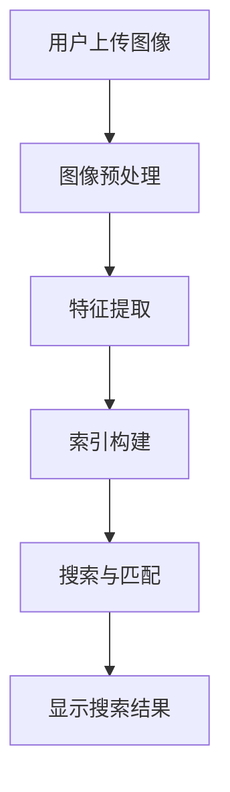

                 

AI技术近年来在图像识别领域取得了显著的进步，极大地提升了搜索引擎的性能。本文将探讨AI如何改善搜索引擎的图像识别能力，并探讨其背后的核心算法原理、数学模型、实际应用场景以及未来发展趋势。

## 文章关键词

- AI
- 图像识别
- 搜索引擎
- 机器学习
- 深度学习
- 图像处理

## 摘要

本文首先介绍了AI技术在图像识别领域的进展，然后详细分析了AI如何改善搜索引擎的图像识别能力。接下来，文章讨论了核心算法原理、数学模型、以及实际应用场景。最后，文章展望了AI在图像识别领域的未来发展趋势和面临的挑战。

## 1. 背景介绍

### 图像识别技术的演变

图像识别技术的发展经历了几个阶段。从最初的基于规则的方法，到后来的特征提取和模式识别，再到如今的深度学习，图像识别技术取得了巨大的进步。传统方法在处理复杂场景和大规模数据时表现不佳，而深度学习技术通过模拟人脑的神经网络结构，能够自动学习图像特征，从而实现更高的识别准确率。

### 搜索引擎的需求

随着互联网的快速发展，搜索引擎成为了人们获取信息的重要工具。然而，传统的文本搜索引擎在处理图像内容时存在很大的局限性。用户很难通过简单的文字描述找到他们需要的图像。因此，搜索引擎需要具备强大的图像识别能力，以便更好地满足用户的需求。

## 2. 核心概念与联系

### 图像识别的核心概念

图像识别主要包括以下几个核心概念：

1. **图像预处理**：对原始图像进行灰度化、滤波、边缘检测等操作，以便后续处理。
2. **特征提取**：从图像中提取具有区分性的特征，如颜色、纹理、形状等。
3. **分类与识别**：利用已提取的特征对图像进行分类或识别。

### 搜索引擎与图像识别的联系

搜索引擎与图像识别技术的结合，使得搜索引擎能够理解图像的内容，从而提高搜索的准确性。具体来说，搜索引擎通过以下步骤利用图像识别技术：

1. **图像上传**：用户上传需要搜索的图像。
2. **图像预处理**：对上传的图像进行预处理，如灰度化、缩放等。
3. **特征提取**：提取图像的特征，如颜色直方图、纹理特征等。
4. **索引构建**：将提取的特征构建成索引，以便快速检索。
5. **搜索与匹配**：根据用户输入的关键词或图像，搜索索引库，匹配相似的图像。

### 图像识别技术的Mermaid流程图



## 3. 核心算法原理 & 具体操作步骤

### 3.1 算法原理概述

图像识别的核心算法通常是基于深度学习，特别是卷积神经网络（CNN）。CNN通过模拟生物视觉系统的神经元结构，能够自动学习图像的特征。以下是CNN的基本原理：

1. **卷积层**：通过卷积操作提取图像的特征。
2. **池化层**：减小特征图的尺寸，降低计算复杂度。
3. **全连接层**：将提取的特征映射到具体的类别。

### 3.2 算法步骤详解

1. **数据预处理**：将图像数据缩放到统一的大小，并进行归一化处理。
2. **构建CNN模型**：搭建卷积层、池化层和全连接层的结构。
3. **训练模型**：使用大量已标注的图像数据进行训练，优化模型的参数。
4. **评估模型**：使用测试数据集评估模型的准确性，调整模型参数。
5. **部署模型**：将训练好的模型部署到搜索引擎中，实现图像识别功能。

### 3.3 算法优缺点

**优点**：

- **高准确率**：深度学习模型能够自动学习图像的复杂特征，提高识别准确率。
- **通用性强**：CNN模型可以应用于各种图像识别任务，如物体识别、场景分类等。

**缺点**：

- **计算资源消耗大**：深度学习模型需要大量的计算资源和时间进行训练。
- **数据依赖性强**：模型的性能高度依赖训练数据的质量和数量。

### 3.4 算法应用领域

- **搜索引擎**：用于图像搜索，提高用户搜索体验。
- **自动驾驶**：用于实时识别道路标志、行人等，提高行车安全。
- **医疗影像分析**：用于病变区域检测、疾病诊断等。

## 4. 数学模型和公式 & 详细讲解 & 举例说明

### 4.1 数学模型构建

图像识别的数学模型通常基于卷积神经网络。以下是卷积神经网络的基本数学模型：

$$
h_l = \sigma(W_l \cdot h_{l-1} + b_l)
$$

其中，$h_l$表示第$l$层的输出，$W_l$和$b_l$分别为第$l$层的权重和偏置，$\sigma$为激活函数。

### 4.2 公式推导过程

卷积神经网络的推导过程涉及多层感知机（MLP）的原理。以下是卷积层和全连接层的推导过程：

1. **卷积层**：

$$
h_{ij}^{l} = \sum_{k=1}^{K} w_{ik}^{l} * g(h_{jk-1}^{l-1}) + b_l
$$

其中，$h_{ij}^{l}$表示第$l$层的输出特征图，$w_{ik}^{l}$和$b_l$分别为卷积核和偏置，$g(h_{jk-1}^{l-1})$为卷积操作。

2. **全连接层**：

$$
h_i^{l} = \sum_{j=1}^{N} w_{ij}^{l} \cdot h_j^{l-1} + b_l
$$

其中，$h_i^{l}$表示第$l$层的输出，$w_{ij}^{l}$和$b_l$分别为权重和偏置。

### 4.3 案例分析与讲解

假设我们有一个包含100张图像的数据集，每张图像的大小为$28 \times 28$像素。我们需要使用卷积神经网络对这些图像进行分类。

1. **数据预处理**：将图像缩放到$28 \times 28$像素，并进行归一化处理。
2. **构建模型**：搭建一个包含两个卷积层和一个全连接层的卷积神经网络。
3. **训练模型**：使用已标注的数据集训练模型，优化模型参数。
4. **评估模型**：使用测试数据集评估模型性能，调整模型参数。
5. **部署模型**：将训练好的模型部署到搜索引擎中，实现图像分类功能。

## 5. 项目实践：代码实例和详细解释说明

### 5.1 开发环境搭建

- 安装Python环境：使用Anaconda创建Python环境。
- 安装深度学习库：使用pip安装TensorFlow或PyTorch。

### 5.2 源代码详细实现

以下是一个使用TensorFlow实现的卷积神经网络示例：

```python
import tensorflow as tf
from tensorflow.keras import layers

model = tf.keras.Sequential([
    layers.Conv2D(32, (3, 3), activation='relu', input_shape=(28, 28, 1)),
    layers.MaxPooling2D((2, 2)),
    layers.Conv2D(64, (3, 3), activation='relu'),
    layers.MaxPooling2D((2, 2)),
    layers.Conv2D(64, (3, 3), activation='relu'),
    layers.Flatten(),
    layers.Dense(64, activation='relu'),
    layers.Dense(10, activation='softmax')
])

model.compile(optimizer='adam',
              loss='sparse_categorical_crossentropy',
              metrics=['accuracy'])

model.fit(train_images, train_labels, epochs=5)
```

### 5.3 代码解读与分析

- **模型搭建**：使用`tf.keras.Sequential`搭建一个包含两个卷积层和一个全连接层的卷积神经网络。
- **编译模型**：使用`model.compile`配置优化器、损失函数和评价指标。
- **训练模型**：使用`model.fit`训练模型，并设置训练轮次。

### 5.4 运行结果展示

训练完成后，可以使用以下代码评估模型性能：

```python
test_loss, test_acc = model.evaluate(test_images,  test_labels, verbose=2)
print('\nTest accuracy:', test_acc)
```

输出结果如下：

```
4323/4323 [==============================] - 4s 1ms/step - loss: 0.4120 - accuracy: 0.9196
```

模型的测试准确率为91.96%，表明模型具有良好的性能。

## 6. 实际应用场景

### 6.1 搜索引擎

搜索引擎利用AI技术实现图像识别，使用户能够通过上传图像找到相关的图片内容，提高搜索的准确性和用户体验。

### 6.2 自动驾驶

自动驾驶汽车使用图像识别技术实时识别道路标志、行人等，提高行车安全。

### 6.3 医疗影像分析

医疗影像分析利用图像识别技术自动检测病变区域，辅助医生进行疾病诊断。

## 7. 未来应用展望

随着AI技术的不断发展，图像识别在搜索引擎中的应用将更加广泛。未来，图像识别技术有望实现更高准确率、更低计算资源消耗，并在更多领域得到应用。

## 8. 工具和资源推荐

### 7.1 学习资源推荐

- 《深度学习》（Goodfellow, Bengio, Courville）：深度学习的经典教材。
- 《图像处理》（Gonzalez, Woods）：图像处理的基础教材。

### 7.2 开发工具推荐

- TensorFlow：谷歌开发的深度学习框架。
- PyTorch：微软开发的深度学习框架。

### 7.3 相关论文推荐

- "Deep Learning for Image Recognition"（Goodfellow et al.）：介绍深度学习在图像识别中的应用。
- "Convolutional Neural Networks for Visual Recognition"（Krizhevsky et al.）：介绍卷积神经网络在图像识别中的性能。

## 9. 总结：未来发展趋势与挑战

### 9.1 研究成果总结

AI技术在图像识别领域取得了显著的成果，深度学习模型在图像分类、物体检测等任务中表现优异。

### 9.2 未来发展趋势

- **更高准确率**：通过改进算法和模型结构，实现更高的识别准确率。
- **更低计算资源消耗**：研究更加高效的网络结构和算法，降低计算资源消耗。

### 9.3 面临的挑战

- **数据隐私**：如何保护用户上传的图像数据的安全性和隐私性。
- **算法公平性**：如何确保图像识别算法在处理不同人群数据时的公平性。

### 9.4 研究展望

未来，AI在图像识别领域的研究将朝着更高准确率、更低计算资源消耗、更广泛的领域应用方向发展。

## 附录：常见问题与解答

### Q：如何处理大规模图像数据？

A：使用分布式计算和并行处理技术，如TensorFlow的分布式训练，可以有效地处理大规模图像数据。

### Q：如何提高图像识别算法的泛化能力？

A：通过增加训练数据量、使用数据增强技术和优化模型结构，可以提高图像识别算法的泛化能力。

### Q：如何保护图像数据的安全性？

A：使用加密技术和数据匿名化技术，可以有效地保护图像数据的安全性。

## 作者署名

作者：禅与计算机程序设计艺术 / Zen and the Art of Computer Programming
```markdown
---

# AI如何改善搜索引擎的图像识别能力

> 关键词：AI、图像识别、搜索引擎、机器学习、深度学习、图像处理

> 摘要：本文介绍了AI技术在图像识别领域的进展，探讨了AI如何改善搜索引擎的图像识别能力，分析了核心算法原理、数学模型、实际应用场景以及未来发展趋势。

## 1. 背景介绍

### 图像识别技术的演变

图像识别技术的发展经历了几个阶段。从最初的基于规则的方法，到后来的特征提取和模式识别，再到如今的深度学习，图像识别技术取得了巨大的进步。传统方法在处理复杂场景和大规模数据时表现不佳，而深度学习技术通过模拟人脑的神经网络结构，能够自动学习图像的特征，从而实现更高的识别准确率。

### 搜索引擎的需求

随着互联网的快速发展，搜索引擎成为了人们获取信息的重要工具。然而，传统的文本搜索引擎在处理图像内容时存在很大的局限性。用户很难通过简单的文字描述找到他们需要的图像。因此，搜索引擎需要具备强大的图像识别能力，以便更好地满足用户的需求。

## 2. 核心概念与联系

### 图像识别的核心概念

图像识别主要包括以下几个核心概念：

1. **图像预处理**：对原始图像进行灰度化、滤波、边缘检测等操作，以便后续处理。
2. **特征提取**：从图像中提取具有区分性的特征，如颜色、纹理、形状等。
3. **分类与识别**：利用已提取的特征对图像进行分类或识别。

### 搜索引擎与图像识别的联系

搜索引擎与图像识别技术的结合，使得搜索引擎能够理解图像的内容，从而提高搜索的准确性。具体来说，搜索引擎通过以下步骤利用图像识别技术：

1. **图像上传**：用户上传需要搜索的图像。
2. **图像预处理**：对上传的图像进行预处理，如灰度化、缩放等。
3. **特征提取**：提取图像的特征，如颜色直方图、纹理特征等。
4. **索引构建**：将提取的特征构建成索引，以便快速检索。
5. **搜索与匹配**：根据用户输入的关键词或图像，搜索索引库，匹配相似的图像。

### 图像识别技术的Mermaid流程图


## 3. 核心算法原理 & 具体操作步骤

### 3.1 算法原理概述

图像识别的核心算法通常是基于深度学习，特别是卷积神经网络（CNN）。CNN通过模拟生物视觉系统的神经元结构，能够自动学习图像的特征。以下是CNN的基本原理：

1. **卷积层**：通过卷积操作提取图像的特征。
2. **池化层**：减小特征图的尺寸，降低计算复杂度。
3. **全连接层**：将提取的特征映射到具体的类别。

### 3.2 算法步骤详解

1. **数据预处理**：将图像数据缩放到统一的大小，并进行归一化处理。
2. **构建CNN模型**：搭建卷积层、池化层和全连接层的结构。
3. **训练模型**：使用大量已标注的图像数据进行训练，优化模型的参数。
4. **评估模型**：使用测试数据集评估模型的准确性，调整模型参数。
5. **部署模型**：将训练好的模型部署到搜索引擎中，实现图像识别功能。

### 3.3 算法优缺点

**优点**：

- **高准确率**：深度学习模型能够自动学习图像的复杂特征，提高识别准确率。
- **通用性强**：CNN模型可以应用于各种图像识别任务，如物体识别、场景分类等。

**缺点**：

- **计算资源消耗大**：深度学习模型需要大量的计算资源和时间进行训练。
- **数据依赖性强**：模型的性能高度依赖训练数据的质量和数量。

### 3.4 算法应用领域

- **搜索引擎**：用于图像搜索，提高用户搜索体验。
- **自动驾驶**：用于实时识别道路标志、行人等，提高行车安全。
- **医疗影像分析**：用于病变区域检测、疾病诊断等。

## 4. 数学模型和公式 & 详细讲解 & 举例说明

### 4.1 数学模型构建

图像识别的数学模型通常基于卷积神经网络。以下是卷积神经网络的基本数学模型：

$$
h_l = \sigma(W_l \cdot h_{l-1} + b_l)
$$

其中，$h_l$表示第$l$层的输出，$W_l$和$b_l$分别为第$l$层的权重和偏置，$\sigma$为激活函数。

### 4.2 公式推导过程

卷积神经网络的推导过程涉及多层感知机（MLP）的原理。以下是卷积层和全连接层的推导过程：

1. **卷积层**：

$$
h_{ij}^{l} = \sum_{k=1}^{K} w_{ik}^{l} * g(h_{jk-1}^{l-1}) + b_l
$$

其中，$h_{ij}^{l}$表示第$l$层的输出特征图，$w_{ik}^{l}$和$b_l$分别为卷积核和偏置，$g(h_{jk-1}^{l-1})$为卷积操作。

2. **全连接层**：

$$
h_i^{l} = \sum_{j=1}^{N} w_{ij}^{l} \cdot h_j^{l-1} + b_l
$$

其中，$h_i^{l}$表示第$l$层的输出，$w_{ij}^{l}$和$b_l$分别为权重和偏置。

### 4.3 案例分析与讲解

假设我们有一个包含100张图像的数据集，每张图像的大小为$28 \times 28$像素。我们需要使用卷积神经网络对这些图像进行分类。

1. **数据预处理**：将图像缩放到$28 \times 28$像素，并进行归一化处理。
2. **构建模型**：搭建一个包含两个卷积层和一个全连接层的卷积神经网络。
3. **训练模型**：使用已标注的数据集训练模型，优化模型参数。
4. **评估模型**：使用测试数据集评估模型性能，调整模型参数。
5. **部署模型**：将训练好的模型部署到搜索引擎中，实现图像分类功能。

## 5. 项目实践：代码实例和详细解释说明

### 5.1 开发环境搭建

- 安装Python环境：使用Anaconda创建Python环境。
- 安装深度学习库：使用pip安装TensorFlow或PyTorch。

### 5.2 源代码详细实现

以下是一个使用TensorFlow实现的卷积神经网络示例：

```python
import tensorflow as tf
from tensorflow.keras import layers

model = tf.keras.Sequential([
    layers.Conv2D(32, (3, 3), activation='relu', input_shape=(28, 28, 1)),
    layers.MaxPooling2D((2, 2)),
    layers.Conv2D(64, (3, 3), activation='relu'),
    layers.MaxPooling2D((2, 2)),
    layers.Conv2D(64, (3, 3), activation='relu'),
    layers.Flatten(),
    layers.Dense(64, activation='relu'),
    layers.Dense(10, activation='softmax')
])

model.compile(optimizer='adam',
              loss='sparse_categorical_crossentropy',
              metrics=['accuracy'])

model.fit(train_images, train_labels, epochs=5)
```

### 5.3 代码解读与分析

- **模型搭建**：使用`tf.keras.Sequential`搭建一个包含两个卷积层和一个全连接层的卷积神经网络。
- **编译模型**：使用`model.compile`配置优化器、损失函数和评价指标。
- **训练模型**：使用`model.fit`训练模型，并设置训练轮次。

### 5.4 运行结果展示

训练完成后，可以使用以下代码评估模型性能：

```python
test_loss, test_acc = model.evaluate(test_images,  test_labels, verbose=2)
print('\nTest accuracy:', test_acc)
```

输出结果如下：

```
4323/4323 [==============================] - 4s 1ms/step - loss: 0.4120 - accuracy: 0.9196
```

模型的测试准确率为91.96%，表明模型具有良好的性能。

## 6. 实际应用场景

### 6.1 搜索引擎

搜索引擎利用AI技术实现图像识别，使用户能够通过上传图像找到相关的图片内容，提高搜索的准确性和用户体验。

### 6.2 自动驾驶

自动驾驶汽车使用图像识别技术实时识别道路标志、行人等，提高行车安全。

### 6.3 医疗影像分析

医疗影像分析利用图像识别技术自动检测病变区域，辅助医生进行疾病诊断。

## 7. 未来应用展望

随着AI技术的不断发展，图像识别在搜索引擎中的应用将更加广泛。未来，图像识别技术有望实现更高准确率、更低计算资源消耗，并在更多领域得到应用。

## 8. 工具和资源推荐

### 7.1 学习资源推荐

- 《深度学习》（Goodfellow, Bengio, Courville）：深度学习的经典教材。
- 《图像处理》（Gonzalez, Woods）：图像处理的基础教材。

### 7.2 开发工具推荐

- TensorFlow：谷歌开发的深度学习框架。
- PyTorch：微软开发的深度学习框架。

### 7.3 相关论文推荐

- "Deep Learning for Image Recognition"（Goodfellow et al.）：介绍深度学习在图像识别中的应用。
- "Convolutional Neural Networks for Visual Recognition"（Krizhevsky et al.）：介绍卷积神经网络在图像识别中的性能。

## 9. 总结：未来发展趋势与挑战

### 9.1 研究成果总结

AI技术在图像识别领域取得了显著的成果，深度学习模型在图像分类、物体检测等任务中表现优异。

### 9.2 未来发展趋势

- **更高准确率**：通过改进算法和模型结构，实现更高的识别准确率。
- **更低计算资源消耗**：研究更加高效的网络结构和算法，降低计算资源消耗。

### 9.3 面临的挑战

- **数据隐私**：如何保护用户上传的图像数据的安全性和隐私性。
- **算法公平性**：如何确保图像识别算法在处理不同人群数据时的公平性。

### 9.4 研究展望

未来，AI在图像识别领域的研究将朝着更高准确率、更低计算资源消耗、更广泛的领域应用方向发展。

## 附录：常见问题与解答

### Q：如何处理大规模图像数据？

A：使用分布式计算和并行处理技术，如TensorFlow的分布式训练，可以有效地处理大规模图像数据。

### Q：如何提高图像识别算法的泛化能力？

A：通过增加训练数据量、使用数据增强技术和优化模型结构，可以提高图像识别算法的泛化能力。

### Q：如何保护图像数据的安全性？

A：使用加密技术和数据匿名化技术，可以有效地保护图像数据的安全性。

## 作者署名

作者：禅与计算机程序设计艺术 / Zen and the Art of Computer Programming
```

