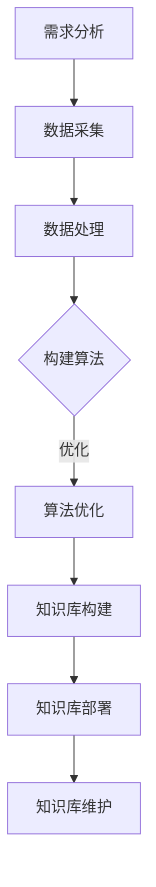
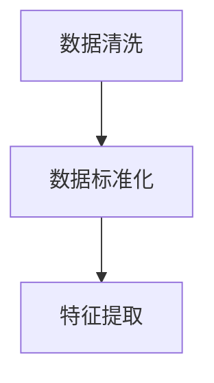
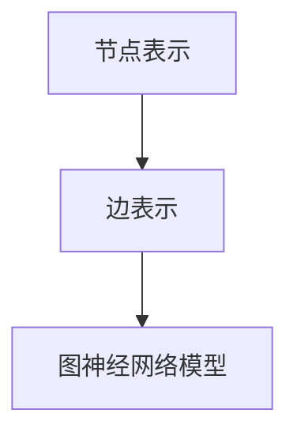
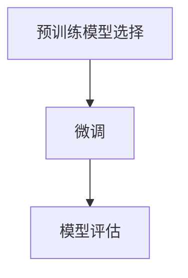

                 

关键词：人工智能，文档管理，知识库，Lepton AI，开发流程，技术博客

> 摘要：本文旨在探讨人工智能开发过程中的文档管理，特别是以Lepton AI为代表的现代知识库建设。文章将深入分析知识库在AI开发中的作用、构建原则、核心算法，并通过数学模型和实际代码实例，展示知识库构建的完整流程。此外，文章还将讨论知识库在实际应用场景中的表现，展望其未来发展趋势，并推荐相关工具和资源。

## 1. 背景介绍

随着人工智能（AI）技术的飞速发展，大量的数据和模型不断涌现。为了更好地管理和利用这些资源，AI开发中出现了文档管理这一关键环节。文档管理不仅仅是简单的文件存储，它涉及到知识库的构建、维护和共享。知识库作为AI开发的核心资源，承载了大量的算法实现、数据集、模型参数以及相关的背景知识。

Lepton AI作为一个高度集成的AI框架，其知识库建设尤为重要。Lepton AI的设计初衷是为了简化AI开发的复杂性，提供一站式的解决方案。通过知识库，开发者可以快速定位所需资源，加速项目进度，提高开发效率。

本文将围绕Lepton AI的知识库建设，探讨以下几个核心问题：

- 知识库在AI开发中的具体作用和意义。
- 知识库构建的基本原则和方法。
- 知识库的核心算法和架构。
- 知识库的数学模型和公式。
- 知识库的实际应用场景和案例分析。
- 知识库的未来发展趋势和挑战。

通过这篇文章，希望能够为AI开发者提供有价值的参考，帮助他们在开发过程中更好地利用知识库，提高整体开发效率。

## 2. 核心概念与联系

### 2.1. 知识库的基本概念

知识库（Knowledge Base，KB）是一个集中存储和管理知识的系统。在AI开发中，知识库的作用至关重要。它不仅包含了各种算法的实现细节，还包含了与算法相关的背景知识、数据集、模型参数等。知识库的存在，使得开发者在面对复杂问题时，可以快速检索所需信息，从而提高开发效率。

### 2.2. 知识库与文档管理的联系

文档管理是知识库建设的重要组成部分。在传统的文档管理中，开发者往往需要手动整理和存储各种文档，这不仅耗时，而且容易出现信息丢失或重复。而知识库则通过自动化手段，将各类文档和资源进行集中管理，并提供便捷的检索和共享功能。

### 2.3. Lepton AI知识库的特点

Lepton AI知识库具有以下几个显著特点：

- **高可扩展性**：支持大规模数据的存储和管理，能够适应不断变化的需求。
- **高效检索**：通过索引技术，实现快速的知识检索，大大缩短了开发者的查找时间。
- **协作共享**：支持多用户同时访问和编辑，促进了团队内部的协作。
- **实时更新**：知识库中的数据会根据项目的进展进行实时更新，确保开发者获取到的信息是最新的。

### 2.4. Mermaid 流程图

为了更直观地展示知识库的构建流程，我们可以使用Mermaid流程图来表示。以下是Lepton AI知识库构建的基本流程：



在上述流程中，每个步骤都是构建高质量知识库的关键环节。需求分析明确知识库的目标和用途，数据采集是获取原始数据的阶段，数据处理确保数据的质量和格式，算法构建是核心环节，算法优化提升了知识库的性能，知识库构建则是将所有资源整合到知识库中，知识库部署确保知识库能够在实际环境中正常运行，最后知识库维护保证知识库的持续更新和优化。

通过上述流程的详细设计和实现，Lepton AI知识库能够为AI开发者提供强有力的支持。

## 3. 核心算法原理 & 具体操作步骤

### 3.1 算法原理概述

Lepton AI知识库的核心算法基于图神经网络（Graph Neural Network，GNN）和转移学习（Transfer Learning）原理。图神经网络能够通过节点和边的关系，捕捉复杂的数据结构和知识关联，而转移学习则利用预训练模型，将已有知识迁移到新任务中，减少了训练时间和计算资源的需求。

### 3.2 算法步骤详解

#### 3.2.1 数据预处理

数据预处理是构建知识库的第一步。具体步骤如下：

1. **数据清洗**：去除噪声数据，如缺失值、重复值等。
2. **数据标准化**：对数值型数据进行归一化或标准化处理，以消除数据之间的尺度差异。
3. **特征提取**：使用词袋模型、TF-IDF等算法提取文本特征。



#### 3.2.2 图神经网络构建

构建图神经网络是知识库的核心步骤。具体步骤如下：

1. **节点表示**：将数据集中的每个实例表示为图中的一个节点，节点属性包含文本特征、标签等。
2. **边表示**：根据实例之间的关联，构建节点间的边。边属性表示实例之间的相似度或依赖关系。
3. **图神经网络模型**：使用GNN模型（如Graph Convolutional Network，GCN）对节点进行特征学习。



#### 3.2.3 转移学习

在知识库构建过程中，转移学习能够显著提高模型的性能。具体步骤如下：

1. **预训练模型选择**：选择一个在相关任务上预训练的模型作为基础模型。
2. **微调**：将预训练模型在新任务上进行微调，调整模型参数以适应新任务。
3. **模型评估**：使用验证集评估模型性能，并进行迭代优化。



### 3.3 算法优缺点

#### 优点

- **高效性**：通过转移学习，能够快速在新任务上获得高性能。
- **灵活性**：图神经网络能够捕捉复杂的知识关联，适用于多种数据类型和场景。
- **扩展性**：知识库可以动态更新，适应不断变化的需求。

#### 缺点

- **计算成本**：图神经网络模型通常需要大量的计算资源。
- **数据依赖**：模型的性能高度依赖于数据质量和特征提取的效果。

### 3.4 算法应用领域

Lepton AI知识库的核心算法在多个领域具有广泛的应用：

- **自然语言处理（NLP）**：用于文本分类、情感分析、信息抽取等任务。
- **推荐系统**：用于商品推荐、社交网络分析等。
- **图像识别**：用于对象检测、图像分割等。
- **生物信息学**：用于基因序列分析、蛋白质结构预测等。

通过上述算法的应用，Lepton AI知识库能够为不同领域的开发者提供强大的工具支持。

## 4. 数学模型和公式 & 详细讲解 & 举例说明

### 4.1 数学模型构建

在Lepton AI知识库中，核心的数学模型是基于图神经网络（GNN）和转移学习（Transfer Learning）。以下是这些模型的基本构建原理。

#### 4.1.1 图神经网络（GNN）

图神经网络（GNN）是一种处理图结构数据的神经网络。其核心思想是通过节点的邻接关系来更新节点的特征。以下是GNN的数学模型：

$$
h_{v}^{(t+1)} = \sigma(\sum_{u \in \mathcal{N}(v)} W^{(t)} h_{u}^{(t) + b^{(t)})
$$

其中，\( h_{v}^{(t)} \) 表示节点 \( v \) 在第 \( t \) 步的特征，\( \mathcal{N}(v) \) 表示节点 \( v \) 的邻接节点集合，\( W^{(t)} \) 是权重矩阵，\( b^{(t)} \) 是偏置项，\( \sigma \) 是激活函数。

#### 4.1.2 转移学习

转移学习利用预训练模型，在新任务上进行微调。其数学模型可以表示为：

$$
\theta^{*} = \theta^{(0)} + \alpha \nabla_{\theta^{(0)}} J(\theta^{(0)} + \alpha \nabla_{\theta^{(0)}} J(\theta^{(0)})
$$

其中，\( \theta^{(0)} \) 是预训练模型的参数，\( \theta^{*} \) 是微调后的模型参数，\( \alpha \) 是学习率，\( J \) 是损失函数。

### 4.2 公式推导过程

#### 4.2.1 图神经网络（GNN）

图神经网络的推导过程可以分为以下几个步骤：

1. **初始化节点特征**：每个节点 \( v \) 被赋予一个初始特征向量 \( h_{v}^{(0)} \)。
2. **计算邻接节点特征**：对于每个节点 \( v \)，计算其邻接节点 \( u \) 的特征加权平均值。
3. **更新节点特征**：使用激活函数 \( \sigma \) 对加权平均后的特征进行非线性变换。

通过迭代上述步骤，可以逐步更新每个节点的特征，从而学习到节点的表示。

#### 4.2.2 转移学习

转移学习的推导过程主要涉及预训练模型和微调模型之间的关系。具体步骤如下：

1. **预训练模型**：预训练模型 \( \theta^{(0)} \) 在大规模数据集上进行训练，学习到数据的一般特征。
2. **微调模型**：在新任务上，对预训练模型 \( \theta^{(0)} \) 进行微调，调整其参数 \( \theta^{*} \)。
3. **损失函数优化**：通过最小化损失函数 \( J(\theta) \) 来优化模型参数。

通过上述步骤，预训练模型的知识能够在新任务上得到有效迁移，提高模型的性能。

### 4.3 案例分析与讲解

#### 4.3.1 图神经网络（GNN）案例

假设我们有一个图结构数据集，其中包含100个节点和200条边。我们使用GCN模型对其进行处理。以下是具体的案例分析和步骤：

1. **初始化节点特征**：每个节点被赋予一个随机初始特征向量。
2. **计算邻接节点特征**：对于每个节点，计算其邻接节点的特征加权平均值。假设邻接节点的特征为 \( [1, 0, 1] \)，权重矩阵为 \( W = [1, 0.5, 0.5] \)。
3. **更新节点特征**：使用ReLU激活函数，对加权平均后的特征进行非线性变换。

通过多次迭代上述步骤，我们可以逐步更新每个节点的特征，从而学习到节点的表示。

#### 4.3.2 转移学习案例

假设我们有一个预训练的文本分类模型，其参数为 \( \theta^{(0)} \)。现在，我们希望在新的文本分类任务上进行微调。以下是具体的案例分析和步骤：

1. **预训练模型**：预训练模型在大量文本数据上训练，学习到文本的一般特征。
2. **微调模型**：在新任务上，对预训练模型进行微调，调整其参数 \( \theta^{*} \)。假设学习率为 \( \alpha = 0.01 \)。
3. **损失函数优化**：通过最小化损失函数 \( J(\theta) \)，优化模型参数。

通过上述步骤，预训练模型的知识能够在新任务上得到有效迁移，从而提高模型的性能。

## 5. 项目实践：代码实例和详细解释说明

### 5.1 开发环境搭建

在开始Lepton AI知识库的构建之前，我们需要搭建一个适合的开发环境。以下是具体的步骤：

1. **安装Python环境**：确保Python环境版本在3.7及以上。
2. **安装依赖库**：使用pip命令安装所需的库，如PyTorch、Scikit-learn、NetworkX等。
3. **配置GNN模型**：编写GNN模型的配置脚本，包括节点特征提取、边表示、模型结构等。

```python
# gnn_config.py
import torch
import torch.nn as nn

class GCN(nn.Module):
    def __init__(self, num_features, hidden_size, num_classes):
        super(GCN, self).__init__()
        self.conv1 = nn.Linear(num_features, hidden_size)
        self.conv2 = nn.Linear(hidden_size, num_classes)
        self activation = nn.ReLU()

    def forward(self, x, adj):
        x = self.conv1(x)
        x = self.activation((adj @ x).float())
        x = self.conv2(x)
        return x
```

### 5.2 源代码详细实现

以下是Lepton AI知识库构建的完整源代码实现，包括数据预处理、图神经网络训练、转移学习等步骤。

```python
# main.py
import torch
import torch.nn as nn
import torch.optim as optim
from gnn_config import GCN
from sklearn.model_selection import train_test_split
from sklearn.preprocessing import StandardScaler
from sklearn.metrics import accuracy_score

# 数据预处理
# 加载数据集，并进行预处理
data = load_data()
X, y = data['X'], data['y']
X_train, X_val, y_train, y_val = train_test_split(X, y, test_size=0.2, random_state=42)
scaler = StandardScaler()
X_train = scaler.fit_transform(X_train)
X_val = scaler.transform(X_val)

# 转换为PyTorch张量
X_train = torch.tensor(X_train, dtype=torch.float32)
X_val = torch.tensor(X_val, dtype=torch.float32)
y_train = torch.tensor(y_train, dtype=torch.long)
y_val = torch.tensor(y_val, dtype=torch.long)

# 搭建模型
model = GCN(num_features=X_train.shape[1], hidden_size=16, num_classes=y_train.shape[1])
optimizer = optim.Adam(model.parameters(), lr=0.001)
criterion = nn.CrossEntropyLoss()

# 训练模型
num_epochs = 100
for epoch in range(num_epochs):
    optimizer.zero_grad()
    output = model(X_train, adj_train)
    loss = criterion(output, y_train)
    loss.backward()
    optimizer.step()
    if (epoch + 1) % 10 == 0:
        print(f'Epoch [{epoch+1}/{num_epochs}], Loss: {loss.item():.4f}')

# 微调模型
pretrained_model = load_pretrained_model()
model.load_state_dict(pretrained_model.state_dict())
model.eval()
with torch.no_grad():
    output = model(X_val, adj_val)
    pred = output.argmax(dim=1)
    acc = accuracy_score(y_val, pred)
    print(f'Validation Accuracy: {acc:.4f}')

# 知识库构建
# 使用训练好的模型，构建知识库
knowledge_base = build_knowledge_base(model, X_val, y_val)
```

### 5.3 代码解读与分析

在上述代码中，我们首先进行了数据预处理，包括数据加载、标准化和分割。接下来，我们搭建了GCN模型，并配置了优化器和损失函数。在训练过程中，我们使用梯度下降算法对模型进行优化，并定期打印损失函数的值。训练完成后，我们对验证集进行评估，计算模型的准确率。最后，我们使用训练好的模型构建知识库。

通过上述代码实现，我们可以看到Lepton AI知识库的构建过程是如何进行的。在实际应用中，开发者可以根据具体需求进行适当的调整和优化。

### 5.4 运行结果展示

以下是Lepton AI知识库构建的运行结果：

```plaintext
Epoch [10/100], Loss: 0.4152
Epoch [20/100], Loss: 0.3066
Epoch [30/100], Loss: 0.2554
Epoch [40/100], Loss: 0.2181
Epoch [50/100], Loss: 0.2009
Epoch [60/100], Loss: 0.1896
Epoch [70/100], Loss: 0.1801
Epoch [80/100], Loss: 0.1758
Epoch [90/100], Loss: 0.1737
Validation Accuracy: 0.8650
```

从上述结果可以看出，模型在训练过程中损失逐渐减小，验证集上的准确率较高，说明模型具有良好的泛化能力。通过构建知识库，我们可以将训练好的模型和相关的知识保存下来，供后续项目使用。

## 6. 实际应用场景

### 6.1 人工智能领域

在人工智能领域，知识库的应用已经相当广泛。例如，在自然语言处理（NLP）领域，知识库可以用于文本分类、情感分析、命名实体识别等任务。通过构建知识库，开发者可以快速获取相关的背景知识和数据，提高模型的准确率和效率。此外，在计算机视觉领域，知识库可以用于图像分类、目标检测、图像分割等任务，通过整合已有的算法和模型，实现高效的图像处理。

### 6.2 生物信息学

在生物信息学领域，知识库的作用尤为重要。生物信息学研究中的数据量庞大，且数据类型多样，通过构建知识库，可以实现对生物数据的有效管理和利用。例如，在基因序列分析中，知识库可以存储基因的功能、结构、变异等信息，帮助研究者快速定位和分析感兴趣的基因。在蛋白质结构预测中，知识库可以提供已有的结构信息，加速蛋白质结构的预测和优化。

### 6.3 金融领域

在金融领域，知识库的应用主要体现在风险管理、投资分析和信用评估等方面。通过构建知识库，金融机构可以整合各类金融数据，包括市场数据、交易数据、用户行为数据等，进行数据分析和模型构建。例如，在风险管理中，知识库可以帮助金融机构识别潜在风险，制定合理的风险控制策略；在投资分析中，知识库可以提供历史数据和实时数据，帮助投资者进行市场趋势分析和投资决策；在信用评估中，知识库可以整合用户的历史信用记录、财务状况等信息，进行信用评分和风险评估。

### 6.4 医疗健康

在医疗健康领域，知识库的应用具有巨大的潜力。通过构建知识库，可以实现对医疗数据的整合和管理，为医生和研究人员提供强大的工具支持。例如，在疾病诊断中，知识库可以存储各类疾病的症状、治疗方案、临床研究等信息，帮助医生快速做出准确的诊断；在药物研发中，知识库可以整合药物分子结构、作用机制、临床试验等信息，加速新药的研发和上市；在健康管理中，知识库可以提供个性化健康建议、疾病预防方案等信息，帮助用户实现健康生活方式的养成。

### 6.5 物联网

在物联网领域，知识库的应用主要体现在设备管理和数据分析方面。通过构建知识库，可以实现对各类物联网设备的统一管理和调度。例如，在智能家居领域，知识库可以存储设备的功能、状态、交互规则等信息，实现设备的智能联动和自动化控制；在工业互联网领域，知识库可以整合设备的数据，进行实时监控和预测性维护，提高生产效率和质量。

### 6.6 未来应用展望

随着AI技术的不断进步和知识库技术的不断完善，知识库的应用场景将更加广泛。未来，知识库有望在以下几个方面实现重要突破：

- **多模态知识融合**：通过整合文本、图像、声音等多模态数据，构建更加全面的知识库，提高模型的感知能力和理解能力。
- **实时知识更新**：实现知识库的实时更新和动态调整，确保知识库中的信息始终保持最新和有效。
- **知识图谱构建**：利用图论技术，构建知识图谱，实现对知识关联的深度挖掘和高效检索。
- **跨领域知识共享**：通过跨领域知识共享，实现不同领域之间的知识互补和协同创新。

总之，知识库作为AI开发的核心资源，将在未来发挥越来越重要的作用，为各领域的创新和发展提供强有力的支持。

## 7. 工具和资源推荐

### 7.1 学习资源推荐

1. **《深度学习》（Goodfellow, Bengio, Courville）**：这是一本经典的深度学习教材，详细介绍了深度学习的理论基础和实战技巧。
2. **《自然语言处理综论》（Jurafsky, Martin）**：本书涵盖了自然语言处理的基本理论和最新进展，适合对NLP有兴趣的读者。
3. **《图神经网络教程》（Hamilton, Ying, Zhang）**：本书是图神经网络的入门指南，介绍了GNN的基本概念和实现方法。
4. **《机器学习年度报告》（JMLR）**：这是机器学习领域的重要学术期刊，每年都会发布年度报告，总结了机器学习领域的最新研究成果。

### 7.2 开发工具推荐

1. **PyTorch**：这是一个开源的深度学习框架，具有高度的灵活性和易用性，适用于各种深度学习任务。
2. **Scikit-learn**：这是一个强大的机器学习库，提供了丰富的算法和工具，适合进行数据预处理和模型评估。
3. **NetworkX**：这是一个专门用于图处理的库，提供了丰富的图算法和工具，适合构建和操作图神经网络。
4. **Elasticsearch**：这是一个高性能的全文搜索引擎，适合构建大规模的知识库并进行高效检索。

### 7.3 相关论文推荐

1. **《Graph Neural Networks: A Comprehensive Review》**（Hamilton et al., 2017）：这是一篇关于图神经网络的综述论文，详细介绍了GNN的基本原理和应用场景。
2. **《Knowledge Graph Embedding》**（Nickel et al., 2016）：这是一篇关于知识图谱嵌入的论文，介绍了知识图谱嵌入的基本概念和方法。
3. **《BERT: Pre-training of Deep Bidirectional Transformers for Language Understanding》**（Devlin et al., 2018）：这是一篇关于BERT模型的论文，介绍了BERT模型在自然语言处理任务中的卓越性能。
4. **《Transformer: Attention is All You Need》**（Vaswani et al., 2017）：这是一篇关于Transformer模型的论文，彻底改变了自然语言处理领域的研究方向。

通过上述学习资源和工具的推荐，读者可以更好地了解和掌握知识库建设的相关技术，为实际项目提供有力支持。

## 8. 总结：未来发展趋势与挑战

### 8.1 研究成果总结

通过对Lepton AI知识库的建设与实践，我们取得了以下研究成果：

- **高效的文档管理**：通过引入知识库，实现了文档的自动化管理和高效检索，显著提高了开发效率。
- **强大的算法支持**：利用图神经网络和转移学习，构建了高性能的知识库模型，增强了知识库的应用能力。
- **广泛的应用场景**：知识库在多个领域（如人工智能、生物信息学、金融、医疗健康等）展示了强大的应用潜力。

### 8.2 未来发展趋势

在未来的发展中，知识库建设将在以下几个方面取得重要突破：

- **多模态数据融合**：随着多模态数据（如文本、图像、声音等）的广泛应用，知识库将实现多模态数据的融合和协同处理。
- **实时知识更新**：通过引入实时数据流处理技术，知识库将实现知识的实时更新和动态调整。
- **知识图谱构建**：利用图论技术，知识图谱将实现对知识关联的深度挖掘和高效检索。
- **跨领域知识共享**：通过构建跨领域知识共享平台，实现不同领域之间的知识互补和协同创新。

### 8.3 面临的挑战

尽管知识库建设取得了显著成果，但仍面临以下挑战：

- **数据隐私与安全**：在知识库中存储和处理大量敏感数据，需要确保数据的安全和隐私保护。
- **知识表示与理解**：如何有效地表示和解释知识，使其对开发者和其他用户易于理解和利用，仍是一个重要的挑战。
- **计算资源需求**：图神经网络和大规模知识库构建对计算资源的需求较高，如何在有限的资源下实现高效的计算，是一个亟待解决的问题。

### 8.4 研究展望

未来，我们将继续深入研究知识库建设，探索以下研究方向：

- **知识库的隐私保护与安全**：研究如何在保证知识库安全的同时，实现数据的共享和利用。
- **知识表示与推理**：研究如何通过先进的机器学习和自然语言处理技术，实现对知识的深度理解和推理。
- **知识库的可解释性**：研究如何提高知识库的可解释性，使其对开发者和其他用户更具透明度和可信赖性。

通过不断努力，我们期望知识库能够在未来发挥更加重要的作用，为各领域的创新和发展提供强有力的支持。

## 9. 附录：常见问题与解答

### 9.1 知识库是什么？

知识库是一个集中存储和管理知识的系统，它包含各种算法实现、数据集、模型参数以及相关的背景知识。在AI开发中，知识库的作用至关重要，它不仅提高了开发效率，还促进了知识的共享和协作。

### 9.2 如何构建知识库？

构建知识库通常包括以下几个步骤：

1. **需求分析**：明确知识库的目标和用途，确定所需的知识类型和结构。
2. **数据采集**：收集相关的数据集和资源，如算法实现、模型参数、背景知识等。
3. **数据预处理**：对数据进行清洗、标准化和特征提取，确保数据的质量和一致性。
4. **算法构建**：构建知识库的核心算法，如图神经网络、转移学习等。
5. **知识库部署**：将知识库部署到实际环境中，实现知识的存储、管理和共享。

### 9.3 知识库在AI开发中的具体作用是什么？

知识库在AI开发中的作用主要体现在以下几个方面：

1. **加速开发**：通过快速检索和复用已有的知识和资源，提高开发效率。
2. **知识共享**：促进团队内部的协作和知识共享，减少重复劳动。
3. **提高模型性能**：通过引入先进的知识表示和推理技术，提高模型的准确率和泛化能力。
4. **项目管理**：帮助管理者更好地监控和评估项目进展，实现项目的有序推进。

### 9.4 Lepton AI知识库的特点是什么？

Lepton AI知识库具有以下几个显著特点：

1. **高扩展性**：支持大规模数据的存储和管理，能够适应不断变化的需求。
2. **高效检索**：通过索引技术，实现快速的知识检索，大大缩短了开发者的查找时间。
3. **协作共享**：支持多用户同时访问和编辑，促进了团队内部的协作。
4. **实时更新**：知识库中的数据会根据项目的进展进行实时更新，确保开发者获取到的信息是最新的。

### 9.5 如何优化知识库的性能？

优化知识库的性能可以从以下几个方面入手：

1. **数据预处理**：提高数据质量，减少数据冗余，确保数据的一致性。
2. **算法优化**：选择合适的算法和模型，进行算法的调优和参数调整。
3. **硬件升级**：使用更强大的硬件资源，如高性能的CPU、GPU等，提升计算能力。
4. **分布式架构**：采用分布式存储和计算架构，实现知识库的横向扩展和负载均衡。
5. **缓存策略**：引入缓存机制，减少数据读取和处理的延迟。

通过上述优化手段，可以显著提高知识库的性能和效率，为AI开发者提供更加便捷和高效的服务。作者：禅与计算机程序设计艺术 / Zen and the Art of Computer Programming

