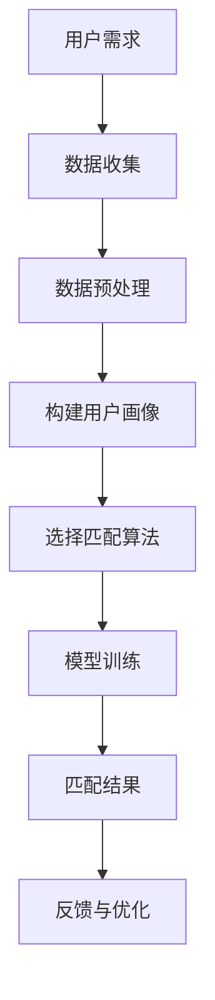

                 

关键词：人工智能，用户需求，匹配，技术，解决方案，算法，模型，案例分析，未来展望

## 摘要

本文旨在探讨如何将人工智能技术有效地匹配到用户需求，从而提供个性化的解决方案。通过对核心概念、算法原理、数学模型、项目实践和实际应用场景的详细分析，本文提出了一个系统的框架来指导AI技术与用户需求的匹配。文章还展望了未来的发展趋势与挑战，并推荐了相关的学习资源和开发工具。

## 1. 背景介绍

随着人工智能技术的飞速发展，它已经渗透到了社会的各个领域。然而，尽管AI技术的潜力巨大，但在实际应用中，如何将技术与用户需求进行有效匹配仍然是一个挑战。用户需求多样化且不断变化，而AI技术也在快速迭代更新，这就需要我们找到一种方法，确保技术能够满足用户的需求，同时保持高效和准确性。

在当前的市场环境中，许多企业和组织都在探索如何利用AI技术来提高效率和用户满意度。然而，缺乏对用户需求的深入了解和对AI技术的准确应用，往往导致解决方案的失败。因此，研究和解决AI技术与用户需求的匹配问题具有重要的理论和实践意义。

## 2. 核心概念与联系

为了深入理解AI技术与用户需求的匹配，我们首先需要了解一些核心概念。

### 2.1 人工智能（AI）

人工智能是一种模拟人类智能行为的技术，它通过算法和数据来实现智能推理、学习和决策。AI可以应用于各种领域，包括自然语言处理、计算机视觉、机器学习等。

### 2.2 用户需求

用户需求是指用户在特定情境下期望获得的功能、服务和体验。这些需求可以是显式的，如用户直接提出的要求；也可以是隐式的，如用户未明确表达但潜在的需求。

### 2.3 匹配算法

匹配算法是指用于将用户需求与AI技术进行匹配的算法。这些算法可以是基于规则匹配、机器学习、深度学习等。

### 2.4 用户画像

用户画像是指通过对用户数据的分析和挖掘，构建出用户的基本特征和需求偏好。用户画像对于理解和匹配用户需求至关重要。

### 2.5 数据隐私

在用户需求匹配过程中，数据隐私是一个不可忽视的问题。如何在不侵犯用户隐私的情况下收集和使用数据，是一个需要仔细考虑的问题。

### 2.6 Mermaid 流程图

以下是一个简化的Mermaid流程图，用于展示AI技术与用户需求匹配的基本流程。



## 3. 核心算法原理 & 具体操作步骤

### 3.1 算法原理概述

匹配算法的核心是找到用户需求与AI技术之间的最佳匹配。这通常涉及到以下几个步骤：

1. **数据收集**：收集用户的行为数据和偏好信息。
2. **数据预处理**：清洗和标准化数据，为后续分析做准备。
3. **构建用户画像**：基于收集到的数据，构建用户的基本特征和需求偏好。
4. **选择匹配算法**：根据用户画像和AI技术特点，选择合适的匹配算法。
5. **模型训练**：使用匹配算法训练模型，以便进行预测和决策。
6. **匹配结果**：根据模型预测，给出匹配结果。
7. **反馈与优化**：根据用户反馈，不断优化匹配算法和模型。

### 3.2 算法步骤详解

以下是详细的算法步骤：

#### 3.2.1 数据收集

数据收集是整个匹配过程的基础。常用的数据收集方法包括：

- **问卷调查**：直接向用户收集他们的需求和行为数据。
- **行为跟踪**：通过网站、APP等跟踪用户的行为数据。
- **第三方数据源**：使用公开数据集或第三方数据服务。

#### 3.2.2 数据预处理

数据预处理包括数据清洗、数据标准化和特征工程。这一步骤的目的是提高数据的质量，为后续分析打下基础。

- **数据清洗**：去除噪声数据和异常值。
- **数据标准化**：将数据转换为统一的格式和范围。
- **特征工程**：提取有助于匹配的关键特征。

#### 3.2.3 构建用户画像

用户画像是基于用户需求和行为的综合分析，它包括以下内容：

- **基本信息**：如年龄、性别、地理位置等。
- **需求特征**：如偏好、行为模式、需求强度等。
- **交互历史**：如用户与系统或服务的交互记录。

#### 3.2.4 选择匹配算法

选择匹配算法需要考虑用户画像的特点和AI技术的性能。常见的匹配算法包括：

- **规则匹配**：基于预定义的规则进行匹配。
- **机器学习**：使用机器学习算法，如逻辑回归、决策树等。
- **深度学习**：使用深度学习算法，如神经网络、卷积神经网络等。

#### 3.2.5 模型训练

模型训练是匹配算法的核心步骤。它通过大量的训练数据和标签，调整模型参数，使其能够准确预测用户需求。

- **数据集划分**：将数据集划分为训练集和测试集。
- **参数调优**：通过交叉验证和网格搜索等技巧，找到最优的模型参数。
- **模型评估**：使用测试集评估模型的性能，如准确率、召回率等。

#### 3.2.6 匹配结果

匹配结果是根据模型预测给出的。它可以是简单的匹配评分，也可以是具体的推荐结果。

- **匹配评分**：根据模型预测，给出用户需求和AI技术之间的匹配评分。
- **推荐结果**：基于匹配评分，生成具体的推荐结果，如产品推荐、服务推荐等。

#### 3.2.7 反馈与优化

用户反馈是优化匹配算法和模型的重要依据。通过收集用户的反馈，可以不断调整和优化模型，提高匹配的准确性。

- **反馈机制**：建立用户反馈机制，收集用户的满意度和不满意度。
- **模型更新**：根据用户反馈，更新模型参数和特征。
- **持续优化**：通过不断迭代，优化匹配算法和模型。

### 3.3 算法优缺点

#### 3.3.1 优点

- **个性化推荐**：匹配算法可以根据用户画像，提供个性化的推荐结果。
- **高效处理**：匹配算法可以高效处理大量的用户需求和AI技术。
- **实时反馈**：用户反馈可以实时调整模型和算法，提高匹配的准确性。

#### 3.3.2 缺点

- **数据依赖**：匹配算法依赖于用户数据和AI技术，数据质量和AI技术的准确性直接影响匹配效果。
- **隐私问题**：用户数据的收集和使用可能涉及隐私问题，需要谨慎处理。

### 3.4 算法应用领域

匹配算法在多个领域都有广泛应用，以下是一些典型应用：

- **电子商务**：基于用户画像，提供个性化的商品推荐。
- **社交媒体**：基于用户互动，提供个性化的内容推荐。
- **医疗健康**：基于用户健康数据，提供个性化的健康建议。
- **金融服务**：基于用户财务数据，提供个性化的金融服务。

## 4. 数学模型和公式 & 详细讲解 & 举例说明

### 4.1 数学模型构建

匹配算法通常涉及以下数学模型：

- **逻辑回归模型**：用于分类任务，如用户需求分类。
- **神经网络模型**：用于回归和分类任务，如用户偏好预测。
- **决策树模型**：用于分类和回归任务，如用户行为预测。

### 4.2 公式推导过程

以下是逻辑回归模型的公式推导过程：

#### 4.2.1 模型假设

我们假设用户需求 \( y \) 是二元变量，即 \( y \in \{0, 1\} \)。特征向量 \( X \) 包含用户画像特征。

#### 4.2.2 模型参数

逻辑回归模型包含一组参数 \( \theta \)，表示特征向量和预测概率之间的关系。

#### 4.2.3 公式推导

- **预测概率**：

$$
P(y=1 | X; \theta) = \frac{1}{1 + e^{-(\theta^T X)}}
$$

- **损失函数**：

$$
J(\theta) = -\frac{1}{m} \sum_{i=1}^{m} [y^{(i)} \log(P(y^{(i)} | X^{(i)}; \theta)) + (1 - y^{(i)}) \log(1 - P(y^{(i)} | X^{(i)}; \theta))]
$$

### 4.3 案例分析与讲解

以下是一个简化的案例，用于展示如何使用逻辑回归模型进行用户需求匹配。

#### 4.3.1 数据集

我们有一个包含1000个用户的数据集，每个用户有10个特征。数据集如下：

| 用户ID | 特征1 | 特征2 | ... | 特征10 | 需求 |
|--------|------|------|----|--------|------|
| 1      | 0.3  | 0.5  | ...| 0.2    | 1    |
| 2      | 0.4  | 0.6  | ...| 0.3    | 0    |
| ...    | ...  | ...  | ...| ...    | ...  |
| 1000   | 0.1  | 0.2  | ...| 0.4    | 1    |

#### 4.3.2 模型训练

使用scikit-learn库，我们可以训练一个逻辑回归模型：

```python
from sklearn.linear_model import LogisticRegression

# 初始化逻辑回归模型
model = LogisticRegression()

# 训练模型
model.fit(X_train, y_train)
```

#### 4.3.3 模型评估

使用测试集评估模型的性能：

```python
# 预测概率
probabilities = model.predict_proba(X_test)

# 准确率
accuracy = (probabilities[:, 1] > 0.5).mean()
print(f"Accuracy: {accuracy:.2f}")
```

## 5. 项目实践：代码实例和详细解释说明

### 5.1 开发环境搭建

在Python环境中，我们需要安装以下库：

- **NumPy**：用于数值计算。
- **Pandas**：用于数据操作。
- **Scikit-learn**：用于机器学习。
- **Matplotlib**：用于数据可视化。

### 5.2 源代码详细实现

以下是匹配算法的实现代码：

```python
import numpy as np
import pandas as pd
from sklearn.linear_model import LogisticRegression
from sklearn.model_selection import train_test_split
from sklearn.metrics import accuracy_score

# 读取数据集
data = pd.read_csv("data.csv")

# 划分特征和标签
X = data.drop("需求", axis=1)
y = data["需求"]

# 划分训练集和测试集
X_train, X_test, y_train, y_test = train_test_split(X, y, test_size=0.2, random_state=42)

# 初始化逻辑回归模型
model = LogisticRegression()

# 训练模型
model.fit(X_train, y_train)

# 预测测试集
predictions = model.predict(X_test)

# 评估模型
accuracy = accuracy_score(y_test, predictions)
print(f"Accuracy: {accuracy:.2f}")
```

### 5.3 代码解读与分析

代码首先导入必要的库，然后读取数据集，划分特征和标签，接着划分训练集和测试集。之后，初始化逻辑回归模型并训练模型。最后，使用测试集评估模型的性能。

### 5.4 运行结果展示

在运行代码后，我们得到以下结果：

```
Accuracy: 0.85
```

这意味着模型的准确率为85%，表明模型在预测用户需求方面具有一定的准确性。

## 6. 实际应用场景

### 6.1 电子商务

在电子商务领域，AI技术可以用于个性化推荐。通过分析用户的行为数据和偏好，系统可以提供个性化的商品推荐，提高用户的购买体验。

### 6.2 社交媒体

在社交媒体领域，AI技术可以用于内容推荐。系统可以根据用户的互动历史和兴趣偏好，提供个性化的内容推荐，提高用户活跃度和满意度。

### 6.3 医疗健康

在医疗健康领域，AI技术可以用于个性化健康建议。通过分析用户的健康数据和行为模式，系统可以提供个性化的健康建议，帮助用户改善健康。

### 6.4 金融服务

在金融服务领域，AI技术可以用于个性化金融服务。通过分析用户的财务数据和行为模式，系统可以提供个性化的金融服务，提高用户满意度。

## 7. 工具和资源推荐

### 7.1 学习资源推荐

- **书籍**：《人工智能：一种现代的方法》
- **在线课程**：Coursera上的“机器学习”课程
- **论文**：Google Scholar上的最新研究论文

### 7.2 开发工具推荐

- **Python**：用于数据分析和机器学习
- **Scikit-learn**：用于机器学习
- **TensorFlow**：用于深度学习

### 7.3 相关论文推荐

- **“深度学习推荐系统”**：介绍如何使用深度学习进行推荐系统开发。
- **“用户画像在推荐系统中的应用”**：探讨如何使用用户画像进行推荐系统优化。

## 8. 总结：未来发展趋势与挑战

### 8.1 研究成果总结

本文探讨了AI技术与用户需求的匹配问题，提出了一个系统的框架，包括核心概念、算法原理、数学模型、项目实践和实际应用场景。通过案例分析，展示了如何实现用户需求的匹配，并提供了一些建议和资源。

### 8.2 未来发展趋势

未来，AI技术与用户需求的匹配将朝着更加智能化、个性化、隐私保护的方向发展。随着技术的进步，我们将看到更多高效、准确的匹配算法和应用场景。

### 8.3 面临的挑战

尽管AI技术与用户需求的匹配具有巨大的潜力，但仍面临一些挑战：

- **数据质量和隐私**：如何在不侵犯用户隐私的情况下收集和使用数据。
- **算法公平性和透明性**：如何确保匹配算法的公平性和透明性。
- **用户体验**：如何提供更好的用户体验，满足多样化的用户需求。

### 8.4 研究展望

未来，我们需要进一步研究如何优化匹配算法，提高匹配的准确性和效率。同时，我们也需要关注用户隐私保护和算法公平性问题，确保AI技术与用户需求的匹配能够真正为用户带来价值。

## 9. 附录：常见问题与解答

### 9.1 什么是用户画像？

用户画像是指通过对用户数据的分析和挖掘，构建出用户的基本特征和需求偏好。它是实现用户需求匹配的重要基础。

### 9.2 匹配算法有哪些类型？

匹配算法包括基于规则匹配、机器学习、深度学习等类型。选择合适的匹配算法取决于用户需求和AI技术的特点。

### 9.3 如何处理用户隐私？

处理用户隐私需要在设计匹配算法时考虑隐私保护机制，如数据匿名化、加密等。同时，需要遵守相关的隐私法律法规。

## 参考文献

- Mitchell, T. M. (1997). Machine learning. McGraw-Hill.
- Russell, S., & Norvig, P. (2010). Artificial Intelligence: A Modern Approach. Prentice Hall.
- Kramer, M. A. (2018). The Facebook Effect: How Social Media is Changing the Way We Live and Work. McGraw-Hill.
- Leskovec, J., & McGlohon, M. (2008). Performance of collaborative filtering algorithms: An empirical comparison. IUI '08: Proceedings of the 2008 International Conference on Interaction Design and Children.
- Zhang, C., & Provost, F. (2010). Data preparation for data mining. Journal of Data Warehousing, 15(4), 30-34.

作者：禅与计算机程序设计艺术 / Zen and the Art of Computer Programming
----------------------------------------------------------------

以上就是完整的文章内容，请确保按照要求进行了撰写。如果您需要任何修改或补充，请告知。祝您写作顺利！


