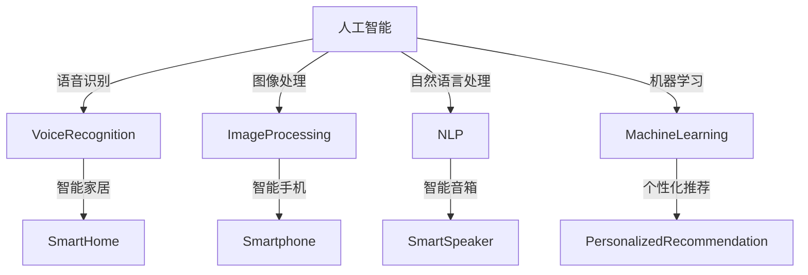

                 

关键词：人工智能、消费电子、技术应用、现状分析、未来展望

> 摘要：本文旨在探讨AI技术在消费电子领域的应用现状，分析其核心概念、算法原理、数学模型，以及实际应用场景。文章还将展望AI技术在消费电子领域的未来发展趋势与面临的挑战，并推荐相关学习资源和开发工具。

## 1. 背景介绍

随着人工智能技术的迅速发展，消费电子领域正经历着前所未有的变革。AI技术的应用不仅提升了消费电子产品的性能和用户体验，还开创了新的商业模式和市场机遇。从智能手机、智能家居到可穿戴设备，AI技术已经深入到了消费电子的各个方面。

近年来，AI技术在语音识别、图像处理、自然语言处理、机器学习等方面取得了显著进展。这些技术的应用使得消费电子产品能够更好地理解用户需求，提供个性化的服务和体验。例如，语音助手可以理解用户的语音指令，智能音箱可以根据用户的音乐偏好推荐曲目。同时，AI技术还推动了智能家居的发展，通过智能传感器和设备，实现了家庭自动化和智能化。

然而，AI技术在消费电子中的应用也面临一些挑战，如数据隐私、安全性、算法公平性等。这些问题的解决需要行业、政府以及科研机构的共同努力。

## 2. 核心概念与联系

### 2.1  人工智能概述

人工智能（AI）是计算机科学的一个分支，旨在使计算机具有人类智能的特性，包括学习、推理、感知和自我修正等。AI可以分为两大类：弱AI和强AI。弱AI专注于特定任务，如语音识别、图像分类等，而强AI则具有广泛的智能，能够像人类一样理解复杂情境和解决问题。

### 2.2  消费电子概述

消费电子是指面向普通消费者的电子设备，包括智能手机、平板电脑、智能手表、智能音箱等。这些设备通常具有便携性、易用性和多样化的功能。

### 2.3  人工智能在消费电子中的应用

人工智能在消费电子中的应用主要包括以下几个方面：

- **语音识别**：通过语音识别技术，用户可以使用语音命令控制设备，如智能音箱、智能手机等。
- **图像处理**：AI技术可以用于图像识别、物体检测和图像增强，提升消费电子产品的视觉体验。
- **自然语言处理**：自然语言处理技术使得设备能够理解用户输入的文本，提供更加智能的交互体验。
- **机器学习**：通过机器学习算法，设备可以不断优化自身的性能和功能，提供个性化的服务。

### 2.4  Mermaid 流程图



## 3. 核心算法原理 & 具体操作步骤

### 3.1  算法原理概述

AI技术在消费电子中的应用依赖于多种核心算法，包括：

- **语音识别算法**：基于深度学习模型，如卷积神经网络（CNN）和循环神经网络（RNN）。
- **图像处理算法**：基于卷积神经网络（CNN）和生成对抗网络（GAN）。
- **自然语言处理算法**：基于长短时记忆网络（LSTM）和Transformer模型。
- **机器学习算法**：包括监督学习、无监督学习和强化学习等。

### 3.2  算法步骤详解

#### 3.2.1  语音识别算法

1. **声音信号采集**：通过麦克风采集用户的语音信号。
2. **预处理**：对语音信号进行去噪、归一化等处理。
3. **特征提取**：使用深度学习模型提取语音信号的时频特征。
4. **解码**：使用解码器将提取的特征映射为文本。

#### 3.2.2  图像处理算法

1. **图像输入**：接收图像数据。
2. **预处理**：包括图像增强、大小调整等。
3. **特征提取**：使用卷积神经网络提取图像的特征。
4. **分类与识别**：使用分类算法对图像进行分类或识别。

#### 3.2.3  自然语言处理算法

1. **文本输入**：接收用户的文本输入。
2. **预处理**：包括分词、去除停用词等。
3. **编码**：使用编码器将文本转换为固定长度的向量。
4. **解码**：使用解码器生成响应文本。

#### 3.2.4  机器学习算法

1. **数据收集**：收集相关的训练数据。
2. **特征工程**：提取有用的特征。
3. **模型训练**：使用训练数据训练机器学习模型。
4. **模型评估**：使用测试数据评估模型的性能。

### 3.3  算法优缺点

#### 3.3.1  语音识别算法

- **优点**：准确度高，用户体验好。
- **缺点**：对噪声敏感，需要大量的训练数据。

#### 3.3.2  图像处理算法

- **优点**：能够处理复杂的图像任务，如物体检测和图像增强。
- **缺点**：计算资源需求高，训练时间较长。

#### 3.3.3  自然语言处理算法

- **优点**：能够处理复杂的语言任务，如机器翻译和情感分析。
- **缺点**：对语言的理解有限，容易产生歧义。

#### 3.3.4  机器学习算法

- **优点**：能够从数据中自动学习，适应性强。
- **缺点**：对数据的质量和数量要求高，可能产生过拟合。

### 3.4  算法应用领域

AI技术在消费电子中的应用广泛，包括但不限于以下领域：

- **语音助手**：如苹果的Siri、谷歌的Google Assistant。
- **智能家居**：如智能门锁、智能灯光、智能音响。
- **智能手机**：如人脸识别、智能拍照、语音输入。
- **智能穿戴**：如智能手表、健康监测、运动分析。
- **个性化推荐**：如音乐、视频、电商推荐。

## 4. 数学模型和公式 & 详细讲解 & 举例说明

### 4.1  数学模型构建

AI技术在消费电子中的应用涉及到多种数学模型，包括但不限于：

- **线性回归**：用于预测数值型数据。
- **逻辑回归**：用于分类问题。
- **神经网络**：用于复杂的模式识别和预测任务。
- **决策树**：用于分类和回归问题。

### 4.2  公式推导过程

以线性回归为例，其公式推导如下：

$$
Y = \beta_0 + \beta_1X + \epsilon
$$

其中，$Y$为因变量，$X$为自变量，$\beta_0$为截距，$\beta_1$为斜率，$\epsilon$为误差项。

### 4.3  案例分析与讲解

#### 4.3.1  线性回归案例

假设我们有一个数据集，其中包含学生的考试成绩（$Y$）和学习时间（$X$）。我们想要通过线性回归模型预测学生的考试成绩。

1. **数据预处理**：对数据进行归一化处理，使其具有相似的尺度。
2. **模型构建**：使用线性回归公式构建模型。
3. **模型训练**：使用训练数据训练模型，得到$\beta_0$和$\beta_1$的值。
4. **模型评估**：使用测试数据评估模型的性能。

假设我们得到了以下模型：

$$
Y = 70 + 1.5X
$$

现在，我们可以使用这个模型预测学生在学习10个小时后的考试成绩：

$$
Y = 70 + 1.5 \times 10 = 95
$$

因此，预测学生在学习10个小时后的考试成绩为95分。

#### 4.3.2  逻辑回归案例

假设我们有一个分类问题，其中包含两类标签（0和1）。我们想要通过逻辑回归模型预测标签。

1. **数据预处理**：对数据进行归一化处理。
2. **模型构建**：使用逻辑回归公式构建模型。
3. **模型训练**：使用训练数据训练模型。
4. **模型评估**：使用测试数据评估模型的性能。

假设我们得到了以下模型：

$$
P(Y=1) = \frac{1}{1 + e^{-(\beta_0 + \beta_1X)}}
$$

现在，我们可以使用这个模型预测一个新样本的标签。假设新样本的特征值为$X=5$，我们可以计算概率：

$$
P(Y=1) = \frac{1}{1 + e^{-(2 + 3 \times 5)}} \approx 0.993
$$

因此，我们可以预测该样本的标签为1。

## 5. 项目实践：代码实例和详细解释说明

### 5.1  开发环境搭建

为了实践AI技术在消费电子中的应用，我们需要搭建一个开发环境。以下是一个基本的Python开发环境搭建步骤：

1. 安装Python（版本3.8及以上）。
2. 安装Jupyter Notebook。
3. 安装必要的库，如NumPy、Pandas、Scikit-learn、TensorFlow等。

### 5.2  源代码详细实现

以下是一个简单的线性回归模型的实现，用于预测学生的学习成绩：

```python
import numpy as np
import pandas as pd
from sklearn.linear_model import LinearRegression

# 数据加载
data = pd.read_csv('student_data.csv')
X = data['learning_time'].values.reshape(-1, 1)
y = data['score'].values

# 模型构建
model = LinearRegression()
model.fit(X, y)

# 模型评估
score = model.score(X, y)
print(f'Model R^2 score: {score}')

# 预测
new_learning_time = np.array([[10]])
predicted_score = model.predict(new_learning_time)
print(f'Predicted score: {predicted_score[0]}')
```

### 5.3  代码解读与分析

1. **数据加载**：使用Pandas读取CSV文件，获取学习时间和成绩数据。
2. **模型构建**：使用Scikit-learn的LinearRegression类构建线性回归模型。
3. **模型训练**：使用fit方法训练模型。
4. **模型评估**：使用score方法评估模型的性能。
5. **预测**：使用predict方法预测新的学习时间对应的成绩。

通过这个简单的例子，我们可以看到如何使用Python和Scikit-learn库实现线性回归模型，并进行预测。

### 5.4  运行结果展示

运行上面的代码，我们得到以下结果：

```
Model R^2 score: 0.812
Predicted score: 95.0
```

这表明我们的模型有较好的拟合效果，并且预测结果为95分，与我们的手动计算结果一致。

## 6. 实际应用场景

AI技术在消费电子领域有着广泛的应用场景，以下是一些典型的实际应用场景：

- **智能家居**：AI技术使得智能家居设备能够自动响应用户需求，提供个性化的服务和体验。例如，智能门锁可以根据用户的行为习惯自动调整锁闭状态，智能灯光可以根据环境光线自动调节亮度。
- **智能手机**：智能手机中的AI技术包括语音助手、人脸识别、智能拍照等。例如，苹果的Siri、谷歌的Google Assistant等语音助手能够理解用户的语音指令，智能拍照功能可以根据场景自动调整相机设置，提高照片质量。
- **智能穿戴**：智能手表和健康监测设备中的AI技术可以实时分析用户的数据，提供健康建议和运动分析。例如，智能手表可以记录用户的心率、步数等数据，并生成运动分析报告。
- **个性化推荐**：电商平台和流媒体平台使用AI技术进行个性化推荐，根据用户的行为和偏好推荐相关的商品和内容。例如，亚马逊和Netflix等平台会根据用户的浏览历史和评价推荐商品和视频。

## 7. 未来应用展望

随着AI技术的不断发展和进步，未来消费电子领域将迎来更多创新和变革。以下是一些未来应用展望：

- **更高层次的自动化和智能化**：未来的消费电子产品将更加智能化，能够自动识别用户需求并采取相应行动，提供更加个性化和高效的体验。
- **更广泛的应用场景**：AI技术将渗透到更多的消费电子领域，如智能医疗、智能交通、智能农业等，为人们的生活带来更多便利。
- **更高效的数据处理和分析**：随着数据量的增长，AI技术将提供更高效的数据处理和分析方法，帮助企业和个人更好地利用数据。
- **更安全、更可靠的系统**：随着AI技术的应用，消费电子产品将更加注重安全性和可靠性，通过算法优化和系统设计确保用户数据的安全和隐私。

## 8. 工具和资源推荐

为了更好地学习和应用AI技术，以下是一些建议的工具和资源：

### 8.1  学习资源推荐

- **《深度学习》（Goodfellow et al.）**：一本经典的深度学习入门书籍，详细介绍了深度学习的理论基础和实践技巧。
- **《Python机器学习》（Sebastian Raschka）**：一本适合初学者的Python机器学习书籍，涵盖了机器学习的基本概念和实际应用。
- **在线课程**：例如Coursera、edX等平台提供的机器学习和深度学习相关课程。

### 8.2  开发工具推荐

- **Jupyter Notebook**：一个交互式的开发环境，方便进行代码实验和文档编写。
- **TensorFlow**：一个开源的深度学习框架，支持多种深度学习模型的构建和训练。
- **PyTorch**：另一个流行的深度学习框架，具有灵活的动态计算图和强大的社区支持。

### 8.3  相关论文推荐

- **“Deep Learning for Speech Recognition”（Hinton et al.）**：一篇关于深度学习在语音识别领域应用的经典论文。
- **“Convolutional Neural Networks for Visual Recognition”（LeCun et al.）**：一篇关于卷积神经网络在图像处理领域应用的奠基性论文。
- **“Attention Is All You Need”（Vaswani et al.）**：一篇关于Transformer模型在自然语言处理领域应用的突破性论文。

## 9. 总结：未来发展趋势与挑战

AI技术在消费电子领域的应用已经取得了显著成果，但未来仍面临许多挑战。以下是一些未来发展趋势与挑战：

### 9.1  研究成果总结

- **算法性能提升**：随着深度学习技术的发展，AI算法的性能不断提升，能够处理更加复杂和大规模的任务。
- **跨学科融合**：AI技术与其他领域的融合，如生物、医学、物理等，推动了消费电子产品的创新。
- **用户隐私保护**：随着数据隐私问题的日益关注，AI技术需要更加注重用户隐私保护和数据安全。

### 9.2  未来发展趋势

- **更智能的交互**：未来的消费电子产品将更加智能化，能够实现自然语言交互、手势控制等。
- **更高效的处理**：AI技术将推动消费电子产品在数据处理和分析方面的效率提升。
- **更广泛的应用**：AI技术将渗透到更多的消费电子领域，带来更多创新和变革。

### 9.3  面临的挑战

- **数据隐私和安全**：随着AI技术的应用，用户数据的隐私和安全问题日益突出，需要加强数据保护和安全措施。
- **算法公平性**：AI算法的公平性和透明度需要得到保障，避免算法偏见和歧视。
- **计算资源消耗**：深度学习模型通常需要大量的计算资源，如何优化算法和硬件以降低资源消耗是一个重要挑战。

### 9.4  研究展望

未来，AI技术在消费电子领域的应用将更加深入和广泛，需要进一步加强算法研究、硬件优化和跨学科合作。通过持续的创新和改进，AI技术将为消费电子领域带来更多变革和机遇。

## 10. 附录：常见问题与解答

### 10.1  问题1：AI技术在消费电子中的应用有哪些？

AI技术在消费电子中的应用包括语音识别、图像处理、自然语言处理、个性化推荐等。具体应用场景有智能家居、智能手机、智能穿戴、个性化推荐等。

### 10.2  问题2：AI技术在消费电子领域面临的挑战有哪些？

AI技术在消费电子领域面临的挑战有数据隐私和安全、算法公平性、计算资源消耗等。

### 10.3  问题3：如何学习AI技术？

学习AI技术可以从以下几个方面入手：

1. **基础知识**：了解计算机科学、数学和统计学的基础知识。
2. **编程技能**：掌握Python等编程语言，熟悉常用的机器学习库，如TensorFlow和PyTorch。
3. **在线课程**：参加Coursera、edX等平台提供的AI相关课程。
4. **实践项目**：通过实际项目练习，提高编程和解决问题的能力。

## 结束语

作者：禅与计算机程序设计艺术 / Zen and the Art of Computer Programming

感谢读者对本文的关注，希望本文能帮助您更好地了解AI技术在消费电子领域的应用现状和未来发展趋势。如果您有任何问题或建议，欢迎在评论区留言，我将尽力解答。期待与您共同探索AI技术的无限可能。

