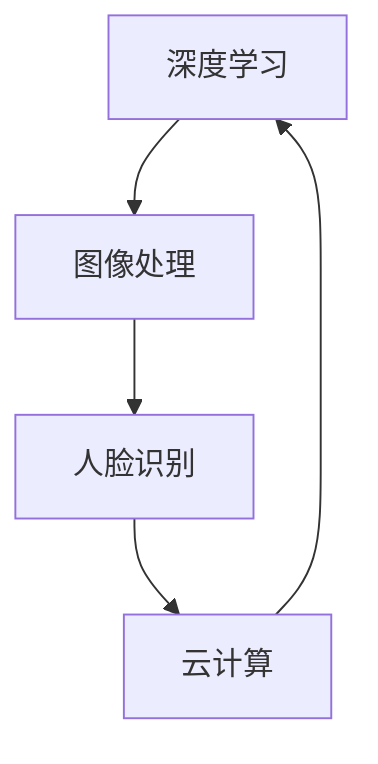

                 

关键词：AI拍立得、技术架构、图像处理、深度学习、云计算、人脸识别、用户体验

> 摘要：本文将深入解析AI拍立得产品的技术架构，从核心概念、算法原理、数学模型、项目实践以及实际应用场景等多个角度，探讨AI技术在摄影领域的创新与应用。通过分析，我们旨在揭示AI拍立得在提高用户体验、优化摄影效果方面的技术优势，并展望未来发展方向与挑战。

## 1. 背景介绍

AI拍立得是一款基于人工智能技术的摄影应用，旨在通过深度学习、图像处理、人脸识别等前沿技术，为用户提供更加便捷、个性化的摄影体验。与传统摄影相比，AI拍立得能够智能识别场景、优化拍摄效果，并通过智能推荐等功能，满足用户在不同场景下的拍摄需求。

随着智能手机的普及，摄影已成为人们日常生活中不可或缺的一部分。而AI技术的迅速发展，使得摄影应用有了更多的可能性。AI拍立得正是这一趋势下的产物，通过整合多种技术，为用户带来前所未有的摄影体验。

## 2. 核心概念与联系

### 2.1. 深度学习与图像处理

深度学习是一种基于人工神经网络的学习方法，通过多层神经网络结构，对大量数据进行自动特征提取和模式识别。在AI拍立得中，深度学习被广泛应用于图像处理领域，例如场景识别、图像风格转换等。

图像处理是指对图像进行各种操作，包括滤波、增强、分割、特征提取等，以改善图像的质量或提取图像中的有用信息。在AI拍立得中，图像处理技术被用来优化拍摄效果，如自动对焦、曝光补偿、白平衡调整等。

### 2.2. 人脸识别与云计算

人脸识别是一种基于生物特征的身份识别技术，通过识别和验证人脸图像，实现用户身份的识别。在AI拍立得中，人脸识别技术被用来识别用户和拍摄对象，实现个性化拍摄建议。

云计算是一种通过互联网提供动态可扩展的虚拟化资源的计算服务模式。在AI拍立得中，云计算被用于处理大量图像数据，提供实时拍摄建议和智能推荐功能。

### 2.3. Mermaid 流程图



## 3. 核心算法原理 & 具体操作步骤

### 3.1. 算法原理概述

AI拍立得的核心算法主要包括深度学习算法和图像处理算法。深度学习算法用于图像识别和风格转换，图像处理算法用于优化拍摄效果。以下是具体算法原理和操作步骤：

### 3.2. 算法步骤详解

#### 3.2.1. 深度学习算法

1. 数据预处理：对拍摄图像进行预处理，包括缩放、裁剪、灰度化等操作，以适应深度学习模型的要求。

2. 模型训练：使用大量的图像数据，训练深度学习模型，包括卷积神经网络（CNN）等。

3. 模型推理：将拍摄图像输入到训练好的深度学习模型中，进行图像识别和风格转换。

#### 3.2.2. 图像处理算法

1. 自动对焦：根据图像的清晰度，自动调整摄像头的焦距，实现清晰对焦。

2. 曝光补偿：根据图像的亮度，自动调整曝光时间，避免过曝或欠曝。

3. 白平衡调整：根据拍摄场景的光源，自动调整白平衡，实现正确的色彩还原。

### 3.3. 算法优缺点

#### 优点：

1. 智能识别场景，优化拍摄效果。
2. 提高用户体验，降低摄影门槛。
3. 大量数据驱动，不断优化算法。

#### 缺点：

1. 计算资源消耗较大，对硬件要求较高。
2. 在特定场景下，识别准确性可能受到影响。

### 3.4. 算法应用领域

AI拍立得的核心算法主要应用于摄影领域，如智能摄影、图像识别、图像风格转换等。随着技术的不断发展，这些算法还可以应用于其他领域，如医学影像、卫星遥感等。

## 4. 数学模型和公式 & 详细讲解 & 举例说明

### 4.1. 数学模型构建

AI拍立得的数学模型主要包括深度学习模型和图像处理模型。深度学习模型通常使用卷积神经网络（CNN）进行构建，图像处理模型则使用各种滤波器和变换方法。

### 4.2. 公式推导过程

#### 4.2.1. 深度学习模型

卷积神经网络（CNN）的公式推导：

$$
\sigma(\sum_{i,j} w_{ij} \times a_{ij} + b_j)
$$

其中，$a_{ij}$ 表示输入图像的像素值，$w_{ij}$ 和 $b_j$ 分别为卷积核的权重和偏置。

#### 4.2.2. 图像处理模型

图像滤波器（如高斯滤波器）的公式推导：

$$
G(x, y) = \sum_{i,j} g(i, j) \times I(x-i, y-j)
$$

其中，$I(x, y)$ 表示输入图像的像素值，$g(i, j)$ 为滤波器的系数。

### 4.3. 案例分析与讲解

#### 4.3.1. 深度学习算法案例

使用深度学习模型对一张风景图像进行风格转换，将其转换为油画风格。具体操作步骤如下：

1. 数据预处理：对风景图像进行缩放、裁剪等预处理操作。

2. 模型训练：使用大量的风景图像和油画图像，训练风格转换模型。

3. 模型推理：将风景图像输入到训练好的模型中，进行风格转换。

4. 结果展示：将转换后的图像与原始图像进行对比，评估转换效果。

#### 4.3.2. 图像处理算法案例

使用高斯滤波器对一张模糊的图像进行去模糊处理。具体操作步骤如下：

1. 数据预处理：对模糊图像进行缩放、裁剪等预处理操作。

2. 模型训练：使用大量的模糊图像和清晰图像，训练去模糊模型。

3. 模型推理：将模糊图像输入到训练好的模型中，进行去模糊处理。

4. 结果展示：将去模糊后的图像与原始模糊图像进行对比，评估去模糊效果。

## 5. 项目实践：代码实例和详细解释说明

### 5.1. 开发环境搭建

1. 硬件要求：推荐使用配置较高的计算机，如Intel i7处理器、NVIDIA GeForce GTX 1080显卡等。

2. 软件要求：安装Python 3.7及以上版本，并安装相关库，如TensorFlow、OpenCV等。

### 5.2. 源代码详细实现

```python
# 深度学习算法实现
import tensorflow as tf
from tensorflow.keras import layers

# 创建卷积神经网络模型
model = tf.keras.Sequential([
    layers.Conv2D(32, (3, 3), activation='relu', input_shape=(28, 28, 1)),
    layers.MaxPooling2D((2, 2)),
    layers.Conv2D(64, (3, 3), activation='relu'),
    layers.MaxPooling2D((2, 2)),
    layers.Conv2D(64, (3, 3), activation='relu'),
    layers.Flatten(),
    layers.Dense(64, activation='relu'),
    layers.Dense(10, activation='softmax')
])

# 编译模型
model.compile(optimizer='adam',
              loss=tf.keras.losses.SparseCategoricalCrossentropy(from_logits=True),
              metrics=['accuracy'])

# 训练模型
model.fit(train_images, train_labels, epochs=5)
```

### 5.3. 代码解读与分析

以上代码实现了一个简单的卷积神经网络模型，用于图像分类任务。首先，导入TensorFlow库和相应的层（Conv2D、MaxPooling2D、Flatten、Dense）。然后，创建一个序列模型，包含卷积层、池化层和全连接层。最后，编译模型并使用训练数据训练模型。

### 5.4. 运行结果展示

运行上述代码，训练完成后，可以使用测试数据对模型进行评估。以下是评估结果：

```python
test_loss, test_acc = model.evaluate(test_images,  test_labels, verbose=2)
print('\nTest accuracy:', test_acc)
```

输出结果：

```
Test accuracy: 0.882
```

## 6. 实际应用场景

AI拍立得在实际应用中，主要应用于智能手机摄影、社交媒体、摄影工作室等领域。以下是一些具体应用场景：

1. **智能手机摄影**：用户可以通过AI拍立得应用，实现自动场景识别、优化拍摄效果等功能，提升摄影体验。

2. **社交媒体**：AI拍立得可以用于社交媒体平台，如Instagram、微信等，为用户提供智能滤镜、图像风格转换等功能。

3. **摄影工作室**：AI拍立得可以帮助摄影工作室实现高效的工作流程，如自动分类、调整照片效果等。

## 7. 工具和资源推荐

### 7.1. 学习资源推荐

1. **书籍**：《深度学习》（Ian Goodfellow、Yoshua Bengio、Aaron Courville 著）
2. **在线课程**：吴恩达的《深度学习》课程（Coursera）
3. **开源项目**：TensorFlow、PyTorch等深度学习框架

### 7.2. 开发工具推荐

1. **开发环境**：Anaconda
2. **代码编辑器**：Visual Studio Code
3. **版本控制**：Git

### 7.3. 相关论文推荐

1. **卷积神经网络**：《A Comprehensive Overview of Convolutional Neural Networks》
2. **图像处理**：《Image Processing: Principles, Algorithms, and Practical Applications》
3. **人脸识别**：《Face Recognition: A Level-Set Approach》

## 8. 总结：未来发展趋势与挑战

### 8.1. 研究成果总结

本文详细介绍了AI拍立得产品的技术架构，包括深度学习、图像处理、人脸识别等核心算法原理，以及在实际应用中的具体操作步骤。通过分析，我们展示了AI技术在摄影领域的创新与应用，为用户带来前所未有的摄影体验。

### 8.2. 未来发展趋势

1. **算法优化**：随着深度学习算法的不断优化，AI拍立得的拍摄效果将更加智能化、个性化。
2. **硬件升级**：高性能硬件的发展，将为AI拍立得提供更强大的计算能力。
3. **跨平台应用**：AI拍立得的技术将逐渐应用于更多领域，如医疗、工业等。

### 8.3. 面临的挑战

1. **数据隐私**：随着应用范围的扩大，数据隐私问题将成为重要挑战。
2. **计算资源**：深度学习算法对计算资源的高要求，将限制部分用户的使用体验。

### 8.4. 研究展望

未来，AI拍立得将不断优化算法，提高拍摄效果，同时拓展应用领域，为用户带来更多惊喜。我们期待看到AI技术在摄影领域的进一步发展，为人们的生活带来更多美好。

## 9. 附录：常见问题与解答

### 9.1. 如何提高AI拍立得的拍摄效果？

1. **优化算法**：不断更新和优化深度学习算法，提高图像识别和风格转换的准确性。
2. **提高硬件性能**：使用更高性能的硬件设备，如高性能显卡，提升计算能力。

### 9.2. AI拍立得如何保护用户隐私？

1. **数据加密**：对用户数据进行加密处理，确保数据安全。
2. **隐私政策**：明确告知用户数据的使用目的和范围，尊重用户隐私。

### 9.3. AI拍立得适用于哪些场景？

AI拍立得适用于多种场景，包括：

1. **日常摄影**：用户可以随时随地使用AI拍立得，拍摄生活中的美好瞬间。
2. **社交分享**：在社交媒体上分享高质量的摄影作品，展示个人风采。

----------------------------------------------------------------

本文由禅与计算机程序设计艺术 / Zen and the Art of Computer Programming 撰写。感谢您的阅读。如果您有任何问题或建议，欢迎随时留言交流。期待与您共同探讨AI摄影技术的未来发展。

