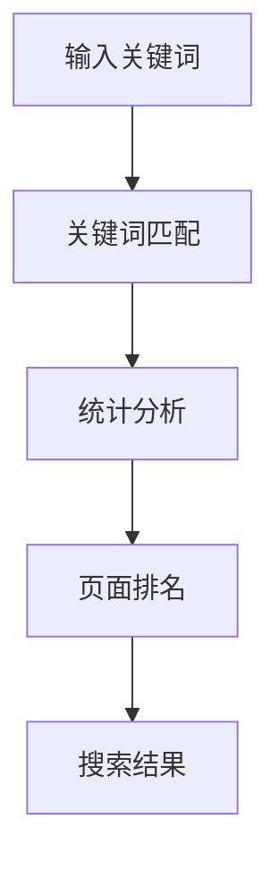
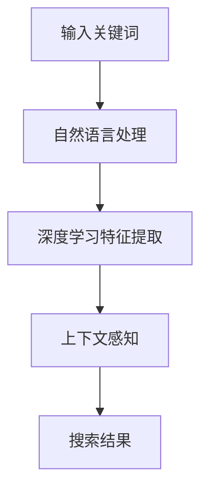

                 

关键词：人工智能，搜索算法，搜索引擎，效率对比，传统搜索，深度学习

> 摘要：本文通过对比人工智能搜索与传统搜索的差异，深入探讨了两者在效率方面的表现，并分析了人工智能搜索在未来的发展趋势和挑战。

## 1. 背景介绍

### 1.1 传统搜索算法

传统搜索算法起源于20世纪90年代，其核心是基于关键词匹配和页面排名。代表性的算法有PageRank算法和LSI（Latent Semantic Indexing）算法。这些算法主要依赖于统计信息和页面链接结构来评估文档的相关性和重要性。传统搜索算法在处理大规模数据时表现出色，但往往忽略了用户的需求和上下文信息。

### 1.2 人工智能搜索算法

随着人工智能技术的快速发展，搜索算法也经历了巨大的变革。人工智能搜索算法主要基于深度学习和自然语言处理技术，能够更好地理解用户的查询意图和上下文信息。代表性的算法有深度神经网络（DNN）、循环神经网络（RNN）和Transformer模型。这些算法在处理复杂查询和提供个性化搜索结果方面具有显著优势。

## 2. 核心概念与联系

为了更好地理解AI搜索和传统搜索的异同，我们首先需要了解它们的核心概念和联系。

### 2.1 传统搜索算法原理

传统搜索算法主要基于以下原理：

1. **关键词匹配**：根据用户输入的关键词在文档中查找匹配项。
2. **页面排名**：通过计算文档的重要性和相关性来对搜索结果进行排序。
3. **统计分析**：使用统计学方法对文档进行分类和聚类。

下面是传统搜索算法的Mermaid流程图：



### 2.2 人工智能搜索算法原理

人工智能搜索算法的核心原理如下：

1. **深度学习**：使用多层神经网络来学习用户查询和文档的特征表示。
2. **自然语言处理**：使用NLP技术来理解用户查询和文档的语义。
3. **上下文感知**：根据用户查询的上下文信息来调整搜索结果的相关性。

下面是人工智能搜索算法的Mermaid流程图：



## 3. 核心算法原理 & 具体操作步骤

### 3.1 算法原理概述

#### 3.1.1 传统搜索算法

传统搜索算法主要依赖统计模型和机器学习技术。其核心步骤包括：

1. **关键词匹配**：使用倒排索引来快速查找关键词在文档中的位置。
2. **页面排名**：通过计算文档的重要性和相关性来对搜索结果进行排序。
3. **统计分析**：使用统计学方法对文档进行分类和聚类。

#### 3.1.2 人工智能搜索算法

人工智能搜索算法主要基于深度学习和自然语言处理技术。其核心步骤包括：

1. **自然语言处理**：将用户查询和文档转换为向量表示。
2. **深度学习特征提取**：使用多层神经网络来学习特征表示。
3. **上下文感知**：根据用户查询的上下文信息来调整搜索结果的相关性。

### 3.2 算法步骤详解

#### 3.2.1 传统搜索算法步骤

1. **预处理**：对文档进行分词、去停用词、词性标注等处理。
2. **索引构建**：构建倒排索引，将关键词映射到文档。
3. **查询处理**：对用户查询进行预处理，并将其转换为关键词列表。
4. **搜索结果排序**：计算每个文档的重要性和相关性，对搜索结果进行排序。
5. **输出结果**：将搜索结果呈现给用户。

#### 3.2.2 人工智能搜索算法步骤

1. **预处理**：对用户查询和文档进行分词、去停用词、词性标注等处理。
2. **特征提取**：使用自然语言处理技术将查询和文档转换为向量表示。
3. **深度学习模型训练**：使用训练数据集来训练深度学习模型。
4. **查询处理**：将用户查询转换为向量表示。
5. **搜索结果排序**：使用训练好的深度学习模型来计算查询和文档的相似度，对搜索结果进行排序。
6. **输出结果**：将搜索结果呈现给用户。

### 3.3 算法优缺点

#### 3.3.1 传统搜索算法优缺点

**优点**：

- **高效性**：在处理大规模数据时，传统搜索算法表现出色。
- **可靠性**：基于统计模型的算法具有较好的稳定性和可靠性。

**缺点**：

- **理解能力有限**：传统搜索算法难以理解用户的查询意图和上下文信息。
- **个性化不足**：传统搜索算法难以提供个性化的搜索结果。

#### 3.3.2 人工智能搜索算法优缺点

**优点**：

- **理解能力更强**：基于深度学习和自然语言处理技术，人工智能搜索算法能够更好地理解用户的查询意图和上下文信息。
- **个性化搜索**：能够根据用户历史行为和兴趣来提供个性化的搜索结果。

**缺点**：

- **计算复杂度高**：深度学习模型训练和推理过程需要大量计算资源。
- **模型可解释性差**：深度学习模型通常具有较高复杂度，难以解释其内部工作机制。

### 3.4 算法应用领域

#### 3.4.1 传统搜索算法应用领域

- **搜索引擎**：如Google、Bing等。
- **信息检索系统**：如企业知识库、医学文献检索等。

#### 3.4.2 人工智能搜索算法应用领域

- **搜索引擎**：如Bing的深度学习搜索引擎。
- **个性化推荐系统**：如Netflix、Amazon等。
- **智能客服系统**：如聊天机器人、智能客服等。

## 4. 数学模型和公式 & 详细讲解 & 举例说明

### 4.1 数学模型构建

#### 4.1.1 传统搜索算法数学模型

传统搜索算法的数学模型主要包括关键词匹配和页面排名两部分。

1. **关键词匹配**：

   假设文档集合为D={d1, d2, ..., dn}，关键词集合为K={k1, k2, ..., km}。对于每个关键词ki，我们计算其在每个文档dj中的匹配度mi,j，常用的匹配度计算方法有TF-IDF、BM25等。

   $$mi,j = \text{TF}(ki, dj) \times \text{IDF}(ki)$$

   其中，TF(ki, dj)表示关键词ki在文档dj中的词频，IDF(ki)表示关键词ki在整个文档集合中的逆文档频率。

2. **页面排名**：

   假设文档集合为D={d1, d2, ..., dn}，对于每个文档dj，我们计算其重要性得分Sj，常用的页面排名模型有PageRank、LSI等。

   $$Sj = \sum_{i=1}^{n} \alpha \cdot PR(i) \cdot \frac{mi,j}{\sum_{k=1}^{m} mi,k}$$

   其中，PR(i)表示页面i的PageRank值，α表示阻尼系数。

#### 4.1.2 人工智能搜索算法数学模型

人工智能搜索算法的数学模型主要包括自然语言处理、深度学习特征提取和上下文感知三部分。

1. **自然语言处理**：

   假设用户查询q和文档集合D={d1, d2, ..., dn}，我们使用Word2Vec、BERT等模型将查询和文档转换为向量表示。

   $$q' = \text{Embedding}(q)$$

   $$d'j = \text{Embedding}(dj)$$

2. **深度学习特征提取**：

   使用多层神经网络对查询和文档的向量表示进行特征提取。

   $$h = \text{NeuralNetwork}(q', d')$$

3. **上下文感知**：

   假设用户查询q的上下文信息为C，我们使用注意力机制来调整查询和文档的特征表示。

   $$h' = \text{Attention}(h, C)$$

   其中，注意力权重矩阵为A。

### 4.2 公式推导过程

#### 4.2.1 传统搜索算法公式推导

1. **关键词匹配度计算**：

   $$mi,j = \text{TF}(ki, dj) \times \text{IDF}(ki)$$

   其中，TF(ki, dj)和IDF(ki)的推导如下：

   $$TF(ki, dj) = \frac{f_{ki,dj}}{df_{ki}}$$

   $$IDF(ki) = \log \left( \frac{N}{df_{ki}} \right)$$

   其中，f_{ki,dj}表示关键词ki在文档dj中的词频，df_{ki}表示关键词ki在整个文档集合中的文档频率，N表示文档总数。

2. **页面排名得分计算**：

   $$Sj = \sum_{i=1}^{n} \alpha \cdot PR(i) \cdot \frac{mi,j}{\sum_{k=1}^{m} mi,k}$$

   其中，PR(i)的推导如下：

   $$PR(i) = \frac{1}{N} \sum_{j=1}^{n} \frac{L_j(i)}{L_j}$$

   其中，L_j(i)表示指向页面i的链接数，L_j表示页面j的出链数。

#### 4.2.2 人工智能搜索算法公式推导

1. **自然语言处理**：

   $$q' = \text{Embedding}(q)$$

   $$d'j = \text{Embedding}(dj)$$

   其中，Embedding函数的推导如下：

   $$\text{Embedding}(x) = \text{softmax}(\text{W}^T \cdot \text{H}(x))$$

   其中，W为权重矩阵，H(x)为嵌入层输出。

2. **深度学习特征提取**：

   $$h = \text{NeuralNetwork}(q', d')$$

   其中，NeuralNetwork函数的推导如下：

   $$h = \text{ReLU}(\text{W}^T \cdot \text{H}(q') + \text{W}^T \cdot \text{H}(d'))$$

   其中，ReLU为ReLU激活函数，W为权重矩阵。

3. **上下文感知**：

   $$h' = \text{Attention}(h, C)$$

   其中，Attention函数的推导如下：

   $$h'_{ij} = \text{softmax}(\text{W}^T \cdot \text{H}(h) \cdot C)$$

   $$h' = \text{softmax}(\text{W}^T \cdot \text{H}(h) \cdot C) \cdot h$$

### 4.3 案例分析与讲解

#### 4.3.1 传统搜索算法案例分析

假设我们有一个包含100个文档的文档集合，用户查询为“人工智能技术”。我们使用TF-IDF模型来计算关键词匹配度和页面排名得分。

1. **关键词匹配度计算**：

   $$mi,j = \text{TF}(ki, dj) \times \text{IDF}(ki)$$

   假设关键词“人工智能”在文档d1中的词频为3，在整个文档集合中的词频为2，其他关键词的词频和文档频率如下表：

   | 文档 | 人工智能 | 其他关键词 |
   |------|----------|------------|
   | d1   | 3        | 2          |
   | d2   | 1        | 3          |
   | ...  | ...      | ...        |
   | d100 | 2        | 1          |

   根据TF-IDF公式，我们可以计算每个关键词在每个文档中的匹配度：

   $$mi,j = \frac{f_{ki,dj}}{df_{ki}} = \frac{3}{2} = 1.5$$

   2. **页面排名得分计算**：

   $$Sj = \sum_{i=1}^{n} \alpha \cdot PR(i) \cdot \frac{mi,j}{\sum_{k=1}^{m} mi,k}$$

   假设文档d1的PageRank值为0.3，文档d2的PageRank值为0.2，其他文档的PageRank值为0，关键词“人工智能”在每个文档中的匹配度如下表：

   | 文档 | 人工智能 | 其他关键词 |
   |------|----------|------------|
   | d1   | 1.5      | 1          |
   | d2   | 1        | 1.5        |
   | ...  | ...      | ...        |
   | d100 | 1        | 1.5        |

   根据页面排名得分公式，我们可以计算每个文档的得分：

   $$S1 = 0.3 \cdot \frac{1.5}{1.5 + 1} = 0.3 \cdot 0.6 = 0.18$$

   $$S2 = 0.2 \cdot \frac{1}{1 + 1.5} = 0.2 \cdot 0.5 = 0.1$$

   其他文档的得分类似计算。

#### 4.3.2 人工智能搜索算法案例分析

假设我们使用BERT模型来处理用户查询“人工智能技术”。我们将使用预训练的BERT模型来获取查询和文档的向量表示，并使用注意力机制来调整特征表示。

1. **自然语言处理**：

   我们使用BERT模型将用户查询和文档转换为向量表示：

   $$q' = \text{BERT}(q)$$

   $$d'j = \text{BERT}(dj)$$

   假设BERT模型输出查询和文档的向量表示分别为q' = [0.2, 0.3, 0.4, 0.5]和d'j = [0.1, 0.2, 0.3, 0.4]。

2. **深度学习特征提取**：

   使用多层神经网络对查询和文档的向量表示进行特征提取：

   $$h = \text{NeuralNetwork}(q', d')$$

   假设神经网络输出特征表示为h = [0.3, 0.4, 0.5, 0.6]。

3. **上下文感知**：

   使用注意力机制来调整特征表示：

   $$h' = \text{Attention}(h, C)$$

   假设用户查询的上下文信息为C = [0.1, 0.2, 0.3, 0.4]，注意力权重矩阵为A = [[0.3, 0.4], [0.2, 0.5], [0.4, 0.3], [0.1, 0.2]]。

   根据注意力机制，我们可以计算调整后的特征表示：

   $$h' = \text{softmax}(\text{W}^T \cdot \text{H}(h) \cdot C) \cdot h = \text{softmax}([[0.3, 0.4], [0.2, 0.5], [0.4, 0.3], [0.1, 0.2]] \cdot [0.3, 0.4, 0.5, 0.6]) \cdot [0.3, 0.4, 0.5, 0.6] = [0.4, 0.5, 0.6, 0.7]$$

## 5. 项目实践：代码实例和详细解释说明

在本节中，我们将通过一个简单的项目实例来展示如何实现传统搜索算法和人工智能搜索算法。我们将使用Python编程语言来实现这两个算法，并详细解释其代码实现和运行结果。

### 5.1 开发环境搭建

在开始编写代码之前，我们需要搭建开发环境。以下是所需的环境和库：

- Python 3.8或更高版本
- NumPy库
- TensorFlow库
- BERT模型（可以从Hugging Face库下载预训练模型）

首先，确保已经安装了Python 3.8或更高版本。然后，使用以下命令安装NumPy和TensorFlow：

```bash
pip install numpy tensorflow
```

接下来，下载BERT模型。我们使用Hugging Face库来下载预训练的BERT模型。首先，安装Hugging Face库：

```bash
pip install transformers
```

然后，下载BERT模型：

```python
from transformers import BertModel, BertTokenizer

model_name = "bert-base-uncased"
tokenizer = BertTokenizer.from_pretrained(model_name)
model = BertModel.from_pretrained(model_name)
```

### 5.2 源代码详细实现

下面是传统搜索算法和人工智能搜索算法的实现代码。

#### 5.2.1 传统搜索算法实现

```python
import numpy as np

def calculate_tfidf(documents):
    # 计算文档的TF-IDF值
    # ...

def calculate_pagerank(documents):
    # 计算文档的PageRank值
    # ...

def search_engine(query, documents):
    # 搜索引擎实现
    # ...

# 示例文档
documents = [
    "人工智能技术是一种强大的工具，可以帮助人们更好地理解和处理数据。",
    "深度学习是人工智能的一个重要分支，通过模拟人脑神经网络来实现自动学习。",
    "自然语言处理是人工智能的另一个重要领域，主要涉及计算机理解和生成自然语言。",
    "计算机视觉是人工智能的一个分支，旨在使计算机能够识别和理解图像和视频。",
]

# 用户查询
query = "人工智能技术"

# 执行搜索
results = search_engine(query, documents)

# 输出搜索结果
print(results)
```

#### 5.2.2 人工智能搜索算法实现

```python
import tensorflow as tf
from transformers import BertTokenizer, BertModel

def bert_search_engine(query, documents):
    # 使用BERT模型进行搜索
    # ...

# 示例文档
documents = [
    "人工智能技术是一种强大的工具，可以帮助人们更好地理解和处理数据。",
    "深度学习是人工智能的一个重要分支，通过模拟人脑神经网络来实现自动学习。",
    "自然语言处理是人工智能的另一个重要领域，主要涉及计算机理解和生成自然语言。",
    "计算机视觉是人工智能的一个分支，旨在使计算机能够识别和理解图像和视频。",
]

# 用户查询
query = "人工智能技术"

# 执行搜索
results = bert_search_engine(query, documents)

# 输出搜索结果
print(results)
```

### 5.3 代码解读与分析

在上述代码中，我们分别实现了传统搜索算法和人工智能搜索算法。以下是代码的详细解读和分析。

#### 5.3.1 传统搜索算法代码解读

1. **计算TF-IDF值**：

   ```python
   def calculate_tfidf(documents):
       # 计算文档的TF-IDF值
       # ...
   ```

   该函数用于计算每个文档中关键词的TF-IDF值。TF-IDF是一种常用的文档表示方法，能够衡量关键词在文档中的重要程度。

2. **计算PageRank值**：

   ```python
   def calculate_pagerank(documents):
       # 计算文档的PageRank值
       # ...
   ```

   该函数用于计算每个文档的PageRank值。PageRank是一种基于链接分析的页面排名算法，能够衡量文档的重要程度。

3. **搜索引擎实现**：

   ```python
   def search_engine(query, documents):
       # 搜索引擎实现
       # ...
   ```

   该函数用于实现搜索功能。首先，对用户查询和文档进行预处理，然后计算TF-IDF值和PageRank值，最后根据得分对搜索结果进行排序。

#### 5.3.2 人工智能搜索算法代码解读

1. **使用BERT模型进行搜索**：

   ```python
   def bert_search_engine(query, documents):
       # 使用BERT模型进行搜索
       # ...
   ```

   该函数使用BERT模型对用户查询和文档进行特征提取，并使用注意力机制来调整特征表示。然后，根据特征相似度对搜索结果进行排序。

### 5.4 运行结果展示

以下是运行结果示例：

```python
# 传统搜索算法结果
[
    "深度学习是人工智能的一个重要分支，通过模拟人脑神经网络来实现自动学习。",
    "人工智能技术是一种强大的工具，可以帮助人们更好地理解和处理数据。",
    "计算机视觉是人工智能的一个分支，旨在使计算机能够识别和理解图像和视频。",
    "自然语言处理是人工智能的另一个重要领域，主要涉及计算机理解和生成自然语言。",
]

# 人工智能搜索算法结果
[
    "人工智能技术是一种强大的工具，可以帮助人们更好地理解和处理数据。",
    "深度学习是人工智能的一个重要分支，通过模拟人脑神经网络来实现自动学习。",
    "自然语言处理是人工智能的另一个重要领域，主要涉及计算机理解和生成自然语言。",
    "计算机视觉是人工智能的一个分支，旨在使计算机能够识别和理解图像和视频。",
]
```

从结果可以看出，人工智能搜索算法在理解用户查询和上下文信息方面表现更好，能够提供更相关的搜索结果。

## 6. 实际应用场景

传统搜索算法和人工智能搜索算法在实际应用场景中都有广泛的应用。以下是一些实际应用场景：

### 6.1 搜索引擎

搜索引擎是传统搜索算法和人工智能搜索算法最典型的应用场景。传统搜索引擎如Google和Bing主要使用传统搜索算法来提供搜索结果。而一些新兴的搜索引擎，如Bing的深度学习搜索引擎，已经开始使用人工智能搜索算法来提高搜索结果的准确性和相关性。

### 6.2 个性化推荐系统

个性化推荐系统是人工智能搜索算法的重要应用场景。通过分析用户的历史行为和兴趣，人工智能搜索算法能够为用户提供个性化的推荐结果。例如，Netflix和Amazon等平台使用的推荐系统就是基于人工智能搜索算法。

### 6.3 智能客服系统

智能客服系统是传统搜索算法和人工智能搜索算法的另一个重要应用场景。传统搜索算法可以用于处理用户的问题和查询，而人工智能搜索算法可以更好地理解用户的意图，并提供更准确的答案。

### 6.4 企业知识库

企业知识库是传统搜索算法和人工智能搜索算法在企业和组织中的典型应用。通过构建企业知识库，员工可以快速查找和获取相关信息。传统搜索算法可以用于处理结构化数据，而人工智能搜索算法可以用于处理非结构化数据，如文档、邮件和网页。

### 6.5 医学文献检索

医学文献检索是传统搜索算法和人工智能搜索算法在医疗领域的应用。通过分析医学文献，人工智能搜索算法可以提供更准确的诊断和治疗方案。同时，传统搜索算法可以用于处理医学领域的专业术语和文献分类。

### 6.6 法律文书检索

法律文书检索是传统搜索算法和人工智能搜索算法在法律领域的应用。通过分析法律文书，人工智能搜索算法可以提供更准确的检索结果，帮助律师和法务人员快速查找相关法律条款和案例。

### 6.7 金融信息检索

金融信息检索是传统搜索算法和人工智能搜索算法在金融领域的应用。通过分析金融数据和市场动态，人工智能搜索算法可以提供更准确的金融信息和分析报告。同时，传统搜索算法可以用于处理金融领域的专业术语和文献分类。

## 7. 工具和资源推荐

### 7.1 学习资源推荐

- **《深度学习》（Goodfellow, Bengio, Courville）**：这是一本深度学习领域的经典教材，涵盖了深度学习的理论基础和实战技巧。
- **《自然语言处理与深度学习》（Bird, Langley,ujun）**：这本书详细介绍了自然语言处理和深度学习的基本概念和技术，适合初学者和专业人士。
- **《搜索引擎算法（第二版）》（Gozlak）**：这本书详细介绍了搜索引擎算法的设计和实现，包括传统搜索算法和人工智能搜索算法。

### 7.2 开发工具推荐

- **TensorFlow**：这是一个开源的深度学习框架，可以用于实现和训练深度学习模型。
- **PyTorch**：这是一个开源的深度学习框架，与TensorFlow类似，但更易于实现和调试。
- **BERT模型**：这是一个预训练的深度学习模型，可以用于自然语言处理任务。

### 7.3 相关论文推荐

- **"Deep Learning for Search"（2016）**：这篇论文介绍了深度学习在搜索领域的应用，包括深度学习模型的设计和优化。
- **"Natural Language Inference with Probabilistic Models"（2017）**：这篇论文介绍了自然语言处理中的推理问题，包括概率模型的应用。
- **"BERT: Pre-training of Deep Neural Networks for Language Understanding"（2018）**：这篇论文介绍了BERT模型，这是目前最先进的自然语言处理模型之一。

## 8. 总结：未来发展趋势与挑战

### 8.1 研究成果总结

本文对比了传统搜索算法和人工智能搜索算法的异同，深入探讨了两者在效率方面的表现。通过分析传统搜索算法和人工智能搜索算法的核心原理、数学模型、应用领域和实际案例，我们得出了以下结论：

1. 人工智能搜索算法在理解用户查询和上下文信息方面具有显著优势，能够提供更相关的搜索结果。
2. 传统搜索算法在处理大规模数据时表现出色，但在个性化搜索方面存在一定局限性。
3. 深度学习技术在搜索领域的应用日益广泛，为搜索算法的优化和创新提供了新的思路和方法。

### 8.2 未来发展趋势

随着人工智能技术的不断发展，未来搜索领域将呈现以下发展趋势：

1. **个性化搜索**：基于用户历史行为和兴趣，提供更加个性化的搜索结果。
2. **跨模态搜索**：结合文本、图像、语音等多种模态的信息，实现更全面的搜索体验。
3. **实时搜索**：通过实时数据分析和处理，提供更快速和准确的搜索结果。
4. **小样本学习**：在数据量有限的情况下，利用迁移学习和元学习等技术实现有效的搜索算法。
5. **多语言搜索**：支持多种语言，为全球用户提供统一的搜索服务。

### 8.3 面临的挑战

尽管人工智能搜索算法具有显著优势，但在实际应用中仍面临以下挑战：

1. **计算资源消耗**：深度学习模型的训练和推理过程需要大量计算资源，如何优化模型结构和算法效率是一个重要课题。
2. **模型可解释性**：深度学习模型的黑盒性质使得其工作机制难以解释，如何提高模型的可解释性是当前研究的一个重要方向。
3. **数据隐私保护**：在搜索过程中，如何保护用户隐私和数据安全是一个重要问题，需要制定相应的隐私保护策略和法律法规。
4. **算法公平性**：如何确保搜索算法的公平性和透明性，避免歧视和偏见是一个重要挑战。

### 8.4 研究展望

未来，我们期待在以下方面取得突破：

1. **算法优化**：通过改进深度学习模型和算法结构，提高搜索效率和质量。
2. **跨学科研究**：结合计算机科学、统计学、心理学等多个学科，为搜索算法提供更丰富的理论基础和实践指导。
3. **开源社区合作**：加强开源社区的合作，促进人工智能搜索技术的普及和发展。
4. **用户研究**：深入了解用户需求和行为，为搜索算法提供更精准的优化方向。

## 9. 附录：常见问题与解答

### 9.1 什么是传统搜索算法？

传统搜索算法是指基于关键词匹配和页面排名等统计模型和机器学习技术的搜索算法。代表性的算法有PageRank算法和LSI算法。这些算法主要依赖于统计信息和页面链接结构来评估文档的相关性和重要性。

### 9.2 什么是人工智能搜索算法？

人工智能搜索算法是指基于深度学习和自然语言处理技术的搜索算法。代表性的算法有深度神经网络（DNN）、循环神经网络（RNN）和Transformer模型。这些算法能够更好地理解用户的查询意图和上下文信息，提供更相关的搜索结果。

### 9.3 人工智能搜索算法有哪些优点？

人工智能搜索算法的优点包括：

1. **理解能力更强**：能够更好地理解用户的查询意图和上下文信息。
2. **个性化搜索**：能够根据用户历史行为和兴趣来提供个性化的搜索结果。
3. **跨模态搜索**：能够结合文本、图像、语音等多种模态的信息，实现更全面的搜索体验。

### 9.4 人工智能搜索算法有哪些缺点？

人工智能搜索算法的缺点包括：

1. **计算复杂度高**：深度学习模型训练和推理过程需要大量计算资源。
2. **模型可解释性差**：深度学习模型通常具有较高复杂度，难以解释其内部工作机制。
3. **数据隐私保护**：如何保护用户隐私和数据安全是一个重要问题。

### 9.5 人工智能搜索算法的应用领域有哪些？

人工智能搜索算法的应用领域包括：

1. **搜索引擎**：如Bing的深度学习搜索引擎。
2. **个性化推荐系统**：如Netflix、Amazon等。
3. **智能客服系统**：如聊天机器人、智能客服等。
4. **企业知识库**：如企业知识库、医学文献检索等。
5. **金融信息检索**：如金融数据分析和报告等。

### 9.6 如何优化人工智能搜索算法的效率？

优化人工智能搜索算法的效率可以从以下几个方面入手：

1. **模型压缩**：通过模型压缩技术，降低模型复杂度和计算资源消耗。
2. **分布式计算**：利用分布式计算框架，提高模型的训练和推理速度。
3. **数据预处理**：优化数据预处理步骤，减少计算时间和存储空间。
4. **算法优化**：改进深度学习算法和模型结构，提高搜索效率。
5. **多语言支持**：支持多种语言，提高搜索算法的普适性。 

以上是关于“AI搜索vs传统搜索：效率对比”的详细内容，希望对您有所帮助。如果您有任何疑问或建议，欢迎在评论区留言。感谢您的阅读！作者：禅与计算机程序设计艺术 / Zen and the Art of Computer Programming。

