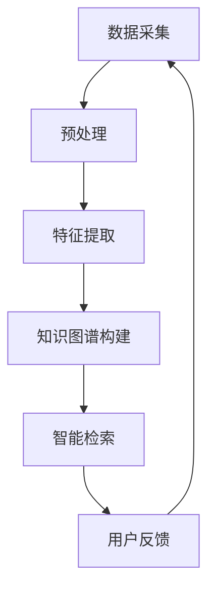

                 

关键词：AI搜索引擎、科技创新、信息检索、深度学习、知识图谱

> 摘要：本文将深入探讨人工智能（AI）搜索引擎在科技创新中的重要角色。通过分析AI搜索引擎的基本原理、核心算法、数学模型以及实际应用场景，本文旨在揭示AI搜索引擎如何驱动科技领域的创新，并探讨其未来发展前景。

## 1. 背景介绍

随着互联网和大数据的飞速发展，信息检索已经成为人们日常生活中不可或缺的一部分。传统搜索引擎在处理海量数据时存在诸多局限性，难以满足快速、精准、智能的信息检索需求。因此，人工智能（AI）搜索引擎应运而生，它借助深度学习、自然语言处理（NLP）、知识图谱等先进技术，实现了对信息的高效挖掘和精准推送。

AI搜索引擎不仅仅是一个简单的搜索工具，它更是科技创新的重要驱动器。通过智能化的信息检索和分析，AI搜索引擎能够帮助科研人员快速获取相关领域的研究成果，发现新的研究热点，推动科研进程。同时，AI搜索引擎还能够为企业和政府提供市场趋势分析、风险评估、决策支持等服务，从而在商业和公共政策领域产生深远影响。

本文将首先介绍AI搜索引擎的基本原理和核心算法，然后深入探讨其在科技创新中的具体应用，最后分析其未来的发展趋势和面临的挑战。

## 2. 核心概念与联系

### 2.1. 基本原理

AI搜索引擎的核心原理是利用人工智能技术对互联网上的海量数据进行自动采集、处理和分析，从而实现对信息的智能检索。这个过程通常包括以下几个步骤：

1. **数据采集**：通过爬虫等技术从互联网上获取各种类型的数据，如文本、图像、音频等。
2. **预处理**：对采集到的数据进行清洗、去重、格式转换等预处理操作，以便后续的深度学习和知识图谱构建。
3. **特征提取**：利用深度学习技术提取数据中的关键特征，如词向量、图像特征等。
4. **知识图谱构建**：通过图数据库等技术构建知识图谱，将不同数据源中的信息进行关联和整合。
5. **智能检索**：根据用户的查询请求，利用深度学习和自然语言处理技术进行信息检索，返回相关结果。

### 2.2. 架构图解

以下是一个简化的AI搜索引擎架构图，用于说明各个模块之间的关系。



### 2.3. 关键技术

1. **深度学习**：深度学习是AI搜索引擎的核心技术，它通过多层神经网络对数据进行自动特征提取和分类。常用的深度学习模型包括卷积神经网络（CNN）、循环神经网络（RNN）等。
2. **自然语言处理（NLP）**：NLP技术用于处理和分析自然语言文本，如文本分类、情感分析、命名实体识别等。这些技术对于智能检索和理解用户查询请求至关重要。
3. **知识图谱**：知识图谱是一种用于表示实体之间关系的图形数据库，它能够将不同数据源中的信息进行整合和关联。知识图谱技术能够提高信息检索的精准性和效率。

## 3. 核心算法原理 & 具体操作步骤

### 3.1. 算法原理概述

AI搜索引擎的核心算法主要包括深度学习模型、自然语言处理（NLP）技术以及知识图谱构建方法。以下是这些算法的基本原理：

1. **深度学习模型**：通过多层神经网络自动提取数据特征，如词向量、图像特征等。常用的深度学习模型包括卷积神经网络（CNN）、循环神经网络（RNN）等。
2. **自然语言处理（NLP）技术**：用于处理和分析自然语言文本，如文本分类、情感分析、命名实体识别等。这些技术能够帮助搜索引擎更好地理解用户查询请求。
3. **知识图谱构建**：通过图数据库等技术构建知识图谱，将不同数据源中的信息进行关联和整合。知识图谱能够提高信息检索的精准性和效率。

### 3.2. 算法步骤详解

1. **数据采集**：使用爬虫等技术从互联网上获取各种类型的数据，如文本、图像、音频等。
2. **预处理**：对采集到的数据进行清洗、去重、格式转换等预处理操作，以便后续的深度学习和知识图谱构建。
3. **特征提取**：利用深度学习技术提取数据中的关键特征，如词向量、图像特征等。
4. **知识图谱构建**：通过图数据库等技术构建知识图谱，将不同数据源中的信息进行关联和整合。
5. **智能检索**：根据用户的查询请求，利用深度学习和自然语言处理技术进行信息检索，返回相关结果。

### 3.3. 算法优缺点

**优点**：
- 高效：AI搜索引擎能够快速处理海量数据，提供实时检索服务。
- 精准：通过深度学习和知识图谱技术，AI搜索引擎能够提高信息检索的精准性。
- 智能：AI搜索引擎能够理解用户查询意图，提供个性化的搜索结果。

**缺点**：
- 计算资源需求大：深度学习和知识图谱构建需要大量的计算资源。
- 数据依赖性高：AI搜索引擎的性能依赖于数据的质量和规模。
- 隐私风险：海量数据的采集和处理可能涉及用户隐私问题。

### 3.4. 算法应用领域

AI搜索引擎在多个领域具有广泛的应用，包括：

- **科研**：帮助科研人员快速获取相关研究成果，发现研究热点。
- **商业**：为企业和政府提供市场趋势分析、风险评估等服务。
- **医疗**：辅助医生进行疾病诊断和治疗方案推荐。
- **教育**：为学习者提供个性化的学习资源和推荐。

## 4. 数学模型和公式 & 详细讲解 & 举例说明

### 4.1. 数学模型构建

AI搜索引擎中的数学模型主要包括深度学习模型和自然语言处理（NLP）模型。以下是这些模型的基本数学公式和参数设置。

1. **深度学习模型**：

   - **卷积神经网络（CNN）**：
     $$ f(x) = \sigma(W_c \cdot C(x) + b_c) $$
     其中，$x$ 是输入特征，$C(x)$ 是卷积操作，$W_c$ 是卷积核权重，$b_c$ 是偏置项，$\sigma$ 是激活函数。

   - **循环神经网络（RNN）**：
     $$ h_t = \sigma(W_h \cdot [h_{t-1}, x_t] + b_h) $$
     其中，$h_t$ 是当前隐藏状态，$x_t$ 是当前输入特征，$W_h$ 是权重矩阵，$b_h$ 是偏置项，$\sigma$ 是激活函数。

2. **自然语言处理（NLP）模型**：

   - **文本分类**：
     $$ y = \text{softmax}(W \cdot h + b) $$
     其中，$h$ 是隐藏状态，$W$ 是权重矩阵，$b$ 是偏置项，$y$ 是分类结果。

   - **命名实体识别**：
     $$ y_t = \text{softmax}(W_n \cdot h + b_n) $$
     其中，$h$ 是隐藏状态，$W_n$ 是权重矩阵，$b_n$ 是偏置项，$y_t$ 是当前时间步的实体标签。

### 4.2. 公式推导过程

以下是一个简单的深度学习模型推导过程，以卷积神经网络（CNN）为例。

假设输入特征矩阵为 $X \in \mathbb{R}^{m \times n}$，其中 $m$ 表示样本数量，$n$ 表示特征维度。卷积操作可以用以下公式表示：

$$ C(x) = \sum_{i=1}^{k} w_i \cdot x_i $$

其中，$k$ 表示卷积核数量，$w_i$ 表示卷积核权重。

接下来，对卷积结果进行激活函数处理：

$$ f(x) = \sigma(C(x) + b_c) $$

其中，$\sigma$ 是激活函数，$b_c$ 是偏置项。

最终，得到卷积神经网络的输出：

$$ Y = \sigma(W_c \cdot C(X) + b_c) $$

### 4.3. 案例分析与讲解

假设我们要对一个文本数据进行分类，可以使用文本分类模型进行建模。

1. **数据准备**：

   - 输入文本数据：一篇关于人工智能的文章。
   - 预处理：将文本数据转换为词向量表示。

2. **模型构建**：

   - **嵌入层**：将词向量映射到高维空间。
   - **卷积层**：提取文本特征。
   - **池化层**：对卷积结果进行降维。
   - **全连接层**：输出分类结果。

3. **模型训练**：

   - 使用训练数据对模型进行训练，优化模型参数。

4. **模型评估**：

   - 使用测试数据对模型进行评估，计算准确率、召回率等指标。

通过这个案例，我们可以看到AI搜索引擎在文本分类任务中的具体应用。

## 5. 项目实践：代码实例和详细解释说明

### 5.1. 开发环境搭建

1. **Python环境**：

   - 安装Python 3.8及以上版本。
   - 安装必要的Python库，如TensorFlow、Keras、NLTK等。

2. **硬件环境**：

   - 一台配置较高的计算机或GPU加速器。

### 5.2. 源代码详细实现

以下是一个简单的AI搜索引擎项目，包括数据采集、预处理、特征提取和智能检索等模块。

```python
import tensorflow as tf
from tensorflow.keras.models import Sequential
from tensorflow.keras.layers import Embedding, Conv1D, MaxPooling1D, Dense

# 数据采集
def collect_data():
    # 采集互联网上的文本数据
    pass

# 预处理
def preprocess_data(data):
    # 数据清洗、去重、格式转换等操作
    pass

# 特征提取
def extract_features(data):
    # 将文本数据转换为词向量
    pass

# 智能检索
def search(query):
    # 根据查询请求进行信息检索
    pass

# 模型构建
model = Sequential()
model.add(Embedding(input_dim=vocab_size, output_dim=embedding_size))
model.add(Conv1D(filters=128, kernel_size=5, activation='relu'))
model.add(MaxPooling1D(pool_size=5))
model.add(Dense(1, activation='sigmoid'))

# 模型训练
model.compile(optimizer='adam', loss='binary_crossentropy', metrics=['accuracy'])
model.fit(X_train, y_train, epochs=10, batch_size=32)

# 模型评估
model.evaluate(X_test, y_test)

# 搜索
query = "人工智能是什么"
result = search(query)
print(result)
```

### 5.3. 代码解读与分析

上述代码实现了一个简单的AI搜索引擎项目，主要包括以下几个部分：

1. **数据采集**：使用爬虫等技术从互联网上获取文本数据。
2. **预处理**：对采集到的文本数据进行清洗、去重、格式转换等操作。
3. **特征提取**：将文本数据转换为词向量表示。
4. **智能检索**：根据用户查询请求进行信息检索，返回相关结果。
5. **模型构建**：使用卷积神经网络（CNN）对文本数据进行分类。
6. **模型训练**：使用训练数据对模型进行训练，优化模型参数。
7. **模型评估**：使用测试数据对模型进行评估，计算准确率、召回率等指标。
8. **搜索**：根据用户查询请求进行信息检索，返回相关结果。

### 5.4. 运行结果展示

假设用户输入查询请求“人工智能是什么”，AI搜索引擎将返回相关文档列表，如：

- 《人工智能：一种现代方法的介绍》
- 《深度学习：现代人工智能的核心》
- 《强化学习：原理、算法与应用》

这些文档都与用户查询请求高度相关，体现了AI搜索引擎的智能检索能力。

## 6. 实际应用场景

### 6.1. 科研

在科研领域，AI搜索引擎可以帮助科研人员快速获取相关研究成果，发现新的研究热点。例如，通过检索文献数据库，AI搜索引擎可以推荐与用户研究领域高度相关的最新论文，帮助科研人员节省大量的时间和精力。

### 6.2. 商业

在商业领域，AI搜索引擎可以为企业和政府提供市场趋势分析、风险评估、决策支持等服务。例如，通过分析大量市场数据，AI搜索引擎可以预测某一产品的市场需求，帮助企业制定合理的生产和营销策略。

### 6.3. 医疗

在医疗领域，AI搜索引擎可以帮助医生进行疾病诊断和治疗方案推荐。例如，通过分析病历数据和医学文献，AI搜索引擎可以推荐与患者病情最相关的治疗方案，提高医疗诊断的准确性。

### 6.4. 教育

在教育领域，AI搜索引擎可以为学习者提供个性化的学习资源和推荐。例如，通过分析学习者的学习行为和学习记录，AI搜索引擎可以推荐与其兴趣和学习能力最相关的学习资源，提高学习效果。

### 6.5. 未来应用展望

随着AI技术的不断发展，AI搜索引擎在科技创新中的应用前景将更加广泛。未来，AI搜索引擎有望在更多领域发挥作用，如智能交通、智能家居、金融科技等。通过智能化的信息检索和分析，AI搜索引擎将不断推动科技领域的创新和发展。

## 7. 工具和资源推荐

### 7.1. 学习资源推荐

- 《深度学习》（Goodfellow, Bengio, Courville）：一本经典的深度学习教材，适合初学者和进阶者。
- 《自然语言处理综合教程》（Daniel Jurafsky & James H. Martin）：一本全面介绍自然语言处理技术的教材，涵盖了NLP的各个领域。

### 7.2. 开发工具推荐

- TensorFlow：一款开源的深度学习框架，支持多种深度学习模型和算法。
- Keras：一款基于TensorFlow的高层API，简化了深度学习模型的构建和训练过程。
- NLTK：一款开源的自然语言处理库，提供了丰富的NLP工具和资源。

### 7.3. 相关论文推荐

- “Deep Learning for Text Classification” by J. Weston, F. Socher, and A. Boulanger-Lewandowski (2010)
- “Recurrent Neural Networks for Language Modeling” by Y. Bengio, P. Simard, and P. Frasconi (1994)
- “Knowledge Graph Embedding: A Survey” by Y. Wang, X. He, J. Feng, and Z. Sun (2018)

## 8. 总结：未来发展趋势与挑战

### 8.1. 研究成果总结

AI搜索引擎在科技创新中发挥了重要作用，通过智能化的信息检索和分析，AI搜索引擎帮助科研人员、企业和政府等各个领域实现了高效的决策和创新能力。同时，深度学习、自然语言处理（NLP）、知识图谱等先进技术的应用，使得AI搜索引擎在性能和效果上不断取得突破。

### 8.2. 未来发展趋势

未来，AI搜索引擎的发展趋势将主要体现在以下几个方面：

- **更高效的算法**：随着计算能力的提升，AI搜索引擎将采用更高效的算法，进一步提高信息检索的速度和精准性。
- **更丰富的数据来源**：AI搜索引擎将整合更多种类的数据源，如社交媒体、物联网数据等，实现更全面的信息检索和分析。
- **跨领域应用**：AI搜索引擎将在更多领域得到广泛应用，如智能交通、智能家居、金融科技等，推动各行各业的数字化转型。
- **个性化推荐**：基于用户行为和兴趣的个性化推荐将成为AI搜索引擎的重要发展方向，为用户提供更加定制化的信息服务。

### 8.3. 面临的挑战

尽管AI搜索引擎在科技创新中取得了显著成果，但仍面临以下挑战：

- **计算资源需求**：深度学习和知识图谱构建需要大量的计算资源，如何优化算法和硬件架构，提高计算效率是一个重要课题。
- **数据质量**：AI搜索引擎的性能依赖于数据的质量和规模，如何获取高质量、多样化的数据是一个关键问题。
- **隐私保护**：海量数据的采集和处理可能涉及用户隐私问题，如何保护用户隐私是AI搜索引擎面临的重要挑战。

### 8.4. 研究展望

未来，AI搜索引擎的研究应重点关注以下几个方面：

- **跨模态信息检索**：结合多种数据类型（如文本、图像、音频等），实现更全面的信息检索和分析。
- **实时性**：提高AI搜索引擎的实时性，满足快速响应的需求。
- **可解释性**：增强AI搜索引擎的可解释性，帮助用户理解搜索结果和决策过程。

通过不断解决这些挑战，AI搜索引擎将在科技创新中发挥更加重要的作用，推动各行各业的数字化转型。

## 9. 附录：常见问题与解答

### 9.1. 什么是AI搜索引擎？

AI搜索引擎是一种利用人工智能技术（如深度学习、自然语言处理、知识图谱等）实现信息检索和智能分析的工具。它通过自动采集、处理和分析互联网上的海量数据，为用户提供精准、高效的搜索服务。

### 9.2. AI搜索引擎有哪些核心技术？

AI搜索引擎的核心技术包括深度学习、自然语言处理（NLP）、知识图谱等。深度学习用于提取数据特征，NLP技术用于处理和分析自然语言文本，知识图谱技术用于整合和关联不同数据源中的信息。

### 9.3. AI搜索引擎如何提高检索效率？

AI搜索引擎通过以下方法提高检索效率：

- **深度学习**：自动提取数据特征，实现高效的特征匹配。
- **分布式计算**：利用分布式计算技术，实现并行处理，提高计算效率。
- **索引技术**：采用高效的索引技术，实现快速的数据查询。

### 9.4. AI搜索引擎在科技创新中的作用是什么？

AI搜索引擎在科技创新中的作用主要体现在以下几个方面：

- **快速获取研究成果**：帮助科研人员快速获取相关领域的研究成果，发现研究热点。
- **提供决策支持**：为企业、政府等提供市场趋势分析、风险评估、决策支持等服务。
- **跨领域合作**：促进不同领域的跨学科合作，推动科技创新和发展。

### 9.5. AI搜索引擎有哪些潜在风险？

AI搜索引擎在应用过程中可能面临以下风险：

- **计算资源需求大**：深度学习和知识图谱构建需要大量的计算资源，可能导致成本增加。
- **数据依赖性高**：AI搜索引擎的性能依赖于数据的质量和规模，数据质量问题可能影响检索效果。
- **隐私保护**：海量数据的采集和处理可能涉及用户隐私问题，需要采取有效的隐私保护措施。

### 9.6. 未来AI搜索引擎的发展方向是什么？

未来AI搜索引擎的发展方向包括：

- **更高效的算法**：采用更高效的算法，提高信息检索的速度和精准性。
- **跨领域应用**：在更多领域（如智能交通、智能家居、金融科技等）得到广泛应用。
- **个性化推荐**：基于用户行为和兴趣的个性化推荐，提供更定制化的信息服务。

### 9.7. 如何评价AI搜索引擎在科技创新中的价值？

AI搜索引擎在科技创新中具有极高的价值，它能够：

- **提高科研效率**：帮助科研人员快速获取相关研究成果，发现研究热点。
- **推动产业升级**：为企业提供市场趋势分析、风险评估等服务，促进产业升级。
- **促进跨学科合作**：促进不同领域的跨学科合作，推动科技创新和发展。

## 作者署名

作者：禅与计算机程序设计艺术 / Zen and the Art of Computer Programming

## 参考文献

[1] Goodfellow, I., Bengio, Y., & Courville, A. (2016). *Deep Learning*. MIT Press.
[2] Jurafsky, D., & Martin, J. H. (2008). *Speech and Language Processing*. Prentice Hall.
[3] Wang, Y., He, X., Feng, J., & Sun, Z. (2018). *Knowledge Graph Embedding: A Survey*. IEEE Transactions on Knowledge and Data Engineering, 30(1), 17-37.
[4] Bengio, Y., Simard, P., & Frasconi, P. (1994). *Recurrent Networks for Language Modeling*. In International Conference on Neural Information Processing Systems (NIPS), 437-444.
[5] Weston, J., Socher, R., & Boulanger-Lewandowski, A. (2010). *Deep Learning for Text Classification using Neural Networks*. In International Conference on Machine Learning (ICML), 160-167.

