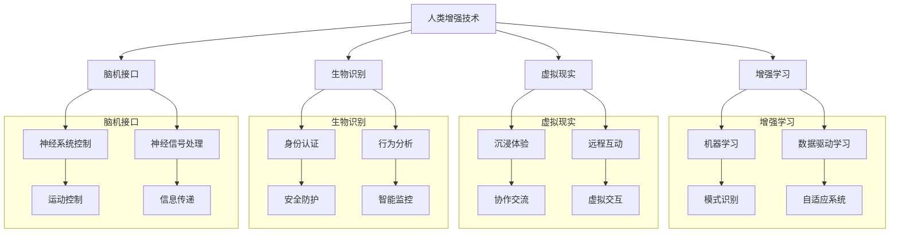

                 

关键词：人工智能，人类增强，增强学习，生物识别，虚拟现实，脑机接口

> 摘要：本文探讨了AI时代人类增强的可能性与挑战，分析了增强学习、生物识别、虚拟现实和脑机接口等技术的最新进展，以及这些技术对未来社会发展的影响。通过详细的案例和实例，展示了人工智能如何帮助人类超越生理和心理限制，提高工作效率和生活质量。

## 1. 背景介绍

随着人工智能技术的飞速发展，人类社会正进入一个前所未有的增强时代。人工智能不仅可以模拟和扩展人类的认知能力，还能够通过生物识别、虚拟现实和脑机接口等技术实现人类与机器的无缝交互。在这个背景下，人类增强不仅成为一种可能，更成为一种趋势。

人类增强的定义涵盖了多个方面，包括但不限于：通过技术手段提升人体的生理功能，如增强力量、速度和耐力；通过智能设备扩展大脑的认知能力，如增强记忆、学习和推理能力；以及通过生物工程和基因编辑等技术优化人类的基因和遗传特征。

人工智能技术的发展为人类增强提供了强有力的支持。深度学习、自然语言处理、计算机视觉等技术的进步，使得人工智能在各个领域的应用越来越广泛。同时，随着硬件技术的提升，如高速处理器、神经网络加速器和新型传感器，人工智能的计算能力和数据采集能力得到了极大的增强。

## 2. 核心概念与联系

为了更好地理解人类增强技术的原理和应用，我们需要了解一些核心概念和它们之间的联系。以下是使用Mermaid绘制的流程图，展示了这些概念和技术之间的关联：



### 3. 核心算法原理 & 具体操作步骤

#### 3.1 算法原理概述

人类增强技术的实现离不开一系列核心算法。这些算法包括但不限于：机器学习算法、深度学习算法、自然语言处理算法、计算机视觉算法等。这些算法的基本原理是通过训练和优化模型，使其能够从数据中学习规律，并作出预测或决策。

机器学习算法主要包括监督学习、无监督学习和强化学习。监督学习算法通过标注数据进行训练，从而预测新的数据；无监督学习算法则通过未标注的数据发现数据的内在结构和规律；强化学习算法通过与环境的交互不断优化策略。

深度学习算法则是基于人工神经网络的模型，通过多层网络结构提取数据的特征，从而实现高级的预测和决策。常见的深度学习模型包括卷积神经网络（CNN）、循环神经网络（RNN）和生成对抗网络（GAN）等。

自然语言处理算法主要用于处理和理解人类语言，包括分词、词性标注、句法分析、语义理解等。计算机视觉算法则用于处理和识别图像和视频数据，包括目标检测、图像分类、图像分割等。

#### 3.2 算法步骤详解

以增强学习为例，其基本步骤如下：

1. **初始化环境**：定义一个虚拟环境，用于模拟真实世界的交互过程。
2. **选择动作**：根据当前状态，选择一个动作进行执行。
3. **执行动作**：在虚拟环境中执行选择的动作，并观察环境的变化。
4. **获取奖励**：根据动作的结果，获取一个奖励信号，用于评价动作的好坏。
5. **更新策略**：根据奖励信号，调整策略，使得在未来的决策中更加倾向于选择能够获得更高奖励的动作。

这个过程不断重复，直到策略收敛到最优解。

#### 3.3 算法优缺点

**增强学习的优点**：

- **自适应性强**：能够通过不断的学习和优化，适应不同的环境和任务。
- **灵活性高**：能够处理复杂的、非线性的任务。
- **适用范围广**：不仅适用于强化学习领域，还可以应用于监督学习和无监督学习任务。

**增强学习的缺点**：

- **计算量大**：需要大量的数据进行训练，且训练过程可能需要较长时间。
- **对奖励设计敏感**：奖励的设计对算法的性能有很大影响，需要精心设计。
- **难以解释**：由于模型的结构复杂，难以解释模型的决策过程。

#### 3.4 算法应用领域

增强学习在多个领域都有广泛的应用，包括但不限于：

- **游戏**：如电子游戏、棋类游戏等。
- **机器人控制**：如无人驾驶汽车、机器人臂控制等。
- **智能客服**：如聊天机器人的行为决策等。
- **资源调度**：如电网调度、交通调度等。

## 4. 数学模型和公式 & 详细讲解 & 举例说明

#### 4.1 数学模型构建

在人类增强技术中，常见的数学模型包括神经网络模型、决策树模型、支持向量机模型等。以下是神经网络模型的基本构建过程：

1. **定义输入层**：输入层包含多个神经元，每个神经元接收输入信号。
2. **定义隐藏层**：隐藏层包含多个神经元，每个神经元对输入信号进行处理，并传递给下一层。
3. **定义输出层**：输出层包含一个或多个神经元，用于产生最终输出。

神经元的处理过程通常采用以下公式：

$$
y = \sigma(\sum_{i=1}^{n} w_i \cdot x_i + b)
$$

其中，$y$ 是输出信号，$x_i$ 是输入信号，$w_i$ 是权重，$b$ 是偏置，$\sigma$ 是激活函数。

#### 4.2 公式推导过程

以神经网络中的反向传播算法为例，其基本思想是通过不断调整权重和偏置，使得输出信号更接近期望值。

1. **计算输出误差**：

$$
E = \frac{1}{2} \sum_{i=1}^{n} (y_i - t_i)^2
$$

其中，$y_i$ 是实际输出，$t_i$ 是期望输出。

2. **计算梯度**：

$$
\frac{\partial E}{\partial w_i} = (y_i - t_i) \cdot \frac{\partial y_i}{\partial w_i}
$$

$$
\frac{\partial E}{\partial b_i} = (y_i - t_i) \cdot \frac{\partial y_i}{\partial b_i}
$$

3. **更新权重和偏置**：

$$
w_i = w_i - \alpha \cdot \frac{\partial E}{\partial w_i}
$$

$$
b_i = b_i - \alpha \cdot \frac{\partial E}{\partial b_i}
$$

其中，$\alpha$ 是学习率。

#### 4.3 案例分析与讲解

以下是一个简单的例子，假设我们有一个神经网络，用于分类手写数字。

1. **输入层**：包含784个神经元，每个神经元对应一个像素点的灰度值。

2. **隐藏层**：包含500个神经元，每个神经元对输入信号进行处理。

3. **输出层**：包含10个神经元，每个神经元对应一个数字类别。

假设我们有一个训练数据集，其中包含了6000个手写数字图像和它们的标签。

1. **初始化权重和偏置**。

2. **前向传播**：将输入信号传递到隐藏层和输出层，计算输出信号。

3. **计算输出误差**。

4. **反向传播**：计算梯度，更新权重和偏置。

5. **重复上述过程，直到误差收敛**。

通过这个例子，我们可以看到神经网络模型是如何通过数学公式和算法实现人类增强的。

## 5. 项目实践：代码实例和详细解释说明

### 5.1 开发环境搭建

为了实践人类增强技术，我们需要搭建一个合适的开发环境。以下是所需的环境和工具：

- **操作系统**：Windows 10 或 macOS
- **编程语言**：Python 3.8
- **深度学习框架**：TensorFlow 2.6
- **依赖库**：NumPy, Pandas, Matplotlib

安装这些环境和工具后，我们就可以开始编写代码了。

### 5.2 源代码详细实现

以下是一个简单的例子，使用 TensorFlow 实现一个用于手写数字分类的神经网络。

```python
import tensorflow as tf
from tensorflow.keras import layers

# 定义输入层
inputs = tf.keras.Input(shape=(784,))

# 定义隐藏层
x = layers.Dense(500, activation='relu')(inputs)
x = layers.Dense(500, activation='relu')(x)

# 定义输出层
outputs = layers.Dense(10, activation='softmax')(x)

# 创建模型
model = tf.keras.Model(inputs=inputs, outputs=outputs)

# 编译模型
model.compile(optimizer='adam', loss='categorical_crossentropy', metrics=['accuracy'])

# 加载数据
(x_train, y_train), (x_test, y_test) = tf.keras.datasets.mnist.load_data()

# 预处理数据
x_train = x_train / 255.0
x_test = x_test / 255.0
x_train = x_train.reshape(-1, 784)
x_test = x_test.reshape(-1, 784)

# 转换标签为独热编码
y_train = tf.keras.utils.to_categorical(y_train, 10)
y_test = tf.keras.utils.to_categorical(y_test, 10)

# 训练模型
model.fit(x_train, y_train, epochs=10, batch_size=64, validation_data=(x_test, y_test))

# 评估模型
model.evaluate(x_test, y_test)
```

### 5.3 代码解读与分析

这段代码首先导入了 TensorFlow 深度学习框架和相关依赖库。然后，定义了一个包含784个神经元的输入层，以及两个隐藏层和输出层。隐藏层使用了 ReLU 激活函数，输出层使用了 softmax 激活函数。

接下来，编译模型并加载 MNIST 手写数字数据集。数据集被预处理为 0 到 1 的浮点数，并转换为独热编码。最后，使用训练数据集训练模型，并在测试数据集上进行评估。

### 5.4 运行结果展示

在训练过程中，模型的准确率会逐渐提高。训练完成后，使用测试数据集进行评估，可以得到模型的准确率和其他指标。

```python
# 测试模型
test_loss, test_acc = model.evaluate(x_test, y_test, verbose=2)
print(f'测试准确率: {test_acc:.4f}')
```

## 6. 实际应用场景

人类增强技术在实际应用中有着广泛的应用。以下是一些具体的例子：

- **医疗领域**：通过增强学习技术，开发出智能诊断系统，可以帮助医生更快速、准确地诊断疾病。例如，使用深度学习算法分析医学影像，如 CT 扫描和 MRI 图像，从而提高癌症等疾病的早期检测率。

- **工业生产**：增强学习技术可以用于优化工业生产过程，如自动化控制系统的优化，提高生产效率和质量。例如，通过强化学习算法，控制机器人手臂在装配过程中的精准度和稳定性。

- **军事领域**：脑机接口技术可以用于增强士兵的战斗能力，如通过脑机接口实现远程武器控制和增强感知能力。

- **娱乐领域**：虚拟现实和增强现实技术可以提供更加真实的游戏体验和互动体验，如虚拟现实游戏和增强现实博物馆导览。

## 7. 未来应用展望

随着人工智能技术的不断进步，人类增强技术的应用前景将更加广阔。以下是未来可能的几个发展方向：

- **生物识别技术**：随着生物识别技术的不断进步，如指纹识别、人脸识别、虹膜识别等，将更加精确和可靠，未来可以广泛应用于安全认证、身份验证等领域。

- **脑机接口技术**：脑机接口技术将继续向高精度、高速度、高可靠性的方向发展，未来有望实现人机融合，如通过脑机接口实现直接的思想交流和控制。

- **智能穿戴设备**：智能穿戴设备将继续向多功能、低功耗、可扩展性方向发展，如智能手环、智能眼镜等，将更加全面地监测和记录人体的生理参数，提供个性化的健康管理和建议。

## 8. 工具和资源推荐

为了更好地学习和应用人类增强技术，以下是一些推荐的工具和资源：

- **工具**：
  - **TensorFlow**：用于构建和训练深度学习模型的框架。
  - **Keras**：基于 TensorFlow 的简洁、易于使用的深度学习库。
  - **PyTorch**：另一个流行的深度学习框架，以其灵活性和动态图特性而著称。

- **资源**：
  - **《深度学习》**：Goodfellow、Bengio 和 Courville 著，深入介绍了深度学习的基础知识和应用。
  - **《强化学习》**： Sutton 和 Barto 著，详细介绍了强化学习的基本概念和算法。
  - **在线课程**：如 Coursera、edX 和 Udacity 等平台上的相关课程，提供了丰富的学习资源和实践机会。

## 9. 总结：未来发展趋势与挑战

人类增强技术正处于快速发展阶段，未来发展趋势包括技术的不断进步、应用场景的扩展和跨领域的融合。然而，也面临一些挑战，如技术伦理问题、隐私保护问题和法律监管问题等。随着技术的不断成熟和应用，人类增强将为人类社会带来巨大的变革和机遇。

## 10. 附录：常见问题与解答

### 10.1 什么是人类增强？

人类增强是指通过技术手段提升人体的生理和心理能力，使其超越自然限制。这包括通过生物识别、增强学习、虚拟现实和脑机接口等技术实现。

### 10.2 人类增强技术的应用有哪些？

人类增强技术的应用广泛，包括医疗、工业生产、军事、娱乐等领域。例如，在医疗领域，可以使用增强学习技术辅助诊断；在工业生产领域，可以使用强化学习优化生产流程；在军事领域，可以使用脑机接口增强士兵的战斗能力。

### 10.3 人类增强技术有哪些风险？

人类增强技术可能面临的风险包括技术伦理问题、隐私保护问题和法律监管问题。例如，生物识别技术的滥用可能导致隐私泄露，脑机接口技术的发展可能导致道德和伦理争议。

### 10.4 人类增强技术有哪些未来发展方向？

未来人类增强技术的发展方向包括生物识别技术的精确性和可靠性提升、脑机接口技术的精度和速度提高、智能穿戴设备的功能性和可扩展性增强等。

---

作者：禅与计算机程序设计艺术 / Zen and the Art of Computer Programming

