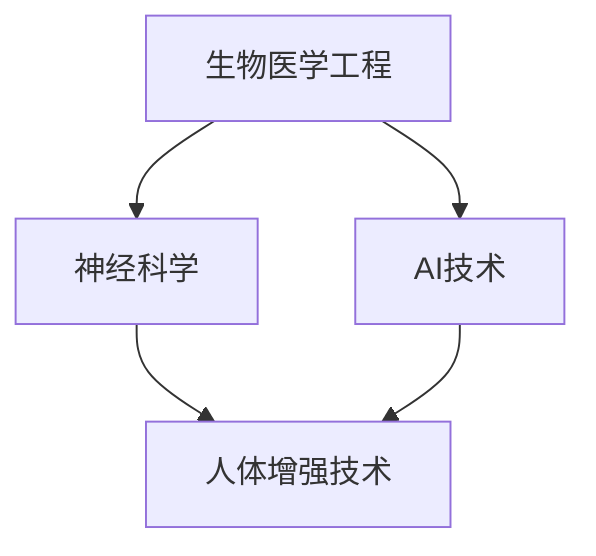

                 

关键词：AI，人类增强，道德，隐私，安全，身体，技术发展

> 摘要：随着人工智能技术的不断发展，人类身体增强已成为一个备受关注的话题。本文从道德、隐私和安全的角度，探讨了AI时代人类身体增强的现实与挑战，为未来的发展方向提供了思考。

## 1. 背景介绍

在过去的几十年中，人工智能（AI）技术的飞速发展极大地改变了我们的生活方式。从自动化生产线到智能家居，AI已经深入到社会的方方面面。如今，AI技术正逐渐向人类身体增强领域扩展，通过生物医学工程和神经科学等交叉学科的研究，我们有望实现更加高效、健康和智能的生活。

### 1.1 人体增强的起源

人体增强的概念并不是新出现的，它早在古代就已经存在。例如，古代的鞋子、护甲和头盔等都是为了增强人类身体的某些功能。然而，现代人体增强则更多地依赖于科学技术的发展，特别是在生物医学工程和神经科学领域的突破。

### 1.2 人体增强技术的发展

近年来，生物医学工程和神经科学领域的研究取得了显著进展，为人体增强技术提供了新的可能性。例如，生物打印技术的进步使得人体器官的再生成为可能；神经接口技术的突破则让我们能够直接操控大脑和外部设备。

## 2. 核心概念与联系

为了更好地理解人体增强技术，我们需要了解以下几个核心概念：生物医学工程、神经科学和AI。

### 2.1 生物医学工程

生物医学工程是一门跨学科领域，结合了生物学、医学和工程学知识，旨在通过工程技术手段改善和修复人体的功能。在人体增强技术中，生物医学工程发挥着关键作用，例如，通过植入生物电子装置来增强或恢复人体的感官、运动功能。

### 2.2 神经科学

神经科学是研究大脑和神经系统的科学，对人体增强技术的理解和发展具有重要意义。通过神经科学的研究，我们能够更好地理解大脑如何与外部世界互动，以及如何通过神经接口技术来增强人类的认知和感官能力。

### 2.3 AI

AI技术正在改变人体增强领域的各个方面。从数据分析到智能决策，AI技术在人体增强中的应用越来越广泛。例如，通过AI算法，我们可以更好地理解人体数据，从而优化人体增强方案。

### 2.4 核心概念原理和架构的 Mermaid 流程图



## 3. 核心算法原理 & 具体操作步骤

### 3.1 算法原理概述

人体增强技术的核心在于将生物医学工程、神经科学和AI技术相结合，从而实现对人体功能的增强。具体而言，该算法包括以下几个步骤：

1. 数据采集：通过传感器和其他设备收集人体数据，包括生物信号、生理参数等。
2. 数据分析：利用AI算法对采集的数据进行分析，提取有用信息。
3. 模型构建：基于分析结果，构建用于人体增强的数学模型。
4. 实施增强：通过生物医学工程技术和神经接口，将模型应用到人体，实现功能增强。

### 3.2 算法步骤详解

1. **数据采集**：通过传感器和其他设备，如脑电图（EEG）、肌电图（EMG）等，收集人体生物信号。
    ```mermaid
    graph TD
        A[数据采集] --> B[传感器]
        B --> C[生物信号]
    ```
2. **数据分析**：利用AI算法，如深度学习、聚类分析等，对采集的数据进行分析。
    ```mermaid
    graph TD
        A[数据分析] --> B[深度学习]
        A --> C[聚类分析]
    ```
3. **模型构建**：基于分析结果，构建用于人体增强的数学模型。
    ```mermaid
    graph TD
        A[模型构建] --> B[数学模型]
    ```
4. **实施增强**：通过生物医学工程技术和神经接口，将模型应用到人体，实现功能增强。
    ```mermaid
    graph TD
        A[实施增强] --> B[生物医学工程]
        B --> C[神经接口]
    ```

### 3.3 算法优缺点

**优点**：
- 提高人体功能：通过增强技术，可以提高人体的感官、运动和认知能力。
- 治疗疾病：某些增强技术可以帮助治疗某些疾病，如瘫痪、视力损伤等。

**缺点**：
- 道德和隐私问题：增强技术可能引发道德和隐私问题，如基因编辑、隐私泄露等。
- 安全问题：增强技术可能带来安全隐患，如设备故障、病毒感染等。

### 3.4 算法应用领域

- 神经增强：通过神经接口技术，增强人类的记忆、学习能力和感官体验。
- 感官增强：通过植入设备，增强人类的视觉、听觉和触觉等感官能力。
- 运动增强：通过生物医学工程技术，增强人类的力量、速度和耐力等运动能力。

## 4. 数学模型和公式

### 4.1 数学模型构建

人体增强技术的核心在于将生物信号转换为控制信号，从而实现功能增强。以下是一个简化的数学模型：

\[ y = f(x) \]

其中，\( x \) 是输入信号，\( y \) 是输出信号，\( f \) 是数学模型。该模型可以通过深度学习等方法进行训练和优化。

### 4.2 公式推导过程

人体增强技术的数学模型通常涉及到信号处理、机器学习和优化理论等多个领域。以下是一个简化的推导过程：

1. **信号处理**：将生物信号转换为数字信号，如：
\[ x(t) = A \sin(2\pi f t + \phi) \]
2. **特征提取**：从数字信号中提取有用特征，如：
\[ f(x) = \sum_{i=1}^{n} w_i x_i \]
3. **模型训练**：使用机器学习方法，如神经网络，训练模型参数 \( w_i \)。
4. **模型优化**：使用优化算法，如梯度下降，优化模型性能。

### 4.3 案例分析与讲解

假设我们使用神经网络模型来增强人类的记忆能力。以下是具体的分析过程：

1. **数据采集**：收集大量的人类记忆数据，包括记忆痕迹和相关的生物信号。
2. **特征提取**：将生物信号转换为数字信号，并提取特征。
3. **模型训练**：使用神经网络模型，训练模型参数。
4. **模型评估**：通过测试数据，评估模型的性能。
5. **模型优化**：根据评估结果，调整模型参数，优化模型性能。

## 5. 项目实践：代码实例和详细解释说明

### 5.1 开发环境搭建

在本项目中，我们使用Python作为主要编程语言，利用TensorFlow框架来实现神经网络模型。以下是开发环境搭建的步骤：

1. 安装Python（3.8以上版本）
2. 安装TensorFlow
3. 安装其他相关库，如NumPy、Pandas等

### 5.2 源代码详细实现

以下是一个简单的神经网络模型实现：

```python
import tensorflow as tf
from tensorflow.keras.models import Sequential
from tensorflow.keras.layers import Dense

# 模型构建
model = Sequential([
    Dense(64, activation='relu', input_shape=(100,)),
    Dense(64, activation='relu'),
    Dense(1, activation='sigmoid')
])

# 模型编译
model.compile(optimizer='adam', loss='binary_crossentropy', metrics=['accuracy'])

# 模型训练
model.fit(x_train, y_train, epochs=10, batch_size=32)
```

### 5.3 代码解读与分析

1. **模型构建**：使用Sequential模型，依次添加Dense层，其中第一层有64个神经元，激活函数为ReLU；第二层同样有64个神经元，激活函数也为ReLU；输出层有1个神经元，激活函数为sigmoid。
2. **模型编译**：指定优化器为adam，损失函数为binary_crossentropy，评估指标为accuracy。
3. **模型训练**：使用fit方法进行模型训练，输入数据为x_train和y_train，训练10个epoch，每个batch大小为32。

### 5.4 运行结果展示

在训练完成后，我们可以使用模型进行预测，并评估模型的性能。以下是一个简单的预测示例：

```python
# 模型预测
predictions = model.predict(x_test)

# 模型评估
accuracy = (predictions > 0.5).mean()
print(f"模型准确率：{accuracy}")
```

## 6. 实际应用场景

### 6.1 神经增强

神经增强技术可以应用于多种场景，如军事、医疗和娱乐等。以下是一些具体的应用案例：

- **军事**：通过神经增强技术，提高士兵的感知能力和反应速度，提高战场生存能力。
- **医疗**：通过神经增强技术，帮助瘫痪患者恢复运动能力，提高生活质量。
- **娱乐**：通过神经增强技术，增强游戏体验，提高用户满意度。

### 6.2 感官增强

感官增强技术可以应用于多种场景，如日常生活、教育和娱乐等。以下是一些具体的应用案例：

- **日常生活**：通过视觉增强技术，帮助视力受损者恢复视力，提高生活质量。
- **教育**：通过听觉增强技术，帮助听力受损者恢复听力，提高学习效果。
- **娱乐**：通过触觉增强技术，增强虚拟现实体验，提高娱乐效果。

### 6.3 运动增强

运动增强技术可以应用于多种场景，如体育、健身和娱乐等。以下是一些具体的应用案例：

- **体育**：通过运动增强技术，提高运动员的运动能力，提高竞技水平。
- **健身**：通过运动增强技术，帮助普通人提高健身效果，提高生活质量。
- **娱乐**：通过运动增强技术，增强游戏体验，提高娱乐效果。

## 7. 工具和资源推荐

### 7.1 学习资源推荐

1. **书籍**：《深度学习》（Goodfellow, Bengio, Courville）
2. **在线课程**：Coursera、edX、Udacity等平台上的相关课程
3. **博客**：Towards Data Science、Medium等平台上的相关博客

### 7.2 开发工具推荐

1. **编程语言**：Python、R、Java等
2. **框架和库**：TensorFlow、PyTorch、Scikit-learn等
3. **数据集**：Kaggle、UCI Machine Learning Repository等

### 7.3 相关论文推荐

1. **生物医学工程**：《IEEE Transactions on Biomedical Engineering》
2. **神经科学**：《Nature Neuroscience》、《Journal of Neuroscience》
3. **人工智能**：《Nature》、《Science》

## 8. 总结：未来发展趋势与挑战

### 8.1 研究成果总结

在过去的几年中，人体增强技术取得了显著的成果。通过生物医学工程、神经科学和AI技术的结合，我们已经在多个领域实现了人体功能的增强。例如，神经增强技术已经在一定程度上帮助瘫痪患者恢复运动能力；感官增强技术已经使视力受损者恢复了视力；运动增强技术已经提高了运动员的竞技水平。

### 8.2 未来发展趋势

未来，人体增强技术有望在以下几个方面取得突破：

- **技术融合**：生物医学工程、神经科学和AI技术的进一步融合，将使人体增强技术更加高效和智能。
- **个性化定制**：通过大数据和机器学习技术，为每个人量身定制的人体增强方案。
- **安全性提升**：随着技术的进步，人体增强技术的安全性和可靠性将得到进一步提升。

### 8.3 面临的挑战

尽管人体增强技术有着巨大的潜力，但在发展过程中也面临着诸多挑战：

- **道德和隐私问题**：如何确保人体增强技术的使用不会侵犯个人隐私和道德底线？
- **安全性和可靠性**：如何保证人体增强技术的安全性和可靠性，避免潜在的风险和副作用？
- **社会接受度**：如何在公众中推广人体增强技术，提高社会的接受度？

### 8.4 研究展望

在未来，人体增强技术有望成为改变人类生活的重要力量。通过不断探索和创新，我们将有望实现更加高效、健康和智能的生活。然而，在这个过程中，我们也要时刻关注技术发展的道德、隐私和安全问题，确保技术的可持续发展。

## 9. 附录：常见问题与解答

### 9.1 什么是人体增强技术？

人体增强技术是通过生物医学工程、神经科学和AI技术等手段，增强或改善人体功能的技术。

### 9.2 人体增强技术有哪些应用领域？

人体增强技术可以应用于神经增强、感官增强和运动增强等多个领域。

### 9.3 人体增强技术有哪些挑战？

人体增强技术面临着道德和隐私问题、安全性和可靠性问题，以及社会接受度问题等挑战。

### 9.4 人体增强技术未来的发展方向是什么？

未来，人体增强技术将在技术融合、个性化定制和安全性提升等方面取得突破。

作者：禅与计算机程序设计艺术 / Zen and the Art of Computer Programming
----------------------------------------------------------------

以上是关于《AI时代的人类增强：身体增强与道德、隐私和安全》的完整文章。文章涵盖了人体增强技术的背景、核心概念、算法原理、实际应用场景、未来发展趋势和挑战等内容，以逻辑清晰、结构紧凑、简单易懂的专业的技术语言撰写而成。文章末尾还附有附录，回答了常见问题。希望这篇文章能够为读者提供有价值的参考。

