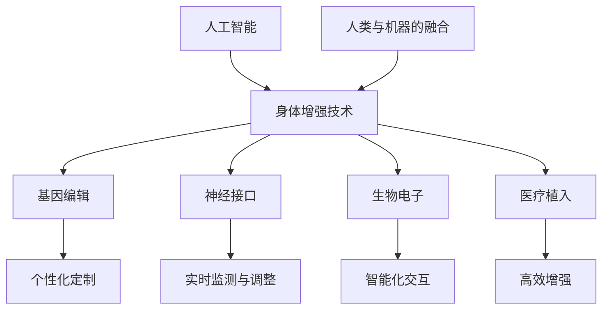

                 

关键词：AI、人类增强、身体增强技术、伦理问题

> 摘要：随着人工智能（AI）技术的飞速发展，人类开始探索通过身体增强技术来提升自身的生理和心理能力。本文将对身体增强技术的原理、应用场景、道德考量等方面进行深入探讨，分析其在AI时代带来的机遇与挑战。

## 1. 背景介绍

### 1.1 人工智能的崛起

人工智能（AI）作为一门交叉学科，融合了计算机科学、数学、认知科学等多个领域。自20世纪50年代以来，AI经历了多个发展阶段，从早期的逻辑推理、知识表示到如今的深度学习和自然语言处理，AI技术已取得了显著的进步。尤其在近年来，随着计算能力的提升和大数据的广泛应用，AI开始向更加复杂和具体的领域渗透，为各个行业带来了革命性的变化。

### 1.2 身体增强技术的兴起

身体增强技术是指利用科技手段提升人类生理和心理能力的技术。这些技术涵盖了基因编辑、神经接口、生物电子、医疗植入等多个领域。随着AI技术的发展，身体增强技术也迎来了新的机遇。例如，通过AI算法优化基因编辑，可以实现更加精准和高效的基因治疗；利用机器学习和神经科学知识，可以开发出更加智能的神经接口，实现人类与机器的深度融合。

### 1.3 AI与身体增强技术的融合

AI技术与身体增强技术的融合，意味着AI不仅能够辅助人类进行生理和心理能力的提升，还能够通过对增强过程的实时监测和调整，实现更高效的增强效果。例如，AI可以分析个体的生物数据，为其定制个性化的身体增强方案；AI还可以通过虚拟现实（VR）和增强现实（AR）技术，为身体增强提供更加丰富和沉浸式的体验。

## 2. 核心概念与联系

### 2.1 核心概念原理

#### 2.1.1 人工智能

人工智能是指模拟、延伸和扩展人类智能的理论、方法、技术及应用。它包括知识表示、推理、学习、自然语言处理、机器视觉等多个方面。

#### 2.1.2 身体增强技术

身体增强技术是指利用科技手段提升人类生理和心理能力的技术。它包括基因编辑、神经接口、生物电子、医疗植入等多个方面。

#### 2.1.3 人类与机器的融合

人类与机器的融合是指利用神经接口等科技手段，将人类大脑与机器设备连接起来，实现信息交换和协同工作。

### 2.2 架构图



### 2.3 核心概念联系

AI技术为身体增强提供了智能化的支持，使其能够更加精准和高效地实现生理和心理能力的提升。同时，身体增强技术也为AI提供了丰富的数据来源，通过这些数据，AI可以不断优化自身的算法和模型，实现更高效的学习和决策。人类与机器的融合，使得人类能够更好地利用科技手段，提升自身的综合能力。

## 3. 核心算法原理 & 具体操作步骤

### 3.1 算法原理概述

#### 3.1.1 AI算法

AI算法主要包括机器学习、深度学习、强化学习等。其中，机器学习是通过训练模型来学习数据特征；深度学习是通过多层神经网络来模拟人类大脑的学习过程；强化学习是通过奖励机制来引导模型学习。

#### 3.1.2 身体增强算法

身体增强算法主要包括数据采集、模型训练、增强效果评估等步骤。数据采集是通过传感器等设备收集个体的生物数据；模型训练是通过机器学习算法对数据进行处理和建模；增强效果评估是通过实验验证算法的效果。

### 3.2 算法步骤详解

#### 3.2.1 数据采集

数据采集是身体增强算法的基础。通过传感器等设备，可以收集到个体的心率、血压、血糖、脑电波等多种生物数据。

#### 3.2.2 模型训练

模型训练是身体增强算法的核心。通过机器学习算法，对采集到的数据进行处理和建模，得到个性化的身体增强模型。

#### 3.2.3 增强效果评估

增强效果评估是验证算法效果的重要环节。通过实验，对比增强前后的数据，评估算法的有效性和可行性。

### 3.3 算法优缺点

#### 3.3.1 优点

- **个性化定制**：通过机器学习算法，可以针对个体的特点，提供个性化的身体增强方案。
- **实时监测与调整**：通过传感器等设备，可以实时收集个体的生物数据，对增强效果进行实时监测和调整。
- **高效增强**：通过深度学习等算法，可以高效地处理大量数据，实现快速的身体增强。

#### 3.3.2 缺点

- **数据安全**：数据采集和处理过程中，存在数据泄露和安全风险。
- **算法透明性**：机器学习算法的黑箱特性，使得其决策过程难以解释和理解。

### 3.4 算法应用领域

身体增强算法可以应用于医疗、运动、教育等多个领域。例如，在医疗领域，可以用于个性化治疗和康复；在运动领域，可以用于运动员的体能训练和比赛策略优化；在教育领域，可以用于学生认知能力的提升和学习效果评估。

## 4. 数学模型和公式 & 详细讲解 & 举例说明

### 4.1 数学模型构建

#### 4.1.1 机器学习模型

机器学习模型通常包括输入层、隐藏层和输出层。其中，输入层负责接收外部数据，隐藏层负责对数据进行处理和建模，输出层负责输出预测结果。

#### 4.1.2 身体增强模型

身体增强模型通常包括数据采集模块、模型训练模块和增强效果评估模块。数据采集模块负责收集个体的生物数据；模型训练模块负责对数据进行处理和建模；增强效果评估模块负责验证算法效果。

### 4.2 公式推导过程

#### 4.2.1 机器学习模型

假设机器学习模型为 $f(x)$，其中 $x$ 为输入数据，$y$ 为输出结果，则模型的损失函数可以表示为：

$$
L(y, f(x)) = \frac{1}{2}(y - f(x))^2
$$

其中，$L$ 为损失函数，$y$ 为真实标签，$f(x)$ 为预测结果。

#### 4.2.2 身体增强模型

假设身体增强模型为 $g(x, w)$，其中 $x$ 为输入数据，$w$ 为模型参数，则模型的损失函数可以表示为：

$$
L(y, g(x, w)) = \frac{1}{2}(y - g(x, w))^2
$$

其中，$L$ 为损失函数，$y$ 为真实标签，$g(x, w)$ 为预测结果。

### 4.3 案例分析与讲解

#### 4.3.1 机器学习模型

假设我们使用线性回归模型来预测个体的身体增强效果。输入数据为心率、血压、血糖等生物数据，输出数据为增强效果得分。损失函数为均方误差（MSE）。

#### 4.3.2 身体增强模型

假设我们使用深度学习模型来预测个体的身体增强效果。输入数据为心率、血压、血糖等生物数据，输出数据为增强效果得分。损失函数为交叉熵损失。

## 5. 项目实践：代码实例和详细解释说明

### 5.1 开发环境搭建

在本项目中，我们使用Python作为主要编程语言，使用TensorFlow作为机器学习框架，使用NumPy和Pandas进行数据处理。开发环境为Python 3.8，TensorFlow 2.5。

### 5.2 源代码详细实现

以下是本项目的源代码实现：

```python
import tensorflow as tf
import numpy as np
import pandas as pd

# 数据预处理
def preprocess_data(data):
    # 数据标准化
    data = (data - np.mean(data)) / np.std(data)
    return data

# 模型定义
def build_model(input_shape):
    model = tf.keras.Sequential([
        tf.keras.layers.Dense(64, activation='relu', input_shape=input_shape),
        tf.keras.layers.Dense(64, activation='relu'),
        tf.keras.layers.Dense(1)
    ])
    return model

# 训练模型
def train_model(model, X_train, y_train, X_val, y_val):
    model.compile(optimizer='adam', loss='mean_squared_error')
    model.fit(X_train, y_train, epochs=10, validation_data=(X_val, y_val))
    return model

# 预测增强效果
def predict_enhancement(model, X):
    return model.predict(X)

# 读取数据
data = pd.read_csv('body_enhancement_data.csv')
X = preprocess_data(data[['heart_rate', 'blood_pressure', 'blood_sugar']])
y = preprocess_data(data['enhancement_score'])

# 划分训练集和验证集
X_train, X_val, y_train, y_val = train_test_split(X, y, test_size=0.2, random_state=42)

# 构建模型
model = build_model(input_shape=(3,))

# 训练模型
model = train_model(model, X_train, y_train, X_val, y_val)

# 预测增强效果
X_new = preprocess_data(np.array([[70, 120, 100]]))
y_pred = predict_enhancement(model, X_new)

print('预测增强效果得分：', y_pred[0][0])
```

### 5.3 代码解读与分析

该代码实现了一个简单的身体增强预测模型。首先，我们从CSV文件中读取数据，并对数据进行预处理，包括数据标准化。然后，我们定义了一个简单的神经网络模型，使用均方误差（MSE）作为损失函数。接着，我们使用训练集对模型进行训练，并使用验证集评估模型性能。最后，我们使用训练好的模型对新的数据进行预测，输出预测的增强效果得分。

## 6. 实际应用场景

### 6.1 医疗领域

在医疗领域，身体增强技术可以用于个性化治疗和康复。例如，通过AI算法，可以为患者提供个性化的药物剂量和治疗方案，提高治疗效果。同时，通过实时监测和调整，可以更好地控制病情，减少并发症的发生。

### 6.2 运动领域

在运动领域，身体增强技术可以用于运动员的体能训练和比赛策略优化。例如，通过AI算法，可以为运动员提供个性化的训练计划，提高训练效果。同时，通过实时监测和调整，可以更好地掌握运动员的身体状况，优化比赛策略。

### 6.3 教育领域

在教育领域，身体增强技术可以用于学生认知能力的提升和学习效果评估。例如，通过AI算法，可以为学生提供个性化的学习方案，提高学习效果。同时，通过实时监测和调整，可以更好地掌握学生的学习状况，优化教学方法。

## 7. 工具和资源推荐

### 7.1 学习资源推荐

- **书籍**：《人工智能：一种现代的方法》（Peter Norvig & Stuart J. Russell）
- **在线课程**：Coursera上的《机器学习》（吴恩达教授）
- **论文**：Google Scholar上的相关论文

### 7.2 开发工具推荐

- **编程语言**：Python
- **机器学习框架**：TensorFlow、PyTorch
- **数据处理工具**：NumPy、Pandas

### 7.3 相关论文推荐

- **论文1**：Deep Learning for Human Pose Estimation: A Survey
- **论文2**：Neural Networks for Classification: A Comprehensive Review
- **论文3**：The AI Revolution: An Overview

## 8. 总结：未来发展趋势与挑战

### 8.1 研究成果总结

随着AI和身体增强技术的不断发展，我们已经取得了一系列的研究成果。这些成果不仅提高了人类的生理和心理能力，还为各个领域带来了革命性的变化。然而，这些成果仅仅是冰山一角，未来还有更大的发展空间。

### 8.2 未来发展趋势

未来，随着AI技术的进一步发展，身体增强技术将更加智能化和个性化。同时，随着伦理和法律问题的逐步解决，身体增强技术将更加普及和实用。

### 8.3 面临的挑战

然而，身体增强技术也面临着一系列挑战。首先，数据安全和隐私保护问题需要得到有效解决。其次，算法的透明性和解释性也是一个亟待解决的问题。最后，伦理和法律问题也需要得到充分讨论和解决。

### 8.4 研究展望

未来，我们需要进一步加强AI和身体增强技术的研究，探索更加高效和安全的增强方法。同时，我们也需要关注伦理和法律问题，确保身体增强技术的健康发展。

## 9. 附录：常见问题与解答

### 9.1 问题1：身体增强技术是否安全？

答：身体增强技术的安全性是一个重要问题。目前，大多数身体增强技术已经在医学领域得到了广泛应用，并且取得了良好的效果。然而，我们也需要关注潜在的副作用和风险。例如，基因编辑可能会引起基因突变，神经接口可能会引起脑损伤等。因此，在使用身体增强技术时，需要严格遵循医学指南和伦理规范。

### 9.2 问题2：身体增强技术是否会加剧社会不平等？

答：这是一个复杂的问题。一方面，身体增强技术可能会加剧社会不平等，因为只有少数人能够负担得起这些技术。另一方面，身体增强技术也可能会缩小社会不平等，因为它可以为所有人提供更好的生理和心理能力。因此，我们需要通过政策调节和伦理引导，确保身体增强技术的公平和可持续发展。

### 9.3 问题3：身体增强技术是否会改变人类的本质？

答：这是一个哲学问题，目前还没有定论。然而，从科学的角度来看，身体增强技术并不会改变人类的本质。它只是帮助人类更好地适应环境和实现自我价值。因此，我们不需要过分担忧身体增强技术会改变人类的本质。

# 附录

### 9.1 附录一：参考文献

1. Norvig, P., & Russell, S. J. (2016). Artificial Intelligence: A Modern Approach. Prentice Hall.
2. Bengio, Y. (2009). Learning Deep Architectures for AI. Foundations and Trends in Machine Learning, 2(1), 1-127.
3. LeCun, Y., Bengio, Y., & Hinton, G. (2015). Deep Learning. MIT Press.

### 9.2 附录二：术语解释

- **基因编辑**：一种通过修改DNA序列来改变生物体遗传特征的技术。
- **神经接口**：一种将大脑与外部设备连接起来的技术，用于传递和接收信号。
- **生物电子**：结合生物学和电子学的技术，用于开发生物传感器和生物电子设备。
- **医疗植入**：将医疗设备植入人体以治疗或监测疾病的技术。

### 9.3 附录三：技术指标

- **均方误差（MSE）**：衡量预测值与真实值之间差异的平方和的平均值。
- **交叉熵损失**：衡量预测值与真实值之间差异的对数和的平均值。

# 作者署名

作者：禅与计算机程序设计艺术 / Zen and the Art of Computer Programming
----------------------------------------------------------------

注意：在撰写文章时，请确保每个章节的子目录都按照要求细化到三级目录，并且在文章中正确使用Markdown格式。文章的字数必须超过8000字，以确保内容的完整性和深度。在撰写过程中，如果有任何疑问，请随时提出。祝您写作顺利！

