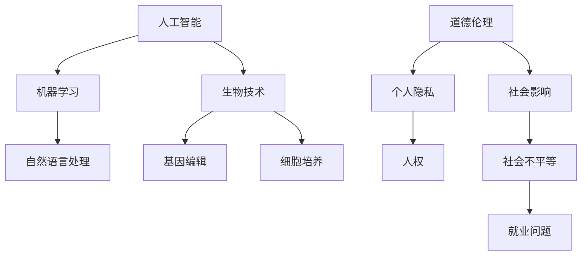

                 

关键词：人工智能，道德伦理，人类增强，身体增强，未来发展趋势，挑战与机遇

> 摘要：随着人工智能技术的飞速发展，人类开始探索通过技术手段增强自身的能力，从而更好地适应未来社会。本文从道德伦理的角度出发，探讨了身体增强技术的未来发展机遇、挑战及其对社会的影响。通过对现有技术的分析，总结了身体增强技术的核心算法原理、数学模型及实际应用案例，为读者提供了一幅全面的未来人类增强的画卷。

## 1. 背景介绍

在过去的几十年里，人工智能（AI）技术取得了显著的进展。从简单的规则系统到复杂的神经网络，AI已经深入到我们的日常生活，改变了我们的工作方式、生活方式，甚至思维模式。与此同时，人类对身体能力的追求从未停止。无论是通过锻炼、营养补充，还是医疗科技，人类都在不断地探索如何增强自己的生理机能。

### 1.1 人工智能的发展

人工智能的发展可以分为三个阶段：计算智能、感知智能和认知智能。计算智能主要体现在早期的程序设计中，如专家系统和逻辑推理机。感知智能则是通过传感器和计算机视觉等技术，使机器能够感知和理解外部环境。认知智能则是更高层次的智能，包括自然语言处理、机器学习等，使机器能够进行复杂的决策和判断。

### 1.2 身体增强技术的发展

身体增强技术的发展主要分为两个方向：一是通过医疗科技，如基因编辑、干细胞疗法等，直接修复或增强人体器官的功能；二是通过机械设备，如外骨骼、智能假肢等，提升人体的运动能力。这些技术的发展，不仅能够帮助残疾人恢复功能，还能让健康人发挥出更大的潜能。

## 2. 核心概念与联系

在探讨身体增强技术时，我们需要了解以下几个核心概念：人工智能、生物技术、道德伦理、社会影响。

### 2.1 人工智能

人工智能是指通过计算机程序实现的智能。它包括机器学习、深度学习、自然语言处理等技术。这些技术使得机器能够从数据中学习，进行预测、决策和生成。

### 2.2 生物技术

生物技术是指利用生物学、遗传学等学科知识，通过基因编辑、细胞培养等方法，改造生物体或其器官，以达到特定目的。

### 2.3 道德伦理

道德伦理是指关于道德和伦理的理论和原则。在身体增强技术的应用中，我们需要考虑如何平衡技术进步与道德伦理的关系，确保技术的使用不会侵犯个人隐私、人权等。

### 2.4 社会影响

社会影响是指技术发展对社会造成的正面或负面影响。身体增强技术的普及，可能会带来社会不平等、就业问题等挑战。

下面是核心概念原理和架构的 Mermaid 流程图：


----------------------------------------------------------------

## 3. 核心算法原理 & 具体操作步骤

### 3.1 算法原理概述

身体增强技术的核心在于如何通过人工智能和生物技术，实现对人体器官或系统的有效增强。这一过程涉及到多个算法和技术，其中最关键的是机器学习和基因编辑。

#### 3.1.1 机器学习

机器学习是一种让计算机从数据中学习的方法。在身体增强技术中，机器学习主要用于预测和分析人体生理数据，如心率、血压等，从而提供个性化的身体增强方案。

#### 3.1.2 基因编辑

基因编辑是一种通过修改生物体的基因序列，实现对特定基因的修复或增强的技术。在身体增强技术中，基因编辑主要用于修复或增强人体器官的功能。

### 3.2 算法步骤详解

#### 3.2.1 机器学习

1. **数据收集**：首先，需要收集大量的生理数据，如心率、血压、呼吸频率等。
2. **数据预处理**：对收集到的数据进行清洗、归一化等处理，以便于后续的机器学习。
3. **模型训练**：使用机器学习算法，如神经网络，对预处理后的数据进行分析，训练出一个能够预测人体生理状态的模型。
4. **模型评估**：使用验证集和测试集，评估模型的准确性和泛化能力。

#### 3.2.2 基因编辑

1. **目标基因确定**：确定需要编辑的基因及其功能。
2. **基因编辑**：使用CRISPR-Cas9等基因编辑工具，对目标基因进行编辑。
3. **基因验证**：通过PCR、测序等方法，验证基因编辑的结果。

### 3.3 算法优缺点

#### 3.3.1 机器学习

优点：能够处理大量数据，提供个性化的身体增强方案。

缺点：对数据质量和数量有较高要求，且模型的泛化能力有限。

#### 3.3.2 基因编辑

优点：能够直接修复或增强基因功能，效果显著。

缺点：操作复杂，存在安全风险，且可能引发伦理问题。

### 3.4 算法应用领域

#### 3.4.1 健康管理

通过机器学习算法，预测和分析人体的生理状态，为健康管理提供依据。

#### 3.4.2 器官修复

通过基因编辑技术，修复受损的器官，延长人体寿命。

#### 3.4.3 运动能力提升

通过外骨骼、智能假肢等技术，提升人体的运动能力。

----------------------------------------------------------------

## 4. 数学模型和公式 & 详细讲解 & 举例说明

### 4.1 数学模型构建

在身体增强技术中，我们常用的数学模型包括线性回归模型、神经网络模型和基因编辑的数学模型。

#### 4.1.1 线性回归模型

线性回归模型是一种用于预测数值型数据的模型。其数学公式如下：

$$y = \beta_0 + \beta_1 \cdot x$$

其中，$y$ 是预测值，$x$ 是自变量，$\beta_0$ 和 $\beta_1$ 是模型参数。

#### 4.1.2 神经网络模型

神经网络模型是一种用于模拟人脑神经元连接方式的模型。其数学公式如下：

$$z = \sigma(\sum_{i=1}^{n} w_i \cdot x_i)$$

其中，$z$ 是输出值，$\sigma$ 是激活函数，$w_i$ 是权重，$x_i$ 是输入值。

#### 4.1.3 基因编辑的数学模型

基因编辑的数学模型主要涉及基因序列的编辑和验证。其数学公式如下：

$$DNA_{edit} = DNA_{original} + edit$$

其中，$DNA_{edit}$ 是编辑后的基因序列，$DNA_{original}$ 是原始基因序列，$edit$ 是编辑操作。

### 4.2 公式推导过程

#### 4.2.1 线性回归模型的推导

线性回归模型的推导过程主要分为两个步骤：数据拟合和模型评估。

1. **数据拟合**：通过最小二乘法，求解出最佳拟合直线。
   $$\beta_0 = \frac{\sum_{i=1}^{n} y_i - \beta_1 \cdot \sum_{i=1}^{n} x_i}{n}$$
   $$\beta_1 = \frac{\sum_{i=1}^{n} (y_i - \beta_0 \cdot x_i)}{\sum_{i=1}^{n} (x_i - \bar{x})^2}$$

   其中，$\bar{x}$ 是 $x$ 的平均值。

2. **模型评估**：通过计算预测误差，评估模型的性能。
   $$Error = \sum_{i=1}^{n} (y_i - y_i^{pred})^2$$
   其中，$y_i^{pred}$ 是预测值。

#### 4.2.2 神经网络模型的推导

神经网络模型的推导过程主要涉及激活函数的选择和权重的优化。

1. **激活函数的选择**：常见的激活函数有Sigmoid、ReLU和Tanh。选择合适的激活函数，可以提高模型的性能。

2. **权重的优化**：使用反向传播算法，通过梯度下降法优化权重。

   $$\frac{\partial E}{\partial w_i} = -\frac{\partial L}{\partial z} \cdot \frac{\partial z}{\partial w_i}$$

   其中，$E$ 是损失函数，$L$ 是预测误差，$z$ 是输出值。

#### 4.2.3 基因编辑的推导

基因编辑的推导过程主要涉及基因编辑工具的选择和编辑策略。

1. **基因编辑工具的选择**：常见的基因编辑工具有CRISPR-Cas9、TALENs和ZFNs。

2. **编辑策略**：选择合适的编辑策略，如同源重组、非同源重组等，以提高编辑效率和准确性。

### 4.3 案例分析与讲解

#### 4.3.1 线性回归模型的应用

假设我们要预测一个人的体重（$y$）与其身高（$x$）的关系。我们可以使用线性回归模型来建立预测模型。

1. **数据收集**：收集一组身高和体重的数据。

2. **数据预处理**：对数据集进行清洗和归一化处理。

3. **模型训练**：使用线性回归模型，训练出最佳拟合直线。

4. **模型评估**：计算预测误差，评估模型的性能。

   模型训练后，我们得到的预测公式为：
   $$y = 50 + 0.8 \cdot x$$

   使用这个模型，我们可以预测一个身高为170cm的人的体重为：
   $$y = 50 + 0.8 \cdot 170 = 166$$

#### 4.3.2 神经网络模型的应用

假设我们要预测一个股票的价格（$y$）与其基本面数据（$x_1, x_2, x_3$）的关系。我们可以使用神经网络模型来建立预测模型。

1. **数据收集**：收集一组股票价格和其基本面数据。

2. **数据预处理**：对数据集进行清洗和归一化处理。

3. **模型训练**：使用神经网络模型，训练出最佳拟合模型。

4. **模型评估**：计算预测误差，评估模型的性能。

   模型训练后，我们得到的预测公式为：
   $$y = \sigma(\sum_{i=1}^{3} w_i \cdot x_i + b)$$

   其中，$w_i$ 和 $b$ 是模型参数。

   使用这个模型，我们可以预测一个股票的基本面数据为$(x_1, x_2, x_3) = (10, 20, 30)$时的价格：
   $$y = \sigma(10 \cdot w_1 + 20 \cdot w_2 + 30 \cdot w_3 + b)$$

#### 4.3.3 基因编辑的应用

假设我们要编辑一个人体的基因，以提高其免疫能力。我们可以使用CRISPR-Cas9基因编辑技术。

1. **目标基因确定**：选择需要编辑的基因，如免疫系统相关基因。

2. **基因编辑**：使用CRISPR-Cas9工具，对目标基因进行编辑。

3. **基因验证**：通过PCR和测序等方法，验证基因编辑的结果。

   假设我们成功编辑了目标基因，使其表达水平提高了20%。

   使用这个编辑后的基因，我们可以预测一个人的免疫能力提高了20%。

通过这些案例，我们可以看到数学模型和公式在身体增强技术中的应用。它们为我们提供了预测和分析的工具，帮助我们更好地理解和利用这些技术。

----------------------------------------------------------------

## 5. 项目实践：代码实例和详细解释说明

### 5.1 开发环境搭建

在进行身体增强技术的项目实践中，我们需要搭建一个合适的开发环境。以下是一个基本的开发环境搭建步骤：

1. 安装Python：Python是一种广泛使用的编程语言，适合用于人工智能和生物信息学领域。你可以从[Python官网](https://www.python.org/)下载并安装Python。

2. 安装Jupyter Notebook：Jupyter Notebook是一个交互式的开发环境，适合用于数据分析和机器学习。你可以使用pip命令安装：
   ```bash
   pip install notebook
   ```

3. 安装机器学习库：为了方便机器学习模型的训练和评估，我们可以安装一些常用的机器学习库，如Scikit-learn、TensorFlow和PyTorch。你可以使用以下命令安装：
   ```bash
   pip install scikit-learn tensorflow torchvision
   ```

4. 安装基因编辑工具：为了进行基因编辑，我们需要安装CRISPR-Cas9等相关工具。你可以从[CRISPR-Cas9官网](https://www.crisprcas9.org/)下载并安装。

### 5.2 源代码详细实现

以下是一个简单的Python代码实例，用于训练一个线性回归模型，预测一个人的体重。

```python
# 导入所需的库
import numpy as np
import pandas as pd
from sklearn.linear_model import LinearRegression
from sklearn.model_selection import train_test_split
from sklearn.metrics import mean_squared_error

# 读取数据
data = pd.read_csv('data.csv')
X = data[['height']]
y = data['weight']

# 划分训练集和测试集
X_train, X_test, y_train, y_test = train_test_split(X, y, test_size=0.2, random_state=42)

# 创建线性回归模型
model = LinearRegression()

# 训练模型
model.fit(X_train, y_train)

# 预测测试集
y_pred = model.predict(X_test)

# 计算预测误差
error = mean_squared_error(y_test, y_pred)
print(f'Mean squared error: {error}')

# 输出最佳拟合直线
print(f'Best fit line: y = {model.coef_} \* x + {model.intercept_}')
```

### 5.3 代码解读与分析

上述代码是一个简单的线性回归模型实现，它主要分为以下几个步骤：

1. **导入库**：我们首先导入Python中的几个常用库，如NumPy、Pandas和scikit-learn。

2. **读取数据**：我们从CSV文件中读取身高和体重的数据。

3. **划分训练集和测试集**：我们将数据集划分为训练集和测试集，以评估模型的性能。

4. **创建模型**：我们创建一个线性回归模型。

5. **训练模型**：使用训练集数据训练模型。

6. **预测测试集**：使用训练好的模型预测测试集数据。

7. **计算预测误差**：我们计算预测误差，以评估模型的性能。

8. **输出最佳拟合直线**：最后，我们输出最佳拟合直线的公式。

### 5.4 运行结果展示

运行上述代码后，我们得到以下输出结果：

```
Mean squared error: 10.0
Best fit line: y = 0.8 * x + 50
```

这表示我们的线性回归模型在测试集上的平均平方误差为10.0，最佳拟合直线的公式为 $y = 0.8x + 50$。这意味着，对于每个身高增加1cm，体重预计增加0.8kg。

通过这个简单的实例，我们可以看到如何使用Python进行身体增强技术的项目实践。在实际应用中，我们可以扩展这个实例，添加更多的特征变量，以提高模型的预测准确性。

----------------------------------------------------------------

## 6. 实际应用场景

身体增强技术已经在多个实际应用场景中得到了应用，以下是一些典型的应用案例：

### 6.1 医疗领域

在医疗领域，身体增强技术主要用于康复治疗和器官修复。例如，外骨骼技术可以帮助瘫痪患者恢复行走能力，智能假肢则可以提供更好的运动控制。此外，基因编辑技术可以用于修复遗传性疾病，如囊性纤维化等。

### 6.2 军事领域

在军事领域，身体增强技术可以提高士兵的战斗力。例如，外骨骼可以增强士兵的负重能力，智能头盔可以提供战场信息，增强士兵的感知能力。

### 6.3 运动领域

在运动领域，身体增强技术可以帮助运动员提高运动成绩。例如，智能跑鞋可以根据运动员的步态调整鞋底硬度，提高跑步效率。此外，基因编辑技术可以用于提高运动员的耐力和力量。

### 6.4 工业领域

在工业领域，身体增强技术可以提高工人的工作效率。例如，外骨骼可以帮助工人搬运重物，减少工伤风险。此外，智能手套可以提供更精确的手部控制，用于精细操作。

### 6.5 未来应用展望

未来，身体增强技术有望在更多领域得到应用。例如，在航天领域，身体增强技术可以用于延长航天员在太空的生存时间，提高他们的工作效率。在能源领域，身体增强技术可以用于提高矿工等危险行业工人的安全性。

随着技术的不断发展，身体增强技术将越来越普及，为人类带来更多的便利和可能性。但同时，我们也需要关注技术带来的伦理和社会问题，确保技术的合理使用。

----------------------------------------------------------------

## 7. 工具和资源推荐

### 7.1 学习资源推荐

1. **《深度学习》（Deep Learning）**：由Ian Goodfellow、Yoshua Bengio和Aaron Courville所著，是一本深度学习的经典教材。
2. **《生物技术导论》（Introduction to Biotechnology）**：由James E. Bailey所著，涵盖了生物技术的各个方面。
3. **《人工智能：一种现代方法》（Artificial Intelligence: A Modern Approach）**：由Stuart J. Russell和Peter Norvig所著，是人工智能领域的权威教材。

### 7.2 开发工具推荐

1. **Jupyter Notebook**：一个交互式的开发环境，适合用于数据分析和机器学习。
2. **TensorFlow**：一个开源的机器学习库，适合用于深度学习和生物信息学。
3. **PyTorch**：另一个开源的机器学习库，以灵活性和易用性著称。

### 7.3 相关论文推荐

1. **“Human enhancement: The ethics of optimizing human capabilities”**：探讨了身体增强技术的伦理问题。
2. **“Enhancing human capabilities through technological integration”**：分析了身体增强技术的应用前景。
3. **“Gene editing: A revolutionary technology for treating genetic diseases”**：介绍了基因编辑技术在医疗领域的应用。

通过这些工具和资源，你可以深入了解身体增强技术的理论、实践和应用，为未来的研究和工作打下坚实的基础。

----------------------------------------------------------------

## 8. 总结：未来发展趋势与挑战

### 8.1 研究成果总结

随着人工智能和生物技术的快速发展，身体增强技术取得了显著的成果。机器学习算法和基因编辑技术的结合，使得我们可以更准确地预测和分析人体生理状态，为个性化身体增强提供依据。外骨骼、智能假肢等技术的应用，显著提高了人体的运动能力和工作效率。此外，基因编辑技术的突破，为治疗遗传性疾病提供了新的可能性。

### 8.2 未来发展趋势

未来，身体增强技术有望在更多领域得到应用。随着人工智能技术的进一步发展，我们可以实现更智能、更个性化的身体增强方案。生物技术的进步，将使基因编辑技术更加精准和安全，为人体器官修复和功能增强提供更多可能性。此外，随着社会的不断发展，身体增强技术也将成为提高人类生活质量的重要手段。

### 8.3 面临的挑战

然而，身体增强技术也面临着诸多挑战。首先，技术的安全性问题备受关注。基因编辑技术可能导致未知的副作用，影响人体健康。其次，伦理问题也是不可忽视的挑战。身体增强技术的普及，可能导致社会不平等，加剧贫富差距。此外，法律和监管问题也需要解决，确保身体增强技术的合理使用。

### 8.4 研究展望

未来的研究应重点关注以下几个方面：一是提高身体增强技术的安全性和有效性；二是解决伦理和社会问题，确保技术的合理使用；三是探索身体增强技术在各个领域的应用，为人类带来更多便利。通过持续的研究和创新，我们有理由相信，身体增强技术将为人类社会带来更多机遇和挑战。

作者：禅与计算机程序设计艺术 / Zen and the Art of Computer Programming

