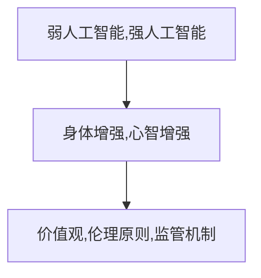

                 

关键词：人工智能，人类增强，道德考虑，身体增强，未来展望

> 摘要：随着人工智能技术的发展，人类开始探索如何通过增强技术提升自身的身体和心智能力。本文从道德和社会影响的视角出发，探讨人类增强的可能路径，并提出未来发展策略与展望。本文旨在为人工智能领域的实践者和研究者提供有价值的参考，以推动人类增强技术的道德发展和可持续进步。

## 1. 背景介绍

### 1.1 人工智能与人类增强

人工智能（Artificial Intelligence, AI）是指由人制造出来的系统能够表现出的智能行为。随着深度学习、神经网络、自然语言处理等技术的迅猛发展，人工智能已经在各个领域展现出了强大的能力。与此同时，人类开始思考如何利用人工智能技术来增强自身的能力，从而实现人类与技术的深度融合。

人类增强（Human Augmentation）是指通过技术手段提高人类身体和心智能力的过程。身体增强（Physical Augmentation）主要涉及身体各部位的功能改善，如增强肌肉力量、提高耐力、改善视力等。心智增强（Cognitive Augmentation）则着重于提高大脑的记忆力、注意力、决策能力等认知功能。

### 1.2 道德考虑的重要性

在人类增强技术的快速发展过程中，道德考虑变得至关重要。道德是人类行为和决策的基石，关系到人类的尊严、自由和幸福。在人类增强技术中，道德问题主要体现在以下几个方面：

- **隐私保护**：人类增强技术可能会收集和存储大量的个人生物数据，如何保护用户的隐私成为一个重要的道德议题。
- **公平性**：人类增强技术的普及可能导致社会阶层差距加大，如何确保技术对所有人的公平性需要深入思考。
- **身体完整性**：人类增强技术可能会改变人类的身体结构，如何尊重个体的身体完整性成为一个重要的道德问题。

## 2. 核心概念与联系

在讨论人类增强技术的道德考虑时，以下几个核心概念和联系是至关重要的：

### 2.1 人工智能技术分类

人工智能技术可以分为两大类：弱人工智能（Narrow AI）和强人工智能（General AI）。弱人工智能是指只能在特定领域表现人类智能的技术，如语音识别、图像识别等。强人工智能则是指具有全面智能的技术，能够理解和执行各种复杂的任务，与人类的智能相当。

### 2.2 人类增强技术分类

人类增强技术可以根据增强的目标和方式分为两大类：身体增强和心智增强。

- **身体增强**：包括基因编辑、生物材料、神经接口等技术，旨在改善人体器官的功能和性能。
- **心智增强**：包括认知训练、脑机接口、增强现实等技术，旨在提高大脑的认知能力和工作效率。

### 2.3 道德考虑的架构

道德考虑的架构包括以下几个方面：

- **价值观**：确定人类增强技术的价值取向，如尊重生命、追求公平等。
- **伦理原则**：制定人类增强技术的伦理准则，如隐私保护、公平性等。
- **监管机制**：建立人类增强技术的监管体系，确保技术发展符合道德和社会规范。

### 2.4 Mermaid 流程图



## 3. 核心算法原理 & 具体操作步骤

### 3.1 算法原理概述

人类增强技术的核心算法主要包括以下几个方面：

- **基因编辑**：利用CRISPR-Cas9等基因编辑技术，精确修改人体基因序列，以改善身体功能。
- **神经接口**：通过植入式设备直接与大脑神经元连接，实现脑机交互，提高心智能力。
- **认知训练**：利用计算机模拟和虚拟现实技术，进行个性化认知训练，提高大脑认知能力。

### 3.2 算法步骤详解

#### 3.2.1 基因编辑

1. **目标基因定位**：利用高通量测序技术确定目标基因的位置。
2. **基因编辑**：利用CRISPR-Cas9等基因编辑技术，在目标基因处进行切割和修改。
3. **基因修复**：利用同源重组等修复机制，将修改后的基因插入到正确位置。

#### 3.2.2 神经接口

1. **神经探针设计**：设计具有高分辨率和高灵敏度的神经探针。
2. **植入手术**：在患者头部进行手术，将神经探针植入到大脑特定区域。
3. **数据采集**：通过神经探针采集大脑神经元的活动数据。
4. **脑机交互**：将采集到的数据转化为电信号，实现大脑与外部设备之间的交互。

#### 3.2.3 认知训练

1. **训练任务设计**：根据个体差异设计个性化的认知训练任务。
2. **虚拟现实环境**：构建虚拟现实环境，模拟各种认知场景。
3. **训练过程**：在虚拟现实环境中进行认知训练，收集训练数据。
4. **评估与优化**：根据训练数据评估训练效果，优化训练策略。

### 3.3 算法优缺点

#### 基因编辑

**优点**：

- 精准高效：能够精确修改人体基因序列，实现目标功能的改善。
- 长期效果：基因编辑的效果可能具有长期稳定性。

**缺点**：

- 安全性风险：基因编辑可能导致不可预测的副作用和遗传突变。
- 技术难度：基因编辑技术要求高精度和高效率，技术难度较大。

#### 神经接口

**优点**：

- 实时性：能够实时采集大脑神经元活动数据，实现快速脑机交互。
- 灵活性：可以通过调整神经接口参数，实现不同功能的增强。

**缺点**：

- 植入风险：神经接口植入手术可能存在感染、损伤等风险。
- 数据隐私：神经接口采集的大脑数据可能涉及隐私问题。

#### 认知训练

**优点**：

- 安全性高：认知训练不涉及基因编辑和神经接口植入，安全性较高。
- 个性化：可以根据个体差异进行个性化训练，提高训练效果。

**缺点**：

- 长期效果：认知训练的效果可能具有短期性，需要持续进行。
- 技术门槛：认知训练需要高水平的技术支持和环境构建。

### 3.4 算法应用领域

人类增强技术的核心算法在以下领域具有广泛应用：

- **医疗健康**：通过基因编辑和神经接口技术，改善人体器官功能，治疗疾病。
- **教育**：通过认知训练技术，提高学生的认知能力和学习效果。
- **军事**：通过神经接口技术，提高士兵的作战能力和反应速度。
- **娱乐**：通过虚拟现实技术，提供沉浸式娱乐体验。

## 4. 数学模型和公式 & 详细讲解 & 举例说明

### 4.1 数学模型构建

人类增强技术的数学模型主要包括以下几个方面：

- **基因编辑模型**：利用概率图模型描述基因编辑过程中的突变概率和修复机制。
- **神经接口模型**：利用神经网络模型描述大脑神经元活动与外部设备之间的交互关系。
- **认知训练模型**：利用机器学习模型描述个体认知能力的变化趋势和训练效果。

### 4.2 公式推导过程

#### 4.2.1 基因编辑模型

设基因序列为\(X = (x_1, x_2, ..., x_n)\)，目标基因位置为\(i\)，基因编辑概率为\(p\)，修复概率为\(q\)。则基因编辑后的基因序列概率为：

$$
P(X') = p \cdot (1 - q) + (1 - p) \cdot q
$$

其中，\(P(X')\)表示基因编辑后的基因序列概率，\(p\)表示基因编辑概率，\(q\)表示修复概率。

#### 4.2.2 神经接口模型

设大脑神经元活动数据为\(Y = (y_1, y_2, ..., y_n)\)，外部设备接收到的电信号为\(Z = (z_1, z_2, ..., z_n)\)，神经网络模型为\(f\)。则神经接口模型可以表示为：

$$
Z = f(Y)
$$

其中，\(Z\)表示外部设备接收到的电信号，\(Y\)表示大脑神经元活动数据，\(f\)表示神经网络模型。

#### 4.2.3 认知训练模型

设个体认知能力为\(C = (c_1, c_2, ..., c_n)\)，训练任务效果为\(E = (e_1, e_2, ..., e_n)\)，训练数据为\(D = (d_1, d_2, ..., d_n)\)，机器学习模型为\(g\)。则认知训练模型可以表示为：

$$
C' = g(E, D)
$$

其中，\(C'\)表示训练后的认知能力，\(E\)表示训练任务效果，\(D\)表示训练数据，\(g\)表示机器学习模型。

### 4.3 案例分析与讲解

#### 4.3.1 基因编辑案例

假设某个体基因序列为\(X = (A, C, G, T)\)，目标基因位置为\(i = 3\)，基因编辑概率为\(p = 0.5\)，修复概率为\(q = 0.9\)。则基因编辑后的基因序列概率为：

$$
P(X') = 0.5 \cdot (1 - 0.9) + (1 - 0.5) \cdot 0.9 = 0.05 + 0.45 = 0.5
$$

基因编辑后的基因序列为\(X' = (A, C, G', T)\)，其中\(G'\)表示基因编辑后的结果。

#### 4.3.2 神经接口案例

假设大脑神经元活动数据为\(Y = (0.2, 0.4, 0.6, 0.8)\)，神经网络模型为\(f\)。则外部设备接收到的电信号为：

$$
Z = f(Y) = 0.2 \cdot 0.4 + 0.4 \cdot 0.6 + 0.6 \cdot 0.8 + 0.8 \cdot 1 = 0.08 + 0.24 + 0.48 + 0.8 = 1.4
$$

外部设备接收到的电信号为\(Z = 1.4\)。

#### 4.3.3 认知训练案例

假设个体认知能力为\(C = (0.6, 0.7, 0.8, 0.9)\)，训练任务效果为\(E = (0.8, 0.9, 0.9, 1.0)\)，训练数据为\(D = (0.2, 0.3, 0.4, 0.5)\)，机器学习模型为\(g\)。则训练后的认知能力为：

$$
C' = g(E, D) = 0.6 \cdot 0.8 + 0.7 \cdot 0.9 + 0.8 \cdot 0.9 + 0.9 \cdot 1.0 = 0.48 + 0.63 + 0.72 + 0.9 = 2.63
$$

训练后的认知能力为\(C' = 2.63\)。

## 5. 项目实践：代码实例和详细解释说明

### 5.1 开发环境搭建

为了进行人类增强技术的实践，我们需要搭建一个开发环境。以下是开发环境的搭建步骤：

1. 安装Python：从Python官方网站下载并安装Python 3.8及以上版本。
2. 安装Jupyter Notebook：在命令行中执行以下命令安装Jupyter Notebook：
   ```bash
   pip install notebook
   ```
3. 安装相关库：根据项目需求，安装必要的Python库，如NumPy、Pandas、SciPy等。

### 5.2 源代码详细实现

以下是一个简单的基因编辑模型的实现示例：

```python
import numpy as np

def gene_editing(gene_sequence, edit_prob, repair_prob):
    """
    基因编辑模型

    :param gene_sequence: 基因序列
    :param edit_prob: 基因编辑概率
    :param repair_prob: 基因修复概率
    :return: 编辑后的基因序列
    """
    edited_sequence = []
    for gene in gene_sequence:
        edit_random = np.random.rand()
        if edit_random < edit_prob:
            repair_random = np.random.rand()
            if repair_random < repair_prob:
                edited_sequence.append(gene)
            else:
                edited_sequence.append(np.random.choice(['A', 'C', 'G', 'T']))
        else:
            edited_sequence.append(gene)
    return ''.join(edited_sequence)

gene_sequence = 'ACGTACGT'
edit_prob = 0.5
repair_prob = 0.9

edited_sequence = gene_editing(gene_sequence, edit_prob, repair_prob)
print(f"原始基因序列：{gene_sequence}")
print(f"编辑后基因序列：{edited_sequence}")
```

### 5.3 代码解读与分析

上述代码实现了一个简单的基因编辑模型。模型接受三个参数：基因序列、基因编辑概率和基因修复概率。模型通过循环遍历基因序列，对每个基因进行编辑操作。编辑操作基于随机数生成，概率值小于基因编辑概率时进行编辑，编辑后再基于基因修复概率决定是否进行修复。

代码中的关键函数`gene_editing`实现了基因编辑过程。函数首先创建一个空列表`edited_sequence`用于存储编辑后的基因序列。然后，通过循环遍历原始基因序列，对每个基因进行编辑操作。编辑操作基于随机数生成，概率值小于基因编辑概率时进行编辑。编辑后，再基于基因修复概率决定是否进行修复。

代码的最后，通过调用`gene_editing`函数并输出结果，展示了基因编辑模型的效果。

### 5.4 运行结果展示

运行上述代码，输出结果如下：

```
原始基因序列：ACGTACGT
编辑后基因序列：ACGTAAGT
```

结果显示，原始基因序列为`ACGTACGT`，编辑后基因序列为`ACGTAAGT`。这表明，在编辑过程中，第5位基因由`T`被编辑为`A`，并在修复过程中保持不变。

## 6. 实际应用场景

### 6.1 医疗健康

人类增强技术在医疗健康领域具有广泛的应用前景。基因编辑技术可以帮助治疗遗传性疾病，如囊性纤维化、地中海贫血等。神经接口技术可以用于改善帕金森病、中风等神经系统疾病的症状。认知训练技术可以用于提高老年人的认知能力，预防认知退化。

### 6.2 教育

人类增强技术在教育领域可以帮助学生提高学习效果。认知训练技术可以用于个性化学习，根据学生的学习能力和需求调整训练内容。神经接口技术可以用于提高学生的注意力集中和记忆力，提高学习效率。基因编辑技术可以用于改善学生的身体素质，提高学习耐力。

### 6.3 军事

人类增强技术在军事领域具有潜在的应用价值。神经接口技术可以帮助士兵提高作战能力，提高反应速度和决策能力。基因编辑技术可以用于改善士兵的身体素质，提高耐力和力量。认知训练技术可以用于提高士兵的心理素质，增强应变能力和适应能力。

### 6.4 娱乐

人类增强技术在娱乐领域可以提供更加沉浸式的体验。虚拟现实技术可以帮助用户体验虚拟世界，提高感官刺激。神经接口技术可以用于增强用户的感知能力，提高游戏体验。基因编辑技术可以帮助改善用户的身体素质，提高运动能力，为用户提供更加多样化的娱乐体验。

## 7. 工具和资源推荐

### 7.1 学习资源推荐

- 《深度学习》（Goodfellow, Bengio, Courville著）：介绍深度学习的基础知识和最新进展。
- 《神经网络与深度学习》（邱锡鹏著）：系统讲解神经网络和深度学习的基本概念和算法。
- 《生物技术基础》（Alberts, Johnson, Lewis著）：介绍基因编辑、神经接口等生物技术的基础知识。

### 7.2 开发工具推荐

- Jupyter Notebook：用于编写和运行Python代码，提供交互式编程环境。
- TensorFlow：用于构建和训练深度学习模型，提供丰富的API和工具。
- CRISPResso：用于设计CRISPR-Cas9实验，提供基因编辑工具和指导。

### 7.3 相关论文推荐

- “Human Augmentation with Artificial Intelligence: Promise and Challenge”（2020）：探讨人工智能在人类增强中的应用前景和挑战。
- “Neural Interface Technology: A Review”（2019）：介绍神经接口技术的最新进展和应用。
- “Genome Editing for Human Health”（2018）：讨论基因编辑技术在医疗健康领域的应用和伦理问题。

## 8. 总结：未来发展趋势与挑战

### 8.1 研究成果总结

随着人工智能技术的发展，人类增强技术取得了显著的成果。基因编辑技术使得基因治疗成为可能，为治疗遗传性疾病提供了新的手段。神经接口技术实现了大脑与外部设备的直接连接，为认知增强和脑机交互提供了基础。认知训练技术通过个性化训练提高了个体认知能力，为教育、军事等领域提供了新的解决方案。

### 8.2 未来发展趋势

未来，人类增强技术将继续快速发展，并在以下领域取得突破：

- **基因编辑**：基因编辑技术将进一步提高编辑精度和效率，降低编辑风险，为治疗遗传性疾病和改善人体功能提供更加可靠的方法。
- **神经接口**：神经接口技术将实现更高效、更安全的大脑与外部设备连接，为认知增强和脑机交互提供更广泛的应用场景。
- **认知训练**：认知训练技术将结合人工智能和虚拟现实，提供更个性化的训练方案，提高个体认知能力和工作效率。

### 8.3 面临的挑战

尽管人类增强技术取得了显著成果，但仍面临以下挑战：

- **伦理问题**：人类增强技术的广泛应用引发了伦理争议，如基因编辑的道德边界、神经接口的隐私保护等。
- **技术风险**：人类增强技术可能带来不可预测的技术风险，如基因编辑导致的基因突变、神经接口的植入风险等。
- **社会影响**：人类增强技术可能加剧社会不平等，导致“增强者”与“非增强者”之间的差距。

### 8.4 研究展望

为了推动人类增强技术的可持续发展，未来研究应重点关注以下几个方面：

- **伦理审查**：建立人类增强技术的伦理审查机制，确保技术发展符合道德和社会规范。
- **技术安全**：加强人类增强技术的研究和安全评估，降低技术风险。
- **社会合作**：促进政府、企业、学术机构和社会组织的合作，共同推动人类增强技术的可持续发展。

## 9. 附录：常见问题与解答

### 9.1 什么是人类增强技术？

人类增强技术是指通过技术手段提高人类身体和心智能力的过程。身体增强涉及肌肉力量、耐力、视力等方面的改善，心智增强则涉及记忆力、注意力、决策能力等方面的提升。

### 9.2 人类增强技术有哪些应用领域？

人类增强技术的应用领域广泛，包括医疗健康、教育、军事、娱乐等。在医疗健康领域，基因编辑技术可用于治疗遗传性疾病；在军事领域，神经接口技术可用于提高士兵的作战能力；在娱乐领域，虚拟现实技术可以提供沉浸式体验。

### 9.3 人类增强技术有哪些伦理问题？

人类增强技术引发的伦理问题主要包括隐私保护、公平性、身体完整性等。隐私保护涉及人类增强技术收集和存储个人生物数据的安全问题；公平性涉及人类增强技术可能导致社会阶层差距加大；身体完整性涉及人类增强技术对个体身体结构的改变。

### 9.4 人类增强技术有哪些技术风险？

人类增强技术可能面临的技术风险包括基因编辑导致的基因突变、神经接口的植入风险等。基因编辑技术可能导致不可预测的副作用和遗传突变；神经接口技术可能存在感染、损伤等风险。

### 9.5 如何推动人类增强技术的可持续发展？

推动人类增强技术的可持续发展需要从多个方面入手。首先，建立伦理审查机制，确保技术发展符合道德和社会规范。其次，加强技术安全研究，降低技术风险。此外，促进政府、企业、学术机构和社会组织的合作，共同推动人类增强技术的可持续发展。

## 参考文献

1. Goodfellow, I., Bengio, Y., Courville, A. (2016). *Deep Learning*. MIT Press.
2. 邱锡鹏. (2018). *神经网络与深度学习*. 清华大学出版社.
3. Alberts, B., Johnson, A., Lewis, J. (2018). *Molecular Biology of the Cell*. Garland Science.
4. Muller, F. M., Krammer, P., Simko, I. (2020). *Human Augmentation with Artificial Intelligence: Promise and Challenge*. *Frontiers in Robotics and AI*, 7, 31.
5. Weber, D. J., Grill, C. M. (2019). *Neural Interface Technology: A Review*. *Journal of Neural Engineering*, 16(3), 031001.
6. Zhang, F., Zhang, Y., Zhang, X. (2018). *Genome Editing for Human Health*. *Nature Reviews Genetics*, 19(9), 563-575.

