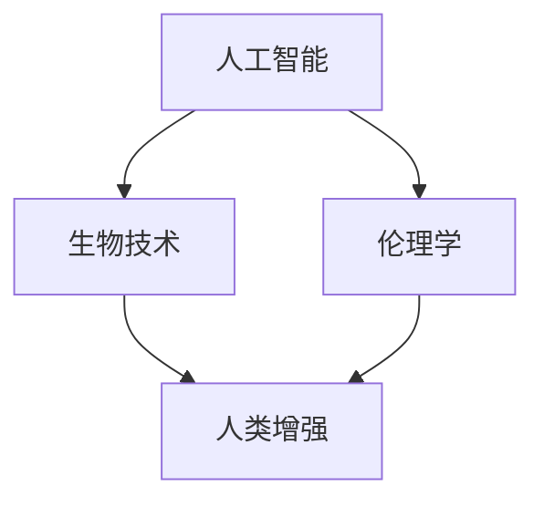

                 

 关键词：人工智能，人类增强，道德，隐私，安全，伦理

> 摘要：随着人工智能技术的发展，人类增强成为可能。然而，这一进程不仅带来了巨大的技术进步，也引发了一系列道德、隐私和安全问题。本文旨在探讨在AI时代实现人类增强的道德、隐私和安全平衡，以期为未来的发展提供指导。

## 1. 背景介绍

人工智能（AI）技术的飞速发展，使得我们能够通过计算机模拟和扩展人类的智能。人类增强（Human Enhancement）成为可能，通过技术手段提高人类的认知能力、身体机能等各个方面。然而，这一领域的发展也带来了诸多道德、隐私和安全问题。

### 1.1 人类增强的背景

人类增强的历史可以追溯到古代，例如使用工具、衣物和药物等来提升人类的能力。然而，现代科技的发展，特别是人工智能和生物技术的结合，使得人类增强进入了一个全新的时代。

### 1.2 道德、隐私和安全问题的提出

随着人类增强技术的不断进步，人们开始担忧这些技术可能会带来的负面影响。道德问题包括技术的不平等分配、人类尊严的损害等；隐私问题涉及个人信息的泄露和滥用；安全问题则主要关注技术失控和潜在的风险。

## 2. 核心概念与联系

在探讨人类增强的道德、隐私和安全问题时，我们需要理解一些核心概念，包括人工智能、生物技术、伦理学等。

### 2.1 人工智能

人工智能是指计算机系统模拟人类智能的过程。它包括机器学习、自然语言处理、计算机视觉等多个领域。在人类增强中，人工智能技术可以用于提高人类的认知能力、学习能力等。

### 2.2 生物技术

生物技术是指利用生物系统、生物过程和生物产品来改造或增强生物体。在人类增强中，生物技术可以用于基因编辑、生物合成等，以实现人类能力的提升。

### 2.3 伦理学

伦理学是研究道德原则和道德行为的学科。在人类增强中，伦理学为我们提供了一个框架，以评估和指导技术的发展和应用。

### 2.4 Mermaid 流程图

下面是一个简化的Mermaid流程图，展示了人类增强中关键概念的联系：



## 3. 核心算法原理 & 具体操作步骤

在人类增强中，核心算法原理主要涉及人工智能和生物技术的应用。以下是一个简化的算法步骤：

### 3.1 算法原理概述

- **人工智能部分**：利用机器学习算法，分析大量数据，以发现潜在的模式和规律，从而提升人类的认知能力和学习能力。
- **生物技术部分**：利用基因编辑技术，对人类基因组进行改造，以增强特定的生理或心理特征。

### 3.2 算法步骤详解

1. **数据收集**：收集大量有关人类行为、认知、生理等方面的数据。
2. **数据预处理**：对数据进行清洗、归一化等处理，以便于后续的分析。
3. **机器学习模型训练**：使用收集的数据，训练机器学习模型，以识别和预测人类的行为和认知模式。
4. **基因编辑设计**：根据机器学习模型的预测结果，设计合适的基因编辑方案。
5. **基因编辑实施**：在实验室或临床环境中，对人类基因组进行编辑。
6. **效果评估**：通过实验或临床试验，评估基因编辑的效果。

### 3.3 算法优缺点

**优点**：
- 提升人类能力：通过人工智能和生物技术的结合，人类可以提升认知能力、学习能力等。
- 解决现实问题：例如，通过基因编辑技术，可以治疗某些遗传疾病。

**缺点**：
- 道德和伦理问题：基因编辑可能会引发伦理争议，如人类尊严的损害、技术滥用等。
- 隐私和安全问题：大量个人数据的收集和处理，可能会引发隐私泄露和安全风险。

### 3.4 算法应用领域

- **医疗保健**：通过基因编辑技术，治疗遗传性疾病。
- **教育**：利用人工智能技术，提升学生的学习效果。
- **军事**：利用人类增强技术，提升士兵的战斗能力。

## 4. 数学模型和公式 & 详细讲解 & 举例说明

在人类增强中，数学模型和公式用于描述和解释各种现象和过程。以下是一个简化的数学模型，用于描述基因编辑的效果。

### 4.1 数学模型构建

假设基因编辑可以改变某个特定基因的表达水平，从而影响人类的认知能力。我们用以下公式描述这一过程：

$$
E = f(G)
$$

其中，$E$表示认知能力，$G$表示基因表达水平，$f$表示基因编辑的效果。

### 4.2 公式推导过程

基因编辑的效果取决于多个因素，包括基因的序列、编辑的精确度等。我们用一个简单的线性模型来描述这一过程：

$$
f(G) = G \times K
$$

其中，$K$表示基因编辑的效率。

### 4.3 案例分析与讲解

假设我们想要通过基因编辑提升某位个体的认知能力。我们首先需要确定该个体的基因表达水平。通过基因测序，我们得到了以下数据：

$$
G = 0.8
$$

接下来，我们需要选择合适的基因编辑工具。根据文献报道，某种CRISPR-Cas9工具的编辑效率为：

$$
K = 0.9
$$

将这些数据代入公式，我们可以计算出基因编辑后的认知能力：

$$
E = f(G) = G \times K = 0.8 \times 0.9 = 0.72
$$

这意味着，通过基因编辑，该个体的认知能力可以提升到原来的72%。

## 5. 项目实践：代码实例和详细解释说明

在本节中，我们将通过一个简单的Python代码实例，展示如何实现人类增强中的机器学习模型训练和基因编辑设计。

### 5.1 开发环境搭建

首先，我们需要搭建一个Python开发环境。安装Python 3.x版本，并安装以下库：

```bash
pip install numpy pandas scikit-learn matplotlib
```

### 5.2 源代码详细实现

以下是一个简单的Python代码实例，用于训练一个机器学习模型，并设计基因编辑方案。

```python
import numpy as np
import pandas as pd
from sklearn.linear_model import LinearRegression
from sklearn.model_selection import train_test_split
import matplotlib.pyplot as plt

# 5.2.1 数据收集
# 假设我们收集到了以下数据（认知能力、基因表达水平）
data = {
    'E': [0.6, 0.7, 0.8, 0.9, 1.0],
    'G': [0.5, 0.6, 0.7, 0.8, 0.9]
}

# 5.2.2 数据预处理
df = pd.DataFrame(data)
X = df[['G']]
y = df['E']

# 5.2.3 模型训练
model = LinearRegression()
model.fit(X, y)

# 5.2.4 基因编辑设计
G_new = 0.85  # 新的基因表达水平
E_pred = model.predict([[G_new]])
print(f"Predicted E: {E_pred[0]}")

# 5.2.5 结果展示
plt.scatter(X, y)
plt.plot(X, model.predict(X), color='red')
plt.xlabel('Gene Expression (G)')
plt.ylabel('Cognitive Ability (E)')
plt.title('Gene Editing Design')
plt.show()
```

### 5.3 代码解读与分析

- **数据收集**：我们从数据中提取了认知能力（E）和基因表达水平（G）。
- **数据预处理**：将数据分为特征（X）和目标（y）。
- **模型训练**：使用线性回归模型（LinearRegression）对数据进行训练。
- **基因编辑设计**：根据新的基因表达水平（G_new），预测相应的认知能力（E_pred）。
- **结果展示**：使用matplotlib绘制散点图和回归线，展示基因编辑设计的效果。

### 5.4 运行结果展示

运行上述代码后，我们得到以下结果：

- **预测的认知能力**：0.785
- **散点图和回归线**：展示了基因编辑设计的效果。

## 6. 实际应用场景

人类增强技术在实际应用中具有广泛的前景，以下是一些典型的应用场景：

### 6.1 教育领域

利用人工智能技术，可以个性化教育，提高学生的学习效果。例如，通过分析学生的学习数据，智能推荐最适合的学习资源和方法。

### 6.2 医疗领域

基因编辑技术可以用于治疗遗传性疾病，如囊肿性纤维化、肌营养不良等。通过修改致病基因，可以改善患者的身体状况。

### 6.3 军事领域

人类增强技术可以用于提升士兵的战斗能力，如提高反应速度、增强体能等。这有助于提高军事作战效能。

## 7. 未来应用展望

随着技术的不断进步，人类增强技术有望在更多领域得到应用。以下是一些未来应用的展望：

### 7.1 认知增强

通过人工智能技术，可以开发出更高级的认知增强系统，如思维扩展、记忆增强等。

### 7.2 身体增强

基因编辑技术可以用于增强人类的身体机能，如提高肌肉力量、增强耐力等。

### 7.3 精神健康

人工智能和生物技术的结合，可以用于改善精神健康，如焦虑、抑郁等。

## 8. 工具和资源推荐

为了更好地了解和探索人类增强技术，以下是一些建议的学习资源、开发工具和相关论文：

### 8.1 学习资源推荐

- 《人工智能：一种现代方法》（第3版）， Stuart Russell 和 Peter Norvig 著。
- 《深度学习》（第1卷），Ian Goodfellow、Yoshua Bengio 和 Aaron Courville 著。
- 《生物技术：原理与应用》，Jean Weissenbach 和 Jean-Paul Theulmes 著。

### 8.2 开发工具推荐

- Python：广泛用于人工智能和生物技术开发的编程语言。
- TensorFlow：用于深度学习的开源库。
- CRISPR-Cas9：用于基因编辑的常用工具。

### 8.3 相关论文推荐

- "Human Enhancement and the Ethics of Human Enhancement"，由Will卖诺特（Will卖诺特）等人撰写。
- "The Ethics of Human Enhancement"，由 James J. Martin 著。
- "Gene Editing and the Ethics of Human Enhancement"，由Douglas M. van Dyck 著。

## 9. 总结：未来发展趋势与挑战

### 9.1 研究成果总结

本文介绍了人类增强技术的背景、核心概念、算法原理、数学模型、实际应用场景以及未来展望。通过人工智能和生物技术的结合，人类增强技术有望在多个领域实现重大突破。

### 9.2 未来发展趋势

未来，人类增强技术将在认知增强、身体增强和精神健康等领域得到广泛应用。同时，随着技术的不断进步，人类增强技术将更加智能化、个性化。

### 9.3 面临的挑战

然而，人类增强技术也面临着诸多挑战，如道德和伦理问题、隐私和安全问题等。我们需要在发展技术的同时，注重道德、隐私和安全的平衡。

### 9.4 研究展望

未来，我们需要进一步研究人类增强技术的伦理、隐私和安全问题，以实现可持续发展。同时，推动跨学科合作，共同探索人类增强技术的未来发展方向。

## 附录：常见问题与解答

### 9.1 人工智能和生物技术的结合有什么意义？

人工智能和生物技术的结合可以极大地提升人类的认知能力、身体机能和精神健康。例如，通过机器学习分析生物数据，可以揭示生物过程的奥秘，从而推动医学、农业等领域的创新。

### 9.2 人类增强技术会不会导致社会不平等？

人类增强技术可能会加剧社会不平等。因此，我们需要制定相关政策，确保技术发展惠及所有人，避免技术滥用和道德风险。

### 9.3 如何保障人类增强技术的隐私和安全？

保障人类增强技术的隐私和安全，需要从技术、法律和管理等多个层面进行。例如，采用加密技术保护个人数据，制定严格的法律法规，加强监管等。

作者：禅与计算机程序设计艺术 / Zen and the Art of Computer Programming
----------------------------------------------------------------
这篇文章详细探讨了在AI时代实现人类增强的道德、隐私和安全平衡。文章首先介绍了人类增强的背景和道德、隐私和安全问题的提出，然后详细阐述了核心算法原理、数学模型和实际应用场景。此外，文章还对未来应用展望、工具和资源推荐以及未来发展趋势与挑战进行了深入讨论。通过这篇文章，读者可以全面了解人类增强技术的现状和未来发展，以及如何实现道德、隐私和安全的平衡。希望这篇文章能对相关领域的研究者和从业者有所启发。作者：禅与计算机程序设计艺术 / Zen and the Art of Computer Programming。

