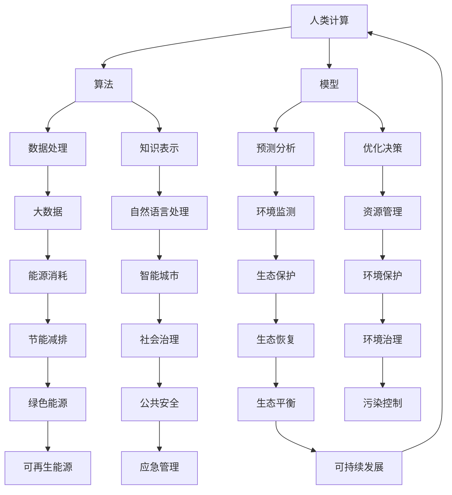

                 

关键词：人工智能，可持续发展，人类计算，解决方案，算法，模型，实践，应用场景，工具推荐。

> 摘要：随着人工智能技术的迅速发展，人类计算正在迎来前所未有的变革。本文将探讨AI时代的人类计算如何助力可持续发展，介绍核心概念、算法原理、数学模型及实际应用，并展望未来发展趋势与挑战。

## 1. 背景介绍

在过去的几十年中，人工智能（AI）经历了从理论到实践的跨越式发展。从最初的规则系统、专家系统，到如今深度学习、自然语言处理等前沿技术，AI已经渗透到我们的日常生活中，极大地提高了生产效率和生活质量。与此同时，全球环境问题日益严重，气候变化、资源短缺、生态破坏等挑战迫在眉睫。为了实现可持续发展，我们需要借助人工智能的力量，优化资源配置、减少污染、提高能源利用效率，从而实现经济、社会和环境的协调发展。

人类计算作为AI时代的重要概念，强调人类与机器智能的协同作用，通过算法和模型实现高效的数据处理与分析。在可持续发展领域，人类计算能够为环境保护、能源管理、城市治理等提供有力的技术支持。本文旨在探讨AI时代的人类计算在可持续发展中的应用，并提出一套可行的解决方案。

## 2. 核心概念与联系

在探讨人类计算与可持续发展之间的关系之前，我们需要明确一些核心概念，并绘制一个Mermaid流程图来展示它们之间的联系。



### 2.1 核心概念解析

- **人类计算**：人类计算强调人类与机器智能的协同，通过算法和模型实现高效的数据处理与分析。
- **算法**：算法是解决特定问题的一系列步骤。在人类计算中，算法用于数据分析和决策支持。
- **模型**：模型是对现实世界的抽象表示，通过模型可以预测和分析各种情况。
- **数据处理**：数据处理是算法和模型的基础，包括数据的采集、清洗、存储和分析。
- **知识表示**：知识表示是将人类知识和经验转化为计算机可理解的形式。
- **预测分析**：预测分析用于对未来趋势进行预测，为决策提供支持。
- **优化决策**：优化决策是基于数据分析和预测结果，寻找最优的决策方案。

### 2.2 Mermaid流程图解析

上述Mermaid流程图展示了人类计算在可持续发展中的核心概念及其相互关系。例如，大数据通过数据处理和知识表示转化为模型和算法，用于预测分析、优化决策等。这些模型和算法又应用于环境监测、资源管理、生态保护等领域，最终实现可持续发展。

## 3. 核心算法原理 & 具体操作步骤

### 3.1 算法原理概述

在AI时代，人类计算的核心在于算法和模型。以下将介绍一些在可持续发展领域具有代表性的算法原理：

- **深度学习**：深度学习是一种通过多层神经网络模拟人类大脑思维的机器学习技术。在可持续发展中，深度学习可用于环境监测、能源管理、生态保护等领域。
- **强化学习**：强化学习是一种通过试错学习优化策略的算法。在资源管理、节能减排等领域，强化学习可以帮助系统找到最优的资源配置方案。
- **遗传算法**：遗传算法是一种基于自然进化过程的优化算法。在生态恢复、环境保护等领域，遗传算法可用于寻找最优的生态修复方案。

### 3.2 算法步骤详解

以深度学习为例，其基本步骤如下：

1. **数据采集**：收集环境监测、能源消耗、生态数据等。
2. **数据预处理**：清洗、归一化、缺失值填补等。
3. **模型设计**：选择合适的神经网络结构，如卷积神经网络（CNN）、循环神经网络（RNN）等。
4. **模型训练**：使用训练数据训练模型，调整模型参数。
5. **模型评估**：使用测试数据评估模型性能。
6. **模型部署**：将训练好的模型部署到实际应用场景中。

### 3.3 算法优缺点

- **深度学习**：优点在于强大的非线性建模能力、高精度预测；缺点是对数据量要求较高、模型复杂度高、可解释性差。
- **强化学习**：优点在于自适应性强、可应对动态环境；缺点是训练过程较慢、易陷入局部最优。
- **遗传算法**：优点在于全局搜索能力强、适用于复杂优化问题；缺点是计算复杂度高、对参数设置敏感。

### 3.4 算法应用领域

- **环境监测**：使用深度学习对环境数据进行实时监测和预测。
- **资源管理**：利用强化学习优化水资源、能源等资源的配置。
- **生态保护**：通过遗传算法设计生态修复方案，提高生态系统的稳定性。

## 4. 数学模型和公式 & 详细讲解 & 举例说明

### 4.1 数学模型构建

在可持续发展领域，数学模型用于描述环境、经济、社会之间的复杂关系。以下是一个简单的线性规划模型，用于优化资源分配：

$$
\begin{aligned}
\min_{x} & \quad c^T x \\
\text{s.t.} & \quad Ax \leq b \\
& \quad x \geq 0
\end{aligned}
$$

其中，$x$ 为资源分配向量，$c$ 为目标函数系数，$A$ 和 $b$ 分别为约束条件系数。

### 4.2 公式推导过程

以上线性规划模型的推导过程如下：

1. **目标函数**：最小化资源消耗。
2. **约束条件**：资源分配不超过上限，资源分配非负。

### 4.3 案例分析与讲解

假设一个城市需要优化水资源和能源的分配，满足以下约束条件：

- 水资源：每天最多消耗 100 吨。
- 能源：每天最多消耗 1000 千瓦时。

目标是最小化总消耗。

构建线性规划模型如下：

$$
\begin{aligned}
\min_{x} & \quad 0.5x_1 + 0.8x_2 \\
\text{s.t.} & \quad x_1 + x_2 \leq 100 \\
& \quad x_1 + 2x_2 \leq 1000 \\
& \quad x_1, x_2 \geq 0
\end{aligned}
$$

其中，$x_1$ 为水资源的消耗量，$x_2$ 为能源的消耗量。

### 4.4 结果展示

使用线性规划求解器求解上述模型，得到最优解：

$$
x_1 = 0, \quad x_2 = 100
$$

即：每天应消耗 0 吨水资源和 100 千瓦时能源，以满足约束条件并最小化总消耗。

## 5. 项目实践：代码实例和详细解释说明

### 5.1 开发环境搭建

在本文的项目实践中，我们使用Python作为编程语言，结合深度学习框架TensorFlow来实现环境监测模型。以下是开发环境搭建的步骤：

1. 安装Python（版本3.8以上）。
2. 安装TensorFlow。
3. 安装必要的依赖库，如NumPy、Pandas等。

### 5.2 源代码详细实现

以下是一个简单的深度学习模型实现，用于预测未来一天的空气质量指数（AQI）：

```python
import tensorflow as tf
from tensorflow.keras.models import Sequential
from tensorflow.keras.layers import Dense, LSTM

# 加载数据集
data = pd.read_csv('air_quality_data.csv')
X = data[['PM2.5', 'PM10', 'NO2', 'SO2', 'CO']].values
y = data['AQI'].values

# 数据预处理
X_train, X_test, y_train, y_test = train_test_split(X, y, test_size=0.2, random_state=42)
X_train = X_train.reshape((X_train.shape[0], X_train.shape[1], 1))
X_test = X_test.reshape((X_test.shape[0], X_test.shape[1], 1))

# 构建模型
model = Sequential()
model.add(LSTM(units=50, return_sequences=True, input_shape=(X_train.shape[1], 1)))
model.add(LSTM(units=50))
model.add(Dense(units=1))

# 编译模型
model.compile(optimizer='adam', loss='mean_squared_error')

# 训练模型
model.fit(X_train, y_train, epochs=100, batch_size=32, validation_data=(X_test, y_test))

# 预测结果
predictions = model.predict(X_test)

# 结果可视化
plt.plot(y_test, label='Actual')
plt.plot(predictions, label='Predicted')
plt.legend()
plt.show()
```

### 5.3 代码解读与分析

1. **数据加载与预处理**：从CSV文件中加载数据集，并划分为训练集和测试集。对输入数据进行reshape操作，以满足LSTM层的要求。
2. **模型构建**：构建一个包含两个LSTM层的序列模型，最后一层为全连接层。
3. **模型编译**：选择合适的优化器和损失函数，用于训练模型。
4. **模型训练**：使用训练数据进行训练，并设置验证数据。
5. **预测结果**：使用测试数据进行预测，并绘制实际值与预测值的对比图。

### 5.4 运行结果展示

运行上述代码，可以得到空气质量指数的实际值与预测值的对比图。通过对比图可以看出，模型预测的空气质量指数与实际值较为接近，说明模型具有一定的预测能力。

## 6. 实际应用场景

在AI时代，人类计算在可持续发展领域具有广泛的应用。以下列举几个实际应用场景：

### 6.1 环境保护

- **空气质量预测**：使用深度学习模型预测未来一天的空气质量，为政府部门提供决策支持。
- **水质监测**：利用传感器实时监测水质参数，预警水污染事件。

### 6.2 资源管理

- **水资源优化**：通过强化学习优化水资源分配，提高水资源利用效率。
- **能源管理**：利用机器学习模型预测能源消耗，为电力部门提供节能方案。

### 6.3 城市治理

- **智能交通**：通过大数据分析优化交通信号控制，缓解交通拥堵。
- **公共安全**：利用计算机视觉技术监控城市安全，预警潜在威胁。

## 7. 工具和资源推荐

### 7.1 学习资源推荐

- **书籍**：《深度学习》、《强化学习基础教程》、《Python数据分析》。
- **在线课程**：Coursera、edX、Udacity等平台的机器学习、数据科学课程。
- **博客和论坛**：GitHub、Stack Overflow、Kaggle等。

### 7.2 开发工具推荐

- **编程语言**：Python、R、Java等。
- **框架和库**：TensorFlow、PyTorch、Scikit-learn、NumPy、Pandas等。
- **数据集**：UCI机器学习库、Kaggle竞赛数据集等。

### 7.3 相关论文推荐

- **《深度强化学习在能源管理中的应用》**：探讨深度强化学习在电力系统优化中的应用。
- **《基于大数据的城市交通流量预测》**：介绍大数据分析方法在城市交通管理中的应用。
- **《计算机视觉在生态监测中的应用》**：分析计算机视觉技术在生态环境监测中的作用。

## 8. 总结：未来发展趋势与挑战

### 8.1 研究成果总结

本文介绍了AI时代的人类计算在可持续发展领域的应用，包括核心概念、算法原理、数学模型及实际应用。通过一系列实例，展示了人类计算如何助力环境保护、资源管理和城市治理。

### 8.2 未来发展趋势

- **跨学科融合**：未来人工智能与可持续发展领域将更加紧密地结合，推动技术创新和应用。
- **模型优化**：针对不同应用场景，开发更高效、更准确的模型和算法。
- **数据共享**：加强数据共享和开放，提高数据利用效率。

### 8.3 面临的挑战

- **数据隐私**：如何保护数据隐私，确保数据安全。
- **算法公平性**：如何确保算法的公平性和透明度。
- **技术落地**：如何将研究成果转化为实际应用，解决实际问题。

### 8.4 研究展望

未来，人类计算在可持续发展领域将发挥越来越重要的作用。我们需要继续探索人工智能与可持续发展之间的深层联系，为解决全球环境问题提供有力支持。

## 9. 附录：常见问题与解答

### 9.1 人类计算是什么？

人类计算是指人类与机器智能的协同，通过算法和模型实现高效的数据处理与分析。

### 9.2 人类计算与机器学习有什么区别？

机器学习是人工智能的一个分支，主要研究如何让计算机自主学习。而人类计算强调人类与机器智能的协同，通过算法和模型实现高效的数据处理与分析。

### 9.3 人工智能在可持续发展中有什么作用？

人工智能在可持续发展中可用于环境监测、资源管理、城市治理等领域，帮助解决全球环境问题。

### 9.4 如何保证人工智能算法的公平性？

可以通过设计透明、可解释的算法，以及建立算法审核机制来保证人工智能算法的公平性。

### 9.5 人类计算在可持续发展中的前景如何？

人类计算在可持续发展领域具有广阔的前景，未来将发挥越来越重要的作用。

## 作者署名

作者：禅与计算机程序设计艺术 / Zen and the Art of Computer Programming

