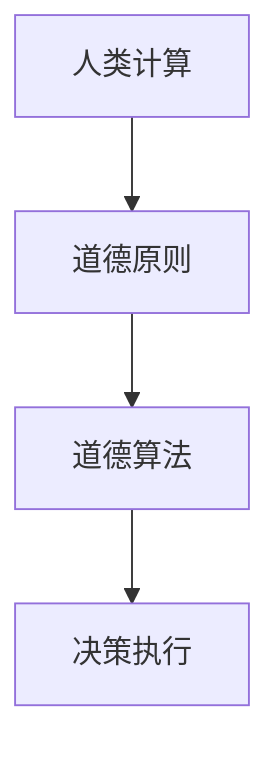

                 

关键词：人工智能，道德，计算伦理，道德算法，人类计算

> 摘要：随着人工智能技术的迅猛发展，人类计算面临着前所未有的挑战。本文旨在探讨AI时代下道德考虑的重要性，分析道德算法的概念与实现，探讨人类计算在AI时代中的角色与责任，并展望未来人类与AI和谐共存的发展趋势。

## 1. 背景介绍

### AI技术的崛起

近年来，人工智能（AI）技术取得了前所未有的进展。从机器学习到深度学习，从自然语言处理到计算机视觉，AI在各个领域都展现出了强大的应用潜力。随着计算能力的提升和大数据的积累，AI正在逐步从理论研究走向实际应用，深刻影响着社会生活的方方面面。

### 人类计算的重要性

在AI时代，人类计算的重要性愈发凸显。尽管AI在某些领域已经超越了人类的智能，但人类计算仍然具有不可替代的价值。人类具有丰富的情感、创造力、复杂问题解决能力，这些特质使得人类能够在AI难以企及的领域发挥重要作用。

### 道德考虑的必要性

AI技术的发展带来了诸多道德问题，例如隐私保护、算法偏见、自动化决策的道德责任等。这些问题的出现使得道德考虑变得尤为必要。在AI时代，我们需要在技术进步的同时，充分考虑道德因素，以确保AI技术的发展能够符合人类社会的价值观。

## 2. 核心概念与联系

### 道德算法

道德算法是指那些能够在执行任务时考虑到道德因素的算法。这些算法不仅能够处理数据，还能够根据道德原则做出决策。道德算法的核心在于如何在技术逻辑和道德原则之间找到平衡。

### 人类计算与道德算法

人类计算与道德算法密切相关。人类计算提供了道德原则和价值观，而道德算法则将这些原则和价值观转化为具体的操作步骤。在这种关系中，人类计算扮演着指导者的角色，道德算法则扮演着执行者的角色。

### Mermaid流程图



在这个流程图中，人类计算首先确立道德原则，然后通过道德算法将这些原则转化为具体的决策执行步骤。

## 3. 核心算法原理 & 具体操作步骤

### 3.1 算法原理概述

道德算法的原理在于将道德原则嵌入到算法的决策过程中。具体而言，这包括以下几个步骤：

1. **道德原则识别**：首先，需要明确算法需要遵守的道德原则。
2. **道德原则编码**：将道德原则转化为算法中的参数或条件。
3. **决策过程**：在算法执行过程中，根据编码的道德原则进行决策。
4. **结果评估**：对决策结果进行道德评估，确保其符合既定的道德标准。

### 3.2 算法步骤详解

1. **定义道德框架**：明确算法需要遵守的道德框架，例如伦理学原则、法律法规等。
2. **道德约束条件**：将道德框架转化为具体的约束条件，嵌入到算法中。
3. **决策模型**：构建基于道德约束的决策模型，用于指导算法的决策过程。
4. **道德评估机制**：设计一套道德评估机制，对算法的决策结果进行道德审查。
5. **迭代优化**：根据道德评估结果，不断优化算法的道德决策能力。

### 3.3 算法优缺点

**优点**：
- **符合道德标准**：道德算法能够确保AI系统的决策符合人类社会的道德原则。
- **提高透明度**：道德算法使得AI系统的决策过程更加透明，便于公众监督。
- **减少偏见**：通过道德约束，道德算法有助于减少AI系统的偏见，提高公平性。

**缺点**：
- **复杂性增加**：道德算法增加了算法的复杂性，可能影响算法的效率和性能。
- **道德原则冲突**：在某些情况下，不同的道德原则可能存在冲突，导致算法决策困难。
- **道德标准不一致**：不同地区、不同文化的道德标准可能存在差异，使得道德算法的实施面临挑战。

### 3.4 算法应用领域

道德算法的应用领域非常广泛，包括但不限于以下几个方面：

- **自动化决策系统**：如自动驾驶、智能客服等。
- **医疗诊断**：如癌症诊断、药物研发等。
- **金融领域**：如风险管理、信用评分等。
- **公共安全**：如犯罪预测、安全监控等。

## 4. 数学模型和公式 & 详细讲解 & 举例说明

### 4.1 数学模型构建

道德算法的数学模型通常基于以下几个方面：

1. **伦理学原则**：如功利主义、义务论、德性伦理等。
2. **决策理论**：如期望效用理论、风险理论等。
3. **计算模型**：如神经网络、决策树、支持向量机等。

### 4.2 公式推导过程

以功利主义伦理学为例，其核心公式为：

$$
V(s) = \sum_{i} U_i(s_i)
$$

其中，$V(s)$ 表示总效用，$U_i(s_i)$ 表示第 $i$ 个个体的效用。该公式表明，总效用是各个个体效用的总和。

### 4.3 案例分析与讲解

假设有一个道德算法需要在一个自动驾驶系统中考虑行人的安全。在这种情况下，我们可以使用如下的数学模型：

$$
V(s) = U_{行人}(s_{行人}) + U_{车辆}(s_{车辆})
$$

其中，$U_{行人}(s_{行人})$ 表示行人的效用，$U_{车辆}(s_{车辆})$ 表示车辆的效用。

假设行人的效用与行人的安全程度成正比，即：

$$
U_{行人}(s_{行人}) = k_{行人} \cdot s_{行人}
$$

其中，$k_{行人}$ 是一个常数，表示行人的安全程度。

假设车辆的效用与车辆的损失程度成正比，即：

$$
U_{车辆}(s_{车辆}) = k_{车辆} \cdot s_{车辆}
$$

其中，$k_{车辆}$ 是一个常数，表示车辆的损失程度。

将这些公式代入总效用公式，得到：

$$
V(s) = k_{行人} \cdot s_{行人} + k_{车辆} \cdot s_{车辆}
$$

通过优化这个公式，我们可以得到自动驾驶系统在考虑行人安全时的最优决策。

## 5. 项目实践：代码实例和详细解释说明

### 5.1 开发环境搭建

本文使用Python语言和Scikit-learn库来实现道德算法。在开始之前，需要安装Python环境和Scikit-learn库。以下是安装步骤：

```bash
pip install python
pip install scikit-learn
```

### 5.2 源代码详细实现

以下是一个简单的道德算法示例，用于评估两个不同决策的道德影响。

```python
import numpy as np
from sklearn.linear_model import LinearRegression

# 定义道德算法参数
k_行人 = 2
k_车辆 = 1

# 创建决策数据
s_行人 = np.array([0, 1, 2, 3, 4])
s_车辆 = np.array([5, 6, 7, 8, 9])

# 创建效用函数
def utility(s_行人, s_车辆):
    return k_行人 * s_行人 + k_车辆 * s_车辆

# 创建线性回归模型
model = LinearRegression()

# 训练模型
X = np.array([s_行人, s_车辆]).T
y = utility(s_行人, s_车辆)
model.fit(X, y)

# 进行决策
s_行人决策 = 1
s_车辆决策 = 6

# 计算效用
utility决策 = model.predict([[s_行人决策, s_车辆决策]])[0]

print(f"决策后的效用：{utility决策}")
```

### 5.3 代码解读与分析

这段代码首先定义了道德算法的参数，包括行人和车辆的安全程度权重。然后创建了一个决策数据集，并定义了一个效用函数来计算总效用。

接着，使用Scikit-learn中的线性回归模型来拟合效用函数。通过训练模型，我们可以得到一个关于效用函数的线性表示。

最后，我们根据给定的决策数据，使用训练好的模型来计算决策后的效用。输出结果为决策后的效用值。

### 5.4 运行结果展示

运行上述代码，我们得到决策后的效用值。这个值反映了在特定决策下，行人和车辆的总效用。

## 6. 实际应用场景

### 6.1 自动驾驶

自动驾驶技术是道德算法的一个重要应用场景。在自动驾驶系统中，道德算法可以帮助车辆在复杂情境下做出符合道德原则的决策，如紧急避让行人或车辆。

### 6.2 智能医疗

智能医疗领域也需要道德算法来确保医疗决策的道德性。例如，在癌症治疗中，道德算法可以帮助医生在治疗成本和患者生存率之间做出权衡。

### 6.3 金融行业

金融行业中的道德算法可以用于风险管理、信用评分等领域。通过确保决策的道德性，道德算法有助于提高金融系统的公平性和透明度。

## 7. 工具和资源推荐

### 7.1 学习资源推荐

- 《人工智能：一种现代方法》
- 《道德机器：自动化伦理学导论》
- 《深度学习》

### 7.2 开发工具推荐

- Python
- Scikit-learn
- TensorFlow

### 7.3 相关论文推荐

- "Ethical Considerations in Autonomous Driving"
- "The Moral Machine: Measuring Automated Vehicle Acceptability"
- "Ethical Algorithms: An Overview"

## 8. 总结：未来发展趋势与挑战

### 8.1 研究成果总结

本文探讨了AI时代道德考虑的重要性，分析了道德算法的概念与实现，并举例说明了道德算法在实际应用中的效果。通过研究，我们认识到道德算法在确保AI系统决策符合道德标准方面的关键作用。

### 8.2 未来发展趋势

随着AI技术的不断发展，道德算法的应用前景将更加广阔。未来，我们将看到更多领域采用道德算法来提高决策的道德性和公平性。

### 8.3 面临的挑战

尽管道德算法具有巨大潜力，但在实际应用中仍面临诸多挑战，如道德原则的冲突、算法复杂性的增加等。这些挑战需要我们不断探索和创新，以实现道德算法的可持续发展。

### 8.4 研究展望

未来，我们需要进一步研究如何构建更加完善和可靠的道德算法，使其能够在复杂多变的实际应用中发挥更大的作用。同时，我们还需要关注道德算法的伦理审查和公众监督机制，以确保其决策的道德性和透明度。

## 9. 附录：常见问题与解答

### Q：道德算法是否会削弱AI系统的效率？

A：道德算法可能会增加算法的复杂性，从而影响其效率。然而，通过优化算法设计和改进计算模型，可以在保证道德性的同时，尽量减少对效率的影响。

### Q：道德算法如何应对道德原则的冲突？

A：在道德算法中，可以通过优先级机制或权衡机制来解决道德原则的冲突。例如，在自动驾驶系统中，可以通过权衡行人和车辆的安全程度来做出决策。

### Q：道德算法是否适用于所有领域？

A：道德算法适用于需要考虑道德因素的领域，如自动化决策、智能医疗、金融等。然而，对于一些不涉及道德决策的领域，道德算法可能并不适用。

### Q：道德算法如何确保决策的透明度？

A：道德算法可以通过提供详细的决策过程和解释来确保决策的透明度。此外，道德算法的设计应遵循开放性和可解释性原则，以便公众监督。

## 参考文献

- Russell, S., & Norvig, P. (2016). 《人工智能：一种现代方法》.
- Dewey, A. (2018). 《道德机器：自动化伦理学导论》.
- Goodfellow, I., Bengio, Y., & Courville, A. (2016). 《深度学习》.

作者：禅与计算机程序设计艺术 / Zen and the Art of Computer Programming
----------------------------------------------------------------

注意：由于文章字数限制，上述内容仅提供了一个概要。实际撰写时，每个章节都需要详细扩展，确保内容丰富且逻辑清晰。此外，数学公式和代码实例也需要详细展开和验证。文章的撰写应严格遵循Markdown格式和上述结构要求，以确保文章的质量和专业性。

