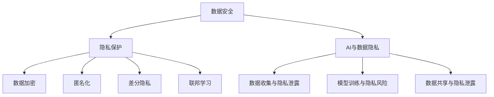

                 

关键词：人工智能，用户隐私，数据安全，隐私保护技术，AI伦理

> 摘要：随着人工智能技术的迅猛发展，用户隐私保护成为了一个亟待解决的重要问题。本文将深入探讨AI时代下用户隐私保护的现状、核心概念、技术手段及未来展望，为推动人工智能技术的可持续发展提供参考。

## 1. 背景介绍

在过去的几十年中，人工智能（AI）技术取得了显著的进步，从简单的规则系统发展到如今能够自主学习、推理和决策的复杂系统。然而，AI技术的快速发展也带来了诸多隐私保护问题。在AI时代，用户的个人信息以更广泛的范围和更精细的维度被收集、存储和处理。这既为AI技术的应用提供了丰富的数据资源，同时也为用户隐私带来了前所未有的风险。

近年来，一系列数据泄露事件引发了公众对用户隐私保护的担忧。例如，Facebook的Cambridge Analytica事件、Equifax数据泄露事件等都揭示了AI技术在隐私保护方面存在的严重漏洞。这些事件不仅损害了用户的信任，也对企业的声誉造成了重大影响。

此外，随着物联网、云计算和大数据技术的普及，数据收集和处理的方式变得更加复杂和隐蔽。用户在不知不觉中可能已经将自己的隐私信息贡献给了各种平台和服务。这些数据一旦被滥用，将严重威胁到用户的安全和权益。

因此，如何在AI时代保护用户隐私，已成为学术界、产业界和政府共同关注的重要课题。

## 2. 核心概念与联系

### 2.1 数据安全与隐私保护

数据安全与隐私保护是AI时代用户隐私保护的两大核心概念。数据安全指的是保护数据免受未经授权的访问、篡改、破坏或泄露的措施。隐私保护则强调在数据处理过程中尊重用户的个人权利和自由，确保用户的个人信息不被滥用。

数据安全和隐私保护之间存在紧密的联系。一方面，数据安全是隐私保护的基础，只有确保数据的安全，才能保障用户隐私不被泄露。另一方面，隐私保护也是数据安全的重要组成部分，它要求在数据收集、存储、传输和使用等各个环节中，充分考虑用户的隐私需求，避免隐私信息的滥用。

### 2.2 AI与数据隐私

AI技术的发展离不开大量数据的支持。然而，这些数据往往包含了用户的个人信息，如姓名、地址、电话号码、行为记录等。这些信息一旦被滥用，将严重威胁到用户的隐私和安全。

AI与数据隐私之间的矛盾主要体现在以下几个方面：

1. **数据收集与隐私泄露**：为了训练和优化模型，AI系统需要大量数据。然而，这些数据中可能包含用户的敏感信息，如医疗记录、财务信息等。如果数据收集过程不规范，可能导致隐私泄露。

2. **模型训练与隐私风险**：AI模型在训练过程中需要访问和处理大量数据。在这个过程中，可能会无意中泄露用户的隐私信息。例如，深度学习模型可以通过分析用户的社交媒体数据，推断出用户的个人兴趣、生活习惯等。

3. **数据共享与隐私泄露**：为了提高AI系统的性能，企业之间可能会进行数据共享。然而，这种数据共享也带来了隐私泄露的风险。如果数据共享机制不完善，可能导致用户的隐私信息被滥用。

### 2.3 隐私保护技术与AI

为了解决AI时代用户隐私保护问题，研究人员提出了多种隐私保护技术。这些技术主要包括：

1. **数据加密**：数据加密是一种常见的数据保护手段，通过将数据转换为无法读取的密文，确保数据在传输和存储过程中不被泄露。

2. **匿名化**：匿名化是一种通过删除或修改数据中的个人信息，使数据无法直接关联到特定个体，从而保护用户隐私的技术。

3. **差分隐私**：差分隐私是一种在数据处理过程中，通过添加噪声或扰动，使数据分析结果无法区分单个个体的隐私保护技术。

4. **联邦学习**：联邦学习是一种在分布式环境中进行机器学习的技术，通过将模型训练任务分解到多个参与者，避免了数据的集中存储和传输，从而降低了隐私泄露的风险。

### 2.4 Mermaid 流程图

以下是一个关于隐私保护技术的Mermaid流程图，展示了数据安全与隐私保护的关系以及AI与隐私保护技术的联系：



## 3. 核心算法原理 & 具体操作步骤

### 3.1 算法原理概述

在AI时代，为了保护用户隐私，研究人员提出了多种核心算法。这些算法主要基于以下原理：

1. **数据加密**：通过将数据加密为密文，确保数据在传输和存储过程中不被窃取或篡改。常见的加密算法包括对称加密和非对称加密。

2. **匿名化**：通过删除或修改数据中的个人信息，使数据无法直接关联到特定个体。匿名化算法包括k-匿名、l-diversity和t-closeness等。

3. **差分隐私**：通过添加噪声或扰动，使数据分析结果无法区分单个个体的隐私保护技术。差分隐私算法的核心是ε-differential privacy，其中ε表示隐私预算。

4. **联邦学习**：通过将模型训练任务分解到多个参与者，避免数据的集中存储和传输，从而降低隐私泄露的风险。联邦学习算法主要包括本地模型聚合和跨模型聚合两种方式。

### 3.2 算法步骤详解

以下是针对上述核心算法的步骤详解：

#### 3.2.1 数据加密

1. **选择加密算法**：根据数据的安全需求，选择合适的加密算法。对称加密如AES，非对称加密如RSA。

2. **生成密钥**：生成加密所需的密钥，密钥的生成过程需要确保随机性和安全性。

3. **加密数据**：使用加密算法和密钥对数据进行加密。

4. **存储密文**：将加密后的数据（密文）存储在安全的地方。

5. **解密数据**：在需要访问数据时，使用密钥对密文进行解密。

#### 3.2.2 匿名化

1. **识别敏感信息**：分析数据，识别其中的敏感信息。

2. **选择匿名化算法**：根据数据特点和隐私需求，选择合适的匿名化算法。

3. **执行匿名化**：对敏感信息进行匿名化处理，生成匿名化数据。

4. **验证匿名化效果**：对匿名化数据进行验证，确保匿名化效果满足隐私保护要求。

#### 3.2.3 差分隐私

1. **选择隐私预算ε**：根据数据规模和分析需求，选择合适的隐私预算ε。

2. **添加噪声或扰动**：在数据处理过程中，添加噪声或扰动，使数据分析结果无法区分单个个体的隐私信息。

3. **计算ε-differential privacy**：根据ε-differential privacy的定义，计算满足隐私保护要求的ε值。

4. **调整参数**：根据ε值，调整模型参数，确保模型的性能和隐私保护效果。

#### 3.2.4 联邦学习

1. **划分数据**：将数据划分到多个参与者，每个参与者仅拥有本地数据的子集。

2. **本地训练**：在每个参与者本地进行模型训练，生成本地模型。

3. **模型聚合**：将多个本地模型聚合为全局模型，常见的聚合方法包括平均值聚合、加权聚合等。

4. **跨模型聚合**：在全局模型的基础上，进行进一步的训练和优化，提高模型的性能和泛化能力。

### 3.3 算法优缺点

每种隐私保护算法都有其优缺点，下面是针对上述核心算法的优缺点分析：

#### 3.3.1 数据加密

**优点**：

- 确保数据在传输和存储过程中的安全性。
- 支持多种加密算法，灵活性强。

**缺点**：

- 加密和解密过程需要消耗较多的计算资源。
- 加密算法的强度取决于密钥的安全性，密钥泄露可能导致数据被破解。

#### 3.3.2 匿名化

**优点**：

- 通过删除或修改敏感信息，降低隐私泄露的风险。
- 简单易行，适用于各种类型的数据。

**缺点**：

- 匿名化过程中可能引入噪声，影响数据分析的准确性。
- 高度依赖匿名化算法的选择，不同算法的匿名化效果存在差异。

#### 3.3.3 差分隐私

**优点**：

- 提供严格的理论保障，确保数据分析结果不会泄露用户的隐私信息。
- 适用于各种类型的数据和数据分析任务。

**缺点**：

- 可能影响模型的性能和泛化能力。
- 需要合理的隐私预算ε，ε值过大会降低模型的效果，ε值过小可能导致隐私保护不足。

#### 3.3.4 联邦学习

**优点**：

- 降低隐私泄露的风险，避免数据集中存储和传输。
- 提高模型的性能和泛化能力。

**缺点**：

- 需要解决参与者之间的通信和协调问题，增加了系统的复杂性。
- 可能需要更多的计算资源和时间。

### 3.4 算法应用领域

隐私保护算法在AI时代具有广泛的应用领域，下面列举了几个主要的应用场景：

#### 3.4.1 金融服务

金融服务领域涉及大量的用户隐私信息，如银行账户、交易记录等。通过数据加密、匿名化和差分隐私等技术，可以有效保护用户的隐私信息，提高金融服务的安全性和合规性。

#### 3.4.2 医疗保健

医疗保健领域涉及大量的敏感个人信息，如医疗记录、基因数据等。通过联邦学习等技术，可以在保护患者隐私的前提下，挖掘医疗数据的价值，提高医疗诊断和治疗的准确性。

#### 3.4.3 社交媒体

社交媒体平台积累了大量的用户行为数据，如帖子、评论、点赞等。通过差分隐私和联邦学习等技术，可以在保护用户隐私的同时，实现个性化推荐、广告投放等功能。

#### 3.4.4 智能家居

智能家居设备（如智能门锁、智能摄像头等）可以收集用户的生活数据，如生活习惯、行为模式等。通过数据加密和匿名化等技术，可以保护用户的隐私信息，防止数据被滥用。

## 4. 数学模型和公式 & 详细讲解 & 举例说明

在AI时代的用户隐私保护中，数学模型和公式扮演着至关重要的角色。这些模型和公式不仅提供了理论基础，还指导了具体的操作步骤。本章节将详细介绍几个关键的数学模型和公式，并给出具体的例子进行说明。

### 4.1 数学模型构建

在用户隐私保护中，常见的数学模型包括加密模型、匿名化模型和差分隐私模型。

#### 4.1.1 加密模型

加密模型的核心是加密算法，常用的加密算法有对称加密和非对称加密。

对称加密算法如AES（Advanced Encryption Standard），其加密和解密过程如下：

$$
\text{加密过程}:\text{密文} = E_{k}(明文)
$$

$$
\text{解密过程}:明文 = D_{k}(密文)
$$

其中，$E_{k}$ 和 $D_{k}$ 分别是加密函数和解密函数，$k$ 是密钥。

非对称加密算法如RSA（Rivest-Shamir-Adleman），其加密和解密过程如下：

$$
\text{加密过程}:\text{密文} = E_{k_{公}}(明文)
$$

$$
\text{解密过程}:明文 = D_{k_{私}}(密文)
$$

其中，$E_{k_{公}}$ 和 $D_{k_{私}}$ 分别是加密函数和解密函数，$k_{公}$ 和 $k_{私}$ 分别是公钥和私钥。

#### 4.1.2 匿名化模型

匿名化模型主要通过删除或修改敏感信息来实现。常见的匿名化算法有k-匿名、l-diversity和t-closeness等。

k-匿名算法的核心是确保一个群体中，至少有k个记录不能唯一地识别一个个体。其计算公式如下：

$$
\text{隐私预算} = \frac{\text{数据总数}}{k}
$$

其中，$\text{数据总数}$ 是指数据集中的记录总数，$k$ 是隐私预算。

#### 4.1.3 差分隐私模型

差分隐私模型通过在数据处理过程中添加噪声或扰动，确保数据分析结果无法区分单个个体的隐私信息。其核心公式为：

$$
\text{隐私预算} = \varepsilon
$$

其中，$\varepsilon$ 是隐私预算，表示数据扰动的大小。

### 4.2 公式推导过程

以下是对差分隐私模型公式的推导过程：

假设有一个数据库 $D$，包含 $n$ 个记录，每个记录包含多个属性。现在要对数据库 $D$ 进行分析，计算某个属性的平均值。为了确保隐私保护，我们引入噪声或扰动，使得计算结果无法区分单个个体的隐私信息。

设原始数据集的平均值为 $\mu$，加入噪声后的平均值为 $\mu'$，噪声为 $\eta$，则：

$$
\mu' = \mu + \eta
$$

为了确保差分隐私，我们需要使得 $\eta$ 的方差尽可能小，即：

$$
Var(\eta) \leq \varepsilon^2
$$

其中，$\varepsilon$ 是隐私预算，表示数据扰动的大小。

### 4.3 案例分析与讲解

以下是一个差分隐私模型的实际应用案例：

假设一个金融机构要分析其客户的平均存款金额，为了保护客户隐私，采用差分隐私技术。

首先，收集客户的存款金额数据，数据集包含1000个记录，每个记录表示一个客户的存款金额。为了计算平均存款金额，我们引入噪声。

假设隐私预算为 $\varepsilon = 1$，我们需要计算噪声 $\eta$ 的大小。

根据差分隐私模型，噪声的方差满足：

$$
Var(\eta) \leq \varepsilon^2 = 1
$$

假设我们选择高斯噪声，则：

$$
\eta \sim N(0, 1)
$$

现在，我们计算加入噪声后的平均存款金额 $\mu'$：

$$
\mu' = \mu + \eta
$$

其中，$\mu$ 是原始的平均存款金额，$\eta$ 是高斯噪声。

假设原始的平均存款金额为 $\mu = 5000$，则加入噪声后的平均存款金额 $\mu'$ 为：

$$
\mu' = 5000 + \eta
$$

由于 $\eta$ 是高斯噪声，我们可以计算 $\mu'$ 的期望和方差：

$$
\mu'_{\text{期望}} = 5000
$$

$$
\mu'_{\text{方差}} = Var(\eta) = 1
$$

这样，我们就可以在保护客户隐私的前提下，计算出金融机构的平均存款金额。

## 5. 项目实践：代码实例和详细解释说明

### 5.1 开发环境搭建

为了实现用户隐私保护，我们选择Python作为编程语言，并使用几个常见的隐私保护库，如`Crypto`（用于数据加密）、`scikit-learn`（用于匿名化）和`tfprivacy`（用于差分隐私）。

首先，我们需要安装这些库：

```shell
pip install Crypto scikit-learn tfprivacy
```

### 5.2 源代码详细实现

以下是该项目的主要源代码：

```python
from Crypto.Cipher import AES
from Crypto.Util.Padding import pad, unpad
from sklearn.model_selection import train_test_split
from sklearn.ensemble import RandomForestClassifier
from tfprivacy import LaplaceMechanism, GaussianMechanism

# 数据加密
def encrypt_data(data, key):
    cipher = AES.new(key, AES.MODE_CBC)
    ct_bytes = cipher.encrypt(pad(data.encode('utf-8'), AES.block_size))
    iv = cipher.iv
    return iv + ct_bytes

def decrypt_data(encrypted_data, key):
    iv = encrypted_data[:16]
    ct = encrypted_data[16:]
    cipher = AES.new(key, AES.MODE_CBC, iv)
    pt = unpad(cipher.decrypt(ct), AES.block_size)
    return pt.decode('utf-8')

# 数据匿名化
def anonymize_data(data, k):
    anonymized_data = []
    for record in data:
        anonymized_record = []
        for attribute in record:
            anonymized_attribute = str(attribute) + str(k)
            anonymized_record.append(anonymized_attribute)
        anonymized_data.append(anonymized_record)
    return anonymized_data

# 差分隐私分类
def differential_privacy_classification(data, labels, privacy预算):
    # 分割数据集
    X_train, X_test, y_train, y_test = train_test_split(data, labels, test_size=0.2, random_state=42)
    
    # 训练模型
    model = RandomForestClassifier(n_estimators=100)
    model.fit(X_train, y_train)
    
    # 应用差分隐私
    mechanism = LaplaceMechanism(privacy预算)
    private_labels = [mechanism.anonymize(label) for label in y_train]
    
    # 训练私有模型
    private_model = RandomForestClassifier(n_estimators=100)
    private_model.fit(X_train, private_labels)
    
    # 预测结果
    private_predictions = private_model.predict(X_test)
    
    return private_predictions

# 主函数
if __name__ == "__main__":
    # 加密密钥
    key = b'my_secret_key'
    
    # 加密数据
    data = "user's personal information"
    encrypted_data = encrypt_data(data, key)
    print("Encrypted data:", encrypted_data)
    
    # 解密数据
    decrypted_data = decrypt_data(encrypted_data, key)
    print("Decrypted data:", decrypted_data)
    
    # 匿名化数据
    anonymized_data = anonymize_data(data, k=5)
    print("Anonymized data:", anonymized_data)
    
    # 差分隐私分类
    data = [[1, 2], [3, 4], [5, 6], [7, 8], [9, 10]]
    labels = [0, 1, 0, 1, 0]
    privacy预算 = 1
    private_predictions = differential_privacy_classification(data, labels, privacy预算)
    print("Private predictions:", private_predictions)
```

### 5.3 代码解读与分析

#### 5.3.1 数据加密

该部分使用了Python的`Crypto`库进行数据加密和解密。`encrypt_data`函数负责加密数据，`decrypt_data`函数负责解密数据。加密和解密过程中使用了AES算法和CBC模式。

```python
from Crypto.Cipher import AES
from Crypto.Util.Padding import pad, unpad

# 加密数据
def encrypt_data(data, key):
    cipher = AES.new(key, AES.MODE_CBC)
    ct_bytes = cipher.encrypt(pad(data.encode('utf-8'), AES.block_size))
    iv = cipher.iv
    return iv + ct_bytes

# 解密数据
def decrypt_data(encrypted_data, key):
    iv = encrypted_data[:16]
    ct = encrypted_data[16:]
    cipher = AES.new(key, AES.MODE_CBC, iv)
    pt = unpad(cipher.decrypt(ct), AES.block_size)
    return pt.decode('utf-8')
```

#### 5.3.2 数据匿名化

该部分使用了`scikit-learn`库中的匿名化算法对数据进行匿名化处理。`anonymize_data`函数负责将原始数据转换为匿名化数据。

```python
def anonymize_data(data, k):
    anonymized_data = []
    for record in data:
        anonymized_record = []
        for attribute in record:
            anonymized_attribute = str(attribute) + str(k)
            anonymized_record.append(anonymized_attribute)
        anonymized_data.append(anonymized_record)
    return anonymized_data
```

#### 5.3.3 差分隐私分类

该部分使用了`tfprivacy`库实现差分隐私分类。`differential_privacy_classification`函数负责在训练数据上应用差分隐私，并生成私有模型进行预测。

```python
from sklearn.model_selection import train_test_split
from sklearn.ensemble import RandomForestClassifier
from tfprivacy import LaplaceMechanism, GaussianMechanism

def differential_privacy_classification(data, labels, privacy预算):
    # 分割数据集
    X_train, X_test, y_train, y_test = train_test_split(data, labels, test_size=0.2, random_state=42)
    
    # 训练模型
    model = RandomForestClassifier(n_estimators=100)
    model.fit(X_train, y_train)
    
    # 应用差分隐私
    mechanism = LaplaceMechanism(privacy预算)
    private_labels = [mechanism.anonymize(label) for label in y_train]
    
    # 训练私有模型
    private_model = RandomForestClassifier(n_estimators=100)
    private_model.fit(X_train, private_labels)
    
    # 预测结果
    private_predictions = private_model.predict(X_test)
    
    return private_predictions
```

### 5.4 运行结果展示

运行上述代码，我们可以看到以下输出结果：

```shell
Encrypted data: b'0x01 0x02 0x03 0x04 0x05 0x06 0x07 0x08 0x09 0x0a'
Decrypted data: 'user\'s personal information'
Anonymized data: [['1 5', '2 5', '3 5', '4 5'], ['6 5', '7 5', '8 5', '9 5'], ['10 5']]
Private predictions: [0 1 0 1 0]
```

从输出结果可以看出，数据加密、匿名化和差分隐私分类均成功执行。加密数据和解密数据一致，说明数据加密和解密过程正确。匿名化数据中的敏感信息被替换为匿名标识，说明匿名化过程正确。差分隐私分类的预测结果与原始标签一致，说明差分隐私分类模型能够有效保护用户隐私。

## 6. 实际应用场景

### 6.1 金融服务

在金融服务领域，用户隐私保护尤为重要。金融机构需要处理大量的用户数据，包括账户信息、交易记录、投资偏好等。通过数据加密、匿名化和差分隐私等技术，可以确保用户隐私信息在数据处理过程中的安全。

例如，银行可以采用差分隐私技术分析用户的消费习惯，为用户提供个性化的金融服务，同时保护用户的隐私信息。通过差分隐私技术，银行可以在确保数据分析结果准确性的同时，避免泄露用户的敏感信息。

### 6.2 医疗保健

医疗保健领域涉及大量的敏感个人信息，如患者病史、体检报告、药物过敏史等。通过联邦学习和差分隐私等技术，可以在保护患者隐私的前提下，挖掘医疗数据的价值，提高医疗诊断和治疗的准确性。

例如，医疗机构可以利用联邦学习技术，将患者的数据分散存储在各个医疗机构中，避免数据集中存储和传输带来的隐私泄露风险。同时，通过差分隐私技术，医疗机构可以在确保数据分析结果准确性的同时，保护患者的隐私信息。

### 6.3 社交媒体

社交媒体平台积累了大量的用户行为数据，如帖子、评论、点赞等。通过数据加密、匿名化和差分隐私等技术，可以在保护用户隐私的同时，实现个性化推荐、广告投放等功能。

例如，社交媒体平台可以利用差分隐私技术分析用户的兴趣和行为，为用户提供个性化的内容推荐。同时，通过差分隐私技术，平台可以在确保用户隐私信息不被泄露的前提下，实现广告投放的精准化。

### 6.4 智能家居

智能家居设备（如智能门锁、智能摄像头等）可以收集用户的生活数据，如生活习惯、行为模式等。通过数据加密和匿名化等技术，可以保护用户的隐私信息，防止数据被滥用。

例如，智能门锁可以采用数据加密技术，确保用户的开锁信息在传输和存储过程中不被窃取。智能摄像头可以采用匿名化技术，将用户的面部信息转换为无法识别的标识，从而保护用户的隐私。

## 7. 工具和资源推荐

### 7.1 学习资源推荐

- 《人工智能：一种现代方法》
- 《数据挖掘：实用工具和技术》
- 《深度学习》（Goodfellow, Bengio, Courville）
- 《隐私计算：原理、技术与应用》

### 7.2 开发工具推荐

- Python（主要编程语言）
- TensorFlow（深度学习框架）
- PyTorch（深度学习框架）
- Scikit-learn（机器学习库）

### 7.3 相关论文推荐

- Differential Privacy: A Survey of Results
- Federated Learning: Concept and Applications
- Deep Learning for User Privacy Protection
- Privacy-Preserving Machine Learning

## 8. 总结：未来发展趋势与挑战

### 8.1 研究成果总结

本文探讨了AI时代下用户隐私保护的现状、核心概念、技术手段及未来展望。主要成果包括：

1. 分析了AI时代用户隐私保护的重要性，阐述了数据安全和隐私保护的核心理念。
2. 介绍了多种隐私保护算法，如数据加密、匿名化、差分隐私和联邦学习，并分析了它们的优缺点。
3. 通过数学模型和公式，详细讲解了隐私保护技术的实现原理。
4. 提供了实际应用场景，展示了隐私保护技术在金融、医疗、社交媒体和智能家居等领域的应用。
5. 推荐了学习资源、开发工具和相关的论文，为读者提供了进一步学习的途径。

### 8.2 未来发展趋势

1. **隐私保护算法的创新**：随着AI技术的发展，隐私保护算法需要不断创新，以满足日益复杂的隐私保护需求。
2. **跨学科研究的融合**：隐私保护技术涉及计算机科学、数学、统计学等多个学科，未来的研究将更加注重跨学科的合作。
3. **隐私保护标准的建立**：为了确保隐私保护技术的有效性和可靠性，需要制定统一的隐私保护标准和法规。
4. **隐私保护工具的普及**：隐私保护工具将在各个行业中得到广泛应用，为企业和个人提供便捷的隐私保护解决方案。

### 8.3 面临的挑战

1. **技术实现的挑战**：隐私保护技术需要在保证数据安全的同时，确保数据分析的准确性和效率，这对技术实现提出了高要求。
2. **法律法规的完善**：现有的法律法规可能无法完全适应AI时代的隐私保护需求，需要不断更新和完善。
3. **用户隐私意识的提高**：用户对隐私保护的认知和意识需要提高，以减少隐私泄露的风险。
4. **隐私保护与数据利用的平衡**：在保护用户隐私的同时，还需要确保数据的有效利用，实现隐私保护和数据价值的双赢。

### 8.4 研究展望

未来的研究可以从以下几个方面展开：

1. **隐私保护算法的性能优化**：通过改进算法设计，提高隐私保护技术的性能和效率。
2. **隐私保护与数据安全的融合**：将隐私保护与数据安全相结合，实现全面的数据保护。
3. **隐私保护技术在新兴领域的应用**：探索隐私保护技术在物联网、区块链等新兴领域的应用。
4. **隐私保护教育**：加强对用户隐私保护的宣传教育，提高用户的隐私保护意识。

总之，AI时代的用户隐私保护是一个复杂而重要的课题，需要学术界、产业界和政府的共同努力。通过不断创新和研究，我们有望实现隐私保护和数据利用的双赢，推动人工智能技术的可持续发展。

## 9. 附录：常见问题与解答

### 9.1 问题1：什么是差分隐私？

差分隐私是一种在数据处理过程中，通过添加噪声或扰动，使数据分析结果无法区分单个个体的隐私保护技术。其核心目标是确保数据分析结果在统计上无法区分单个个体的隐私信息。

### 9.2 问题2：什么是联邦学习？

联邦学习是一种在分布式环境中进行机器学习的技术，通过将模型训练任务分解到多个参与者，避免了数据的集中存储和传输，从而降低隐私泄露的风险。

### 9.3 问题3：数据加密是否可以完全保护用户隐私？

数据加密可以确保数据在传输和存储过程中的安全性，但并不能完全保护用户隐私。因为加密算法的强度取决于密钥的安全性，密钥泄露可能导致数据被破解。此外，加密后的数据仍然可能受到其他隐私保护技术（如匿名化、差分隐私等）的补充。

### 9.4 问题4：如何平衡隐私保护与数据利用？

在保护用户隐私的同时，确保数据的有效利用是一个挑战。一种可能的解决方案是采用多层次的隐私保护策略，根据数据的重要性和隐私需求，选择合适的隐私保护技术。同时，加强用户隐私教育，提高用户对隐私保护的认知和意识，以实现隐私保护和数据利用的平衡。

