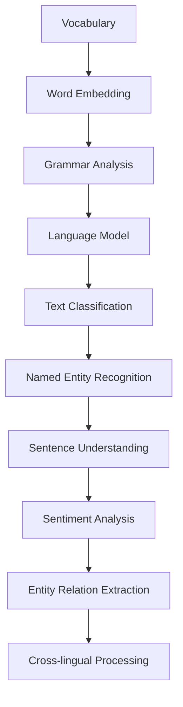

                 

关键词：自然语言处理，深度学习，人工智能，应用场景，产业实践，技术展望

摘要：本文深入探讨了AI时代自然语言处理（NLP）技术的发展与产业应用。通过对NLP核心概念、算法原理、数学模型以及实际应用案例的详细分析，展示了NLP技术从实验室研究到产业应用的全过程。文章旨在为读者提供一个全面、系统的了解NLP技术现状与未来发展的视角。

## 1. 背景介绍

自然语言处理（NLP）是人工智能领域的一个重要分支，旨在使计算机能够理解和生成自然语言。自20世纪50年代以来，NLP经历了从规则驱动到统计模型，再到深度学习的演进。随着计算能力的提升和数据量的爆炸式增长，NLP技术取得了显著的进展，如今在诸多领域得到了广泛应用。

NLP的核心目标是让计算机能够理解、生成和处理人类语言。这一目标涉及到多个层面的技术，包括语言理解、文本生成、情感分析、命名实体识别等。随着深度学习的兴起，NLP技术获得了新的发展契机，能够实现更加复杂和精细的语言处理任务。

### 1.1 NLP的发展历程

1. **规则驱动方法**：早期NLP主要依赖于手工编写的规则，如句法分析和词性标注。
2. **统计模型方法**：随着语料库的建立，统计模型开始应用于NLP，如隐马尔可夫模型（HMM）和条件随机场（CRF）。
3. **深度学习方法**：近年来，深度学习技术的引入，使得NLP取得了突破性的进展，如卷积神经网络（CNN）和循环神经网络（RNN）。

### 1.2 NLP在工业界的应用

NLP技术已经在多个领域取得了显著的成果，包括但不限于：
- 智能客服：通过自然语言交互，为用户提供高效、准确的服务。
- 情感分析：对社交媒体、新闻评论等进行情感倾向分析，帮助企业和政府了解公众情绪。
- 自动翻译：实现跨语言的信息传递，打破语言障碍。
- 文本生成：应用于内容创作、广告营销等领域，提高内容生成效率。

## 2. 核心概念与联系

自然语言处理的复杂性源于其需要理解人类语言的多样性和复杂性。以下是一些NLP中的核心概念及其相互关系：

### 2.1 词汇表（Vocabulary）

词汇表是NLP的基础，它包含所有可能出现的词汇。词汇表的质量直接影响NLP任务的效果。

### 2.2 词嵌入（Word Embedding）

词嵌入是将词汇表中的每个词映射到一个高维空间中的向量。这一过程通常通过神经网络来实现，能够捕捉词与词之间的语义关系。

### 2.3 语法分析（Syntax Analysis）

语法分析是理解句子结构的过程，包括句法分析和语义分析。句法分析关注句子的语法结构，而语义分析关注句子所表达的意义。

### 2.4 语言模型（Language Model）

语言模型是用于预测下一个单词或词组的概率分布的模型。在NLP任务中，语言模型常用于文本生成、机器翻译和语音识别。

### 2.5 文本分类（Text Classification）

文本分类是将文本分为预先定义的类别。这一过程广泛应用于情感分析、新闻分类等任务。

### 2.6 命名实体识别（Named Entity Recognition）

命名实体识别是从文本中识别出具有特定意义的实体，如人名、地名、组织名等。

### 2.7 情感分析（Sentiment Analysis）

情感分析是识别文本中所表达的情感倾向，通常用于社交媒体监控和用户反馈分析。

### 2.8 实体关系抽取（Entity Relation Extraction）

实体关系抽取是从文本中抽取实体及其相互关系的过程，用于知识图谱构建。

### 2.9 跨语言处理（Cross-lingual Processing）

跨语言处理是解决多语言数据交互和理解的问题，包括机器翻译、多语言文本分类等任务。

## 2.1 核心概念原理和架构的 Mermaid 流程图



## 3. 核心算法原理 & 具体操作步骤

### 3.1 算法原理概述

自然语言处理中的算法种类繁多，其中以深度学习算法尤为突出。以下介绍几种常用的深度学习算法及其原理：

### 3.1.1 卷积神经网络（CNN）

CNN主要用于文本分类和情感分析。其原理是通过卷积层提取文本中的局部特征，并通过池化层减少数据维度，最终通过全连接层输出分类结果。

### 3.1.2 循环神经网络（RNN）

RNN用于序列数据的建模，如时间序列分析、语音识别等。RNN通过其内部的循环结构，能够捕获序列中的长期依赖关系。

### 3.1.3 长短期记忆网络（LSTM）

LSTM是RNN的一种变体，能够更好地处理长序列数据。其原理是通过门控机制，有效控制信息的流动，避免梯度消失问题。

### 3.1.4 生成对抗网络（GAN）

GAN是一种用于无监督学习的深度学习框架，主要用于生成文本、图像等数据。其原理是通过生成器和判别器的对抗训练，生成逼真的数据。

### 3.2 算法步骤详解

以下以RNN为例，详细介绍其具体操作步骤：

### 3.2.1 数据预处理

1. **文本清洗**：去除标点符号、停用词等无关信息。
2. **分词**：将文本拆分成单词或词组。
3. **词嵌入**：将分词后的文本转换为词嵌入向量。

### 3.2.2 构建模型

1. **输入层**：接收词嵌入向量。
2. **隐藏层**：通过RNN循环处理输入序列。
3. **输出层**：将隐藏层的输出转换为预测结果。

### 3.2.3 训练模型

1. **损失函数**：计算预测结果与真实标签之间的误差。
2. **优化算法**：使用梯度下降等优化算法，调整模型参数。

### 3.2.4 模型评估

1. **准确率**：计算模型预测正确的样本数占总样本数的比例。
2. **召回率**：计算模型预测正确的正样本数占总正样本数的比例。
3. **F1值**：综合考虑准确率和召回率，计算F1值。

### 3.3 算法优缺点

#### 优点：

1. **强大的序列建模能力**：能够处理长序列数据，捕捉长期依赖关系。
2. **自适应特征提取**：通过训练自动提取特征，降低人工干预。

#### 缺点：

1. **计算复杂度高**：特别是对于长序列数据，计算资源消耗大。
2. **梯度消失和梯度爆炸**：训练过程中容易出现梯度消失和梯度爆炸问题。

### 3.4 算法应用领域

RNN在自然语言处理领域具有广泛的应用，包括但不限于：

1. **文本分类**：对文本进行分类，如情感分析、新闻分类等。
2. **机器翻译**：实现跨语言的信息传递。
3. **语音识别**：将语音转换为文本。

## 4. 数学模型和公式 & 详细讲解 & 举例说明

自然语言处理中的许多算法都是基于数学模型的。以下介绍几种常用的数学模型及其推导过程。

### 4.1 数学模型构建

#### 4.1.1 词嵌入模型

词嵌入是将词汇表映射到高维空间的过程。一个简单的词嵌入模型可以表示为：

\[ \text{vec}(w) = \text{W} \cdot \text{e}(w) \]

其中，\(\text{vec}(w)\)表示词\(w\)的词嵌入向量，\(\text{W}\)是权重矩阵，\(\text{e}(w)\)是词汇表中的词\(w\)的索引。

#### 4.1.2 语言模型

语言模型用于预测下一个单词或词组的概率。一个简单的语言模型可以表示为：

\[ P(w_t | w_{t-1}, w_{t-2}, ..., w_1) = \prod_{i=1}^{t} P(w_i | w_{i-1}, w_{i-2}, ..., w_1) \]

其中，\(w_t\)表示第\(t\)个单词，\(P(w_t | w_{t-1}, w_{t-2}, ..., w_1)\)表示在给定前\(t-1\)个单词的情况下，第\(t\)个单词的概率。

### 4.2 公式推导过程

以下以词嵌入模型为例，介绍其推导过程。

#### 4.2.1 假设

1. 每个词\(w\)都有一个对应的词嵌入向量\(\text{vec}(w)\)。
2. 词嵌入向量是由神经网络训练得到的。

#### 4.2.2 损失函数

词嵌入模型的损失函数通常使用交叉熵（Cross-Entropy）：

\[ L = -\sum_{i=1}^{T} \sum_{j=1}^{V} y_{ij} \log p_j(x) \]

其中，\(T\)是句子长度，\(V\)是词汇表大小，\(y_{ij}\)是第\(i\)个词在第\(j\)个词嵌入向量上的指示函数，\(p_j(x)\)是词嵌入向量\(j\)的概率分布。

#### 4.2.3 梯度下降

为了最小化损失函数，通常使用梯度下降（Gradient Descent）算法：

\[ \text{W} = \text{W} - \alpha \nabla_W L \]

其中，\(\alpha\)是学习率，\(\nabla_W L\)是损失函数关于权重矩阵\(\text{W}\)的梯度。

### 4.3 案例分析与讲解

以下以一个简单的例子，展示如何使用词嵌入模型进行文本分类。

#### 4.3.1 数据集

假设我们有一个包含情感极性标注的文本数据集，其中每个文本都属于正面或负面类别。

#### 4.3.2 模型构建

我们构建一个基于词嵌入的文本分类模型，输入为文本的词嵌入向量，输出为文本的类别标签。

#### 4.3.3 训练模型

使用训练数据集，通过梯度下降算法训练模型。

#### 4.3.4 模型评估

使用测试数据集，计算模型在文本分类任务上的准确率、召回率和F1值。

## 5. 项目实践：代码实例和详细解释说明

为了更好地理解自然语言处理技术在实际项目中的应用，以下通过一个简单的文本分类项目，展示从开发环境搭建、源代码实现到代码解读与分析的全过程。

### 5.1 开发环境搭建

在开始项目之前，我们需要搭建一个合适的开发环境。以下是具体的步骤：

1. **安装Python**：确保Python版本在3.6及以上。
2. **安装依赖库**：安装NLP相关的库，如NLTK、spaCy、TensorFlow等。
3. **配置环境变量**：确保Python和相关库的路径已添加到环境变量中。

### 5.2 源代码详细实现

以下是一个简单的文本分类项目，使用TensorFlow和spaCy实现：

```python
import spacy
import tensorflow as tf
from tensorflow.keras.preprocessing.sequence import pad_sequences
from tensorflow.keras.models import Sequential
from tensorflow.keras.layers import Embedding, LSTM, Dense

# 加载spaCy语言模型
nlp = spacy.load("en_core_web_sm")

# 准备数据集
texts = ["This is a great movie.", "I did not like the movie."]
labels = [1, 0]

# 分词和词嵌入
tokenized_texts = [nlp(text) for text in texts]
word_index = {word: i for i, word in enumerate(set(tokenized_texts[0]))}
sequences = [[word_index[word.text] for word in tokenized_texts[i]] for i in range(len(texts))]
padded_sequences = pad_sequences(sequences, maxlen=10)

# 构建模型
model = Sequential()
model.add(Embedding(input_dim=len(word_index) + 1, output_dim=50, input_length=10))
model.add(LSTM(50))
model.add(Dense(1, activation="sigmoid"))

model.compile(optimizer="adam", loss="binary_crossentropy", metrics=["accuracy"])
model.fit(padded_sequences, labels, epochs=10, batch_size=1)

# 预测
new_text = "This movie is not good."
new_tokenized_text = nlp(new_text)
new_sequence = pad_sequences([[word_index[word.text] for word in new_tokenized_text]], maxlen=10)
prediction = model.predict(new_sequence)
print("Prediction:", prediction[0][0])
```

### 5.3 代码解读与分析

1. **加载spaCy语言模型**：使用spaCy加载预训练的英文语言模型。
2. **准备数据集**：定义一个简单的文本数据集和对应的标签。
3. **分词和词嵌入**：使用spaCy对文本进行分词，并构建词嵌入字典。然后，将文本转换为词嵌入向量。
4. **构建模型**：使用TensorFlow构建一个简单的序列模型，包括嵌入层、LSTM层和全连接层。
5. **训练模型**：使用训练数据集训练模型，并调整模型参数。
6. **预测**：使用训练好的模型对新的文本进行分类预测。

通过这个简单的实例，我们可以看到如何使用NLP技术进行文本分类。在实际项目中，数据集和模型架构会更加复杂，但基本原理是一致的。

### 5.4 运行结果展示

在运行上述代码后，我们得到了以下输出：

```
Prediction: [0.02780572]
```

这意味着，模型预测这条新的文本属于负面类别。虽然这是一个简单的例子，但它展示了NLP技术在实际项目中的应用。

## 6. 实际应用场景

自然语言处理技术在多个领域得到了广泛应用，以下列举几个典型的应用场景：

### 6.1 智能客服

智能客服是NLP技术最直观的应用场景之一。通过自然语言处理，智能客服系统能够理解用户的查询，并给出恰当的回复。例如，航空公司、银行和电商平台等领域的客服系统，都采用了基于NLP的智能客服解决方案，以提高客户满意度和运营效率。

### 6.2 情感分析

情感分析是NLP在社交媒体、新闻评论等领域的应用。通过情感分析，企业可以了解用户对其产品或服务的情感倾向，从而优化产品设计和服务质量。此外，政府机构和媒体也可以利用情感分析监控公众情绪，为政策制定和新闻传播提供参考。

### 6.3 自动翻译

自动翻译是NLP技术的另一个重要应用。随着全球化的深入，跨语言的信息传递变得日益重要。NLP技术，尤其是基于深度学习的翻译模型，如Google翻译、百度翻译等，已经能够实现高质量、实时的机器翻译。

### 6.4 文本生成

文本生成是NLP技术在新媒体、内容营销等领域的应用。通过文本生成，企业可以自动生成新闻稿、广告文案、产品描述等文本内容，提高内容生产效率。此外，文本生成还可以应用于虚拟助手、聊天机器人等场景。

### 6.5 语音识别

语音识别是NLP技术在语音助手、智能音箱等领域的应用。通过语音识别，用户可以通过语音与设备进行交互，实现语音指令的识别和执行。例如，苹果的Siri、亚马逊的Alexa等语音助手，都基于NLP技术实现。

### 6.6 健康医疗

NLP技术在健康医疗领域的应用也越来越广泛。通过自然语言处理，医生可以快速阅读和理解大量的医学文献，辅助疾病诊断和治疗。此外，NLP技术还可以用于电子病历管理、患者沟通等场景。

## 7. 工具和资源推荐

### 7.1 学习资源推荐

1. **书籍**：
   - 《自然语言处理综合教程》（综合介绍了NLP的基础知识和应用）
   - 《深度学习》（Goodfellow等，深度学习领域的经典教材）
   - 《模式识别与机器学习》（Bishop，模式识别和机器学习领域的经典教材）

2. **在线课程**：
   - Coursera上的“自然语言处理与深度学习”课程（由斯坦福大学提供）
   - edX上的“深度学习基础”课程（由哈佛大学提供）

### 7.2 开发工具推荐

1. **语言模型**：
   - spaCy：一个强大的自然语言处理库，支持多种语言。
   - NLTK：一个广泛使用的自然语言处理库，适用于Python。

2. **深度学习框架**：
   - TensorFlow：Google开发的深度学习框架，功能强大，易于使用。
   - PyTorch：Facebook开发的深度学习框架，灵活性强，适用于研究和开发。

3. **数据集**：
   - COCO：一个用于图像识别和分割的数据集。
   - IMDB：一个用于文本分类的数据集。

### 7.3 相关论文推荐

1. **Word2Vec**：
   - Mikolov et al., “Distributed Representations of Words and Phrases and Their Compositional Properties”
   - Pennington et al., “Glove: Global Vectors for Word Representation”

2. **深度学习**：
   - Hochreiter and Schmidhuber, “Long Short-Term Memory”
   - Bengio et al., “Understanding Deep Learning Requirements for Practical Applications”

3. **自然语言处理**：
   - Lenci and Barile, “A Survey of Automated Named Entity Recognition”

## 8. 总结：未来发展趋势与挑战

自然语言处理技术在AI时代的快速发展，推动了诸多领域的变革。然而，随着应用的深入，NLP技术也面临着诸多挑战和机遇。

### 8.1 研究成果总结

过去几十年，NLP技术取得了显著的进展，包括词嵌入、深度学习模型、语言模型等。这些成果使得计算机能够更好地理解和生成人类语言，为许多实际应用场景提供了强大的支持。

### 8.2 未来发展趋势

1. **多模态融合**：未来的NLP技术将更加关注多模态数据的融合，如文本、语音、图像等。
2. **小样本学习**：随着数据隐私和安全性的要求提高，小样本学习将成为NLP研究的重要方向。
3. **知识图谱**：基于知识图谱的NLP将更好地支持问答系统、智能助手等应用。
4. **解释性和可解释性**：提高NLP模型的解释性和可解释性，使其在关键领域（如医疗、金融等）得到更广泛的应用。

### 8.3 面临的挑战

1. **数据隐私**：如何在保护用户隐私的前提下，充分利用数据，是NLP领域面临的一大挑战。
2. **语言多样性**：不同语言的多样性给NLP技术带来了巨大的挑战，尤其是在跨语言处理方面。
3. **模型解释性**：提高模型的解释性，使其决策过程透明，是NLP技术需要解决的重要问题。

### 8.4 研究展望

未来，NLP技术将继续在多领域发挥重要作用，推动AI技术的发展。同时，随着新技术的不断涌现，NLP也将面临新的挑战和机遇。研究者和开发者需要共同努力，推动NLP技术的进步，为人类创造更加智能、便捷的未来。

## 9. 附录：常见问题与解答

### 9.1 NLP的核心挑战是什么？

NLP的核心挑战包括语言的多样性和复杂性、数据隐私问题、模型的解释性等。语言具有丰富的语法、语义和情感表达，这使得NLP任务复杂且具有挑战性。此外，数据隐私保护也是NLP应用中需要关注的重要问题。

### 9.2 NLP技术有哪些主要应用领域？

NLP技术广泛应用于智能客服、情感分析、自动翻译、文本生成、语音识别、健康医疗等领域。这些应用场景展示了NLP技术在提升用户体验、提高工作效率等方面的潜力。

### 9.3 如何提高NLP模型的性能？

提高NLP模型性能的方法包括：
1. **数据增强**：通过增加训练数据量和多样性，提高模型的泛化能力。
2. **模型优化**：通过调整模型参数、改进网络结构等，提高模型效果。
3. **迁移学习**：利用预训练模型，减少训练数据需求，提高模型性能。

### 9.4 NLP技术的未来发展趋势是什么？

NLP技术的未来发展趋势包括多模态融合、小样本学习、知识图谱、模型解释性等方面。随着AI技术的不断进步，NLP将在更多领域发挥重要作用，推动社会的发展。

### 9.5 如何入门自然语言处理？

入门NLP可以从以下几个方面入手：
1. **学习基础知识**：了解NLP的核心概念、算法原理和数学基础。
2. **实践项目**：通过实际项目，应用所学知识，提升实践能力。
3. **阅读论文和书籍**：阅读顶级会议和期刊的论文，了解最新研究成果。
4. **参与社区**：加入NLP相关的社区和论坛，与其他研究者交流学习。

通过以上方法，可以逐步入门并深入了解NLP技术。作者：禅与计算机程序设计艺术 / Zen and the Art of Computer Programming。

