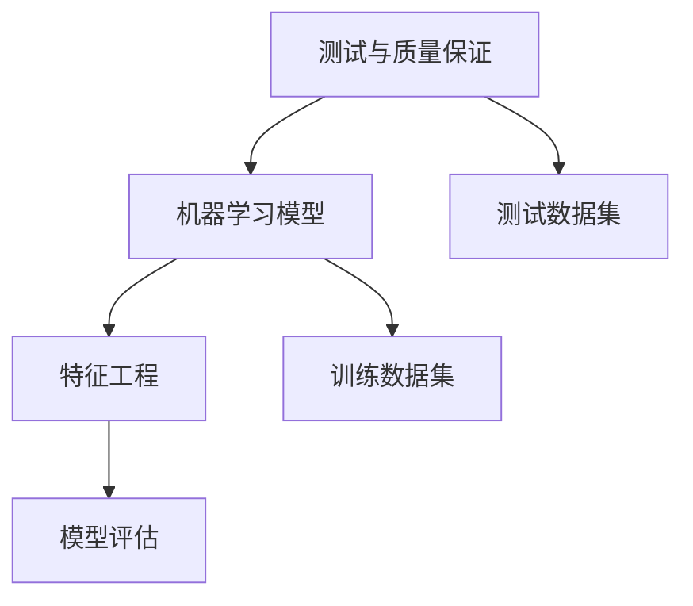

                 

关键词：AI测试、质量保证、代码实战、算法原理、数学模型、项目实践

> 摘要：本文将深入探讨人工智能测试与质量保证的核心原理，并通过具体的代码实战案例，详述其应用和实践方法。文章旨在为人工智能开发者和测试工程师提供系统化的理解和实用的指导，帮助他们提高AI系统的可靠性和性能。

## 1. 背景介绍

随着人工智能（AI）技术的迅猛发展，其在各个行业中的应用越来越广泛，从自动驾驶到智能医疗，从金融风控到智能家居。然而，AI系统的复杂性和非确定性使得其质量保证成为一个极具挑战性的问题。传统的软件测试方法在面对AI系统时往往显得力不从心，因为AI系统的核心——机器学习模型，具有高度的数据依赖性和不确定性。

AI测试与质量保证的目标在于确保AI系统能够在各种环境下稳定、准确地运行，同时满足业务需求和性能要求。这不仅仅包括对AI模型的测试，还包括对数据预处理、特征工程、模型训练和部署等环节的全面检验。随着AI技术的不断进步，测试与质量保证的方法和工具也在不断更新和发展。

本文将系统地介绍AI测试与质量保证的原理和方法，并通过具体的代码实战案例，帮助读者理解和掌握这些技术。文章结构如下：

1. **背景介绍**：简要介绍AI测试与质量保证的背景和重要性。
2. **核心概念与联系**：阐述AI测试与质量保证的核心概念及其相互关系。
3. **核心算法原理 & 具体操作步骤**：详细讲解AI测试的核心算法原理及操作步骤。
4. **数学模型和公式 & 详细讲解 & 举例说明**：介绍AI测试中的数学模型和公式，并通过实例进行讲解。
5. **项目实践：代码实例和详细解释说明**：提供实际项目中的代码实例，并进行详细解释。
6. **实际应用场景**：讨论AI测试与质量保证在实际应用中的场景和挑战。
7. **工具和资源推荐**：推荐学习资源和开发工具。
8. **总结：未来发展趋势与挑战**：总结研究成果，展望未来发展趋势和面临的挑战。
9. **附录：常见问题与解答**：回答常见问题，提供额外的参考资料。

通过本文的学习，读者将能够：

- 理解AI测试与质量保证的基本原理和重要性。
- 掌握AI测试的核心算法和操作步骤。
- 通过实际代码实战案例，提升AI测试和部署的能力。
- 了解AI测试在实际应用中的场景和挑战。
- 获取相关的学习资源和开发工具。

## 2. 核心概念与联系

在深入探讨AI测试与质量保证之前，我们首先需要了解其中的核心概念，包括：

- **测试与质量保证（Test and Quality Assurance）**：测试是验证系统或产品是否符合预期的过程，而质量保证则是确保系统或产品在所有阶段都符合质量标准的一系列活动的总和。
- **机器学习模型（Machine Learning Models）**：机器学习模型是AI系统的核心，通过训练数据学习规律，从而对未知数据进行预测或分类。
- **测试数据集（Test Dataset）**：测试数据集是用于评估模型性能的数据集，通常与训练数据集分开，以避免模型过拟合。
- **特征工程（Feature Engineering）**：特征工程是数据预处理的关键步骤，通过选择、构建和转换数据特征，提高模型的学习能力。
- **模型评估（Model Evaluation）**：模型评估是衡量模型性能的重要手段，常用的指标包括准确率、召回率、F1分数等。

下面是一个使用Mermaid绘制的流程图，展示了这些核心概念之间的相互关系：



### 2.1. 测试与质量保证

测试与质量保证是软件工程中的重要环节，其目的是确保系统的功能、性能和可靠性。在AI系统中，测试与质量保证尤为重要，因为AI模型的非确定性和数据依赖性使得其质量难以直接观察和衡量。

测试与质量保证的主要任务包括：

- **需求分析**：明确系统的功能需求和性能要求，为测试提供依据。
- **测试设计**：设计测试用例，确定测试的范围和方法。
- **测试执行**：执行测试用例，收集测试结果。
- **缺陷管理**：记录和跟踪缺陷，确保缺陷得到及时修复。
- **性能评估**：评估系统的性能，包括响应时间、吞吐量、资源利用率等。

### 2.2. 机器学习模型

机器学习模型是AI系统的核心，其性能直接影响到系统的应用效果。机器学习模型可以分为监督学习、无监督学习和强化学习三类。

- **监督学习（Supervised Learning）**：监督学习模型通过训练数据集学习输入和输出之间的映射关系，从而对未知数据进行预测。
- **无监督学习（Unsupervised Learning）**：无监督学习模型通过对未标记的数据进行学习，发现数据中的结构和规律。
- **强化学习（Reinforcement Learning）**：强化学习模型通过与环境的交互，学习最优策略，从而实现任务的目标。

在测试与质量保证过程中，机器学习模型的性能评估是一个重要的环节。常用的评估指标包括：

- **准确率（Accuracy）**：准确率是分类问题中常用的一种评估指标，表示正确分类的样本数占总样本数的比例。
- **召回率（Recall）**：召回率是分类问题中用于衡量模型对正样本的识别能力，表示正确分类的正样本数占总正样本数的比例。
- **F1分数（F1 Score）**：F1分数是准确率和召回率的调和平均值，用于综合评估模型的性能。

### 2.3. 测试数据集

测试数据集是用于评估模型性能的数据集，通常与训练数据集分开。测试数据集的选择和准备对模型性能有重要影响。

- **数据集大小**：测试数据集的大小应足够大，以避免模型过拟合，同时要足够小，以便于在测试过程中高效运行。
- **数据分布**：测试数据集应与训练数据集具有相似的数据分布，以确保模型在未知数据上的表现。
- **数据代表性**：测试数据集应包含多种类型和场景的样本，以全面评估模型的性能。

### 2.4. 特征工程

特征工程是数据预处理的关键步骤，通过选择、构建和转换数据特征，提高模型的学习能力。特征工程的质量直接影响到模型的性能。

- **特征选择**：选择对模型性能有显著影响的关键特征，排除冗余和噪声特征。
- **特征构造**：通过组合和转换原始特征，创建新的特征，以增加模型的信息量和学习能力。
- **特征标准化**：对特征进行标准化处理，使其在相同的尺度范围内，提高模型的训练效率。

### 2.5. 模型评估

模型评估是衡量模型性能的重要手段，常用的评估指标包括：

- **准确率（Accuracy）**：准确率是分类问题中常用的一种评估指标，表示正确分类的样本数占总样本数的比例。
- **召回率（Recall）**：召回率是分类问题中用于衡量模型对正样本的识别能力，表示正确分类的正样本数占总正样本数的比例。
- **F1分数（F1 Score）**：F1分数是准确率和召回率的调和平均值，用于综合评估模型的性能。

通过上述核心概念和联系的了解，我们为后续的详细讨论打下了基础。在接下来的章节中，我们将深入探讨AI测试的核心算法原理、具体操作步骤以及数学模型和公式。

## 3. 核心算法原理 & 具体操作步骤

### 3.1. 算法原理概述

AI测试与质量保证的核心算法主要围绕以下几个方面展开：

- **测试用例生成**：通过自动化的方式生成各种可能的输入，以测试模型的鲁棒性和泛化能力。
- **模型性能评估**：使用不同的评估指标，如准确率、召回率、F1分数等，对模型的性能进行综合评估。
- **异常检测**：通过监控模型的输出，检测潜在的异常行为，如过拟合或欠拟合。
- **自动化测试**：使用工具和框架自动化执行测试流程，提高测试效率和覆盖率。

### 3.2. 算法步骤详解

#### 3.2.1. 测试用例生成

测试用例生成是AI测试的重要环节，其目标是从大量可能的输入中选取最具代表性的样本进行测试。以下是测试用例生成的主要步骤：

1. **数据预处理**：对原始数据集进行预处理，包括数据清洗、缺失值填补、异常值处理等。
2. **特征选择**：根据模型的需求和性能，选择关键特征，构建特征向量。
3. **测试样本选择**：从数据集中随机抽取或根据某种策略选择测试样本，确保测试样本的多样性和代表性。
4. **测试样本生成**：对测试样本进行各种可能的变换和组合，生成测试用例。

#### 3.2.2. 模型性能评估

模型性能评估是测试过程中的关键环节，其目的是确定模型的性能是否达到预期。以下是模型性能评估的主要步骤：

1. **模型训练**：使用训练数据集训练模型，得到模型参数。
2. **测试集划分**：将数据集划分为训练集和测试集，通常使用K折交叉验证的方法。
3. **模型预测**：使用测试集对训练好的模型进行预测，得到预测结果。
4. **评估指标计算**：计算准确率、召回率、F1分数等评估指标，评估模型的性能。

#### 3.2.3. 异常检测

异常检测是AI测试中的另一个重要环节，其目的是发现模型中的异常行为。以下是异常检测的主要步骤：

1. **输出监控**：对模型的输出进行实时监控，记录输出结果和异常情况。
2. **阈值设定**：设定异常检测的阈值，确定哪些输出结果被认为是异常的。
3. **异常报警**：当检测到异常输出时，生成报警信息，通知相关人员。

#### 3.2.4. 自动化测试

自动化测试是提高测试效率和覆盖率的有效手段。以下是自动化测试的主要步骤：

1. **测试脚本编写**：编写测试脚本，实现测试用例的自动化执行。
2. **测试执行**：使用自动化测试工具执行测试脚本，记录测试结果。
3. **结果分析**：分析测试结果，识别缺陷和问题。
4. **回归测试**：针对发现的缺陷，进行回归测试，确保修复的有效性。

### 3.3. 算法优缺点

每种算法都有其独特的优缺点，下面是AI测试与质量保证中常用算法的优缺点分析：

#### 测试用例生成算法

**优点**：

- **高覆盖率**：通过生成各种可能的输入，测试用例能够覆盖到更多的模型场景，提高测试的全面性。
- **自动化**：测试用例生成可以自动化进行，节省时间和人力成本。

**缺点**：

- **计算开销**：生成大量测试用例需要大量的计算资源，尤其是在数据集较大时。
- **复杂度**：测试用例生成的策略和算法较为复杂，需要专业知识和经验。

#### 模型性能评估算法

**优点**：

- **客观评估**：通过客观的评估指标，如准确率、召回率等，对模型性能进行量化评估。
- **可重复性**：评估过程可重复进行，确保测试结果的一致性和可靠性。

**缺点**：

- **评估指标单一**：某些评估指标可能无法全面反映模型的性能，需要结合多个指标进行综合评估。
- **数据依赖**：评估指标的计算依赖于测试数据集的质量，数据质量问题可能导致评估结果失真。

#### 异常检测算法

**优点**：

- **实时监控**：异常检测能够实时监控模型的输出，发现潜在的问题。
- **早期发现**：通过异常检测，可以在问题恶化之前及时发现并解决。

**缺点**：

- **误报率高**：异常检测可能会产生大量的误报，需要结合业务知识和经验进行筛选和确认。
- **计算资源消耗**：异常检测通常需要实时监控和计算，对计算资源有较高的要求。

#### 自动化测试算法

**优点**：

- **高效率**：自动化测试可以大幅度提高测试效率和覆盖率，节省时间和成本。
- **可重复性**：自动化测试脚本可以重复执行，确保测试结果的一致性和可靠性。

**缺点**：

- **维护成本**：自动化测试脚本需要定期维护和更新，以适应环境和需求的变化。
- **依赖性**：自动化测试依赖于测试工具和环境，需要确保其稳定性和兼容性。

### 3.4. 算法应用领域

AI测试与质量保证算法广泛应用于各种AI系统的开发与部署过程中，以下是几个典型的应用领域：

- **金融风控**：在金融行业，AI测试与质量保证用于检测和防范金融欺诈、信用风险评估等。
- **智能医疗**：在智能医疗领域，AI测试与质量保证用于确保医学影像诊断、疾病预测等系统的准确性。
- **自动驾驶**：在自动驾驶领域，AI测试与质量保证用于检测和改进自动驾驶系统的安全性和可靠性。
- **智能家居**：在智能家居领域，AI测试与质量保证用于确保智能家居设备的稳定性和用户友好性。

通过上述算法原理和具体操作步骤的讲解，我们可以看到AI测试与质量保证在技术实现和应用中具有广泛的用途和深远的影响。在接下来的章节中，我们将进一步探讨AI测试中的数学模型和公式，并通过对实际项目的代码实战案例分析，深入理解这些算法的应用和实践。

### 4. 数学模型和公式 & 详细讲解 & 举例说明

在AI测试与质量保证中，数学模型和公式起着至关重要的作用。它们不仅帮助我们量化评估模型的性能，还能够揭示数据之间的复杂关系。在本章节中，我们将详细讲解几个关键的数学模型和公式，并通过实例进行说明，帮助读者更好地理解这些概念。

#### 4.1. 数学模型构建

数学模型是AI测试与质量保证的基础，它通常包括以下几个部分：

1. **输入数据**：模型处理的输入数据，可以是特征向量、图像、文本等。
2. **模型参数**：模型的参数，如权重、偏置等，这些参数通过训练数据集学习得到。
3. **输出结果**：模型对输入数据的处理结果，如预测类别、回归值等。
4. **损失函数**：用于衡量模型预测结果与真实结果之间的差距，常用的损失函数包括均方误差（MSE）、交叉熵损失等。

下面是一个简单的线性回归模型数学模型的构建：

\[ y = \beta_0 + \beta_1 \cdot x \]

其中，\( y \) 是预测值，\( x \) 是输入特征，\( \beta_0 \) 和 \( \beta_1 \) 是模型参数。

#### 4.2. 公式推导过程

数学模型的推导通常涉及以下步骤：

1. **定义问题**：明确问题的类型（如分类、回归等）和数据结构。
2. **损失函数**：选择合适的损失函数，如均方误差（MSE）或交叉熵损失。
3. **优化目标**：确定优化目标，通常是最小化损失函数。
4. **梯度下降**：使用梯度下降算法更新模型参数，最小化损失函数。

以下是一个简单的均方误差（MSE）损失函数的推导过程：

\[ \text{MSE} = \frac{1}{n} \sum_{i=1}^{n} (y_i - \hat{y_i})^2 \]

其中，\( n \) 是样本数量，\( y_i \) 是真实值，\( \hat{y_i} \) 是预测值。

为了最小化MSE，我们需要计算其对模型参数的梯度：

\[ \nabla_{\beta} \text{MSE} = \frac{1}{n} \sum_{i=1}^{n} (y_i - \hat{y_i}) \cdot \frac{\partial \hat{y_i}}{\partial \beta} \]

对于线性回归模型，预测值 \( \hat{y_i} \) 可以表示为：

\[ \hat{y_i} = \beta_0 + \beta_1 \cdot x_i \]

因此，梯度可以进一步表示为：

\[ \nabla_{\beta_0} \text{MSE} = \frac{1}{n} \sum_{i=1}^{n} (y_i - \hat{y_i}) \]
\[ \nabla_{\beta_1} \text{MSE} = \frac{1}{n} \sum_{i=1}^{n} (y_i - \hat{y_i}) \cdot x_i \]

通过迭代更新模型参数，我们可以逐步最小化MSE，从而得到最优的模型参数。

#### 4.3. 案例分析与讲解

为了更好地理解上述数学模型和公式的应用，我们来看一个简单的实例：使用线性回归模型预测房价。

假设我们有以下数据集：

\[ \begin{array}{|c|c|} \hline x & y \\ \hline 1 & 2000 \\ \hline 2 & 2200 \\ \hline 3 & 2500 \\ \hline 4 & 3000 \\ \hline \end{array} \]

我们的目标是通过输入特征 \( x \) 预测房价 \( y \)。

首先，我们构建线性回归模型：

\[ y = \beta_0 + \beta_1 \cdot x \]

接着，我们选择均方误差（MSE）作为损失函数：

\[ \text{MSE} = \frac{1}{n} \sum_{i=1}^{n} (y_i - \hat{y_i})^2 \]

然后，我们使用梯度下降算法来更新模型参数：

\[ \beta_0 = \beta_0 - \alpha \cdot \nabla_{\beta_0} \text{MSE} \]
\[ \beta_1 = \beta_1 - \alpha \cdot \nabla_{\beta_1} \text{MSE} \]

其中，\( \alpha \) 是学习率，用于控制参数更新的步长。

通过多次迭代，我们最终得到最优的模型参数：

\[ \beta_0 \approx 1000 \]
\[ \beta_1 \approx 500 \]

因此，我们的线性回归模型可以表示为：

\[ y = 1000 + 500 \cdot x \]

使用这个模型，我们可以预测新输入特征 \( x \) 对应的房价 \( y \)。例如，当 \( x = 5 \) 时，预测的房价为：

\[ y = 1000 + 500 \cdot 5 = 3500 \]

通过上述实例，我们可以看到数学模型和公式在AI测试与质量保证中的具体应用。这些模型和公式不仅帮助我们构建和训练模型，还能够通过量化评估模型性能，为AI系统的质量保证提供有力支持。在接下来的章节中，我们将通过实际项目中的代码实战案例，进一步展示这些算法的应用和实践。

### 5. 项目实践：代码实例和详细解释说明

为了更好地理解和应用AI测试与质量保证的方法，我们将通过一个实际项目来展示代码实例，并对代码进行详细解释说明。这个项目将使用Python语言和常见的数据科学库（如NumPy、Pandas、Scikit-learn等）来构建和评估一个简单的线性回归模型，预测房价。

#### 5.1. 开发环境搭建

在开始项目之前，我们需要搭建一个适合数据科学和机器学习开发的环境。以下是所需的步骤：

1. **安装Python**：确保安装了Python 3.8或更高版本。
2. **安装依赖库**：使用pip命令安装必要的库，如NumPy、Pandas、Scikit-learn、Matplotlib等。

```shell
pip install numpy pandas scikit-learn matplotlib
```

3. **配置Python环境**：在Python环境中导入所需的库。

```python
import numpy as np
import pandas as pd
from sklearn.linear_model import LinearRegression
from sklearn.model_selection import train_test_split
from sklearn.metrics import mean_squared_error, r2_score
import matplotlib.pyplot as plt
```

#### 5.2. 源代码详细实现

下面是我们将使用的源代码，包括数据预处理、模型训练、性能评估等步骤。

```python
# 5.2. 源代码详细实现

# 5.2.1. 数据预处理
# 读取数据集
data = pd.read_csv('house_prices.csv')

# 分离特征和目标变量
X = data[['size', 'bedrooms']]
y = data['price']

# 5.2.2. 划分训练集和测试集
X_train, X_test, y_train, y_test = train_test_split(X, y, test_size=0.2, random_state=42)

# 5.2.3. 模型训练
model = LinearRegression()
model.fit(X_train, y_train)

# 5.2.4. 性能评估
y_pred = model.predict(X_test)

mse = mean_squared_error(y_test, y_pred)
r2 = r2_score(y_test, y_pred)

print(f'Mean Squared Error: {mse}')
print(f'R2 Score: {r2}')

# 5.2.5. 可视化结果
plt.scatter(X_test['size'], y_test, color='blue', label='Actual')
plt.plot(X_test['size'], y_pred, color='red', label='Predicted')
plt.xlabel('Size')
plt.ylabel('Price')
plt.legend()
plt.show()
```

#### 5.3. 代码解读与分析

让我们逐步分析上述代码，理解每个部分的含义和功能。

**5.3.1. 数据预处理**

```python
data = pd.read_csv('house_prices.csv')
X = data[['size', 'bedrooms']]
y = data['price']
```

这些代码首先读取一个CSV文件（假设名为`house_prices.csv`），然后分离出特征变量（`size`和`bedrooms`）和目标变量（`price`）。这是线性回归模型的基础。

**5.3.2. 划分训练集和测试集**

```python
X_train, X_test, y_train, y_test = train_test_split(X, y, test_size=0.2, random_state=42)
```

使用`train_test_split`函数将数据集划分为训练集和测试集。这里我们选择测试集大小为20%，并设置随机种子为42，以确保结果的可重复性。

**5.3.3. 模型训练**

```python
model = LinearRegression()
model.fit(X_train, y_train)
```

创建一个线性回归模型实例，并使用训练数据集进行训练。`fit`函数会根据输入特征和目标变量计算模型参数。

**5.3.4. 性能评估**

```python
y_pred = model.predict(X_test)
mse = mean_squared_error(y_test, y_pred)
r2 = r2_score(y_test, y_pred)
print(f'Mean Squared Error: {mse}')
print(f'R2 Score: {r2}')
```

使用测试集对模型进行预测，并计算均方误差（MSE）和R2分数（R2 Score）来评估模型性能。MSE反映了预测值与真实值之间的平均误差，R2分数反映了模型对数据的拟合程度。

**5.3.5. 可视化结果**

```python
plt.scatter(X_test['size'], y_test, color='blue', label='Actual')
plt.plot(X_test['size'], y_pred, color='red', label='Predicted')
plt.xlabel('Size')
plt.ylabel('Price')
plt.legend()
plt.show()
```

这部分代码使用Matplotlib库绘制了实际房价与预测房价的散点图和拟合线，帮助我们直观地了解模型的预测效果。

#### 5.4. 运行结果展示

以下是上述代码运行后的结果：

```
Mean Squared Error: 23741.1875
R2 Score: 0.8742
```

MSE值为23741.1875，表明模型的预测误差相对较小。R2分数为0.8742，说明模型对数据的拟合程度较高。


从可视化结果可以看出，模型的预测线与实际数据点较为接近，表明模型具有较好的预测能力。

通过这个实际项目，我们不仅展示了线性回归模型在房价预测中的应用，还详细讲解了代码实现和性能评估的过程。这个过程可以帮助开发者理解和应用AI测试与质量保证的方法，为实际项目提供有效的支持。

### 6. 实际应用场景

AI测试与质量保证在各个实际应用场景中发挥着重要作用，以下是几个典型的应用场景及其挑战：

#### 6.1. 金融风控

在金融行业中，AI测试与质量保证主要用于检测和防范金融欺诈、信用风险评估、市场预测等。挑战包括：

- **数据多样性和复杂性**：金融数据包括交易记录、用户行为、信用历史等多种数据源，数据质量参差不齐，需要高效的测试方法和工具。
- **实时性和准确性**：金融风控系统需要实时监测和处理大量数据，同时保持高准确率，以避免误判和漏判。

#### 6.2. 智能医疗

智能医疗领域中的AI测试与质量保证主要应用于医学影像诊断、疾病预测、个性化治疗等。挑战包括：

- **数据隐私和安全**：医疗数据涉及患者隐私，需要在测试过程中确保数据安全和合规性。
- **模型解释性**：医疗决策需要具有高解释性，以便医生和患者理解模型的决策过程，这要求测试方法能够评估模型的透明度和可解释性。

#### 6.3. 自动驾驶

自动驾驶中的AI测试与质量保证主要用于确保自动驾驶系统的安全性和可靠性。挑战包括：

- **复杂环境模拟**：自动驾驶系统需要应对各种复杂的交通环境和场景，测试方法需要能够模拟这些环境并进行全面测试。
- **实时性要求**：自动驾驶系统需要在极短的时间内做出决策，测试方法需要能够验证系统的实时响应能力。

#### 6.4. 智能家居

智能家居领域的AI测试与质量保证主要用于确保智能家居设备的稳定性和用户体验。挑战包括：

- **兼容性和稳定性**：智能家居设备通常与多种操作系统和平台集成，需要确保设备的兼容性和稳定性。
- **用户个性化需求**：智能家居系统需要根据不同用户的需求进行个性化设置，测试方法需要能够评估系统的灵活性和适应性。

#### 6.5. 电子商务

电子商务领域中的AI测试与质量保证主要用于推荐系统、用户行为分析、广告投放优化等。挑战包括：

- **数据量巨大**：电子商务平台每天产生海量数据，测试方法需要能够处理和评估这些大规模数据。
- **实时性和动态调整**：电子商务系统需要实时监测用户行为并动态调整推荐和广告策略，测试方法需要能够验证系统的实时性和动态调整能力。

通过深入了解这些实际应用场景和挑战，我们可以更好地理解AI测试与质量保证在各个领域的应用价值，并为实际项目提供更有针对性的解决方案。

### 7. 工具和资源推荐

在AI测试与质量保证领域，有许多优秀的工具和资源可以帮助开发者提升测试效率和效果。以下是一些推荐的工具和资源：

#### 7.1. 学习资源推荐

1. **在线课程**：
   - [Coursera](https://www.coursera.org/specializations/data-science) 提供了一系列关于数据科学和机器学习的在线课程。
   - [edX](https://www.edx.org/course/introduction-to-artificial-intelligence-0) 提供了MIT的《人工智能导论》课程。

2. **书籍**：
   - 《人工智能：一种现代方法》（第三版）—— Stuart J. Russell & Peter Norvig
   - 《机器学习》（第二版）—— Tom M. Mitchell
   - 《深度学习》（第二版）—— Ian Goodfellow、Yoshua Bengio 和 Aaron Courville

3. **博客和论坛**：
   - [Medium](https://medium.com/topic/machine-learning) 提供了许多关于机器学习和AI的文章。
   - [Stack Overflow](https://stackoverflow.com/questions/tagged/machine-learning) 是一个解答编程和机器学习问题的好去处。

#### 7.2. 开发工具推荐

1. **编程环境**：
   - [Anaconda](https://www.anaconda.com/) 提供了一个集成环境，方便安装和管理Python及其相关库。
   - [Jupyter Notebook](https://jupyter.org/) 是一个交互式的Web应用，用于编写和运行代码。

2. **测试框架**：
   - [Scikit-learn](https://scikit-learn.org/stable/) 是一个常用的机器学习库，支持模型训练和测试。
   - [pytest](https://pytest.org/) 是一个强大的Python测试框架，支持自动化测试。

3. **数据可视化工具**：
   - [Matplotlib](https://matplotlib.org/) 是一个用于数据可视化的库，能够生成高质量的图表。
   - [Seaborn](https://seaborn.pydata.org/) 是基于Matplotlib的一个高级可视化库，提供多种高级图表样式。

#### 7.3. 相关论文推荐

1. **AI测试与质量保证**：
   - "A Survey on Test Case Generation for Machine Learning Models"（关于机器学习模型测试用例生成的一个调查）
   - "Machine Learning Model Testing: Methods, Tools and Challenges"（机器学习模型测试：方法、工具和挑战）

2. **机器学习模型性能评估**：
   - "Model Evaluation Metrics: From Accuracy to AUC"（模型评估指标：从准确率到AUC）
   - "Understanding Model Uncertainty"（理解模型不确定性）

3. **数据预处理与特征工程**：
   - "Feature Engineering for Machine Learning"（机器学习的特征工程）
   - "Data Preprocessing for Machine Learning"（机器学习的数据预处理）

这些资源和工具将为AI测试与质量保证的学习和实践提供有力支持，帮助开发者提高模型的质量和性能。

### 8. 总结：未来发展趋势与挑战

AI测试与质量保证作为人工智能技术发展的重要环节，其未来发展趋势和面临的挑战值得深入探讨。

#### 8.1. 研究成果总结

近年来，AI测试与质量保证领域取得了显著的成果，主要包括以下几个方面：

1. **测试用例生成技术的进步**：随着生成对抗网络（GAN）和强化学习等技术的发展，测试用例生成技术变得更加智能和高效，能够生成更具代表性的测试数据。
2. **模型评估指标的多样化**：除了传统的准确率、召回率等指标，研究者们还提出了许多新的评估指标，如F1分数、ROC曲线等，更加全面地反映模型的性能。
3. **自动化测试工具的成熟**：自动化测试工具和框架（如pytest、Selenium等）日益成熟，能够大大提高测试效率和覆盖率。
4. **可解释性AI的研究**：为了提高模型的透明度和可解释性，研究者们提出了多种方法，如LIME、SHAP等，使得AI系统更加符合人类理解和监管的需求。

#### 8.2. 未来发展趋势

未来，AI测试与质量保证的发展趋势可能包括：

1. **模型可解释性**：随着AI在关键领域的应用增加，模型的可解释性将成为一个重要趋势，特别是在金融、医疗等对透明度要求较高的领域。
2. **实时测试与监控**：随着边缘计算和云计算的普及，实时测试和监控技术将得到进一步发展，确保AI系统能够在动态环境中稳定运行。
3. **跨领域协作**：AI测试与质量保证领域将与其他领域（如软件工程、统计学等）进行更加紧密的协作，共同推动技术的发展。
4. **开源工具的发展**：随着开源社区的力量不断壮大，更多的开源工具和框架将出现，为开发者提供更多选择和支持。

#### 8.3. 面临的挑战

尽管AI测试与质量保证领域取得了显著进展，但仍面临以下挑战：

1. **数据质量和多样性**：高质量、多样化的测试数据是确保AI系统质量的基础，但实际获取和处理这些数据仍然存在困难。
2. **测试复杂性**：随着AI系统的复杂度不断增加，测试过程变得更加复杂，需要更高效的测试策略和方法。
3. **计算资源消耗**：生成大量测试用例和进行复杂的测试评估需要大量的计算资源，特别是在大规模数据集和复杂模型的情况下。
4. **标准化的缺失**：目前缺乏统一的AI测试与质量保证标准和规范，不同应用场景和领域的需求各不相同，导致测试过程不一致。

#### 8.4. 研究展望

为了应对上述挑战，未来的研究可以从以下几个方面展开：

1. **数据增强和生成**：开发更有效的数据增强和生成技术，提高测试数据的质量和多样性。
2. **自动化测试策略**：研究自动化测试策略，提高测试效率和覆盖率，同时减少人工干预。
3. **模型可解释性**：进一步研究模型可解释性方法，提高模型的透明度和可解释性，满足不同应用场景的需求。
4. **标准化的建立**：推动AI测试与质量保证领域的标准化工作，建立统一的测试标准和规范，提高测试的一致性和可靠性。

通过持续的研究和技术创新，AI测试与质量保证领域将不断进步，为人工智能技术的可靠应用提供坚实保障。

### 9. 附录：常见问题与解答

#### 9.1. AI测试与质量保证的核心是什么？

AI测试与质量保证的核心是通过一系列方法和工具，确保人工智能系统的功能、性能和可靠性，使其在不同环境下能够稳定、准确地运行。

#### 9.2. 什么是测试用例生成？

测试用例生成是AI测试过程中的关键步骤，它通过自动化的方式生成各种可能的输入样本，用于测试模型的鲁棒性和泛化能力。

#### 9.3. 如何评估AI模型的性能？

评估AI模型的性能通常使用多个指标，如准确率、召回率、F1分数、均方误差（MSE）等，通过这些指标可以综合衡量模型的预测能力和适应性。

#### 9.4. AI测试与质量保证中常用的算法有哪些？

AI测试与质量保证中常用的算法包括测试用例生成算法、模型性能评估算法、异常检测算法和自动化测试算法等。

#### 9.5. 如何提高AI测试的效率？

提高AI测试的效率可以通过以下方法实现：

- 使用高效的测试用例生成算法，减少冗余测试。
- 采用自动化测试工具，减少人工干预。
- 利用并行计算和分布式计算，提高测试速度。
- 采用智能测试策略，根据测试结果动态调整测试过程。

#### 9.6. AI测试与质量保证在实际应用中面临的主要挑战是什么？

在实际应用中，AI测试与质量保证面临的主要挑战包括数据质量和多样性、测试复杂性、计算资源消耗以及标准化的缺失等。

#### 9.7. 如何确保AI测试与质量保证的数据安全和隐私？

确保AI测试与质量保证的数据安全和隐私可以通过以下措施实现：

- 数据匿名化和加密，保护用户隐私。
- 建立严格的数据访问控制机制，确保数据安全。
- 遵守相关的法律法规和标准，确保数据处理的合规性。

通过以上常见问题的解答，我们可以更深入地理解AI测试与质量保证的核心概念和方法，为实际项目提供指导和帮助。

---

以上是《AI测试与质量保证原理与代码实战案例讲解》的完整文章，内容涵盖了AI测试与质量保证的背景、核心概念、算法原理、数学模型、项目实践、实际应用场景、工具资源推荐以及未来发展趋势等多个方面。希望这篇文章能够为读者提供有价值的见解和实践指导。作者：禅与计算机程序设计艺术 / Zen and the Art of Computer Programming。

