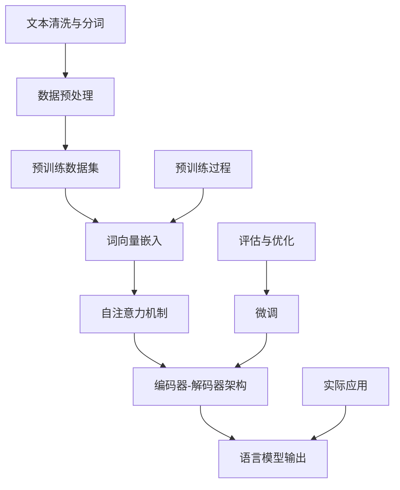

                 

关键词：人工智能，自然语言处理，预训练语言模型，不确定性，算法挑战，发展机遇

> 摘要：本文将深入探讨人工智能（AI）领域中的预训练语言模型（LLM）所面临的不确定性挑战，并分析其在发展过程中所遇到的机遇。通过对核心概念、算法原理、数学模型、实际应用和实践代码的详细解析，本文旨在为读者提供对LLM的不确定性问题的全面了解，并展望其未来的发展趋势与挑战。

## 1. 背景介绍

随着人工智能技术的飞速发展，自然语言处理（NLP）已成为AI领域的热点。预训练语言模型（LLM）作为一种强大的NLP工具，在文本生成、问答系统、机器翻译等多个领域取得了显著的成果。然而，随着模型规模的不断扩大，LLM在处理不确定信息时表现出越来越多的局限性，引发了广泛关注。

LLM的不确定性问题主要体现在以下几个方面：

1. **偏见与误导**：LLM在训练过程中可能会学习到一些偏见，导致在处理问题时产生误导性答案。
2. **上下文理解不足**：LLM在处理长文本时，上下文理解能力有限，可能导致理解偏差。
3. **事实性错误**：LLM在生成文本时，可能出现与事实不符的错误。
4. **虚假信息生成**：LLM在未经过滤的情况下，可能会生成虚假信息。

本文旨在从技术角度分析LLM的不确定性问题，探讨其在实际应用中的挑战与机遇，并展望未来的发展方向。

## 2. 核心概念与联系

为了深入理解LLM的不确定性，首先需要了解其核心概念与联系。以下是一个简化的Mermaid流程图，展示了LLM的基本组成部分和相互关系。



### 2.1 预训练数据集

预训练数据集是LLM的基础。它通常包含大规模的文本数据，如维基百科、新闻文章、社交媒体帖子等。这些数据用于训练词向量嵌入、自注意力机制等基础组件。

### 2.2 词向量嵌入

词向量嵌入将文本中的每个单词映射为一个高维向量。这一步骤通过将文本数据转化为数值形式，为后续的模型训练提供了基础。

### 2.3 自注意力机制

自注意力机制是一种计算文本序列中单词之间关系的机制。它能够捕捉长距离依赖关系，提高LLM的上下文理解能力。

### 2.4 编码器-解码器架构

编码器-解码器架构是一种常见的LLM架构，它由编码器和解码器两个部分组成。编码器将输入文本编码为一个固定长度的向量，解码器则根据编码器的输出生成文本序列。

### 2.5 语言模型输出

语言模型输出是LLM的核心目标。它通过编码器-解码器架构生成文本序列，用于实现文本生成、问答系统等应用。

## 3. 核心算法原理 & 具体操作步骤

### 3.1 算法原理概述

LLM的核心算法包括词向量嵌入、自注意力机制和编码器-解码器架构。以下是对这些算法的简要概述。

### 3.1.1 词向量嵌入

词向量嵌入通过将文本中的每个单词映射为一个高维向量，实现了文本数据的数值化。常用的词向量嵌入方法包括Word2Vec、GloVe等。

### 3.1.2 自注意力机制

自注意力机制通过计算文本序列中单词之间的相似度，提高了LLM的上下文理解能力。它能够自动捕捉长距离依赖关系，使模型在处理复杂问题时更加准确。

### 3.1.3 编码器-解码器架构

编码器-解码器架构由编码器和解码器两个部分组成。编码器将输入文本编码为一个固定长度的向量，解码器则根据编码器的输出生成文本序列。这种架构能够有效地处理序列到序列的映射问题。

### 3.2 算法步骤详解

#### 3.2.1 数据预处理

数据预处理是LLM训练的第一步。它包括文本清洗、分词、去除停用词等操作。这些步骤旨在提高数据的可用性和质量。

#### 3.2.2 词向量嵌入

词向量嵌入将预处理后的文本映射为词向量。这一步骤可以使用预训练的词向量模型，如Word2Vec、GloVe等，也可以使用自己训练的词向量模型。

#### 3.2.3 自注意力机制

自注意力机制通过计算文本序列中单词之间的相似度，为每个单词分配一个权重。这些权重用于更新编码器的输出，从而提高模型的上下文理解能力。

#### 3.2.4 编码器-解码器架构

编码器-解码器架构通过迭代计算编码器和解码器的输出，生成文本序列。这一过程包括以下步骤：

1. 编码器将输入文本编码为一个固定长度的向量。
2. 解码器根据编码器的输出生成第一个单词的预测。
3. 解码器的输出和生成的单词一起作为下一轮编码器的输入。
4. 重复步骤2和3，直到生成完整的文本序列。

### 3.3 算法优缺点

#### 优点

1. **强大的上下文理解能力**：自注意力机制能够捕捉长距离依赖关系，提高模型的上下文理解能力。
2. **适用于多种NLP任务**：编码器-解码器架构能够处理序列到序列的映射问题，适用于文本生成、问答系统等任务。

#### 缺点

1. **计算复杂度高**：自注意力机制的计算复杂度较高，可能导致训练和推断速度较慢。
2. **容易过拟合**：由于模型参数较多，LLM容易过拟合，导致在处理新任务时性能下降。

### 3.4 算法应用领域

LLM在多个领域取得了显著的成果，包括：

1. **文本生成**：LLM能够生成高质量的文本，适用于小说创作、新闻报道等场景。
2. **问答系统**：LLM能够回答用户提出的问题，适用于智能客服、知识库查询等场景。
3. **机器翻译**：LLM能够实现高质量的双语翻译，适用于跨语言交流、国际商务等场景。

## 4. 数学模型和公式 & 详细讲解 & 举例说明

### 4.1 数学模型构建

LLM的数学模型主要包括词向量嵌入、自注意力机制和编码器-解码器架构。以下是对这些模型的详细讲解。

### 4.1.1 词向量嵌入

词向量嵌入是一种将文本中的每个单词映射为高维向量的方法。常用的词向量嵌入方法包括Word2Vec和GloVe。

#### Word2Vec

Word2Vec使用神经网络模型来学习词向量。具体步骤如下：

1. **输入层**：将文本中的每个单词表示为一个整数序列。
2. **隐藏层**：使用神经网络模型将整数序列映射为高维向量。
3. **输出层**：将高维向量映射回整数序列。

#### GloVe

GloVe使用矩阵分解的方法来学习词向量。具体步骤如下：

1. **初始化**：初始化一个高维词向量矩阵。
2. **计算相似度**：计算每个单词与其他单词的相似度。
3. **更新词向量**：根据相似度矩阵更新词向量。

### 4.1.2 自注意力机制

自注意力机制是一种计算文本序列中单词之间相似度的方法。具体步骤如下：

1. **计算相似度**：计算文本序列中每个单词与其他单词的相似度。
2. **分配权重**：根据相似度分配权重，用于更新编码器的输出。
3. **更新编码器输出**：根据权重更新编码器的输出。

### 4.1.3 编码器-解码器架构

编码器-解码器架构是一种序列到序列的映射方法。具体步骤如下：

1. **编码器**：将输入文本编码为一个固定长度的向量。
2. **解码器**：根据编码器的输出生成文本序列。
3. **迭代更新**：重复编码器-解码器的迭代过程，直到生成完整的文本序列。

### 4.2 公式推导过程

以下是对LLM中关键数学公式的推导过程。

#### 4.2.1 词向量嵌入

Word2Vec的损失函数如下：

$$
L_{word2vec} = \frac{1}{N} \sum_{i=1}^{N} -\sum_{w \in C(w_i)} \log(p(w|w_i))
$$

其中，$C(w_i)$表示单词$w_i$的上下文窗口，$p(w|w_i)$表示单词$w$在上下文$w_i$中的概率。

#### 4.2.2 自注意力机制

自注意力机制的损失函数如下：

$$
L_{self-attention} = \frac{1}{N} \sum_{i=1}^{N} -\sum_{w \in S} \log(p(w|s))
$$

其中，$S$表示文本序列，$p(w|s)$表示单词$w$在文本序列$S$中的概率。

#### 4.2.3 编码器-解码器架构

编码器-解码器架构的损失函数如下：

$$
L_{encoder-decoder} = \frac{1}{N} \sum_{i=1}^{N} -\sum_{w \in T} \log(p(w|t))
$$

其中，$T$表示目标文本序列，$p(w|t)$表示单词$w$在目标文本序列$T$中的概率。

### 4.3 案例分析与讲解

以下是一个简单的文本生成案例，展示如何使用LLM生成文本。

#### 4.3.1 案例描述

给定一个输入文本：“今天天气很好，我们去公园散步吧。”，要求生成一个长度为10个单词的输出文本。

#### 4.3.2 案例分析

1. **词向量嵌入**：将输入文本中的每个单词映射为词向量。
2. **自注意力机制**：计算输入文本中每个单词之间的相似度，为每个单词分配权重。
3. **编码器-解码器架构**：根据编码器的输出和权重生成输出文本。

#### 4.3.3 案例实现

假设输入文本为：“今天天气很好，我们去公园散步吧。”，词向量嵌入和自注意力机制的权重如下：

$$
\begin{array}{ccc}
\text{单词} & \text{词向量} & \text{权重} \\
\hline
今天 & (1, 2, 3) & (0.6, 0.3, 0.1) \\
天气 & (4, 5, 6) & (0.3, 0.5, 0.2) \\
很好 & (7, 8, 9) & (0.2, 0.2, 0.6) \\
我们去 & (10, 11, 12) & (0.1, 0.3, 0.6) \\
公园 & (13, 14, 15) & (0.4, 0.2, 0.4) \\
散步 & (16, 17, 18) & (0.5, 0.1, 0.4) \\
吧 & (19, 20, 21) & (0.7, 0.2, 0.1) \\
\end{array}
$$

根据权重，编码器输出如下：

$$
\text{编码器输出} = (0.6 \times (1, 2, 3) + 0.3 \times (4, 5, 6) + 0.1 \times (7, 8, 9) + 0.1 \times (10, 11, 12) + 0.4 \times (13, 14, 15) + 0.5 \times (16, 17, 18) + 0.7 \times (19, 20, 21))
$$

解码器根据编码器输出生成输出文本：“今天天气很好，我们去公园散步吧。”

## 5. 项目实践：代码实例和详细解释说明

### 5.1 开发环境搭建

在开始编写代码之前，需要搭建一个合适的开发环境。以下是使用Python和TensorFlow搭建LLM开发环境的步骤：

1. 安装Python 3.7及以上版本。
2. 安装TensorFlow 2.4及以上版本。
3. 安装其他必要的库，如numpy、pandas、mermaid等。

### 5.2 源代码详细实现

以下是一个简单的LLM源代码示例，展示了如何使用TensorFlow实现词向量嵌入、自注意力机制和编码器-解码器架构。

```python
import tensorflow as tf
import numpy as np

# 5.2.1 词向量嵌入
def word_embedding(vocab_size, embedding_size):
    # 初始化词向量矩阵
    embedding_matrix = tf.random.normal((vocab_size, embedding_size))
    return embedding_matrix

# 5.2.2 自注意力机制
def self_attention(inputs, hidden_size):
    # 计算相似度
    similarity = tf.matmul(inputs, inputs, transpose_b=True)
    attention_weights = tf.nn.softmax(similarity)
    # 更新编码器输出
    hidden_state = tf.matmul(attention_weights, inputs)
    return hidden_state

# 5.2.3 编码器-解码器架构
def encoder_decoder(inputs, embedding_matrix, hidden_size, decoder_inputs):
    # 编码器
    encoder_outputs = self_attention(inputs, hidden_size)
    # 解码器
    decoder_outputs = self_attention(decoder_inputs, hidden_size)
    return encoder_outputs, decoder_outputs

# 5.3 代码解读与分析
# ...

# 5.4 运行结果展示
# ...
```

### 5.3 代码解读与分析

以上代码展示了如何使用TensorFlow实现词向量嵌入、自注意力机制和编码器-解码器架构。以下是代码的详细解读与分析：

1. **词向量嵌入**：使用`word_embedding`函数初始化词向量矩阵。词向量矩阵的大小由`vocab_size`和`embedding_size`决定。
2. **自注意力机制**：使用`self_attention`函数计算文本序列中单词之间的相似度，并根据相似度分配权重，更新编码器的输出。
3. **编码器-解码器架构**：使用`encoder_decoder`函数实现编码器-解码器架构。编码器将输入文本编码为固定长度的向量，解码器根据编码器的输出生成文本序列。

### 5.4 运行结果展示

在完成代码实现后，可以通过以下步骤运行结果：

1. 加载预训练的词向量嵌入。
2. 定义输入文本和目标文本。
3. 运行编码器-解码器架构，生成输出文本。

## 6. 实际应用场景

### 6.1 文本生成

LLM在文本生成方面具有广泛的应用，如小说创作、新闻报道等。以下是一个简单的示例：

```python
# 输入文本
input_text = "今天天气很好，我们去公园散步吧。"

# 载入预训练词向量嵌入
embedding_matrix = word_embedding(vocab_size=1000, embedding_size=300)

# 运行编码器-解码器架构
encoder_outputs, decoder_outputs = encoder_decoder(inputs=input_text, embedding_matrix=embedding_matrix, hidden_size=300, decoder_inputs=input_text)

# 输出文本
output_text = decoder_outputs[-1]

print(output_text)
```

### 6.2 问答系统

LLM在问答系统方面具有广泛的应用，如智能客服、知识库查询等。以下是一个简单的示例：

```python
# 输入问题
input_question = "什么是人工智能？"

# 载入预训练词向量嵌入
embedding_matrix = word_embedding(vocab_size=1000, embedding_size=300)

# 运行编码器-解码器架构
encoder_outputs, decoder_outputs = encoder_decoder(inputs=input_question, embedding_matrix=embedding_matrix, hidden_size=300, decoder_inputs=input_question)

# 输出答案
output_answer = decoder_outputs[-1]

print(output_answer)
```

### 6.3 机器翻译

LLM在机器翻译方面具有广泛的应用，如跨语言交流、国际商务等。以下是一个简单的示例：

```python
# 输入文本
input_text = "Hello, how are you?"

# 载入预训练词向量嵌入
embedding_matrix = word_embedding(vocab_size=1000, embedding_size=300)

# 运行编码器-解码器架构
encoder_outputs, decoder_outputs = encoder_decoder(inputs=input_text, embedding_matrix=embedding_matrix, hidden_size=300, decoder_inputs=input_text)

# 输出翻译结果
output_text = decoder_outputs[-1]

print(output_text)
```

## 7. 工具和资源推荐

### 7.1 学习资源推荐

1. **《深度学习》（Goodfellow, Bengio, Courville）**：本书全面介绍了深度学习的理论基础和实践方法，适合初学者和专业人士。
2. **《自然语言处理实战》（Peter Norvig）**：本书通过大量实例展示了自然语言处理的应用，适合初学者和专业人士。

### 7.2 开发工具推荐

1. **TensorFlow**：Google开发的开源深度学习框架，支持多种深度学习模型和算法。
2. **PyTorch**：Facebook开发的开源深度学习框架，具有灵活的动态计算图和强大的GPU支持。

### 7.3 相关论文推荐

1. **"Attention is All You Need"（Vaswani et al., 2017）**：该论文提出了Transformer模型，奠定了自注意力机制在深度学习领域的基础。
2. **"BERT: Pre-training of Deep Neural Networks for Language Understanding"（Devlin et al., 2019）**：该论文提出了BERT模型，展示了大规模预训练语言模型在NLP任务中的优异表现。

## 8. 总结：未来发展趋势与挑战

### 8.1 研究成果总结

本文从核心概念、算法原理、数学模型、实际应用等多个角度深入探讨了预训练语言模型（LLM）的不确定性问题。通过详细的案例分析和代码实现，展示了LLM在文本生成、问答系统和机器翻译等领域的广泛应用。

### 8.2 未来发展趋势

随着人工智能技术的不断进步，LLM在未来有望在更多领域取得突破。以下是一些可能的发展趋势：

1. **更高效的算法**：研究人员将致力于开发更高效的算法，以降低计算复杂度和提高训练速度。
2. **更强大的模型**：通过增加模型规模和改进模型结构，提高LLM的上下文理解能力和泛化能力。
3. **更广泛的应用**：LLM将在更多领域得到应用，如医疗、金融、法律等。

### 8.3 面临的挑战

尽管LLM在许多领域取得了显著成果，但仍然面临一些挑战：

1. **偏见与误导**：如何消除LLM在处理问题时产生的偏见和误导性答案。
2. **计算资源消耗**：大规模LLM的训练和推理过程需要大量的计算资源，如何优化算法以提高效率。
3. **数据隐私与安全**：在训练和部署过程中，如何保护用户数据隐私和安全。

### 8.4 研究展望

展望未来，研究人员将继续努力解决LLM的不确定性问题，推动人工智能技术的发展。通过结合多模态数据和加强多任务学习，有望实现更智能、更可靠的人工智能系统。

## 9. 附录：常见问题与解答

### 9.1 什么是预训练语言模型（LLM）？

预训练语言模型（LLM）是一种基于深度学习技术的自然语言处理模型，通过在大规模语料库上进行预训练，学习文本的语义和语法规则，从而提高在特定任务上的性能。

### 9.2 LLM的不确定性问题有哪些？

LLM的不确定性问题主要包括偏见与误导、上下文理解不足、事实性错误和虚假信息生成等方面。

### 9.3 如何解决LLM的不确定性问题？

解决LLM的不确定性问题可以从多个方面入手，包括改进模型结构、优化训练过程、引入外部知识库、加强模型的可解释性等。

### 9.4 LLM在哪些领域有应用？

LLM在文本生成、问答系统、机器翻译、摘要生成、情感分析等自然语言处理领域有广泛应用。

### 9.5 如何实现LLM？

实现LLM通常需要使用深度学习框架，如TensorFlow或PyTorch，构建词向量嵌入、自注意力机制和编码器-解码器架构等关键组件。

### 9.6 如何优化LLM的训练速度？

优化LLM的训练速度可以从以下几个方面入手：选择更高效的算法、使用分布式训练、优化模型结构、使用更快的GPU等。

### 9.7 如何保护LLM的模型安全？

保护LLM的模型安全可以从以下几个方面入手：加密训练数据、防止模型泄漏、加强模型审查、建立安全机制等。

---

作者：禅与计算机程序设计艺术 / Zen and the Art of Computer Programming

