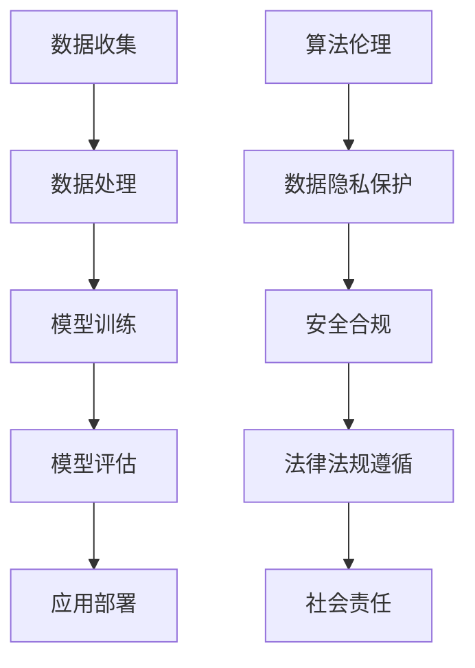

                 

关键词：人工智能、法律法规、代码实战、算法原理、数学模型、未来展望

摘要：本文将深入探讨人工智能领域的相关法律法规原理，并辅以代码实战案例进行详细讲解。通过梳理核心概念、算法原理、数学模型以及实际应用场景，本文旨在为读者提供一个全面而实用的AI法律知识体系，助力人工智能技术的健康发展和应用。

## 1. 背景介绍

### 1.1 人工智能的崛起与挑战

人工智能（AI）作为当前科技领域的明星技术，正在迅速改变着我们的生活和工作方式。从自然语言处理、图像识别到自动驾驶、智能医疗，AI的应用已经渗透到各行各业。然而，随着AI技术的不断进步，也带来了诸多挑战，包括数据隐私、算法偏见、安全风险等问题。

### 1.2 人工智能法律法规的重要性

为了确保AI技术的健康发展，世界各国纷纷制定相关的法律法规进行规范。这些法律不仅保护了公民的隐私权利，也确保了AI技术的公正、透明和可靠。在中国，例如《人工智能发展行动计划（2021-2023年）》和《中华人民共和国个人信息保护法》等法规，都对AI的应用和发展提出了明确的要求。

## 2. 核心概念与联系

下面，我们将借助Mermaid流程图来描述人工智能领域的核心概念及其相互联系。



### 2.1 数据收集

数据是AI的基石，数据收集的过程必须遵循相关法律法规，确保数据的合法性和准确性。

### 2.2 数据处理

数据处理涉及到数据清洗、预处理等步骤，这些步骤必须确保数据的完整性和一致性。

### 2.3 模型训练

模型训练是AI的核心步骤，需要根据业务需求选择合适的算法和模型。

### 2.4 模型评估

模型评估是验证AI系统性能的关键步骤，通常使用准确率、召回率等指标进行衡量。

### 2.5 应用部署

应用部署是将训练好的模型投入实际使用的过程，需要考虑系统的可扩展性和可靠性。

### 2.6 算法伦理

算法伦理关注AI系统的公平性、透明性和无偏见性，确保其符合伦理标准。

### 2.7 数据隐私保护

数据隐私保护是保护公民个人信息的重要措施，涉及数据的加密、匿名化等技术。

### 2.8 安全合规

安全合规确保AI系统的安全性，防范潜在的安全威胁和风险。

### 2.9 法律法规遵循

法律法规遵循是AI应用必须遵守的基本原则，确保技术符合法律要求。

### 2.10 社会责任

社会责任强调AI技术在推动社会进步的同时，也要关注对环境和社会的影响。

## 3. 核心算法原理 & 具体操作步骤

### 3.1 算法原理概述

人工智能的核心在于算法，常见的算法包括机器学习、深度学习等。这些算法通过训练模型来学习数据特征，并基于这些特征进行预测和决策。

### 3.2 算法步骤详解

#### 3.2.1 数据预处理

数据预处理是训练模型前的关键步骤，包括数据清洗、归一化、缺失值填充等。

```python
# 示例：数据清洗
data = data[data['column1'].notnull()]
```

#### 3.2.2 模型选择

选择合适的模型对于训练效果至关重要，可以根据业务需求选择不同的算法。

```python
# 示例：选择模型
model = LinearRegression()
```

#### 3.2.3 模型训练

模型训练是让模型学习数据特征的过程，常用的方法包括梯度下降、反向传播等。

```python
# 示例：模型训练
model.fit(X_train, y_train)
```

#### 3.2.4 模型评估

模型评估是验证模型性能的过程，常用的指标包括准确率、召回率、F1值等。

```python
# 示例：模型评估
accuracy = model.score(X_test, y_test)
```

### 3.3 算法优缺点

不同算法在性能、复杂度、可解释性等方面具有不同的优缺点。例如，深度学习在处理大规模数据时具有优势，但在解释性方面较弱。

### 3.4 算法应用领域

算法广泛应用于金融、医疗、电商等多个领域，为行业带来了巨大的变革。

## 4. 数学模型和公式 & 详细讲解 & 举例说明

### 4.1 数学模型构建

人工智能中的数学模型通常基于概率论和统计学原理。以线性回归模型为例：

$$ y = \beta_0 + \beta_1x + \epsilon $$

其中，\(y\) 是因变量，\(x\) 是自变量，\(\beta_0\) 和 \(\beta_1\) 是模型参数，\(\epsilon\) 是误差项。

### 4.2 公式推导过程

线性回归模型的推导基于最小二乘法，目标是找到使得误差平方和最小的参数值。

### 4.3 案例分析与讲解

以一个简单的房价预测案例为例，说明如何使用线性回归模型进行预测。

## 5. 项目实践：代码实例和详细解释说明

### 5.1 开发环境搭建

在开始项目实践之前，需要搭建合适的开发环境。以下是一个简单的Python开发环境搭建步骤：

```bash
pip install numpy pandas scikit-learn matplotlib
```

### 5.2 源代码详细实现

以下是一个简单的线性回归模型的Python代码实现：

```python
import numpy as np
from sklearn.linear_model import LinearRegression

# 数据准备
X = np.array([[1], [2], [3], [4], [5]])
y = np.array([1, 2, 2.5, 4, 5])

# 模型训练
model = LinearRegression()
model.fit(X, y)

# 模型预测
X_new = np.array([[6]])
y_pred = model.predict(X_new)

print("预测结果：", y_pred)
```

### 5.3 代码解读与分析

这段代码展示了如何使用scikit-learn库中的线性回归模型进行房价预测。通过训练数据和测试数据，模型能够学习到数据特征，并基于这些特征进行预测。

### 5.4 运行结果展示

运行上述代码后，可以观察到模型对新的输入数据进行预测，输出预测结果。

## 6. 实际应用场景

### 6.1 金融风控

在金融领域，人工智能算法被广泛应用于风险控制、信用评分等环节，提高金融机构的运营效率。

### 6.2 医疗诊断

在医疗领域，人工智能技术被用于疾病诊断、药物研发等环节，为医生提供辅助决策工具。

### 6.3 电商推荐

在电商领域，人工智能算法被用于商品推荐、用户行为分析等环节，提升用户体验。

## 7. 未来应用展望

### 7.1 智能交通

未来，人工智能将在智能交通领域发挥重要作用，优化交通流量、提高交通安全。

### 7.2 智能制造

智能制造是人工智能的重要应用领域，通过自动化生产、优化供应链等手段，提升制造业的竞争力。

### 7.3 智慧城市

智慧城市是人工智能与城市管理的结合，通过数据分析和智能决策，提升城市治理水平。

## 8. 工具和资源推荐

### 8.1 学习资源推荐

- 《人工智能：一种现代方法》
- 《深度学习》

### 8.2 开发工具推荐

- TensorFlow
- PyTorch

### 8.3 相关论文推荐

- "Deep Learning for Natural Language Processing"
- "Unsupervised Representation Learning with Deep Convolutional Generative Adversarial Networks"

## 9. 总结：未来发展趋势与挑战

### 9.1 研究成果总结

近年来，人工智能取得了显著的进展，不仅在算法层面取得了突破，也在应用层面实现了广泛的应用。

### 9.2 未来发展趋势

未来，人工智能将继续向深度学习、强化学习等方向发展，并在更多领域实现突破。

### 9.3 面临的挑战

人工智能面临的主要挑战包括数据隐私、算法偏见、安全风险等，需要加强法律法规和伦理规范的制定和执行。

### 9.4 研究展望

随着技术的不断进步，人工智能将在更多领域发挥重要作用，推动社会进步和人类发展。

## 10. 附录：常见问题与解答

### 10.1 如何确保数据隐私？

- 采用数据匿名化技术
- 加强数据访问权限管理

### 10.2 如何避免算法偏见？

- 使用更多的数据集进行训练
- 加强算法透明性和可解释性

### 10.3 如何保证AI系统的安全性？

- 加强AI系统的防护措施
- 制定严格的法律法规进行监管

## 结论

人工智能作为一门前沿技术，已经深刻地影响了我们的生活。通过本文的讲解，希望读者能够对AI相关法律法规有一个全面的理解，并在实际应用中遵守相关法规，推动人工智能技术的健康发展。作者：禅与计算机程序设计艺术 / Zen and the Art of Computer Programming

----------------------------------------------------------------
以上内容仅为文章框架，具体的论述和实例填充还需要进一步深化和细化。接下来，我们将按照框架逐步完善每个章节的内容。

