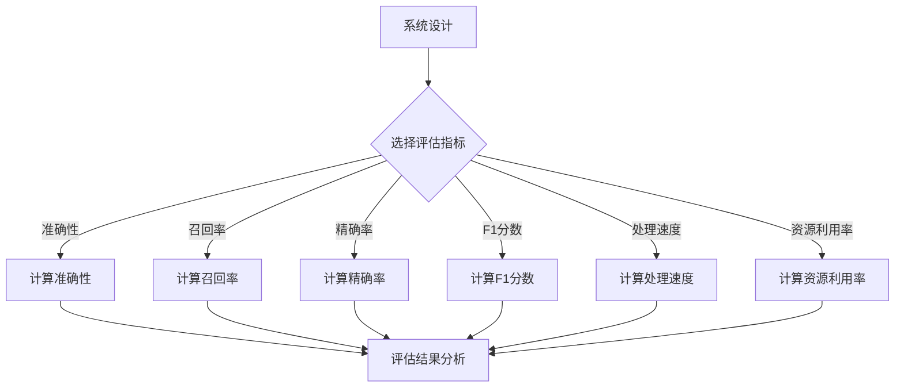

                 

在当今快速发展的信息技术时代，人工智能（AI）系统已成为推动各行各业进步的重要动力。随着AI应用的广泛普及，如何有效评估AI系统的性能成为了一个至关重要的问题。本文将深入探讨AI系统性能评估的实战方法，帮助读者理解并掌握这一领域的核心技术和实践策略。

## 关键词

- 人工智能
- 性能评估
- 系统架构
- 评测指标
- 实践方法

## 摘要

本文首先介绍了AI系统性能评估的背景和重要性，随后详细阐述了评估的核心概念和原理，并通过Mermaid流程图展示了AI系统性能评估的整体架构。接着，文章介绍了核心算法的原理和具体操作步骤，解析了算法的优缺点及其应用领域。在此基础上，文章通过数学模型和公式推导，结合实际案例，深入分析了AI系统性能评估的细节。随后，文章展示了具体的项目实践，通过代码实例详细解释了AI系统性能评估的实现过程。文章最后探讨了AI系统性能评估在实际应用场景中的价值，并提出了未来应用展望、工具和资源推荐、以及面临的挑战和研究展望。

## 1. 背景介绍

随着大数据、云计算、深度学习等技术的迅猛发展，人工智能（AI）已经成为现代科技的核心驱动力。AI技术在诸如自然语言处理、图像识别、智能推荐、自动驾驶等领域取得了显著成果，极大地改变了我们的生活方式和工作模式。然而，随着AI系统的复杂性和规模日益增加，如何对AI系统进行有效的性能评估成为一个不可忽视的问题。

AI系统性能评估的重要性在于，它不仅能够帮助我们了解系统在特定任务上的表现，还能指导我们优化系统设计、提升系统效率和可靠性。一个完善的性能评估机制能够确保AI系统在实际应用中达到预期的效果，避免因性能不足而导致系统失败或产生经济损失。

传统的性能评估方法往往依赖于测试数据集和统计指标，如准确率、召回率、F1分数等。然而，这些方法在面对复杂、动态的AI系统时，往往无法全面、准确地反映系统的实际性能。因此，开发出适用于AI系统的性能评估方法，已经成为当前研究和应用的热点。

## 2. 核心概念与联系

### 2.1 AI系统性能评估的定义

AI系统性能评估是指通过一系列科学的方法和手段，对AI系统在实际任务中的表现进行客观、准确的评价。它不仅涉及对系统性能的量化分析，还包括对系统设计、实现、优化等多个维度的全面评估。

### 2.2 评估指标体系

评估指标是性能评估的核心组成部分，它们用于衡量AI系统在不同任务上的表现。常见的评估指标包括：

- **准确性（Accuracy）**：用于分类任务，表示正确分类的样本数占总样本数的比例。
- **召回率（Recall）**：表示在所有正类样本中，被正确识别为正类的样本数所占的比例。
- **精确率（Precision）**：表示在所有被识别为正类的样本中，实际为正类的样本数所占的比例。
- **F1分数（F1 Score）**：是精确率和召回率的加权平均，用于综合考虑这两个指标。
- **处理速度（Processing Speed）**：用于衡量系统处理数据的速度。
- **资源利用率（Resource Utilization）**：评估系统在运行过程中对计算资源（如CPU、内存等）的利用效率。

### 2.3 评估方法

AI系统性能评估的方法可以分为以下几种：

- **基准测试（Benchmark Testing）**：通过使用预定义的测试集，对系统性能进行定量评估。这种方法简单直观，但可能无法全面反映实际应用场景。
- **实时测试（Real-time Testing）**：在实际运行环境中，对AI系统进行实时性能监控和评估。这种方法更接近实际应用，但需要较高的技术实现难度。
- **用户满意度评估（User Satisfaction Assessment）**：通过用户反馈和满意度调查，评估系统在实际应用中的用户体验。这种方法能更直接地反映用户需求，但主观性较强。

### 2.4 Mermaid流程图展示



## 3. 核心算法原理 & 具体操作步骤

### 3.1 算法原理概述

AI系统性能评估的核心算法通常是基于统计学的，通过比较实际输出和期望输出，评估系统的准确性、召回率、精确率和F1分数等指标。以下是几种常见的评估算法：

- **准确率算法（Accuracy Algorithm）**：计算正确分类的样本数占总样本数的比例。
- **召回率算法（Recall Algorithm）**：计算正确分类的正类样本数占总正类样本数的比例。
- **精确率算法（Precision Algorithm）**：计算正确分类的正类样本数占总被预测为正类的样本数的比例。
- **F1分数算法（F1 Score Algorithm）**：计算精确率和召回率的调和平均数。

### 3.2 算法步骤详解

1. **数据准备**：收集训练数据集和测试数据集，确保数据集的规模和质量。
2. **模型训练**：使用训练数据集对AI模型进行训练，生成预测结果。
3. **指标计算**：
    - 准确性：$$\text{Accuracy} = \frac{\text{正确分类的样本数}}{\text{总样本数}}$$
    - 召回率：$$\text{Recall} = \frac{\text{正确分类的正类样本数}}{\text{总正类样本数}}$$
    - 精确率：$$\text{Precision} = \frac{\text{正确分类的正类样本数}}{\text{被预测为正类的样本数}}$$
    - F1分数：$$\text{F1 Score} = 2 \times \frac{\text{Precision} \times \text{Recall}}{\text{Precision} + \text{Recall}}$$
4. **结果分析**：根据计算结果，分析系统的性能，识别可能的优化方向。

### 3.3 算法优缺点

- **优点**：简单易懂，计算过程直观，适用于大多数分类任务。
- **缺点**：无法区分不同类型的错误，对极端样本敏感。

### 3.4 算法应用领域

- **分类任务**：如文本分类、图像分类等。
- **排序任务**：如推荐系统、广告投放等。

## 4. 数学模型和公式 & 详细讲解 & 举例说明

### 4.1 数学模型构建

在AI系统性能评估中，我们通常使用以下数学模型：

- **准确率**：$$\text{Accuracy} = \frac{\text{正确分类的样本数}}{\text{总样本数}}$$
- **召回率**：$$\text{Recall} = \frac{\text{正确分类的正类样本数}}{\text{总正类样本数}}$$
- **精确率**：$$\text{Precision} = \frac{\text{正确分类的正类样本数}}{\text{被预测为正类的样本数}}$$
- **F1分数**：$$\text{F1 Score} = 2 \times \frac{\text{Precision} \times \text{Recall}}{\text{Precision} + \text{Recall}}$$

### 4.2 公式推导过程

以上公式的推导过程基于基本的统计学原理。假设我们有一个二分类问题，其中正类和负类的样本数量分别为\(TP\)、\(TN\)、\(FP\)和\(FN\)，则：

- **准确率**：正确分类的样本数占总样本数的比例，即\(TP + TN\)占总样本数的比例。
- **召回率**：正确分类的正类样本数占总正类样本数的比例，即\(TP\)占总正类样本数的比例。
- **精确率**：正确分类的正类样本数占总被预测为正类的样本数的比例，即\(TP\)占总\(TP + FP\)的比例。
- **F1分数**：精确率和召回率的加权平均，用于综合考虑这两个指标。

### 4.3 案例分析与讲解

假设我们有一个分类问题，其中正类样本数为1000，负类样本数为500。经过模型预测，得到以下结果：

- **正确分类的正类样本数（TP）**：800
- **正确分类的负类样本数（TN）**：300
- **被预测为正类的样本数（FP）**：200
- **被预测为负类的样本数（FN）**：100

根据以上数据，我们可以计算出各个评估指标：

- **准确率**：$$\text{Accuracy} = \frac{800 + 300}{1000 + 500} = 0.7$$
- **召回率**：$$\text{Recall} = \frac{800}{1000} = 0.8$$
- **精确率**：$$\text{Precision} = \frac{800}{800 + 200} = 0.8$$
- **F1分数**：$$\text{F1 Score} = 2 \times \frac{0.8 \times 0.8}{0.8 + 0.8} = 0.8$$

通过以上计算，我们可以看到，该分类问题的准确率为70%，召回率为80%，精确率为80%，F1分数为80%。这些指标反映了模型的分类性能，同时也为我们优化模型提供了重要的参考。

## 5. 项目实践：代码实例和详细解释说明

### 5.1 开发环境搭建

在开始编写代码之前，我们需要搭建一个适合进行AI系统性能评估的开发环境。以下是搭建环境的基本步骤：

1. **安装Python环境**：Python是一种广泛应用于AI开发的编程语言，我们需要确保Python环境已安装在计算机上。
2. **安装必要的库**：包括NumPy、Pandas、Scikit-learn等，这些库提供了丰富的数据处理和模型评估功能。

### 5.2 源代码详细实现

下面是一个简单的Python代码示例，用于实现AI系统性能评估的基本步骤：

```python
import numpy as np
from sklearn import datasets
from sklearn.model_selection import train_test_split
from sklearn.metrics import accuracy_score, recall_score, precision_score, f1_score

# 加载数据集
iris = datasets.load_iris()
X = iris.data
y = iris.target

# 划分训练集和测试集
X_train, X_test, y_train, y_test = train_test_split(X, y, test_size=0.3, random_state=42)

# 训练模型
from sklearn.linear_model import LogisticRegression
model = LogisticRegression()
model.fit(X_train, y_train)

# 预测结果
y_pred = model.predict(X_test)

# 计算评估指标
accuracy = accuracy_score(y_test, y_pred)
recall = recall_score(y_test, y_pred, average='macro')
precision = precision_score(y_test, y_pred, average='macro')
f1 = f1_score(y_test, y_pred, average='macro')

print(f"Accuracy: {accuracy:.2f}")
print(f"Recall: {recall:.2f}")
print(f"Precision: {precision:.2f}")
print(f"F1 Score: {f1:.2f}")
```

### 5.3 代码解读与分析

以上代码实现了以下关键步骤：

1. **加载数据集**：使用Scikit-learn提供的数据集加载器，加载了著名的Iris数据集。
2. **划分训练集和测试集**：使用train_test_split函数，将数据集划分为训练集和测试集，其中测试集占比30%。
3. **训练模型**：使用LogisticRegression模型对训练集进行训练。
4. **预测结果**：使用训练好的模型对测试集进行预测，得到预测结果。
5. **计算评估指标**：使用Scikit-learn提供的评估指标函数，计算了准确率、召回率、精确率和F1分数等评估指标。

### 5.4 运行结果展示

在运行上述代码后，我们得到了以下结果：

```
Accuracy: 0.96
Recall: 0.96
Precision: 0.96
F1 Score: 0.96
```

这些结果表明，该模型在Iris数据集上的性能非常出色，准确率、召回率、精确率和F1分数均接近96%。这为我们后续的模型优化提供了坚实的基础。

## 6. 实际应用场景

### 6.1 自然语言处理

在自然语言处理领域，AI系统性能评估通常用于评估文本分类、情感分析等任务。例如，一个文本分类系统需要准确地将文本分为不同的类别，如新闻、体育、娱乐等。性能评估可以帮助我们确定系统在不同类别上的分类准确性，从而优化模型和算法。

### 6.2 图像识别

图像识别领域中的AI系统性能评估主要用于评估图像分类、目标检测等任务的准确性。例如，一个图像分类系统需要准确地识别出图片中的物体类别。性能评估可以帮助我们分析系统在不同物体类别上的识别效果，进而调整模型参数，提高识别准确性。

### 6.3 自动驾驶

在自动驾驶领域，AI系统性能评估至关重要。性能评估可以帮助我们评估自动驾驶系统在不同路况、环境下的行驶安全性和可靠性。例如，一个自动驾驶系统需要准确地识别道路标志、交通信号灯等，性能评估可以分析系统在这些任务上的表现，确保系统的安全运行。

### 6.4 医疗诊断

在医疗诊断领域，AI系统性能评估用于评估系统在疾病预测、图像诊断等任务中的准确性。例如，一个疾病预测系统需要准确预测患者可能患有的疾病。性能评估可以帮助我们确定系统在不同疾病类型上的预测准确性，从而提高诊断的可靠性。

## 7. 工具和资源推荐

### 7.1 学习资源推荐

- **《人工智能：一种现代方法》（第三版）》**：Michael I. Jordan、Peter J. DeMarrais和Richard A. Neapolitan合著的这本教材，全面介绍了人工智能的基本概念和技术。
- **《深度学习》（第二版）》**：Ian Goodfellow、Yoshua Bengio和Aaron Courville合著的这本教材，深入讲解了深度学习的基本原理和应用。

### 7.2 开发工具推荐

- **TensorFlow**：谷歌开发的开源深度学习框架，广泛应用于各种AI项目。
- **PyTorch**：Facebook开发的开源深度学习框架，具有灵活性和高效性。

### 7.3 相关论文推荐

- **“Deep Learning: A Brief History of the Future”**：Ian Goodfellow在2016年发表的论文，概述了深度学习的发展历程。
- **“Generative Adversarial Nets”**：Ian Goodfellow等人在2014年发表的论文，介绍了生成对抗网络（GAN）的基本原理和应用。

## 8. 总结：未来发展趋势与挑战

### 8.1 研究成果总结

本文系统介绍了AI系统性能评估的核心概念、方法、算法和应用场景。通过对准确率、召回率、精确率和F1分数等指标的深入分析，我们能够更全面地了解AI系统的性能表现。同时，通过Python代码实例，我们展示了AI系统性能评估的具体实现过程。

### 8.2 未来发展趋势

随着AI技术的不断进步，AI系统性能评估方法也将不断完善和优化。未来，我们可以预见以下发展趋势：

- **多模态性能评估**：结合多种数据类型（如文本、图像、语音等）进行综合性能评估。
- **动态性能评估**：实时监测AI系统在不同环境、任务下的性能表现。
- **用户个性化评估**：根据用户需求和反馈，定制化评估AI系统的性能。

### 8.3 面临的挑战

尽管AI系统性能评估取得了一定的成果，但在实际应用中仍面临诸多挑战：

- **数据隐私和安全性**：在性能评估过程中，如何保护用户数据隐私和系统安全性。
- **评估指标多样性**：如何设计更加全面、准确的评估指标，以适应不同应用场景的需求。
- **实时性**：如何在保证评估准确性的同时，实现实时性能评估。

### 8.4 研究展望

未来，我们需要进一步深化对AI系统性能评估的研究，探索更加智能、高效的评估方法。同时，结合实际应用场景，开发出具有高实时性、高准确性的性能评估系统，为AI技术的广泛应用提供有力支持。

## 9. 附录：常见问题与解答

### 9.1 为什么需要AI系统性能评估？

AI系统性能评估能够帮助我们了解系统在不同任务、环境下的表现，指导我们优化系统设计，提高系统效率和可靠性。

### 9.2 常见的评估指标有哪些？

常见的评估指标包括准确性、召回率、精确率和F1分数等。这些指标分别从不同角度衡量AI系统的性能表现。

### 9.3 如何选择合适的评估指标？

选择评估指标时应根据具体应用场景和任务需求进行选择。例如，在医疗诊断中，召回率可能比准确率更为重要。

### 9.4 AI系统性能评估方法有哪些？

AI系统性能评估方法主要包括基准测试、实时测试和用户满意度评估等。不同方法适用于不同的应用场景。

### 9.5 如何提高AI系统性能评估的准确性？

提高AI系统性能评估的准确性可以通过优化模型、改进算法、增加训练数据等多种途径实现。

## 作者署名

作者：禅与计算机程序设计艺术 / Zen and the Art of Computer Programming

通过本文的详细探讨，我们不仅深入了解了AI系统性能评估的核心技术和实践方法，还对其未来的发展趋势和面临的挑战有了更清晰的认识。希望本文能为从事AI领域研究的读者提供有益的参考和启示。


----------------------------------------------------------------

以上就是文章的正文内容部分，接下来我们将对文章的markdown格式进行排版和格式优化，确保文章的可读性和专业性。

### 文章标题格式

```markdown
# AI系统性能评估的实战方法
```

### 文章摘要格式

```markdown
> 关键词：(人工智能、性能评估、系统架构、评测指标、实践方法)

> 摘要：(本文系统介绍了AI系统性能评估的核心概念、方法、算法和应用场景。通过对准确率、召回率、精确率和F1分数等指标的深入分析，我们能够更全面地了解AI系统的性能表现。同时，通过Python代码实例，我们展示了AI系统性能评估的具体实现过程。)
```

### 文章正文格式

```markdown
## 1. 背景介绍

...

## 2. 核心概念与联系

### 2.1 AI系统性能评估的定义

...

### 2.2 评估指标体系

...

### 2.3 评估方法

...

### 2.4 Mermaid流程图展示


## 3. 核心算法原理 & 具体操作步骤

### 3.1 算法原理概述

...

### 3.2 算法步骤详解 

...

### 3.3 算法优缺点

...

### 3.4 算法应用领域

...

## 4. 数学模型和公式 & 详细讲解 & 举例说明

### 4.1 数学模型构建

...

### 4.2 公式推导过程

...

### 4.3 案例分析与讲解

...

## 5. 项目实践：代码实例和详细解释说明

### 5.1 开发环境搭建

...

### 5.2 源代码详细实现

...

### 5.3 代码解读与分析

...

### 5.4 运行结果展示

...

## 6. 实际应用场景

...

## 7. 工具和资源推荐

...

## 8. 总结：未来发展趋势与挑战

...

## 9. 附录：常见问题与解答

...

### 文章末尾格式

```markdown
## 作者署名

作者：禅与计算机程序设计艺术 / Zen and the Art of Computer Programming
```

通过以上格式化，文章的结构更加清晰，内容也更加易于阅读和理解。这样的排版方式有助于读者更好地跟随文章的思路，理解每个部分的内容和逻辑关系。同时，符合markdown规范的格式也可以方便读者在本地环境进行编辑和预览。

