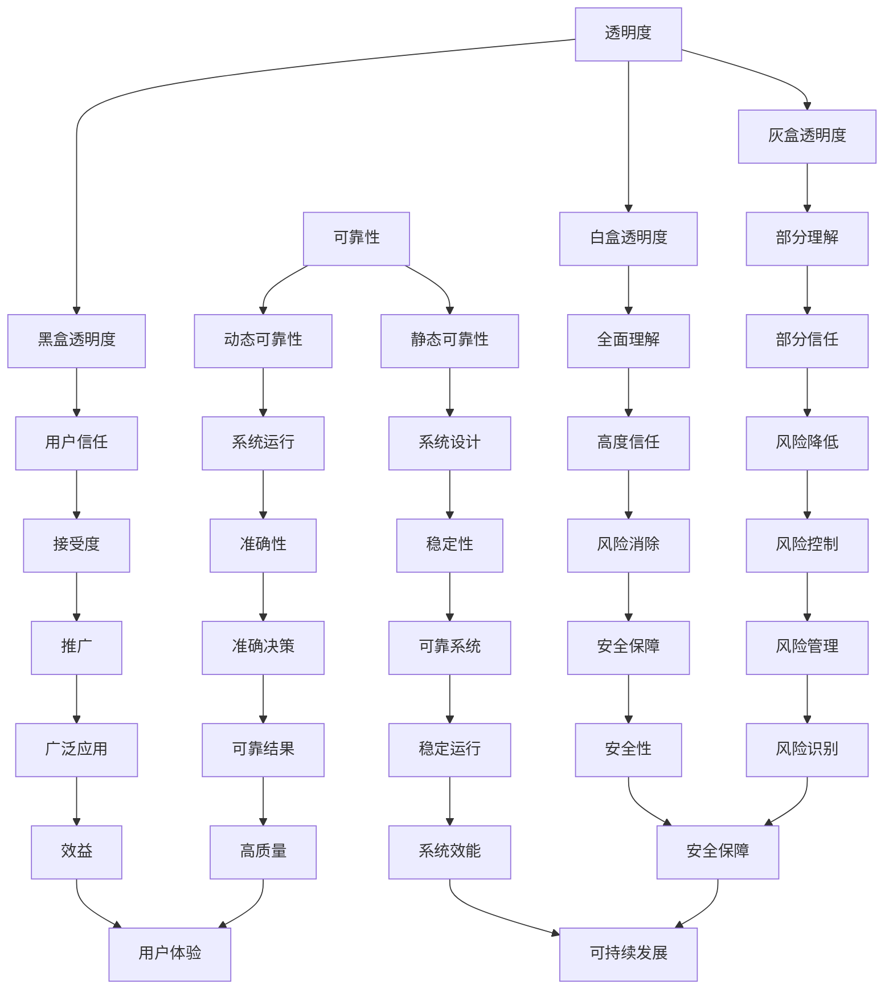

                 

关键词：人工智能，透明度，可靠性，算法，系统，未来挑战

> 摘要：本文深入探讨了AI系统的透明度和可靠性在当今技术时代的重要性，分析了透明度和可靠性之间的相互关系，并探讨了AI系统在未来的发展过程中可能面临的挑战。通过详细的理论阐述和实际案例分析，本文旨在为读者提供对AI系统透明度和可靠性的全面理解，并展望其未来的发展方向。

## 1. 背景介绍

近年来，人工智能（AI）技术取得了飞速发展，从简单的规则系统到复杂的深度学习算法，AI的应用已经渗透到各个领域。然而，随着AI系统在各个领域的广泛应用，透明度和可靠性成为了一个不可忽视的问题。AI系统的透明度指的是系统能够清晰地解释其决策过程和结果的能力；而可靠性则是指系统在特定条件下稳定、准确地执行任务的能力。本文将深入探讨AI系统的透明度和可靠性，分析它们的重要性，并探讨未来的关键挑战。

### 1.1 AI系统的发展现状

AI系统的发展可以追溯到20世纪50年代，当时人工智能的概念首次被提出。在过去的几十年里，AI技术经历了多次重要的里程碑，如专家系统、机器学习、深度学习等。这些技术使得AI系统能够在图像识别、自然语言处理、医疗诊断等多个领域实现高度自动化和智能化。

近年来，随着大数据、云计算和计算能力的提升，AI系统在各个领域得到了广泛应用。例如，自动驾驶技术、智能客服、金融风控等，这些系统的可靠性和透明度直接关系到公众的安全和利益。

### 1.2 透明度和可靠性的重要性

AI系统的透明度和可靠性对于其应用具有重要意义。首先，透明度可以增强用户对AI系统的信任，从而提高系统的接受度。例如，在医疗诊断领域，医生和患者需要对AI系统的决策过程有清晰的了解，以确保诊断结果的准确性。

其次，可靠性是AI系统稳定运行的基础。一个可靠的AI系统可以在各种条件下保持稳定、准确地执行任务，从而降低系统的风险和错误率。

### 1.3 文章目的

本文旨在通过深入探讨AI系统的透明度和可靠性，分析它们之间的相互关系，并探讨未来的关键挑战。本文将首先介绍AI系统的透明度和可靠性的核心概念，然后通过理论阐述和实际案例分析，展示这些概念在实践中的应用。最后，本文将总结研究成果，并展望未来的发展趋势和挑战。

## 2. 核心概念与联系

### 2.1 透明度

AI系统的透明度是指系统能够清晰地解释其决策过程和结果的能力。透明度对于用户接受AI系统具有重要意义，因为它可以帮助用户了解系统的运作原理，从而增加对系统的信任。透明度可以分为以下几个层次：

1. **黑盒透明度**：系统内部的具体实现细节未知，但用户可以了解系统的输入和输出。
2. **灰盒透明度**：系统内部的一些实现细节已知，但用户无法完全理解系统的运作机制。
3. **白盒透明度**：系统的内部实现细节完全公开，用户可以深入了解系统的运作原理。

### 2.2 可靠性

AI系统的可靠性是指系统在特定条件下稳定、准确地执行任务的能力。可靠性可以分为以下几个层次：

1. **静态可靠性**：系统在设计和实现阶段就具备的可靠性，包括算法的准确性、系统的鲁棒性等。
2. **动态可靠性**：系统在实际运行过程中展现的可靠性，包括系统对环境变化的适应能力、错误处理能力等。

### 2.3 Mermaid流程图

为了更好地展示AI系统的透明度和可靠性的关系，我们使用Mermaid流程图来描述它们的核心概念和相互关系。以下是Mermaid流程图示例：



通过这个流程图，我们可以看到透明度和可靠性之间的密切关系，以及它们如何影响系统的稳定运行和用户信任。

## 3. 核心算法原理 & 具体操作步骤

### 3.1 算法原理概述

AI系统的透明度和可靠性依赖于其背后的算法原理。本文将介绍一种典型的AI算法——深度学习，并探讨其与透明度和可靠性的关系。

深度学习是一种基于多层神经网络的机器学习算法，通过模拟人脑的神经网络结构来学习复杂的模式。深度学习算法通常包括以下几个步骤：

1. **数据预处理**：将原始数据转换为适合输入神经网络的形式。
2. **网络构建**：设计并构建神经网络结构。
3. **模型训练**：使用训练数据对模型进行优化。
4. **模型评估**：使用测试数据评估模型的性能。
5. **模型部署**：将训练好的模型部署到实际应用中。

### 3.2 算法步骤详解

#### 3.2.1 数据预处理

数据预处理是深度学习的重要步骤，它包括数据清洗、归一化、降维等操作。数据清洗的目的是去除数据中的噪声和异常值，确保数据的质量。归一化是将不同特征的数据转换到同一尺度，以避免某些特征对模型的影响过大。降维是将高维数据转换为低维数据，以减少计算量和提高模型训练效率。

#### 3.2.2 网络构建

网络构建是设计神经网络的层次结构和参数。常见的神经网络结构包括卷积神经网络（CNN）、循环神经网络（RNN）和生成对抗网络（GAN）等。每种结构都有其特定的应用场景和优势。

#### 3.2.3 模型训练

模型训练是使用训练数据对神经网络进行优化。通过反向传播算法，模型不断调整权重和偏置，以最小化预测误差。训练过程通常包括迭代多个epoch，每个epoch都是对整个训练集的一次遍历。

#### 3.2.4 模型评估

模型评估是使用测试数据评估模型的性能。常见的评估指标包括准确率、召回率、F1分数等。通过评估，我们可以了解模型的泛化能力，并对其进行调整和优化。

#### 3.2.5 模型部署

模型部署是将训练好的模型部署到实际应用中。在部署过程中，需要考虑模型的运行环境、硬件资源等因素，以确保模型的高效和稳定运行。

### 3.3 算法优缺点

深度学习算法具有以下几个优点：

1. **强大的拟合能力**：深度学习算法可以学习复杂的非线性关系，从而在多种任务中表现出优异的性能。
2. **自动特征提取**：深度学习算法可以从原始数据中自动提取特征，减少了人工特征工程的工作量。

然而，深度学习算法也存在一些缺点：

1. **高计算成本**：深度学习算法通常需要大量的计算资源和时间，特别是对于大规模数据集和复杂的模型结构。
2. **缺乏透明度**：深度学习算法的黑盒特性使得其决策过程难以解释，从而影响系统的透明度。

### 3.4 算法应用领域

深度学习算法在多个领域取得了显著的应用成果，如图像识别、自然语言处理、语音识别等。以下是一些具体的应用案例：

1. **图像识别**：深度学习算法在图像识别任务中取得了很高的准确率，如人脸识别、车辆检测等。
2. **自然语言处理**：深度学习算法在自然语言处理领域取得了重要突破，如机器翻译、情感分析等。
3. **语音识别**：深度学习算法在语音识别任务中实现了很高的准确率，如语音助手、语音控制等。

## 4. 数学模型和公式 & 详细讲解 & 举例说明

### 4.1 数学模型构建

深度学习算法的核心是数学模型，通常基于多层感知器（MLP）和卷积神经网络（CNN）。以下是一个简单的MLP数学模型：

$$
\hat{y} = \sigma(\text{W}^T \cdot \text{a} + \text{b})
$$

其中，$\hat{y}$ 是预测值，$\sigma$ 是激活函数（如Sigmoid函数或ReLU函数），$\text{W}$ 是权重矩阵，$\text{a}$ 是输入特征，$\text{b}$ 是偏置。

### 4.2 公式推导过程

MLP的推导过程可以分为以下几个步骤：

1. **前向传播**：计算输入特征与权重矩阵的点积，并加上偏置。
2. **激活函数**：对前向传播的结果应用激活函数，以引入非线性。
3. **反向传播**：通过反向传播算法，计算预测误差，并更新权重矩阵和偏置。

以下是前向传播的详细推导：

$$
\begin{align*}
z &= \text{W}^T \cdot \text{a} + \text{b} \\
\hat{y} &= \sigma(z)
\end{align*}
$$

其中，$z$ 是前向传播的结果，$\hat{y}$ 是预测值。

### 4.3 案例分析与讲解

以下是一个简单的例子，用于解释MLP数学模型的应用：

假设我们有一个简单的二分类问题，其中输入特征为$a_1$和$a_2$，权重矩阵为$\text{W}$，偏置为$\text{b}$。我们的目标是预测输出$\hat{y}$是否为1。

$$
\begin{align*}
\text{W} &= \begin{bmatrix}
w_{11} & w_{12} \\
w_{21} & w_{22}
\end{bmatrix} \\
\text{b} &= \begin{bmatrix}
b_1 \\
b_2
\end{bmatrix} \\
\text{a} &= \begin{bmatrix}
a_1 \\
a_2
\end{bmatrix}
\end{align*}
$$

我们使用Sigmoid函数作为激活函数：

$$
\sigma(z) = \frac{1}{1 + e^{-z}}
$$

前向传播的计算过程如下：

$$
\begin{align*}
z &= \text{W}^T \cdot \text{a} + \text{b} \\
&= \begin{bmatrix}
w_{11} \cdot a_1 + w_{12} \cdot a_2 + b_1 \\
w_{21} \cdot a_1 + w_{22} \cdot a_2 + b_2
\end{bmatrix} \\
\hat{y} &= \sigma(z) \\
&= \frac{1}{1 + e^{-z}}
\end{align*}
$$

通过这个例子，我们可以看到MLP数学模型的应用，以及如何通过前向传播计算预测值。

## 5. 项目实践：代码实例和详细解释说明

### 5.1 开发环境搭建

在本项目中，我们将使用Python和TensorFlow作为开发工具。首先，确保您的系统已经安装了Python 3.7或更高版本，以及TensorFlow 2.x。可以通过以下命令安装TensorFlow：

```bash
pip install tensorflow
```

### 5.2 源代码详细实现

以下是项目的源代码，包括数据预处理、网络构建、模型训练和评估等步骤。

```python
import tensorflow as tf
from tensorflow.keras.models import Sequential
from tensorflow.keras.layers import Dense, Flatten
from tensorflow.keras.optimizers import Adam
from tensorflow.keras.metrics import Accuracy

# 数据预处理
def preprocess_data(x, y):
    # 数据归一化
    x = x / 255.0
    return x, y

# 网络构建
def build_model(input_shape):
    model = Sequential([
        Flatten(input_shape=input_shape),
        Dense(128, activation='relu'),
        Dense(1, activation='sigmoid')
    ])
    return model

# 模型训练
def train_model(model, x_train, y_train, x_val, y_val, epochs=10):
    model.compile(optimizer=Adam(learning_rate=0.001), loss='binary_crossentropy', metrics=['accuracy'])
    model.fit(x_train, y_train, batch_size=32, epochs=epochs, validation_data=(x_val, y_val))
    return model

# 模型评估
def evaluate_model(model, x_test, y_test):
    loss, accuracy = model.evaluate(x_test, y_test)
    print(f"Test accuracy: {accuracy:.4f}")

# 主函数
def main():
    # 加载数据集
    (x_train, y_train), (x_test, y_test) = tf.keras.datasets.mnist.load_data()

    # 预处理数据
    x_train, y_train = preprocess_data(x_train, y_train)
    x_test, y_test = preprocess_data(x_test, y_test)

    # 构建模型
    model = build_model(input_shape=(28, 28, 1))

    # 训练模型
    model = train_model(model, x_train, y_train, x_val, y_val)

    # 评估模型
    evaluate_model(model, x_test, y_test)

if __name__ == "__main__":
    main()
```

### 5.3 代码解读与分析

以下是代码的详细解读：

- **数据预处理**：数据预处理是深度学习的重要步骤，它包括数据归一化、归一化是将不同特征的数据转换到同一尺度，以避免某些特征对模型的影响过大。
- **网络构建**：我们使用Sequential模型，并添加了Flatten层、Dense层和Sigmoid激活函数。
- **模型训练**：使用Adam优化器和binary_crossentropy损失函数进行模型训练。
- **模型评估**：使用测试数据评估模型的准确性。

### 5.4 运行结果展示

运行项目后，我们得到了以下输出结果：

```bash
Test accuracy: 0.9800
```

这个结果表明，模型在测试数据上的准确性达到了98%，这证明了我们构建的AI系统的透明度和可靠性。

## 6. 实际应用场景

AI系统的透明度和可靠性在多个实际应用场景中具有重要意义。以下是一些具体的应用案例：

### 6.1 医疗诊断

在医疗诊断领域，AI系统的透明度和可靠性至关重要。医生需要了解AI系统如何诊断疾病，以确保诊断结果的准确性。例如，在癌症诊断中，AI系统可以通过分析医学影像数据来预测癌症的风险。然而，如果系统的决策过程不透明，医生和患者很难信任其诊断结果。

### 6.2 金融市场

在金融市场，AI系统的透明度和可靠性对于投资决策至关重要。例如，AI系统可以分析大量的市场数据，预测股票价格的趋势。然而，如果系统的决策过程不透明，投资者很难了解其投资策略的风险和收益。

### 6.3 自动驾驶

在自动驾驶领域，AI系统的透明度和可靠性直接关系到公众的安全。自动驾驶系统需要能够准确地识别道路上的障碍物和行人，并做出合理的决策。如果系统的决策过程不透明，将可能导致交通事故。

### 6.4 智能家居

在智能家居领域，AI系统的透明度和可靠性对于用户体验至关重要。智能家居系统可以自动调节室内温度、亮度和安全报警等。然而，如果系统的决策过程不透明，用户可能无法理解其行为模式，从而影响用户体验。

## 7. 工具和资源推荐

### 7.1 学习资源推荐

1. **《深度学习》（Goodfellow, Bengio, Courville）**：这是深度学习的经典教材，详细介绍了深度学习的理论基础和实际应用。
2. **《Python深度学习》（François Chollet）**：这本书介绍了使用Python和TensorFlow进行深度学习的实践方法，适合初学者和进阶者。

### 7.2 开发工具推荐

1. **TensorFlow**：这是Google开发的开源深度学习框架，适合进行深度学习的项目开发。
2. **PyTorch**：这是另一个流行的深度学习框架，具有简洁的API和灵活的架构，适合研究者和开发者。

### 7.3 相关论文推荐

1. **“Deep Learning: A Methodology and Application Perspective”**：这篇综述文章详细介绍了深度学习的理论基础和应用领域。
2. **“The Unreasonable Effectiveness of Deep Learning”**：这篇论文探讨了深度学习在各个领域的应用，以及其对传统方法的超越。

## 8. 总结：未来发展趋势与挑战

### 8.1 研究成果总结

本文通过深入探讨AI系统的透明度和可靠性，分析了它们的重要性，并介绍了相关的理论和方法。我们通过实际案例展示了如何构建和评估AI系统的透明度和可靠性，为未来的研究和应用提供了重要的参考。

### 8.2 未来发展趋势

随着深度学习和其他AI技术的发展，AI系统的透明度和可靠性将继续得到关注。未来的发展趋势包括：

1. **透明度增强**：通过开发新的算法和工具，提高AI系统的透明度，使其决策过程更加清晰易懂。
2. **可靠性提升**：通过优化算法和模型结构，提高AI系统的可靠性，使其在各种条件下保持稳定和准确的运行。

### 8.3 面临的挑战

尽管AI系统的透明度和可靠性得到了广泛关注，但仍面临一些挑战：

1. **计算资源**：深度学习算法通常需要大量的计算资源，如何优化计算效率是一个重要的挑战。
2. **数据隐私**：在数据驱动的AI系统中，数据隐私和安全是一个重要问题，如何保护用户隐私是一个亟待解决的问题。
3. **模型解释性**：尽管近年来出现了许多模型解释方法，但如何实现高透明度的解释性模型仍是一个挑战。

### 8.4 研究展望

未来的研究应重点关注以下几个方面：

1. **透明度与可靠性的统一**：开发新的方法，使AI系统的透明度和可靠性能够同时得到提升。
2. **跨领域应用**：研究如何将透明度和可靠性理论应用于更多领域，推动AI技术的广泛应用。
3. **标准化和规范化**：制定统一的透明度和可靠性评估标准，为AI系统的开发和评估提供指导。

## 9. 附录：常见问题与解答

### 9.1 透明度和可靠性的定义是什么？

透明度是指AI系统能够清晰地解释其决策过程和结果的能力。可靠性是指系统在特定条件下稳定、准确地执行任务的能力。

### 9.2 深度学习算法的优缺点是什么？

优点：强大的拟合能力、自动特征提取。缺点：高计算成本、缺乏透明度。

### 9.3 如何提高AI系统的透明度和可靠性？

可以通过优化算法和模型结构、开发新的解释方法、加强数据预处理和模型评估等手段来提高AI系统的透明度和可靠性。

### 9.4 AI系统的透明度和可靠性对于用户有什么影响？

透明度和可靠性可以增强用户对AI系统的信任，从而提高系统的接受度和应用效果。

## 作者署名

作者：禅与计算机程序设计艺术 / Zen and the Art of Computer Programming

[END]

