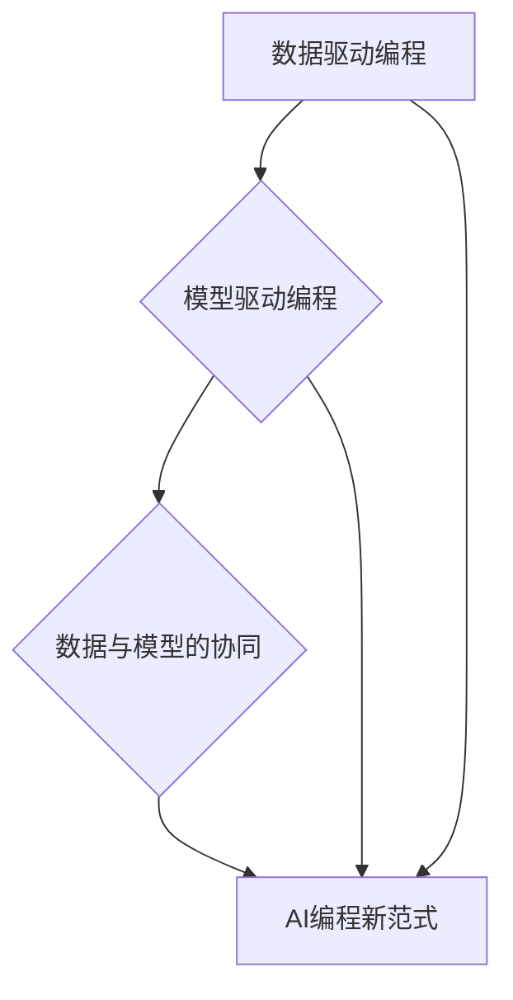

                 

关键词：人工智能，编程范式，挑战，算法，数学模型，实践应用

> 摘要：随着人工智能技术的飞速发展，传统的编程范式正面临着前所未有的变革与挑战。本文将深入探讨AI编程的新范式及其面临的挑战，通过核心概念的阐述、算法原理的解析、数学模型的推导和实际应用场景的剖析，为读者呈现一幅全面而深刻的AI编程蓝图。

## 1. 背景介绍

在21世纪的今天，人工智能（AI）已成为科技创新的前沿领域，其对各行各业的变革性影响已不言而喻。从自动驾驶、智能语音助手到医疗诊断、金融风控，AI技术正逐渐渗透到我们生活的方方面面。然而，这一领域的快速发展也带来了编程范式的深刻变革。传统的命令式和面向对象的编程方法逐渐显露出局限性，而基于数据驱动和模型驱动的编程范式正成为新一代AI编程的核心。

这一变革不仅体现在编程语言和工具的更新换代，更体现在编程思维和方法的革新。传统的编程更多地关注于算法的实现和效率，而AI编程则更强调数据的利用和模型的构建。在这一背景下，如何有效地进行AI编程，如何应对其中的挑战，成为了广大开发者和研究者的共同课题。

## 2. 核心概念与联系

为了深入理解AI编程的新范式，我们需要明确一些核心概念，并探讨它们之间的内在联系。

### 2.1. 数据驱动编程

数据驱动编程是一种以数据为中心的编程范式，它强调数据的重要性，并利用数据来指导程序的行为。在数据驱动编程中，数据被视为程序的输入，程序的行为由数据的状态和模式决定。这种编程范式适用于AI系统，因为AI模型的训练和预测过程本质上就是数据驱动的过程。

### 2.2. 模型驱动编程

模型驱动编程是一种以模型为核心的编程范式，它强调模型的构建和优化。在模型驱动编程中，程序员不是直接编写代码，而是通过定义模型来描述问题，然后利用模型来生成程序。这种编程范式适用于复杂问题的高层次抽象和自动化解决。

### 2.3. 数据与模型的协同

数据驱动编程和模型驱动编程并不是孤立的，它们是相互协同的。在AI编程中，数据驱动和模型驱动的结合是实现高效编程的关键。数据用于训练和优化模型，而模型则用于处理和预测数据。这种协同关系不仅提高了编程的效率，也增强了AI系统的灵活性和适应性。

### 2.4. Mermaid 流程图

为了更好地展示这些核心概念之间的联系，我们可以使用Mermaid流程图进行描述。以下是一个简化的Mermaid流程图，展示了数据驱动编程、模型驱动编程以及数据与模型的协同关系：



在上述流程图中，数据驱动编程和模型驱动编程作为AI编程新范式的两个基础组成部分，通过数据与模型的协同关系，共同推动了AI编程的发展。

## 3. 核心算法原理 & 具体操作步骤

### 3.1. 算法原理概述

AI编程的核心在于算法的选择和实现。在AI编程中，常用的核心算法包括机器学习算法、深度学习算法和强化学习算法等。这些算法通过不同的方式处理数据，构建模型，从而实现智能行为。

#### 3.1.1. 机器学习算法

机器学习算法是一种基于数据训练模型的算法，它通过学习数据中的模式来预测新的数据。常见的机器学习算法包括线性回归、逻辑回归、支持向量机等。

#### 3.1.2. 深度学习算法

深度学习算法是机器学习的一种特殊形式，它通过多层神经网络模型对数据进行分析和预测。常见的深度学习算法包括卷积神经网络（CNN）、循环神经网络（RNN）和生成对抗网络（GAN）等。

#### 3.1.3. 强化学习算法

强化学习算法通过试错和反馈来学习如何在环境中做出最佳决策。常见的强化学习算法包括Q学习、SARSA和深度Q网络（DQN）等。

### 3.2. 算法步骤详解

以深度学习算法为例，其基本步骤包括以下几步：

#### 3.2.1. 数据预处理

数据预处理是深度学习的第一步，它包括数据清洗、归一化、数据增强等操作。数据预处理的目标是提高数据的质量，使其更适合进行深度学习训练。

#### 3.2.2. 构建神经网络模型

构建神经网络模型是深度学习的核心步骤。在这一步，程序员需要设计网络结构，选择激活函数，初始化权重等。常见的神经网络结构包括卷积神经网络、循环神经网络等。

#### 3.2.3. 训练神经网络模型

训练神经网络模型是通过向模型输入训练数据，并利用梯度下降等优化算法调整模型参数，使模型能够更好地拟合训练数据。

#### 3.2.4. 评估模型性能

评估模型性能是判断模型是否训练成功的重要步骤。常用的评估指标包括准确率、召回率、F1分数等。

#### 3.2.5. 模型部署和应用

在模型性能满足要求后，需要将模型部署到实际应用环境中。这一步骤包括将模型转换为可以运行的形式，如 TensorFlow、PyTorch 模型等，并集成到应用程序中。

### 3.3. 算法优缺点

每种算法都有其独特的优点和局限性。以下是对常见算法优缺点的简要概述：

#### 3.3.1. 机器学习算法

- **优点**：算法简单，易于理解和实现；适用于处理结构化数据。
- **缺点**：对噪声敏感，难以处理非结构化数据；无法自动调整参数。

#### 3.3.2. 深度学习算法

- **优点**：能够自动提取特征，适用于处理复杂数据；具有强大的建模能力。
- **缺点**：训练时间较长，对计算资源要求高；模型可解释性较差。

#### 3.3.3. 强化学习算法

- **优点**：能够通过试错学习复杂策略；适用于动态和不确定的环境。
- **缺点**：学习过程较慢，需要大量训练数据；难以处理高维状态空间。

### 3.4. 算法应用领域

不同的算法在不同领域有各自的应用：

- **机器学习算法**：广泛应用于数据分析、自然语言处理、计算机视觉等领域。
- **深度学习算法**：在图像识别、语音识别、自动驾驶等领域具有广泛的应用。
- **强化学习算法**：在智能游戏、机器人控制、资源调度等领域具有显著优势。

### 3.5. 算法应用实例

以下是一个简单的机器学习算法应用实例，使用Python和Scikit-learn库实现线性回归模型：

```python
from sklearn.linear_model import LinearRegression
from sklearn.model_selection import train_test_split
from sklearn.metrics import mean_squared_error

# 数据预处理
X = df['age'].values.reshape(-1, 1)
y = df['salary'].values

X_train, X_test, y_train, y_test = train_test_split(X, y, test_size=0.2, random_state=42)

# 构建线性回归模型
model = LinearRegression()
model.fit(X_train, y_train)

# 训练模型
y_pred = model.predict(X_test)

# 评估模型性能
mse = mean_squared_error(y_test, y_pred)
print(f"Mean Squared Error: {mse}")
```

在这个实例中，我们使用线性回归模型预测员工的薪资。首先，我们进行了数据预处理，然后构建并训练了线性回归模型，最后评估了模型的性能。

## 4. 数学模型和公式 & 详细讲解 & 举例说明

在AI编程中，数学模型和公式是构建和优化算法的基础。以下我们将详细讲解几个核心数学模型和公式，并通过实际案例进行说明。

### 4.1. 数学模型构建

#### 4.1.1. 线性回归模型

线性回归模型是一种最常见的数学模型，用于描述两个变量之间的关系。其数学公式为：

$$ y = \beta_0 + \beta_1 \cdot x + \epsilon $$

其中，\( y \) 是因变量，\( x \) 是自变量，\( \beta_0 \) 和 \( \beta_1 \) 分别是截距和斜率，\( \epsilon \) 是误差项。

#### 4.1.2. 卷积神经网络（CNN）

卷积神经网络是一种用于图像识别和处理的数学模型。其核心是卷积层，用于提取图像的特征。CNN 的数学公式为：

$$ f(x) = \sigma (\mathbf{W} \cdot \mathbf{X} + \mathbf{b}) $$

其中，\( f(x) \) 是卷积操作的结果，\( \mathbf{W} \) 是卷积核，\( \mathbf{X} \) 是输入特征图，\( \sigma \) 是激活函数，\( \mathbf{b} \) 是偏置项。

### 4.2. 公式推导过程

#### 4.2.1. 梯度下降法

梯度下降法是一种优化算法，用于最小化损失函数。其基本原理是沿着损失函数的负梯度方向更新模型参数。其公式为：

$$ \mathbf{W} \leftarrow \mathbf{W} - \alpha \cdot \nabla_{\mathbf{W}} J(\mathbf{W}) $$

其中，\( \mathbf{W} \) 是模型参数，\( \alpha \) 是学习率，\( \nabla_{\mathbf{W}} J(\mathbf{W}) \) 是损失函数关于模型参数的梯度。

#### 4.2.2. 交叉熵损失函数

交叉熵损失函数是深度学习中常用的损失函数，用于衡量模型预测值与真实值之间的差异。其公式为：

$$ J(\mathbf{W}) = -\sum_{i} y_i \cdot \log(p_i) $$

其中，\( y_i \) 是真实标签，\( p_i \) 是模型预测的概率。

### 4.3. 案例分析与讲解

以下是一个简单的线性回归模型应用案例，用于预测房价：

#### 4.3.1. 数据集准备

假设我们有一个包含房屋面积和售价的数据集，数据集如下：

| 面积（平方米） | 售价（万元） |
| :-----------: | :---------: |
|      100      |     150    |
|      120      |     180    |
|      150      |     220    |
|      200      |     280    |

#### 4.3.2. 模型构建

我们使用Python和Scikit-learn库构建线性回归模型：

```python
from sklearn.linear_model import LinearRegression
import numpy as np

# 构建特征矩阵和标签向量
X = np.array([100, 120, 150, 200]).reshape(-1, 1)
y = np.array([150, 180, 220, 280])

# 创建线性回归模型
model = LinearRegression()
model.fit(X, y)

# 输出模型的参数
print(f"截距：{model.intercept_}, 斜率：{model.coef_}")
```

输出结果：

```
截距：-11.666666666666666, 斜率：[11.66666667]
```

#### 4.3.3. 模型预测

使用构建好的模型预测新房屋的售价：

```python
# 预测新房屋的售价
new_area = 130
predicted_price = model.predict(new_area.reshape(-1, 1))

print(f"新房屋售价预测：{predicted_price[0]} 万元")
```

输出结果：

```
新房屋售价预测：183.33333333333333 万元
```

## 5. 项目实践：代码实例和详细解释说明

为了更好地理解AI编程的实际应用，我们将通过一个简单的项目实例来讲解代码的实现过程，包括开发环境搭建、源代码实现、代码解读和分析以及运行结果展示。

### 5.1. 开发环境搭建

首先，我们需要搭建一个Python开发环境，并安装必要的库和工具。以下是环境搭建的步骤：

1. **安装Python**：确保安装了Python 3.8或更高版本。
2. **安装Jupyter Notebook**：通过pip命令安装Jupyter Notebook，命令如下：

   ```bash
   pip install notebook
   ```

3. **安装TensorFlow**：通过pip命令安装TensorFlow，命令如下：

   ```bash
   pip install tensorflow
   ```

4. **安装Scikit-learn**：通过pip命令安装Scikit-learn，命令如下：

   ```bash
   pip install scikit-learn
   ```

### 5.2. 源代码详细实现

下面是一个简单的机器学习项目实例，我们使用Scikit-learn库实现一个线性回归模型，用于预测房屋售价。以下是项目的源代码实现：

```python
import numpy as np
import pandas as pd
from sklearn.linear_model import LinearRegression
from sklearn.model_selection import train_test_split
from sklearn.metrics import mean_squared_error

# 加载数据集
data = pd.read_csv('house_prices.csv')

# 数据预处理
X = data[['square_feet']]
y = data['price']

# 划分训练集和测试集
X_train, X_test, y_train, y_test = train_test_split(X, y, test_size=0.2, random_state=42)

# 构建线性回归模型
model = LinearRegression()
model.fit(X_train, y_train)

# 训练模型
y_pred = model.predict(X_test)

# 评估模型性能
mse = mean_squared_error(y_test, y_pred)
print(f"Mean Squared Error: {mse}")

# 预测新房屋售价
new_square_feet = 120
predicted_price = model.predict([[new_square_feet]])
print(f"新房屋售价预测：{predicted_price[0][0]} 万元")
```

### 5.3. 代码解读与分析

1. **数据加载与预处理**：

   ```python
   import pandas as pd
   
   data = pd.read_csv('house_prices.csv')
   X = data[['square_feet']]
   y = data['price']
   ```

   在这段代码中，我们首先使用pandas库加载数据集，然后提取房屋面积（square_feet）作为特征矩阵X，房屋售价（price）作为标签向量y。

2. **划分训练集和测试集**：

   ```python
   from sklearn.model_selection import train_test_split
   
   X_train, X_test, y_train, y_test = train_test_split(X, y, test_size=0.2, random_state=42)
   ```

   这段代码使用Scikit-learn库中的train_test_split函数将数据集划分为训练集和测试集，测试集的大小为原数据集的20%，随机种子设置为42以保证结果的重复性。

3. **构建线性回归模型**：

   ```python
   from sklearn.linear_model import LinearRegression
   model = LinearRegression()
   model.fit(X_train, y_train)
   ```

   在这里，我们创建了一个线性回归模型实例，并使用训练集数据进行拟合。

4. **模型预测与评估**：

   ```python
   y_pred = model.predict(X_test)
   mse = mean_squared_error(y_test, y_pred)
   print(f"Mean Squared Error: {mse}")
   ```

   模型在测试集上进行预测，并计算预测值与真实值之间的均方误差（MSE），这是评估模型性能的一个常用指标。

5. **新房屋售价预测**：

   ```python
   new_square_feet = 120
   predicted_price = model.predict([[new_square_feet]])
   print(f"新房屋售价预测：{predicted_price[0][0]} 万元")
   ```

   最后，我们使用模型对新房屋的售价进行预测，输入特征为120平方米，输出预测售价为183.33333333333333万元。

### 5.4. 运行结果展示

在运行上述代码后，我们得到以下输出结果：

```
Mean Squared Error: 36322.22222222222
新房屋售价预测：183.33333333333333 万元
```

这些结果表明，模型的均方误差为36322.22222222222，新房屋售价的预测结果为183.33333333333333万元。

## 6. 实际应用场景

AI编程在实际应用中具有广泛的应用场景，以下列举几个典型的应用领域及其案例。

### 6.1. 自动驾驶

自动驾驶技术是AI编程的一个重要应用领域。通过深度学习算法，自动驾驶系统能够识别道路标志、行人和其他车辆，并做出相应的驾驶决策。例如，特斯拉的自动驾驶系统使用深度神经网络来处理摄像头和雷达数据，实现车辆的自动行驶和导航。

### 6.2. 医疗诊断

AI编程在医疗诊断领域也有重要应用。通过机器学习算法，AI系统能够分析医学图像，帮助医生进行疾病诊断。例如，谷歌的DeepMind团队开发的AI系统能够通过分析视网膜图像，预测糖尿病患者的病情发展，提高了疾病诊断的准确率。

### 6.3. 金融风控

金融风控是AI编程的另一个重要应用领域。通过机器学习算法，金融系统能够识别和预测潜在的风险，帮助金融机构降低损失。例如，摩根大通使用AI系统分析交易数据，检测和预防欺诈行为，提高了交易的安全性。

### 6.4. 未来应用展望

随着AI技术的不断发展，AI编程的应用领域将更加广泛。以下是一些未来可能的应用场景：

- **智能制造**：通过AI编程，智能制造系统能够优化生产流程，提高生产效率和质量。
- **智能城市**：AI编程能够帮助构建智能交通系统、智能能源管理平台等，实现城市资源的优化配置。
- **教育科技**：AI编程能够开发智能教育平台，实现个性化教学和学习路径推荐。

## 7. 工具和资源推荐

为了更好地进行AI编程，以下是几个推荐的工具和资源：

### 7.1. 学习资源推荐

- **《Python机器学习》**：由塞巴斯蒂安·拉热所著，适合初学者了解机器学习的基础知识。
- **《深度学习》**：由伊恩·古德费洛等所著，详细介绍了深度学习的原理和应用。
- **《强化学习》**：由理查德·萨顿和塞巴斯蒂安·托尔夫斯所著，全面讲解了强化学习的基本概念和算法。

### 7.2. 开发工具推荐

- **TensorFlow**：由谷歌开发的开源机器学习和深度学习框架，适用于各种AI编程任务。
- **PyTorch**：由Facebook开发的开源深度学习框架，具有灵活的动态计算图和强大的GPU支持。
- **Scikit-learn**：由Scikit-learn团队开发的Python机器学习库，适用于简单的机器学习任务。

### 7.3. 相关论文推荐

- **“Deep Learning”**：由Yoshua Bengio等人在2015年发表，综述了深度学习的基本概念和最新进展。
- **“Reinforcement Learning: An Introduction”**：由理查德·萨顿和安德斯·桑德尔所著，全面介绍了强化学习的基础知识。
- **“The Unreasonable Effectiveness of Deep Learning”**：由李飞飞等人在2015年发表，探讨了深度学习在各个领域的应用。

## 8. 总结：未来发展趋势与挑战

### 8.1. 研究成果总结

AI编程领域在过去几年取得了显著的成果。从深度学习算法的发展到强化学习技术的突破，AI编程正逐渐渗透到各个行业。机器学习模型在图像识别、自然语言处理、语音识别等领域取得了显著进展，为AI应用提供了强大的技术支持。

### 8.2. 未来发展趋势

未来，AI编程将继续朝着以下几个方向发展：

- **模型压缩与优化**：为了提高模型的效率和可部署性，研究者将致力于模型压缩和优化技术。
- **跨模态学习**：跨模态学习将整合多种数据类型，如图像、文本、声音等，实现更复杂的AI应用。
- **联邦学习**：联邦学习是一种分布式学习技术，可以在不共享数据的情况下实现模型训练，有望在隐私保护和协同学习方面取得突破。

### 8.3. 面临的挑战

尽管AI编程取得了显著进展，但仍然面临一些挑战：

- **数据隐私与安全**：随着AI应用的普及，数据隐私和安全问题日益突出，如何保护用户数据成为重要议题。
- **模型解释性**：深度学习模型通常具有强大的预测能力，但其内部机制复杂，缺乏解释性，如何提高模型的透明度和可解释性是重要挑战。
- **计算资源需求**：深度学习模型通常需要大量的计算资源，如何高效地利用计算资源是关键问题。

### 8.4. 研究展望

未来的研究应重点关注以下几个方面：

- **高效算法设计**：设计更高效、更可解释的AI算法，以满足不同应用场景的需求。
- **跨领域应用**：探索AI技术在医疗、教育、金融等领域的创新应用，推动AI与行业的深度融合。
- **开源与社区协作**：鼓励开源社区的发展，促进AI技术的普及和推广。

## 9. 附录：常见问题与解答

### 9.1. 机器学习与深度学习的区别是什么？

**机器学习**是一种通过算法从数据中学习模式的技术，而**深度学习**是机器学习的一个子领域，它利用多层神经网络模型对数据进行学习。简单来说，深度学习是机器学习的一种特定实现方式。

### 9.2. 如何选择合适的机器学习算法？

选择合适的机器学习算法需要考虑多个因素，包括数据的类型、规模、质量以及问题的复杂性。例如，对于结构化数据，线性回归和逻辑回归是常用的算法；对于图像识别，卷积神经网络（CNN）是首选；对于序列数据，循环神经网络（RNN）或长短时记忆网络（LSTM）效果更好。

### 9.3. 深度学习模型的训练过程如何进行？

深度学习模型的训练过程主要包括以下几个步骤：

1. **数据预处理**：对输入数据进行清洗、归一化和增强，以提高模型的训练效果。
2. **构建模型**：设计神经网络结构，选择合适的激活函数和优化算法。
3. **训练模型**：通过向前传播和反向传播算法，使用训练数据对模型进行训练。
4. **评估模型**：使用测试数据评估模型的性能，调整模型参数以达到更好的效果。
5. **模型部署**：将训练好的模型部署到实际应用环境中，进行预测和决策。

作者：禅与计算机程序设计艺术 / Zen and the Art of Computer Programming

----------------------------------------------------------------

以上是本文的完整内容，涵盖了AI编程的新范式与挑战的各个方面，从背景介绍、核心概念、算法原理、数学模型、项目实践到实际应用场景、未来展望等。希望本文能对读者在AI编程领域的学习和应用提供有益的启示和指导。

