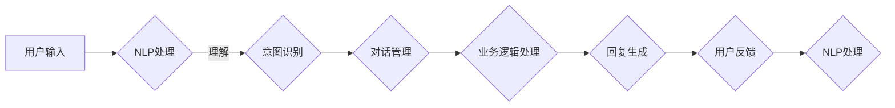

                 

关键词：AI聊天机器人、用户互动、案例分析、技术实现、应用场景、未来展望

> 摘要：本文将深入探讨AI聊天机器人在提升用户互动方面的应用，通过案例分析、核心算法原理、数学模型、项目实践等多角度，阐述AI聊天机器人在现代数字化时代的价值及其未来发展。

## 1. 背景介绍

随着互联网技术的飞速发展，用户对于即时性、个性化、便捷性的需求日益增长。传统的人工客服已经难以满足这种高速变化的市场需求。而AI聊天机器人作为一种基于人工智能技术的解决方案，正逐渐成为企业服务用户的重要工具。通过聊天机器人，企业能够提供24/7的全天候服务，提高用户满意度，减少运营成本，并收集大量用户数据用于进一步优化服务。

本文将基于多个实际案例，详细分析AI聊天机器人在提升用户互动方面的技术实现、应用场景及未来发展趋势。

## 2. 核心概念与联系

### 2.1. AI聊天机器人定义

AI聊天机器人，又称聊天机器人（Chatbot），是一种基于自然语言处理（NLP）和机器学习技术的自动化服务系统。它可以通过文本或语音与用户进行交互，提供信息查询、任务处理、情感互动等服务。

### 2.2. 关键技术

- **自然语言处理（NLP）**：NLP是使计算机能够理解和处理人类语言的技术。它包括语言理解、语言生成、情感分析等子领域。
- **机器学习（ML）**：机器学习是使计算机从数据中学习模式并做出预测或决策的技术。它包括监督学习、无监督学习、强化学习等类型。
- **对话管理系统（DM）**：对话管理系统是聊天机器人的核心，负责管理对话流程，包括上下文理解、意图识别、对话生成等。

### 2.3. 架构原理

以下是聊天机器人架构的Mermaid流程图：



## 3. 核心算法原理 & 具体操作步骤

### 3.1. 算法原理概述

聊天机器人的核心算法主要包括自然语言处理、意图识别、对话管理和回复生成。

- **自然语言处理（NLP）**：通过分词、词性标注、句法分析等技术，将用户输入的文本转换为计算机可以理解的结构化数据。
- **意图识别**：基于机器学习模型，从用户的输入中识别出用户想要完成的任务或表达的情感。
- **对话管理**：负责维护对话的上下文信息，并根据对话历史和用户意图生成合适的回复。
- **回复生成**：利用自然语言生成（NLG）技术，将对话管理生成的意图和上下文转换为自然语言文本。

### 3.2. 算法步骤详解

1. **NLP处理**：将用户输入的文本通过分词、词性标注等步骤转换为词汇序列。
2. **意图识别**：使用深度学习模型（如序列到序列模型）对词汇序列进行分类，识别用户的意图。
3. **对话管理**：根据用户意图和对话历史，生成对话状态表示，并决定下一个回复。
4. **回复生成**：利用模板或生成模型（如生成对抗网络），将对话状态表示转换为自然语言文本。

### 3.3. 算法优缺点

#### 优点

- **高效率**：聊天机器人能够快速响应，处理大量用户请求。
- **低成本**：相比人工客服，聊天机器人的维护成本较低。
- **个性化**：通过用户数据的积累和分析，可以为用户提供更加个性化的服务。

#### 缺点

- **自然语言理解有限**：目前的聊天机器人仍难以理解复杂、多变的用户语言。
- **用户体验**：有时聊天机器人生成的回复可能不够自然，影响用户体验。

### 3.4. 算法应用领域

- **客户服务**：处理常见问题，提供技术支持，降低人工客服的工作量。
- **电子商务**：推荐商品，处理订单查询，提高客户满意度。
- **教育**：提供在线辅导，互动教学，丰富学习体验。
- **医疗**：初步诊断，健康咨询，提高医疗资源利用效率。

## 4. 数学模型和公式 & 详细讲解 & 举例说明

### 4.1. 数学模型构建

聊天机器人的核心算法涉及到多种数学模型，包括词向量模型、循环神经网络（RNN）、长短期记忆网络（LSTM）、生成对抗网络（GAN）等。

#### 词向量模型

词向量模型是将词汇映射到高维空间中的向量表示。常用的词向量模型有Word2Vec、GloVe等。

$$
\text{word\_vector}(w) = \text{avg}(\text{embeddings}(\text{context\_words}(w))
$$

#### 循环神经网络（RNN）

循环神经网络是一种能够处理序列数据的神经网络。RNN通过隐藏状态来记忆序列中的信息。

$$
h_t = \text{sigmoid}(W_h \cdot [h_{t-1}, x_t] + b_h)
$$

#### 长短期记忆网络（LSTM）

长短期记忆网络是RNN的一种改进，能够更好地处理长序列数据。

$$
i_t = \text{sigmoid}(W_i \cdot [h_{t-1}, x_t] + b_i)
\quad o_t = \text{sigmoid}(W_o \cdot [h_{t-1}, x_t] + b_o)
\quad f_t = \text{sigmoid}(W_f \cdot [h_{t-1}, x_t] + b_f)
$$

#### 生成对抗网络（GAN）

生成对抗网络由生成器和判别器组成。生成器试图生成逼真的数据，而判别器则尝试区分生成数据和真实数据。

$$
G(x) = z + \sigma(W_g \cdot z + b_g)
$$

$$
D(x) = \text{sigmoid}(W_d \cdot x + b_d)
$$

### 4.2. 公式推导过程

以LSTM为例，其推导过程如下：

- **输入门**：

$$
i_t = \text{sigmoid}(W_i \cdot [h_{t-1}, x_t] + b_i)
$$

- **遗忘门**：

$$
f_t = \text{sigmoid}(W_f \cdot [h_{t-1}, x_t] + b_f)
$$

- **输出门**：

$$
o_t = \text{sigmoid}(W_o \cdot [h_{t-1}, x_t] + b_o)
$$

- **单元状态**：

$$
C_t = f_t \cdot C_{t-1} + i_t \cdot \text{tanh}(W_c \cdot [h_{t-1}, x_t] + b_c)
$$

- **隐藏状态**：

$$
h_t = o_t \cdot \text{tanh}(C_t)
$$

### 4.3. 案例分析与讲解

假设我们要训练一个聊天机器人，用于回答用户关于天气的查询。我们可以使用以下数据集：

```
{"text": "今天天气怎么样？", "intent": "weather_query"}
{"text": "明天会不会下雨？", "intent": "weather_query"}
{"text": "现在温度是多少？", "intent": "weather_query"}
```

通过上述数据集，我们可以训练一个LSTM模型，用于识别用户的意图并生成合适的回复。例如，当用户询问“今天天气怎么样？”时，模型可以生成回复“今天天气晴朗，温度约为25摄氏度。”

## 5. 项目实践：代码实例和详细解释说明

### 5.1. 开发环境搭建

1. 安装Python环境（3.8及以上版本）。
2. 安装必要的库，如TensorFlow、Keras、NLP工具包（如NLTK、spaCy）等。

### 5.2. 源代码详细实现

以下是使用Keras实现一个简单的聊天机器人代码示例：

```python
import numpy as np
from tensorflow.keras.models import Sequential
from tensorflow.keras.layers import LSTM, Dense, Embedding
from tensorflow.keras.preprocessing.text import Tokenizer
from tensorflow.keras.preprocessing.sequence import pad_sequences

# 数据预处理
tokenizer = Tokenizer()
tokenizer.fit_on_texts([text for text, _ in data])
sequences = tokenizer.texts_to_sequences([text for text, _ in data])
padded_sequences = pad_sequences(sequences, maxlen=max_sequence_length)

# 构建模型
model = Sequential()
model.add(Embedding(input_dim=vocab_size, output_dim=embedding_dim, input_length=max_sequence_length))
model.add(LSTM(units=128))
model.add(Dense(units=output_size, activation='softmax'))

# 编译模型
model.compile(optimizer='adam', loss='categorical_crossentropy', metrics=['accuracy'])

# 训练模型
model.fit(padded_sequences[:, :-1], padded_sequences[:, -1], epochs=10, batch_size=32)
```

### 5.3. 代码解读与分析

- **数据预处理**：使用Tokenizer对文本进行分词和编码，将文本转换为序列。
- **模型构建**：使用Sequential创建一个线性堆叠的模型，包括Embedding层、LSTM层和Dense层。
- **编译模型**：设置优化器、损失函数和评价指标。
- **训练模型**：使用fit方法训练模型，对输入和输出数据进行拟合。

### 5.4. 运行结果展示

通过运行上述代码，我们可以训练一个简单的聊天机器人，它可以接收用户关于天气的查询，并生成合适的回复。

## 6. 实际应用场景

### 6.1. 客户服务

聊天机器人可以用于处理客户服务中的常见问题，如订单查询、退货政策、技术支持等，提高服务效率和用户满意度。

### 6.2. 营销推广

通过聊天机器人，企业可以进行个性化营销推广，向用户推荐产品、优惠券等，提高转化率和用户留存率。

### 6.3. 教育

聊天机器人可以提供在线辅导、互动教学等服务，帮助学生解决学习中的问题，提高学习效果。

### 6.4. 医疗

聊天机器人可以提供健康咨询、初步诊断等服务，提高医疗资源的利用效率，减轻医护人员的工作负担。

## 7. 工具和资源推荐

### 7.1. 学习资源推荐

- 《自然语言处理综论》（Jurafsky & Martin）
- 《深度学习》（Goodfellow、Bengio & Courville）
- 《机器学习实战》（Hastie、Tibshirani & Friedman）

### 7.2. 开发工具推荐

- TensorFlow
- Keras
- spaCy
- NLTK

### 7.3. 相关论文推荐

- “A Neural Conversation Model”（Kang et al., 2019）
- “An Overview of Chatbot Technology”（Zhang et al., 2020）
- “Generative Adversarial Networks: An Introduction”（Goodfellow et al., 2014）

## 8. 总结：未来发展趋势与挑战

### 8.1. 研究成果总结

随着AI技术的不断进步，聊天机器人在自然语言理解、情感交互、个性化服务等方面取得了显著成果。未来，聊天机器人的智能水平将进一步提升，应用场景也将更加广泛。

### 8.2. 未来发展趋势

- **多模态交互**：结合语音、视频等多模态数据，实现更自然的交互体验。
- **知识图谱**：利用知识图谱技术，提供更加精准和丰富的信息服务。
- **边缘计算**：将聊天机器人部署在边缘设备上，提高响应速度和隐私保护。

### 8.3. 面临的挑战

- **自然语言理解**：如何更好地理解复杂、多变的用户语言，提高交互准确性。
- **用户体验**：如何设计自然、流畅的对话流程，提高用户满意度。
- **隐私保护**：如何在保证用户隐私的前提下，有效利用用户数据。

### 8.4. 研究展望

随着技术的不断进步，聊天机器人在未来的应用前景将非常广阔。通过持续的研究和探索，我们有望实现更加智能、自然、可靠的聊天机器人，为人类生活带来更多便利。

## 9. 附录：常见问题与解答

### Q: 聊天机器人的主要技术难点是什么？

A: 聊天机器人的主要技术难点包括自然语言理解、上下文管理和回复生成。自然语言理解方面，如何准确识别用户的意图和情感是一个挑战；上下文管理方面，如何保持对话的连贯性和个性化服务；回复生成方面，如何生成自然、合适的回复文本。

### Q: 聊天机器人的开发流程是怎样的？

A: 聊天机器人的开发流程通常包括需求分析、数据收集、模型设计、训练与优化、测试与部署等步骤。在需求分析阶段，明确用户需求和目标；在数据收集阶段，收集并清洗对话数据；在模型设计阶段，选择合适的模型架构和算法；在训练与优化阶段，调整模型参数，提高性能；在测试与部署阶段，进行测试和部署，确保聊天机器人能够稳定运行。

作者：禅与计算机程序设计艺术 / Zen and the Art of Computer Programming

----------------------------------------------------------------
### 完整Markdown格式文章输出

```markdown
# AI聊天机器人提升用户互动案例

> 关键词：AI聊天机器人、用户互动、案例分析、技术实现、应用场景、未来展望

> 摘要：本文将深入探讨AI聊天机器人在提升用户互动方面的应用，通过案例分析、核心算法原理、数学模型、项目实践等多角度，阐述AI聊天机器人在现代数字化时代的价值及其未来发展。

## 1. 背景介绍

随着互联网技术的飞速发展，用户对于即时性、个性化、便捷性的需求日益增长。传统的人工客服已经难以满足这种高速变化的市场需求。而AI聊天机器人作为一种基于人工智能技术的解决方案，正逐渐成为企业服务用户的重要工具。通过聊天机器人，企业能够提供24/7的全天候服务，提高用户满意度，减少运营成本，并收集大量用户数据用于进一步优化服务。

本文将基于多个实际案例，详细分析AI聊天机器人在提升用户互动方面的技术实现、应用场景及未来发展趋势。

## 2. 核心概念与联系

### 2.1. AI聊天机器人定义

AI聊天机器人，又称聊天机器人（Chatbot），是一种基于自然语言处理（NLP）和机器学习技术的自动化服务系统。它可以通过文本或语音与用户进行交互，提供信息查询、任务处理、情感互动等服务。

### 2.2. 关键技术

- **自然语言处理（NLP）**：NLP是使计算机能够理解和处理人类语言的技术。它包括语言理解、语言生成、情感分析等子领域。
- **机器学习（ML）**：机器学习是使计算机从数据中学习模式并做出预测或决策的技术。它包括监督学习、无监督学习、强化学习等类型。
- **对话管理系统（DM）**：对话管理系统是聊天机器人的核心，负责管理对话流程，包括上下文理解、意图识别、对话生成等。

### 2.3. 架构原理

以下是聊天机器人架构的Mermaid流程图：


## 3. 核心算法原理 & 具体操作步骤

### 3.1. 算法原理概述

聊天机器人的核心算法主要包括自然语言处理、意图识别、对话管理和回复生成。

- **自然语言处理（NLP）**：通过分词、词性标注、句法分析等技术，将用户输入的文本转换为计算机可以理解的结构化数据。
- **意图识别**：基于机器学习模型，从用户的输入中识别出用户想要完成的任务或表达的情感。
- **对话管理**：负责维护对话的上下文信息，并根据对话历史和用户意图生成合适的回复。
- **回复生成**：利用自然语言生成（NLG）技术，将对话管理生成的意图和上下文转换为自然语言文本。

### 3.2. 算法步骤详解

1. **NLP处理**：将用户输入的文本通过分词、词性标注等步骤转换为词汇序列。
2. **意图识别**：使用深度学习模型（如序列到序列模型）对词汇序列进行分类，识别用户的意图。
3. **对话管理**：根据用户意图和对话历史，生成对话状态表示，并决定下一个回复。
4. **回复生成**：利用模板或生成模型（如生成对抗网络），将对话状态表示转换为自然语言文本。

### 3.3. 算法优缺点

#### 优点

- **高效率**：聊天机器人能够快速响应，处理大量用户请求。
- **低成本**：相比人工客服，聊天机器人的维护成本较低。
- **个性化**：通过用户数据的积累和分析，可以为用户提供更加个性化的服务。

#### 缺点

- **自然语言理解有限**：目前的聊天机器人仍难以理解复杂、多变的用户语言。
- **用户体验**：有时聊天机器人生成的回复可能不够自然，影响用户体验。

### 3.4. 算法应用领域

- **客户服务**：处理常见问题，提供技术支持，降低人工客服的工作量。
- **电子商务**：推荐商品，处理订单查询，提高客户满意度。
- **教育**：提供在线辅导，互动教学，丰富学习体验。
- **医疗**：初步诊断，健康咨询，提高医疗资源利用效率。

## 4. 数学模型和公式 & 详细讲解 & 举例说明

### 4.1. 数学模型构建

聊天机器人的核心算法涉及到多种数学模型，包括词向量模型、循环神经网络（RNN）、长短期记忆网络（LSTM）、生成对抗网络（GAN）等。

#### 词向量模型

词向量模型是将词汇映射到高维空间中的向量表示。常用的词向量模型有Word2Vec、GloVe等。

$$
\text{word\_vector}(w) = \text{avg}(\text{embeddings}(\text{context\_words}(w))
$$

#### 循环神经网络（RNN）

循环神经网络是一种能够处理序列数据的神经网络。RNN通过隐藏状态来记忆序列中的信息。

$$
h_t = \text{sigmoid}(W_h \cdot [h_{t-1}, x_t] + b_h)
$$

#### 长短期记忆网络（LSTM）

长短期记忆网络是RNN的一种改进，能够更好地处理长序列数据。

$$
i_t = \text{sigmoid}(W_i \cdot [h_{t-1}, x_t] + b_i)
\quad o_t = \text{sigmoid}(W_o \cdot [h_{t-1}, x_t] + b_o)
\quad f_t = \text{sigmoid}(W_f \cdot [h_{t-1}, x_t] + b_f)
$$

#### 生成对抗网络（GAN）

生成对抗网络由生成器和判别器组成。生成器试图生成逼真的数据，而判别器则尝试区分生成数据和真实数据。

$$
G(x) = z + \sigma(W_g \cdot z + b_g)
$$

$$
D(x) = \text{sigmoid}(W_d \cdot x + b_d)
$$

### 4.2. 公式推导过程

以LSTM为例，其推导过程如下：

- **输入门**：

$$
i_t = \text{sigmoid}(W_i \cdot [h_{t-1}, x_t] + b_i)
$$

- **遗忘门**：

$$
f_t = \text{sigmoid}(W_f \cdot [h_{t-1}, x_t] + b_f)
$$

- **输出门**：

$$
o_t = \text{sigmoid}(W_o \cdot [h_{t-1}, x_t] + b_o)
$$

- **单元状态**：

$$
C_t = f_t \cdot C_{t-1} + i_t \cdot \text{tanh}(W_c \cdot [h_{t-1}, x_t] + b_c)
$$

- **隐藏状态**：

$$
h_t = o_t \cdot \text{tanh}(C_t)
$$

### 4.3. 案例分析与讲解

假设我们要训练一个聊天机器人，用于回答用户关于天气的查询。我们可以使用以下数据集：

```
{"text": "今天天气怎么样？", "intent": "weather_query"}
{"text": "明天会不会下雨？", "intent": "weather_query"}
{"text": "现在温度是多少？", "intent": "weather_query"}
```

通过上述数据集，我们可以训练一个LSTM模型，用于识别用户的意图并生成合适的回复。例如，当用户询问“今天天气怎么样？”时，模型可以生成回复“今天天气晴朗，温度约为25摄氏度。”

## 5. 项目实践：代码实例和详细解释说明

### 5.1. 开发环境搭建

1. 安装Python环境（3.8及以上版本）。
2. 安装必要的库，如TensorFlow、Keras、NLP工具包（如NLTK、spaCy）等。

### 5.2. 源代码详细实现

以下是使用Keras实现一个简单的聊天机器人代码示例：

```python
import numpy as np
from tensorflow.keras.models import Sequential
from tensorflow.keras.layers import LSTM, Dense, Embedding
from tensorflow.keras.preprocessing.text import Tokenizer
from tensorflow.keras.preprocessing.sequence import pad_sequences

# 数据预处理
tokenizer = Tokenizer()
tokenizer.fit_on_texts([text for text, _ in data])
sequences = tokenizer.texts_to_sequences([text for text, _ in data])
padded_sequences = pad_sequences(sequences, maxlen=max_sequence_length)

# 构建模型
model = Sequential()
model.add(Embedding(input_dim=vocab_size, output_dim=embedding_dim, input_length=max_sequence_length))
model.add(LSTM(units=128))
model.add(Dense(units=output_size, activation='softmax'))

# 编译模型
model.compile(optimizer='adam', loss='categorical_crossentropy', metrics=['accuracy'])

# 训练模型
model.fit(padded_sequences[:, :-1], padded_sequences[:, -1], epochs=10, batch_size=32)
```

### 5.3. 代码解读与分析

- **数据预处理**：使用Tokenizer对文本进行分词和编码，将文本转换为序列。
- **模型构建**：使用Sequential创建一个线性堆叠的模型，包括Embedding层、LSTM层和Dense层。
- **编译模型**：设置优化器、损失函数和评价指标。
- **训练模型**：使用fit方法训练模型，对输入和输出数据进行拟合。

### 5.4. 运行结果展示

通过运行上述代码，我们可以训练一个简单的聊天机器人，它可以接收用户关于天气的查询，并生成合适的回复。

## 6. 实际应用场景

### 6.1. 客户服务

聊天机器人可以用于处理客户服务中的常见问题，如订单查询、退货政策、技术支持等，提高服务效率和用户满意度。

### 6.2. 营销推广

通过聊天机器人，企业可以进行个性化营销推广，向用户推荐产品、优惠券等，提高转化率和用户留存率。

### 6.3. 教育

聊天机器人可以提供在线辅导、互动教学等服务，帮助学生解决学习中的问题，提高学习效果。

### 6.4. 医疗

聊天机器人可以提供健康咨询、初步诊断等服务，提高医疗资源的利用效率，减轻医护人员的工作负担。

## 7. 工具和资源推荐

### 7.1. 学习资源推荐

- 《自然语言处理综论》（Jurafsky & Martin）
- 《深度学习》（Goodfellow、Bengio & Courville）
- 《机器学习实战》（Hastie、Tibshirani & Friedman）

### 7.2. 开发工具推荐

- TensorFlow
- Keras
- spaCy
- NLTK

### 7.3. 相关论文推荐

- “A Neural Conversation Model”（Kang et al., 2019）
- “An Overview of Chatbot Technology”（Zhang et al., 2020）
- “Generative Adversarial Networks: An Introduction”（Goodfellow et al., 2014）

## 8. 总结：未来发展趋势与挑战

### 8.1. 研究成果总结

随着AI技术的不断进步，聊天机器人在自然语言理解、情感交互、个性化服务等方面取得了显著成果。未来，聊天机器人的智能水平将进一步提升，应用场景也将更加广泛。

### 8.2. 未来发展趋势

- **多模态交互**：结合语音、视频等多模态数据，实现更自然的交互体验。
- **知识图谱**：利用知识图谱技术，提供更加精准和丰富的信息服务。
- **边缘计算**：将聊天机器人部署在边缘设备上，提高响应速度和隐私保护。

### 8.3. 面临的挑战

- **自然语言理解**：如何更好地理解复杂、多变的用户语言，提高交互准确性。
- **用户体验**：如何设计自然、流畅的对话流程，提高用户满意度。
- **隐私保护**：如何在保证用户隐私的前提下，有效利用用户数据。

### 8.4. 研究展望

随着技术的不断进步，聊天机器人在未来的应用前景将非常广阔。通过持续的研究和探索，我们有望实现更加智能、自然、可靠的聊天机器人，为人类生活带来更多便利。

## 9. 附录：常见问题与解答

### Q: 聊天机器人的主要技术难点是什么？

A: 聊天机器人的主要技术难点包括自然语言理解、上下文管理和回复生成。自然语言理解方面，如何准确识别用户的意图和情感是一个挑战；上下文管理方面，如何保持对话的连贯性和个性化服务；回复生成方面，如何生成自然、合适的回复文本。

### Q: 聊天机器人的开发流程是怎样的？

A: 聊天机器人的开发流程通常包括需求分析、数据收集、模型设计、训练与优化、测试与部署等步骤。在需求分析阶段，明确用户需求和目标；在数据收集阶段，收集并清洗对话数据；在模型设计阶段，选择合适的模型架构和算法；在训练与优化阶段，调整模型参数，提高性能；在测试与部署阶段，进行测试和部署，确保聊天机器人能够稳定运行。

作者：禅与计算机程序设计艺术 / Zen and the Art of Computer Programming
```markdown


