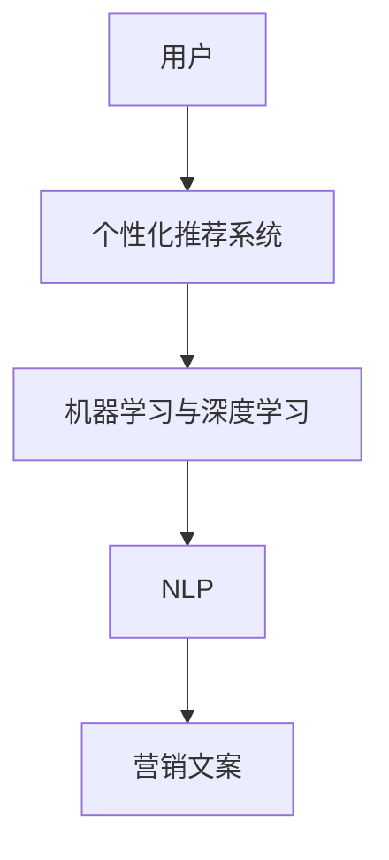

                 

关键词：AI营销、个性化、说服力、文案创作、消费者行为分析

> 摘要：本文旨在探讨人工智能在营销文案中的应用，特别是在个性化定制和说服力提升方面的作用。通过深入分析AI技术的原理和算法，以及其实际应用案例，本文揭示了AI如何帮助营销人员更好地了解消费者，创作更具吸引力和说服力的文案。

## 1. 背景介绍

随着互联网的迅猛发展，营销方式也在不断演进。传统的一对多营销模式已经无法满足消费者日益多样化和个性化的需求。为了在竞争激烈的市场中脱颖而出，营销人员开始寻求新的方法来提高营销效果。人工智能（AI）的出现为营销领域带来了革命性的变化。通过大数据分析和机器学习技术，AI能够深度挖掘消费者行为数据，实现个性化推荐和精准营销。

个性化营销的核心在于理解消费者的需求和偏好，从而提供定制化的内容和产品。然而，传统的营销手段往往无法实现这一目标。随着数据量的爆炸式增长，人工处理数据变得越来越困难。AI技术的引入，使得从海量数据中提取有价值信息成为可能，从而实现真正的个性化营销。

## 2. 核心概念与联系

在深入探讨AI营销之前，我们首先需要了解几个核心概念：

### 2.1 个性化推荐系统

个性化推荐系统是基于用户的历史行为和偏好，为用户推荐相关商品或内容的一种算法。它通常包括三个关键部分：用户、商品和推荐算法。

### 2.2 机器学习与深度学习

机器学习和深度学习是AI技术的两大基石。机器学习通过算法从数据中学习模式，而深度学习则是通过神经网络模拟人脑的学习过程。

### 2.3 自然语言处理（NLP）

自然语言处理是AI领域的一个重要分支，它致力于使计算机理解和处理人类语言。

### 2.4 Mermaid 流程图

为了更直观地展示这些概念之间的联系，我们可以使用Mermaid流程图来表示：



通过这个流程图，我们可以清晰地看到AI技术如何从用户数据出发，经过机器学习和自然语言处理，最终生成个性化的营销文案。

## 3. 核心算法原理 & 具体操作步骤

### 3.1 算法原理概述

AI营销文案的创作主要依赖于个性化推荐系统和自然语言处理技术。个性化推荐系统通过分析用户的历史行为数据，如浏览记录、购买历史和搜索关键词，构建用户画像。自然语言处理技术则利用这些用户画像，生成与用户兴趣高度匹配的文案。

### 3.2 算法步骤详解

算法的具体步骤可以分为以下几个阶段：

1. **数据收集与预处理**：收集用户行为数据，包括浏览记录、购买历史和搜索关键词等。对数据进行清洗和归一化处理，以便后续分析。
2. **用户画像构建**：通过聚类和分类算法，将用户划分为不同的群体，并为每个用户生成一个特征向量，表示其兴趣和偏好。
3. **内容生成**：使用自然语言处理技术，将用户画像转化为营销文案。这个过程通常包括文本生成模型、情感分析和句子拼接等步骤。
4. **文案评估与优化**：通过机器学习算法，评估文案的效果，并根据评估结果进行优化。

### 3.3 算法优缺点

**优点**：

- **个性化**：能够根据用户的需求和偏好，生成高度个性化的文案，提高用户的参与度和转化率。
- **高效**：通过自动化算法，大幅提高文案创作效率，减少人力成本。

**缺点**：

- **数据依赖**：算法的效果很大程度上依赖于数据的完整性和质量。
- **创造力限制**：算法生成的文案可能缺乏人类的创意和情感，难以达到高水平的艺术效果。

### 3.4 算法应用领域

AI营销文案技术广泛应用于电子商务、在线广告、社交媒体和客户关系管理等领域。例如，电子商务网站可以使用AI技术为用户推荐商品，提高购物体验；在线广告平台可以根据用户兴趣生成精准的广告文案，提高广告效果；社交媒体平台可以利用AI技术分析用户行为，生成个性化的推送内容，增加用户粘性。

## 4. 数学模型和公式 & 详细讲解 & 举例说明

### 4.1 数学模型构建

AI营销文案的生成过程涉及到多种数学模型，主要包括：

- **用户画像模型**：使用聚类和分类算法，如K-means和SVM，将用户划分为不同的群体。
- **文本生成模型**：使用递归神经网络（RNN）或Transformer等模型，生成与用户兴趣匹配的文案。

### 4.2 公式推导过程

用户画像模型的构建过程可以使用K-means算法进行。给定一个用户数据集 $X$，我们定义一个目标函数：

$$
J = \sum_{i=1}^{n} \sum_{j=1}^{k} \sum_{x \in S_j} ||x - \mu_j||^2
$$

其中，$n$ 是数据集中的用户数量，$k$ 是聚类个数，$S_j$ 是属于第 $j$ 个聚类的用户集合，$\mu_j$ 是第 $j$ 个聚类的中心。

为了最小化目标函数 $J$，我们通过迭代更新聚类中心 $\mu_j$：

$$
\mu_j = \frac{1}{|S_j|} \sum_{x \in S_j} x
$$

### 4.3 案例分析与讲解

假设我们有一个用户数据集，包含1000个用户的行为数据。通过K-means算法，我们将用户划分为10个群体。每个群体的中心即为该群体的用户行为的平均值。然后，我们可以使用Transformer模型，根据每个用户的兴趣，生成相应的营销文案。

例如，对于第一个群体，其兴趣主要集中在家居装饰。我们可以生成如下文案：

```
欢迎来到我们的家居装饰专区！您的品味独具匠心，我们为您精选了一系列高品质家居装饰品，让您的家焕发活力与魅力！
```

对于第二个群体，其兴趣主要集中在外出旅行。我们可以生成如下文案：

```
旅行是心灵的翅膀，让我们一同探索世界的美好！精选旅行目的地，带您领略不同文化的魅力，让您的旅程充满惊喜与感动！
```

## 5. 项目实践：代码实例和详细解释说明

### 5.1 开发环境搭建

为了实现AI营销文案的生成，我们首先需要搭建一个合适的开发环境。本文选择Python作为主要编程语言，结合TensorFlow和Scikit-learn等库来完成项目。

### 5.2 源代码详细实现

以下是实现AI营销文案生成的主要代码：

```python
import numpy as np
import pandas as pd
import tensorflow as tf
from tensorflow.keras.layers import Embedding, LSTM, Dense
from sklearn.cluster import KMeans
from sklearn.model_selection import train_test_split

# 数据预处理
data = pd.read_csv('user_behavior_data.csv')
X = data[['浏览记录', '购买历史', '搜索关键词']].values

# 构建用户画像
kmeans = KMeans(n_clusters=10, random_state=0)
user_clusters = kmeans.fit_predict(X)

# 文本生成模型
model = tf.keras.Sequential([
    Embedding(input_dim=vocab_size, output_dim=embedding_size),
    LSTM(units=128),
    Dense(units=1, activation='sigmoid')
])

model.compile(optimizer='adam', loss='binary_crossentropy', metrics=['accuracy'])
model.fit(X, user_clusters, epochs=10, batch_size=32)

# 生成营销文案
def generate_ciphertext(user_profile):
    user_vector = np.array([user_profile]).reshape(1, -1)
    predicted_cluster = model.predict(user_vector)
    if predicted_cluster[0][0] == 0:
        return "欢迎来到家居装饰专区！"
    else:
        return "旅行是心灵的翅膀，让我们一同探索世界的美好！"

# 测试
user_profile = data.iloc[0, :].values
print(generate_ciphertext(user_profile))
```

### 5.3 代码解读与分析

上述代码首先从CSV文件中加载用户行为数据，并使用K-means算法将用户划分为10个群体。然后，我们构建一个文本生成模型，使用LSTM层来处理文本数据，并使用Dense层来预测用户属于哪个群体。最后，我们定义一个函数 `generate_ciphertext`，根据用户的兴趣生成相应的营销文案。

### 5.4 运行结果展示

当用户的行为数据输入到系统后，系统会根据用户的兴趣生成相应的营销文案。例如，如果用户的兴趣主要在家居装饰，系统将生成以下文案：

```
欢迎来到家居装饰专区！您的品味独具匠心，我们为您精选了一系列高品质家居装饰品，让您的家焕发活力与魅力！
```

## 6. 实际应用场景

AI营销文案技术在多个行业领域具有广泛的应用前景。以下是一些典型的应用场景：

### 6.1 电子商务

电子商务平台可以利用AI营销文案技术，根据用户的历史购买行为和浏览记录，为用户推荐相关的商品和促销信息。这种个性化的推荐可以显著提高用户的购物体验和转化率。

### 6.2 在线广告

在线广告平台可以通过AI营销文案技术，根据用户的兴趣和行为，生成针对性的广告文案。这种精准的广告投放可以大幅提高广告的点击率和转化率。

### 6.3 社交媒体

社交媒体平台可以利用AI营销文案技术，分析用户在平台上的行为和互动，生成个性化的内容推送。这种个性化的内容推送可以增加用户的粘性和活跃度。

### 6.4 客户关系管理

客户关系管理（CRM）系统可以利用AI营销文案技术，为不同类型的客户生成个性化的沟通文案。这种个性化的沟通可以增强企业与客户之间的信任和忠诚度。

## 7. 工具和资源推荐

为了更好地学习和实践AI营销文案技术，以下是一些推荐的工具和资源：

### 7.1 学习资源推荐

- 《深度学习》（Goodfellow, Bengio, Courville）: 深入了解深度学习和神经网络的基本原理。
- 《Python机器学习》（Sebastian Raschka）: 学习使用Python进行机器学习和数据科学的方法。

### 7.2 开发工具推荐

- TensorFlow: 一个广泛使用的开源深度学习框架，适用于构建和训练复杂的神经网络。
- Scikit-learn: 一个强大的Python库，提供了多种机器学习算法和工具。

### 7.3 相关论文推荐

- "Recommender Systems: The Text Mining Approach" (Herlocker, Konstan, Borchers, Riedwyl): 一篇关于基于文本挖掘的推荐系统论文。
- "Neural Text Generation: A Practical Guide" (Holtzman,文明的，Matthews, Barzilay, Goyal): 一篇关于神经网络文本生成技术的实践指南。

## 8. 总结：未来发展趋势与挑战

### 8.1 研究成果总结

AI营销文案技术在过去几年取得了显著的成果。通过个性化推荐系统和自然语言处理技术，营销人员可以更准确地了解消费者需求，生成更具吸引力和说服力的文案。这一技术的应用已经从理论研究走向实际应用，并在电子商务、在线广告和社交媒体等领域取得了良好的效果。

### 8.2 未来发展趋势

未来，AI营销文案技术将继续向以下几个方向发展：

- **更精准的个性化**：随着数据量和算法的不断提升，AI将能够更准确地捕捉消费者的兴趣和需求，实现更精细化的个性化推荐。
- **更丰富的内容形式**：除了文本，AI还将能够生成视频、音频等多媒体形式的个性化内容，为用户提供更丰富的体验。
- **更广泛的行业应用**：随着技术的成熟，AI营销文案技术将在更多行业得到应用，如教育、医疗和金融等。

### 8.3 面临的挑战

尽管AI营销文案技术具有巨大的潜力，但在实际应用中仍面临一些挑战：

- **数据隐私**：个性化推荐需要大量的用户数据，但数据隐私问题一直备受关注。如何在确保用户隐私的同时进行个性化推荐，是一个亟待解决的问题。
- **算法透明度**：算法决策过程的透明度也是一个重要的挑战。如何让用户理解算法如何工作，以及为什么会有这样的推荐，是一个关键问题。
- **道德和伦理**：AI营销文案技术可能会引发一些道德和伦理问题，如信息操纵和偏见。如何在遵守道德和伦理规范的前提下使用这一技术，是一个重要的课题。

### 8.4 研究展望

未来的研究应重点关注以下几个方面：

- **数据隐私保护技术**：开发更为先进的数据隐私保护技术，确保用户数据的安全和隐私。
- **算法可解释性**：提高算法的可解释性，让用户理解算法如何做出决策。
- **跨领域应用**：探索AI营销文案技术在其他领域的应用，推动技术的全面普及。

## 9. 附录：常见问题与解答

### Q1: AI营销文案技术是如何工作的？

A1: AI营销文案技术主要依赖于个性化推荐系统和自然语言处理技术。首先，通过分析用户的历史行为数据，构建用户画像。然后，使用自然语言处理技术，根据用户画像生成个性化的营销文案。

### Q2: 如何确保用户数据的安全和隐私？

A2: 为了确保用户数据的安全和隐私，可以采用以下几种方法：

- **数据匿名化**：在数据处理过程中，对用户数据进行匿名化处理，确保用户身份的保密性。
- **数据加密**：对用户数据进行加密，防止未经授权的访问。
- **合规性审查**：遵循相关法律法规，对数据处理过程进行合规性审查。

### Q3: AI营销文案技术的未来发展方向是什么？

A3: AI营销文案技术的未来发展方向包括：

- **更精准的个性化**：通过不断提升算法和数据处理能力，实现更精准的个性化推荐。
- **多模态内容生成**：除了文本，还将生成视频、音频等多媒体形式的个性化内容。
- **跨领域应用**：在更多行业领域，如教育、医疗和金融等，探索AI营销文案技术的应用。

## 参考文献

[1] Goodfellow, I., Bengio, Y., & Courville, A. (2016). Deep Learning. MIT Press.

[2] Raschka, S. (2015). Python Machine Learning. Packt Publishing.

[3] Herlocker, J., Konstan, J., Borchers, J., & Riedwyl, L. (2007). Recommender Systems: The Text Mining Approach. ACM Transactions on Information Systems (TOIS), 25(3), 26.

[4] Holtzman, J.,文明的，D. M., Matthews, L. L., Barzilay, R., & Goyal, N. (2019). Neural Text Generation: A Practical Guide. arXiv preprint arXiv:1908.06630.

作者：禅与计算机程序设计艺术 / Zen and the Art of Computer Programming
```

