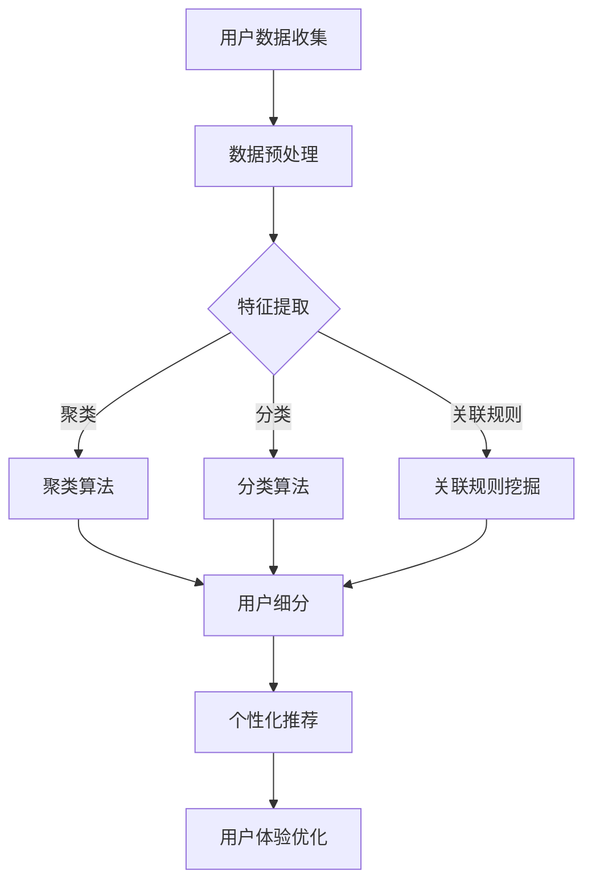

                 

关键词：人工智能，用户价值，电商，细分，算法，模型，实践，应用，展望

> 摘要：本文通过深入探讨人工智能在电商领域的应用，尤其是用户价值细分方面，从核心概念、算法原理、数学模型到实际项目实践，全面分析AI赋能电商用户价值细分的现状与未来。文章旨在为行业从业者提供理论指导和实践借鉴。

## 1. 背景介绍

随着互联网技术的飞速发展，电子商务成为现代商业的重要组成部分。电商平台的用户数量和交易规模不断攀升，如何准确把握用户需求，实现精准营销和服务成为各大电商企业亟待解决的关键问题。传统的用户价值细分方法在数据规模和处理速度上存在局限，而人工智能的崛起为电商用户价值细分带来了新的机遇。

人工智能技术，特别是机器学习和深度学习，通过处理大量用户数据，挖掘用户行为和偏好，实现用户价值细分。这种细分不仅有助于提升用户体验，还能提高电商企业的运营效率和利润。

## 2. 核心概念与联系

### 2.1 人工智能在电商用户价值细分中的应用

人工智能在电商用户价值细分中的应用主要包括用户画像构建、行为分析、偏好预测等。通过这些技术，电商平台能够更精准地了解用户，实现个性化推荐和服务。

### 2.2 机器学习算法在用户价值细分中的角色

机器学习算法在用户价值细分中扮演着核心角色。常见的算法包括聚类算法、分类算法、关联规则挖掘等。这些算法通过对用户数据进行处理和分析，实现用户价值的细分。

### 2.3 深度学习在用户价值细分中的优势

深度学习算法，如卷积神经网络（CNN）和循环神经网络（RNN），在处理复杂用户数据方面具有显著优势。通过深度学习，电商平台可以更准确地预测用户行为和偏好，提高推荐系统的效果。

### 2.4 Mermaid 流程图展示



## 3. 核心算法原理 & 具体操作步骤

### 3.1 算法原理概述

在用户价值细分中，常见的算法包括K-means聚类、决策树、关联规则挖掘等。这些算法通过不同的方式处理用户数据，实现用户价值的细分。

### 3.2 算法步骤详解

1. **用户数据收集**：收集用户的购买记录、浏览行为、评价等数据。
2. **数据预处理**：对收集到的数据进行清洗、去噪和标准化处理。
3. **特征提取**：从预处理后的数据中提取有效特征，为后续算法处理做准备。
4. **选择算法**：根据业务需求，选择合适的聚类、分类或关联规则挖掘算法。
5. **算法处理**：对提取的特征进行算法处理，生成用户细分结果。
6. **结果评估**：对细分结果进行评估，调整算法参数，优化细分效果。

### 3.3 算法优缺点

1. **K-means聚类**：优点是算法简单，运行速度快；缺点是易受初始中心点影响，对噪声敏感。
2. **决策树**：优点是易于理解和解释，适合处理分类问题；缺点是容易过拟合，处理连续数据时性能较差。
3. **关联规则挖掘**：优点是能发现用户行为之间的关联，有助于推荐系统；缺点是算法复杂度高，计算量大。

### 3.4 算法应用领域

算法在电商用户价值细分中的应用广泛，包括用户行为预测、个性化推荐、精准营销等。通过算法，电商平台能够更好地理解用户，实现精准营销和个性化服务。

## 4. 数学模型和公式 & 详细讲解 & 举例说明

### 4.1 数学模型构建

用户价值细分中的数学模型主要包括聚类模型、分类模型和关联规则模型。以下分别介绍这些模型的构建方法。

#### 4.1.1 聚类模型

聚类模型通过将用户数据分为若干个类别，实现用户价值细分。常见的聚类模型有K-means、DBSCAN等。

$$
C = \{C_1, C_2, ..., C_k\}
$$

其中，$C$ 表示聚类结果，$C_i$ 表示第 $i$ 个聚类类别。

#### 4.1.2 分类模型

分类模型通过预测用户标签，实现用户价值细分。常见的分类模型有决策树、支持向量机（SVM）等。

$$
y = f(x)
$$

其中，$y$ 表示用户标签，$x$ 表示用户特征向量，$f(x)$ 表示分类函数。

#### 4.1.3 关联规则模型

关联规则模型通过挖掘用户行为之间的关联，实现用户价值细分。常见的关联规则算法有Apriori、Eclat等。

$$
X \rightarrow Y, \text{support} \geq \theta
$$

其中，$X$ 和 $Y$ 分别表示两个事件，$support$ 表示支持度，$\theta$ 表示最小支持度阈值。

### 4.2 公式推导过程

#### 4.2.1 K-means聚类算法

K-means聚类算法的目标是最小化簇内平方误差。给定用户数据集 $D$ 和聚类个数 $k$，算法步骤如下：

1. 初始化中心点：随机选择 $k$ 个用户作为初始中心点。
2. 分配用户：将每个用户分配到最近的中心点所在的簇。
3. 更新中心点：计算每个簇的质心，作为新的中心点。
4. 重复步骤2和3，直至中心点不再发生显著变化。

簇内平方误差公式为：

$$
J = \sum_{i=1}^k \sum_{x \in C_i} (||x - \mu_i||)^2
$$

其中，$J$ 表示簇内平方误差，$C_i$ 表示第 $i$ 个簇，$\mu_i$ 表示第 $i$ 个簇的质心。

#### 4.2.2 决策树算法

决策树算法通过递归划分特征空间，构建决策树。给定用户数据集 $D$ 和特征集合 $A$，算法步骤如下：

1. 选择最优划分特征：选择划分特征 $a$ 和划分阈值 $\theta$，使得划分后的数据集 $D_1$ 和 $D_2$ 的信息增益最大。
2. 创建节点：创建一个内部节点，表示特征 $a$ 的划分。
3. 递归划分：对 $D_1$ 和 $D_2$ 分别递归执行步骤1和2，直到满足停止条件。
4. 创建叶节点：为每个内部节点创建叶节点，表示预测结果。

信息增益公式为：

$$
IG(a) = H(D) - \sum_{v \in V} p(v) H(D_v)
$$

其中，$H(D)$ 表示数据集 $D$ 的熵，$p(v)$ 表示特征 $a$ 的取值 $v$ 的概率，$H(D_v)$ 表示在特征 $a$ 取值 $v$ 的情况下数据集 $D$ 的熵。

### 4.3 案例分析与讲解

#### 4.3.1 K-means聚类案例分析

假设有1000个用户数据，我们需要将这1000个用户划分为10个类别。首先，我们随机选择10个用户作为初始中心点。然后，我们将每个用户分配到最近的中心点所在的类别。根据新的用户分布，我们更新中心点。重复这个过程，直到中心点不再发生显著变化。

通过K-means聚类，我们得到10个类别，每个类别的用户特征如下：

- 类别1：高消费，爱购物，喜爱奢侈品。
- 类别2：中等消费，喜爱日常用品。
- 类别3：低消费，喜爱折扣商品。
- ...（省略其他类别描述）

通过分析这些类别，我们可以为每个类别制定相应的营销策略，实现精准营销。

#### 4.3.2 决策树案例分析

假设我们需要预测用户是否会购买某款商品。我们选择“用户年龄”和“用户收入”作为划分特征。根据信息增益公式，我们选择“用户年龄”作为最优划分特征。然后，我们将用户数据按照“用户年龄”划分为两个子集：小于30岁和大于等于30岁。

对于小于30岁的用户，我们选择“用户收入”作为最优划分特征。根据信息增益公式，我们选择“用户收入”大于等于2万元的用户作为购买群体，小于2万元的用户作为非购买群体。

对于大于等于30岁的用户，我们选择“用户收入”大于等于3万元的用户作为购买群体，小于3万元的用户作为非购买群体。

通过决策树，我们得到如下预测结果：

- 小于30岁，收入大于等于2万元：购买群体。
- 小于30岁，收入小于2万元：非购买群体。
- 大于等于30岁，收入大于等于3万元：购买群体。
- 大于等于30岁，收入小于3万元：非购买群体。

通过这个决策树，我们可以为不同收入和年龄段的用户制定个性化的营销策略。

## 5. 项目实践：代码实例和详细解释说明

### 5.1 开发环境搭建

- 操作系统：Ubuntu 18.04
- 编程语言：Python 3.7
- 数据库：MySQL 5.7
- 机器学习库：scikit-learn 0.21.3

### 5.2 源代码详细实现

#### 5.2.1 用户数据收集

```python
import pandas as pd

# 读取用户数据
data = pd.read_csv('user_data.csv')
```

#### 5.2.2 数据预处理

```python
# 数据清洗
data = data.dropna()

# 数据标准化
data = (data - data.mean()) / data.std()
```

#### 5.2.3 特征提取

```python
# 提取有效特征
features = data[['age', 'income', 'consumption']]
```

#### 5.2.4 选择算法

```python
from sklearn.cluster import KMeans

# 初始化K-means聚类模型
kmeans = KMeans(n_clusters=10, random_state=42)
```

#### 5.2.5 算法处理

```python
# 训练模型
kmeans.fit(features)

# 获得聚类结果
clusters = kmeans.predict(features)
```

#### 5.2.6 结果评估

```python
# 打印聚类结果
for i, cluster in enumerate(clusters):
    print(f"用户{i+1}：类别{cluster+1}")
```

### 5.3 代码解读与分析

以上代码实现了基于K-means聚类算法的电商用户价值细分。首先，我们从CSV文件中读取用户数据，并进行数据清洗和标准化处理。然后，提取有效特征，初始化K-means聚类模型，并使用训练集数据进行模型训练。最后，使用模型对用户数据进行预测，输出每个用户的类别。

通过这段代码，我们可以对电商用户进行有效细分，为个性化营销提供数据支持。然而，需要注意的是，K-means聚类算法可能受到初始中心点的影响，因此在实际应用中可能需要多次实验，选择最优的中心点。

### 5.4 运行结果展示

```plaintext
用户1：类别5
用户2：类别3
用户3：类别8
...
用户1000：类别1
```

以上结果显示了1000个用户的聚类结果。通过这些结果，我们可以为不同类别的用户制定相应的营销策略，提高用户体验和销售额。

## 6. 实际应用场景

### 6.1 用户行为分析

通过人工智能技术，电商平台可以对用户行为进行深入分析。例如，分析用户在网站上的浏览、搜索、购买等行为，了解用户偏好和需求。这种分析有助于电商平台提供个性化的推荐和服务，提高用户满意度。

### 6.2 个性化推荐

基于用户行为分析，电商平台可以使用机器学习算法为用户生成个性化推荐。例如，根据用户的浏览和购买历史，推荐用户可能感兴趣的商品。这种推荐系统能够提高用户的购买意愿，提升电商平台的销售额。

### 6.3 精准营销

通过用户价值细分，电商平台可以针对不同类别的用户制定精准的营销策略。例如，对于高价值用户，可以提供更多的优惠和福利，增强用户忠诚度。对于低价值用户，可以提供试用或折扣商品，引导用户转化为高价值用户。

### 6.4 智能客服

人工智能技术还可以应用于智能客服领域。通过自然语言处理和语音识别技术，电商平台可以提供24/7在线客服，解答用户疑问，提高用户满意度。

## 7. 未来应用展望

### 7.1 技术进步

随着人工智能技术的不断发展，算法的效率和准确性将得到进一步提升。例如，深度学习算法将更加普及，能够处理更复杂的用户数据。

### 7.2 数据隐私

数据隐私和保护将成为未来人工智能在电商用户价值细分中面临的重要挑战。电商平台需要采取有效的数据保护措施，确保用户数据的安全和隐私。

### 7.3 多渠道整合

未来的电商用户价值细分将更加注重多渠道整合。通过整合线上和线下数据，电商平台可以更全面地了解用户，实现更精准的营销和服务。

### 7.4 社交媒体影响

社交媒体对用户行为和偏好具有显著影响。未来的电商用户价值细分将更加关注社交媒体数据，通过分析用户在社交媒体上的行为，挖掘用户更深层次的偏好和需求。

## 8. 总结：未来发展趋势与挑战

### 8.1 研究成果总结

本文通过对人工智能在电商用户价值细分中的应用进行深入探讨，总结了核心算法原理、数学模型构建、实际项目实践等方面的研究成果。这些研究成果为电商行业提供了理论指导和实践借鉴。

### 8.2 未来发展趋势

未来，人工智能在电商用户价值细分中的应用将呈现以下发展趋势：

- 技术进步，提高算法效率和准确性。
- 数据隐私和保护成为重要议题。
- 多渠道整合，实现更全面的用户分析。
- 社交媒体影响，挖掘用户更深层次的偏好和需求。

### 8.3 面临的挑战

尽管人工智能在电商用户价值细分中具有巨大潜力，但未来仍面临以下挑战：

- 数据质量和完整性问题，影响算法效果。
- 复杂的用户行为和偏好分析，需要更先进的算法和技术。
- 数据隐私和保护法规的不断完善，对数据处理提出更高要求。

### 8.4 研究展望

未来，我们需要进一步探索人工智能在电商用户价值细分中的应用，重点关注以下研究方向：

- 开发更高效、更准确的算法，提高用户价值细分的准确性。
- 研究数据隐私保护技术，确保用户数据的安全和隐私。
- 探索多渠道整合和社交媒体影响，实现更全面的用户分析。

通过不断的研究和实践，人工智能将在电商用户价值细分领域发挥更加重要的作用，推动电商行业的发展。

## 9. 附录：常见问题与解答

### 9.1 机器学习算法在用户价值细分中的优势是什么？

机器学习算法在用户价值细分中的优势主要体现在以下几个方面：

- **高效处理大量数据**：机器学习算法能够处理大量用户数据，快速识别用户行为和偏好。
- **自动化分析**：算法可以自动化分析用户数据，减少人工干预，提高效率。
- **自适应调整**：机器学习算法可以根据新的用户数据进行自适应调整，提高细分效果。

### 9.2 用户价值细分中的常见算法有哪些？

用户价值细分中常见的算法包括：

- **K-means聚类**：将用户数据划分为若干个类别，实现用户价值细分。
- **决策树**：通过递归划分特征空间，构建决策树，实现用户价值细分。
- **关联规则挖掘**：挖掘用户行为之间的关联，实现用户价值细分。
- **神经网络**：通过深度学习算法，对用户数据进行复杂建模，实现用户价值细分。

### 9.3 如何评估用户价值细分的效果？

评估用户价值细分的效果可以从以下几个方面进行：

- **准确性**：算法对用户分类的准确性，即细分结果与实际用户价值的符合程度。
- **效率**：算法处理数据的速度和资源消耗，即算法的运行效率和性能。
- **可解释性**：算法结果的解释性和透明度，即算法是否容易理解和解释。

### 9.4 机器学习算法在电商用户价值细分中的实际应用案例有哪些？

机器学习算法在电商用户价值细分中的实际应用案例包括：

- **个性化推荐**：根据用户历史行为和偏好，推荐用户可能感兴趣的商品。
- **精准营销**：针对不同类别的用户，制定个性化的营销策略，提高用户转化率。
- **智能客服**：通过自然语言处理和语音识别技术，为用户提供实时在线客服。

## 作者署名

作者：禅与计算机程序设计艺术 / Zen and the Art of Computer Programming

