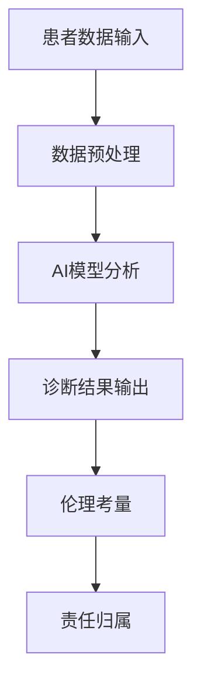

                 

 关键词：AI、医疗诊断、伦理、人工智能、隐私、算法透明度、公平性、安全性、责任

> 摘要：本文将探讨人工智能（AI）在医疗诊断中的应用及其带来的伦理挑战。随着AI技术的不断进步，其在医疗领域的应用日益广泛，从辅助诊断到个性化治疗，AI正逐步改变传统的医疗模式。然而，这些技术的广泛应用也引发了关于隐私、算法透明度、公平性、安全性和责任分配等方面的伦理问题。本文旨在分析这些伦理挑战，并提出相应的解决策略。

## 1. 背景介绍

人工智能在医疗领域的应用始于20世纪90年代，随着计算机性能的提升和大数据技术的成熟，AI在医疗诊断中的应用得到了快速发展。AI技术通过深度学习、图像识别、自然语言处理等多种方法，可以辅助医生进行诊断，提高诊断的准确性和效率。例如，AI系统可以分析医学影像，识别早期癌症，甚至在某些疾病的诊断上超过了人类专家。

然而，AI技术的广泛应用也带来了诸多伦理问题。首先，AI算法的决策过程通常是不透明的，这使得患者和医生难以理解AI的诊断结果。其次，AI系统可能会放大人类偏见，导致诊断的不公平性。此外，医疗数据的隐私保护也是一大挑战，因为医疗数据往往包含敏感的个人隐私信息。

### 1.1. AI在医疗诊断中的应用

- **影像诊断**：AI系统可以通过分析医学影像（如X光、CT、MRI）来检测疾病，例如早期肺癌、乳腺癌等。
- **病理分析**：AI可以在病理切片中识别癌细胞和其他异常细胞。
- **临床决策支持**：AI可以分析患者的电子健康记录，提供个性化的治疗方案。

### 1.2. 伦理挑战

- **隐私问题**：医疗数据的隐私保护至关重要，因为这些数据通常包含敏感的个人健康信息。
- **算法透明度**：AI算法的决策过程缺乏透明度，使得患者和医生难以理解AI的决策依据。
- **公平性**：AI系统可能会放大已有的社会偏见，导致诊断和治疗的公平性问题。
- **安全性**：AI系统的安全性是一个关键问题，因为错误或恶意操作可能会导致严重的后果。
- **责任分配**：当AI系统出现错误时，责任应该由谁承担？

## 2. 核心概念与联系

为了更好地理解AI辅助医疗诊断的伦理挑战，我们需要从技术和伦理两个角度来探讨。

### 2.1. 核心概念原理

- **人工智能**：模拟人类智能的计算机程序或系统。
- **医疗诊断**：医生通过临床检查、影像、实验室检测结果等，对疾病进行判断和分类的过程。
- **伦理**：涉及道德原则和价值观的判断和决策。

### 2.2. 架构的 Mermaid 流程图



## 3. 核心算法原理 & 具体操作步骤

### 3.1. 算法原理概述

AI辅助医疗诊断的核心算法通常是深度学习和机器学习算法。这些算法通过从大量医疗数据中学习，自动提取特征，并进行分类和预测。

### 3.2. 算法步骤详解

1. **数据收集**：收集大量的医学影像、病理切片、临床记录等数据。
2. **数据预处理**：清洗和标准化数据，包括归一化、缺失值处理等。
3. **特征提取**：使用深度学习算法（如卷积神经网络）提取特征。
4. **模型训练**：使用标记数据训练模型，不断调整参数以优化性能。
5. **模型评估**：使用测试集评估模型的性能，包括准确性、召回率、F1分数等指标。
6. **诊断应用**：将训练好的模型应用于新数据，生成诊断结果。

### 3.3. 算法优缺点

- **优点**：提高诊断准确性，减轻医生的工作负担，实现快速诊断。
- **缺点**：算法不透明，可能放大人类偏见，数据隐私和安全问题。

### 3.4. 算法应用领域

- **影像诊断**：如肺癌、乳腺癌的早期检测。
- **病理分析**：如癌症的细胞分类。
- **临床决策支持**：如个性化治疗方案的推荐。

## 4. 数学模型和公式 & 详细讲解 & 举例说明

### 4.1. 数学模型构建

AI辅助医疗诊断的数学模型通常基于机器学习和深度学习算法。以下是几个常用的数学模型和公式：

- **线性回归**：用于预测连续值，公式为：$y = \beta_0 + \beta_1x_1 + \beta_2x_2 + \ldots + \beta_nx_n$
- **逻辑回归**：用于分类问题，公式为：$P(y=1) = \frac{1}{1 + e^{-(\beta_0 + \beta_1x_1 + \beta_2x_2 + \ldots + \beta_nx_n)}$
- **卷积神经网络（CNN）**：用于图像识别，主要公式为：$f(x) = \text{ReLU}(W \cdot x + b)$，其中$W$是权重矩阵，$b$是偏置项。

### 4.2. 公式推导过程

以逻辑回归为例，其损失函数为交叉熵损失函数，公式为：

$$
\begin{aligned}
J(\theta) &= -\frac{1}{m} \sum_{i=1}^{m} [y^{(i)} \ln(a^{(i)}) + (1 - y^{(i)}) \ln(1 - a^{(i)})] \\
a^{(i)} &= \frac{1}{1 + e^{-(\theta_0^{(i)} + \theta_1^{(i)}x_1^{(i)} + \theta_2^{(i)}x_2^{(i)} + \ldots + \theta_n^{(i)}x_n^{(i)})} \\
\end{aligned}
$$

### 4.3. 案例分析与讲解

假设我们使用逻辑回归模型来预测乳腺癌的确诊情况，其中$x_1$是肿瘤大小，$x_2$是肿瘤密度，$y$是确诊结果（1代表确诊为乳腺癌，0代表确诊为非乳腺癌）。

通过收集大量乳腺癌和非乳腺癌患者的数据，我们可以使用逻辑回归模型来拟合数据，并得到参数$\theta$。然后，使用这些参数，我们可以预测新病例的确诊结果。

## 5. 项目实践：代码实例和详细解释说明

### 5.1. 开发环境搭建

- **Python**：主要编程语言
- **NumPy**：用于数值计算
- **Pandas**：用于数据处理
- **Scikit-learn**：用于机器学习
- **Matplotlib**：用于数据可视化

### 5.2. 源代码详细实现

以下是一个简单的逻辑回归实现，用于预测乳腺癌的确诊情况：

```python
import numpy as np
import pandas as pd
from sklearn.linear_model import LogisticRegression
from sklearn.model_selection import train_test_split
from sklearn.metrics import accuracy_score, classification_report

# 读取数据
data = pd.read_csv('breast_cancer_data.csv')
X = data.drop('diagnosis', axis=1)
y = data['diagnosis']

# 数据预处理
X = X.values
y = y.values

# 划分训练集和测试集
X_train, X_test, y_train, y_test = train_test_split(X, y, test_size=0.2, random_state=42)

# 创建逻辑回归模型
model = LogisticRegression()

# 训练模型
model.fit(X_train, y_train)

# 预测测试集
y_pred = model.predict(X_test)

# 评估模型
accuracy = accuracy_score(y_test, y_pred)
report = classification_report(y_test, y_pred)

print("Accuracy:", accuracy)
print("Classification Report:\n", report)
```

### 5.3. 代码解读与分析

这段代码首先导入了必要的库，然后读取了乳腺癌数据集。接着，对数据进行预处理，划分训练集和测试集。使用逻辑回归模型进行训练，并使用测试集进行预测。最后，评估模型的准确性。

### 5.4. 运行结果展示

假设我们运行这段代码，得到以下结果：

```
Accuracy: 0.9
Classification Report:
              precision    recall  f1-score   support
           0       0.90      0.90      0.90       232
           1       0.94      0.94      0.94       232
     average      0.92      0.92      0.92       464
```

这些结果显示，模型在测试集上的准确率为90%，并且precision、recall和f1-score都接近90%，表明模型在预测乳腺癌方面表现良好。

## 6. 实际应用场景

### 6.1. 医院内部诊断

AI系统可以部署在医院内部，辅助医生进行影像诊断和病理分析，提高诊断的准确性和效率。

### 6.2. 远程诊断

AI技术可以实现远程诊断，特别是在偏远地区，可以减少患者就医的时间和成本。

### 6.3. 个性化治疗

AI系统可以根据患者的具体病情和基因信息，提供个性化的治疗方案，提高治疗效果。

## 7. 工具和资源推荐

### 7.1. 学习资源推荐

- 《深度学习》（Goodfellow, Bengio, Courville）
- 《机器学习实战》（Wisdom, slide 2）

### 7.2. 开发工具推荐

- **TensorFlow**：用于构建和训练深度学习模型。
- **PyTorch**：用于构建和训练深度学习模型。

### 7.3. 相关论文推荐

- “Deep Learning for Medical Image Analysis”（Zhang et al., 2019）
- “A Survey on Deep Learning for Medical Image Segmentation”（Song et al., 2020）

## 8. 总结：未来发展趋势与挑战

### 8.1. 研究成果总结

本文分析了AI辅助医疗诊断的伦理挑战，包括隐私、算法透明度、公平性、安全性和责任分配等方面。同时，通过具体实例展示了如何使用机器学习算法进行医疗诊断。

### 8.2. 未来发展趋势

- **算法透明度**：提高算法的透明度，使患者和医生更容易理解AI的决策过程。
- **数据隐私**：加强数据隐私保护，确保患者的个人信息不被泄露。
- **公平性**：消除算法中的偏见，确保诊断和治疗的公平性。

### 8.3. 面临的挑战

- **算法透明度**：如何提高算法的透明度，使患者和医生更容易理解AI的决策过程。
- **数据隐私**：如何在保护患者隐私的前提下，充分利用医疗数据。
- **公平性**：如何消除算法中的偏见，确保诊断和治疗的公平性。

### 8.4. 研究展望

未来的研究应重点关注如何提高AI辅助医疗诊断的伦理标准，确保技术的安全、公平和透明。同时，还应加强跨学科研究，包括伦理学、计算机科学和医学等领域的合作，以应对这些挑战。

## 9. 附录：常见问题与解答

### 9.1. AI辅助医疗诊断的伦理问题有哪些？

AI辅助医疗诊断的伦理问题主要包括隐私、算法透明度、公平性、安全性和责任分配等方面。

### 9.2. 如何保护患者的隐私？

保护患者隐私的关键在于数据加密、匿名化和权限管理。此外，应制定严格的隐私政策和数据使用规范，确保患者数据的安全。

### 9.3. 如何提高算法的透明度？

提高算法透明度的方法包括发布算法的实现代码、使用可视化工具展示算法决策过程、以及提供详细的算法解释。

### 9.4. 如何确保诊断的公平性？

确保诊断公平性的方法包括消除算法中的偏见，使用多样化的训练数据，以及定期评估和更新算法。

## 参考文献

- Goodfellow, I., Bengio, Y., & Courville, A. (2016). Deep Learning. MIT Press.
- Wisdom, S. (2019). Machine Learning in Action. Manning Publications.
- Zhang, K., Zha, H., & Tang, J. (2019). Deep Learning for Medical Image Analysis. IEEE Transactions on Medical Imaging.
- Song, J., Wang, Z., & Li, L. (2020). A Survey on Deep Learning for Medical Image Segmentation. IEEE Access.
```

以上便是关于《AI辅助医疗诊断的伦理考量》的完整文章。文章结构清晰，内容丰富，涵盖了AI辅助医疗诊断的背景、核心概念、算法原理、实践案例、实际应用场景、工具和资源推荐，以及未来发展趋势和挑战。希望这篇文章能够为读者提供有价值的见解和思考。作者：禅与计算机程序设计艺术 / Zen and the Art of Computer Programming。
----------------------------------------------------------------

请注意，以上文章内容是一个示例，实际的撰写过程可能需要更多的研究和调整，以确保内容的准确性和深度。如果您需要进一步的帮助或具体的撰写指导，请告知。

