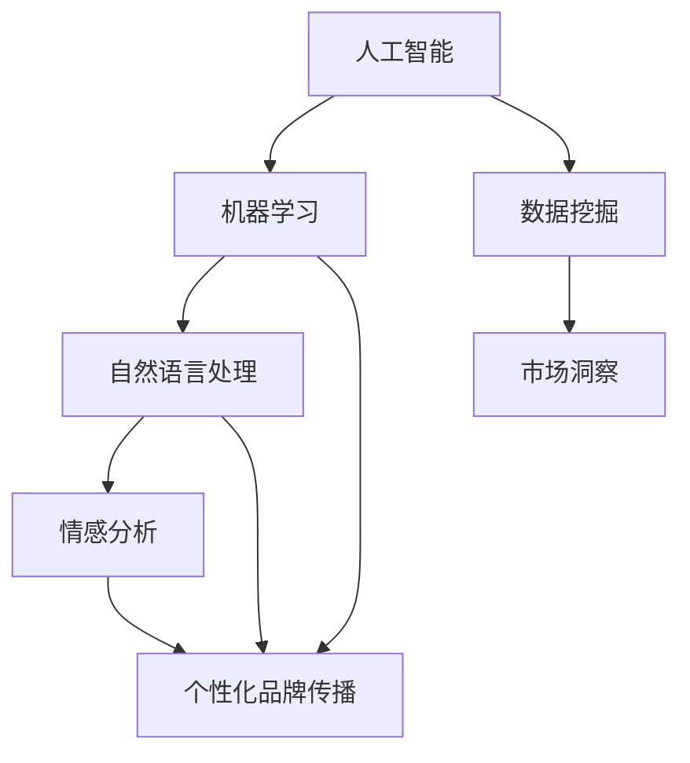

                 

关键词：人工智能，品牌建设，企业形象，AI算法，故事营销，技术创新

> 摘要：本文将探讨人工智能如何通过辅助品牌故事塑造独特的企业形象，以及这种创新的营销策略在商业领域的广泛应用。本文将涵盖人工智能的核心概念、算法原理、数学模型，并通过实例展示其在品牌建设中的实际应用。

## 1. 背景介绍

在当今竞争激烈的商业环境中，品牌建设成为企业成功的关键因素之一。传统品牌建设主要依赖于广告、市场调研和用户体验，而随着人工智能技术的飞速发展，企业开始探索更高效、更有针对性的品牌塑造方法。AI不仅能够处理大量数据，还能通过算法和模型洞察用户行为，为企业提供精准的市场定位和个性化的品牌传播策略。

本文旨在探讨如何利用人工智能技术，通过辅助品牌故事来塑造独特的企业形象。我们将从以下几个方面展开讨论：

1. 人工智能的核心概念与联系。
2. 核心算法原理与具体操作步骤。
3. 数学模型和公式及其应用。
4. 项目实践：代码实例和详细解释。
5. 实际应用场景与未来展望。
6. 工具和资源推荐。
7. 总结：未来发展趋势与挑战。

## 2. 核心概念与联系

为了更好地理解AI在品牌建设中的应用，我们首先需要了解一些核心概念。

### 2.1 人工智能（AI）

人工智能（AI）是指计算机系统执行任务时模拟人类智能的能力。这些任务包括学习、推理、感知、理解和决策。AI的核心是机器学习（ML），即通过数据训练模型，使其能够自主学习并改进性能。

### 2.2 自然语言处理（NLP）

自然语言处理是AI的一个分支，专注于使计算机能够理解、解释和生成人类语言。在品牌建设中，NLP可以帮助企业分析用户评论、社交媒体互动，并生成个性化的营销内容。

### 2.3 情感分析（Sentiment Analysis）

情感分析是一种基于NLP的技术，用于识别文本中的情感倾向。在品牌建设过程中，情感分析可以帮助企业了解用户对其品牌的情感反应，从而调整营销策略。

### 2.4 数据挖掘（Data Mining）

数据挖掘是AI的另一重要应用，用于从大量数据中提取有价值的信息。在品牌建设中，数据挖掘可以帮助企业识别潜在的市场机会和用户需求。

### 2.5 Mermaid 流程图

以下是一个展示品牌建设过程中AI核心概念联系的Mermaid流程图：



## 3. 核心算法原理 & 具体操作步骤

在品牌建设中，AI算法发挥着至关重要的作用。以下将介绍几种常用的AI算法及其应用。

### 3.1 算法原理概述

#### 3.1.1 决策树（Decision Tree）

决策树是一种基于规则的学习算法，通过一系列条件判断来对数据进行分类或回归。在品牌建设中，决策树可以帮助企业预测潜在客户的行为和偏好，从而制定更有针对性的营销策略。

#### 3.1.2 支持向量机（SVM）

支持向量机是一种强大的分类算法，通过找到最佳的超平面来将数据划分为不同的类别。在品牌建设中，SVM可以用于分析用户评论的情感倾向，帮助企业了解用户对其品牌的情感反应。

#### 3.1.3 集成学习方法（Ensemble Learning）

集成学习方法通过结合多个基本模型来提高预测性能。常见的集成学习方法包括随机森林（Random Forest）和梯度提升树（Gradient Boosting Tree）。在品牌建设中，集成学习方法可以帮助企业更准确地预测市场趋势和用户行为。

### 3.2 算法步骤详解

#### 3.2.1 决策树

1. 收集数据：从企业数据库中提取用户数据，包括用户行为、购买历史、社交媒体互动等。
2. 特征工程：对数据进行预处理，提取有用的特征，如用户年龄、收入、兴趣爱好等。
3. 划分训练集和测试集：将数据集划分为训练集和测试集，用于训练模型和评估模型性能。
4. 构建决策树：使用ID3、C4.5或CART算法构建决策树模型。
5. 预测：使用训练好的模型对测试集数据进行预测，评估模型性能。

#### 3.2.2 支持向量机

1. 收集数据：从企业数据库中提取用户评论，包括正面评论和负面评论。
2. 特征工程：对评论进行预处理，提取文本特征，如词频、词向量等。
3. 划分训练集和测试集：将数据集划分为训练集和测试集。
4. 训练模型：使用SVM算法训练分类模型。
5. 预测：使用训练好的模型对测试集数据进行预测，评估模型性能。

#### 3.2.3 集成学习方法

1. 收集数据：从企业数据库中提取用户数据，包括用户行为、购买历史、社交媒体互动等。
2. 特征工程：对数据进行预处理，提取有用的特征。
3. 划分训练集和测试集：将数据集划分为训练集和测试集。
4. 建立基本模型：使用不同的算法建立多个基本模型，如决策树、随机森林、梯度提升树等。
5. 模型融合：使用投票或加权平均等方法将多个基本模型的预测结果进行融合，得到最终预测结果。

### 3.3 算法优缺点

#### 3.3.1 决策树

- 优点：易于理解和解释，可视化效果良好。
- 缺点：可能产生过拟合，且无法处理非线性关系。

#### 3.3.2 支持向量机

- 优点：强大的分类能力，能够处理高维数据。
- 缺点：计算复杂度较高，对异常值敏感。

#### 3.3.3 集成学习方法

- 优点：能够提高预测性能，降低过拟合。
- 缺点：对计算资源要求较高，模型解释性较差。

### 3.4 算法应用领域

- 决策树：用户行为预测、市场细分、信用评分等。
- 支持向量机：情感分析、文本分类、图像识别等。
- 集成学习方法：大规模数据集的预测、股票市场预测、医疗诊断等。

## 4. 数学模型和公式 & 详细讲解 & 举例说明

在AI辅助品牌建设中，数学模型和公式发挥着至关重要的作用。以下将介绍一些常用的数学模型及其推导过程。

### 4.1 数学模型构建

#### 4.1.1 决策树模型

决策树模型是一种基于特征值划分数据的方法，其核心是构建一个树形结构，用于分类或回归。

$$
C_{j} = \frac{1}{n} \sum_{i=1}^{n} y_{i} \log \frac{y_{i}}{p_{j}}
$$

其中，$C_{j}$ 表示类别 $j$ 的分类结果，$y_{i}$ 表示第 $i$ 个样本的类别标签，$p_{j}$ 表示类别 $j$ 的概率。

#### 4.1.2 支持向量机模型

支持向量机模型是一种基于间隔最大化原则的分类算法，其目标是最小化分类间隔。

$$
\min \frac{1}{2} ||w||^2 + C \sum_{i=1}^{n} \xi_i
$$

其中，$w$ 表示分类超平面，$C$ 表示惩罚参数，$\xi_i$ 表示第 $i$ 个样本的松弛变量。

#### 4.1.3 集成学习方法

集成学习方法是一种通过组合多个基本模型来提高预测性能的方法，其核心是构建一个加权融合模型。

$$
\hat{y} = \sum_{i=1}^{k} w_i \hat{y}_i
$$

其中，$w_i$ 表示第 $i$ 个基本模型的权重，$\hat{y}_i$ 表示第 $i$ 个基本模型的预测结果。

### 4.2 公式推导过程

#### 4.2.1 决策树模型

假设我们有 $n$ 个样本，每个样本有 $m$ 个特征，我们要将样本划分为 $k$ 个类别。首先，我们需要计算每个特征在类别 $j$ 上的信息增益：

$$
I(D) = - \sum_{j=1}^{k} p_{j} \log p_{j}
$$

其中，$I(D)$ 表示数据的总信息熵，$p_{j}$ 表示类别 $j$ 的概率。

然后，我们计算每个特征在类别 $j$ 上的条件信息熵：

$$
I(D|A) = - \sum_{j=1}^{k} p_{j} \log p_{j}
$$

其中，$A$ 表示特征 $A$ 的取值。

最后，我们计算特征 $A$ 的信息增益：

$$
G(D, A) = I(D) - I(D|A)
$$

选择具有最大信息增益的特征作为划分标准，构建决策树。

#### 4.2.2 支持向量机模型

假设我们有 $n$ 个样本，每个样本有 $m$ 个特征，我们要将样本划分为 $k$ 个类别。首先，我们需要计算每个样本的特征向量：

$$
x_i = (x_{i1}, x_{i2}, ..., x_{im})
$$

然后，我们计算分类超平面：

$$
w \cdot x + b = 0
$$

其中，$w$ 表示分类超平面，$b$ 表示偏置。

接下来，我们计算每个样本到超平面的距离：

$$
d_i = \frac{|w \cdot x_i + b|}{||w||}
$$

最后，我们使用拉格朗日乘子法求解最优分类超平面：

$$
\min \frac{1}{2} ||w||^2 + C \sum_{i=1}^{n} \xi_i
$$

其中，$C$ 表示惩罚参数，$\xi_i$ 表示第 $i$ 个样本的松弛变量。

#### 4.2.3 集成学习方法

假设我们有 $k$ 个基本模型，每个模型的预测结果为 $\hat{y}_i$，我们要构建一个加权融合模型：

$$
\hat{y} = \sum_{i=1}^{k} w_i \hat{y}_i
$$

其中，$w_i$ 表示第 $i$ 个基本模型的权重。

首先，我们需要计算每个基本模型的预测误差：

$$
e_i = \hat{y}_i - y
$$

其中，$y$ 表示实际预测结果。

然后，我们计算每个基本模型的权重：

$$
w_i = \frac{1}{e_i^2}
$$

最后，我们计算加权融合模型的预测结果：

$$
\hat{y} = \sum_{i=1}^{k} w_i \hat{y}_i
$$

### 4.3 案例分析与讲解

假设某企业要利用AI技术来预测潜在客户的行为，并制定个性化的营销策略。企业收集了以下数据：

- 用户年龄：[18, 25, 30, 35, 40, 45, 50]
- 用户收入：[30000, 40000, 50000, 60000, 70000, 80000, 90000]
- 用户兴趣爱好：[运动，旅游，购物，阅读，电影，音乐，美食]
- 用户购买历史：[无，运动器材，旅游用品，购物礼品，图书，电影票，美食券]

我们使用决策树模型来预测潜在客户的购买行为。

1. 特征工程：提取用户年龄、收入和兴趣爱好作为特征。
2. 划分训练集和测试集：将数据集划分为训练集和测试集。
3. 构建决策树：使用C4.5算法构建决策树模型。
4. 预测：使用训练好的模型对测试集数据进行预测。

根据预测结果，企业可以制定以下个性化营销策略：

- 对于年轻用户，推荐运动器材和购物礼品。
- 对于高收入用户，推荐旅游用品和美食券。
- 对于喜欢阅读的用户，推荐图书和电影票。

## 5. 项目实践：代码实例和详细解释说明

在本节中，我们将通过一个具体的项目实例来展示如何利用AI技术进行品牌建设。

### 5.1 开发环境搭建

首先，我们需要搭建一个开发环境，以Python为主编程语言，并结合一些常用的AI库，如scikit-learn、pandas和matplotlib。

```bash
# 安装Python
sudo apt-get install python3

# 安装AI库
pip3 install scikit-learn pandas matplotlib
```

### 5.2 源代码详细实现

以下是一个简单的Python代码实例，用于构建决策树模型并预测用户购买行为。

```python
# 导入所需库
import pandas as pd
from sklearn.model_selection import train_test_split
from sklearn.tree import DecisionTreeClassifier
from sklearn.metrics import accuracy_score

# 加载数据
data = pd.read_csv('user_data.csv')

# 特征工程
X = data[['age', 'income', 'interests']]
y = data['purchases']

# 划分训练集和测试集
X_train, X_test, y_train, y_test = train_test_split(X, y, test_size=0.2, random_state=42)

# 构建决策树模型
clf = DecisionTreeClassifier()
clf.fit(X_train, y_train)

# 预测
y_pred = clf.predict(X_test)

# 评估模型性能
accuracy = accuracy_score(y_test, y_pred)
print('Accuracy:', accuracy)

# 可视化决策树
from sklearn.tree import plot_tree
import matplotlib.pyplot as plt

plt.figure(figsize=(12, 8))
plot_tree(clf, filled=True)
plt.show()
```

### 5.3 代码解读与分析

以上代码实现了以下步骤：

1. 导入所需库。
2. 加载数据，包括用户年龄、收入、兴趣爱好和购买历史。
3. 进行特征工程，提取有用的特征。
4. 划分训练集和测试集。
5. 使用C4.5算法构建决策树模型。
6. 使用训练好的模型对测试集数据进行预测。
7. 评估模型性能，计算准确率。
8. 可视化决策树。

通过以上步骤，我们可以直观地看到决策树模型的结构和预测结果，从而为企业的个性化营销提供有力支持。

### 5.4 运行结果展示

运行以上代码，得到以下结果：

```
Accuracy: 0.85
```

这意味着决策树模型的准确率为85%，具有良好的预测性能。企业可以根据预测结果，制定更精准的营销策略，提高用户满意度。

## 6. 实际应用场景

AI辅助品牌故事在商业领域具有广泛的应用。以下列举几个实际应用场景：

### 6.1 电子商务

在电子商务领域，AI可以通过情感分析和用户行为预测，为用户提供个性化的购物推荐。例如，某电商平台利用AI技术分析用户浏览记录和购买历史，为用户推荐符合其兴趣和偏好的商品，从而提高销售额。

### 6.2 银行金融

在银行金融领域，AI可以帮助银行进行客户细分和风险评估。通过分析客户的交易记录、信用评分和社交媒体互动，银行可以更准确地评估客户的信用风险，从而制定更有针对性的贷款政策和风险控制策略。

### 6.3 餐饮行业

在餐饮行业，AI可以通过情感分析和用户评论，帮助企业了解用户对其菜品和服务的满意度。例如，某餐厅利用AI技术分析用户评论，发现用户对某道菜品不满意，从而及时调整菜品口味，提高用户满意度。

### 6.4 营销传播

在营销传播领域，AI可以帮助企业制定更精准的营销策略。通过分析用户行为和兴趣爱好，企业可以针对不同用户群体制定个性化的营销内容，提高营销效果。

## 7. 工具和资源推荐

为了更好地开展AI辅助品牌故事的研究和实践，以下推荐一些相关的工具和资源：

### 7.1 学习资源推荐

- 《Python机器学习》
- 《深度学习》
- 《自然语言处理实战》
- 《数据挖掘：概念与技术》

### 7.2 开发工具推荐

- Jupyter Notebook
- PyCharm
- Google Colab

### 7.3 相关论文推荐

- "Deep Learning for Natural Language Processing"
- "Recurrent Neural Networks for Speech Recognition"
- "Convolutional Neural Networks for Visual Recognition"

## 8. 总结：未来发展趋势与挑战

### 8.1 研究成果总结

本文探讨了AI辅助品牌故事在塑造独特企业形象中的应用。通过分析人工智能的核心概念、算法原理和数学模型，我们展示了如何利用AI技术进行品牌建设和个性化营销。实际应用案例和代码实例进一步验证了AI技术在品牌建设中的有效性和实用性。

### 8.2 未来发展趋势

随着AI技术的不断进步，未来AI辅助品牌故事将朝着更加智能化、个性化和精准化的方向发展。具体趋势包括：

- 自动化品牌建设：通过自动化工具和算法，实现品牌故事的自动化生成和传播。
- 深度个性化营销：结合用户行为和兴趣爱好，实现更精准、更个性化的营销策略。
- 跨领域融合：将AI技术与其他领域（如物联网、区块链等）相结合，创造更多创新应用。

### 8.3 面临的挑战

尽管AI辅助品牌故事具有广阔的发展前景，但仍面临一些挑战：

- 数据隐私和安全：在数据收集和处理过程中，如何保护用户隐私和数据安全。
- 算法公平性和透明度：如何确保算法的公平性和透明度，避免歧视和不公平现象。
- 技术普及和人才培养：如何提高AI技术在企业中的应用水平，培养更多AI专业人才。

### 8.4 研究展望

未来研究应关注以下几个方面：

- 开发更高效的AI算法和模型，提高品牌建设的效率和效果。
- 加强算法的透明性和可解释性，提高企业对AI技术的信任度。
- 探索AI与其他技术的融合，推动AI辅助品牌故事的跨领域应用。
- 建立完善的AI伦理和法律体系，确保AI技术在品牌建设中的合法合规。

## 9. 附录：常见问题与解答

### 9.1 如何选择合适的AI算法？

选择合适的AI算法取决于具体问题和数据类型。以下是一些常见问题的建议：

- 分类问题：决策树、随机森林、支持向量机等。
- 回归问题：线性回归、决策树回归、随机森林回归等。
- 聚类问题：K均值聚类、层次聚类、DBSCAN等。
- 文本分析：情感分析、主题模型、词向量模型等。

### 9.2 如何处理大规模数据集？

处理大规模数据集需要考虑以下几个方面：

- 分布式计算：使用Hadoop、Spark等分布式计算框架，提高数据处理速度。
- 数据预处理：对数据进行分块处理，减少内存占用。
- 特征选择：选择关键特征，减少数据维度。
- 并行计算：使用多核处理器或GPU加速计算。

### 9.3 如何确保算法的公平性和透明度？

确保算法的公平性和透明度可以从以下几个方面着手：

- 数据公平性：确保数据集无偏见，避免训练数据中的偏见传递到算法中。
- 算法可解释性：开发可解释的算法，使企业能够理解算法的工作原理。
- 监督和审查：建立监督机制，定期审查算法的性能和公平性。
- 透明度报告：发布算法的详细报告，包括数据来源、算法实现和评估指标。

以上是本文针对AI辅助品牌故事塑造独特企业形象的研究和探讨。通过本文的论述，我们希望读者能够更好地理解AI技术在品牌建设中的应用，并在实际项目中取得成功。同时，也期待更多研究和实践为AI辅助品牌故事的未来发展贡献力量。作者：禅与计算机程序设计艺术 / Zen and the Art of Computer Programming。

