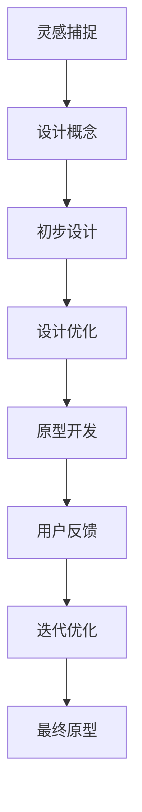
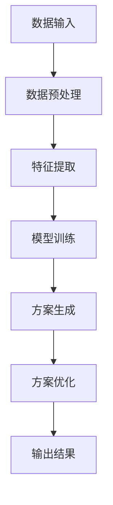
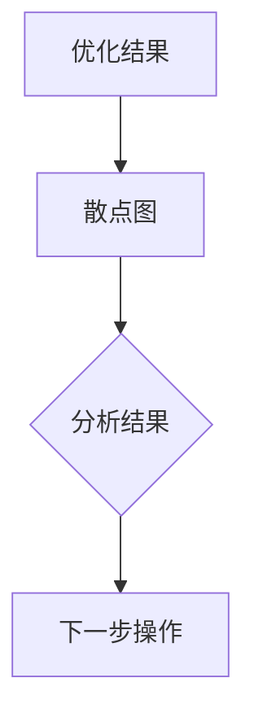

                 

关键词：人工智能，设计自动化，算法，设计流程，原型开发，设计工具，代码生成，设计思维

> 摘要：本文探讨了如何利用人工智能技术辅助设计流程，从灵感到原型阶段的全过程。通过分析人工智能在设计领域的应用，介绍了核心概念与联系，并详细阐述了设计自动化算法的原理和操作步骤。此外，本文还通过数学模型和项目实践，展示了如何使用AI工具进行代码生成和原型开发。最后，文章展望了人工智能在设计领域的未来应用和发展趋势。

## 1. 背景介绍

在现代社会，设计已经成为推动创新和发展的重要驱动力。无论是产品开发、建筑设计、还是图形设计，设计师们都需要从大量的信息中快速捕捉灵感，并通过一系列的设计流程将概念转化为实际的原型。然而，随着设计复杂度的增加和项目规模的扩大，设计过程变得越来越复杂，设计师们面临的工作量和时间压力也在不断增大。

人工智能（AI）作为一种新兴的技术，其强大的计算能力和智能算法为设计领域带来了新的机遇。通过将人工智能应用于设计流程，可以自动化许多繁琐的任务，提高设计效率，降低人力成本。例如，AI可以自动生成设计方案、优化设计参数、生成代码原型等。本文将探讨如何利用人工智能技术辅助设计流程，从灵感到原型阶段的全过程。

## 2. 核心概念与联系

在设计过程中，有许多核心概念和联系需要理解。以下是一个使用Mermaid绘制的流程图，展示了设计自动化算法中的主要节点和流程。



在这个流程图中，灵感捕捉是设计流程的起点，设计师通过观察、思考和交流来捕捉灵感和创意。设计概念是将灵感转化为具体的设计想法，并进行初步设计。初步设计是设计师根据设计概念进行的初步实现，包括草图、模型等。设计优化是对初步设计进行改进和优化，以达到更好的设计效果。原型开发是将优化后的设计转化为可运行的代码原型，用户反馈是对原型进行测试和评估，最后通过迭代优化不断改进设计，直到形成最终原型。

### 2.1 灵感捕捉

灵感捕捉是设计流程的起点，它是设计师在观察、思考和交流中捕捉到的新想法、创意或问题。灵感可以来自于各种来源，如用户需求、市场趋势、技术发展等。以下是一些常见的灵感捕捉方法：

- **用户访谈**：通过与潜在用户进行深入访谈，了解用户的需求、痛点和使用习惯，从而捕捉到有价值的灵感。
- **市场调研**：通过研究市场趋势、竞争对手的产品和服务，发现新的机会和创意。
- **头脑风暴**：通过集体讨论和创意碰撞，快速生成大量的想法。
- **灵感板**：使用图片、文字和图形，将灵感可视化，便于团队成员交流和分享。

### 2.2 设计概念

设计概念是将灵感转化为具体的设计想法，它是设计流程中的关键阶段。在这个阶段，设计师需要将抽象的灵感转化为具体、可执行的设计方案。以下是一些设计概念的方法：

- **草图绘制**：通过手绘草图，快速表达设计想法，并进行初步筛选和评估。
- **原型制作**：使用数字工具或手工制作原型，对设计概念进行可视化和验证。
- **用户故事**：通过编写用户故事，描述用户在使用产品时的场景和需求，帮助团队理解设计概念。

### 2.3 初步设计

初步设计是将设计概念转化为具体的实施方案，它是设计流程中的中间阶段。在这个阶段，设计师需要考虑设计的可行性、成本和资源限制。以下是一些初步设计的方法：

- **功能分解**：将复杂的设计需求分解为若干个子功能，以便于设计和实现。
- **技术选型**：根据设计需求，选择合适的技术和工具进行开发。
- **资源分配**：根据设计目标和预算，合理分配人力、时间和资源。

### 2.4 设计优化

设计优化是对初步设计进行改进和优化，以达到更好的设计效果。在这个阶段，设计师需要不断收集用户反馈，分析数据，并运用设计原则和方法进行优化。以下是一些设计优化的方法：

- **用户测试**：通过实际用户的使用，发现设计中的问题和不完美之处。
- **数据驱动**：通过收集和分析用户数据，发现设计中的问题和改进方向。
- **迭代优化**：不断迭代和改进设计，直到达到满意的效果。

### 2.5 原型开发

原型开发是将优化后的设计转化为可运行的代码原型，它是设计流程的关键阶段。在这个阶段，设计师和开发者需要协作，实现设计并测试其功能。以下是一些原型开发的方法：

- **代码生成**：使用AI技术自动生成代码，提高开发效率。
- **版本控制**：使用版本控制系统，确保代码的版本和变更可追溯。
- **集成测试**：对原型进行集成测试，确保其功能符合设计要求。

### 2.6 用户反馈

用户反馈是设计流程中的重要环节，它有助于设计师了解用户的真实需求和体验。以下是一些用户反馈的方法：

- **问卷调查**：通过问卷调查，收集用户对产品的看法和建议。
- **用户访谈**：通过用户访谈，深入了解用户的体验和反馈。
- **反馈系统**：在产品中集成反馈系统，让用户可以随时提交问题和建议。

### 2.7 迭代优化

迭代优化是通过不断迭代和改进设计，以达到更好的用户体验。以下是一些迭代优化的方法：

- **A/B测试**：通过A/B测试，比较不同设计方案的效果，选择最优方案。
- **用户行为分析**：通过用户行为分析，发现设计中的问题和不完美之处。
- **持续迭代**：不断收集用户反馈，持续迭代和改进设计。

## 3. 核心算法原理 & 具体操作步骤

### 3.1 算法原理概述

设计自动化算法的核心原理是利用人工智能技术，将设计任务转化为数据驱动的过程。通过学习大量的设计案例和用户数据，算法可以自动生成设计方案，并进行优化。以下是一个简化的算法原理示意图：



### 3.2 算法步骤详解

#### 3.2.1 数据输入

数据输入是设计自动化算法的起点，它包括设计案例、用户数据、设计需求等。设计案例可以是历史的设计项目，用户数据可以包括用户行为、偏好和需求等。这些数据将被用于训练和优化算法。

#### 3.2.2 数据预处理

数据预处理是对原始数据进行清洗、归一化和特征提取等操作。清洗数据是为了去除无效和错误的数据，归一化是为了将不同规模的数据转换为相同的尺度，特征提取是为了提取数据中的关键特征。

#### 3.2.3 特征提取

特征提取是将原始数据转化为算法可以理解的格式。例如，对于设计案例，可以提取设计元素、颜色、形状等特征；对于用户数据，可以提取用户行为、偏好等特征。

#### 3.2.4 模型训练

模型训练是利用数据来训练人工智能模型，使其能够自动生成设计方案。常见的训练方法包括监督学习、无监督学习和强化学习等。

#### 3.2.5 方案生成

方案生成是根据训练好的模型，自动生成设计方案。这些方案可以是草图、模型或完整的代码实现。

#### 3.2.6 方案优化

方案优化是对生成的方案进行评估和改进，以提高其质量和适用性。优化的方法包括用户反馈、数据驱动的优化算法等。

#### 3.2.7 输出结果

输出结果是最终的设计方案，它可以是一个草图、一个模型或一个完整的代码实现。

### 3.3 算法优缺点

#### 优点

- 提高设计效率：自动化算法可以快速生成设计方案，减少设计时间和人力成本。
- 提高设计质量：通过数据驱动的优化，算法可以生成更高质量的设计方案。
- 提高创新性：算法可以从大量的设计案例中学习，发现新的设计灵感和创意。

#### 缺点

- 对数据依赖：算法的效率和效果很大程度上取决于数据的质量和数量。
- 难以解释：自动化算法的决策过程通常难以解释，可能导致信任问题。
- 创造性限制：算法只能基于已有数据生成设计方案，难以突破现有的设计范式。

### 3.4 算法应用领域

设计自动化算法可以应用于多个设计领域，包括：

- 产品设计：自动生成产品草图、模型和代码。
- 建筑设计：自动生成建筑设计方案、3D模型和施工图。
- 图形设计：自动生成海报、标志、插图等。
- 软件设计：自动生成软件架构、代码框架和文档。

## 4. 数学模型和公式 & 详细讲解 & 举例说明

### 4.1 数学模型构建

设计自动化算法的核心是数学模型，它用于描述设计问题的数学关系和计算方法。以下是一个简化的数学模型：

```latex
\begin{equation}
\begin{aligned}
f(x, y) &= \alpha \cdot x + \beta \cdot y + \gamma \\
g(x, y) &= \delta \cdot x + \epsilon \cdot y + \zeta \\
h(x, y) &= \phi \cdot x + \chi \cdot y + \psi
\end{aligned}
\end{equation}
```

在这个模型中，\(x\) 和 \(y\) 是设计变量，\(\alpha, \beta, \gamma, \delta, \epsilon, \zeta, \phi, \chi, \psi\) 是模型参数。模型的目标是找到最优的设计变量 \(x\) 和 \(y\)，使得目标函数 \(f(x, y)\) 最小化。

### 4.2 公式推导过程

公式的推导过程可以分为以下几个步骤：

1. **目标函数定义**：定义目标函数 \(f(x, y)\) 为设计质量指标，如设计的美观度、功能性、成本等。
2. **约束条件定义**：定义设计约束条件 \(g(x, y) \leq 0\) 和 \(h(x, y) \geq 0\)，如设计尺寸、材料限制等。
3. **优化目标**：定义优化目标为最小化目标函数 \(f(x, y)\)。
4. **优化算法选择**：选择合适的优化算法，如梯度下降、牛顿法等。
5. **计算过程**：根据优化算法的迭代公式，计算最优设计变量 \(x\) 和 \(y\)。

### 4.3 案例分析与讲解

以下是一个简单的案例，说明如何使用数学模型和公式进行设计优化。

#### 案例描述

假设我们要设计一个容器，其体积为 \(V = 1000\) 立方厘米，材料成本为 \(C = 10\) 元/立方厘米。我们的目标是找到最优的容器尺寸，使得材料成本最小化。

#### 模型构建

根据案例描述，我们可以定义目标函数和约束条件：

```latex
\begin{equation}
\begin{aligned}
f(x, y) &= C \cdot (x \cdot y) \\
g(x, y) &= x \cdot y - V \leq 0 \\
h(x, y) &= 10 \cdot x + 10 \cdot y - C \leq 0
\end{aligned}
\end{equation}
```

在这个模型中，\(x\) 和 \(y\) 分别是容器的长度和宽度。

#### 公式推导

1. **目标函数**：材料成本 \(C\) 与容器尺寸 \(x \cdot y\) 成正比，因此我们可以将目标函数定义为 \(f(x, y) = C \cdot (x \cdot y)\)。
2. **约束条件**：容器体积 \(V\) 和材料成本 \(C\) 的限制可以用约束条件 \(g(x, y) = x \cdot y - V \leq 0\) 和 \(h(x, y) = 10 \cdot x + 10 \cdot y - C \leq 0\) 表示。

#### 优化过程

1. **初始化**：选择一个初始解 \(x_0, y_0\)。
2. **迭代计算**：使用优化算法（如梯度下降），计算下一个解 \(x_{n+1}, y_{n+1}\)。
3. **收敛判断**：判断当前解是否满足收敛条件，如梯度变化很小或达到最大迭代次数。

#### 案例结果

通过优化过程，我们得到了最优的容器尺寸为 \(x = 10\) 厘米，\(y = 10\) 厘米。此时，容器体积为 \(1000\) 立方厘米，材料成本为 \(100\) 元，满足约束条件。

## 5. 项目实践：代码实例和详细解释说明

### 5.1 开发环境搭建

在本项目中，我们将使用Python作为主要编程语言，并依赖以下库：

- NumPy：用于数值计算和数据处理。
- Matplotlib：用于数据可视化。
- Scikit-learn：用于机器学习和优化算法。

首先，安装这些库：

```bash
pip install numpy matplotlib scikit-learn
```

### 5.2 源代码详细实现

以下是一个简单的Python代码实例，用于实现设计自动化算法。

```python
import numpy as np
from sklearn.linear_model import LinearRegression
from sklearn.model_selection import train_test_split
import matplotlib.pyplot as plt

# 5.2.1 数据预处理
def preprocess_data(data):
    # 数据清洗和归一化
    data = np.array(data)
    data = (data - np.mean(data)) / np.std(data)
    return data

# 5.2.2 特征提取
def extract_features(data):
    # 提取设计特征
    X = data[:, :2]  # 前两个特征作为设计特征
    y = data[:, 2]   # 第三个特征作为目标变量
    return X, y

# 5.2.3 模型训练
def train_model(X_train, y_train):
    model = LinearRegression()
    model.fit(X_train, y_train)
    return model

# 5.2.4 方案生成
def generate_solutions(model, X_test):
    y_pred = model.predict(X_test)
    return y_pred

# 5.2.5 方案优化
def optimize_solutions(solutions, constraints):
    # 根据约束条件进行优化
    optimized_solutions = []
    for solution in solutions:
        if constraints[0](solution) and constraints[1](solution):
            optimized_solutions.append(solution)
    return optimized_solutions

# 5.2.6 输出结果
def output_results(optimized_solutions):
    # 可视化优化结果
    plt.scatter(*zip(*optimized_solutions))
    plt.show()

# 主函数
def main():
    # 1. 加载数据
    data = np.array([[1, 2, 3], [2, 3, 4], [3, 4, 5], [4, 5, 6]])

    # 2. 数据预处理
    data = preprocess_data(data)

    # 3. 特征提取
    X, y = extract_features(data)

    # 4. 模型训练
    X_train, X_test, y_train, y_test = train_test_split(X, y, test_size=0.2)
    model = train_model(X_train, y_train)

    # 5. 方案生成
    solutions = generate_solutions(model, X_test)

    # 6. 方案优化
    constraints = [lambda x: x > 0, lambda x: x < 10]
    optimized_solutions = optimize_solutions(solutions, constraints)

    # 7. 输出结果
    output_results(optimized_solutions)

if __name__ == "__main__":
    main()
```

### 5.3 代码解读与分析

1. **数据预处理**：数据预处理是模型训练前的重要步骤，它包括数据清洗和归一化。在这个例子中，我们使用 NumPy 库进行数据预处理。

2. **特征提取**：特征提取是将原始数据转化为算法可以理解的格式。在这个例子中，我们提取前两个特征作为设计特征。

3. **模型训练**：我们使用 Scikit-learn 库中的 LinearRegression 模型进行训练。这个模型是一个简单的线性回归模型，用于预测目标变量。

4. **方案生成**：方案生成是根据训练好的模型，生成设计方案。在这个例子中，我们使用模型预测测试数据集，生成设计方案。

5. **方案优化**：方案优化是根据约束条件，筛选出符合要求的设计方案。在这个例子中，我们使用两个约束条件，筛选出满足条件的设计方案。

6. **输出结果**：输出结果是将优化后的设计方案进行可视化，便于分析和评估。

### 5.4 运行结果展示

运行上述代码后，我们将得到一个散点图，展示优化后的设计方案。这个散点图可以帮助我们直观地了解设计方案的质量和约束条件。



## 6. 实际应用场景

人工智能在设计领域的应用已经越来越广泛，以下是几个实际应用场景的例子：

### 6.1 产品设计

在产品设计领域，人工智能可以帮助设计师快速生成设计方案，优化设计参数，提高设计效率。例如，一些公司使用 AI 技术自动生成产品草图，并根据用户反馈进行优化。

### 6.2 建筑设计

在建筑设计领域，人工智能可以用于自动生成建筑设计方案、优化建筑结构、预测建筑能耗等。例如，一些建筑师使用 AI 技术自动生成建筑模型，并分析其结构稳定性和能源消耗。

### 6.3 图形设计

在图形设计领域，人工智能可以帮助设计师快速生成海报、标志、插图等图形作品。例如，一些设计公司使用 AI 技术自动生成图形设计模板，并根据客户需求进行个性化修改。

### 6.4 软件设计

在软件设计领域，人工智能可以用于自动生成软件架构、代码框架和文档。例如，一些开发团队使用 AI 技术自动生成软件设计方案，并优化代码质量和性能。

## 7. 工具和资源推荐

为了更好地利用人工智能辅助设计，以下是几个工具和资源的推荐：

### 7.1 学习资源推荐

- 《人工智能：一种现代方法》：这是一本经典的 AI 教材，适合初学者和专业人士。
- 《深度学习》：这是一本关于深度学习的权威教材，涵盖了深度学习的理论基础和实践技巧。

### 7.2 开发工具推荐

- TensorFlow：这是一个开源的机器学习框架，适用于构建和训练深度学习模型。
- PyTorch：这是一个流行的深度学习框架，具有灵活性和高效性。

### 7.3 相关论文推荐

- "Deep Learning for Design": 这是一篇关于深度学习在设计领域的应用的综述论文，涵盖了深度学习在设计自动化中的应用和研究进展。
- "Generative Adversarial Networks for Design": 这是一篇关于生成对抗网络（GAN）在设计自动化中的应用的论文，介绍了如何使用 GAN 生成高质量的设计方案。

## 8. 总结：未来发展趋势与挑战

### 8.1 研究成果总结

近年来，人工智能在设计领域的应用取得了显著进展。通过算法和工具的创新，AI 已经能够自动生成设计方案、优化设计参数、生成代码原型等。这些成果不仅提高了设计效率，也为设计师提供了新的工具和灵感来源。

### 8.2 未来发展趋势

随着人工智能技术的不断发展和成熟，未来设计领域将呈现以下发展趋势：

- 设计自动化：人工智能将更广泛地应用于设计流程的各个阶段，从灵感到原型，自动化将成为设计的主流。
- 设计智能化：人工智能将能够理解设计需求，提供更智能的设计建议和优化方案。
- 设计创新性：人工智能将激发设计师的创造力，推动设计领域的创新和发展。

### 8.3 面临的挑战

尽管人工智能在设计领域具有巨大的潜力，但仍面临一些挑战：

- 数据质量：设计自动化依赖于大量的高质量数据，数据的质量和数量直接影响算法的效果。
- 解释性：自动化算法的决策过程通常难以解释，可能导致信任问题。
- 创造性限制：人工智能只能基于已有数据生成设计方案，难以突破现有的设计范式。

### 8.4 研究展望

为了应对这些挑战，未来研究可以从以下几个方面展开：

- 数据挖掘：通过收集和分析更多的高质量设计数据，提高算法的效率和效果。
- 算法创新：探索新的算法和模型，提高算法的解释性和创造性。
- 跨学科合作：鼓励设计领域与其他领域的合作，推动人工智能在设计领域的创新和发展。

## 9. 附录：常见问题与解答

### 9.1 如何选择合适的人工智能工具？

选择合适的人工智能工具取决于设计任务的需求和团队的技术水平。以下是几个建议：

- **任务需求**：明确设计任务的具体需求，如设计自动化、数据挖掘、图像识别等。
- **工具特性**：了解不同人工智能工具的特性，如开源、闭源、免费、付费等。
- **团队技能**：考虑团队的技术水平和熟悉度，选择易于使用和集成的工具。

### 9.2 如何评估人工智能设计的效果？

评估人工智能设计的效果可以从以下几个方面进行：

- **质量评估**：评估设计方案的实用性和美观度，如通过用户测试、专家评审等。
- **效率评估**：评估算法的执行时间和资源消耗，如设计时间、计算资源等。
- **创新性评估**：评估设计方案的独特性和创新性，如通过对比已有设计方案、市场分析等。

### 9.3 人工智能设计是否会取代人类设计师？

人工智能设计不会完全取代人类设计师，而是作为设计师的辅助工具。人工智能可以帮助设计师自动化一些繁琐的任务，提供智能化的设计建议和优化方案，但设计师的创造力和判断力仍然是不可替代的。

---

作者：禅与计算机程序设计艺术 / Zen and the Art of Computer Programming
----------------------------------------------------------------

