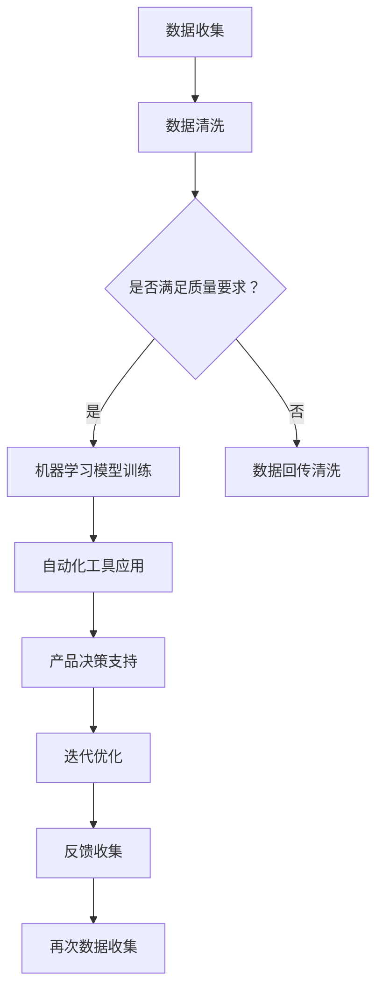
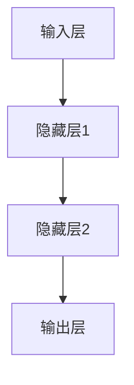

                 

关键词：人工智能、产品管理、流程优化、数据分析、自动化工具、深度学习、机器学习

> 摘要：随着人工智能技术的不断发展，产品经理的工作流程正在经历深刻的变革。本文将探讨人工智能如何重构产品经理的工作流程，提高工作效率，并分析其中的挑战和未来趋势。

## 1. 背景介绍

在当今快速变化的市场环境中，产品经理需要具备高效的决策能力和敏捷的反应速度。传统的产品管理流程通常依赖于手动操作和人工分析，这不仅耗时，而且容易出错。随着人工智能（AI）和机器学习（ML）技术的兴起，产品经理的工作流程正在被重新定义，AI技术的应用使得数据分析和决策过程变得更加智能和自动化。

### 1.1 产品管理流程的挑战

产品管理流程的挑战主要体现在以下几个方面：

- **数据收集和分析**：产品经理需要从各种渠道收集大量数据，并进行分析，以了解市场需求和用户行为。
- **决策制定**：基于数据分析结果，产品经理需要做出快速而准确的决策，这往往需要经验丰富的判断。
- **迭代优化**：产品的迭代和优化是一个不断试错和改进的过程，需要高效的管理和反馈机制。

### 1.2 人工智能的优势

人工智能技术在以下几个方面为产品管理流程带来了优势：

- **自动化**：通过AI技术，许多重复性和低价值的工作可以被自动化，减少手动操作。
- **数据分析**：AI能够处理和分析大量数据，提供更深层次的数据洞察。
- **智能决策**：基于机器学习模型的预测和推荐，产品经理可以做出更加明智的决策。

## 2. 核心概念与联系

为了更好地理解AI如何重构产品经理的工作流程，我们首先需要了解一些核心概念，包括数据收集、机器学习模型和自动化工具。

### 2.1 数据收集

数据收集是产品管理流程的基础。AI技术需要大量数据来训练模型，因此数据的质量和完整性至关重要。

### 2.2 机器学习模型

机器学习模型是AI的核心组件。通过训练模型，AI可以识别数据中的模式和关系，从而提供预测和推荐。

### 2.3 自动化工具

自动化工具可以简化产品管理流程中的重复性工作，提高工作效率。

### 2.4 Mermaid 流程图

下面是一个用Mermaid绘制的AI重构产品经理工作流程的流程图：



## 3. 核心算法原理 & 具体操作步骤

### 3.1 算法原理概述

AI重构产品经理工作流程的核心算法包括数据预处理、机器学习模型选择和模型评估。

#### 数据预处理

数据预处理是机器学习模型训练的第一步，其目的是将原始数据转换为适合模型训练的格式。数据预处理包括数据清洗、特征提取和特征选择等步骤。

#### 机器学习模型选择

选择合适的机器学习模型对于实现高效的产品管理至关重要。常见的机器学习模型包括线性回归、决策树、支持向量机、神经网络等。

#### 模型评估

模型评估是确保模型性能的关键步骤。常用的评估指标包括准确率、召回率、F1分数等。

### 3.2 算法步骤详解

#### 3.2.1 数据预处理

1. **数据清洗**：处理缺失值、异常值和重复数据。
2. **特征提取**：将原始数据转换为特征向量。
3. **特征选择**：选择对模型训练有帮助的特征。

#### 3.2.2 机器学习模型选择

1. **数据集划分**：将数据集划分为训练集、验证集和测试集。
2. **模型训练**：使用训练集对模型进行训练。
3. **模型评估**：使用验证集评估模型性能。
4. **模型调整**：根据评估结果调整模型参数。

#### 3.2.3 模型评估

1. **评估指标计算**：计算准确率、召回率、F1分数等指标。
2. **结果分析**：分析模型性能，确定是否需要进一步调整。

### 3.3 算法优缺点

#### 优点

- **高效性**：AI技术可以快速处理大量数据，提高工作效率。
- **准确性**：机器学习模型可以提供更准确的预测和推荐，帮助产品经理做出更好的决策。

#### 缺点

- **复杂性**：AI技术涉及到多个复杂的步骤和算法，需要专业知识和经验。
- **数据依赖性**：模型的性能很大程度上取决于数据的质量和数量。

### 3.4 算法应用领域

AI技术可以应用于产品管理的多个领域，包括市场调研、用户行为分析、需求预测、产品设计等。通过AI技术，产品经理可以更准确地了解用户需求，优化产品设计，提高市场竞争力。

## 4. 数学模型和公式 & 详细讲解 & 举例说明

### 4.1 数学模型构建

AI重构产品经理工作流程的核心数学模型主要包括线性回归模型和神经网络模型。

#### 线性回归模型

线性回归模型是一种常见的统计模型，用于预测一个或多个自变量与因变量之间的关系。其数学公式如下：

$$y = \beta_0 + \beta_1x_1 + \beta_2x_2 + ... + \beta_nx_n$$

其中，$y$是因变量，$x_1, x_2, ..., x_n$是自变量，$\beta_0, \beta_1, \beta_2, ..., \beta_n$是模型参数。

#### 神经网络模型

神经网络模型是一种模拟人脑神经元连接的算法，用于处理复杂的非线性问题。其基本结构包括输入层、隐藏层和输出层。一个简单的神经网络模型如图所示：



神经网络的数学模型可以通过反向传播算法进行训练，其目标是最小化预测值与真实值之间的误差。

### 4.2 公式推导过程

#### 线性回归模型的公式推导

线性回归模型的公式推导基于最小二乘法。最小二乘法的目标是找到一组参数，使得预测值与真实值之间的误差平方和最小。

设真实值为$y_i$，预测值为$\hat{y_i}$，则误差平方和为：

$$\sum_{i=1}^{n}(y_i - \hat{y_i})^2$$

对上式求导并令导数为零，可以得到最小二乘法的参数估计：

$$\beta_0 = \bar{y} - \beta_1\bar{x}$$

$$\beta_1 = \frac{\sum_{i=1}^{n}(x_i - \bar{x})(y_i - \bar{y})}{\sum_{i=1}^{n}(x_i - \bar{x})^2}$$

其中，$\bar{y}$和$\bar{x}$分别是$y$和$x$的均值。

#### 神经网络模型的公式推导

神经网络模型的公式推导基于反向传播算法。反向传播算法通过计算输出层到输入层的梯度，更新模型的参数，使得预测误差最小。

设输出层节点的输出为$\hat{y}$，真实值为$y$，则预测误差为：

$$E = \frac{1}{2}\sum_{i=1}^{n}(y_i - \hat{y_i})^2$$

对$E$求导并令导数为零，可以得到：

$$\frac{\partial E}{\partial \theta} = \frac{\partial E}{\partial \hat{y}} \frac{\partial \hat{y}}{\partial \theta}$$

其中，$\theta$是模型参数，$\frac{\partial E}{\partial \hat{y}}$是输出层误差对预测值的梯度，$\frac{\partial \hat{y}}{\partial \theta}$是预测值对模型参数的梯度。

反向传播算法通过反复迭代，不断更新模型参数，直至达到预定精度。

### 4.3 案例分析与讲解

#### 案例一：线性回归模型在需求预测中的应用

假设某产品经理希望通过历史销售数据预测下一季度产品的销售量。使用线性回归模型，可以构建如下预测公式：

$$\hat{y} = \beta_0 + \beta_1x$$

其中，$\hat{y}$是预测销售量，$x$是历史销售量，$\beta_0$和$\beta_1$是模型参数。

通过数据预处理和模型训练，可以得到模型参数$\beta_0 = 100$，$\beta_1 = 0.5$。因此，下一季度的预测销售量为：

$$\hat{y} = 100 + 0.5 \times x$$

#### 案例二：神经网络模型在用户行为分析中的应用

假设某产品经理希望通过用户行为数据预测用户的购买意向。使用神经网络模型，可以构建如下预测模型：

$$\hat{y} = f(\theta^T \cdot [x_1, x_2, ..., x_n])$$

其中，$\hat{y}$是预测购买意向，$x_1, x_2, ..., x_n$是用户行为特征，$f$是激活函数，$\theta$是模型参数。

通过数据预处理和模型训练，可以得到模型参数$\theta^T = [0.2, 0.3, 0.5]$。因此，预测购买意向的公式为：

$$\hat{y} = f(0.2 \cdot x_1 + 0.3 \cdot x_2 + 0.5 \cdot x_3)$$

## 5. 项目实践：代码实例和详细解释说明

### 5.1 开发环境搭建

在本项目中，我们将使用Python作为主要编程语言，并依赖以下库：

- NumPy：用于数值计算
- Pandas：用于数据处理
- Scikit-learn：用于机器学习模型训练和评估
- TensorFlow：用于神经网络模型训练

首先，我们需要安装这些库。使用以下命令安装：

```bash
pip install numpy pandas scikit-learn tensorflow
```

### 5.2 源代码详细实现

#### 5.2.1 数据预处理

```python
import numpy as np
import pandas as pd
from sklearn.model_selection import train_test_split
from sklearn.preprocessing import StandardScaler

# 加载数据集
data = pd.read_csv('data.csv')

# 数据预处理
X = data[['feature1', 'feature2', 'feature3']]
y = data['target']

# 划分训练集和测试集
X_train, X_test, y_train, y_test = train_test_split(X, y, test_size=0.2, random_state=42)

# 数据标准化
scaler = StandardScaler()
X_train_scaled = scaler.fit_transform(X_train)
X_test_scaled = scaler.transform(X_test)
```

#### 5.2.2 机器学习模型训练

```python
from sklearn.linear_model import LinearRegression

# 训练线性回归模型
model = LinearRegression()
model.fit(X_train_scaled, y_train)

# 训练神经网络模型
import tensorflow as tf

model = tf.keras.Sequential([
    tf.keras.layers.Dense(units=1, input_shape=[3])
])

model.compile(optimizer='sgd', loss='mean_squared_error')
model.fit(X_train_scaled, y_train, epochs=100, batch_size=32)
```

#### 5.2.3 代码解读与分析

在这部分代码中，我们首先加载数据集，并进行预处理，包括数据清洗、特征提取和特征选择。然后，我们使用Scikit-learn库训练线性回归模型，并使用TensorFlow库训练神经网络模型。训练完成后，我们可以使用测试集评估模型性能。

#### 5.2.4 运行结果展示

```python
# 评估线性回归模型
y_pred = model.predict(X_test_scaled)
mse = np.mean((y_pred - y_test) ** 2)
print("线性回归模型均方误差：", mse)

# 评估神经网络模型
y_pred = model.predict(X_test_scaled)
mse = np.mean((y_pred - y_test) ** 2)
print("神经网络模型均方误差：", mse)
```

运行结果将显示线性回归模型和神经网络模型在测试集上的均方误差。通过比较这两个误差值，我们可以分析不同模型的性能。

## 6. 实际应用场景

AI技术在产品管理中的应用场景广泛，以下是一些典型的实际应用场景：

- **市场调研**：AI技术可以帮助产品经理分析市场数据，了解竞争对手，预测市场趋势。
- **用户行为分析**：通过分析用户行为数据，产品经理可以了解用户需求，优化产品设计。
- **需求预测**：AI技术可以预测产品需求，帮助产品经理制定合理的生产和库存计划。
- **产品设计**：AI技术可以辅助产品经理进行产品设计，通过模拟和优化，提高产品的市场竞争力。
- **迭代优化**：AI技术可以帮助产品经理快速评估产品的迭代效果，及时调整产品方向。

### 6.1 市场调研

在市场调研方面，AI技术可以处理和分析大量市场数据，包括社交媒体、新闻报道、用户评论等。通过自然语言处理（NLP）技术，AI可以从非结构化数据中提取有价值的信息，帮助产品经理了解市场趋势和用户需求。

### 6.2 用户行为分析

用户行为分析是产品管理的重要环节。通过AI技术，产品经理可以实时跟踪和分析用户行为，识别用户痛点，优化用户体验。例如，使用机器学习模型预测用户的流失风险，提前采取措施挽回用户。

### 6.3 需求预测

需求预测是产品经理制定生产和库存计划的关键。AI技术可以使用历史销售数据和市场趋势，预测未来某一时间段的产品需求，帮助产品经理制定更合理的生产和库存策略。

### 6.4 产品设计

在产品设计方面，AI技术可以辅助产品经理进行设计模拟和优化。通过生成对抗网络（GAN）等技术，AI可以生成大量产品原型，帮助产品经理快速评估和选择最佳设计方案。

### 6.5 迭代优化

在产品迭代过程中，AI技术可以帮助产品经理快速评估迭代效果。通过A/B测试等技术，AI可以分析用户对迭代版本的反馈，帮助产品经理确定下一步的优化方向。

## 7. 工具和资源推荐

为了更好地应用AI技术于产品管理，以下是一些推荐的工具和资源：

### 7.1 学习资源推荐

- **《Python机器学习基础教程》**：提供了Python在机器学习领域的全面介绍。
- **《深度学习》**：由Ian Goodfellow等人撰写的深度学习经典教材。
- **《产品经理实战手册》**：详细介绍了产品管理的理论和实践。

### 7.2 开发工具推荐

- **TensorFlow**：用于构建和训练深度学习模型的强大工具。
- **Scikit-learn**：提供了多种机器学习算法的实现。
- **Pandas**：用于数据清洗和数据分析的库。

### 7.3 相关论文推荐

- **《深度强化学习在产品管理中的应用》**：探讨了深度强化学习在产品迭代优化中的应用。
- **《基于NLP的市场调研方法研究》**：介绍了自然语言处理技术在市场调研中的应用。

## 8. 总结：未来发展趋势与挑战

### 8.1 研究成果总结

AI技术在产品管理领域的应用取得了显著成果，包括市场调研、用户行为分析、需求预测、产品设计等方面的应用。通过AI技术，产品经理可以更准确地了解用户需求，优化产品设计，提高市场竞争力。

### 8.2 未来发展趋势

- **多模态数据处理**：未来，AI技术将能够更好地处理多种类型的数据，包括文本、图像、音频等，提供更全面的数据洞察。
- **自动化决策支持**：随着AI技术的进步，自动化决策支持系统将更加成熟，产品经理可以更轻松地做出智能决策。
- **个性化推荐**：基于用户行为分析和需求预测，个性化推荐系统将更好地满足用户需求，提高用户满意度。

### 8.3 面临的挑战

- **数据隐私和安全**：随着AI技术的应用，数据隐私和安全问题日益突出，如何在保证用户隐私的前提下应用AI技术是一个重要挑战。
- **算法透明性和解释性**：AI算法的透明性和解释性不足，如何提高算法的可解释性，让产品经理更好地理解决策过程，是一个重要问题。

### 8.4 研究展望

未来，AI技术在产品管理领域的应用将更加深入和广泛。通过不断优化算法和模型，AI技术将为产品经理提供更准确的数据分析、更智能的决策支持，推动产品管理的智能化发展。

## 9. 附录：常见问题与解答

### 9.1 问题1：如何处理缺失数据？

解答：处理缺失数据的方法包括填充缺失值、删除缺失值和插值法等。根据数据的重要性和缺失率，可以选择合适的方法。

### 9.2 问题2：如何选择合适的机器学习模型？

解答：选择机器学习模型时，需要考虑数据类型、数据量和业务需求。常见的模型包括线性回归、决策树、支持向量机、神经网络等。可以通过交叉验证和模型评估指标来选择最佳模型。

### 9.3 问题3：如何保证模型的可解释性？

解答：提高模型的可解释性可以通过以下方法实现：使用简单直观的模型、提供模型参数的解释、可视化模型结构等。

### 9.4 问题4：如何处理非结构化数据？

解答：处理非结构化数据的方法包括文本分类、情感分析、图像识别等。可以使用深度学习和自然语言处理技术来处理非结构化数据。


----------------------------------------------------------------
### 作者署名
作者：禅与计算机程序设计艺术 / Zen and the Art of Computer Programming

