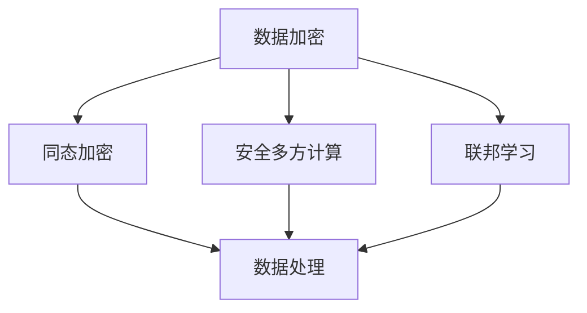

                 

关键词：AI隐私保护、LLM、数据安全、隐私计算、安全算法、数据加密、联邦学习、安全协议、隐私泄露、安全挑战

> 摘要：随着大型语言模型（LLM）的兴起，人工智能领域进入了一个新的时代。然而，LLM的广泛应用也带来了数据安全与隐私保护的重大挑战。本文将深入探讨AI隐私保护在LLM时代的核心问题，包括数据加密、隐私计算、联邦学习等关键技术，并提出应对这些挑战的解决方案。

## 1. 背景介绍

### 1.1 AI隐私保护的重要性

随着大数据和云计算技术的快速发展，人工智能（AI）技术在各个领域得到了广泛应用。然而，AI的广泛应用也带来了数据隐私和安全问题。在AI时代，数据被视为新的“石油”，数据隐私保护的重要性日益凸显。尤其是在大型语言模型（LLM）的应用场景中，数据的安全性和隐私性面临前所未有的挑战。

### 1.2 LLM时代的隐私威胁

LLM时代的隐私威胁主要体现在以下几个方面：

- **数据泄露风险**：LLM模型通常需要大量的训练数据，这些数据可能包含敏感信息，如个人身份信息、医疗记录等。一旦数据泄露，将可能导致严重隐私泄露事件。
- **模型滥用风险**：LLM模型作为一种强大的工具，可能被恶意使用，如通过模型生成虚假信息、进行网络攻击等。
- **隐私计算需求**：在LLM时代，如何保障数据在传输、处理、存储等过程中的隐私性，成为一个亟待解决的问题。

## 2. 核心概念与联系

### 2.1 数据加密

数据加密是保护数据隐私的基本手段。通过对数据进行加密处理，即使数据被截获，攻击者也无法解读数据内容。

### 2.2 隐私计算

隐私计算是一种在保证数据隐私的前提下进行数据处理和分析的技术。隐私计算技术包括同态加密、安全多方计算、联邦学习等。

### 2.3 联邦学习

联邦学习是一种分布式机器学习方法，通过将数据分散存储在各个客户端，然后进行模型训练，从而实现数据隐私保护。

### 2.4 Mermaid 流程图

下面是一个关于隐私计算技术的 Mermaid 流程图：



## 3. 核心算法原理 & 具体操作步骤

### 3.1 算法原理概述

隐私计算技术主要包括同态加密、安全多方计算和联邦学习。这些技术的基本原理如下：

- **同态加密**：同态加密允许在加密数据上进行计算，并将结果解密为原始数据。这种加密方式能够保证数据在传输和存储过程中的隐私性。
- **安全多方计算**：安全多方计算是一种允许多个参与方在不泄露各自隐私信息的前提下，共同完成计算任务的技术。
- **联邦学习**：联邦学习通过将模型训练任务分散到多个客户端进行，从而实现数据隐私保护。

### 3.2 算法步骤详解

下面以联邦学习为例，介绍隐私计算技术的具体操作步骤：

1. **数据收集**：各个客户端收集本地数据，并对数据进行预处理。
2. **模型初始化**：初始化全局模型，并将其分发到各个客户端。
3. **本地训练**：各个客户端在本地对模型进行训练，并返回训练结果。
4. **模型聚合**：将各个客户端的模型更新结果进行聚合，得到全局模型的更新。
5. **模型更新**：将全局模型更新结果分发到各个客户端。

### 3.3 算法优缺点

- **同态加密**：优点是能够保证数据在传输和存储过程中的隐私性，缺点是计算性能较低。
- **安全多方计算**：优点是能够保证参与方隐私，缺点是通信复杂度较高。
- **联邦学习**：优点是能够实现数据隐私保护，缺点是模型训练时间较长。

### 3.4 算法应用领域

隐私计算技术可以应用于金融、医疗、互联网等多个领域。例如，在金融领域，隐私计算技术可以用于客户数据的安全分析；在医疗领域，隐私计算技术可以用于患者数据的安全共享。

## 4. 数学模型和公式 & 详细讲解 & 举例说明

### 4.1 数学模型构建

同态加密的基本数学模型如下：

- **加密算法**：对于任意两个加密数据 \(c_1\) 和 \(c_2\)，存在加密函数 \(E\)，使得 \(E(c_1, c_2) = c_1 + c_2\)。
- **解密算法**：对于任意一个加密数据 \(c\)，存在解密函数 \(D\)，使得 \(D(E(c)) = c\)。

### 4.2 公式推导过程

假设 \(c_1\) 和 \(c_2\) 是两个加密数据，\(E\) 是加密函数，\(D\) 是解密函数。根据同态加密的定义，我们有：

$$
E(c_1, c_2) = c_1 + c_2
$$

$$
D(E(c_1, c_2)) = c_1 + c_2
$$

将第一个等式代入第二个等式，得到：

$$
D(c_1 + c_2) = c_1 + c_2
$$

这表明，同态加密满足加法运算。

### 4.3 案例分析与讲解

假设我们要对两个整数进行加密计算。首先，我们选择一个加密函数 \(E(x) = 2x + 1\) 和解密函数 \(D(x) = \frac{x - 1}{2}\)。对于整数 3 和 5，我们有：

- \(E(3) = 2 \times 3 + 1 = 7\)
- \(E(5) = 2 \times 5 + 1 = 11\)

根据同态加密的性质，我们有：

$$
E(3, 5) = E(3) + E(5) = 7 + 11 = 18
$$

对加密结果进行解密，我们有：

$$
D(E(3, 5)) = D(18) = \frac{18 - 1}{2} = 8.5
$$

这表明，加密计算结果 18 对应于原始数据 3 和 5 的加法运算结果 8.5。

## 5. 项目实践：代码实例和详细解释说明

### 5.1 开发环境搭建

为了演示隐私计算技术的应用，我们将使用Python编程语言和PySyft库。首先，我们需要安装PySyft库：

```bash
pip install pySyft
```

### 5.2 源代码详细实现

下面是一个简单的联邦学习示例：

```python
import torch
import torch.nn as nn
import torch.optim as optim
from pySyft import FederatedAveragingAlgorithm, Client
from torch.utils.data import DataLoader

# 模拟数据集
class Dataset:
    def __init__(self, data):
        self.data = data

    def __len__(self):
        return len(self.data)

    def __getitem__(self, idx):
        return self.data[idx]

# 初始化客户端
clients = [Client(id=i, data=Dataset(torch.randn(100))) for i in range(5)]

# 初始化模型
model = nn.Linear(1, 1)
optimizer = optim.SGD(model.parameters(), lr=0.01)

# 定义联邦学习算法
fed_avg = FederatedAveragingAlgorithm(model, clients, num_clients=5, num_epochs=10)

# 开始联邦学习
fed_avg.run()

# 输出最终模型参数
print(model.state_dict())
```

### 5.3 代码解读与分析

- **Dataset 类**：模拟一个简单的数据集，其中包含随机生成的数据。
- **Client 类**：表示一个客户端，包含数据集和模型。
- **FederatedAveragingAlgorithm 类**：实现联邦学习算法，负责模型的初始化、训练和聚合。
- **run 方法**：启动联邦学习过程，包括数据加载、模型训练和参数聚合。

### 5.4 运行结果展示

运行上述代码，我们将得到最终的模型参数。这些参数表示在联邦学习过程中，各个客户端本地模型参数的平均值。

## 6. 实际应用场景

### 6.1 金融领域

在金融领域，隐私计算技术可以用于客户数据的分析。例如，通过联邦学习技术，银行可以分析客户的行为数据，为用户提供个性化金融服务，同时保障客户数据的安全和隐私。

### 6.2 医疗领域

在医疗领域，隐私计算技术可以用于患者数据的共享。例如，通过联邦学习技术，医院可以共享患者数据，为临床研究提供数据支持，同时保护患者隐私。

### 6.3 互联网领域

在互联网领域，隐私计算技术可以用于用户数据的分析。例如，通过同态加密技术，广告公司可以分析用户行为数据，为用户提供个性化广告，同时保障用户数据的安全和隐私。

## 7. 工具和资源推荐

### 7.1 学习资源推荐

- **论文**：《联邦学习：挑战与机遇》
- **书籍**：《深度学习：动手学习入门》
- **在线课程**：Coursera 上的《机器学习》

### 7.2 开发工具推荐

- **Python**：Python 是隐私计算领域的主要编程语言。
- **PySyft**：PySyft 是一个用于联邦学习的 Python 库。

### 7.3 相关论文推荐

- **论文**：《联邦学习：挑战与机遇》
- **论文**：《基于同态加密的隐私保护计算》
- **论文**：《安全多方计算：理论、算法与应用》

## 8. 总结：未来发展趋势与挑战

### 8.1 研究成果总结

随着AI技术的快速发展，隐私计算技术取得了显著成果。同态加密、安全多方计算和联邦学习等技术已成为保障数据安全和隐私的重要手段。

### 8.2 未来发展趋势

未来，隐私计算技术将继续在AI领域发挥重要作用。随着计算性能的提升和算法的优化，隐私计算技术将在更多应用场景中得到广泛应用。

### 8.3 面临的挑战

隐私计算技术仍面临一些挑战，如计算性能提升、算法优化、安全协议设计等。此外，隐私计算技术的标准化和法律法规的完善也是未来需要关注的问题。

### 8.4 研究展望

未来，隐私计算技术将朝着更高效、更安全、更易用的方向发展。通过持续研究和技术创新，隐私计算技术将为AI时代的隐私保护提供有力支持。

## 9. 附录：常见问题与解答

### 9.1 什么情况下需要使用隐私计算？

- 当数据包含敏感信息时，如个人身份信息、医疗记录等。
- 当需要对数据进行共享和分析，同时保障数据隐私时。

### 9.2 隐私计算技术有哪些？

- 同态加密
- 安全多方计算
- 联邦学习

### 9.3 如何评估隐私计算技术的安全性？

- 通过安全性评估，如安全多方计算协议的安全性证明。
- 通过实际应用案例，评估隐私计算技术的效果和安全性。

----------------------------------------------------------------

本文由禅与计算机程序设计艺术 / Zen and the Art of Computer Programming 撰写。如果您有任何问题或建议，请随时联系我们。感谢您的阅读！
----------------------------------------------------------------

