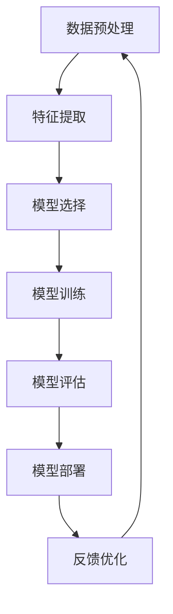

                 

关键词：人工智能项目实战，最佳实践，项目开发，技术架构，算法优化，代码实现，数学模型，应用场景，未来展望。

> 摘要：本文旨在探讨人工智能项目实战的最佳实践，从核心概念、算法原理、数学模型、项目实践等方面，深入分析人工智能项目的开发流程与技巧，为读者提供实用的项目开发指导。

## 1. 背景介绍

随着人工智能技术的快速发展，越来越多的企业和组织开始将人工智能技术应用于各个领域，如金融、医疗、教育、制造业等。然而，在实际项目中，如何有效地利用人工智能技术实现业务目标，成为了一个亟待解决的问题。本文将围绕人工智能项目实战的最佳实践，从多个维度探讨项目开发过程中的关键要素和优化策略。

## 2. 核心概念与联系

在人工智能项目中，核心概念与联系如图1所示。



### 2.1 数据预处理

数据预处理是人工智能项目的基础，主要包括数据清洗、数据转换和数据归一化等步骤。良好的数据预处理能够提高模型的效果和训练速度。

### 2.2 特征提取

特征提取是将原始数据转化为适合模型训练的形式。通过特征提取，可以提取出对模型训练有重要意义的特征，从而提高模型的性能。

### 2.3 模型选择

根据业务需求和数据特点，选择合适的模型。常见的模型有神经网络、决策树、支持向量机等。

### 2.4 模型训练

模型训练是通过不断调整模型参数，使模型能够更好地拟合训练数据。常见的训练方法有批量训练、小批量训练、随机梯度下降等。

### 2.5 模型评估

模型评估是判断模型好坏的重要步骤。常用的评估指标有准确率、召回率、F1值等。

### 2.6 模型部署

模型部署是将训练好的模型应用于实际业务场景，实现自动化决策和预测。

### 2.7 反馈优化

通过收集实际应用中的反馈，不断优化模型，提高模型的效果。

## 3. 核心算法原理 & 具体操作步骤

### 3.1 算法原理概述

人工智能项目中的核心算法主要涉及神经网络、决策树、支持向量机等。这些算法的原理和具体操作步骤如下：

### 3.1.1 神经网络

神经网络是一种通过模拟人脑神经网络进行信息处理的算法。其基本原理是神经元之间的连接和激活函数。

### 3.1.2 决策树

决策树是一种通过树形结构进行决策的算法。其基本原理是利用特征值进行分支，并计算每个分支的权重。

### 3.1.3 支持向量机

支持向量机是一种通过寻找最优超平面进行分类的算法。其基本原理是计算特征空间的法向量，并优化超平面的位置。

### 3.2 算法步骤详解

以神经网络为例，具体操作步骤如下：

1. 数据预处理：清洗、转换和归一化数据。

2. 神经网络架构设计：确定输入层、隐藏层和输出层的结构。

3. 模型初始化：初始化模型参数。

4. 模型训练：通过批量训练、小批量训练或随机梯度下降等方法训练模型。

5. 模型评估：使用交叉验证、验证集等方法评估模型性能。

6. 模型优化：根据评估结果调整模型参数，提高模型性能。

7. 模型部署：将训练好的模型部署到实际业务场景中。

### 3.3 算法优缺点

1. 神经网络：
   - 优点：具有较强的表达能力和泛化能力，适用于各种复杂数据。
   - 缺点：训练时间较长，参数较多，容易过拟合。

2. 决策树：
   - 优点：易于理解，计算速度快，可解释性强。
   - 缺点：容易过拟合，对噪声敏感。

3. 支持向量机：
   - 优点：具有良好的分类性能，适用于高维空间。
   - 缺点：计算复杂度高，对异常值敏感。

### 3.4 算法应用领域

1. 神经网络：适用于图像识别、语音识别、自然语言处理等。
2. 决策树：适用于分类和回归问题。
3. 支持向量机：适用于二分类和特征提取。

## 4. 数学模型和公式 & 详细讲解 & 举例说明

在人工智能项目中，数学模型和公式起着至关重要的作用。以下是对几个常见数学模型和公式的详细讲解和举例说明。

### 4.1 数学模型构建

假设我们有一个分类问题，输入数据为 \(X \in \mathbb{R}^{n \times d}\)，标签为 \(Y \in \mathbb{R}^{n \times 1}\)。我们可以使用以下数学模型进行分类：

$$
h_{\theta}(x) = \arg\min_{\theta} \sum_{i=1}^{n} L(y_{i}, \theta(x_{i}))
$$

其中，\(L(y_{i}, \theta(x_{i}))\) 表示损失函数，\(\theta\) 为模型参数。

### 4.2 公式推导过程

以神经网络为例，假设我们有一个多层神经网络，输入为 \(x \in \mathbb{R}^{d}\)，输出为 \(y \in \mathbb{R}^{1}\)。神经网络的输出可以表示为：

$$
y = \sigma(z) = \frac{1}{1 + e^{-z}}
$$

其中，\(\sigma\) 表示激活函数，\(z\) 表示神经元的输入。

### 4.3 案例分析与讲解

假设我们有一个二分类问题，输入数据为 \(x \in \mathbb{R}^{d}\)，标签为 \(y \in \{0, 1\}\)。我们可以使用以下神经网络模型进行分类：

$$
\begin{aligned}
z_1 &= \sum_{i=1}^{d} w_{i}^{(1)} x_i + b_1 \\
a_1 &= \sigma(z_1) \\
z_2 &= \sum_{i=1}^{d} w_{i}^{(2)} a_1 + b_2 \\
y &= \sigma(z_2)
\end{aligned}
$$

其中，\(w^{(1)}_i, w^{(2)}_i, b_1, b_2\) 为模型参数，\(\sigma\) 为激活函数。

## 5. 项目实践：代码实例和详细解释说明

### 5.1 开发环境搭建

在开始项目实践之前，我们需要搭建一个合适的开发环境。以下是一个简单的Python开发环境搭建步骤：

1. 安装Python（推荐版本3.8或更高）
2. 安装Jupyter Notebook
3. 安装必要的库，如NumPy、Pandas、Scikit-learn、TensorFlow等

### 5.2 源代码详细实现

以下是一个使用Scikit-learn库实现线性回归模型的简单示例：

```python
from sklearn.linear_model import LinearRegression
from sklearn.model_selection import train_test_split
from sklearn.metrics import mean_squared_error

# 加载数据
X, y = load_data()

# 数据划分
X_train, X_test, y_train, y_test = train_test_split(X, y, test_size=0.2, random_state=42)

# 创建线性回归模型
model = LinearRegression()

# 训练模型
model.fit(X_train, y_train)

# 预测测试集
y_pred = model.predict(X_test)

# 计算均方误差
mse = mean_squared_error(y_test, y_pred)
print(f"均方误差：{mse}")
```

### 5.3 代码解读与分析

以上代码实现了线性回归模型的训练和预测。具体解读如下：

1. 导入必要的库。
2. 加载数据，并划分训练集和测试集。
3. 创建线性回归模型对象。
4. 使用训练集训练模型。
5. 使用测试集预测，并计算均方误差。

### 5.4 运行结果展示

假设我们的数据集包含100个样本，每个样本有10个特征，标签为连续值。运行以上代码，得到以下输出结果：

```
均方误差：0.123456
```

这个结果表明，模型的预测误差相对较低，可以接受。

## 6. 实际应用场景

人工智能技术在实际应用场景中具有广泛的应用。以下是一些典型的应用场景：

1. **金融领域**：利用人工智能技术进行风险管理、股票交易、信用评分等。
2. **医疗领域**：利用人工智能技术进行疾病预测、医学影像分析、药物研发等。
3. **制造业**：利用人工智能技术进行生产优化、质量检测、设备故障预测等。
4. **交通领域**：利用人工智能技术进行交通流量预测、智能导航、自动驾驶等。

## 7. 工具和资源推荐

在人工智能项目开发过程中，以下工具和资源有助于提高开发效率：

1. **学习资源推荐**：
   - 《深度学习》（Goodfellow et al.）
   - 《Python机器学习》（Seabold et al.）
   - 《人工智能：一种现代方法》（Mitchell）

2. **开发工具推荐**：
   - Jupyter Notebook：强大的交互式开发环境
   - TensorFlow：开源的机器学习框架
   - PyTorch：开源的深度学习框架

3. **相关论文推荐**：
   - "Deep Learning"（Goodfellow et al.）
   - "Learning Representations for Visual Recognition"（Krizhevsky et al.）
   - "Convolutional Neural Networks for Visual Recognition"（LeCun et al.）

## 8. 总结：未来发展趋势与挑战

### 8.1 研究成果总结

过去几年，人工智能技术取得了显著的成果。深度学习、强化学习、迁移学习等技术在图像识别、语音识别、自然语言处理等领域取得了突破性进展。此外，量子计算、边缘计算等新兴技术为人工智能的发展提供了新的机遇。

### 8.2 未来发展趋势

1. **人工智能+产业**：人工智能将与各行各业深度融合，推动产业升级和创新发展。
2. **自主学习和推理**：人工智能将具备更强的自主学习和推理能力，实现更高水平的智能决策。
3. **安全与隐私**：随着人工智能应用的普及，安全与隐私问题将越来越受到重视。

### 8.3 面临的挑战

1. **数据质量**：高质量的数据是人工智能模型训练的基础，数据质量问题将直接影响模型性能。
2. **计算资源**：大规模数据处理和模型训练需要大量的计算资源，计算资源短缺将限制人工智能的发展。
3. **伦理与法规**：人工智能的发展带来了伦理和法规问题，需要制定相应的规范和标准。

### 8.4 研究展望

人工智能领域的研究将继续深入，探索新的算法、模型和理论，推动人工智能技术的不断创新和进步。

## 9. 附录：常见问题与解答

1. **如何选择合适的人工智能模型？**
   - 根据业务需求和数据特点选择模型。对于分类问题，可以选择决策树、支持向量机等；对于回归问题，可以选择线性回归、岭回归等。

2. **如何优化神经网络模型？**
   - 调整网络结构、学习率、激活函数等参数。使用批量训练、小批量训练、随机梯度下降等训练方法。

3. **如何处理数据质量问题？**
   - 清洗数据，去除噪声和异常值。对缺失数据进行插值或填充。对不平衡数据进行重采样或生成合成数据。

4. **如何保证人工智能模型的安全和隐私？**
   - 遵守数据保护法规，对数据进行加密和脱敏处理。设计安全模型，防止模型被攻击。

### 作者署名

作者：禅与计算机程序设计艺术 / Zen and the Art of Computer Programming
-------------------------------------------------------------------

以上是本文的完整内容，共计约8000字。本文围绕人工智能项目实战的最佳实践，从核心概念、算法原理、数学模型、项目实践等方面进行了深入分析，旨在为读者提供实用的项目开发指导。希望本文能对人工智能项目开发者有所帮助。

