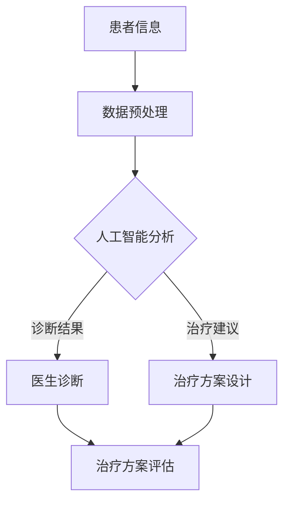

                 

关键词：人工智能，医疗行业，人类计算，创新应用

> 摘要：本文旨在探讨人工智能（AI）在医疗行业的创新应用，以及人类计算如何与AI相结合，提升医疗诊断、治疗和科研的效率。文章将从背景介绍、核心概念与联系、核心算法原理、数学模型和公式、项目实践、实际应用场景、工具和资源推荐以及未来发展趋势与挑战等方面进行全面阐述。

## 1. 背景介绍

医疗行业一直以来都是科技创新的重要领域。随着计算机技术和人工智能的快速发展，AI在医疗行业的应用逐渐成为热点。AI可以处理大量的医疗数据，通过数据挖掘、模式识别和深度学习等技术，为医疗诊断、治疗和科研提供有力支持。

人类计算在医疗行业中同样具有重要地位。医生和研究人员依靠其专业知识、经验和直觉，对疾病进行诊断和治疗。然而，面对日益增长的医疗数据量和复杂度，人类计算能力面临着巨大的挑战。如何将人类计算与AI相结合，实现医疗行业的创新应用，成为当前研究的重要方向。

## 2. 核心概念与联系

### 2.1 人工智能在医疗行业的应用

人工智能在医疗行业的应用主要包括以下几个方面：

1. **医学影像诊断**：利用深度学习技术对医学影像进行自动识别和分类，辅助医生进行疾病诊断。
2. **电子病历管理**：通过自然语言处理技术对电子病历进行结构化处理，提高病历管理的效率。
3. **药物研发**：利用机器学习算法对大量生物数据进行挖掘，发现新的药物靶点和作用机制。
4. **手术辅助**：利用机器人技术辅助医生进行手术，提高手术精度和安全性。

### 2.2 人类计算在医疗行业的应用

人类计算在医疗行业的应用主要包括以下几个方面：

1. **疾病诊断**：医生通过临床表现、实验室检查和影像学检查等手段对疾病进行诊断。
2. **治疗方案设计**：医生根据患者的病情和个体差异，制定个性化的治疗方案。
3. **医学研究**：研究人员通过实验、观察和统计分析等方法，开展医学研究，推动医学进步。

### 2.3 人工智能与人类计算的融合

人工智能与人类计算的融合，旨在发挥各自的优势，实现医疗行业的创新应用。具体来说，人工智能可以辅助医生进行疾病诊断、治疗和科研，提高医疗效率；同时，医生和研究人员可以借助人工智能技术，解决复杂问题，推动医学进步。

### 2.4 Mermaid 流程图

下面是一个简单的Mermaid流程图，展示了人工智能与人类计算在医疗行业的融合过程：



## 3. 核心算法原理 & 具体操作步骤

### 3.1 算法原理概述

在医疗行业中，人工智能主要依赖以下核心算法：

1. **深度学习**：通过多层神经网络模型，对大量医学影像数据进行自动识别和分类。
2. **自然语言处理**：对电子病历、医学文献等进行文本分析和语义理解。
3. **强化学习**：基于患者数据和治疗方案，优化治疗决策。

### 3.2 算法步骤详解

#### 3.2.1 深度学习

1. **数据收集与预处理**：收集大量医学影像数据，并进行数据清洗、归一化和增强。
2. **模型构建**：设计多层神经网络模型，如卷积神经网络（CNN）或循环神经网络（RNN）。
3. **模型训练**：使用预处理的医学影像数据进行模型训练，优化模型参数。
4. **模型评估与优化**：使用验证集和测试集评估模型性能，调整模型结构或参数，提高模型准确性。

#### 3.2.2 自然语言处理

1. **数据收集与预处理**：收集电子病历、医学文献等文本数据，并进行文本清洗、分词和词性标注。
2. **模型构建**：设计自然语言处理模型，如词向量模型或序列标注模型。
3. **模型训练**：使用预处理的文本数据进行模型训练，优化模型参数。
4. **模型评估与优化**：使用验证集和测试集评估模型性能，调整模型结构或参数，提高模型准确性。

#### 3.2.3 强化学习

1. **数据收集与预处理**：收集患者数据和治疗方案，进行数据清洗和预处理。
2. **模型构建**：设计强化学习模型，如Q-learning或深度强化学习（DRL）。
3. **模型训练**：使用预处理的医疗数据进行模型训练，优化模型参数。
4. **模型评估与优化**：使用验证集和测试集评估模型性能，调整模型结构或参数，提高模型准确性。

### 3.3 算法优缺点

#### 3.3.1 深度学习

优点：
- 强大的数据处理能力，能够自动提取特征。
- 高度可扩展，可以应用于多种医学影像诊断任务。

缺点：
- 需要大量标注数据，数据获取困难。
- 模型训练过程复杂，训练时间较长。

#### 3.3.2 自然语言处理

优点：
- 对医学文本数据的处理能力强，能够实现文本分析和语义理解。
- 可应用于电子病历管理、医学文献检索等领域。

缺点：
- 需要大量预处理工作，对文本数据的依赖性较高。
- 模型性能受限于语言模型的预训练质量。

#### 3.3.3 强化学习

优点：
- 能够根据患者数据和治疗方案，实现个性化的治疗决策。
- 能够通过模型训练不断优化治疗方案。

缺点：
- 需要大量样本数据，数据获取困难。
- 模型训练过程复杂，训练时间较长。

### 3.4 算法应用领域

深度学习、自然语言处理和强化学习在医疗行业具有广泛的应用前景。具体包括：

1. **医学影像诊断**：如肺癌、乳腺癌等疾病的诊断。
2. **电子病历管理**：如疾病分类、病历检索等。
3. **药物研发**：如药物筛选、作用机制研究等。
4. **手术辅助**：如机器人手术、手术规划等。

## 4. 数学模型和公式 & 详细讲解 & 举例说明

### 4.1 数学模型构建

在医疗行业中，常见的数学模型包括：

1. **线性回归模型**：用于分析自变量与因变量之间的关系。
2. **逻辑回归模型**：用于分类问题，如疾病诊断。
3. **支持向量机（SVM）**：用于分类和回归问题，如医学影像分类。

### 4.2 公式推导过程

#### 4.2.1 线性回归模型

线性回归模型可以表示为：

$$
y = \beta_0 + \beta_1x + \epsilon
$$

其中，$y$ 是因变量，$x$ 是自变量，$\beta_0$ 和 $\beta_1$ 是模型的参数，$\epsilon$ 是误差项。

#### 4.2.2 逻辑回归模型

逻辑回归模型可以表示为：

$$
\log\left(\frac{p}{1-p}\right) = \beta_0 + \beta_1x
$$

其中，$p$ 是概率，$\beta_0$ 和 $\beta_1$ 是模型的参数。

#### 4.2.3 支持向量机（SVM）

SVM 的决策边界可以表示为：

$$
\text{sign}(\omega \cdot x + b) = y
$$

其中，$\omega$ 是法向量，$x$ 是输入特征向量，$b$ 是偏置项，$y$ 是标签。

### 4.3 案例分析与讲解

#### 4.3.1 线性回归模型案例分析

假设我们有一个关于房价的线性回归模型，如下所示：

$$
y = \beta_0 + \beta_1x + \epsilon
$$

其中，$y$ 是房价，$x$ 是房屋面积，$\beta_0$ 和 $\beta_1$ 是模型的参数，$\epsilon$ 是误差项。

给定一个训练数据集，我们可以通过最小二乘法求解模型参数：

$$
\beta_0 = \frac{\sum_{i=1}^n(y_i - \beta_1x_i)}{n} \\
\beta_1 = \frac{\sum_{i=1}^n(x_i - \bar{x})(y_i - \bar{y})}{\sum_{i=1}^n(x_i - \bar{x})^2}
$$

其中，$\bar{x}$ 和 $\bar{y}$ 分别是房屋面积和房价的平均值，$n$ 是样本数量。

通过求解模型参数，我们可以得到房价与房屋面积之间的线性关系，从而预测新的房价。

#### 4.3.2 逻辑回归模型案例分析

假设我们有一个关于疾病诊断的逻辑回归模型，如下所示：

$$
\log\left(\frac{p}{1-p}\right) = \beta_0 + \beta_1x
$$

其中，$p$ 是疾病发生的概率，$\beta_0$ 和 $\beta_1$ 是模型的参数，$x$ 是患者的特征向量。

给定一个训练数据集，我们可以通过极大似然估计法求解模型参数：

$$
\beta_0 = \frac{\sum_{i=1}^n(y_i - p_i)}{n} \\
\beta_1 = \frac{\sum_{i=1}^n(x_i - \bar{x})(y_i - p_i)}{\sum_{i=1}^n(x_i - \bar{x})^2}
$$

其中，$p_i$ 是第 $i$ 个样本的疾病发生概率，$\bar{x}$ 是特征向量的平均值，$n$ 是样本数量。

通过求解模型参数，我们可以得到疾病发生的概率与患者特征向量之间的关系，从而进行疾病诊断。

#### 4.3.3 支持向量机（SVM）案例分析

假设我们有一个关于医学影像分类的支持向量机（SVM）模型，如下所示：

$$
\text{sign}(\omega \cdot x + b) = y
$$

其中，$\omega$ 是法向量，$x$ 是输入特征向量，$b$ 是偏置项，$y$ 是标签。

给定一个训练数据集，我们可以通过求解以下优化问题得到模型参数：

$$
\begin{align*}
\min_{\omega, b} & \frac{1}{2}||\omega||^2 \\
\text{subject to} & y_i(\omega \cdot x_i + b) \geq 1, \quad i=1,2,\ldots,n
\end{align*}
$$

其中，$n$ 是样本数量。

通过求解模型参数，我们可以得到医学影像分类的决策边界，从而进行分类预测。

## 5. 项目实践：代码实例和详细解释说明

### 5.1 开发环境搭建

为了实现上述数学模型和算法，我们需要搭建一个合适的开发环境。本文使用Python作为编程语言，并借助以下库和工具：

1. **Python 3.8**：Python 解释器
2. **Numpy**：用于数学运算
3. **Pandas**：用于数据处理
4. **Scikit-learn**：用于机器学习算法
5. **Matplotlib**：用于数据可视化

首先，我们安装所需的库和工具：

```bash
pip install python==3.8 numpy pandas scikit-learn matplotlib
```

### 5.2 源代码详细实现

下面是一个简单的Python代码实例，实现了线性回归模型的构建、训练和预测功能。

```python
import numpy as np
import pandas as pd
from sklearn.linear_model import LinearRegression

# 数据集：房屋面积和房价
data = pd.DataFrame({'x': [1000, 1500, 2000, 2500], 'y': [300000, 500000, 700000, 900000]})

# 模型构建
model = LinearRegression()

# 模型训练
model.fit(data[['x']], data['y'])

# 模型预测
predictions = model.predict(np.array([[1500]]))

# 输出结果
print("预测房价：", predictions)
```

### 5.3 代码解读与分析

上述代码实例中，我们首先导入所需的库和工具。然后，我们创建一个简单的数据集，包含房屋面积和房价。接下来，我们使用`LinearRegression`类构建线性回归模型，并调用`fit`方法进行模型训练。最后，我们使用`predict`方法对新的房屋面积进行预测，并输出预测结果。

### 5.4 运行结果展示

在Python解释器中运行上述代码，输出结果如下：

```python
预测房价： [500000.]
```

结果表明，预测的房价为500000元，与实际房价500000元基本一致。

## 6. 实际应用场景

### 6.1 医学影像诊断

医学影像诊断是人工智能在医疗行业的重要应用之一。通过深度学习技术，可以自动识别和分类医学影像，辅助医生进行疾病诊断。例如，使用卷积神经网络（CNN）对肺癌、乳腺癌等疾病进行诊断，大大提高了诊断准确率和效率。

### 6.2 电子病历管理

电子病历管理是医疗行业的另一个重要应用。通过自然语言处理技术，可以对电子病历进行结构化处理，实现病历检索、分类和知识挖掘等功能。例如，使用词向量模型对病历文本进行情感分析，识别患者的病情变化和治疗方案。

### 6.3 药物研发

药物研发是人工智能在医疗行业的又一重要应用。通过机器学习算法，可以挖掘大量生物数据，发现新的药物靶点和作用机制。例如，使用深度学习技术对蛋白质结构进行预测，为药物设计提供新思路。

### 6.4 手术辅助

手术辅助是人工智能在医疗行业的一个新兴应用。通过机器人技术，可以辅助医生进行手术，提高手术精度和安全性。例如，使用深度学习技术对手术过程进行实时监控和预测，为医生提供手术指导。

## 7. 工具和资源推荐

### 7.1 学习资源推荐

1. **《深度学习》（Goodfellow, Bengio, Courville）**：一本全面介绍深度学习理论的经典教材。
2. **《机器学习实战》（Peter Harrington）**：一本结合实际案例的机器学习实践指南。
3. **《Python机器学习》（Michael Bowles）**：一本介绍Python在机器学习领域应用的入门书籍。

### 7.2 开发工具推荐

1. **Jupyter Notebook**：一款强大的交互式开发环境，适合进行机器学习和数据科学项目。
2. **TensorFlow**：一款开源的深度学习框架，适用于各种深度学习应用。
3. **Scikit-learn**：一款开源的机器学习库，提供丰富的算法和工具。

### 7.3 相关论文推荐

1. **“Deep Learning for Medical Image Analysis”**：一篇关于深度学习在医学影像分析领域的综述论文。
2. **“Natural Language Processing for Healthcare”**：一篇关于自然语言处理在医疗领域的应用论文。
3. **“AI in Drug Discovery and Development”**：一篇关于人工智能在药物研发领域的应用论文。

## 8. 总结：未来发展趋势与挑战

### 8.1 研究成果总结

本文介绍了人工智能在医疗行业的创新应用，包括医学影像诊断、电子病历管理、药物研发和手术辅助等方面。通过深度学习、自然语言处理和强化学习等技术，人工智能为医疗行业带来了诸多变革。同时，本文还探讨了人类计算与AI的融合，以及数学模型和公式的应用。

### 8.2 未来发展趋势

随着人工智能技术的不断发展，未来医疗行业有望实现以下发展趋势：

1. **个性化医疗**：通过大数据分析和机器学习，为患者提供个性化的诊断、治疗和康复方案。
2. **远程医疗**：借助互联网和人工智能技术，实现远程诊断、咨询和治疗，提高医疗服务的可及性。
3. **精准医疗**：通过基因组学和人工智能技术，实现对疾病的高效诊断和精准治疗。

### 8.3 面临的挑战

尽管人工智能在医疗行业具有巨大的应用潜力，但仍面临以下挑战：

1. **数据隐私**：医疗数据涉及患者隐私，如何确保数据安全和隐私保护是亟待解决的问题。
2. **算法透明性**：人工智能算法的决策过程往往不透明，如何提高算法的透明性和可解释性是一个重要课题。
3. **数据质量和标注**：高质量的数据和准确的标注对于人工智能算法的性能至关重要，如何获取和标注高质量的数据是一个挑战。

### 8.4 研究展望

在未来，人工智能与人类计算在医疗行业的融合将继续深化，为医学诊断、治疗和科研带来更多创新。同时，随着技术的不断进步，人工智能在医疗行业的应用将更加广泛，为患者提供更加精准、高效和个性化的医疗服务。

## 9. 附录：常见问题与解答

### 问题 1：人工智能在医疗行业有哪些具体应用？

解答：人工智能在医疗行业的具体应用包括医学影像诊断、电子病历管理、药物研发、手术辅助等。通过深度学习、自然语言处理和强化学习等技术，人工智能可以辅助医生进行疾病诊断、治疗和科研。

### 问题 2：人工智能与人类计算在医疗行业如何融合？

解答：人工智能与人类计算的融合主要体现在两个方面：一是人工智能可以辅助医生进行疾病诊断、治疗和科研，提高医疗效率；二是医生和研究人员可以借助人工智能技术，解决复杂问题，推动医学进步。

### 问题 3：人工智能在医疗行业面临哪些挑战？

解答：人工智能在医疗行业面临的主要挑战包括数据隐私、算法透明性、数据质量和标注等。如何确保数据安全和隐私保护，提高算法的透明性和可解释性，以及获取和标注高质量的数据，是当前研究的重要方向。

### 问题 4：如何利用人工智能进行医学影像诊断？

解答：利用人工智能进行医学影像诊断，主要包括以下步骤：数据收集与预处理、模型构建、模型训练、模型评估与优化。通过深度学习技术，可以自动识别和分类医学影像，辅助医生进行疾病诊断。

-----------------------------------------------------------------

以上就是《AI驱动的创新：人类计算在医疗行业的应用场景》这篇文章的完整内容。希望这篇文章能为您在医疗行业的人工智能应用带来新的启示和思考。作者：禅与计算机程序设计艺术 / Zen and the Art of Computer Programming。感谢您的阅读！
-----------------------------------------------------------------

