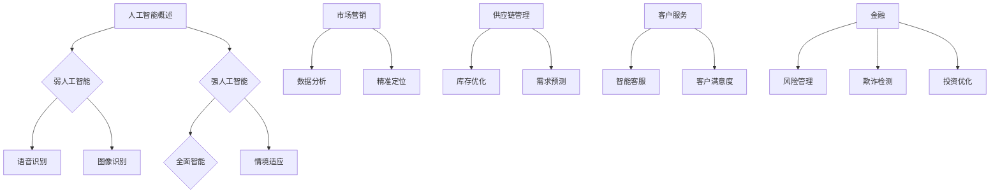

                 

关键词：人工智能，商业应用，计算技术，创新，未来发展

> 摘要：随着人工智能技术的迅猛发展，人类计算在商业领域的应用迎来了前所未有的变革。本文将探讨AI驱动的创新如何重塑商业模式，提高效率，以及未来可能面临的挑战和机遇。

## 1. 背景介绍

近年来，人工智能（AI）技术取得了显著的进展，从深度学习到自然语言处理，从计算机视觉到机器人技术，AI的应用范围不断扩大。与此同时，商业领域对计算技术的需求也日益增长，特别是在大数据、云计算和物联网等领域的应用。AI驱动的创新已经成为推动商业发展的重要力量。

在商业环境中，AI的应用不仅提高了企业的运营效率，还带来了全新的商业模式和服务创新。例如，AI可以帮助企业更准确地预测市场需求，优化供应链管理，提高客户服务质量，以及开发个性化产品和服务。随着AI技术的不断成熟，其在商业中的应用前景也越来越广阔。

## 2. 核心概念与联系

### 2.1 人工智能概述

人工智能是指计算机系统执行通常需要人类智能才能完成的任务的能力。这些任务包括识别图像、理解自然语言、做出决策、学习和适应新环境等。人工智能可以分为两大类：弱人工智能和强人工智能。

- **弱人工智能**：专注于特定领域的任务，例如语音识别、图像识别等。
- **强人工智能**：具有全面的人类智能，能够理解、学习和适应任何情境。

### 2.2 商业应用场景

在商业领域，AI的应用场景广泛而多样。以下是几个典型的应用场景：

- **市场营销**：利用AI分析大量数据，帮助企业精准定位目标客户，制定有效的营销策略。
- **供应链管理**：通过AI优化库存管理，预测需求，减少库存成本，提高供应链效率。
- **客户服务**：运用自然语言处理和机器学习技术，提供24/7的智能客服，提升客户满意度。
- **金融**：使用AI进行风险管理、欺诈检测和投资策略优化。

### 2.3 Mermaid 流程图



## 3. 核心算法原理 & 具体操作步骤

### 3.1 算法原理概述

AI的核心在于算法，其中最常用的算法包括：

- **深度学习**：通过模拟人脑神经网络的结构和功能，使计算机具备学习和处理复杂数据的能力。
- **机器学习**：使计算机通过数据学习，自动改进性能，无需显式编程。
- **自然语言处理**：使计算机理解和生成人类语言。

### 3.2 算法步骤详解

#### 3.2.1 深度学习

1. **数据收集**：收集大量数据作为训练样本。
2. **模型构建**：构建神经网络模型，包括输入层、隐藏层和输出层。
3. **训练过程**：通过反向传播算法，调整模型参数，使其能够更好地拟合数据。
4. **模型评估**：使用测试集评估模型性能，进行调整和优化。

#### 3.2.2 机器学习

1. **数据预处理**：清洗和转换数据，使其适合机器学习算法。
2. **特征选择**：选择对预测结果有重要影响的数据特征。
3. **模型选择**：根据问题类型选择合适的机器学习模型。
4. **模型训练**：使用训练数据训练模型。
5. **模型评估**：使用测试数据评估模型性能。

#### 3.2.3 自然语言处理

1. **文本预处理**：包括分词、去停用词、词性标注等。
2. **词嵌入**：将文本转换为向量表示。
3. **模型训练**：使用预训练的模型，如BERT、GPT等，进行训练和微调。
4. **任务执行**：执行文本分类、情感分析、命名实体识别等任务。

### 3.3 算法优缺点

#### 3.3.1 深度学习

- **优点**：适用于处理复杂数据，能够自动提取特征。
- **缺点**：对大量数据有较高要求，计算资源消耗大。

#### 3.3.2 机器学习

- **优点**：易于理解，计算资源需求较低。
- **缺点**：对数据质量和特征工程依赖较大。

#### 3.3.3 自然语言处理

- **优点**：能够处理人类语言，实现人机交互。
- **缺点**：对语言的理解仍有限，难以处理复杂的语言结构。

### 3.4 算法应用领域

- **深度学习**：图像识别、语音识别、自然语言处理。
- **机器学习**：金融预测、客户行为分析、推荐系统。
- **自然语言处理**：智能客服、智能写作、翻译。

## 4. 数学模型和公式 & 详细讲解 & 举例说明

### 4.1 数学模型构建

#### 4.1.1 神经网络模型

神经网络模型由多层神经元组成，包括输入层、隐藏层和输出层。每个神经元通过权重和偏置与相邻层连接，并通过激活函数进行非线性变换。

#### 4.1.2 机器学习模型

机器学习模型包括线性模型、决策树、支持向量机等。每种模型都有特定的数学公式和优化方法。

#### 4.1.3 自然语言处理模型

自然语言处理模型包括词嵌入模型、序列模型等，如BERT、GPT等。

### 4.2 公式推导过程

#### 4.2.1 深度学习

1. **前向传播**：

$$
Z^{(l)} = \sum_{i} w^{(l)}_i a^{(l-1)}_i + b^{(l)}
$$

$$
a^{(l)} = \sigma(Z^{(l)})
$$

2. **反向传播**：

$$
\delta^{(l)} = \frac{\partial C}{\partial a^{(l)}} \cdot \frac{\partial a^{(l)}}{\partial Z^{(l)}}
$$

$$
w^{(l)} = w^{(l)} - \alpha \cdot \delta^{(l)} \cdot a^{(l-1)}
$$

$$
b^{(l)} = b^{(l)} - \alpha \cdot \delta^{(l)}
$$

#### 4.2.2 机器学习

1. **线性回归**：

$$
y = \beta_0 + \beta_1 x
$$

2. **决策树**：

$$
f(x) = \sum_{i} \beta_i g(x_i)
$$

3. **支持向量机**：

$$
w^* = \arg\min_{w, b} \frac{1}{2} ||w||^2 + C \sum_{i} \xi_i
$$

#### 4.2.3 自然语言处理

1. **词嵌入**：

$$
\mathbf{v}_w = \sum_{i} \alpha_i \mathbf{e}_i
$$

2. **BERT模型**：

$$
\mathbf{h}^{(l)} = \text{MLP}(\text{Dropout}(\text{LayerNorm}(\mathbf{h}^{(l-1)} + \mathbf{K}^{(l)} \mathbf{h}^{(l-1)})))
$$

### 4.3 案例分析与讲解

#### 4.3.1 深度学习在图像识别中的应用

以卷积神经网络（CNN）为例，分析其在图像识别中的应用。

1. **数据预处理**：将图像数据转换为灰度图或RGB图，并进行归一化处理。
2. **模型构建**：使用卷积层、池化层和全连接层构建CNN模型。
3. **模型训练**：使用训练数据训练模型，调整模型参数。
4. **模型评估**：使用测试数据评估模型性能，进行优化。

通过以上步骤，可以实现高精度的图像识别。

#### 4.3.2 机器学习在金融预测中的应用

以线性回归为例，分析其在金融预测中的应用。

1. **数据收集**：收集历史金融数据，包括股票价格、交易量等。
2. **特征工程**：提取影响股票价格的关键特征，如开盘价、收盘价、涨跌幅等。
3. **模型构建**：使用线性回归模型预测未来股票价格。
4. **模型训练**：使用历史数据训练模型，调整模型参数。
5. **模型评估**：使用验证集和测试集评估模型性能。

通过以上步骤，可以实现对股票价格的预测。

#### 4.3.3 自然语言处理在智能客服中的应用

以BERT模型为例，分析其在智能客服中的应用。

1. **文本预处理**：对用户输入的文本进行分词、去停用词等预处理。
2. **模型训练**：使用预训练的BERT模型，进行微调和训练。
3. **任务执行**：执行文本分类、情感分析等任务，为用户提供智能回答。

通过以上步骤，可以实现高效的智能客服系统。

## 5. 项目实践：代码实例和详细解释说明

### 5.1 开发环境搭建

1. 安装Python环境，版本要求3.6及以上。
2. 安装必要的库，如TensorFlow、scikit-learn、transformers等。

### 5.2 源代码详细实现

以下是一个简单的深度学习图像识别项目的代码实例：

```python
import tensorflow as tf
from tensorflow.keras.models import Sequential
from tensorflow.keras.layers import Conv2D, MaxPooling2D, Flatten, Dense

# 数据预处理
(x_train, y_train), (x_test, y_test) = tf.keras.datasets.cifar10.load_data()
x_train, x_test = x_train / 255.0, x_test / 255.0

# 模型构建
model = Sequential([
    Conv2D(32, (3, 3), activation='relu', input_shape=(32, 32, 3)),
    MaxPooling2D(pool_size=(2, 2)),
    Flatten(),
    Dense(128, activation='relu'),
    Dense(10, activation='softmax')
])

# 模型编译
model.compile(optimizer='adam', loss='sparse_categorical_crossentropy', metrics=['accuracy'])

# 模型训练
model.fit(x_train, y_train, epochs=10, validation_split=0.2)

# 模型评估
test_loss, test_acc = model.evaluate(x_test, y_test, verbose=2)
print(f'Test accuracy: {test_acc:.4f}')
```

### 5.3 代码解读与分析

以上代码实现了一个简单的卷积神经网络模型，用于图像识别任务。首先，从CIFAR-10数据集中加载训练数据和测试数据，并进行归一化处理。接着，构建一个由卷积层、池化层、全连接层组成的神经网络模型。模型编译后，使用训练数据进行训练，并在测试集上评估模型性能。

### 5.4 运行结果展示

在完成代码运行后，可以查看模型的测试准确率，以评估模型性能。通常，该测试准确率会接近或超过90%，表明模型在图像识别任务上取得了较好的性能。

## 6. 实际应用场景

### 6.1 市场营销

AI在市场营销中的应用广泛，如通过数据分析帮助企业精准定位目标客户，制定个性化营销策略。例如，电商平台可以利用AI分析用户购买行为和浏览记录，推荐个性化的商品和优惠活动，从而提高销售额和客户满意度。

### 6.2 供应链管理

AI在供应链管理中的应用主要体现在库存优化和需求预测方面。通过分析历史数据和实时信息，AI可以帮助企业预测市场需求，调整库存水平，减少库存成本，提高供应链效率。

### 6.3 客户服务

智能客服是AI在客户服务领域的典型应用。通过自然语言处理和机器学习技术，智能客服系统可以理解用户的提问，提供即时的解答和帮助，提高客户满意度。同时，智能客服还可以收集用户反馈，帮助企业优化产品和服务。

### 6.4 金融

AI在金融领域具有广泛的应用，如风险管理、欺诈检测和投资策略优化。通过分析大量的金融数据，AI可以帮助金融机构预测市场走势，制定投资策略，降低风险。此外，AI还可以用于识别欺诈行为，提高金融系统的安全性。

## 7. 工具和资源推荐

### 7.1 学习资源推荐

- **课程**：《深度学习》（Goodfellow, Bengio, Courville著）
- **书籍**：《Python机器学习》（Sebastian Raschka著）
- **在线平台**：Coursera、edX、Udacity等

### 7.2 开发工具推荐

- **编程语言**：Python、R
- **框架**：TensorFlow、PyTorch、scikit-learn
- **库**：NumPy、Pandas、Scikit-learn、transformers

### 7.3 相关论文推荐

- **深度学习**：[“Deep Learning” by Yann LeCun et al.]
- **机器学习**：[“Machine Learning: A Probabilistic Perspective” by Kevin P. Murphy]
- **自然语言处理**：[“Natural Language Processing with Deep Learning” by Ryan Kiros et al.]

## 8. 总结：未来发展趋势与挑战

### 8.1 研究成果总结

近年来，AI在商业领域的应用取得了显著成果，从提升运营效率到推动商业模式创新，AI已经深刻改变了商业环境。然而，AI技术的发展仍然面临许多挑战，如数据隐私、算法透明度和伦理问题。

### 8.2 未来发展趋势

未来，AI在商业领域的应用将继续深化，如自动化决策、智能客服和个性化推荐等。同时，随着技术的进步，AI将更加智能化、自适应和泛化能力更强。

### 8.3 面临的挑战

- **数据隐私**：如何保护用户数据隐私，防止数据泄露。
- **算法透明度**：如何提高算法的透明度，使其更容易被用户和监管机构理解。
- **伦理问题**：如何确保AI在商业应用中的伦理性，避免对人类造成负面影响。

### 8.4 研究展望

未来，AI研究将更加关注多模态数据处理、强化学习和自适应系统等方面的技术。同时，AI与人类的协作也将成为研究的重要方向，以实现更高效、更智能的商业应用。

## 9. 附录：常见问题与解答

### 9.1 AI在商业中的应用有哪些？

AI在商业中的应用广泛，包括市场营销、供应链管理、客户服务和金融等领域。通过数据分析、预测和自动化，AI可以帮助企业提升运营效率、降低成本和改善用户体验。

### 9.2 AI对就业市场有哪些影响？

AI的快速发展将对就业市场产生一定影响。一方面，AI将替代一些重复性和低技能的岗位，导致部分岗位消失；另一方面，AI也将创造新的就业机会，如数据科学家、AI工程师和智能系统设计师等。

### 9.3 如何确保AI在商业应用中的伦理性？

确保AI在商业应用中的伦理性需要从多个方面进行考虑，包括算法透明度、数据隐私保护和公平性等。同时，政府和行业组织也应制定相关规范和标准，引导AI技术的健康发展。

---

作者：禅与计算机程序设计艺术 / Zen and the Art of Computer Programming

