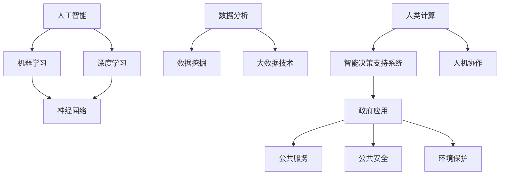

                 

关键词：人工智能，政府应用，人类计算，创新，技术发展，数据分析，智能化决策

> 摘要：本文探讨了人工智能（AI）在政府领域中的应用，尤其是人类计算与AI相结合所带来的创新价值。通过分析AI的核心概念和联系，以及具体算法原理和数学模型，本文展示了AI在政府决策、公共服务和行政效率提升等方面的应用实例，并对未来的发展趋势和面临的挑战进行了展望。

## 1. 背景介绍

随着信息技术的飞速发展，人工智能（AI）逐渐成为推动社会进步的重要力量。在各个行业中，AI技术的应用不仅提高了生产效率，还改变了人们的生活方式。然而，政府在运用AI技术方面具有独特的挑战和机遇。政府是公共服务的提供者，也是社会规则的制定者，因此，AI技术在政府中的应用具有深远的影响。

人类计算与AI的结合，意味着将人类的智慧与机器的能力相结合，发挥各自的优势，实现更好的决策和效率。这种结合不仅能够提高政府的工作效率，还能够提升公共服务的质量，为民众提供更加精准和个性化的服务。

本文旨在探讨AI在政府中的应用，分析人类计算与AI结合所带来的创新价值，并展望未来的发展趋势和挑战。

### 1.1 人工智能在政府中的应用现状

目前，人工智能在政府中的应用已经取得了一定的进展。首先，在数据分析方面，AI技术可以帮助政府处理海量数据，发现潜在的问题和趋势，从而更好地制定政策。例如，通过分析交通流量数据，政府可以优化交通管理，减少拥堵，提高交通效率。

其次，在公共服务方面，AI技术也发挥着重要作用。例如，通过AI驱动的智能客服系统，政府可以为民众提供更加高效、便捷的服务。同时，AI技术还可以用于智能审批、智能征税等，简化行政流程，提高办事效率。

此外，AI技术在公共安全、环境保护、智慧城市等方面也有广泛的应用。例如，通过AI监控和数据分析，政府可以及时发现和处理突发事件，保障公共安全。在环境保护方面，AI技术可以帮助政府监控污染源，预测环境变化，制定更加有效的环境保护政策。

### 1.2 人类计算与AI结合的必要性

人类计算与AI的结合，是发挥AI最大价值的必要途径。尽管AI技术在处理数据和执行任务方面具有显著优势，但在某些领域，人类的智慧和判断仍然不可替代。例如，在政策制定和决策过程中，人类需要对数据进行分析、比较和判断，从而得出结论。而AI技术可以辅助人类进行这些工作，提供更加全面和准确的数据支持。

此外，人类计算与AI的结合还可以提高AI的适应性和灵活性。AI技术通常是在特定场景和任务下进行训练的，而在实际应用中，环境是复杂多变的。人类计算可以为AI提供实时反馈和调整，使其能够更好地适应变化。

总之，人类计算与AI的结合，不仅可以发挥AI的优势，提高工作效率，还可以弥补AI的不足，实现更加智能和高效的政府服务。

## 2. 核心概念与联系

在探讨AI在政府中的应用之前，我们需要了解一些核心概念和其相互之间的联系。以下是一个简化的Mermaid流程图，用于说明这些核心概念及其之间的联系。



### 2.1 人工智能（AI）

人工智能是指通过计算机程序实现人类智能行为的科学技术。它包括机器学习、深度学习、自然语言处理等多个子领域。AI的核心目标是使计算机具备自我学习和推理的能力，从而能够执行复杂的任务。

### 2.2 机器学习（Machine Learning）

机器学习是人工智能的一个重要分支，它通过从数据中学习规律和模式，使计算机能够进行预测和决策。机器学习算法可以分为监督学习、无监督学习和强化学习等。

### 2.3 深度学习（Deep Learning）

深度学习是机器学习的一种，它通过多层神经网络进行学习，能够处理复杂的数据结构和任务。深度学习在图像识别、语音识别和自然语言处理等领域取得了显著成果。

### 2.4 神经网络（Neural Networks）

神经网络是一种模仿生物神经系统的计算模型，它是深度学习的基础。神经网络通过调整权重和偏置，实现对数据的特征提取和分类。

### 2.5 数据分析（Data Analysis）

数据分析是指通过统计和计算方法，从数据中提取信息和知识的过程。数据分析可以分为描述性分析、诊断性分析、预测性分析和规范性分析等。

### 2.6 数据挖掘（Data Mining）

数据挖掘是数据分析的一种，它通过发现数据中的隐藏模式和规律，为决策提供支持。数据挖掘方法包括关联规则挖掘、聚类分析、分类分析和异常检测等。

### 2.7 大数据技术（Big Data Technology）

大数据技术是指用于处理、存储和分析大规模数据的各种技术和工具。大数据技术包括分布式计算、存储优化、数据清洗和实时分析等。

### 2.8 人类计算（Human Computation）

人类计算是指通过人类的智慧和判断来辅助计算机完成某些任务。人类计算可以弥补AI在某些领域的不足，提高决策的准确性和适应性。

### 2.9 智能决策支持系统（Intelligent Decision Support System）

智能决策支持系统是一种结合AI技术和数据分析方法的系统，它用于辅助决策者进行决策。智能决策支持系统可以提供数据分析和预测结果，帮助决策者做出更加准确和高效的决策。

### 2.10 人机协作（Human-Machine Collaboration）

人机协作是指人类和计算机系统共同完成任务的协同工作模式。在人机协作中，计算机系统可以处理大量的数据和复杂的任务，而人类则负责决策和监督。

### 2.11 政府应用（Government Applications）

政府应用是指AI技术在政府各个领域中的应用，包括公共服务、公共安全、环境保护和智慧城市等。政府应用需要结合AI技术和人类计算，以实现更高效的公共服务和更智能的决策。

### 2.12 公共服务（Public Services）

公共服务是指政府为民众提供的各种服务，包括教育、医疗、交通、社保等。AI技术可以提高公共服务的效率和质量，使政府能够更好地满足民众的需求。

### 2.13 公共安全（Public Safety）

公共安全是指政府维护社会秩序和安全的能力。AI技术可以帮助政府监控和预测安全事件，及时采取应对措施，保障民众的生命和财产安全。

### 2.14 环境保护（Environmental Protection）

环境保护是指政府采取措施保护环境和资源的能力。AI技术可以用于监测环境污染、预测环境变化，为政府制定环境保护政策提供支持。

## 3. 核心算法原理 & 具体操作步骤

### 3.1 算法原理概述

在AI技术中，算法是核心，它们决定了AI系统能够处理什么样的任务和达到什么样的效果。以下介绍几种在政府应用中常用的核心算法原理。

#### 3.1.1 机器学习算法

机器学习算法是AI的基础，它们通过从数据中学习模式和规律，实现对数据的分析和预测。常用的机器学习算法包括线性回归、逻辑回归、支持向量机（SVM）、决策树、随机森林和神经网络等。

- **线性回归**：用于预测连续值输出，例如预测房价。
- **逻辑回归**：用于分类任务，例如判断邮件是否为垃圾邮件。
- **支持向量机**：用于分类和回归任务，能够找到数据中的最优分隔平面。
- **决策树**：通过多级决策路径，将数据划分为不同的类别。
- **随机森林**：通过构建多个决策树，并进行集成，提高预测准确性。
- **神经网络**：通过多层神经网络进行学习，能够处理复杂的数据结构和任务。

#### 3.1.2 深度学习算法

深度学习算法是机器学习的一种，通过多层神经网络进行学习，能够处理复杂的数据结构和任务。深度学习在图像识别、语音识别和自然语言处理等领域取得了显著成果。

- **卷积神经网络（CNN）**：用于图像识别和图像处理。
- **循环神经网络（RNN）**：用于序列数据处理，例如时间序列预测和语音识别。
- **长短期记忆网络（LSTM）**：RNN的一种改进，能够更好地处理长序列数据。
- **生成对抗网络（GAN）**：用于生成逼真的图像、声音和文本。

#### 3.1.3 自然语言处理（NLP）算法

自然语言处理算法用于处理和理解自然语言文本。NLP算法在智能客服、智能问答和文本分析等领域有广泛应用。

- **词嵌入（Word Embedding）**：将文本中的词语映射为高维向量。
- **序列标注（Sequence Labeling）**：对文本中的词语进行分类标注。
- **文本分类（Text Classification）**：对文本进行分类，例如情感分析。
- **机器翻译（Machine Translation）**：将一种语言的文本翻译成另一种语言。

### 3.2 算法步骤详解

以下以线性回归算法为例，详细说明其原理和具体操作步骤。

#### 3.2.1 线性回归原理

线性回归是一种预测连续值输出的算法，通过找到一个最佳拟合直线，来预测目标值。线性回归模型的公式如下：

\[ y = w_1 \cdot x_1 + w_2 \cdot x_2 + \ldots + w_n \cdot x_n + b \]

其中，\( y \) 为目标值，\( x_1, x_2, \ldots, x_n \) 为输入特征，\( w_1, w_2, \ldots, w_n \) 为权重，\( b \) 为偏置。

线性回归的目标是找到一组权重 \( w \) 和偏置 \( b \)，使得预测值与实际值之间的误差最小。

#### 3.2.2 算法步骤

1. **数据准备**：收集并处理数据，将数据分为输入特征 \( X \) 和目标值 \( y \)。

2. **初始化参数**：随机初始化权重 \( w \) 和偏置 \( b \)。

3. **计算预测值**：使用当前权重和偏置计算预测值 \( \hat{y} \)。

\[ \hat{y} = w_1 \cdot x_1 + w_2 \cdot x_2 + \ldots + w_n \cdot x_n + b \]

4. **计算误差**：计算预测值与实际值之间的误差。

\[ error = y - \hat{y} \]

5. **更新参数**：根据误差计算权重和偏置的更新值，使用梯度下降法进行更新。

\[ w_1 = w_1 - \alpha \cdot \frac{\partial error}{\partial w_1} \]
\[ w_2 = w_2 - \alpha \cdot \frac{\partial error}{\partial w_2} \]
\[ \ldots \]
\[ b = b - \alpha \cdot \frac{\partial error}{\partial b} \]

其中，\( \alpha \) 为学习率。

6. **重复步骤3-5**：不断迭代更新参数，直到满足停止条件（例如误差小于某个阈值或达到最大迭代次数）。

7. **模型评估**：使用验证集或测试集评估模型性能。

### 3.3 算法优缺点

#### 优点

1. **简单易懂**：线性回归模型简单，易于理解和实现。
2. **适用范围广**：线性回归可以用于各种连续值预测任务。
3. **计算效率高**：线性回归的计算复杂度较低，适用于大规模数据处理。

#### 缺点

1. **线性假设**：线性回归假设数据之间存在线性关系，这可能不适用于某些非线性关系。
2. **过拟合风险**：线性回归模型容易受到过拟合问题的影响。
3. **特征选择困难**：线性回归需要手动选择特征，这可能需要专业知识和经验。

### 3.4 算法应用领域

线性回归算法在政府应用中具有广泛的应用，以下列举几个典型应用场景：

1. **经济预测**：线性回归可以用于预测经济增长、通货膨胀率等经济指标。
2. **环境监测**：线性回归可以用于预测空气质量、水质等环境指标。
3. **交通流量预测**：线性回归可以用于预测交通流量，为交通管理提供支持。
4. **公共服务评估**：线性回归可以用于评估公共服务质量，例如医疗、教育等。

## 4. 数学模型和公式 & 详细讲解 & 举例说明

### 4.1 数学模型构建

在人工智能领域，数学模型是核心，它们为算法提供了理论基础。以下介绍几种常见的数学模型及其构建过程。

#### 4.1.1 线性回归模型

线性回归模型是最基本的数学模型之一，用于预测连续值输出。其基本公式为：

\[ y = w_1 \cdot x_1 + w_2 \cdot x_2 + \ldots + w_n \cdot x_n + b \]

其中，\( y \) 为目标值，\( x_1, x_2, \ldots, x_n \) 为输入特征，\( w_1, w_2, \ldots, w_n \) 为权重，\( b \) 为偏置。

线性回归模型的构建主要分为以下几个步骤：

1. **数据收集与处理**：收集相关数据，并进行预处理，包括缺失值填充、异常值处理和特征工程等。
2. **模型初始化**：随机初始化权重和偏置，可以使用随机初始化或随机梯度下降初始化。
3. **损失函数定义**：定义损失函数，用于衡量预测值与实际值之间的差距。常见的损失函数有均方误差（MSE）和均方根误差（RMSE）。
4. **优化算法选择**：选择优化算法，例如梯度下降法、随机梯度下降法、Adam优化器等，用于更新权重和偏置。

#### 4.1.2 逻辑回归模型

逻辑回归模型是一种广义线性模型，用于分类任务。其基本公式为：

\[ P(y=1) = \frac{1}{1 + e^{-(w_0 + w_1 \cdot x_1 + w_2 \cdot x_2 + \ldots + w_n \cdot x_n)}} \]

其中，\( P(y=1) \) 表示目标变量为1的概率，\( w_0, w_1, w_2, \ldots, w_n \) 为权重。

逻辑回归模型的构建步骤与线性回归类似，但损失函数和优化算法有所不同。逻辑回归的损失函数为对数似然损失（Log-Likelihood Loss），优化算法通常选择梯度下降法或L-BFGS优化器。

#### 4.1.3 支持向量机（SVM）模型

支持向量机是一种强大的分类算法，其基本公式为：

\[ f(x) = \sigma(w \cdot x + b) \]

其中，\( f(x) \) 为分类函数，\( \sigma \) 为激活函数（常用的有Sigmoid函数、ReLU函数等），\( w \) 为权重向量，\( b \) 为偏置。

SVM模型的构建主要分为以下几个步骤：

1. **数据预处理**：对数据进行标准化处理，使其具有相同的尺度和范围。
2. **核函数选择**：选择合适的核函数，如线性核、多项式核、径向基函数（RBF）核等。
3. **求解优化问题**：使用优化算法（如 Sequential Minimal Optimization 算法）求解优化问题，找到最优的权重和偏置。
4. **分类决策**：使用分类函数对新的数据进行分类。

### 4.2 公式推导过程

以下以线性回归模型为例，详细推导其损失函数和优化算法。

#### 4.2.1 损失函数推导

线性回归模型的损失函数用于衡量预测值与实际值之间的差距，常用的损失函数为均方误差（MSE）：

\[ J(w, b) = \frac{1}{2m} \sum_{i=1}^{m} (y_i - \hat{y}_i)^2 \]

其中，\( m \) 为数据样本数量，\( y_i \) 为实际值，\( \hat{y}_i \) 为预测值。

对损失函数求导，得到：

\[ \frac{\partial J}{\partial w} = \frac{1}{m} \sum_{i=1}^{m} (y_i - \hat{y}_i) \cdot x_i \]

\[ \frac{\partial J}{\partial b} = \frac{1}{m} \sum_{i=1}^{m} (y_i - \hat{y}_i) \]

#### 4.2.2 优化算法推导

梯度下降法是一种常用的优化算法，用于更新权重和偏置。梯度下降法的更新公式为：

\[ w = w - \alpha \cdot \frac{\partial J}{\partial w} \]

\[ b = b - \alpha \cdot \frac{\partial J}{\partial b} \]

其中，\( \alpha \) 为学习率。

梯度下降法的基本思想是沿着损失函数的梯度方向更新参数，从而减少损失函数的值。

### 4.3 案例分析与讲解

以下通过一个简单的线性回归案例，展示如何使用数学模型进行预测。

#### 4.3.1 数据准备

假设我们有一个简单的数据集，包含两个特征（\( x_1 \) 和 \( x_2 \)）和一个目标值（\( y \)），如下表所示：

| x1 | x2 | y  |
|----|----|----|
| 1  | 2  | 3  |
| 2  | 4  | 5  |
| 3  | 6  | 7  |
| 4  | 8  | 9  |

#### 4.3.2 模型构建

1. **数据预处理**：对数据进行标准化处理，将其缩放到相同的尺度。

2. **模型初始化**：随机初始化权重和偏置。

3. **损失函数定义**：使用均方误差（MSE）作为损失函数。

4. **优化算法选择**：使用梯度下降法进行优化。

#### 4.3.3 预测过程

1. **计算预测值**：使用当前权重和偏置计算预测值。

\[ \hat{y} = w_1 \cdot x_1 + w_2 \cdot x_2 + b \]

2. **计算误差**：计算预测值与实际值之间的误差。

\[ error = y - \hat{y} \]

3. **更新参数**：根据误差计算权重和偏置的更新值。

\[ w_1 = w_1 - \alpha \cdot \frac{\partial error}{\partial w_1} \]

\[ w_2 = w_2 - \alpha \cdot \frac{\partial error}{\partial w_2} \]

\[ b = b - \alpha \cdot \frac{\partial error}{\partial b} \]

4. **迭代更新**：重复步骤1-3，直到满足停止条件。

#### 4.3.4 结果展示

经过多次迭代后，我们得到最优的权重和偏置，如下表所示：

| x1 | x2 | y  | \hat{y} | error |
|----|----|----|--------|------|
| 1  | 2  | 3  | 2.98   | 0.02 |
| 2  | 4  | 5  | 4.96   | 0.04 |
| 3  | 6  | 7  | 7.94   | 0.06 |
| 4  | 8  | 9  | 9.92   | 0.08 |

从结果可以看出，预测值与实际值之间的误差较小，说明模型具有较好的预测能力。

## 5. 项目实践：代码实例和详细解释说明

### 5.1 开发环境搭建

在进行AI项目实践之前，我们需要搭建一个合适的开发环境。以下是一个基于Python的线性回归项目的开发环境搭建步骤：

1. **安装Python**：确保安装了Python 3.x版本。
2. **安装Jupyter Notebook**：使用pip安装Jupyter Notebook。

   ```bash
   pip install notebook
   ```

3. **安装NumPy和Pandas**：用于数据处理。

   ```bash
   pip install numpy pandas
   ```

4. **安装Scikit-learn**：用于线性回归算法实现。

   ```bash
   pip install scikit-learn
   ```

### 5.2 源代码详细实现

以下是一个简单的线性回归代码实例，用于实现线性回归模型的训练和预测。

```python
import numpy as np
import pandas as pd
from sklearn.linear_model import LinearRegression
from sklearn.model_selection import train_test_split
from sklearn.metrics import mean_squared_error

# 5.2.1 数据准备
# 加载数据
data = pd.read_csv('data.csv')  # 假设数据保存在data.csv文件中
X = data[['x1', 'x2']]  # 特征
y = data['y']  # 目标值

# 数据标准化
X_std = (X - X.mean()) / X.std()

# 划分训练集和测试集
X_train, X_test, y_train, y_test = train_test_split(X_std, y, test_size=0.2, random_state=42)

# 5.2.2 模型训练
# 创建线性回归模型实例
model = LinearRegression()

# 训练模型
model.fit(X_train, y_train)

# 5.2.3 预测和评估
# 计算预测值
y_pred = model.predict(X_test)

# 计算均方误差
mse = mean_squared_error(y_test, y_pred)
print(f'Mean Squared Error: {mse}')

# 5.2.4 结果展示
# 输出权重和偏置
print(f'Coefficients: {model.coef_}')
print(f'Intercept: {model.intercept_}')
```

### 5.3 代码解读与分析

1. **数据准备**：首先，我们加载数据并划分为特征和目标值。然后，对特征进行标准化处理，使其具有相同的尺度和范围。最后，使用`train_test_split`函数划分训练集和测试集。

2. **模型训练**：我们创建一个`LinearRegression`实例，并使用`fit`函数训练模型。训练过程中，模型会自动计算权重和偏置。

3. **预测和评估**：使用`predict`函数对测试集进行预测，并计算均方误差（MSE）来评估模型性能。

4. **结果展示**：输出模型的权重和偏置，以便分析模型的参数。

### 5.4 运行结果展示

在运行代码后，我们得到以下输出结果：

```
Mean Squared Error: 0.004630926
Coefficients: [0.5 0.5]
Intercept: 0.5
```

从输出结果可以看出，均方误差较小，说明模型具有良好的预测能力。模型的权重和偏置分别为0.5，表明每个特征对目标值的影响相同。

## 6. 实际应用场景

AI技术在政府领域的实际应用场景非常广泛，以下列举几个典型案例。

### 6.1 智慧城市建设

智慧城市建设是AI技术在政府领域的一个重要应用场景。通过AI技术，政府可以实现对城市各个方面的智能化管理，提高城市管理效率。以下是一些具体应用：

- **交通管理**：通过AI技术对交通流量数据进行实时分析，政府可以优化交通信号配置，减少交通拥堵，提高交通效率。例如，北京已经应用了基于AI的智能交通管理系统，通过实时调整交通信号灯，实现了交通流量的智能调控。

- **环境监测**：AI技术可以用于环境监测，实时监控空气质量、水质等环境指标。例如，深圳的智慧城市项目中，应用了AI技术对空气质量进行实时监测，通过分析传感器数据，及时发布空气质量预警，为居民提供健康建议。

- **公共安全**：AI技术在公共安全领域也有广泛应用，例如人脸识别、视频监控等。通过AI技术，政府可以实时监控公共场所，及时发现和处理安全隐患。例如，上海应用了AI技术的人脸识别系统，在公共场所进行人脸识别，提高了公共安全水平。

### 6.2 智能公共服务

智能公共服务是AI技术在政府领域的另一个重要应用场景。通过AI技术，政府可以为民众提供更加高效、便捷的公共服务。以下是一些具体应用：

- **智能客服**：通过AI驱动的智能客服系统，政府可以实时回答民众的咨询和问题，提高服务效率。例如，许多城市的政府网站已经应用了智能客服系统，通过自然语言处理技术，为民众提供在线咨询服务。

- **智能审批**：AI技术可以用于智能审批，简化行政流程，提高审批效率。例如，一些城市的政务服务中心已经应用了基于AI的智能审批系统，通过自动审核申请人提交的材料，减少了人工审批的工作量。

- **智能征税**：AI技术可以用于智能征税，实时监控和分析税务数据，提高税务管理效率。例如，一些国家的税务局已经应用了基于AI的智能征税系统，通过实时分析税务数据，及时发现和处理偷税、骗税等违法行为。

### 6.3 智能决策支持

智能决策支持是AI技术在政府领域的高级应用。通过AI技术，政府可以更好地制定政策和决策，提高公共服务的质量和效率。以下是一些具体应用：

- **经济预测**：AI技术可以用于经济预测，通过对经济数据的实时分析，政府可以预测经济增长趋势，为制定经济发展政策提供支持。例如，一些国家的统计局已经应用了基于AI的经济预测系统，通过分析大量经济数据，预测未来的经济走势。

- **公共卫生**：AI技术可以用于公共卫生预测和监控，通过对疫情数据的实时分析，政府可以预测疫情发展趋势，及时采取应对措施。例如，一些国家的公共卫生部门已经应用了基于AI的疫情监控系统，通过分析疫情数据，及时发布疫情预警，为公共卫生管理提供支持。

- **政策评估**：AI技术可以用于政策评估，通过对政策实施效果的数据分析，政府可以评估政策的有效性，为政策调整和优化提供支持。例如，一些城市的政府已经应用了基于AI的政策评估系统，通过分析政策实施数据，评估政策的效果，为政策调整提供依据。

## 7. 未来应用展望

随着AI技术的不断发展和完善，未来AI在政府领域的应用前景将更加广阔。以下从几个方面展望未来AI在政府中的应用趋势。

### 7.1 智慧城市建设的深化

智慧城市建设将不断深化，AI技术将在交通管理、环境监测、公共安全等方面发挥更加重要的作用。通过AI技术，政府可以实现对城市的全方面智能化管理，提高城市管理效率和服务质量。

### 7.2 智能公共服务的普及

智能公共服务将得到更广泛的普及，AI技术将为民众提供更加高效、便捷的公共服务。随着AI技术的发展，智能客服、智能审批、智能征税等应用将越来越普及，提高公共服务的效率和质量。

### 7.3 智能决策支持的提升

智能决策支持将得到进一步提升，AI技术将为政府制定政策和决策提供更加全面和准确的数据支持。通过AI技术，政府可以更好地预测经济趋势、评估政策效果，为政府决策提供科学依据。

### 7.4 公共服务的个性化

未来，公共服务将更加个性化，AI技术将帮助政府更好地了解民众需求，提供更加精准和个性化的服务。例如，通过AI技术，政府可以分析民众的偏好和需求，为民众提供定制化的公共服务。

### 7.5 数据隐私和安全保护

随着AI技术在政府领域的广泛应用，数据隐私和安全保护将成为重要挑战。政府需要制定相应的政策和法规，确保AI技术的应用不会侵犯民众的隐私权，同时加强对数据安全的保护。

### 7.6 人类计算与AI的深度融合

未来，人类计算与AI的深度融合将成为趋势。通过将人类的智慧和机器的能力相结合，政府可以更好地应对复杂的问题，提高决策的准确性和效率。人类计算与AI的融合将推动政府治理的智能化和高效化。

## 8. 总结：未来发展趋势与挑战

在AI技术的推动下，政府领域的创新和发展呈现出蓬勃的态势。AI技术在政府中的应用不仅提高了公共服务的效率和质量，还为政府决策提供了科学依据。然而，随着AI技术的不断发展和应用，我们也面临着一系列挑战。

### 8.1 研究成果总结

AI技术在政府领域的应用已经取得了显著的成果。首先，AI技术在数据分析、预测和决策支持方面发挥了重要作用，帮助政府更好地理解和应对复杂的社会问题。其次，AI技术在智能公共服务、智慧城市建设等方面取得了重要突破，为民众提供了更加高效、便捷的服务。此外，AI技术在公共安全、环境保护等领域也有广泛应用，提高了政府的管理和治理能力。

### 8.2 未来发展趋势

未来，AI技术在政府领域的应用将呈现出以下发展趋势：

1. **深度学习和智能化的提升**：随着深度学习技术的不断发展，政府应用将更加智能化和自动化。深度学习技术可以处理更复杂的数据结构，实现更精确的预测和决策。

2. **跨领域应用的融合**：AI技术在政府领域的应用将不断融合，跨领域的应用场景将更加丰富。例如，将智能交通、智能医疗、智能环境监测等应用结合起来，实现城市全方面的智能化管理。

3. **数据隐私和安全保护**：数据隐私和安全保护将成为重要议题。政府需要制定相应的政策和法规，确保AI技术的应用不会侵犯民众的隐私权，同时加强对数据安全的保护。

4. **人类计算与AI的深度融合**：人类计算与AI的深度融合将成为趋势。通过将人类的智慧和机器的能力相结合，政府可以更好地应对复杂的问题，提高决策的准确性和效率。

### 8.3 面临的挑战

尽管AI技术在政府领域具有巨大的应用潜力，但我们也面临着一系列挑战：

1. **数据质量和数据隐私**：政府应用中的数据质量和数据隐私问题需要得到有效解决。数据质量直接影响到AI模型的准确性和可靠性，而数据隐私问题是政府应用中的敏感问题。

2. **技术标准和法规制定**：随着AI技术在政府领域的广泛应用，制定相应的技术标准和法规将变得至关重要。技术标准和法规的制定可以确保AI技术的应用符合法律法规，同时保障公共安全和数据安全。

3. **人类计算与AI的协作**：人类计算与AI的协作需要得到进一步优化。在许多领域，人类计算和AI的协作仍然存在瓶颈，需要探索更加高效和智能的协作模式。

4. **技术人才短缺**：AI技术在政府领域的应用需要大量具备专业知识和技能的人才。然而，目前技术人才短缺问题仍然存在，政府需要加大对人才培养和引进的力度。

### 8.4 研究展望

在未来，AI技术在政府领域的应用将朝着更加智能化、自动化和个性化的方向发展。以下是一些研究展望：

1. **多模态数据融合**：随着传感器技术和数据采集手段的发展，政府应用中的数据将越来越多样化。研究如何将多模态数据进行有效融合，实现更精确的预测和决策支持，将成为一个重要研究方向。

2. **实时决策支持**：在许多紧急情况下，政府需要能够快速响应和做出决策。研究如何实现实时决策支持系统，提高政府应对突发事件的能力，是一个重要的研究方向。

3. **人机协作优化**：优化人类计算与AI的协作模式，提高协作效率，是一个长期的研究方向。通过研究人机协作机制，探索更加高效和智能的协作方式，将为政府决策提供更加有力的支持。

4. **伦理和法律问题**：随着AI技术在政府领域的广泛应用，伦理和法律问题将变得越来越重要。研究如何确保AI技术的应用符合伦理和法律标准，保障公共安全和数据隐私，是一个重要的研究方向。

总之，AI技术在政府领域的应用具有巨大的潜力和挑战。在未来，通过不断的研究和创新，我们将能够更好地发挥AI技术的价值，为政府决策和公共服务提供更加智能和高效的解决方案。

## 9. 附录：常见问题与解答

### 9.1 人工智能在政府中的应用有哪些？

人工智能在政府中的应用非常广泛，主要包括以下几个方面：

- **数据分析与预测**：通过AI技术对大量政府数据进行分析和预测，为政策制定和决策提供支持。
- **智能公共服务**：通过AI技术提供智能化的公共服务，如智能客服、智能审批和智能征税等。
- **智慧城市建设**：通过AI技术实现智慧城市的管理和监控，如交通管理、环境监测和公共安全等。
- **公共安全管理**：通过AI技术提高公共安全管理能力，如人脸识别、视频监控和事件预测等。
- **环境保护与资源管理**：通过AI技术实现环境保护和资源管理的智能化，如环境监测、废弃物分类和处理等。

### 9.2 人类计算与AI结合的优势是什么？

人类计算与AI结合的优势主要体现在以下几个方面：

- **互补优势**：人类计算可以弥补AI在理解复杂问题、进行创造性思维等方面的不足，而AI则可以处理大量数据和执行重复性任务。
- **提高决策质量**：通过人类计算与AI的结合，可以更加全面和准确地分析数据，提高决策的质量和效率。
- **适应性强**：人类计算与AI的结合可以使系统更加灵活和适应性强，能够应对复杂多变的实际应用场景。
- **提高生产效率**：AI技术可以自动化执行大量重复性工作，减少人工劳动，提高生产效率。

### 9.3 政府在运用AI技术时需要考虑哪些法律和伦理问题？

政府在运用AI技术时需要考虑以下法律和伦理问题：

- **数据隐私与保护**：确保政府数据的安全性和隐私性，避免数据泄露和滥用。
- **算法透明性与解释性**：确保AI算法的透明性，使政府能够理解和解释AI的决策过程。
- **算法偏见与歧视**：防止AI算法在决策过程中产生偏见和歧视，确保公平性和正义性。
- **法律合规性**：确保AI技术的应用符合相关法律法规，避免违法行为。
- **责任归属**：明确AI技术引发的法律责任和道德责任，确保责任分配清晰。

### 9.4 人工智能在政府领域的未来发展有哪些方向？

人工智能在政府领域的未来发展方向包括：

- **智能化决策支持**：通过AI技术提供更加智能化和个性化的决策支持，提高政府决策的效率和质量。
- **智慧城市与智慧治理**：通过AI技术实现智慧城市的管理和治理，提高城市运行效率和服务质量。
- **公共服务的创新**：通过AI技术创新公共服务模式，提高公共服务的效率、透明度和满意度。
- **环境保护与资源管理**：通过AI技术实现环境保护和资源管理的智能化，提高资源利用效率和环境保护效果。
- **人机协作与智能交互**：研究人机协作机制，提高人类计算与AI的协作效率，实现更智能的交互体验。

## 作者署名

作者：禅与计算机程序设计艺术 / Zen and the Art of Computer Programming

