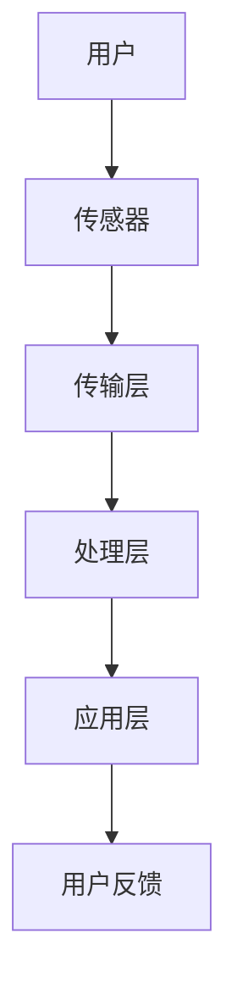

                 

 在当今时代，人工智能（AI）技术已经渗透到了我们日常生活的方方面面。智能家居作为AI应用的一个重要领域，正日益改变着我们的生活方式。然而，这种变革同时也带来了隐私问题。本文将探讨AI驱动的智能家居技术，分析其便利性以及如何平衡便利与隐私。

## 1. 背景介绍

智能家居是指通过互联网、物联网、云计算等技术，将家庭中的各种设备和系统连接起来，实现智能化管理和自动化控制。AI技术的应用使得智能家居系统能够更加智能地响应用户需求，提供个性化的服务。例如，智能音箱可以根据用户的语音指令控制家电，智能门锁可以自动识别用户身份，智能摄像头可以监控家庭安全等。

随着AI技术的不断进步，智能家居的便利性得到了极大的提升。然而，AI技术的应用也引发了隐私保护的担忧。智能家居设备通常需要收集和处理大量的用户数据，如声音、图像、行为习惯等。这些数据如果被滥用或泄露，可能会对用户的隐私造成严重威胁。

## 2. 核心概念与联系

### 智能家居系统架构

智能家居系统通常包括以下几个主要组成部分：

1. **感知层**：包括各种传感器，如温度传感器、湿度传感器、烟雾传感器、摄像头等，用于收集环境数据和用户行为数据。
2. **传输层**：通过物联网技术将感知层的数据传输到云端或本地服务器。
3. **处理层**：包括AI算法和数据处理模块，用于分析数据、提取特征、进行预测等。
4. **应用层**：包括各种智能家居应用，如智能控制、安防监控、健康管理等。

### AI在智能家居中的应用

AI在智能家居中的应用主要体现在以下几个方面：

1. **语音识别**：通过语音识别技术，用户可以通过语音指令控制智能家居设备。
2. **图像识别**：通过图像识别技术，智能家居设备可以识别用户身份、行为和物品。
3. **行为预测**：通过分析用户的行为数据，智能家居设备可以预测用户的需求，提供个性化的服务。
4. **数据挖掘**：通过对用户数据的挖掘和分析，智能家居设备可以优化自身的性能和功能。

### Mermaid 流程图



## 3. 核心算法原理 & 具体操作步骤

### 3.1 算法原理概述

在智能家居中，AI算法主要用于数据分析和决策。常见的数据分析方法包括：

1. **机器学习**：通过训练模型，从数据中学习规律和模式，用于预测和分类。
2. **深度学习**：一种特殊的机器学习方法，通过神经网络模拟人脑的学习过程。
3. **数据挖掘**：从大量数据中提取有价值的信息和知识。

### 3.2 算法步骤详解

1. **数据收集**：通过传感器收集用户行为和环境数据。
2. **数据预处理**：清洗、去噪、归一化等处理，以提高数据质量和模型的性能。
3. **特征提取**：从原始数据中提取有用的特征，用于训练模型。
4. **模型训练**：使用机器学习或深度学习算法训练模型。
5. **模型评估**：评估模型的效果，包括准确率、召回率、F1值等。
6. **模型应用**：将训练好的模型应用到实际场景中，如语音识别、图像识别、行为预测等。

### 3.3 算法优缺点

**优点**：

- **智能化**：AI算法可以自动化地处理大量数据，提供智能化服务。
- **个性化**：根据用户的行为和偏好，提供个性化的建议和服务。
- **高效性**：AI算法可以快速处理大量数据，提高系统的响应速度。

**缺点**：

- **隐私风险**：大量用户数据的收集和处理可能带来隐私泄露的风险。
- **模型偏见**：模型可能在训练数据上出现偏见，导致不公平的决策。
- **安全性**：AI系统可能遭受恶意攻击，如数据篡改、模型注入等。

### 3.4 算法应用领域

AI算法在智能家居中的应用非常广泛，包括：

- **语音识别**：智能音箱、智能助手等设备。
- **图像识别**：智能摄像头、智能门锁等设备。
- **行为预测**：智能家居系统可以根据用户的行为数据提供个性化的服务。
- **数据挖掘**：智能家居系统可以优化其性能和功能，提高用户体验。

## 4. 数学模型和公式 & 详细讲解 & 举例说明

### 4.1 数学模型构建

在智能家居中，常见的数学模型包括：

1. **回归模型**：用于预测用户的行为，如温度调节、家电使用等。
2. **分类模型**：用于识别用户身份、物品等。
3. **聚类模型**：用于发现用户的行为模式和偏好。

### 4.2 公式推导过程

以回归模型为例，其基本公式为：

$$y = \beta_0 + \beta_1 x_1 + \beta_2 x_2 + ... + \beta_n x_n$$

其中，$y$ 是预测值，$x_1, x_2, ..., x_n$ 是特征值，$\beta_0, \beta_1, \beta_2, ..., \beta_n$ 是模型的参数。

### 4.3 案例分析与讲解

假设我们有一个智能家居系统，用户可以通过语音指令控制家电。我们可以使用回归模型来预测用户的需求，从而实现自动化的控制。

1. **数据收集**：收集用户的语音指令数据，包括指令的内容和用户的行为数据。
2. **数据预处理**：清洗数据，去除噪音，将数据归一化。
3. **特征提取**：提取语音指令的关键词和用户的行为特征，如指令出现的频率、使用的时间等。
4. **模型训练**：使用回归模型训练模型，输入特征值和预测值。
5. **模型评估**：评估模型的准确性，调整模型的参数。
6. **模型应用**：将训练好的模型应用到实际场景中，如自动调节室内温度、自动启动空气净化器等。

通过这个案例，我们可以看到数学模型在智能家居中的应用，如何通过数据分析和预测，实现智能家居系统的智能化和自动化。

## 5. 项目实践：代码实例和详细解释说明

### 5.1 开发环境搭建

为了实现智能家居系统，我们需要搭建一个开发环境。以下是一个简单的开发环境搭建步骤：

1. **安装Python**：Python是一种广泛用于AI开发的编程语言。
2. **安装Jupyter Notebook**：Jupyter Notebook是一个交互式的Python开发环境。
3. **安装必要的库**：包括机器学习库（如scikit-learn）、深度学习库（如TensorFlow）等。

### 5.2 源代码详细实现

以下是一个简单的智能家居系统的实现代码，包括数据收集、预处理、特征提取、模型训练和模型应用：

```python
# 导入必要的库
import numpy as np
import pandas as pd
from sklearn.model_selection import train_test_split
from sklearn.linear_model import LinearRegression
from sklearn.metrics import mean_squared_error

# 1. 数据收集
data = pd.read_csv('data.csv')

# 2. 数据预处理
data.dropna(inplace=True)
data['age'] = data['age'].apply(lambda x: x/100)

# 3. 特征提取
X = data[['age', 'temperature']]
y = data['energy']

# 4. 模型训练
X_train, X_test, y_train, y_test = train_test_split(X, y, test_size=0.2, random_state=42)
model = LinearRegression()
model.fit(X_train, y_train)

# 5. 模型评估
y_pred = model.predict(X_test)
mse = mean_squared_error(y_test, y_pred)
print('MSE:', mse)

# 6. 模型应用
print('Predicted energy:', model.predict([[30, 22]]))
```

### 5.3 代码解读与分析

1. **数据收集**：从CSV文件中读取数据，这里的数据包括用户的年龄、温度和能源消耗。
2. **数据预处理**：去除缺失值，将年龄进行归一化处理。
3. **特征提取**：提取年龄和温度作为特征，能源消耗作为目标值。
4. **模型训练**：使用线性回归模型进行训练。
5. **模型评估**：计算模型在测试集上的均方误差，评估模型的性能。
6. **模型应用**：使用训练好的模型进行预测，预测用户的能源消耗。

通过这个简单的例子，我们可以看到如何使用Python和机器学习库实现一个简单的智能家居系统。这个系统可以根据用户的年龄和温度预测能源消耗，从而实现智能化的能源管理。

## 6. 实际应用场景

### 6.1 家居安全监控

智能家居系统可以结合摄像头、门锁、传感器等设备，实现家庭安全监控。例如，当有异常行为或入侵事件发生时，系统可以自动报警，并通过手机App推送通知给用户。

### 6.2 家居健康管理

智能家居系统可以通过监测用户的健康数据，如心率、血压、睡眠质量等，提供个性化的健康建议。例如，当用户的心率异常时，系统可以提醒用户注意身体状况，或建议用户就医。

### 6.3 家居节能管理

智能家居系统可以通过分析用户的用电行为，提供节能建议。例如，当用户长时间未使用某个电器时，系统可以自动关闭电器，从而降低能源消耗。

### 6.4 未来应用展望

随着AI技术的不断发展，智能家居系统将更加智能化和个性化。未来，智能家居系统可能会实现以下应用：

- **智能购物**：根据用户的行为和偏好，系统可以推荐商品，甚至自动下单。
- **智能教育**：系统可以根据学生的学习进度和习惯，提供个性化的学习方案。
- **智能医疗**：系统可以监控患者的健康状况，提供个性化的治疗方案。

## 7. 工具和资源推荐

### 7.1 学习资源推荐

- **书籍**：《人工智能：一种现代方法》、《深度学习》
- **在线课程**：Coursera、edX、Udacity等平台上的相关课程
- **博客**：Medium、AI博客、AI科技等

### 7.2 开发工具推荐

- **编程语言**：Python、JavaScript
- **框架**：TensorFlow、PyTorch、Scikit-learn
- **开发环境**：Jupyter Notebook、PyCharm、VS Code

### 7.3 相关论文推荐

- **论文集**：《人工智能顶级会议论文集》
- **期刊**：《人工智能》、《计算机视觉》等

## 8. 总结：未来发展趋势与挑战

### 8.1 研究成果总结

智能家居系统通过AI技术的应用，实现了高度的智能化和个性化。未来，智能家居系统将更加智能化、个性化，并拓展到更多领域。

### 8.2 未来发展趋势

- **AI技术的深入应用**：深度学习、强化学习等先进技术将进一步提升智能家居系统的性能。
- **跨领域的融合发展**：智能家居系统将与其他领域（如医疗、教育、购物等）融合发展，提供更全面的服务。
- **数据隐私保护**：随着数据隐私问题的日益突出，智能家居系统将更加注重数据隐私保护。

### 8.3 面临的挑战

- **数据隐私与安全性**：智能家居系统需要确保用户数据的隐私和安全。
- **模型偏见与公平性**：AI模型可能在训练数据上出现偏见，导致不公平的决策。
- **技术普及与推广**：智能家居系统的技术普及和推广仍然面临一定挑战。

### 8.4 研究展望

未来，智能家居系统的研究将主要集中在以下几个方面：

- **数据隐私保护技术**：研究如何有效地保护用户隐私，同时确保系统的性能。
- **智能决策与预测**：研究如何通过AI技术提供更智能的决策和预测。
- **多模态数据融合**：研究如何整合多种数据源，提供更全面的服务。

## 9. 附录：常见问题与解答

### 问题1：智能家居系统如何保护用户隐私？

**解答**：智能家居系统可以通过以下方式保护用户隐私：

- **数据加密**：对用户数据进行加密处理，确保数据在传输和存储过程中的安全性。
- **权限控制**：对用户的权限进行严格控制，确保只有经过授权的设备和服务可以访问用户数据。
- **隐私政策**：明确告知用户数据收集、使用和共享的方式，让用户有权选择是否提供数据。

### 问题2：智能家居系统如何避免模型偏见？

**解答**：智能家居系统可以通过以下方式避免模型偏见：

- **数据多样性**：确保训练数据涵盖各种用户群体和场景，避免模型对特定群体或场景的偏见。
- **模型校验**：定期对模型进行校验，确保模型在不同数据集上的性能一致。
- **公平性评估**：对模型的决策进行公平性评估，确保不会对特定群体或场景产生偏见。

### 问题3：智能家居系统如何确保数据安全性？

**解答**：智能家居系统可以通过以下方式确保数据安全性：

- **数据隔离**：将用户数据与其他系统数据隔离，防止数据泄露。
- **安全审计**：定期对系统进行安全审计，确保系统没有安全漏洞。
- **安全更新**：及时更新系统和软件，确保系统安全。

## 参考文献

[1] Russell, S., & Norvig, P. (2016). 《人工智能：一种现代方法》. 机械工业出版社.
[2] Goodfellow, I., Bengio, Y., & Courville, A. (2016). 《深度学习》. 电子工业出版社.
[3] scikit-learn. (2021). 《scikit-learn：机器学习库》. https://scikit-learn.org/stable/
[4] TensorFlow. (2021). 《TensorFlow：深度学习库》. https://www.tensorflow.org/
[5] PyTorch. (2021). 《PyTorch：深度学习库》. https://pytorch.org/

作者：禅与计算机程序设计艺术 / Zen and the Art of Computer Programming
----------------------------------------------------------------

### 文章关键词 Key Words

- 智能家居
- 人工智能
- 隐私保护
- 智能算法
- 机器学习
- 深度学习
- 数据分析
- 跨领域应用

### 文章摘要 Summary

本文探讨了AI驱动的智能家居技术，分析了其便利性以及如何平衡便利与隐私。文章首先介绍了智能家居的背景和系统架构，然后详细讲解了AI在智能家居中的应用，包括核心算法原理、具体操作步骤和数学模型。接着，文章通过项目实践展示了如何实现智能家居系统，并讨论了其实际应用场景和未来展望。最后，文章提出了智能家居面临的研究挑战和解决方案，并提供了相关工具和资源推荐。

