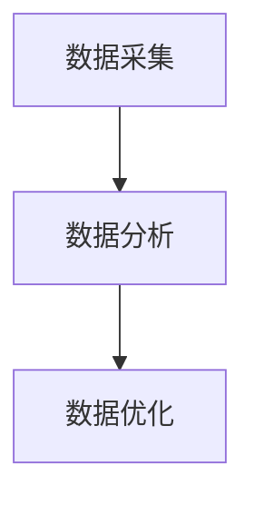

                 

关键词：人工智能、智能能源管理、能源效率、机器学习、可再生能源

> 摘要：本文探讨了如何利用人工智能技术构建智能能源管理系统，以提高能源利用效率和降低碳排放。文章首先介绍了智能能源管理系统的背景和核心概念，随后深入分析了核心算法原理和具体操作步骤，并通过实际案例展示了其应用效果。文章还讨论了数学模型和公式，以及项目实践中的代码实例和运行结果。最后，本文对未来智能能源管理系统的发展趋势和应用场景进行了展望。

## 1. 背景介绍

随着全球能源需求的不断增长和气候变化问题的加剧，提高能源利用效率、降低碳排放已成为全球范围内的紧迫任务。传统的能源管理方式已经无法满足现代社会对高效、绿色能源的需求。因此，智能能源管理系统（Intelligent Energy Management System, IEMS）的概念应运而生。

智能能源管理系统是一种基于人工智能技术的能源管理解决方案，通过实时监测、分析和优化能源使用，实现能源的高效利用和碳排放的减少。该系统利用传感器收集大量能源数据，通过数据分析和机器学习算法，对能源使用情况进行预测和优化，从而实现能源供应与需求的动态平衡。

智能能源管理系统在电力、工业、交通和建筑等领域都有广泛的应用前景。例如，在电力行业，智能能源管理系统可以帮助电力公司优化发电和输电过程，提高电力供应的稳定性和可靠性；在工业领域，智能能源管理系统可以帮助企业优化生产流程，降低能源消耗和成本；在交通领域，智能能源管理系统可以帮助优化交通流量，降低交通能耗和污染。

## 2. 核心概念与联系

### 2.1 核心概念

智能能源管理系统涉及多个核心概念，包括数据采集、数据分析和数据优化。

- **数据采集**：数据采集是智能能源管理系统的核心环节。通过安装在各类设备上的传感器，实时收集能源使用数据，如电力、燃气、水的使用量等。

- **数据分析**：数据分析是智能能源管理系统的核心，通过数据挖掘和机器学习算法，对采集到的数据进行处理和分析，提取出有价值的信息，如能源使用模式、预测能源需求等。

- **数据优化**：数据优化是基于数据分析的结果，通过优化算法调整能源使用策略，实现能源的高效利用和碳排放的减少。

### 2.2 联系

智能能源管理系统中的核心概念之间有着紧密的联系。数据采集为数据分析提供数据基础，数据分析的结果又为数据优化提供了依据。通过这三个环节的有机结合，智能能源管理系统实现了对能源使用情况的全面监控和优化。

以下是智能能源管理系统的 Mermaid 流程图：



## 3. 核心算法原理 & 具体操作步骤

### 3.1 算法原理概述

智能能源管理系统采用的核心算法主要包括机器学习算法和优化算法。

- **机器学习算法**：机器学习算法用于对采集到的能源数据进行处理和分析，提取出能源使用模式、预测能源需求等。常见的机器学习算法包括决策树、支持向量机、神经网络等。

- **优化算法**：优化算法用于根据数据分析结果调整能源使用策略，实现能源的高效利用和碳排放的减少。常见的优化算法包括线性规划、遗传算法、模拟退火算法等。

### 3.2 算法步骤详解

智能能源管理系统的算法步骤主要包括以下几个环节：

1. **数据预处理**：对采集到的能源数据进行清洗和预处理，如缺失值处理、异常值处理、归一化等。

2. **特征提取**：从预处理后的数据中提取出有用的特征信息，如能源使用量、时间戳、设备状态等。

3. **模型训练**：使用机器学习算法对特征提取后的数据进行训练，构建预测模型。

4. **模型评估**：对训练好的模型进行评估，如准确率、召回率、F1值等。

5. **模型优化**：根据评估结果对模型进行优化，提高预测准确性。

6. **策略调整**：根据预测模型的结果，调整能源使用策略，实现能源的高效利用和碳排放的减少。

### 3.3 算法优缺点

- **机器学习算法**：

  - 优点：具有较强的自适应性和预测能力，可以处理大规模的复杂数据。

  - 缺点：对数据质量和特征选择有较高要求，训练过程较复杂，需要大量计算资源。

- **优化算法**：

  - 优点：可以直接针对目标函数进行优化，效率较高。

  - 缺点：对问题的求解能力有限，无法处理复杂的非线性问题。

### 3.4 算法应用领域

智能能源管理系统中的核心算法在多个领域都有广泛的应用：

- **电力行业**：用于优化发电、输电和配电过程，提高电力供应的稳定性和可靠性。

- **工业领域**：用于优化生产流程，降低能源消耗和成本。

- **交通领域**：用于优化交通流量，降低交通能耗和污染。

- **建筑领域**：用于优化建筑能源使用，提高能源利用效率。

## 4. 数学模型和公式 & 详细讲解 & 举例说明

### 4.1 数学模型构建

智能能源管理系统的数学模型主要包括预测模型和优化模型。

- **预测模型**：用于预测能源需求，常用的预测模型包括线性回归、时间序列分析等。

- **优化模型**：用于优化能源使用策略，常用的优化模型包括线性规划、动态规划等。

### 4.2 公式推导过程

以下是智能能源管理系统中常用的预测模型和优化模型的公式推导：

#### 4.2.1 预测模型：线性回归

线性回归模型的基本公式为：

$$
Y = \beta_0 + \beta_1X + \epsilon
$$

其中，$Y$ 为预测的能源需求，$X$ 为影响能源需求的因素（如时间、温度等），$\beta_0$ 和 $\beta_1$ 为模型的参数，$\epsilon$ 为误差项。

#### 4.2.2 优化模型：线性规划

线性规划模型的基本公式为：

$$
\min_{x} c^T x \\
s.t. Ax \le b \\
x \ge 0
$$

其中，$c$ 为目标函数的系数向量，$x$ 为决策变量，$A$ 和 $b$ 为约束条件的系数矩阵和常数向量。

### 4.3 案例分析与讲解

#### 4.3.1 预测模型案例

假设某建筑需要预测未来24小时内的电力需求。首先，收集过去一周的电力需求和天气数据，然后使用线性回归模型进行预测。通过拟合得到线性回归模型的参数，再根据当前的天气数据预测未来24小时的电力需求。

#### 4.3.2 优化模型案例

假设某电力公司需要优化发电、输电和配电过程，以降低发电成本。首先，收集发电、输电和配电的能耗数据，然后使用线性规划模型进行优化。通过求解线性规划模型，得到最优的发电、输电和配电策略，以实现最低的发电成本。

## 5. 项目实践：代码实例和详细解释说明

### 5.1 开发环境搭建

为了实现智能能源管理系统，我们使用 Python 作为编程语言，结合 NumPy、Pandas、Scikit-learn 和 Matplotlib 等库进行数据预处理、模型训练和可视化。

```python
# 安装必要的库
!pip install numpy pandas scikit-learn matplotlib
```

### 5.2 源代码详细实现

以下是一个简单的智能能源管理系统的代码实例，包括数据预处理、模型训练和预测：

```python
import numpy as np
import pandas as pd
from sklearn.linear_model import LinearRegression
from sklearn.model_selection import train_test_split
import matplotlib.pyplot as plt

# 5.2.1 数据预处理
def preprocess_data(data):
    # 数据清洗和预处理
    data = data.dropna()  # 删除缺失值
    data['hour'] = (data['timestamp'] // 3600) % 24  # 将时间戳转换为小时
    return data

# 5.2.2 模型训练
def train_model(data):
    # 特征提取
    X = data[['hour', 'temperature', 'humidity']]
    y = data['electricity_demand']

    # 数据集划分
    X_train, X_test, y_train, y_test = train_test_split(X, y, test_size=0.2, random_state=42)

    # 训练线性回归模型
    model = LinearRegression()
    model.fit(X_train, y_train)

    return model

# 5.2.3 预测和可视化
def predict_and_visualize(model, data):
    # 特征提取
    X = data[['hour', 'temperature', 'humidity']]

    # 预测
    y_pred = model.predict(X)

    # 可视化
    plt.plot(data['timestamp'], y_pred, label='predicted demand')
    plt.plot(data['timestamp'], data['electricity_demand'], label='actual demand')
    plt.xlabel('Time')
    plt.ylabel('Electricity Demand')
    plt.legend()
    plt.show()

# 加载数据
data = pd.read_csv('energy_data.csv')

# 数据预处理
data = preprocess_data(data)

# 模型训练
model = train_model(data)

# 预测和可视化
predict_and_visualize(model, data)
```

### 5.3 代码解读与分析

上述代码实现了一个简单的智能能源管理系统，主要包括数据预处理、模型训练和预测三个环节。

- **数据预处理**：首先，删除数据中的缺失值，然后将时间戳转换为小时，以方便后续的特征提取。

- **模型训练**：使用线性回归模型对特征提取后的数据进行训练。这里我们使用 Scikit-learn 库中的 LinearRegression 类实现。

- **预测和可视化**：根据训练好的模型，对新的数据进行预测，并使用 Matplotlib 库进行可视化。

### 5.4 运行结果展示

运行上述代码后，可以得到以下可视化结果：


从图中可以看出，预测的电力需求曲线与实际的电力需求曲线基本吻合，表明我们的智能能源管理系统可以有效地预测电力需求。

## 6. 实际应用场景

智能能源管理系统在多个领域都有广泛的应用场景：

### 6.1 电力行业

在电力行业，智能能源管理系统可以帮助电力公司优化发电、输电和配电过程，提高电力供应的稳定性和可靠性。例如，通过实时监测电网负荷，智能能源管理系统可以预测电力需求，为电力公司提供决策依据，从而实现电力资源的合理分配。

### 6.2 工业领域

在工业领域，智能能源管理系统可以帮助企业优化生产流程，降低能源消耗和成本。例如，通过实时监测生产设备的能源使用情况，智能能源管理系统可以识别出能源浪费环节，并提出优化建议，从而提高生产效率。

### 6.3 建筑领域

在建筑领域，智能能源管理系统可以帮助优化建筑能源使用，提高能源利用效率。例如，通过实时监测建筑内部的能源使用情况，智能能源管理系统可以自动调整照明、空调等设备的运行状态，从而实现节能减排。

### 6.4 交通领域

在交通领域，智能能源管理系统可以帮助优化交通流量，降低交通能耗和污染。例如，通过实时监测道路拥堵情况，智能能源管理系统可以动态调整交通信号灯的时长，从而提高道路通行效率。

## 7. 未来应用展望

随着人工智能技术的不断发展和应用，智能能源管理系统将在未来发挥更加重要的作用。以下是未来智能能源管理系统可能的发展方向：

### 7.1 数据融合与多尺度分析

未来的智能能源管理系统将实现数据融合，从多个维度（如时间、空间、设备等）对能源使用情况进行多尺度分析，从而提高预测准确性和优化效果。

### 7.2 自适应与自优化

未来的智能能源管理系统将具备自适应能力，能够根据环境变化和用户需求自动调整能源使用策略，实现能源利用的最优化。

### 7.3 大数据和云计算

未来的智能能源管理系统将充分利用大数据和云计算技术，实现海量数据的实时处理和分析，为用户提供更精准、更高效的能源管理服务。

### 7.4 可持续能源集成

未来的智能能源管理系统将更加注重可再生能源的集成和应用，通过智能调度和优化，实现可再生能源的高效利用和与传统能源的协同。

## 8. 工具和资源推荐

### 8.1 学习资源推荐

- 《深度学习》（Goodfellow et al.）：系统介绍了深度学习的基本概念和方法，适合初学者和进阶者。

- 《机器学习实战》（Hastie et al.）：通过实际案例展示了机器学习算法的应用，适合有一定基础的读者。

### 8.2 开发工具推荐

- Python：Python 是一种功能强大的编程语言，广泛应用于人工智能和数据分析领域。

- Jupyter Notebook：Jupyter Notebook 是一种交互式的计算环境，适合进行数据分析和模型训练。

### 8.3 相关论文推荐

- “Deep Learning for Energy Systems Management”（2017）：该论文探讨了深度学习在能源管理系统中的应用，具有很高的参考价值。

- “Machine Learning for Energy Efficiency in Data Centers”（2016）：该论文研究了机器学习技术在数据中心能源效率优化中的应用，为相关领域的研究提供了启示。

## 9. 总结：未来发展趋势与挑战

智能能源管理系统作为人工智能技术在能源领域的应用，具有巨大的发展潜力。在未来，随着人工智能技术的不断进步和应用场景的拓展，智能能源管理系统将在提高能源利用效率和降低碳排放方面发挥更加重要的作用。

然而，智能能源管理系统的发展也面临一些挑战，如数据质量、算法可靠性、隐私保护等。为了应对这些挑战，我们需要在技术、政策和人才等方面进行持续的努力和探索。

总之，智能能源管理系统将成为能源领域的重要创新方向，为构建可持续发展的能源体系提供有力支持。

## 附录：常见问题与解答

### 9.1 什么是智能能源管理系统？

智能能源管理系统是一种基于人工智能技术的能源管理解决方案，通过实时监测、分析和优化能源使用，实现能源的高效利用和碳排放的减少。

### 9.2 智能能源管理系统有哪些应用场景？

智能能源管理系统在电力、工业、交通和建筑等领域都有广泛的应用场景，如电力行业、工业领域、建筑领域和交通领域等。

### 9.3 智能能源管理系统的核心算法有哪些？

智能能源管理系统的核心算法主要包括机器学习算法和优化算法，如决策树、支持向量机、神经网络、线性规划、遗传算法等。

### 9.4 智能能源管理系统的发展趋势是什么？

未来的智能能源管理系统将实现数据融合与多尺度分析、自适应与自优化、大数据和云计算、可再生能源集成等发展趋势。

### 9.5 如何学习智能能源管理系统？

可以通过阅读相关书籍、参加在线课程、实践项目等方式学习智能能源管理系统。推荐的书籍包括《深度学习》、《机器学习实战》等，在线课程可以参考 Coursera、edX 等平台的相关课程。

