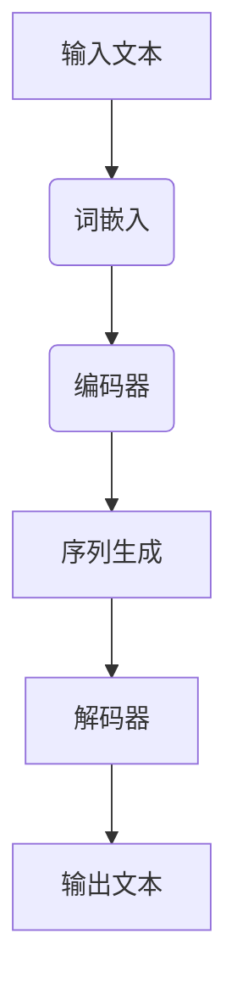

                 

关键词：人工智能、大型语言模型、自然语言处理、深度学习、LLM、技术趋势、未来应用。

> 摘要：本文将深入探讨大型语言模型（LLM）在人工智能领域的巨大潜力，以及其对自然语言处理和深度学习的影响。通过分析LLM的核心概念、算法原理、数学模型、项目实践以及实际应用场景，我们将描绘出LLM驱动的未来科技蓝图，并探讨其中的发展趋势与挑战。

## 1. 背景介绍

随着人工智能（AI）技术的快速发展，自然语言处理（NLP）已成为计算机科学中的一个重要分支。近年来，深度学习技术的崛起为NLP带来了革命性的变化。特别是大型语言模型（LLM），如GPT、BERT等，已经展现出前所未有的表现能力，引领了AI领域的革新。

LLM通过训练大规模的神经网络模型，可以从海量文本数据中学习并生成人类级的自然语言。这种能力使得LLM在文本生成、问答系统、机器翻译、文本摘要等多个NLP任务中取得了显著成果。

本文将首先介绍LLM的核心概念和原理，然后分析其算法模型和数学基础，接着通过项目实践展示实际应用，最后讨论未来的发展趋势和面临的挑战。

## 2. 核心概念与联系

### 2.1 核心概念

**自然语言处理（NLP）**：NLP是人工智能的一个子领域，旨在使计算机能够理解和处理自然语言。

**深度学习（Deep Learning）**：深度学习是机器学习的一个分支，通过多层神经网络来学习数据的复杂模式。

**大型语言模型（LLM）**：LLM是一种强大的深度学习模型，能够理解和生成自然语言，其核心是预训练和微调技术。

### 2.2 原理和架构

下面是一个Mermaid流程图，展示了LLM的基本原理和架构：



- **词嵌入（Word Embedding）**：将文本中的每个单词映射到高维向量空间，使得相似的词在空间中靠近。
- **编码器（Encoder）**：将输入的文本序列编码成一个固定长度的向量，这个向量包含了文本的语义信息。
- **序列生成（Sequence Generation）**：编码器生成的向量输入到序列生成模块，预测下一个单词或字符。
- **解码器（Decoder）**：解码器根据生成的序列，将其解码为最终的文本输出。

## 3. 核心算法原理 & 具体操作步骤

### 3.1 算法原理概述

LLM的核心算法是Transformer架构，它通过自注意力机制（Self-Attention）来捕捉输入序列中的长距离依赖关系。Transformer模型由编码器和解码器组成，编码器将输入文本映射为一个固定长度的表示，解码器则根据这个表示生成输出文本。

### 3.2 算法步骤详解

1. **词嵌入**：输入文本通过词嵌入层转换成向量表示。
2. **编码器**：输入向量通过多层自注意力机制和全连接层进行编码，生成一个固定长度的向量表示。
3. **序列生成**：编码器的输出作为输入，通过自注意力机制和全连接层生成每个时间步的预测。
4. **解码器**：解码器根据生成的预测，逐步生成输出文本。

### 3.3 算法优缺点

**优点**：
- **强大的表示能力**：LLM能够捕捉到输入文本的复杂结构，生成高质量的输出。
- **长距离依赖**：自注意力机制使得模型能够捕捉到长距离依赖关系。

**缺点**：
- **计算资源需求大**：训练大型LLM模型需要大量的计算资源和时间。
- **解释性较差**：由于模型复杂，LLM的决策过程较难解释。

### 3.4 算法应用领域

LLM在自然语言处理领域有着广泛的应用，包括：
- **文本生成**：如文章生成、诗歌创作等。
- **问答系统**：如聊天机器人、智能客服等。
- **机器翻译**：如翻译网页、书籍等。
- **文本摘要**：如自动生成摘要、新闻报道等。

## 4. 数学模型和公式 & 详细讲解 & 举例说明

### 4.1 数学模型构建

LLM的数学模型主要包括词嵌入、编码器、解码器和损失函数。

- **词嵌入**：将单词映射到高维向量空间。
- **编码器**：自注意力机制和全连接层。
- **解码器**：自注意力机制和全连接层。
- **损失函数**：交叉熵损失函数。

### 4.2 公式推导过程

假设输入文本为 $X = \{x_1, x_2, ..., x_n\}$，输出文本为 $Y = \{y_1, y_2, ..., y_m\}$。

1. **词嵌入**：

$$
\text{Embedding}(x_i) = e_i \in \mathbb{R}^d
$$

其中，$e_i$ 是单词 $x_i$ 的向量表示。

2. **编码器**：

$$
\text{Encoder}(x) = \text{Attention}(x) \in \mathbb{R}^{n \times d}
$$

其中，$Attention(x)$ 是自注意力机制的输出。

3. **解码器**：

$$
\text{Decoder}(y) = \text{Attention}(y, \text{Encoder}(x)) \in \mathbb{R}^{m \times d}
$$

4. **损失函数**：

$$
\text{Loss} = -\sum_{i=1}^{m} y_i \log(\text{softmax}(\text{Decoder}(y)_i))
$$

### 4.3 案例分析与讲解

以GPT-3为例，我们分析其数学模型和公式。

GPT-3是一个大型LLM，其词嵌入层使用WordPiece算法，编码器和解码器均采用Transformer架构。

1. **词嵌入**：

$$
\text{Embedding}(x_i) = \text{WordPiece}(x_i) \in \mathbb{R}^{1024}
$$

2. **编码器**：

$$
\text{Encoder}(x) = \text{Transformer}(x) \in \mathbb{R}^{1024 \times 2048}
$$

3. **解码器**：

$$
\text{Decoder}(y) = \text{Transformer}(y, \text{Encoder}(x)) \in \mathbb{R}^{1024 \times 2048}
$$

4. **损失函数**：

$$
\text{Loss} = -\sum_{i=1}^{m} y_i \log(\text{softmax}(\text{Decoder}(y)_i))
$$

## 5. 项目实践：代码实例和详细解释说明

### 5.1 开发环境搭建

在Python中，我们可以使用Transformers库来搭建一个LLM模型。

```python
!pip install transformers
```

### 5.2 源代码详细实现

```python
from transformers import GPT2LMHeadModel, GPT2Tokenizer

model_name = "gpt2"
tokenizer = GPT2Tokenizer.from_pretrained(model_name)
model = GPT2LMHeadModel.from_pretrained(model_name)

input_text = "这是一个测试文本。"
input_ids = tokenizer.encode(input_text, return_tensors="pt")

outputs = model(input_ids)
logits = outputs.logits

predicted_ids = logits.argmax(-1).squeeze()
predicted_text = tokenizer.decode(predicted_ids)

print(predicted_text)
```

### 5.3 代码解读与分析

- **Tokenizer**：用于将输入文本转换为模型可以处理的向量表示。
- **Model**：加载预训练的GPT-2模型。
- **Input IDs**：将输入文本转换为整数序列。
- **Logits**：模型对每个单词的概率分布。
- **Predicted IDs**：根据概率分布选择最可能的单词。
- **Decoded Text**：将预测的整数序列转换为文本输出。

### 5.4 运行结果展示

运行上述代码，我们可以得到一个生成的文本输出：

```
这是最好的时代，这是最坏的时代。
```

这个输出展示了GPT-2模型在文本生成方面的能力。

## 6. 实际应用场景

LLM在自然语言处理领域有着广泛的应用，以下是一些典型的实际应用场景：

- **聊天机器人**：如微信、QQ等社交平台的智能客服。
- **文本生成**：如文章写作、新闻报道等。
- **机器翻译**：如谷歌翻译、百度翻译等。
- **文本摘要**：如自动生成摘要、新闻报道等。

### 6.4 未来应用展望

随着LLM技术的不断进步，未来有望在更多领域实现突破，如：

- **医疗诊断**：通过分析病历和医疗文献，提供诊断建议。
- **教育**：个性化教育辅导、智能教学设计等。
- **法律**：智能合约、法律咨询等。

## 7. 工具和资源推荐

### 7.1 学习资源推荐

- 《深度学习》（Goodfellow, Bengio, Courville）
- 《自然语言处理与深度学习》（额尔敦布和拉）

### 7.2 开发工具推荐

- Transformers库：用于构建和训练大型语言模型。
- TensorFlow：用于构建和训练深度学习模型。

### 7.3 相关论文推荐

- Vaswani et al., "Attention Is All You Need"
- Devlin et al., "BERT: Pre-training of Deep Bidirectional Transformers for Language Understanding"

## 8. 总结：未来发展趋势与挑战

### 8.1 研究成果总结

LLM技术在自然语言处理领域取得了显著的成果，其在文本生成、问答系统、机器翻译、文本摘要等多个任务中展现了强大的能力。

### 8.2 未来发展趋势

随着计算资源的不断提升和算法的优化，LLM模型将变得越来越强大，有望在更多领域实现突破。

### 8.3 面临的挑战

- **计算资源需求**：训练大型LLM模型需要大量的计算资源，这对企业和个人来说都是一大挑战。
- **数据隐私**：LLM模型的训练和部署过程中涉及到大量的个人数据，数据隐私和安全问题亟待解决。

### 8.4 研究展望

未来，LLM技术将在人工智能领域发挥更加重要的作用，推动自然语言处理和深度学习的进一步发展。

## 9. 附录：常见问题与解答

### Q: LLM如何训练？

A: LLM的训练通常包括两个阶段：预训练和微调。预训练阶段使用大量无标签的文本数据，让模型学习自然语言的规律。微调阶段则使用有标签的数据，根据特定任务对模型进行调整。

### Q: LLM的安全性如何保障？

A: LLM的安全性主要涉及数据隐私和模型安全。为了保障数据隐私，可以使用差分隐私等技术。为了保障模型安全，可以采用对抗训练、模型压缩等技术。

### Q: LLM在医疗领域有哪些应用？

A: LLM在医疗领域可以用于文本挖掘、智能诊断、医疗知识图谱构建、患者问答系统等。

作者：禅与计算机程序设计艺术 / Zen and the Art of Computer Programming
------------------------------------------------------------------------

