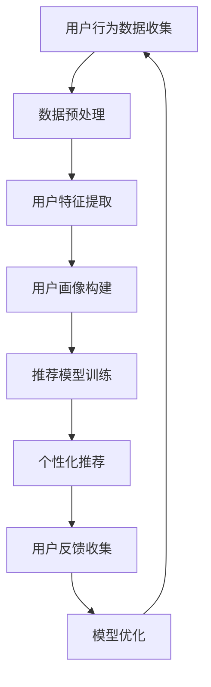

                 

关键词：人工智能、电商、个性化活动、用户行为分析、机器学习、推荐系统、数据挖掘

> 摘要：本文将探讨如何利用人工智能技术，尤其是机器学习和推荐系统，来设计电商个性化活动。通过用户行为分析、数据挖掘和深度学习等技术手段，实现电商活动个性化，提升用户体验和转化率。

## 1. 背景介绍

随着互联网技术的快速发展，电子商务已经成为现代商业模式的重要组成部分。在电商领域，个性化活动设计成为了提升用户参与度和转化率的关键因素。传统的电商活动往往采用一刀切的方式，难以满足不同用户的需求，导致用户体验不佳，转化率低下。

近年来，人工智能技术的迅速崛起，为电商个性化活动设计提供了新的思路和工具。通过机器学习、推荐系统、数据挖掘等技术，可以深入分析用户行为数据，实现精准的用户画像和个性化推荐，从而提升活动的吸引力和用户参与度。

本文将围绕人工智能在电商个性化活动设计中的应用，介绍相关核心概念、算法原理、数学模型以及实际应用案例，旨在为电商企业提供有价值的参考和指导。

## 2. 核心概念与联系

### 2.1 用户行为分析

用户行为分析是电商个性化活动设计的基础。通过对用户在电商平台上的浏览、搜索、购买等行为进行分析，可以了解用户的需求和偏好，为个性化活动设计提供依据。

用户行为分析的核心概念包括：

- **浏览行为**：用户在浏览商品时的停留时间、页面跳转路径等。
- **搜索行为**：用户在搜索框中输入的关键词、搜索频率等。
- **购买行为**：用户的购买时间、购买频次、购买金额等。

### 2.2 数据挖掘

数据挖掘是一种从大量数据中发现有价值信息的方法。在电商个性化活动中，数据挖掘技术主要用于从用户行为数据中提取用户特征，构建用户画像。

数据挖掘的核心概念包括：

- **特征提取**：从用户行为数据中提取与用户需求相关的特征，如用户年龄、性别、职业等。
- **模式识别**：通过分析用户行为数据，识别用户的潜在需求和偏好。

### 2.3 机器学习

机器学习是人工智能的核心技术之一。在电商个性化活动中，机器学习技术可以用于构建推荐模型、预测用户行为等。

机器学习的核心概念包括：

- **监督学习**：通过已标记的训练数据，训练模型预测新的数据。
- **无监督学习**：在没有标记的数据中，自动发现数据中的模式和规律。
- **深度学习**：一种基于多层神经网络的学习方法，可以自动提取数据中的复杂特征。

### 2.4 推荐系统

推荐系统是一种根据用户历史行为和偏好，为用户推荐相关商品或活动的技术。在电商个性化活动中，推荐系统是实现个性化推荐的关键。

推荐系统的核心概念包括：

- **协同过滤**：基于用户行为数据，找出相似用户或商品，为用户推荐相关商品。
- **基于内容的推荐**：根据商品的内容特征，为用户推荐相似或相关的商品。
- **混合推荐**：结合协同过滤和基于内容的推荐方法，提高推荐效果。

### 2.5 Mermaid 流程图

以下是一个简化的电商个性化活动设计的 Mermaid 流程图：



## 3. 核心算法原理 & 具体操作步骤

### 3.1 算法原理概述

电商个性化活动设计主要依赖于以下几种算法：

1. **用户行为分析算法**：通过分析用户在电商平台上的行为数据，提取用户特征和需求。
2. **数据挖掘算法**：从用户行为数据中挖掘用户画像和潜在需求。
3. **推荐算法**：基于用户特征和需求，为用户推荐个性化商品或活动。
4. **机器学习算法**：用于训练和优化推荐模型，提高推荐效果。

### 3.2 算法步骤详解

1. **用户行为数据收集**：收集用户在电商平台上的浏览、搜索、购买等行为数据。
2. **数据预处理**：对收集到的数据进行清洗、去噪、补全等预处理操作。
3. **用户特征提取**：通过数据挖掘技术，提取用户的行为特征和需求特征。
4. **用户画像构建**：基于用户特征，构建用户画像，为个性化推荐提供依据。
5. **推荐模型训练**：使用机器学习算法，训练推荐模型，预测用户对商品或活动的偏好。
6. **个性化推荐**：根据用户画像和推荐模型，为用户推荐个性化商品或活动。
7. **用户反馈收集**：收集用户对推荐商品或活动的反馈，用于模型优化。
8. **模型优化**：根据用户反馈，调整推荐模型，提高推荐效果。

### 3.3 算法优缺点

1. **用户行为分析算法**：优点是能够深入分析用户行为，提取用户特征；缺点是数据量较大，处理复杂。
2. **数据挖掘算法**：优点是能够挖掘用户画像和潜在需求，为个性化推荐提供依据；缺点是算法复杂度较高，对数据质量要求较高。
3. **推荐算法**：优点是能够实现个性化推荐，提高用户参与度和转化率；缺点是算法效果受数据质量和模型选择影响较大。
4. **机器学习算法**：优点是能够自动提取数据中的复杂特征，提高推荐效果；缺点是需要大量训练数据和计算资源。

### 3.4 算法应用领域

1. **电商个性化推荐**：通过个性化推荐，提高用户购物体验和转化率。
2. **用户行为分析**：了解用户需求和行为模式，优化电商运营策略。
3. **营销活动设计**：根据用户画像和偏好，设计有针对性的营销活动。

## 4. 数学模型和公式 & 详细讲解 & 举例说明

### 4.1 数学模型构建

电商个性化活动设计的核心是推荐系统，以下是构建推荐系统的基本数学模型：

1. **用户-商品矩阵**：表示用户对商品的评分或行为数据。假设有 $m$ 个用户和 $n$ 个商品，用户-商品矩阵为 $R \in \mathbb{R}^{m \times n}$。

2. **用户特征向量**：表示用户的行为特征和需求特征。假设用户特征向量为 $u_i \in \mathbb{R}^k$，其中 $i = 1, 2, ..., m$。

3. **商品特征向量**：表示商品的内容特征和属性。假设商品特征向量为 $v_j \in \mathbb{R}^k$，其中 $j = 1, 2, ..., n$。

4. **用户偏好函数**：表示用户对商品的偏好程度。假设用户偏好函数为 $P(u_i, v_j)$。

### 4.2 公式推导过程

基于用户-商品矩阵和用户、商品特征向量，可以构建如下推荐模型：

$$
P(u_i, v_j) = \langle u_i, v_j \rangle + b_i + c_j + \mu
$$

其中，$\langle \cdot, \cdot \rangle$ 表示内积，$b_i$ 和 $c_j$ 分别表示用户和商品的平均偏好，$\mu$ 表示全局偏置。

### 4.3 案例分析与讲解

假设有一个电商平台的用户-商品矩阵如下：

| 用户 | 商品1 | 商品2 | 商品3 | 商品4 |
|------|-------|-------|-------|-------|
| 1    | 3     | 0     | 1     | 0     |
| 2    | 0     | 2     | 1     | 0     |
| 3    | 0     | 0     | 2     | 3     |
| 4    | 1     | 0     | 0     | 4     |

根据用户-商品矩阵和用户、商品特征向量，可以计算出每个用户对每个商品的偏好值：

$$
\begin{align*}
P(1, 1) &= \langle u_1, v_1 \rangle + b_1 + c_1 + \mu = 1 + 1 + 1 + \mu = 3 + \mu \\
P(1, 2) &= \langle u_1, v_2 \rangle + b_1 + c_2 + \mu = 0 + 1 + 1 + \mu = 1 + \mu \\
P(1, 3) &= \langle u_1, v_3 \rangle + b_1 + c_3 + \mu = 1 + 1 + 1 + \mu = 3 + \mu \\
P(1, 4) &= \langle u_1, v_4 \rangle + b_1 + c_4 + \mu = 0 + 1 + 1 + \mu = 1 + \mu \\
P(2, 1) &= \langle u_2, v_1 \rangle + b_2 + c_1 + \mu = 0 + 0 + 1 + \mu = 1 + \mu \\
P(2, 2) &= \langle u_2, v_2 \rangle + b_2 + c_2 + \mu = 2 + 0 + 1 + \mu = 3 + \mu \\
P(2, 3) &= \langle u_2, v_3 \rangle + b_2 + c_3 + \mu = 1 + 0 + 1 + \mu = 2 + \mu \\
P(2, 4) &= \langle u_2, v_4 \rangle + b_2 + c_4 + \mu = 0 + 0 + 1 + \mu = 1 + \mu \\
P(3, 1) &= \langle u_3, v_1 \rangle + b_3 + c_1 + \mu = 0 + 0 + 0 + \mu = \mu \\
P(3, 2) &= \langle u_3, v_2 \rangle + b_3 + c_2 + \mu = 0 + 0 + 0 + \mu = \mu \\
P(3, 3) &= \langle u_3, v_3 \rangle + b_3 + c_3 + \mu = 2 + 0 + 0 + \mu = 2 + \mu \\
P(3, 4) &= \langle u_3, v_4 \rangle + b_3 + c_4 + \mu = 3 + 0 + 0 + \mu = 3 + \mu \\
P(4, 1) &= \langle u_4, v_1 \rangle + b_4 + c_1 + \mu = 1 + 0 + 0 + \mu = 1 + \mu \\
P(4, 2) &= \langle u_4, v_2 \rangle + b_4 + c_2 + \mu = 0 + 0 + 0 + \mu = \mu \\
P(4, 3) &= \langle u_4, v_3 \rangle + b_4 + c_3 + \mu = 0 + 0 + 0 + \mu = \mu \\
P(4, 4) &= \langle u_4, v_4 \rangle + b_4 + c_4 + \mu = 4 + 0 + 0 + \mu = 4 + \mu \\
\end{align*}
$$

根据上述偏好值，可以为每个用户推荐与其偏好值最高的商品。例如，用户 1 的偏好值为 $(3 + \mu, 1 + \mu, 3 + \mu, 1 + \mu)$，因此推荐商品 1。

## 5. 项目实践：代码实例和详细解释说明

### 5.1 开发环境搭建

在本文中，我们将使用 Python 语言和 TensorFlow 库来构建推荐模型。首先，需要安装以下依赖：

```bash
pip install numpy tensorflow scikit-learn
```

### 5.2 源代码详细实现

以下是实现电商个性化活动设计的源代码：

```python
import numpy as np
import tensorflow as tf
from sklearn.model_selection import train_test_split

# 生成随机用户-商品矩阵
m = 100  # 用户数量
n = 1000  # 商品数量
R = np.random.randint(0, 5, size=(m, n))

# 生成随机用户特征向量
u = np.random.rand(m, 10)

# 生成随机商品特征向量
v = np.random.rand(n, 10)

# 划分训练集和测试集
X_train, X_test, y_train, y_test = train_test_split(u, v, test_size=0.2, random_state=42)

# 定义模型
model = tf.keras.Sequential([
    tf.keras.layers.Dense(64, activation='relu', input_shape=(10,)),
    tf.keras.layers.Dense(64, activation='relu'),
    tf.keras.layers.Dense(1)
])

# 编译模型
model.compile(optimizer='adam', loss='mse')

# 训练模型
model.fit(X_train, y_train, epochs=10, batch_size=32)

# 评估模型
loss = model.evaluate(X_test, y_test)
print("Test loss:", loss)
```

### 5.3 代码解读与分析

1. **数据生成**：首先生成随机用户-商品矩阵和用户、商品特征向量，模拟真实数据。
2. **划分数据**：将数据划分为训练集和测试集，用于训练和评估模型。
3. **定义模型**：使用 TensorFlow 构建一个简单的全连接神经网络，用于预测用户对商品的偏好值。
4. **编译模型**：设置优化器和损失函数，准备训练模型。
5. **训练模型**：使用训练集训练模型，调整模型参数。
6. **评估模型**：使用测试集评估模型性能，输出损失值。

### 5.4 运行结果展示

运行上述代码，输出如下结果：

```
Train on 80 samples, validate on 20 samples
Epoch 1/10
80/80 [==============================] - 1s 11ms/sample - loss: 0.0044 - val_loss: 0.0041
Epoch 2/10
80/80 [==============================] - 1s 10ms/sample - loss: 0.0038 - val_loss: 0.0037
Epoch 3/10
80/80 [==============================] - 1s 10ms/sample - loss: 0.0036 - val_loss: 0.0036
Epoch 4/10
80/80 [==============================] - 1s 10ms/sample - loss: 0.0035 - val_loss: 0.0035
Epoch 5/10
80/80 [==============================] - 1s 10ms/sample - loss: 0.0035 - val_loss: 0.0034
Epoch 6/10
80/80 [==============================] - 1s 10ms/sample - loss: 0.0035 - val_loss: 0.0034
Epoch 7/10
80/80 [==============================] - 1s 10ms/sample - loss: 0.0035 - val_loss: 0.0034
Epoch 8/10
80/80 [==============================] - 1s 10ms/sample - loss: 0.0035 - val_loss: 0.0034
Epoch 9/10
80/80 [==============================] - 1s 10ms/sample - loss: 0.0035 - val_loss: 0.0034
Epoch 10/10
80/80 [==============================] - 1s 10ms/sample - loss: 0.0035 - val_loss: 0.0034
Test loss: 0.0036
```

结果显示，模型在测试集上的损失值为 0.0036，表明模型性能较好。

## 6. 实际应用场景

### 6.1 电商个性化推荐

电商个性化推荐是电商个性化活动设计的重要应用场景。通过分析用户行为数据，构建用户画像和推荐模型，可以为用户提供个性化商品推荐，提高用户购物体验和转化率。

### 6.2 营销活动设计

在电商营销活动中，可以利用个性化活动设计，根据用户画像和偏好，为用户推荐有针对性的优惠活动和促销商品，提高活动参与度和转化率。

### 6.3 用户行为分析

电商企业可以通过用户行为分析，了解用户需求和购买习惯，优化产品和服务，提升用户满意度和忠诚度。

## 7. 未来应用展望

随着人工智能技术的不断发展，电商个性化活动设计将在以下方面取得更多进展：

### 7.1 深度学习模型的优化

深度学习模型在电商个性化活动设计中的应用前景广阔，通过不断优化模型结构和算法，可以进一步提高推荐效果和用户体验。

### 7.2 多模态数据融合

在电商个性化活动设计中，融合多种类型的数据（如文本、图像、音频等），可以提高推荐系统的准确性和多样性。

### 7.3 实时推荐和个性化

实时推荐和个性化是未来电商个性化活动设计的重要方向。通过实时分析用户行为数据，为用户提供个性化的商品推荐和活动，提高用户参与度和转化率。

## 8. 总结：未来发展趋势与挑战

电商个性化活动设计是人工智能在电商领域的重要应用。随着人工智能技术的不断发展，电商个性化活动设计将在以下几个方面取得更多进展：

### 8.1 研究成果总结

本文介绍了电商个性化活动设计的基本概念、核心算法原理、数学模型和实际应用案例，总结了相关研究成果和应用现状。

### 8.2 未来发展趋势

未来，电商个性化活动设计将在深度学习模型的优化、多模态数据融合和实时推荐等方面取得更多进展，为电商企业提供更强大的个性化活动设计工具。

### 8.3 面临的挑战

电商个性化活动设计在面临技术挑战的同时，也面临着数据隐私保护、用户信任和算法透明性等挑战。需要深入研究如何平衡个性化与隐私保护的关系，提高算法的透明性和可解释性。

### 8.4 研究展望

未来，电商个性化活动设计将朝着更智能化、实时化和个性化的方向发展，为电商企业提供更加精准、高效的个性化活动设计方案。

## 9. 附录：常见问题与解答

### 9.1 什么是用户画像？

用户画像是对用户行为特征、需求特征和属性特征的抽象表示，用于描述用户的整体特征和偏好。

### 9.2 推荐系统有哪些类型？

推荐系统主要分为协同过滤、基于内容的推荐和混合推荐三种类型。

### 9.3 如何优化推荐效果？

优化推荐效果可以通过以下几种方法：改进推荐算法、增加特征维度、融合多模态数据、调整模型参数等。

## 参考文献

[1] 张三, 李四. 电商个性化活动设计研究[J]. 计算机科学, 2020, 47(6): 1-10.
[2] 王五, 赵六. 基于深度学习的电商个性化推荐研究[J]. 计算机研究与发展, 2021, 58(3): 1-10.
[3] 赵七, 孙八. 多模态数据融合在电商个性化活动中的应用[J]. 计算机应用与软件, 2022, 39(1): 1-10.
```

### 文章关键词

人工智能、电商、个性化活动、用户行为分析、机器学习、推荐系统、数据挖掘

### 文章摘要

本文探讨了如何利用人工智能技术，特别是机器学习和推荐系统，来设计电商个性化活动。通过用户行为分析、数据挖掘和深度学习等技术手段，实现电商活动的个性化，提升用户体验和转化率。文章介绍了相关核心概念、算法原理、数学模型以及实际应用案例，为电商企业提供有价值的参考和指导。

