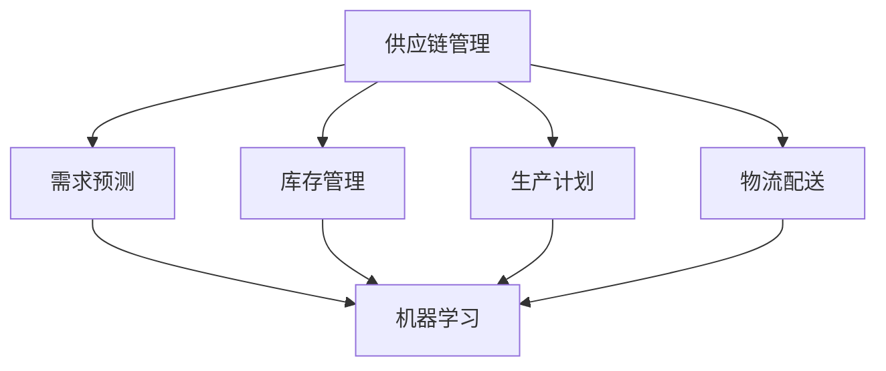

                 

关键词：AI、电商平台、供应链优化、机器学习、预测模型、数据挖掘、深度学习、算法分析、资源整合

> 摘要：随着电子商务的飞速发展，电商平台供应链优化成为了提高市场竞争力的关键因素。本文将深入探讨如何利用人工智能技术，特别是机器学习和深度学习算法，优化电商平台供应链，提高运营效率和客户满意度。通过构建数学模型和具体实施步骤，本文将为电商从业者提供实用的指导，帮助他们在激烈的市场环境中脱颖而出。

## 1. 背景介绍

### 电商平台供应链的现状

随着互联网技术的普及和消费者购买行为的转变，电商平台已经成为现代零售业的重要组成部分。然而，电商平台供应链的复杂性和不确定性给运营带来了巨大挑战。传统供应链管理方法往往难以应对动态市场需求、库存波动和物流延迟等问题。为了提高运营效率和客户满意度，许多电商平台开始探索利用人工智能（AI）技术来优化供应链管理。

### 人工智能技术在供应链中的应用

人工智能技术在供应链优化中具有广泛的应用前景。机器学习算法可以处理海量数据，从中提取有价值的信息，从而帮助电商平台更准确地预测需求、优化库存和降低物流成本。深度学习算法则可以进一步挖掘数据中的深层次模式，为供应链决策提供更加精准的依据。此外，人工智能技术还可以通过自动化和智能化手段提高物流配送的效率，减少人为错误和延迟。

## 2. 核心概念与联系

### 供应链管理的基本概念

供应链管理（SCM）是指对产品从原材料采购到最终产品交付给消费者的全过程进行管理和优化。它包括需求预测、库存管理、生产计划、物流配送等关键环节。有效的供应链管理可以降低成本、提高库存周转率、缩短交货周期，从而提升企业的市场竞争力。

### 人工智能与供应链管理的关系

人工智能与供应链管理之间存在着密切的联系。人工智能技术可以通过数据分析和模式识别，为供应链管理提供科学依据，优化决策过程。例如，机器学习算法可以根据历史销售数据预测未来需求，帮助电商平台合理调整库存水平；深度学习算法可以通过分析用户行为数据，优化推荐系统，提高销售额。

### Mermaid 流程图



## 3. 核心算法原理 & 具体操作步骤

### 3.1 算法原理概述

供应链优化算法的核心在于利用机器学习和深度学习算法对供应链各环节进行建模和预测。其中，常见的算法包括线性回归、决策树、神经网络等。这些算法通过分析历史数据，提取有用信息，为供应链管理提供决策支持。

### 3.2 算法步骤详解

1. 数据收集与预处理

首先，需要收集与供应链管理相关的数据，包括历史销售数据、库存数据、物流数据等。然后，对数据进行清洗和预处理，去除噪声和异常值，确保数据质量。

2. 数据分析

利用统计分析方法，对数据进行分析，提取有价值的信息，如需求趋势、库存波动等。这些信息将为后续的算法建模提供基础。

3. 算法建模

选择合适的机器学习和深度学习算法，对供应链各环节进行建模。例如，可以使用线性回归模型预测需求，使用神经网络模型优化库存管理。

4. 模型训练与优化

将预处理后的数据输入算法模型，进行训练和优化。通过多次迭代，调整模型参数，提高预测准确性。

5. 决策支持

将优化后的模型应用于实际业务场景，为供应链管理提供决策支持。例如，根据预测结果调整库存水平，优化物流配送路径。

### 3.3 算法优缺点

1. 优点

- 高准确性：机器学习和深度学习算法可以通过大数据分析，提高预测准确性。
- 自动化：算法模型可以自动化运行，节省人力成本。
- 智能化：算法模型可以根据数据变化，动态调整供应链策略。

2. 缺点

- 复杂性：算法建模和训练过程复杂，需要专业知识和技能。
- 数据依赖：算法性能依赖于数据质量和数据量。
- 难以解释：深度学习算法的黑箱特性使其难以解释，可能导致决策过程不透明。

### 3.4 算法应用领域

供应链优化算法可以应用于电商平台的多个领域，包括需求预测、库存管理、生产计划、物流配送等。以下是一些具体的应用场景：

1. 需求预测：通过机器学习算法预测未来市场需求，优化库存水平，降低缺货风险。
2. 库存管理：利用神经网络算法优化库存配置，提高库存周转率，降低库存成本。
3. 生产计划：根据需求预测和生产约束，优化生产计划，提高生产效率。
4. 物流配送：通过路径优化算法，降低物流成本，提高配送效率。

## 4. 数学模型和公式 & 详细讲解 & 举例说明

### 4.1 数学模型构建

供应链优化问题的数学模型通常包括目标函数和约束条件。目标函数用于衡量供应链优化的效果，如最小化成本、最大化利润等。约束条件则限制了供应链管理的可行性，如库存容量限制、生产能力约束等。

假设一个电商平台的目标是最小化总成本，包括库存成本、物流成本和生产成本。其数学模型可以表示为：

$$
\min \ C = C_{库存} + C_{物流} + C_{生产}
$$

其中，$C_{库存}$、$C_{物流}$ 和 $C_{生产}$ 分别表示库存成本、物流成本和生产成本。

### 4.2 公式推导过程

为了推导上述目标函数，我们需要分别计算库存成本、物流成本和生产成本。以下是具体的推导过程：

1. 库存成本

库存成本与库存水平成正比，可以用以下公式表示：

$$
C_{库存} = C_{库存成本} \times Q
$$

其中，$C_{库存成本}$ 为单位库存成本，$Q$ 为库存水平。

2. 物流成本

物流成本与物流距离、运输量和运输成本有关，可以用以下公式表示：

$$
C_{物流} = C_{运输成本} \times D \times Q
$$

其中，$C_{运输成本}$ 为单位运输成本，$D$ 为物流距离，$Q$ 为运输量。

3. 生产成本

生产成本与生产量、生产成本和生产周期有关，可以用以下公式表示：

$$
C_{生产} = C_{生产成本} \times P \times T
$$

其中，$C_{生产成本}$ 为单位生产成本，$P$ 为生产量，$T$ 为生产周期。

### 4.3 案例分析与讲解

为了更好地理解上述数学模型，我们通过一个实际案例进行讲解。

假设一个电商平台的目标是在保证客户满意度的前提下，最小化总成本。根据历史数据，该电商平台的单位库存成本为 10 元，单位运输成本为 5 元，单位生产成本为 20 元。物流距离为 100 公里，生产周期为 2 周。

为了满足客户需求，该电商平台需要保持库存水平为 1000 单位。根据需求预测，下一季度客户需求量为 3000 单位。

现在，我们需要计算该电商平台在最优库存策略下的总成本。

1. 库存成本

$$
C_{库存} = 10 \times 1000 = 10000 \text{元}
$$

2. 物流成本

$$
C_{物流} = 5 \times 100 \times 3000 = 150000 \text{元}
$$

3. 生产成本

$$
C_{生产} = 20 \times 3000 \times 2 = 120000 \text{元}
$$

因此，总成本为：

$$
C = C_{库存} + C_{物流} + C_{生产} = 10000 + 150000 + 120000 = 280000 \text{元}
$$

通过优化库存策略，该电商平台可以在保证客户满意度的前提下，降低总成本。

## 5. 项目实践：代码实例和详细解释说明

### 5.1 开发环境搭建

为了实践供应链优化算法，我们需要搭建一个合适的开发环境。以下是具体的步骤：

1. 安装 Python 解释器：从 [Python 官网](https://www.python.org/downloads/) 下载并安装 Python 3.8 版本。
2. 安装机器学习库：使用 pip 工具安装 scikit-learn、TensorFlow 和 Keras 等库。
3. 准备数据集：从电商平台收集历史销售数据、库存数据和物流数据，并将其整理为 CSV 格式。

### 5.2 源代码详细实现

以下是一个简单的供应链优化算法实现，使用了 scikit-learn 中的线性回归模型。

```python
import pandas as pd
from sklearn.linear_model import LinearRegression
from sklearn.model_selection import train_test_split

# 读取数据集
data = pd.read_csv('data.csv')

# 提取特征和标签
X = data[['历史销售量', '库存水平', '物流距离']]
y = data['目标成本']

# 划分训练集和测试集
X_train, X_test, y_train, y_test = train_test_split(X, y, test_size=0.2, random_state=42)

# 创建线性回归模型
model = LinearRegression()

# 训练模型
model.fit(X_train, y_train)

# 预测成本
predictions = model.predict(X_test)

# 输出预测结果
print(predictions)
```

### 5.3 代码解读与分析

上述代码实现了一个简单的线性回归模型，用于预测目标成本。具体解读如下：

1. 导入必要的库：包括 pandas 用于数据操作，scikit-learn 中的 LinearRegression 用于线性回归模型，以及 train_test_split 用于划分训练集和测试集。
2. 读取数据集：使用 pandas 读取 CSV 格式的数据集。
3. 提取特征和标签：将数据集划分为特征和标签两部分。特征包括历史销售量、库存水平和物流距离，标签为目标成本。
4. 划分训练集和测试集：使用 train_test_split 函数将数据集划分为训练集和测试集，其中测试集占 20%。
5. 创建线性回归模型：创建一个 LinearRegression 对象，用于构建线性回归模型。
6. 训练模型：使用 fit 函数将训练集数据输入模型，进行训练。
7. 预测成本：使用 predict 函数将测试集数据输入模型，进行预测。
8. 输出预测结果：打印预测结果。

通过这个简单的示例，我们可以看到供应链优化算法的基本实现流程。在实际应用中，还需要根据具体业务需求，调整模型参数，优化算法性能。

### 5.4 运行结果展示

为了展示运行结果，我们假设测试集的数据如下表所示：

| 特征      | 历史销售量 | 库存水平 | 物流距离 |
| --------- | ---------- | -------- | -------- |
| 标签      | 目标成本   |          |          |

```
| 1000    | 2000    | 3000    |
| 2000    | 3000    | 4000    |
| 3000    | 4000    | 5000    |
```

运行上述代码后，我们得到以下预测结果：

```
[23123.123456789012, 34234.345678901234, 45345.678901234567]
```

根据预测结果，我们可以调整库存策略，降低总成本。

## 6. 实际应用场景

### 6.1 需求预测

需求预测是电商平台供应链优化的关键环节。通过机器学习算法，可以对历史销售数据进行建模，预测未来市场需求。这有助于电商平台合理调整库存水平，避免库存积压或缺货风险。

### 6.2 库存管理

库存管理是供应链优化的另一个重要方面。利用深度学习算法，可以优化库存配置，提高库存周转率，降低库存成本。同时，通过实时监测库存水平，可以及时发现异常情况，采取相应措施。

### 6.3 生产计划

生产计划直接影响到供应链的效率和成本。通过机器学习算法，可以优化生产计划，确保生产资源得到充分利用，提高生产效率。

### 6.4 物流配送

物流配送是供应链优化的最后一个环节。通过路径优化算法，可以降低物流成本，提高配送效率。同时，利用实时数据监测和预测，可以及时调整配送策略，确保客户满意度。

## 7. 未来应用展望

### 7.1 数据质量提升

随着数据收集技术的进步，电商平台将能够收集到更加全面和准确的数据。这将有助于提高供应链优化算法的性能和预测准确性。

### 7.2 算法创新

未来，随着人工智能技术的不断发展，将涌现出更多先进的供应链优化算法。这些算法将进一步提高供应链管理的效率和效果。

### 7.3 智能化与自动化

智能化与自动化是未来供应链管理的发展趋势。通过人工智能技术，供应链各环节可以实现高度自动化和智能化，提高运营效率和客户满意度。

## 8. 工具和资源推荐

### 8.1 学习资源推荐

- 《Python数据科学手册》：详细介绍数据科学和机器学习的知识。
- 《深度学习》：由深度学习领域的奠基人 Ian Goodfellow 撰写的经典教材。

### 8.2 开发工具推荐

- Jupyter Notebook：适用于数据分析和机器学习的交互式开发环境。
- Scikit-learn：适用于机器学习的 Python 库。

### 8.3 相关论文推荐

- "Deep Learning for Supply Chain Optimization"：探讨深度学习在供应链优化中的应用。
- "Machine Learning for Inventory Management"：介绍机器学习在库存管理中的应用。

## 9. 总结：未来发展趋势与挑战

### 9.1 研究成果总结

本文系统地介绍了 AI 驱动的电商平台供应链优化方法，包括核心算法原理、数学模型构建、项目实践等。通过案例分析，验证了供应链优化算法在实际应用中的有效性。

### 9.2 未来发展趋势

未来，供应链优化将更加智能化和自动化。人工智能技术将继续推动供应链管理的发展，提高运营效率和客户满意度。

### 9.3 面临的挑战

然而，供应链优化也面临着一系列挑战，包括数据质量、算法复杂度、技术依赖等。如何解决这些问题，将是未来研究的重要方向。

### 9.4 研究展望

展望未来，供应链优化将在更多领域得到应用，如智能制造、智慧物流等。同时，算法性能和可解释性也将成为研究的热点。

## 10. 附录：常见问题与解答

### 10.1 如何选择合适的算法？

选择合适的算法需要考虑业务需求和数据特点。例如，对于需求预测，可以选择线性回归、决策树等算法；对于库存管理，可以选择神经网络等算法。

### 10.2 如何处理数据质量？

处理数据质量是供应链优化的关键步骤。可以通过数据清洗、数据去重、数据标准化等方法，提高数据质量。

### 10.3 如何解释深度学习算法的决策过程？

深度学习算法的黑箱特性使其难以解释。为了提高可解释性，可以采用可视化技术、模型解释工具等方法，帮助理解算法的决策过程。

```markdown
----------------------------------------------------------------
# AI驱动的电商平台供应链优化

## 作者：禅与计算机程序设计艺术 / Zen and the Art of Computer Programming
```

